# The NIST RS274NGC Interpreter - Version 3

**Thomas R. Kramer, Frederick M. Proctor, Elena Messina**  
Intelligent Systems Division  
National Institute of Standards and Technology  
Technology Administration, U.S. Department of Commerce  
Gaithersburg, Maryland 20899  

NISTIR 6556 — August 17, 2000

---


## Disclaimer

Commercial equipment and materials are identified in order to specify certain
procedures adequately. In no case does such identification imply recommendation or
endorsement by the National Institute of Standards and Technology, not does it imply
that the materials or equipment identified are necessarily the best available for the
purpose.

## Acknowledgements

Partial funding for the work described in this paper was provided to Catholic University
by the National Institute of Standards and Technology under cooperative agreement
Number 70NANB7H0016.

## Abstract

This report describes an interpreter which reads numerical control code and produces
calls to a set of canonical machining functions. The interpreter is a software system
written in the C++ programming language. The output of the interpreter may be used
to drive 3-axis to 6-axis machining centers. Input to the interpreter is RS274 code in the
dialect defined by the Next Generation Controller (NGC) project, with modifications.
The interpreter may be compiled as a stand-alone computer program or may be
integrated with the NIST Enhanced Machine Controller (EMC) control system. Input
can come from a file or from a user typing on a computer keyboard. Output commands
can either be printed for future use or be executed directly on a machining center. The
report includes a full description of the RS274/NGC input language and the canonical
machining functions called by the interpreter. It is a complete users manual.

## Keywords

controller, interpreter, machining, NC code, numerical control, NIST, rs274


## Contents

- [1 Introduction](#1-introduction)
  - [1.1 Audience](#1-1-audience)
  - [1.2 Background](#1-2-background)
    - [1.2.1 Enhanced Machine Controller Project](#1-2-1-enhanced-machine-controller-project)
    - [1.2.2 Numerical Control Programming Language RS274](#1-2-2-numerical-control-programming-language-rs274)
    - [1.2.3 The RS274/NGC Language](#1-2-3-the-rs274-ngc-language)
    - [1.2.4 Previous Work at NIST](#1-2-4-previous-work-at-nist)
    - [1.2.5 Current Work at NIST](#1-2-5-current-work-at-nist)
  - [1.3 Major Characteristics of the Interpreter](#1-3-major-characteristics-of-the-interpreter)
    - [1.3.1 How it Runs](#1-3-1-how-it-runs)
    - [1.3.2 Modes of Use](#1-3-2-modes-of-use)
      - [1.3.2.1 Integrated with EMC System](#1-3-2-1-integrated-with-emc-system)
      - [1.3.2.2 Stand-Alone Interpreter (SAI)](#1-3-2-2-stand-alone-interpreter-sai)
- [2 Machining Center Overview](#2-machining-center-overview)
  - [2.1 Machining Centers](#2-1-machining-centers)
    - [2.1.1 Mechanical Components](#2-1-1-mechanical-components)
      - [2.1.1.1 Linear Axes](#2-1-1-1-linear-axes)
      - [2.1.1.2 Rotational axes](#2-1-1-2-rotational-axes)
      - [2.1.1.3 Spindle](#2-1-1-3-spindle)
      - [2.1.1.4 Coolant](#2-1-1-4-coolant)
      - [2.1.1.5 Pallet Shuttle](#2-1-1-5-pallet-shuttle)
      - [2.1.1.6 Tool Carousel](#2-1-1-6-tool-carousel)
      - [2.1.1.7 Tool Changer](#2-1-1-7-tool-changer)
      - [2.1.1.8 Message Display](#2-1-1-8-message-display)
      - [2.1.1.9 Feed and Speed Override Switches](#2-1-1-9-feed-and-speed-override-switches)
      - [2.1.1.10 Block Delete Switch](#2-1-1-10-block-delete-switch)
      - [2.1.1.11 Optional Program Stop Switch](#2-1-1-11-optional-program-stop-switch)
    - [2.1.2 Control and Data Components](#2-1-2-control-and-data-components)
      - [2.1.2.1 Linear Axes](#2-1-2-1-linear-axes)
      - [2.1.2.2 Rotational Axes](#2-1-2-2-rotational-axes)
      - [2.1.2.3 Controlled Point](#2-1-2-3-controlled-point)
      - [2.1.2.4 Coordinated Linear Motion](#2-1-2-4-coordinated-linear-motion)
      - [2.1.2.5 Feed Rate](#2-1-2-5-feed-rate)
      - [2.1.2.6 Arc Motion](#2-1-2-6-arc-motion)
      - [2.1.2.7 Coolant](#2-1-2-7-coolant)
      - [2.1.2.8 Dwell](#2-1-2-8-dwell)
      - [2.1.2.9 Units](#2-1-2-9-units)
      - [2.1.2.10 Current Position](#2-1-2-10-current-position)
      - [2.1.2.11 Selected Plane](#2-1-2-11-selected-plane)
      - [2.1.2.12 Tool Carousel](#2-1-2-12-tool-carousel)
      - [2.1.2.13 Tool Change](#2-1-2-13-tool-change)
      - [2.1.2.14 Pallet Shuttle](#2-1-2-14-pallet-shuttle)
      - [2.1.2.15 Feed and Speed Override Switches](#2-1-2-15-feed-and-speed-override-switches)
      - [2.1.2.16 Path Control Mode](#2-1-2-16-path-control-mode)
  - [2.2 Interpreter Interaction with Switches](#2-2-interpreter-interaction-with-switches)
    - [2.2.1 Feed and Speed Override Switches](#2-2-1-feed-and-speed-override-switches)
    - [2.2.2 Block Delete Switch](#2-2-2-block-delete-switch)
    - [2.2.3 Optional Program Stop Switch](#2-2-3-optional-program-stop-switch)
  - [2.3 Tool File](#2-3-tool-file)
- [3 Input: the RS274/NGC Language](#3-input-the-rs274-ngc-language)
  - [3.1 Overview](#3-1-overview)
  - [3.2 RS274/NGC Language View of a Machining Center](#3-2-rs274-ngc-language-view-of-a-machining-center)
    - [3.2.1 Parameters](#3-2-1-parameters)
    - [3.2.2 Coordinate Systems](#3-2-2-coordinate-systems)
  - [3.3 Format of a Line](#3-3-format-of-a-line)
    - [3.3.1 Line Number](#3-3-1-line-number)
    - [3.3.2 Word](#3-3-2-word)
      - [3.3.2.1 Number](#3-3-2-1-number)
      - [3.3.2.2 Parameter Value](#3-3-2-2-parameter-value)
      - [3.3.2.3 Expressions and Binary Operations](#3-3-2-3-expressions-and-binary-operations)
      - [3.3.2.4 Unary Operation Value](#3-3-2-4-unary-operation-value)
    - [3.3.3 Parameter Setting](#3-3-3-parameter-setting)
    - [3.3.4 Comments and Messages](#3-3-4-comments-and-messages)
    - [3.3.5 Item Repeats](#3-3-5-item-repeats)
    - [3.3.6 Item order](#3-3-6-item-order)
    - [3.3.7 Commands and Machine Modes](#3-3-7-commands-and-machine-modes)
  - [3.4 Modal Groups](#3-4-modal-groups)
  - [3.5 G Codes](#3-5-g-codes)
    - [3.5.1 Rapid Linear Motion — G0](#3-5-1-rapid-linear-motion-g0)
    - [3.5.2 Linear Motion at Feed Rate — G1](#3-5-2-linear-motion-at-feed-rate-g1)
    - [3.5.3 Arc at Feed Rate — G2 and G3](#3-5-3-arc-at-feed-rate-g2-and-g3)
      - [3.5.3.1 Radius Format Arc](#3-5-3-1-radius-format-arc)
      - [3.5.3.2 Center Format Arc](#3-5-3-2-center-format-arc)
    - [3.5.4 Dwell — G4](#3-5-4-dwell-g4)
    - [3.5.5 Set Coordinate System Data — G10](#3-5-5-set-coordinate-system-data-g10)
    - [3.5.6 Plane Selection — G17, G18, and G19](#3-5-6-plane-selection-g17-g18-and-g19)
    - [3.5.7 Length Units — G20 and G21](#3-5-7-length-units-g20-and-g21)
    - [3.5.8 Return to Home — G28 and G30](#3-5-8-return-to-home-g28-and-g30)
    - [3.5.9 Straight Probe — G38.2](#3-5-9-straight-probe-g38-2)
      - [3.5.9.1 The Straight Probe Command](#3-5-9-1-the-straight-probe-command)
      - [3.5.9.2 Using the Straight Probe Command](#3-5-9-2-using-the-straight-probe-command)
      - [3.5.9.3 Example Code](#3-5-9-3-example-code)
    - [3.5.10 Cutter Radius Compensation — G40, G41, and G42](#3-5-10-cutter-radius-compensation-g40-g41-and-g42)
    - [3.5.11 Tool Length Offsets — G43 and G49](#3-5-11-tool-length-offsets-g43-and-g49)
    - [3.5.12 Move in Absolute Coordinates — G53](#3-5-12-move-in-absolute-coordinates-g53)
    - [3.5.13 Select Coordinate System — G54 to G59.3](#3-5-13-select-coordinate-system-g54-to-g59-3)
    - [3.5.14 Set Path Control Mode — G61, G61.1, and G64](#3-5-14-set-path-control-mode-g61-g61-1-and-g64)
    - [3.5.15 Cancel Modal Motion — G80](#3-5-15-cancel-modal-motion-g80)
    - [3.5.16 Canned Cycles — G81 to G89](#3-5-16-canned-cycles-g81-to-g89)
      - [3.5.16.1 Preliminary and In-Between Motion](#3-5-16-1-preliminary-and-in-between-motion)
      - [3.5.16.2 G81 Cycle](#3-5-16-2-g81-cycle)
      - [3.5.16.3 G82 Cycle](#3-5-16-3-g82-cycle)
      - [3.5.16.4 G83 Cycle](#3-5-16-4-g83-cycle)
      - [3.5.16.5 G84 Cycle](#3-5-16-5-g84-cycle)
      - [3.5.16.6 G85 Cycle](#3-5-16-6-g85-cycle)
      - [3.5.16.7 G86 Cycle](#3-5-16-7-g86-cycle)
      - [3.5.16.8 G87 Cycle](#3-5-16-8-g87-cycle)
      - [3.5.16.9 G88 Cycle](#3-5-16-9-g88-cycle)
      - [3.5.16.10 G89 Cycle](#3-5-16-10-g89-cycle)
    - [3.5.17 Set Distance Mode — G90 and G91](#3-5-17-set-distance-mode-g90-and-g91)
    - [3.5.18 Coordinate System Offsets — G92, G92.1, G92.2, G92.3](#3-5-18-coordinate-system-offsets-g92-g92-1-g92-2-g92-3)
    - [3.5.19 Set Feed Rate Mode — G93 and G94](#3-5-19-set-feed-rate-mode-g93-and-g94)
    - [3.5.20 Set Canned Cycle Return Level — G98 and G99](#3-5-20-set-canned-cycle-return-level-g98-and-g99)
  - [3.6 Input M Codes](#3-6-input-m-codes)
    - [3.6.1 Program Stopping and Ending — M0, M1, M2, M30, M60](#3-6-1-program-stopping-and-ending-m0-m1-m2-m30-m60)
    - [3.6.2 Spindle Control — M3, M4, M5](#3-6-2-spindle-control-m3-m4-m5)
    - [3.6.3 Tool Change — M6](#3-6-3-tool-change-m6)
    - [3.6.4 Coolant Control — M7, M8, M9](#3-6-4-coolant-control-m7-m8-m9)
    - [3.6.5 Override Control — M48 and M49](#3-6-5-override-control-m48-and-m49)
  - [3.7 Other Input Codes](#3-7-other-input-codes)
    - [3.7.1 Set Feed Rate — F](#3-7-1-set-feed-rate-f)
    - [3.7.2 Set Spindle Speed — S](#3-7-2-set-spindle-speed-s)
    - [3.7.3 Select Tool — T](#3-7-3-select-tool-t)
  - [3.8 Order of Execution](#3-8-order-of-execution)
- [4 Output: the Canonical Machining Functions](#4-output-the-canonical-machining-functions)
  - [4.1 Introduction](#4-1-introduction)
    - [4.1.1 Objectives of Canonical Machining Functions](#4-1-1-objectives-of-canonical-machining-functions)
    - [4.1.2 Implementing Canonical Machining Functions](#4-1-2-implementing-canonical-machining-functions)
  - [4.2 Canonical Machining Function View of a Machining Center](#4-2-canonical-machining-function-view-of-a-machining-center)
    - [4.2.1 Mechanical Components](#4-2-1-mechanical-components)
      - [4.2.1.1 Coolant](#4-2-1-1-coolant)
      - [4.2.1.2 Axis Clamps](#4-2-1-2-axis-clamps)
    - [4.2.2 Control Components](#4-2-2-control-components)
      - [4.2.2.1 Coolant](#4-2-2-1-coolant)
      - [4.2.2.2 Axis Clamps](#4-2-2-2-axis-clamps)
      - [4.2.2.3 Elliptical Arc Motion](#4-2-2-3-elliptical-arc-motion)
      - [4.2.2.4 Coordinated Motion of Axes and Spindle](#4-2-2-4-coordinated-motion-of-axes-and-spindle)
      - [4.2.2.5 Feed Reference](#4-2-2-5-feed-reference)
      - [4.2.2.6 Feed and Speed Overrides](#4-2-2-6-feed-and-speed-overrides)
      - [4.2.2.7 Units](#4-2-2-7-units)
      - [4.2.2.8 Coordinate Systems](#4-2-2-8-coordinate-systems)
    - [4.2.3 Error Conditions](#4-2-3-error-conditions)
  - [4.3 The Canonical Machining Functions Defined](#4-3-the-canonical-machining-functions-defined)
    - [4.3.1 Preliminaries](#4-3-1-preliminaries)
      - [4.3.1.1 Syntax](#4-3-1-1-syntax)
      - [4.3.1.2 Function Call Errors](#4-3-1-2-function-call-errors)
      - [4.3.1.3 Groups of Functions](#4-3-1-3-groups-of-functions)
      - [4.3.1.4 Rotational Motion Required](#4-3-1-4-rotational-motion-required)
    - [4.3.2 Initialization and Termination](#4-3-2-initialization-and-termination)
      - [4.3.2.1 Init_canon](#4-3-2-1-init-canon)
      - [4.3.2.2 End_canon](#4-3-2-2-end-canon)
    - [4.3.3 Representation](#4-3-3-representation)
      - [4.3.3.1 Select_plane](#4-3-3-1-select-plane)
      - [4.3.3.2 Set_origin_offsets](#4-3-3-2-set-origin-offsets)
      - [4.3.3.3 Use_length_units](#4-3-3-3-use-length-units)
    - [4.3.4 Free Space Motion](#4-3-4-free-space-motion)
      - [4.3.4.1 Set_traverse_rate](#4-3-4-1-set-traverse-rate)
      - [4.3.4.2 Straight_traverse](#4-3-4-2-straight-traverse)
    - [4.3.5 Machining Attributes](#4-3-5-machining-attributes)
      - [4.3.5.1 Set_feed_rate](#4-3-5-1-set-feed-rate)
      - [4.3.5.2 Set_feed_reference](#4-3-5-2-set-feed-reference)
      - [4.3.5.3 Set_motion_control_mode](#4-3-5-3-set-motion-control-mode)
      - [4.3.5.4 Start_speed_feed_synch](#4-3-5-4-start-speed-feed-synch)
      - [4.3.5.5 Stop_speed_feed_synch](#4-3-5-5-stop-speed-feed-synch)
    - [4.3.6 Machining Functions](#4-3-6-machining-functions)
      - [4.3.6.1 Arc_feed](#4-3-6-1-arc-feed)
      - [4.3.6.2 Dwell](#4-3-6-2-dwell)
      - [4.3.6.3 Ellipse_feed](#4-3-6-3-ellipse-feed)
      - [4.3.6.4 Stop](#4-3-6-4-stop)
      - [4.3.6.5 Straight_feed](#4-3-6-5-straight-feed)
      - [4.3.6.6 Straight_probe](#4-3-6-6-straight-probe)
    - [4.3.7 Spindle Functions](#4-3-7-spindle-functions)
      - [4.3.7.1 Orient_spindle](#4-3-7-1-orient-spindle)
      - [4.3.7.2 Set_spindle_speed](#4-3-7-2-set-spindle-speed)
      - [4.3.7.3 Spindle_retract](#4-3-7-3-spindle-retract)
      - [4.3.7.4 Spindle_retract_traverse](#4-3-7-4-spindle-retract-traverse)
      - [4.3.7.5 Start_spindle_clockwise](#4-3-7-5-start-spindle-clockwise)
      - [4.3.7.6 Start_spindle_counterclockwise](#4-3-7-6-start-spindle-counterclockwise)
      - [4.3.7.7 Stop_spindle_turning](#4-3-7-7-stop-spindle-turning)
      - [4.3.7.8 Use_no_spindle_force](#4-3-7-8-use-no-spindle-force)
      - [4.3.7.9 Use_no_spindle_torque](#4-3-7-9-use-no-spindle-torque)
      - [4.3.7.10 Use_spindle_force](#4-3-7-10-use-spindle-force)
      - [4.3.7.11 Use_spindle_torque](#4-3-7-11-use-spindle-torque)
    - [4.3.8 Tool Functions](#4-3-8-tool-functions)
      - [4.3.8.1 Select_tool](#4-3-8-1-select-tool)
      - [4.3.8.2 Use_tool_length_offset](#4-3-8-2-use-tool-length-offset)
    - [4.3.9 Miscellaneous Functions](#4-3-9-miscellaneous-functions)
      - [4.3.9.1 Clamp_axis](#4-3-9-1-clamp-axis)
      - [4.3.9.2 Comment](#4-3-9-2-comment)
      - [4.3.9.3 Disable_feed_override](#4-3-9-3-disable-feed-override)
      - [4.3.9.4 Disable_speed_override](#4-3-9-4-disable-speed-override)
      - [4.3.9.5 Enable_feed_override](#4-3-9-5-enable-feed-override)
      - [4.3.9.6 Enable_speed_override](#4-3-9-6-enable-speed-override)
      - [4.3.9.7 Flood_off](#4-3-9-7-flood-off)
      - [4.3.9.8 Flood_on](#4-3-9-8-flood-on)
      - [4.3.9.9 Message](#4-3-9-9-message)
      - [4.3.9.10 Mist_off](#4-3-9-10-mist-off)
      - [4.3.9.11 Mist_on](#4-3-9-11-mist-on)
      - [4.3.9.12 Pallet_shuttle](#4-3-9-12-pallet-shuttle)
      - [4.3.9.13 Through_tool_off](#4-3-9-13-through-tool-off)
      - [4.3.9.14 Through_tool_on](#4-3-9-14-through-tool-on)
      - [4.3.9.15 Turn_probe_off](#4-3-9-15-turn-probe-off)
      - [4.3.9.16 Turn_probe_on](#4-3-9-16-turn-probe-on)
      - [4.3.9.17 Unclamp_axis](#4-3-9-17-unclamp-axis)
    - [4.3.10 Program Functions](#4-3-10-program-functions)
    - [4.3.11 Cutter Radius Compensation](#4-3-11-cutter-radius-compensation)
      - [4.3.11.1 Set_cutter_radius_compensation](#4-3-11-1-set-cutter-radius-compensation)
      - [4.3.11.2 Start_cutter_radius_compensation](#4-3-11-2-start-cutter-radius-compensation)
      - [4.3.11.3 Stop_cutter_radius_compensation](#4-3-11-3-stop-cutter-radius-compensation)
- [5 Stand-Alone Interpreter](#5-stand-alone-interpreter)
  - [5.1 Running the SAI](#5-1-running-the-sai)
    - [5.1.1 Starting the SAI](#5-1-1-starting-the-sai)
    - [5.1.2 Running with Keyboard Input](#5-1-2-running-with-keyboard-input)
    - [5.1.3 Running with RS274/NGC File Input](#5-1-3-running-with-rs274-ngc-file-input)
  - [5.2 Building an SAI Executable](#5-2-building-an-sai-executable)
  - [5.3 Interpreter Speed](#5-3-interpreter-speed)
- [Appendix A. Error Handling](#appendix-a-error-handling)
  - [A.1 Basic Approach](#a-1-basic-approach)
  - [A.2 Handling Calculated Values](#a-2-handling-calculated-values)
  - [A.3 Compiler Macros](#a-3-compiler-macros)
  - [A.4 Automatic Generation of Software](#a-4-automatic-generation-of-software)
  - [A.5 Interpreter Bugs](#a-5-interpreter-bugs)
  - [A.6 Stand-Alone Interpreter Driver Error Messages](#a-6-stand-alone-interpreter-driver-error-messages)
- [Appendix B. Cutter Radius Compensation](#appendix-b-cutter-radius-compensation)
  - [B.1 Introduction](#b-1-introduction)
    - [B.1.1 Data for Cutter Radius Compensation](#b-1-1-data-for-cutter-radius-compensation)
  - [B.2 Programming Instructions](#b-2-programming-instructions)
    - [B.2.1 Turning Cutter Radius Compensation On](#b-2-1-turning-cutter-radius-compensation-on)
    - [B.2.2 Turning Cutter Radius Compensation Off](#b-2-2-turning-cutter-radius-compensation-off)
    - [B.2.3 Sequencing](#b-2-3-sequencing)
    - [B.2.4 Use of D Number](#b-2-4-use-of-d-number)
  - [B.3 Material Edge Contour](#b-3-material-edge-contour)
    - [B.3.1 Programming Entry Moves](#b-3-1-programming-entry-moves)
      - [B.3.1.1 General Method](#b-3-1-1-general-method)
      - [B.3.1.2 Simple Method](#b-3-1-2-simple-method)
  - [B.4 Nominal Path Contour](#b-4-nominal-path-contour)
  - [B.5 Programming Errors and Limitations](#b-5-programming-errors-and-limitations)
    - [B.5.1 Concave Corner and Tool Radius Too Big (10 and 16)](#b-5-1-concave-corner-and-tool-radius-too-big-10-and-16)
    - [B.5.2 Cannot Turn Cutter Radius Comp on When On (5)](#b-5-2-cannot-turn-cutter-radius-comp-on-when-on-5)
    - [B.5.3 Cutter Gouging (11)](#b-5-3-cutter-gouging-11)
    - [B.5.4 Tool Radius Index Too Big (15)](#b-5-4-tool-radius-index-too-big-15)
    - [B.5.5 Two G Codes Used from Same Modal Group (17)](#b-5-5-two-g-codes-used-from-same-modal-group-17)
  - [B.6 First Move into Cutter Compensation](#b-6-first-move-into-cutter-compensation)
- [Appendix C. Sample Programs](#appendix-c-sample-programs)
  - [C.1 Sample Simple Program](#c-1-sample-simple-program)
  - [C.2 Sample Program to Test Expressions](#c-2-sample-program-to-test-expressions)
  - [C.3 Sample Program to Test Canned Cycles](#c-3-sample-program-to-test-canned-cycles)
- [Appendix D. Interpreter Software](#appendix-d-interpreter-software)
  - [D.1 Interpreter Interfaces](#d-1-interpreter-interfaces)
  - [D.2 Software Files and Organization](#d-2-software-files-and-organization)
  - [D.3 Cyclic Operation](#d-3-cyclic-operation)
    - [D.3.1 Read, Store, and Check](#d-3-1-read-store-and-check)
    - [D.3.2 Execute](#d-3-2-execute)
  - [D.4 Interpreter-do-it Functions](#d-4-interpreter-do-it-functions)
  - [D.5 Interpreter-give-information Functions](#d-5-interpreter-give-information-functions)
  - [D.6 World-give-information Functions](#d-6-world-give-information-functions)
  - [D.7 Interpreter Function Call Hierarchies](#d-7-interpreter-function-call-hierarchies)
  - [D.8 Special Topics](#d-8-special-topics)
    - [D.8.1 Interpreter World Model](#d-8-1-interpreter-world-model)
    - [D.8.2 Block Model](#d-8-2-block-model)
    - [D.8.3 Expression Evaluation](#d-8-3-expression-evaluation)
    - [D.8.4 Parameter Buffering](#d-8-4-parameter-buffering)
- [Appendix E. Production Rules for the RS274/NGC Language](#appendix-e-production-rules-for-the-rs274-ngc-language)
  - [E.1 Production Language](#e-1-production-language)
  - [E.2 Productions](#e-2-productions)
  - [E.3 Production Tokens in Terms of Characters](#e-3-production-tokens-in-terms-of-characters)

## Figures

- [Figure 1. G87 Cycle.](#figure-1-g87-cycle)
- [Figure 2. Two Cutter Radius Compensation Methods.](#figure-2-two-cutter-radius-compensation-methods)
- [Figure 3. Cutter Radius Compensation Entry Moves.](#figure-3-cutter-radius-compensation-entry-moves)
- [Figure 4. Simpler Cutter Radius Compensation Entry Move.](#figure-4-simpler-cutter-radius-compensation-entry-move)
- [Figure 5. Cutter Radius Compensation Entry Moves.](#figure-5-cutter-radius-compensation-entry-moves)
- [Figure 6. Two Cutter Radius Compensation Errors.](#figure-6-two-cutter-radius-compensation-errors)
- [Figure 7. First Cutter Radius Compensation Move - Straight.](#figure-7-first-cutter-radius-compensation-move-straight)
- [Figure 8. First Cutter Radius Compensation Move - Arc.](#figure-8-first-cutter-radius-compensation-move-arc)
- [Figure 9. Interpreter Interfaces.](#figure-9-interpreter-interfaces)
- [Figure 10. Software.](#figure-10-software)
- [Figure 11. Interpreter-do-it Function Call Hierarchy.](#figure-11-interpreter-do-it-function-call-hierarchy)
- [Figure 12. Interpreter Function Call Hierarchy.](#figure-12-interpreter-function-call-hierarchy)
- [Figure 13. Interpreter Function Call Hierarchy.](#figure-13-interpreter-function-call-hierarchy)
- [Figure 14. Interpreter Function Call Hierarchy.](#figure-14-interpreter-function-call-hierarchy)
- [Figure 15. Interpreter Function Call Hierarchy.](#figure-15-interpreter-function-call-hierarchy)
- [Figure 16. SAI Driver Function Call Hierarchy.](#figure-16-sai-driver-function-call-hierarchy)

## Tables

- [Table 1. Sample Tool File](#table-1-sample-tool-file)
- [Table 2. Default Parameter File](#table-2-default-parameter-file)
- [Table 3. Word-starting Letters](#table-3-word-starting-letters)
- [Table 4. Modal Groups](#table-4-modal-groups)
- [Table 5. G Codes](#table-5-g-codes)
- [Table 6. Code to Probe Hole](#table-6-code-to-probe-hole)
- [Table 7. M Codes](#table-7-m-codes)
- [Table 8. Order of Execution](#table-8-order-of-execution)
- [Table 9. Canonical Machining Functions Called By Interpreter](#table-9-canonical-machining-functions-called-by-interpreter)
- [Table 10. Transcript of an SAI Session Using Keyboard Input](#table-10-transcript-of-an-sai-session-using-keyboard-input)
- [Table 11. Makefile for Interpreter](#table-11-makefile-for-interpreter)
- [Table 12. NC Program for Figure 3](#table-12-nc-program-for-figure-3)
- [Table 13. NC Program for Figure 5](#table-13-nc-program-for-figure-5)
- [Table 14. Block Attributes](#table-14-block-attributes)

<a id="1-introduction"></a>
## 1 Introduction

The RS274/NGC Interpreter (the Interpreter) is a software system that reads numerical control
code in the “NGC” dialect of the RS274 numerical control language and produces calls to a set of
canonical machining functions. The output of the Interpreter can be used to drive machining
centers with three to six axes. Two earlier versions of the RS274/NGC Interpreter were built. This
report describes a new version, version 3.

The Interpreter may be used either (1) in a stand-alone system, the “Stand-Alone Interpreter”
(SAI) that reads RS274/NGC control code and writes canonical machining function calls but does
not control physical equipment, or (2) integrated with an Enhanced Machine Controller (EMC)
system, as described below, to control a machining center.

This report is self-contained in regard to the RS274/NGC language, the canonical machining
functions, and the operation of the SAI; no other documents should be required to understand
them fully. The report is not self-contained with regard to EMC systems. The reader operating an
EMC system will need additional documentation.

The report does not deal with unimplemented alternatives or research issues.

<a id="1-1-audience"></a>
### 1.1 Audience

This report is intended to be useful to:

- programmers writing RS274/NGC programs that will be run on an EMC controller or tested on the SAI,
- machine operators running machining centers with EMC controllers,
- people installing the SAI software,
- software developers building controllers for machining centers,
- manufacturing researchers.

The beginning of each major section and appendix of the report describes the audience for the
section.

<a id="1-2-background"></a>
### 1.2 Background


<a id="1-2-1-enhanced-machine-controller-project"></a>
#### 1.2.1 Enhanced Machine Controller Project


The Intelligent Systems Division of the National Institute of Standards and Technology (NIST) is
carrying out an Enhanced Machine Controller project. The primary objective of the project is to
build a testbed for evaluating application programming interface standards for open-architecture
machine controllers. A secondary objective is to demonstrate implementations of the Next
Generation Controller (NGC) architecture.

<a id="1-2-2-numerical-control-programming-language-rs274"></a>
#### 1.2.2 Numerical Control Programming Language RS274


RS274 is a programming language for numerically controlled (NC) machine tools, which has
been used for many years. The most recent standard version of RS274 is RS274-D, which was
completed in 1979. It is described in the document “EIA Standard EIA-274-D” by the Electronic
Industries Association [EIA]. Most NC machine tools can be run using programs written in
RS274. Implementations of the language differ from machine to machine, however, and a
program that runs on one machine probably will not run on one from a different maker.

<a id="1-2-3-the-rs274-ngc-language"></a>
#### 1.2.3 The RS274/NGC Language


The NGC architecture has many independent parts, one of which is a specification for the RS274/
NGC language, a numerical control code language for machining and turning centers. The
specification was originally given in an August 24, 1992 report “RS274/NGC for the LOW END
CONTROLLER - First Draft” [Allen-Bradley] prepared by the Allen-Bradley company. A second
draft of that document was released in August 1994 by the National Center for Manufacturing
Sciences under the name “The Next Generation Controller Part Programming Functional
Specification (RS-274/NGC)” [NCMS]. All references in this report are to the second draft. The
RS274/NGC language has many capabilities beyond those of RS274-D.

In the remainder of this report, “the RS274/NGC language” means that portion of the
specification implemented in the EMC project (with modifications and additions). The report does
not provide specific references to parts of [NCMS] or discuss how the implementation differs
from it. The in-line documentation of the source code for the Interpreter, however, has many
references and discusses differences.

<a id="1-2-4-previous-work-at-nist"></a>
#### 1.2.4 Previous Work at NIST


As part of its assistance to the program that developed the NGC architecture, the Intelligent
Systems Division prepared a report “NIST Support to the Next Generation Controller Program:
1991 Final Technical Report,” [Albus] containing a variety of suggestions. Appendix C to that
report proposed three sets of commands for 3-axis machining, one set for each of three proposed
hierarchical control levels. The suite proposed for the lowest (primitive) control level was
implemented in 1993 by the EMC project as a set of functions in the C programming language.
This suite, known in the EMC project and in this report as the “canonical machining functions,”
was upgraded in 1994 for 4-axis machining, and in 1995 for 5-axis machining. For the Interpreter,
the suite has been revised to be suitable for 3-axis to 6-axis machining.

Also in 1993, the authors developed a software system in the C language for reading machining
commands in the RS274/NGC language and outputting canonical machining functions. This was
called “the RS274/NGC Interpreter.” A report, “The NIST RS274/NGC Interpreter, Version 1”
[Kramer1] was published in April 1994 describing that interpreter.

In 1994, the EMC project, in collaboration with the General Motors Company (GM), undertook to
retrofit a 4-axis Kearney and Trecker 800 machining center with an EMC controller. The retrofit
was successfully completed in 1995. For this project, NIST built both Version 2 of the RS274/
NGC Interpreter and an RS274KT Interpreter, which interprets programs written in the K&T
dialect of RS274 [K&T]. These two interpreters were written in the C++ programming language.
Reports were written describing the RS274KT Interpreter [Kramer2] and version 2 of the RS274/
NGC Interpreter [Kramer3]. In addition, a report about the canonical machining functions was
written [Proctor] which extended them to six axes.

In 1995 the EMC project collaborated with several industrial partners in an open-architecture
machine tool controller project known as VGER (a name, not an acronym). This project retrofitted
an SNK 5-axis machining center with an open architecture controller. NIST provided the RS274
interpreter for this project [Kramer4]. It was intended to be able to interpret some existing
programs for the SNK machine which were written for its former Fanuc controller [Fanuc]. Thus,
the RS274/VGER Interpreter took Fanuc flavored RS274/NGC code as input.


<a id="1-2-5-current-work-at-nist"></a>
#### 1.2.5 Current Work at NIST


The EMC project has provided the EMC controller to several small machine shops. Version 2 of
the RS274/NGC Interpreter, with numerous upgrades, has been used as the interpreter. In order to
be able to provide EMC controllers for 3-axis to 6-axis machining centers without having many
sets of source code to maintain, it was decided to build a single set of interpreter source code that
would serve for all. The Interpreter reported here is that one.

<a id="1-3-major-characteristics-of-the-interpreter"></a>
### 1.3 Major Characteristics of the Interpreter


<a id="1-3-1-how-it-runs"></a>
#### 1.3.1 How it Runs


When the Interpreter starts up, before accepting any input, it sets up a world model that includes
data about itself, parameter data, and data about the machining center being controlled (including
data about the tools in the tool carousel of the machine).

Once initialized, the Interpreter runs using a two-step process:

1. Get a line of RS274/NGC code and read it into memory, building an internal representation
of the meaning of the entire line. We will call this stage “reading.”
2. Change internal state and/or call one or more canonical machining functions (see Section 4) in order to do what the line says to do. We will call this “executing” the line.

The Interpreter runs integrated with the EMC system or in the SAI system. The Interpreter
software is the same in both cases. We will refer to the software that tells the Interpreter what to
do and asks it for data as the “driver,” regardless of whether it runs in the EMC system or in the
SAI.

If an error occurs, the Interpreter returns an error code to the driver. It is always possible to
recover from an error that occurs during reading. If an error occurs while executing the line,
recoverability is situation dependent.

<a id="1-3-2-modes-of-use"></a>
#### 1.3.2 Modes of Use


<a id="1-3-2-1-integrated-with-emc-system"></a>
##### 1.3.2.1 Integrated with EMC System


In the EMC system, the Interpreter is used both to interpret NC programs from files and to
interpret individual commands entered using the manual data input (MDI) capability of the
control system. When running an NC program from a file, the driver tells the Interpreter when to
read another line of code from the program file. When using MDI input, the driver sends the
Interpreter a line of code to read that the controller has received from its user interface. Either
way, the Interpreter reads the line and tells the driver if the line was readable. If so, the driver tells
the Interpreter to execute the line.

The Interpreter does not control machine action directly. Rather, the Interpreter calls canonical
machining functions that generate messages, which are passed back to the control system. The
control system queues up and executes the messages.

<a id="1-3-2-2-stand-alone-interpreter-sai"></a>
##### 1.3.2.2 Stand-Alone Interpreter (SAI)


The SAI runs in a command window on any computer for which it is compiled. It also reads either
from a file or by MDI (from the keyboard of the computer). The SAI is intended to allow the pre-
testing of NC programs. It can also be used in MDI mode to experiment with the RS274/NGC
language and the Interpreter.


<a id="2-machining-center-overview"></a>
## 2 Machining Center Overview

This section gives a brief description of how a machining center is viewed from the input and
output ends of the Interpreter. It is assumed the reader is already familiar with machining centers.
This section is intended to be useful to NC programmers, machine operators, developers, and
researchers. SAI installers will probably not find it useful.

The section describes the format of tool files, which are required for using the Interpreter but are
not known to either the RS274/NGC language or the canonical machining functions. Parameter
files, also required by the Interpreter, are described in Section 3.2.1.

<a id="2-1-machining-centers"></a>
### 2.1 Machining Centers

Both the RS274/NGC input language and the output canonical machining functions have a view
of (1) mechanical components of a machining center being controlled and (2) what activities of
the machining center may be controlled, and what data is used in control. The two views of the
mechanical components are very similar, the canonical machining function view including a few
more components. The two views of control and data differ significantly, with the canonical
machining function view being much simpler in most cases; the Interpreter deals with many
complexities of the RS274/NGC language so that lower levels of control do not have to. For
example, the RS274/NGC language includes a single command to perform a peck drilling cycle.
The Interpreter decomposes this complex single command into many simple straight_feed and
straight_traverse canonical function calls.

This section, Section 2, presents the elements that are shared between the two views. Unshared
elements of the two views are described in Section 3.2 (RS274/NGC language) and Section 4.2
(canonical machining functions).

The view here includes some items that a given machining center may not have, such as a pallet
shuttle. The RS274/NGC language and canonical machining functions may be used with such a
machine provided that no NC program used with the controller includes commands intended to
activate physical capabilities the machine does not have. For such a machine, it would be useful to
modify the Interpreter so it will reject input commands and will not produce output canonical
function calls addressed to non-existent equipment. For each of the A, B, and C axes, the
Interpreter source code already handles the case of the missing axis, as described in Section 5.2.

<a id="2-1-1-mechanical-components"></a>
#### 2.1.1 Mechanical Components


A machining center has many mechanical components that may be controlled or may affect the
way in which control is exercised. This section describes the subset of those components that
interact with the Interpreter. Mechanical components that do not interact directly with the
Interpreter, such as the jog buttons, are not described here, even if they affect control.

<a id="2-1-1-1-linear-axes"></a>
##### 2.1.1.1 Linear Axes


A machining center has independent mechanisms [(1)](#footnote-1-linear-axes) for producing relative linear motion of the tool
and workpiece in three mutually orthogonal directions. These are the X, Y and Z axes.

<a id="footnote-1-linear-axes"></a>
Note (from original footnote 1): If the motion of mechanical components is not independent, as with
hexapod machines, the RS274/NGC language and the canonical machining functions will still be
usable, as long as the lower levels of control know how to control the actual mechanisms to
produce the same relative motion of tool and workpiece as would be produced by independent
axes.

<a id="2-1-1-2-rotational-axes"></a>
##### 2.1.1.2 Rotational axes


Three additional independent mechanisms produce relative rotation of the workpiece and the tool
around an axis. These mechanisms (often a rotary table on which the workpiece is mounted or a
drum on which the spindle is mounted) are called rotational axes and labelled A, B, and C. The A-
axis is parallel to the X-axis. B is parallel to the Y-axis, and C parallel to the Z-axis [(1)](#footnote-1-rotational-axes-components). Each
rotational mechanism may or may not have a mechanical limit on how far it can rotate.

<a id="footnote-1-rotational-axes-components"></a>
Note (from original footnote 1): The requirement of parallelism is not used by either language, so
both languages are usable if any rotational axis is not parallel to any linear axis. Rotational axis
commands flow through both languages to lower levels of control without significant change in
nature.

<a id="2-1-1-3-spindle"></a>
##### 2.1.1.3 Spindle


A machining center has a spindle which holds one cutting tool, probe, or other item. The spindle
can rotate in either direction, and it can be made to rotate at a constant rate, which may be
changed. Except on machines where the spindle may be moved by moving a rotational axis, the
axis of the spindle is kept parallel to the Z-axis and is coincident with the Z-axis when X and Y
are zero. The spindle can be stopped in a fixed orientation or stopped without specifying
orientation.

<a id="2-1-1-4-coolant"></a>
##### 2.1.1.4 Coolant


A machining center has components to provide mist coolant and/or flood coolant. The canonical
machining functions view also has through-tool coolant; see Section 4.2.2.1.

<a id="2-1-1-5-pallet-shuttle"></a>
##### 2.1.1.5 Pallet Shuttle


A machining center has a pallet shuttle system. The system has two movable pallets on which
workpieces can be fixtured. Only one pallet at a time is in position for machining.

<a id="2-1-1-6-tool-carousel"></a>
##### 2.1.1.6 Tool Carousel


A machining center has a tool carousel with slots for tools fixed in tool holders.

<a id="2-1-1-7-tool-changer"></a>
##### 2.1.1.7 Tool Changer


A machining center has a mechanism for changing tools (fixed in tool holders) between the
spindle and the tool carousel.

<a id="2-1-1-8-message-display"></a>
##### 2.1.1.8 Message Display


A machining center has a device that can display messages.

<a id="2-1-1-9-feed-and-speed-override-switches"></a>
##### 2.1.1.9 Feed and Speed Override Switches


A machining center has separate feed and speed override switches, which let the operator specify
that the actual feed rate or spindle speed used in machining should be some percentage of the
programmed rate. See Section 2.1.2.15 and Section 2.2.1.

<a id="2-1-1-10-block-delete-switch"></a>
##### 2.1.1.10 Block Delete Switch


A machining center has a block delete switch. See Section 2.2.2.

<a id="2-1-1-11-optional-program-stop-switch"></a>
##### 2.1.1.11 Optional Program Stop Switch


A machining center has an optional program stop switch. See Section 2.2.3.

<a id="2-1-2-control-and-data-components"></a>
#### 2.1.2 Control and Data Components


<a id="2-1-2-1-linear-axes"></a>
##### 2.1.2.1 Linear Axes


The X, Y, and Z axes form a standard right-handed coordinate system of orthogonal linear axes.
Positions of the three linear motion mechanisms are expressed using coordinates on these axes.

<a id="2-1-2-2-rotational-axes"></a>
##### 2.1.2.2 Rotational Axes


The rotational axes are measured in degrees as wrapped linear axes in which the direction of
positive rotation is counterclockwise when viewed from the positive end of the corresponding X,
Y, or Z-axis. By “wrapped linear axis,” we mean one on which the angular position increases
without limit (goes towards plus infinity) as the axis turns counterclockwise and deceases without
limit (goes towards minus infinity) as the axis turns clockwise. Wrapped linear axes are used
regardless of whether or not there is a mechanical limit on rotation.
Clockwise or counterclockwise is from the point of view of the workpiece. If the workpiece is
fastened to a turntable which turns on a rotational axis, a counterclockwise turn from the point of
view of the workpiece is accomplished by turning the turntable in a direction that (for most
common machine configurations) looks clockwise from the point of view of someone standing
next to the machine. [(1)](#footnote-1-rotational-axes-direction)

<a id="footnote-1-rotational-axes-direction"></a>
Note (from original footnote 1): If the parallelism requirement is violated, the system builder will
have to say how to distinguish clockwise from counterclockwise.

<a id="2-1-2-3-controlled-point"></a>
##### 2.1.2.3 Controlled Point


The controlled point is the point whose position and rate of motion are controlled. When the tool
length offset is zero (the default value), this is a point on the spindle axis (often called the gauge
point) that is some fixed distance beyond the end of the spindle, usually near the end of a tool
holder that fits into the spindle. The location of the controlled point can be moved out along the
spindle axis by specifying some positive amount for the tool length offset. This amount is
normally the length of the cutting tool in use, so that the controlled point is at the end of the
cutting tool.

<a id="2-1-2-4-coordinated-linear-motion"></a>
##### 2.1.2.4 Coordinated Linear Motion


To drive a tool along a specified path, a machining center must often coordinate the motion of
several axes. We use the term “coordinated linear motion” to describe the situation in which,
nominally, each axis moves at constant speed and all axes move from their starting positions to
their end positions at the same time. If only the X, Y, and Z axes (or any one or two of them)
move, this produces motion in a straight line, hence the word “linear” in the term. In actual
motions, it is often not possible to maintain constant speed because acceleration or deceleration is
required at the beginning and/or end of the motion. It is feasible, however, to control the axes so
that, at all times, each axis has completed the same fraction of its required motion as the other
axes. This moves the tool along same path, and we also call this kind of motion coordinated linear
motion.

Coordinated linear motion can be performed either at the prevailing feed rate, or at traverse rate. If
physical limits on axis speed make the desired rate unobtainable, all axes are slowed to maintain
the desired path.

<a id="2-1-2-5-feed-rate"></a>
##### 2.1.2.5 Feed Rate


The rate at which the controlled point or the axes move is nominally a steady rate which may be
set by the user. In the Interpreter, the interpretation of the feed rate is as follows unless inverse
time feed rate mode is being used in the RS274/NGC view (see Section 3.5.19). The canonical
machining functions view of feed rate, as described in Section 4.3.5.1, has conditions under which
the set feed rate is applied differently, but none of these is used in the Interpreter.

A. For motion involving one or more of the X, Y, and Z axes (with or without simultaneous
rotational axis motion), the feed rate means length units per minute along the
programmed XYZ path, as if the rotational axes were not moving.

B. For motion of one rotational axis with X, Y, and Z axes not moving, the feed rate means
degrees per minute rotation of the rotational axis.

C. For motion of two or three rotational axes with X, Y, and Z axes not moving, the rate is
applied as follows. Let dA, dB, and dC be the angles in degrees through which the A, B,
and C axes, respectively, must move. Let $D = \sqrt{(dA)^2 + (dB)^2 + (dC)^2}$. Conceptually, D is a
measure of total angular motion, using the usual Euclidean metric. Let T be the amount
of time required to move through D degrees at the current feed rate in degrees per
minute. The rotational axes should be moved in coordinated linear motion so that the
elapsed time from the start to the end of the motion is T plus any time required for
acceleration or deceleration.

<a id="2-1-2-6-arc-motion"></a>
##### 2.1.2.6 Arc Motion


Any pair of the linear axes (XY, YZ, XZ) can be controlled to move in a circular arc in the plane
of that pair of axes. While this is occurring, the third linear axis and the rotational axes can be
controlled to move simultaneously at effectively a constant rate. As in coordinated linear motion,
the motions can be coordinated so that acceleration and deceleration do not affect the path.

If the rotational axes do not move, but the third linear axis does move, the trajectory of the
controlled point is a helix.

The feed rate during arc motion is as described in item A of Section 2.1.2.5, immediately above.
In the case of helical motion, the rate is applied along the helix. In some other versions of RS274,
the rate is applied to the circular arc which is the projection of the helix on the selected plane.

<a id="2-1-2-7-coolant"></a>
##### 2.1.2.7 Coolant


Flood coolant and mist coolant may each be turned on independently. The RS274/NGC language
turns them off together (see Section 3.6.4) while the canonical machining functions turn them off
independently (see Section 4.3.9).

<a id="2-1-2-8-dwell"></a>
##### 2.1.2.8 Dwell


A machining center may be commanded to dwell (i.e., keep all axes unmoving) for a specific
amount of time. The most common use of dwell is to break and clear chips, so the spindle is
usually turning during a dwell.

<a id="2-1-2-9-units"></a>
##### 2.1.2.9 Units


Units used for distances along the X, Y, and Z axes may be measured in millimeters or inches.
Units for all other quantities involved in machine control cannot be changed. Different quantities
use different specific units. Spindle speed is measured in revolutions per minute. The positions of
rotational axes are measured in degrees. Feed rates are expressed in current length units per
minute or in degrees per minute, as described in Section 2.1.2.5.

<a id="2-1-2-10-current-position"></a>
##### 2.1.2.10 Current Position


The controlled point is always at some location called the “current position,” and the controller
always knows where that is. The numbers representing the current position must be adjusted in
the absence of any axis motion if any of several events take place:

1. Length units are changed.
2. Tool length offset is changed.
3. Coordinate system offsets are changed.

<a id="2-1-2-11-selected-plane"></a>
##### 2.1.2.11 Selected Plane


There is always a “selected plane”, which must be the XY-plane, the YZ-plane, or the XZ-plane of
the machining center. The Z-axis is, of course, perpendicular to the XY-plane, the X-axis to the
YZ-plane, and the Y-axis to the XZ-plane.

<a id="2-1-2-12-tool-carousel"></a>
##### 2.1.2.12 Tool Carousel


Zero or one tool is assigned to each slot in the tool carousel.

<a id="2-1-2-13-tool-change"></a>
##### 2.1.2.13 Tool Change


A machining center may be commanded to change tools.

<a id="2-1-2-14-pallet-shuttle"></a>
##### 2.1.2.14 Pallet Shuttle


The two pallets may be exchanged by command.

<a id="2-1-2-15-feed-and-speed-override-switches"></a>
##### 2.1.2.15 Feed and Speed Override Switches


The feed and speed override switches may be enabled (so they work as expected) or disabled (so
they have no effect on the feed rate or spindle speed). The RS274/NGC language has one
command that enables both switches and one command that disables both (see Section 3.6.5). The
canonical machining functions have separate commands for the two switches (see Section 4.3.9).
See Section 2.2.1 for further details.

<a id="2-1-2-16-path-control-mode"></a>
##### 2.1.2.16 Path Control Mode


The machining center may be put into any one of three path control modes: (1) exact stop mode,
(2) exact path mode, or (3) continuous mode. In exact stop mode, the machine stops briefly at the
end of each programmed move. In exact path mode, the machine follows the programmed path as
exactly as possible, slowing or stopping if necessary at sharp corners of the path. In continuous
mode, sharp corners of the path may be rounded slightly so that the feed rate may be kept up. See
Section 3.5.14 and Section 4.3.5.3
The canonical machining functions share with the RS274 language the simplifying assumption
that machine dynamics can be almost ignored. That is, in this model, acceleration and
deceleration do not occur. Components of the machining center can be told to move at a specific
rate, and that rate is imagined as being achieved instantaneously. Stopping is also imagined as
instantaneous. This model obviously does not correspond with reality. The control modes
provided here provide some compensation for this lack of consideration of dynamics.


<a id="2-2-interpreter-interaction-with-switches"></a>
### 2.2 Interpreter Interaction with Switches

As noted in Section 2.1.2, the Interpreter interacts with three switches. This section describes the
interactions in more detail. In no case does the Interpreter know what the setting of any of these
switches is.

<a id="2-2-1-feed-and-speed-override-switches"></a>
#### 2.2.1 Feed and Speed Override Switches


The Interpreter will interpret RS274/NGC commands which enable (M48) or disable (M49) the
feed and speed override switches and will make canonical machining function calls to enable or
disable them (Section 4.3.9). It is useful to be able to override these switches for some machining
operations. The idea is that optimal settings have been included in the program, and the operator
should not change them.

The EMC control system reacts to the setting of the speed or feed override switches on the control
panel, when these switches are enabled.

The SAI does not emulate these switches.

<a id="2-2-2-block-delete-switch"></a>
#### 2.2.2 Block Delete Switch


If the block delete switch is on, lines of RS274/NGC code which start with a slash (the block
delete character) are not interpreted. If the switch is off, such lines are interpreted.

As outlined in Section 1.3.1, the Interpreter runs in two stages (read and execute). The driver tells
the Interpreter when to perform each stage. When the Interpreter reads a line starting with a slash,
it informs the driver, “I just read a line starting with a slash.” The driver checks the setting of the
block delete switch. If the switch is off, it tells the Interpreter, “Execute that line.” If the switch is
on, the driver does not tell the Interpreter to execute the line. Instead, it tells the Interpreter to read
another line, with the result that the line starting with the slash is not executed.

In the SAI, the block delete switch may be set, and its default setting is off.

<a id="2-2-3-optional-program-stop-switch"></a>
#### 2.2.3 Optional Program Stop Switch


The optional program stop switch works as follows. If this switch is on and an input RS274/NGC
code line contains an M1 code, program execution is supposed to stop until the cycle start button
is pushed. The Interpreter interprets an M1 on an input line into an
OPTIONAL_PROGRAM_STOP canonical function call in the output (see Section 4.3.10).
When the Interpreter is integrated with the EMC system, the controller checks the optional stop
switch when the OPTIONAL_PROGRAM_STOP canonical function call is executed and either
stops (if the switch is on) or not (if the switch is off).

The SAI does not emulate the optional program stop switch.

<a id="2-3-tool-file"></a>
### 2.3 Tool File

A tool file is required to use the Interpreter. The file tells which tools are in which carousel slots
and what the length and diameter of each tool are.

The Interpreter does not deal directly with tool files. A tool file is read either by the EMC system
or the SAI, as the case may be, and the Interpreter gets the tool information by making calls to
canonical functions that obtain it from the EMC system or SAI.

The format of a tool file is exemplified in Table 1.

The file consists of any number of header lines, followed by one blank line, followed by any
number of lines of data. The header lines are ignored. It is important that there be exactly one
blank line (with no spaces or tabs, even) before the data. The header line shown in Table 1
describes the data columns, so it is suggested (but not required) that such a line always be
included in the header.

Each data line of the file contains the data for one tool. Each line has five entries. The first four
entries are required. The last entry (a comment) is optional. It makes reading easier if the entries
are arranged in columns, as shown in the table, but the only format requirement is that there be at
least one space or tab after each of the first three entries on a line and a space, tab, or newline at
the end of the fourth entry. The meanings of the columns and the type of data to be put in each are
as follows.

The “POCKET” column contains an unsigned integer which represents the pocket number (slot
number) of the tool carousel slot in which the tool is placed. The entries in this column must all be
different.

The “FMS” column contains an unsigned integer which represents a code number for the tool.
The user may use any code for any tool, as long as the codes are unsigned integers.

The “TLO” column contains a real number which represents the tool length offset. This number
will be used if tool length offsets are being used and this pocket is selected. This is normally a
positive real number, but it may be zero or any other number if it is never to be used.

The “DIAM” column contains a real number. This number is used only if tool radius
compensation is turned on using this pocket. If the programmed path during compensation is the
edge of the material being cut, this should be a positive real number representing the measured
diameter of the tool. If the programmed path during compensation is the path of a tool whose
diameter is nominal, this should be a small number (positive, negative, or zero) representing the
difference between the measured diameter of the tool and the nominal diameter. If cutter radius
compensation is not used with a tool, it does not matter what number is in this column.

The “Comment” column may optionally be used to describe the tool. Any type of description is
OK. This column is for the benefit of human readers only.

The SAI only reads data from the first four columns of each line. The rest of the line is read but
ignored.

The units used for the length and diameter of the tool may be in either millimeters or inches, but if
the data is used by an NC program, the user must be sure the units used for a tool in the file are the
same as the units in effect when NC code that uses the tool data is interpreted. The table shows a
mixture of types of units.

The lines do not have to be in any particular order. Switching the order of lines has no effect on
the SAI (unless the same slot number is used on two or more lines, which should not normally be
done, in which case the data for only the last such line will persist).

<a id="table-1-sample-tool-file"></a>
**Table 1. Sample Tool File**

| POCKET | FMS | TLO | DIAMETER | COMMENT |
| --- | --- | --- | --- | --- |
| 1 | 1 | 2.0 | 1.0 |  |
| 2 | 2 | 1.0 | 0.2 |  |
| 5 | 5 | 1.5 | 0.25 | endmill |
| 10 | 10 | 2.4 | -0.3 | for testing |
| 21 | 21 | 173.740 | 0 | 1/2" spot drill |
| 32 | 32 | 247.615 | 0 | 8.5 mm drill |
| 41 | 41 | 228.360 | 0 | 10 mm tap |
| 60 | 60 | 0 | 0 | large chuck |


<a id="3-input-the-rs274-ngc-language"></a>
## 3 Input: the RS274/NGC Language

This section describes the input language, RS274/NGC. This section is intended for NC
programmers, machine operators, developers and researchers. SAI installers can skip it.

<a id="3-1-overview"></a>
### 3.1 Overview

The RS274/NGC language is based on lines of code. Each line (also called a “block”) may
include commands to a machining center to do several different things. Lines of code may be
collected in a file to make a program.

A typical line of code consists of an optional line number at the beginning followed by one or
more “words.” A word consists of a letter followed by a number (or something that evaluates to a
number). A word may either give a command or provide an argument to a command. For
example, “G1 X3” is a valid line of code with two words. “G1” is a command meaning “move in
a straight line at the programmed feed rate,” and “X3” provides an argument value (the value of X
should be 3 at the end of the move). Most RS274/NGC commands start with either G or M (for
miscellaneous). The words for these commands are called “G codes” and “M codes.”

The RS274/NGC language has no indicator for the start of a program. The Interpreter, however,
deals with files. A single program may be in a single file, or a program may be spread across
several files. A file may demarcated with percents in the following way. The first non-blank line of
a file may contain nothing but a percent sign, “%”, possibly surrounded by white space, and later
in the file (normally at the end of the file) there may be a similar line. Demarcating a file with
percents is optional if the file has an M2 or M30 in it, but is required if not. An error will be
signalled if a file has a percent line at the beginning but not at the end. The useful contents of a file
demarcated by percents stop after the second percent line. Anything after that is ignored.

The RS274/NGC language has two commands (M2 or M30), either of which ends a program. A
program may end before the end of a file. Lines of a file that occur after the end of a program are
not to be executed. The SAI does not even read them.

<a id="3-2-rs274-ngc-language-view-of-a-machining-center"></a>
### 3.2 RS274/NGC Language View of a Machining Center

The RS274/NGC language is based on a particular view of what a machining center to be
controlled is like. The view is as described in Section 2.1, with the changes described below. The
RS274/NGC language view includes one mechanical component not known to the canonical
machining functions: a cycle start button. The use of the button is described in Section 3.6.1.

The RS274/NGC language contains commands that change the way subsequent commands are to
be interpreted, but do not tell the machining center to do anything. These are not covered in this
section, but are dealt with as they arise in Section 3.5.17, Section 3.5.19, and Section 3.5.20.

<a id="3-2-1-parameters"></a>
#### 3.2.1 Parameters


In the RS274/NGC language view, a machining center maintains an array of 5400 numerical
parameters. Many of them have specific uses. The parameter array should persist over time, even
if the machining center is powered down. The RS274/NGC language makes no provision
regarding how to ensure persistence. The EMC project uses a parameter file to ensure persistence
and gives the Interpreter the responsibility for maintaining the file. The Interpreter reads the file
when it starts up, and writes the file when it exits.

The format of a parameter file is shown in Table 2. The file consists of any number of header lines,
followed by one blank line, followed by any number of lines of data. The Interpreter skips over
the header lines. It is important that there be exactly one blank line (with no spaces or tabs, even)
before the data. The header line shown in Table 2 describes the data columns, so it is suggested
(but not required) that that line always be included in the header.

The Interpreter reads only the first two columns of the table. The third column, “Comment,” is not
read by the Interpreter.

Each line of the file contains the index number of a parameter in the first column and the value to
which that parameter should be set in the second column. The value is represented as a double-
precision floating point number inside the Interpreter, but a decimal point is not required in the
file. All of the parameters shown in Table 2 are required parameters and must be included in any
parameter file, except that any parameter representing a rotational axis value for an unused axis
may be omitted. An error will be signalled if any required parameter is missing. A parameter file
may include any other parameter, as long as its number is in the range 1 to 5400. The parameter
numbers must be arranged in ascending order. An error will be signalled if not. Any parameter
included in the file read by the Interpreter will be included in the file it writes as it exits. The
original file is saved as a backup file when the new file is written.


<a id="table-2-default-parameter-file"></a>
**Table 2. Default Parameter File** *(all values 0.0 except #5220 = 1.0)*

Actual file is in 3 columns, not 6. A, B, and C values are conditional. Comments are optional. All
the parameters in this file are required. All values are set to 0.0, except 5220 is 1.0.

| Parameter Number | Value | Comment |
| --- | --- | --- |
| 5161 | 0.0 | G28 home X |
| 5162 | 0.0 | G28 home Y |
| 5163 | 0.0 | G28 home Z |
| 5164 | 0.0 | G28 home A |
| 5165 | 0.0 | G28 home B |
| 5166 | 0.0 | G28 home C |
| 5181 | 0.0 | G30 home X |
| 5182 | 0.0 | G30 home Y |
| 5183 | 0.0 | G30 home Z |
| 5184 | 0.0 | G30 home A |
| 5185 | 0.0 | G30 home B |
| 5186 | 0.0 | G30 home C |
| 5211 | 0.0 | G92 offset X |
| 5212 | 0.0 | G92 offset Y |
| 5213 | 0.0 | G92 offset Z |
| 5214 | 0.0 | G92 offset A |
| 5215 | 0.0 | G92 offset B |
| 5216 | 0.0 | G92 offset C |
| 5220 | 1.0 | coord. system number |
| 5221 | 0.0 | coord. system 1 X |
| 5222 | 0.0 | coord. system 1 Y |
| 5223 | 0.0 | coord. system 1 Z |
| 5224 | 0.0 | coord. system 1 A |
| 5225 | 0.0 | coord. system 1 B |
| 5226 | 0.0 | coord. system 1 C |
| 5241 | 0.0 | coord. system 2 X |
| 5242 | 0.0 | coord. system 2 Y |
| 5243 | 0.0 | coord. system 2 Z |
| 5244 | 0.0 | coord. system 2 A |
| 5245 | 0.0 | coord. system 2 B |
| 5246 | 0.0 | coord. system 2 C |
| 5261 | 0.0 | coord. system 3 X |
| 5262 | 0.0 | coord. system 3 Y |
| 5263 | 0.0 | coord. system 3 Z |
| 5264 | 0.0 | coord. system 3 A |
| 5265 | 0.0 | coord. system 3 B |
| 5266 | 0.0 | coord. system 3 C |
| 5281 | 0.0 | coord. system 4 X |
| 5282 | 0.0 | coord. system 4 Y |
| 5283 | 0.0 | coord. system 4 Z |
| 5284 | 0.0 | coord. system 4 A |
| 5285 | 0.0 | coord. system 4 B |
| 5286 | 0.0 | coord. system 4 C |
| 5301 | 0.0 | coord. system 5 X |
| 5302 | 0.0 | coord. system 5 Y |
| 5303 | 0.0 | coord. system 5 Z |
| 5304 | 0.0 | coord. system 5 A |
| 5305 | 0.0 | coord. system 5 B |
| 5306 | 0.0 | coord. system 5 C |
| 5321 | 0.0 | coord. system 6 X |
| 5322 | 0.0 | coord. system 6 Y |
| 5323 | 0.0 | coord. system 6 Z |
| 5324 | 0.0 | coord. system 6 A |
| 5325 | 0.0 | coord. system 6 B |
| 5326 | 0.0 | coord. system 6 C |
| 5341 | 0.0 | coord. system 7 X |
| 5342 | 0.0 | coord. system 7 Y |
| 5343 | 0.0 | coord. system 7 Z |
| 5344 | 0.0 | coord. system 7 A |
| 5345 | 0.0 | coord. system 7 B |
| 5346 | 0.0 | coord. system 7 C |
| 5361 | 0.0 | coord. system 8 X |
| 5362 | 0.0 | coord. system 8 Y |
| 5363 | 0.0 | coord. system 8 Z |
| 5364 | 0.0 | coord. system 8 A |
| 5365 | 0.0 | coord. system 8 B |
| 5366 | 0.0 | coord. system 8 C |
| 5381 | 0.0 | coord. system 9 X |
| 5382 | 0.0 | coord. system 9 Y |
| 5383 | 0.0 | coord. system 9 Z |
| 5384 | 0.0 | coord. system 9 A |
| 5385 | 0.0 | coord. system 9 B |
| 5386 | 0.0 | coord. system 9 C |


<a id="3-2-2-coordinate-systems"></a>
#### 3.2.2 Coordinate Systems


In the RS274/NGC language view, a machining center has an absolute coordinate system and nine
program coordinate systems.

You can set the offsets of the nine program coordinate systems using G10 L2 Pn (n is the number
of the coordinate system) with values for the axes in terms of the absolute coordinate system. See
Section 3.5.5.

You can select one of the nine systems by using G54, G55, G56, G57, G58, G59, G59.1, G59.2, or
G59.3 (see Section 3.5.13). It is not possible to select the absolute coordinate system directly.

You can offset the current coordinate system using G92 or G92.3. This offset will then apply to all
nine program coordinate systems. This offset may be cancelled with G92.1 or G92.2. See Section
3.5.18.

You can make straight moves in the absolute machine coordinate system by using G53 with either
G0 or G1. See Section 3.5.12.

Data for coordinate systems is stored in parameters.

During initialization, the coordinate system is selected that is specified by parameter 5220. A
value of 1 means the first coordinate system (the one G54 activates), a value of 2 means the
second coordinate system (the one G55 activates), and so on. It is an error for the value of
parameter 5220 to be anything but a whole number between one and nine.

<a id="3-3-format-of-a-line"></a>
### 3.3 Format of a Line

A permissible line of input RS274/NGC code consists of the following, in order, with the
restriction that there is a maximum (currently 256) to the number of characters allowed on a line.

1. an optional block delete character, which is a slash “/” .
2. an optional line number.
3. any number of words, parameter settings, and comments.
4. an end of line marker (carriage return or line feed or both).

Any input not explicitly allowed is illegal and will cause the Interpreter to signal an error.

To make the specification of an allowable line of code precise, we have defined it in a production
language (Wirth Syntax Notation) in Appendix E.

Spaces and tabs are allowed anywhere on a line of code and do not change the meaning of the
line, except inside comments. This makes some strange-looking input legal. The line “g0x +0. 12
34y 7” is equivalent to “g0 x+0.1234 y7”, for example.

Blank lines are allowed in the input. They are to be ignored.

Input is case insensitive, except in comments, i.e., any letter outside a comment may be in upper
or lower case without changing the meaning of a line.

<a id="3-3-1-line-number"></a>
#### 3.3.1 Line Number


A line number is the letter N followed by an integer (with no sign) between 0 and 99999 written
with no more than five digits (000009 is not OK, for example). Line numbers may be repeated or
used out of order, although normal practice is to avoid such usage. Line numbers may also be
skipped, and that is normal practice. A line number is not required to be used, but must be in the
proper place if used.

<a id="3-3-2-word"></a>
#### 3.3.2 Word


A word is a letter other than N followed by a real value.

Words may begin with any of the letters shown in Table 3. The table includes N for completeness,
even though, as defined above, line numbers are not words. Several letters (I, J, K, L, P, R) may
have different meanings in different contexts.


<a id="table-3-word-starting-letters"></a>
**Table 3. Word-starting Letters**

| Letter | Meaning |
| --- | --- |
| A | A-axis of machine |
| B | B-axis of machine |
| C | C-axis of machine |
| D | tool radius compensation number |
| F | feedrate |
| G | general function (see Table 5) |
| H | tool length offset index |
| I | X-axis offset for arcs / X offset in G87 canned cycle |
| J | Y-axis offset for arcs / Y offset in G87 canned cycle |
| K | Z-axis offset for arcs / Z offset in G87 canned cycle |
| L | number of repetitions in canned cycles / key used with G10 |
| M | miscellaneous function (see Table 7) |
| N | line number |
| P | dwell time in canned cycles / dwell time with G4 / key used with G10 |
| Q | feed increment in G83 canned cycle |
| R | arc radius / canned cycle plane |
| S | spindle speed |
| T | tool selection |
| X | X-axis of machine |
| Y | Y-axis of machine |
| Z | Z-axis of machine |


A real value is some collection of characters that can be processed to come up with a number. A
real value may be an explicit number (such as 341 or -0.8807), a parameter value, an expression,
or a unary operation value. Definitions of these follow immediately. Processing characters to
come up with a number is called “evaluating”. An explicit number evaluates to itself.

<a id="3-3-2-1-number"></a>
##### 3.3.2.1 Number


The following rules are used for (explicit) numbers. In these rules a digit is a single character
between 0 and 9.

- A number consists of (1) an optional plus or minus sign, followed by (2) zero to many digits, followed, possibly, by (3) one decimal point, followed by (4) zero to many digits — provided that there is at least one digit somewhere in the number.
- There are two kinds of numbers: integers and decimals. An integer does not have a decimal point in it; a decimal does.
- Numbers may have any number of digits, subject to the limitation on line length. Only about seventeen significant figures will be retained, however (enough for all known applications).
- A non-zero number with no sign as the first character is assumed to be positive.

Notice that initial (before the decimal point and the first non-zero digit) and trailing (after the
decimal point and the last non-zero digit) zeros are allowed but not required. A number written
with initial or trailing zeros will have the same value when it is read as if the extra zeros were not
there.

Numbers used for specific purposes in RS274/NGC are often restricted to some finite set of values
or some to some range of values. In many uses, decimal numbers must be close to integers; this
includes the values of indexes (for parameters and carousel slot numbers, for example), M codes,
and G codes multiplied by ten. A decimal number which is supposed be close to an integer is
considered close enough if it is within 0.0001 of an integer.

<a id="3-3-2-2-parameter-value"></a>
##### 3.3.2.2 Parameter Value


A parameter value is the pound character # followed by a real value. The real value must evaluate
to an integer between 1 and 5399. The integer is a parameter number, and the value of the
parameter value is whatever number is stored in the numbered parameter.

The # character takes precedence over other operations, so that, for example, “#1+2” means the
number found by adding 2 to the value of parameter 1, not the value found in parameter 3. Of
course, #[1+2] does mean the value found in parameter 3. The # character may be repeated; for
example ##2 means the value of the parameter whose index is the (integer) value of parameter 2.

<a id="3-3-2-3-expressions-and-binary-operations"></a>
##### 3.3.2.3 Expressions and Binary Operations


An expression is a set of characters starting with a left bracket [ and ending with a balancing right
bracket ]. In between the brackets are numbers, parameter values, mathematical operations, and
other expressions. An expression may be evaluated to produce a number. The expressions on a
line are evaluated when the line is read, before anything on the line is executed. An example of an
expression is [ 1 + acos[0] - [#3 ** [4.0/2]]].

Binary operations appear only inside expressions. Nine binary operations are defined. There are
four basic mathematical operations: addition (+), subtraction (-), multiplication (*), and division (/
). There are three logical operations: non-exclusive or (OR), exclusive or (XOR), and logical and
(AND). The eighth operation is the modulus operation (MOD). The ninth operation is the
“power” operation (**) of raising the number on the left of the operation to the power on the right.

The binary operations are divided into three groups. The first group is: power. The second group
is: multiplication, division, and modulus. The third group is: addition, subtraction, logical non-
exclusive or, logical exclusive or, and logical and. If operations are strung together (for example
in the expression [2.0 / 3 * 1.5 - 5.5 / 11.0]), operations in the first group are to be performed
before operations in the second group and operations in the second group before operations in the
third group. If an expression contains more than one operation from the same group (such as the
first / and * in the example), the operation on the left is performed first. Thus, the example is
equivalent to: [((2.0 / 3) * 1.5) - (5.5 / 11.0)] , which simplifies to [1.0 - 0.5] , which is 0.5.

The logical operations and modulus are to be performed on any real numbers, not just on integers.
The number zero is equivalent to logical false, and any non-zero number is equivalent to logical
true.

<a id="3-3-2-4-unary-operation-value"></a>
##### 3.3.2.4 Unary Operation Value


A unary operation value is either “ATAN” followed by one expression divided by another
expression (for example “ATAN[2]/[1+3]”) or any other unary operation name followed by an
expression (for example “SIN[90]”). The unary operations are: ABS (absolute value), ACOS (arc
cosine), ASIN (arc sine), ATAN (arc tangent), COS (cosine), EXP (e raised to the given power),
FIX (round down), FUP (round up), LN (natural logarithm), ROUND (round to the nearest whole
number), SIN (sine), SQRT (square root), and TAN (tangent). Arguments to unary operations
which take angle measures (COS, SIN, and TAN) are in degrees. Values returned by unary
operations which return angle measures (ACOS, ASIN, and ATAN) are also in degrees.

The FIX operation rounds towards the left (less positive or more negative) on a number line, so
that FIX[2.8] =2 and FIX[-2.8] = -3, for example. The FUP operation rounds towards the right
(more positive or less negative) on a number line; FUP[2.8] = 3 and FUP[-2.8] = -2, for example.

<a id="3-3-3-parameter-setting"></a>
#### 3.3.3 Parameter Setting


A parameter setting is the following four items one after the other: (1) a pound character # , (2) a
real value which evaluates to an integer between 1 and 5399, (3) an equal sign = , and (4) a real
value. For example “#3 = 15” is a parameter setting meaning “set parameter 3 to 15.”

A parameter setting does not take effect until after all parameter values on the same line have been
found. For example, if parameter 3 has been previously set to 15 and the line “#3=6 G1 x#3” is
interpreted, a straight move to a point where x equals 15 will occur and the value of parameter 3
will be 6.

<a id="3-3-4-comments-and-messages"></a>
#### 3.3.4 Comments and Messages


Printable characters and white space inside parentheses is a comment. A left parenthesis always
starts a comment. The comment ends at the first right parenthesis found thereafter. Once a left
parenthesis is placed on a line, a matching right parenthesis must appear before the end of the line.
Comments may not be nested; it is an error if a left parenthesis is found after the start of a
comment and before the end of the comment. Here is an example of a line containing a comment:
“G80 M5 (stop motion)”. Comments do not cause a machining center to do anything.

A comment contains a message if “MSG,” appears after the left parenthesis and before any other
printing characters. Variants of “MSG,” which include white space and lower case characters are
allowed. The rest of the characters before the right parenthesis are considered to be a message.
Messages should be displayed on the message display device. Comments not containing messages
need not be displayed there.

<a id="3-3-5-item-repeats"></a>
#### 3.3.5 Item Repeats


A line may have any number of G words, but two G words from the same modal group (see
Section 3.4) may not appear on the same line.

A line may have zero to four M words. Two M words from the same modal group may not appear
on the same line.

For all other legal letters, a line may have only one word beginning with that letter.

If a parameter setting of the same parameter is repeated on a line, “#3=15 #3=6”, for example,
only the last setting will take effect. It is silly, but not illegal, to set the same parameter twice on
the same line.

If more than one comment appears on a line, only the last one will be used; each of the other
comments will be read and its format will be checked, but it will be ignored thereafter. It is
expected that putting more than one comment on a line will be very rare.

<a id="3-3-6-item-order"></a>
#### 3.3.6 Item order


The three types of item whose order may vary on a line (as given at the beginning of this section)
are word, parameter setting, and comment. Imagine that these three types of item are divided into
three groups by type.

The first group (the words) may be reordered in any way without changing the meaning of the
line.

If the second group (the parameter settings) is reordered, there will be no change in the meaning
of the line unless the same parameter is set more than once. In this case, only the last setting of the
parameter will take effect. For example, after the line “#3=15 #3=6” has been interpreted, the
value of parameter 3 will be 6. If the order is reversed to “#3=6 #3=15” and the line is interpreted,
the value of parameter 3 will be 15.

If the third group (the comments) contains more than one comment and is reordered, only the last
comment will be used.

If each group is kept in order or reordered without changing the meaning of the line, then the three
groups may be interleaved in any way without changing the meaning of the line. For example, the
line “g40 g1 #3=15 (foo) #4=-7.0” has five items and means exactly the same thing in any of the
120 possible orders (such as “#4=-7.0 g1 #3=15 g40 (foo)”) for the five items.

<a id="3-3-7-commands-and-machine-modes"></a>
#### 3.3.7 Commands and Machine Modes


In RS274/NGC, many commands cause a machining center to change from one mode to another,
and the mode stays active until some other command changes it implicitly or explicitly. Such
commands are called “modal”. For example, if coolant is turned on, it stays on until it is explicitly
turned off. The G codes for motion are also modal. If a G1 (straight move) command is given on
one line, for example, it will be executed again on the next line if one or more axis words is
available on the line, unless an explicit command is given on that next line using the axis words or
cancelling motion.

“Non-modal” codes have effect only on the lines on which they occur. For example, G4 (dwell) is
non-modal.

<a id="3-4-modal-groups"></a>
### 3.4 Modal Groups

Modal commands are arranged in sets called “modal groups”, and only one member of a modal
group may be in force at any given time. In general, a modal group contains commands for which
it is logically impossible for two members to be in effect at the same time — like measure in
inches vs. measure in millimeters. A machining center may be in many modes at the same time,
with one mode from each modal group being in effect. The modal groups are shown in Table 4.

<a id="table-4-modal-groups"></a>
**Table 4. Modal Groups**

| Type | Group | Codes | Description |
| --- | --- | --- | --- |
| G | 1 | G0, G1, G2, G3, G38.2, G80–G89 | motion |
| G | 2 | G17, G18, G19 | plane selection |
| G | 3 | G90, G91 | distance mode |
| G | 5 | G93, G94 | feed rate mode |
| G | 6 | G20, G21 | units |
| G | 7 | G40, G41, G42 | cutter radius compensation |
| G | 8 | G43, G49 | tool length offset |
| G | 10 | G98, G99 | return mode in canned cycles |
| G | 12 | G54–G59.3 | coordinate system selection |
| G | 13 | G61, G61.1, G64 | path control mode |
| G | 0 (non-modal) | G4, G10, G28, G30, G53, G92, G92.1, G92.2, G92.3 | non-modal |
| M | 4 | M0, M1, M2, M30, M60 | stopping |
| M | 6 | M6 | tool change |
| M | 7 | M3, M4, M5 | spindle turning |
| M | 8 | M7, M8, M9 | coolant |
| M | 9 | M48, M49 | enable/disable feed and speed override switches |


For several modal groups, when a machining center is ready to accept commands, one member of
the group must be in effect. There are default settings for these modal groups. When the
machining center is turned on or otherwise re-initialized, the default values are automatically in
effect.

Group 1, the first group on the table, is a group of G codes for motion. One of these is always in
effect. That one is called the current motion mode.

It is an error to put a G-code from group 1 and a G-code from group 0 on the same line if both of
them use axis words. If an axis word-using G-code from group 1 is implicitly in effect on a line
(by having been activated on an earlier line), and a group 0 G-code that uses axis words appears
on the line, the activity of the group 1 G-code is suspended for that line. The axis word-using G-
codes from group 0 are G10, G28, G30, and G92.

<a id="3-5-g-codes"></a>
### 3.5 G Codes

G codes of the RS274/NGC language are shown in Table 5 and described following that.

The descriptions contain command prototypes, set in helvetica type.

In the command prototypes, three dots (…) stand for a real value. As described earlier, a real
value may be (1) an explicit number, 4, for example, (2) an expression, [2+2], for example, (3) a
parameter value, #88, for example, or (4) a unary function value, acos[0], for example.

In most cases, if axis words (any or all of X…, Y…, Z…, A…, B…, C…) are given, they specify
a destination point. Axis numbers are in the currently active coordinate system, unless explicitly
described as being in the absolute coordinate system. Where axis words are optional, any omitted
axes will have their current value. Any items in the command prototypes not explicitly described
as optional are required. It is an error if a required item is omitted.

In the prototypes, the values following letters are often given as explicit numbers. Unless stated
otherwise, the explicit numbers can be real values. For example, G10 L2 could equally well be
written G[2*5] L[1+1]. If the value of parameter 100 were 2, G10 L#100 would also mean the
same. Using real values which are not explicit numbers as just shown in the examples is rarely
useful.

If L… is written in a prototype the “…” will often be referred to as the “L number”. Similarly the
“…” in H… may be called the “H number”, and so on for any other letter.


<a id="table-5-g-codes"></a>
**Table 5. G Codes**

| G Code | Meaning |
| --- | --- |
| G0 | rapid positioning |
| G1 | linear interpolation |
| G2 | circular/helical interpolation (clockwise) |
| G3 | circular/helical interpolation (counterclockwise) |
| G4 | dwell |
| G10 | coordinate system origin setting |
| G17 | XY-plane selection |
| G18 | XZ-plane selection |
| G19 | YZ-plane selection |
| G20 | inch system selection |
| G21 | millimeter system selection |
| G28 | return to home |
| G30 | return to secondary home |
| G38.2 | straight probe |
| G40 | cancel cutter radius compensation |
| G41 | start cutter radius compensation left |
| G42 | start cutter radius compensation right |
| G43 | tool length offset (plus) |
| G49 | cancel tool length offset |
| G53 | motion in machine coordinate system |
| G54 | use preset work coordinate system 1 |
| G55 | use preset work coordinate system 2 |
| G56 | use preset work coordinate system 3 |
| G57 | use preset work coordinate system 4 |
| G58 | use preset work coordinate system 5 |
| G59 | use preset work coordinate system 6 |
| G59.1 | use preset work coordinate system 7 |
| G59.2 | use preset work coordinate system 8 |
| G59.3 | use preset work coordinate system 9 |
| G61 | set path control mode: exact path |
| G61.1 | set path control mode: exact stop |
| G64 | set path control mode: continuous |
| G80 | cancel motion mode (including any canned cycle) |
| G81 | canned cycle: drilling |
| G82 | canned cycle: drilling with dwell |
| G83 | canned cycle: peck drilling |
| G84 | canned cycle: right hand tapping |
| G85 | canned cycle: boring, no dwell, feed out |
| G86 | canned cycle: boring, spindle stop, rapid out |
| G87 | canned cycle: back boring |
| G88 | canned cycle: boring, spindle stop, manual out |
| G89 | canned cycle: boring, dwell, feed out |
| G90 | absolute distance mode |
| G91 | incremental distance mode |
| G92 | offset coordinate systems and set parameters |
| G92.1 | cancel offset coordinate systems and set parameters to zero |
| G92.2 | cancel offset coordinate systems but do not reset parameters |
| G92.3 | apply parameters to offset coordinate systems |
| G93 | inverse time feed rate mode |
| G94 | units per minute feed rate mode |
| G98 | initial level return in canned cycles |
| G99 | R-point level return in canned cycles |


<a id="3-5-1-rapid-linear-motion-g0"></a>
#### 3.5.1 Rapid Linear Motion — G0


For rapid linear motion, program G0 X… Y… Z… A… B… C…, where all the axis words are
optional, except that at least one must be used. The G0 is optional if the current motion mode is
G0. This will produce coordinated linear motion to the destination point at the current traverse
rate (or slower if the machine will not go that fast). It is expected that cutting will not take place
when a G0 command is executing.

It is an error if:

- all axis words are omitted.

If cutter radius compensation is active, the motion will differ from the above; see Appendix B. If
G53 is programmed on the same line, the motion will also differ; see Section 3.5.12.

<a id="3-5-2-linear-motion-at-feed-rate-g1"></a>
#### 3.5.2 Linear Motion at Feed Rate — G1


For linear motion at feed rate (for cutting or not), program G1 X… Y… Z… A… B… C…,
where all the axis words are optional, except that at least one must be used. The G1 is optional if
the current motion mode is G1. This will produce coordinated linear motion to the destination
point at the current feed rate (or slower if the machine will not go that fast).

It is an error if:

- all axis words are omitted.

If cutter radius compensation is active, the motion will differ from the above; see Appendix B. If
G53 is programmed on the same line, the motion will also differ; see Section 3.5.12.

<a id="3-5-3-arc-at-feed-rate-g2-and-g3"></a>
#### 3.5.3 Arc at Feed Rate — G2 and G3


A circular or helical arc is specified using either G2 (clockwise arc) or G3 (counterclockwise arc).
The axis of the circle or helix must be parallel to the X, Y, or Z-axis of the machine coordinate
system. The axis (or, equivalently, the plane perpendicular to the axis) is selected with G17 (Z-
axis, XY-plane), G18 (Y-axis, XZ-plane), or G19 (X-axis, YZ-plane). If the arc is circular, it lies
in a plane parallel to the selected plane.

If a line of RS274/NGC code makes an arc and includes rotational axis motion, the rotational axes
turn at a constant rate so that the rotational motion starts and finishes when the XYZ motion starts
and finishes. Lines of this sort are hardly ever programmed.

If cutter radius compensation is active, the motion will differ from what is described here. See
Appendix B.

Two formats are allowed for specifying an arc. We will call these the center format and the radius
format. In both formats the G2 or G3 is optional if it is the current motion mode.

<a id="3-5-3-1-radius-format-arc"></a>
##### 3.5.3.1 Radius Format Arc


In the radius format, the coordinates of the end point of the arc in the selected plane are specified
along with the radius of the arc. Program G2 X… Y… Z… A… B… C… R… (or use G3 instead
of G2). R is the radius. The axis words are all optional except that at least one of the two words for
the axes in the selected plane must be used. The R number is the radius. A positive radius
indicates that the arc turns through 180 degrees or less, while a negative radius indicates a turn of
180 degrees to 359.999 degrees. If the arc is helical, the value of the end point of the arc on the
coordinate axis parallel to the axis of the helix is also specified.

It is an error if:

- both of the axis words for the axes of the selected plane are omitted,
- the end point of the arc is the same as the current point.

It is not good practice to program radius format arcs that are nearly full circles or are semicircles
(or nearly semicircles) because a small change in the location of the end point will produce a
much larger change in the location of the center of the circle (and, hence, the middle of the arc).
The magnification effect is large enough that rounding error in a number can produce out-of-
tolerance cuts. Nearly full circles are outrageously bad, semicircles (and nearly so) are only very
bad. Other size arcs (in the range tiny to 165 degrees or 195 to 345 degrees) are OK.

Here is an example of a radius format command to mill an arc: G17 G2 x 10 y 15 r 20 z 5.

That means to make a clockwise (as viewed from the positive Z-axis) circular or helical arc whose
axis is parallel to the Z-axis, ending where X=10, Y=15, and Z=5, with a radius of 20. If the
starting value of Z is 5, this is an arc of a circle parallel to the XY-plane; otherwise it is a helical
arc.

<a id="3-5-3-2-center-format-arc"></a>
##### 3.5.3.2 Center Format Arc


In the center format, the coordinates of the end point of the arc in the selected plane are specified
along with the offsets of the center of the arc from the current location. In this format, it is OK if
the end point of the arc is the same as the current point. It is an error if:

- when the arc is projected on the selected plane, the distance from the current point to the center differs from the distance from the end point to the center by more than 0.0002 inch (if inches are being used) or 0.002 millimeter (if millimeters are being used).

When the XY-plane is selected, program G2 X… Y… Z… A… B… C… I… J… (or use G3
instead of G2). The axis words are all optional except that at least one of X and Y must be used. I
and J are the offsets from the current location (in the X and Y directions, respectively) of the
center of the circle. I and J are optional except that at least one of the two must be used. It is an
error if:

- X and Y are both omitted,
- I and J are both omitted.

When the XZ-plane is selected, program G2 X… Y… Z… A… B… C… I… K… (or use G3
instead of G2). The axis words are all optional except that at least one of X and Z must be used. I
and K are the offsets from the current location (in the X and Z directions, respectively) of the
center of the circle. I and K are optional except that at least one of the two must be used. It is an
error if:

- X and Z are both omitted,
- I and K are both omitted.

When the YZ-plane is selected, program G2 X… Y… Z… A… B… C… J… K… (or use G3
instead of G2). The axis words are all optional except that at least one of Y and Z must be used. J
and K are the offsets from the current location (in the Y and Z directions, respectively) of the
center of the circle. J and K are optional except that at least one of the two must be used. It is an
error if:

- Y and Z are both omitted,
- J and K are both omitted.

Here is an example of a center format command to mill an arc: G17 G2 x 10 y 16 i 3 j 4 z 9.

That means to make a clockwise (as viewed from the positive z-axis) circular or helical arc whose
axis is parallel to the Z-axis, ending where X=10, Y=16, and Z=9, with its center offset in the X
direction by 3 units from the current X location and offset in the Y direction by 4 units from the
current Y location. If the current location has X=7, Y=7 at the outset, the center will be at X=10,
Y=11. If the starting value of Z is 9, this is a circular arc; otherwise it is a helical arc. The radius
of this arc would be 5.

In the center format, the radius of the arc is not specified, but it may be found easily as the
distance from the center of the circle to either the current point or the end point of the arc.

<a id="3-5-4-dwell-g4"></a>
#### 3.5.4 Dwell — G4


For a dwell, program G4 P… . This will keep the axes unmoving for the period of time in seconds
specified by the P number. It is an error if:

- the P number is negative.

<a id="3-5-5-set-coordinate-system-data-g10"></a>
#### 3.5.5 Set Coordinate System Data — G10


The RS274/NGC language view of coordinate systems is described in Section 3.2.2.

To set the coordinate values for the origin of a coordinate system, program
G10 L2 P … X… Y… Z… A… B… C…, where the P number must evaluate to an integer in the
range 1 to 9 (corresponding to G54 to G59.3) and all axis words are optional. The coordinates of
the origin of the coordinate system specified by the P number are reset to the coordinate values
given (in terms of the absolute coordinate system). Only those coordinates for which an axis word
is included on the line will be reset.

It is an error if:

- the P number does not evaluate to an integer in the range 1 to 9.

If origin offsets (made by G92 or G92.3) were in effect before G10 is used, they will continue to
be in effect afterwards.

The coordinate system whose origin is set by a G10 command may be active or inactive at the
time the G10 is executed.

Example: G10 L2 P1 x 3.5 y 17.2 sets the origin of the first coordinate system (the one selected
by G54) to a point where X is 3.5 and Y is 17.2 (in absolute coordinates). The Z coordinate of the
origin (and the coordinates for any rotational axes) are whatever those coordinates of the origin
were before the line was executed.

<a id="3-5-6-plane-selection-g17-g18-and-g19"></a>
#### 3.5.6 Plane Selection — G17, G18, and G19


Program G17 to select the XY-plane, G18 to select the XZ-plane, or G19 to select the YZ-plane.

The effects of having a plane selected are discussed in Section 3.5.3 and Section 3.5.16.

<a id="3-5-7-length-units-g20-and-g21"></a>
#### 3.5.7 Length Units — G20 and G21


Program G20 to use inches for length units. Program G21 to use millimeters.

It is usually a good idea to program either G20 or G21 near the beginning of a program before any
motion occurs, and not to use either one anywhere else in the program. It is the responsibility of
the user to be sure all numbers are appropriate for use with the current length units.

<a id="3-5-8-return-to-home-g28-and-g30"></a>
#### 3.5.8 Return to Home — G28 and G30


Two home positions are defined (by parameters 5161-5166 for G28 and parameters 5181-5186 for
G30). The parameter values are in terms of the absolute coordinate system, but are in unspecified
length units.

To return to home position by way of the programmed position, program G28 X… Y… Z… A…
B… C… (or use G30). All axis words are optional. The path is made by a traverse move from the
current position to the programmed position, followed by a traverse move to the home position. If
no axis words are programmed, the intermediate point is the current point, so only one move is
made.

<a id="3-5-9-straight-probe-g38-2"></a>
#### 3.5.9 Straight Probe — G38.2


<a id="3-5-9-1-the-straight-probe-command"></a>
##### 3.5.9.1 The Straight Probe Command


Program G38.2 X… Y… Z… A… B… C… to perform a straight probe operation. The rotational
axis words are allowed, but it is better to omit them. If rotational axis words are used, the numbers
must be the same as the current position numbers so that the rotational axes do not move. The
linear axis words are optional, except that at least one of them must be used. The tool in the
spindle must be a probe.

It is an error if:

- the current point is less than 0.254 millimeter or 0.01 inch from the programmed point.
- G38.2 is used in inverse time feed rate mode,
- any rotational axis is commanded to move,
- no X, Y, or Z-axis word is used.

In response to this command, the machine moves the controlled point (which should be at the end
of the probe tip) in a straight line at the current feed rate toward the programmed point. If the
probe trips, the probe is retracted slightly from the trip point at the end of command execution. If
the probe does not trip even after overshooting the programmed point slightly, an error is
signalled.

After successful probing, parameters 5061 to 5066 will be set to the coordinates of the location of
the controlled point at the time the probe tripped.

<a id="3-5-9-2-using-the-straight-probe-command"></a>
##### 3.5.9.2 Using the Straight Probe Command


Using the straight probe command, if the probe shank is kept nominally parallel to the Z-axis (i.e.,
any rotational axes are at zero) and the tool length offset for the probe is used, so that the
controlled point is at the end of the tip of the probe:

- without additional knowledge about the probe, the parallelism of a face of a part to the XY-plane may, for example, be found.
- if the probe tip radius is known approximately, the parallelism of a face of a part to the YZ or XZ-plane may, for example, be found.
- if the shank of the probe is known to be well-aligned with the Z-axis and the probe tip radius is known approximately, the center of a circular hole, may, for example, be found.
- if the shank of the probe is known to be well-aligned with the Z-axis and the probe tip radius is known precisely, more uses may be made of the straight probe command, such as finding the diameter of a circular hole.

If the straightness of the probe shank cannot be adjusted to high accuracy, it is desirable to know
the effective radii of the probe tip in at least the +X, -X, +Y, and -Y directions. These quantities
can be stored in parameters either by being included in the parameter file or by being set in an
RS274/NGC program.

Using the probe with rotational axes not set to zero is also feasible. Doing so is more complex
than when rotational axes are at zero, and we do not deal with it here.

<a id="3-5-9-3-example-code"></a>
##### 3.5.9.3 Example Code


As a usable example, the code for finding the center and diameter of a circular hole is shown in
Table 6. For this code to yield accurate results, the probe shank must be well-aligned with the Z-
axis, the cross section of the probe tip at its widest point must be very circular, and the probe tip
radius (i.e., the radius of the circular cross section) must be known precisely. If the probe tip
radius is known only approximately (but the other conditions hold), the location of the hole center
will still be accurate, but the hole diameter will not.

In Table 6, an entry of the form `<description of number>` is meant to be replaced by an actual
number that matches the *description of number*. After this section of code has executed, the X-
value of the center will be in parameter 1041, the Y-value of the center in parameter 1022, and the
diameter in parameter 1034. In addition, the diameter parallel to the X-axis will be in parameter
1024, the diameter parallel to the Y-axis in parameter 1014, and the difference (an indicator of
circularity) in parameter 1035. The probe tip will be in the hole at the XY center of the hole.

The example does not include a tool change to put a probe in the spindle. Add the tool change
code at the beginning, if needed.

<a id="table-6-code-to-probe-hole"></a>
**Table 6. Code to Probe Hole**

```text
N010 (probe to find center and diameter of circular hole)
N020 (This program will not run as given here. You have to)
N030 (insert numbers in place of <description of number>.)
N040 (Delete lines N020, N030, and N040 when you do that.)
N050 G0 Z <Z-value of retracted position> F <feed rate>
N060 #1001=<nominal X-value of hole center>
N070 #1002=<nominal Y-value of hole center>
N080 #1003=<some Z-value inside the hole>
N090 #1004=<probe tip radius>
N100 #1005=[<nominal hole diameter>/2.0 - #1004]
N110 G0 X#1001 Y#1002 (move above nominal hole center)
N120 G0 Z#1003 (move into hole - to be cautious, substitute G1 for G0 here)
N130 G38.2 X[#1001 + #1005] (probe +X side of hole)
N140 #1011=#5061 (save results)
N150 G0 X#1001 Y#1002 (back to center of hole)
N160 G38.2 X[#1001 - #1005] (probe -X side of hole)
N170 #1021=[[#1011 + #5061] / 2.0] (find pretty good X-value of hole center)
N180 G0 X#1021 Y#1002 (back to center of hole)
N190 G38.2 Y[#1002 + #1005] (probe +Y side of hole)
N200 #1012=#5062 (save results)
N210 G0 X#1021 Y#1002 (back to center of hole)
N220 G38.2 Y[#1002 - #1005] (probe -Y side of hole)
N230 #1022=[[#1012 + #5062] / 2.0] (find very good Y-value of hole center)
N240 #1014=[#1012 - #5062 + [2 * #1004]] (find hole diameter in Y-direction)
N250 G0 X#1021 Y#1022 (back to center of hole)
N260 G38.2 X[#1021 + #1005] (probe +X side of hole)
N270 #1031=#5061 (save results)
N280 G0 X#1021 Y#1022 (back to center of hole)
N290 G38.2 X[#1021 - #1005] (probe -X side of hole)
N300 #1041=[[#1031 + #5061] / 2.0] (find very good X-value of hole center)
N310 #1024=[#1031 - #5061 + [2 * #1004]] (find hole diameter in X-direction)
N320 #1034=[[#1014 + #1024] / 2.0] (find average hole diameter)
N330 #1035=[#1024 - #1014] (find difference in hole diameters)
N340 G0 X#1041 Y#1022 (back to center of hole)
N350 M2 (that’s all, folks)
```


<a id="3-5-10-cutter-radius-compensation-g40-g41-and-g42"></a>
#### 3.5.10 Cutter Radius Compensation — G40, G41, and G42


To turn cutter radius compensation off, program G40. It is OK to turn compensation off when it is
already off.

Cutter radius compensation may be performed only if the XY-plane is active.

To turn cutter radius compensation on left (i.e., the cutter stays to the left of the programmed path
when the tool radius is positive), program G41 D… . To turn cutter radius compensation on right
(i.e., the cutter stays to the right of the programmed path when the tool radius is positive),
program G42 D… . The D word is optional; if there is no D word, the radius of the tool currently
in the spindle will be used. If used, the D number should normally be the slot number of the tool
in the spindle, although this is not required. It is OK for the D number to be zero; a radius value of
zero will be used.

It is an error if:

- the D number is not an integer, is negative or is larger than the number of carousel slots,
- the XY-plane is not active,
- cutter radius compensation is commanded to turn on when it is already on.

The behavior of the machining center when cutter radius compensation is on is described in
Appendix B.

<a id="3-5-11-tool-length-offsets-g43-and-g49"></a>
#### 3.5.11 Tool Length Offsets — G43 and G49


To use a tool length offset, program G43 H…, where the H number is the desired index in the tool
table. It is expected that all entries in this table will be positive. The H number should be, but does
not have to be, the same as the slot number of the tool currently in the spindle. It is OK for the H
number to be zero; an offset value of zero will be used.

It is an error if:

- the H number is not an integer, is negative, or is larger than the number of carousel slots.

To use no tool length offset, program G49.

It is OK to program using the same offset already in use. It is also OK to program using no tool
length offset if none is currently being used.

<a id="3-5-12-move-in-absolute-coordinates-g53"></a>
#### 3.5.12 Move in Absolute Coordinates — G53


For linear motion to a point expressed in absolute coordinates, program G1 G53 X… Y… Z…
A… B… C… (or use G0 instead of G1), where all the axis words are optional, except that at least
one must be used. The G0 or G1 is optional if it is the current motion mode. G53 is not modal and
must be programmed on each line on which it is intended to be active. This will produce
coordinated linear motion to the programmed point. If G1 is active, the speed of motion is the
current feed rate (or slower if the machine will not go that fast). If G0 is active, the speed of
motion is the current traverse rate (or slower if the machine will not go that fast).

It is an error if:

- G53 is used without G0 or G1 being active,
- G53 is used while cutter radius compensation is on.

See Section 3.2.2 for an overview of coordinate systems.

<a id="3-5-13-select-coordinate-system-g54-to-g59-3"></a>
#### 3.5.13 Select Coordinate System — G54 to G59.3


To select coordinate system 1, program G54, and similarly for other coordinate systems. The
system-number—G-code pairs are: (1—G54), (2—G55), (3—G56), (4—G57), (5—G58), (6—G59), (7—G59.1), (8—G59.2), and (9—G59.3).

It is an error if:

- one of these G-codes is used while cutter radius compensation is on.

See Section 3.2.2 for an overview of coordinate systems.

<a id="3-5-14-set-path-control-mode-g61-g61-1-and-g64"></a>
#### 3.5.14 Set Path Control Mode — G61, G61.1, and G64


Program G61 to put the machining center into exact path mode, G61.1 for exact stop mode, or
G64 for continuous mode. It is OK to program for the mode that is already active. See Section
2.1.2.16 for a discussion of these modes.

<a id="3-5-15-cancel-modal-motion-g80"></a>
#### 3.5.15 Cancel Modal Motion — G80


Program G80 to ensure no axis motion will occur. It is an error if:

- Axis words are programmed when G80 is active, unless a modal group 0 G code is programmed which uses axis words.

<a id="3-5-16-canned-cycles-g81-to-g89"></a>
#### 3.5.16 Canned Cycles — G81 to G89


The canned cycles G81 through G89 have been implemented as described in this section. Two
examples are given with the description of G81 below.

All canned cycles are performed with respect to the currently selected plane. Any of the three
planes (XY, YZ, ZX) may be selected. Throughout this section, most of the descriptions assume
the XY-plane has been selected. The behavior is always analogous if the YZ or XZ-plane is
selected.

Rotational axis words are allowed in canned cycles, but it is better to omit them. If rotational axis
words are used, the numbers must be the same as the current position numbers so that the
rotational axes do not move.

All canned cycles use X, Y, R, and Z numbers in the NC code. These numbers are used to
determine X, Y, R, and Z positions. The R (usually meaning retract) position is along the axis
perpendicular to the currently selected plane (Z-axis for XY-plane, X-axis for YZ-plane, Y-axis
for XZ-plane). Some canned cycles use additional arguments.

For canned cycles, we will call a number “sticky” if, when the same cycle is used on several lines
of code in a row, the number must be used the first time, but is optional on the rest of the lines.
Sticky numbers keep their value on the rest of the lines if they are not explicitly programmed to be
different. The R number is always sticky.

In incremental distance mode: when the XY-plane is selected, X, Y, and R numbers are treated as
increments to the current position and Z as an increment from the Z-axis position before the move
involving Z takes place; when the YZ or XZ-plane is selected, treatment of the axis words is
analogous. In absolute distance mode, the X, Y, R, and Z numbers are absolute positions in the
current coordinate system.

The L number is optional and represents the number of repeats. L=0 is not allowed. If the repeat
feature is used, it is normally used in incremental distance mode, so that the same sequence of
motions is repeated in several equally spaced places along a straight line. In absolute distance
mode, L > 1 means “do the same cycle in the same place several times,” Omitting the L word is
equivalent to specifying L=1. The L number is not sticky.

When L>1 in incremental mode with the XY-plane selected, the X and Y positions are determined
by adding the given X and Y numbers either to the current X and Y positions (on the first go-
around) or to the X and Y positions at the end of the previous go-around (on the repetitions). The
R and Z positions do not change during the repeats.

The height of the retract move at the end of each repeat (called “clear Z” in the descriptions
below) is determined by the setting of the retract mode: either to the original Z position (if that is
above the R position and the retract mode is G98, OLD_Z), or otherwise to the R position. See
Section 3.5.20
It is an error if:

- X, Y, and Z words are all missing during a canned cycle,
- a P number is required and a negative P number is used,
- an L number is used that does not evaluate to a positive integer,
- rotational axis motion is used during a canned cycle,
- inverse time feed rate is active during a canned cycle,
- cutter radius compensation is active during a canned cycle.

When the XY plane is active, the Z number is sticky, and it is an error if:

- the Z number is missing and the same canned cycle was not already active,
- the R number is less than the Z number.

When the XZ plane is active, the Y number is sticky, and it is an error if:

- the Y number is missing and the same canned cycle was not already active,
- the R number is less than the Y number.

When the YZ plane is active, the X number is sticky, and it is an error if:

- the X number is missing and the same canned cycle was not already active,
- the R number is less than the X number.

<a id="3-5-16-1-preliminary-and-in-between-motion"></a>
##### 3.5.16.1 Preliminary and In-Between Motion


At the very beginning of the execution of any of the canned cycles, with the XY-plane selected, if
the current Z position is below the R position, the Z-axis is traversed to the R position. This
happens only once, regardless of the value of L.

In addition, at the beginning of the first cycle and each repeat, the following one or two moves are
made:

1. a straight traverse parallel to the XY-plane to the given XY-position,
2. a straight traverse of the Z-axis only to the R position, if it is not already at the R position.
If the XZ or YZ plane is active, the preliminary and in-between motions are analogous.


<a id="3-5-16-2-g81-cycle"></a>
##### 3.5.16.2 G81 Cycle


The G81 cycle is intended for drilling. Program G81 X… Y… Z… A… B… C… R… L…

0. Preliminary motion, as described above.
1. Move the Z-axis only at the current feed rate to the Z position.
2. Retract the Z-axis at traverse rate to clear Z.

Example 1. Suppose the current position is (1, 2, 3) and the XY-plane has been selected, and the
following line of NC code is interpreted.

G90 G81 G98 X4 Y5 Z1.5 R2.8

This calls for absolute distance mode (G90) and OLD_Z retract mode (G98) and calls for the G81
drilling cycle to be performed once. The X number and X position are 4. The Y number and Y
position are 5. The Z number and Z position are 1.5. The R number and clear Z are 2.8. Old Z is 3.
The following moves take place.

1. a traverse parallel to the XY-plane to (4,5,3)
2. a traverse parallel to the Z-axis to (4,5,2.8)
3. a feed parallel to the Z-axis to (4,5,1.5)
4. a traverse parallel to the Z-axis to (4,5,3)

Example 2. Suppose the current position is (1, 2, 3) and the XY-plane has been selected, and the
following line of NC code is interpreted.

G91 G81 G98 X4 Y5 Z-0.6 R1.8 L3

This calls for incremental distance mode (G91) and OLD_Z retract mode (G98) and calls for the
G81 drilling cycle to be repeated three times. The X number is 4, the Y number is 5, the Z number
is -0.6 and the R number is 1.8. The initial X position is 5 (=1+4), the initial Y position is 7
(=2+5), the clear Z position is 4.8 (=1.8+3), and the Z position is 4.2 (=4.8-0.6). Old Z is 3.

The first move is a traverse along the Z-axis to (1,2,4.8), since old Z < clear Z.

The first repeat consists of 3 moves.

1. a traverse parallel to the XY-plane to (5,7,4.8)
2. a feed parallel to the Z-axis to (5,7, 4.2)
3. a traverse parallel to the Z-axis to (5,7,4.8)

The second repeat consists of 3 moves. The X position is reset to 9 (=5+4) and the Y position to
12 (=7+5).

1. a traverse parallel to the XY-plane to (9,12,4.8)
2. a feed parallel to the Z-axis to (9,12, 4.2)
3. a traverse parallel to the Z-axis to (9,12,4.8)

The third repeat consists of 3 moves. The X position is reset to 13 (=9+4) and the Y position to 17
(=12+5).

1. a traverse parallel to the XY-plane to (13,17,4.8)
2. a feed parallel to the Z-axis to (13,17, 4.2)
3. a traverse parallel to the Z-axis to (13,17,4.8)


<a id="3-5-16-3-g82-cycle"></a>
##### 3.5.16.3 G82 Cycle


The G82 cycle is intended for drilling. Program G82 X… Y… Z… A… B… C… R… L… P…

0. Preliminary motion, as described above.
1. Move the Z-axis only at the current feed rate to the Z position.
2. Dwell for the P number of seconds.
3. Retract the Z-axis at traverse rate to clear Z.

<a id="3-5-16-4-g83-cycle"></a>
##### 3.5.16.4 G83 Cycle


The G83 cycle (often called peck drilling) is intended for deep drilling or milling with chip
breaking. The retracts in this cycle clear the hole of chips and cut off any long stringers (which are
common when drilling in aluminum). This cycle takes a Q number which represents a “delta”
increment along the Z-axis. Program G83 X… Y… Z… A… B… C… R… L… Q…

0. Preliminary motion, as described above.
1. Move the Z-axis only at the current feed rate downward by delta or to the Z position,
whichever is less deep.
2. Rapid back out to the clear_z.
3. Rapid back down to the current hole bottom, backed off a bit.
4. Repeat steps 1, 2, and 3 until the Z position is reached at step 1.
5. Retract the Z-axis at traverse rate to clear Z.

It is an error if:
- the Q number is negative or zero.

<a id="3-5-16-5-g84-cycle"></a>
##### 3.5.16.5 G84 Cycle


The G84 cycle is intended for right-hand tapping with a tap tool.
Program G84 X… Y… Z… A… B… C… R… L…

0. Preliminary motion, as described above.
1. Start speed-feed synchronization.
2. Move the Z-axis only at the current feed rate to the Z position.
3. Stop the spindle.
4. Start the spindle counterclockwise.
5. Retract the Z-axis at the current feed rate to clear Z.
6. If speed-feed synch was not on before the cycle started, stop it.
7. Stop the spindle.
8. Start the spindle clockwise.

The spindle must be turning clockwise before this cycle is used. It is an error if:

- the spindle is not turning clockwise before this cycle is executed.

With this cycle, the programmer must be sure to program the speed and feed in the correct
proportion to match the pitch of threads being made. The relationship is that the spindle speed
equals the feed rate times the pitch (in threads per length unit). For example, if the pitch is 2
threads per millimeter, the active length units are millimeters, and the feed rate has been set with
the command F150, then the speed should be set with the command S300, since 150 x 2 = 300.

If the feed and speed override switches are enabled and not set at 100%, the one set at the lower
setting will take effect. The speed and feed rates will still be synchronized.

<a id="3-5-16-6-g85-cycle"></a>
##### 3.5.16.6 G85 Cycle


The G85 cycle is intended for boring or reaming, but could be used for drilling or milling.
Program G85 X… Y… Z… A… B… C… R… L…

0. Preliminary motion, as described above.
1. Move the Z-axis only at the current feed rate to the Z position.
2. Retract the Z-axis at the current feed rate to clear Z.

<a id="3-5-16-7-g86-cycle"></a>
##### 3.5.16.7 G86 Cycle


The G86 cycle is intended for boring. This cycle uses a P number for the number of seconds to
dwell. Program G86 X… Y… Z… A… B… C… R… L… P…

0. Preliminary motion, as described above.
1. Move the Z-axis only at the current feed rate to the Z position.
2. Dwell for the P number of seconds.
3. Stop the spindle turning.
4. Retract the Z-axis at traverse rate to clear Z.
5. Restart the spindle in the direction it was going.

The spindle must be turning before this cycle is used. It is an error if:

- the spindle is not turning before this cycle is executed.

<a id="3-5-16-8-g87-cycle"></a>
##### 3.5.16.8 G87 Cycle


The G87 cycle is intended for back boring.
Program G87 X… Y… Z… A… B… C… R… L… I… J… K…

The situation, as shown in Figure 1, is that you have a through hole and you want to counterbore
the bottom of hole. To do this you put an L-shaped tool in the spindle with a cutting surface on the
UPPER side of its base. You stick it carefully through the hole when it is not spinning and is
oriented so it fits through the hole, then you move it so the stem of the L is on the axis of the hole,
start the spindle, and feed the tool upward to make the counterbore. Then you stop the tool, get it
out of the hole, and restart it.

This cycle uses I and J numbers to indicate the position for inserting and removing the tool. I and
J will always be increments from the X position and the Y position, regardless of the distance
mode setting. This cycle also uses a K number to specify the position along the Z-axis of the
controlled point top of the counterbore. The K number is a Z-value in the current coordinate
system in absolute distance mode, and an increment (from the Z position) in incremental distance
mode.

0. Preliminary motion, as described above.
1. Move at traverse rate parallel to the XY-plane to the point indicated by I and J.
2. Stop the spindle in a specific orientation.
3. Move the Z-axis only at traverse rate downward to the Z position.
4. Move at traverse rate parallel to the XY-plane to the X,Y location.
5. Start the spindle in the direction it was going before.
6. Move the Z-axis only at the given feed rate upward to the position indicated by K.

7. Move the Z-axis only at the given feed rate back down to the Z position.
8. Stop the spindle in the same orientation as before.
9. Move at traverse rate parallel to the XY-plane to the point indicated by I and J.
10. Move the Z-axis only at traverse rate to the clear Z.
11. Move at traverse rate parallel to the XY-plane to the specified X,Y location.
12. Restart the spindle in the direction it was going before.

When programming this cycle, the I and J numbers must be chosen so that when the tool is
stopped in an oriented position, it will fit through the hole. Because different cutters are made
differently, it may take some analysis and/or experimentation to determine appropriate values for
I and J.

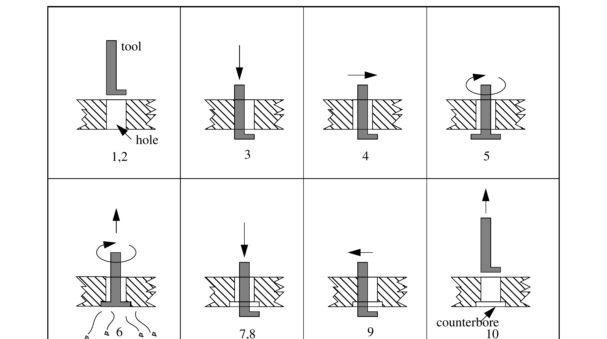

<a id="figure-1-g87-cycle"></a>
**Figure 1. G87 Cycle.** The eight subfigures are labelled with the steps from the description above.


<a id="3-5-16-9-g88-cycle"></a>
##### 3.5.16.9 G88 Cycle


The G88 cycle is intended for boring. This cycle uses a P word, where P specifies the number of
seconds to dwell. Program G88 X… Y… Z… A… B… C… R… L… P…

0. Preliminary motion, as described above.
1. Move the Z-axis only at the current feed rate to the Z position.
2. Dwell for the P number of seconds.
3. Stop the spindle turning.

4. Stop the program so the operator can retract the spindle manually.
5. Restart the spindle in the direction it was going.

<a id="3-5-16-10-g89-cycle"></a>
##### 3.5.16.10 G89 Cycle


The G89 cycle is intended for boring. This cycle uses a P number, where P specifies the number of
seconds to dwell. program G89 X… Y… Z… A… B… C… R… L… P…

0. Preliminary motion, as described above.
1. Move the Z-axis only at the current feed rate to the Z position.
2. Dwell for the P number of seconds.
3. Retract the Z-axis at the current feed rate to clear Z.

<a id="3-5-17-set-distance-mode-g90-and-g91"></a>
#### 3.5.17 Set Distance Mode — G90 and G91


Interpretation of RS274/NGC code can be in one of two distance modes: absolute or incremental.

To go into absolute distance mode, program G90. In absolute distance mode, axis numbers (X, Y,
Z, A, B, C) usually represent positions in terms of the currently active coordinate system. Any
exceptions to that rule are described explicitly in this Section 3.5.

To go into incremental distance mode, program G91. In incremental distance mode, axis numbers
(X, Y, Z, A, B, C) usually represent increments from the current values of the numbers.

I and J numbers always represent increments, regardless of the distance mode setting. K numbers
represent increments in all but one usage (see Section 3.5.16.8), where the meaning changes with
distance mode.

<a id="3-5-18-coordinate-system-offsets-g92-g92-1-g92-2-g92-3"></a>
#### 3.5.18 Coordinate System Offsets — G92, G92.1, G92.2, G92.3


See Section 3.2.2 for an overview of coordinate systems.

To make the current point have the coordinates you want (without motion), program G92 X…
Y… Z… A… B… C… , where the axis words contain the axis numbers you want. All axis words
are optional, except that at least one must be used. If an axis word is not used for a given axis, the
coordinate on that axis of the current point is not changed. It is an error if:

- all axis words are omitted.

When G92 is executed, the origin of the currently active coordinate system moves. To do this,
origin offsets are calculated so that the coordinates of the current point with respect to the moved
origin are as specified on the line containing the G92. In addition, parameters 5211 to 5216 are set
to the X, Y, Z, A, B, and C-axis offsets. The offset for an axis is the amount the origin must be
moved so that the coordinate of the controlled point on the axis has the specified value.

Here is an example. Suppose the current point is at X=4 in the currently specified coordinate
system and the current X-axis offset is zero, then G92 x7 sets the X-axis offset to -3, sets
parameter 5211 to -3, and causes the X-coordinate of the current point to be 7.

The axis offsets are always used when motion is specified in absolute distance mode using any of
the nine coordinate systems (those designated by G54 - G59.3). Thus all nine coordinate systems
are affected by G92.

Being in incremental distance mode has no effect on the action of G92.

Non-zero offsets may be already be in effect when the G92 is called. If this is the case, the new
value of each offset is A+B, where A is what the offset would be if the old offset were zero, and B
is the old offset. For example, after the previous example, the X-value of the current point is 7. If
G92 x9 is then programmed, the new X-axis offset is -5, which is calculated by [[7-9] + -3].

To reset axis offsets to zero, program G92.1 or G92.2. G92.1 sets parameters 5211 to 5216 to
zero, whereas G92.2 leaves their current values alone.

To set the axis offset values to the values given in parameters 5211 to 5216, program G92.3.

You can set axis offsets in one program and use the same offsets in another program. Program
G92 in the first program. This will set parameters 5211 to 5216. Do not use G92.1 in the
remainder of the first program. The parameter values will be saved when the first program exits
and restored when the second one starts up. Use G92.3 near the beginning of the second program.
That will restore the offsets saved in the first program. If other programs are to run between the
the program that sets the offsets and the one that restores them, make a copy of the parameter file
written by the first program and use it as the parameter file for the second program.

<a id="3-5-19-set-feed-rate-mode-g93-and-g94"></a>
#### 3.5.19 Set Feed Rate Mode — G93 and G94


Two feed rate modes are recognized: units per minute and inverse time. Program G94 to start the
units per minute mode. Program G93 to start the inverse time mode.

In units per minute feed rate mode, an F word (no, not that F word; we mean feedrate) is
interpreted to mean the controlled point should move at a certain number of inches per minute,
millimeters per minute, or degrees per minute, depending upon what length units are being used
and which axis or axes are moving.

In inverse time feed rate mode, an F word means the move should be completed in [one divided
by the F number] minutes. For example, if the F number is 2.0, the move should be completed in
half a minute.

When the inverse time feed rate mode is active, an F word must appear on every line which has a
G1, G2, or G3 motion, and an F word on a line that does not have G1, G2, or G3 is ignored. Being
in inverse time feed rate mode does not affect G0 (rapid traverse) motions. It is an error if:

- inverse time feed rate mode is active and a line with G1, G2, or G3 (explicitly or implicitly) does not have an F word.

<a id="3-5-20-set-canned-cycle-return-level-g98-and-g99"></a>
#### 3.5.20 Set Canned Cycle Return Level — G98 and G99


When the spindle retracts during canned cycles, there is a choice of how far it retracts: (1) retract
perpendicular to the selected plane to the position indicated by the R word, or (2) retract
perpendicular to the selected plane to the position that axis was in just before the canned cycle
started (unless that position is lower than the position indicated by the R word, in which case use
the R word position).

To use option (1), program G99. To use option (2), program G98. Remember that the R word has
different meanings in absolute distance mode and incremental distance mode.


<a id="3-6-input-m-codes"></a>
### 3.6 Input M Codes

M codes of the RS274/NGC language are shown in Table 7.

<a id="table-7-m-codes"></a>
**Table 7. M Codes**

| M Code | Meaning |
| --- | --- |
| M0 | program stop |
| M1 | optional program stop |
| M2 | program end |
| M3 | turn spindle clockwise |
| M4 | turn spindle counterclockwise |
| M5 | stop spindle turning |
| M6 | tool change |
| M7 | mist coolant on |
| M8 | flood coolant on |
| M9 | mist and flood coolant off |
| M30 | program end, pallet shuttle, and reset |
| M48 | enable speed and feed overrides |
| M49 | disable speed and feed overrides |
| M60 | pallet shuttle and program stop |


<a id="3-6-1-program-stopping-and-ending-m0-m1-m2-m30-m60"></a>
#### 3.6.1 Program Stopping and Ending — M0, M1, M2, M30, M60


To stop a running program temporarily (regardless of the setting of the optional stop switch),
program M0.

To stop a running program temporarily (but only if the optional stop switch is on), program M1.

It is OK to program M0 and M1 in MDI mode, but the effect will probably not be noticeable,
because normal behavior in MDI mode is to stop after each line of input, anyway.

To exchange pallet shuttles and then stop a running program temporarily (regardless of the setting
of the optional stop switch), program M60.

If a program is stopped by an M0, M1, or M60, pressing the cycle start button will restart the
program at the following line.

To end a program, program M2. To exchange pallet shuttles and then end a program, program
M30. Both of these commands have the following effects.

1. Axis offsets are set to zero (like G92.2) and origin offsets are set to the default (like G54).
2. Selected plane is set to CANON_PLANE_XY (like G17).
3. Distance mode is set to MODE_ABSOLUTE (like G90).
4. Feed rate mode is set to UNITS_PER_MINUTE (like G94).
5. Feed and speed overrides are set to ON (like M48).
6. Cutter compensation is turned off (like G40).
7. The spindle is stopped (like M5).
8. The current motion mode is set to G_1 (like G1).
9. Coolant is turned off (like M9).

No more lines of code in an RS274/NGC file will be executed after the M2 or M30 command is
executed. Pressing cycle start will start the program back at the beginning of the file.

<a id="3-6-2-spindle-control-m3-m4-m5"></a>
#### 3.6.2 Spindle Control — M3, M4, M5


To start the spindle turning clockwise at the currently programmed speed, program M3.

To start the spindle turning counterclockwise at the currently programmed speed, program M4.

To stop the spindle from turning, program M5.

It is OK to use M3 or M4 if the spindle speed is set to zero. If this is done (or if the speed override
switch is enabled and set to zero), the spindle will not start turning. If, later, the spindle speed is
set above zero (or the override switch is turned up), the spindle will start turning. It is OK to use
M3 or M4 when the spindle is already turning or to use M5 when the spindle is already stopped.

<a id="3-6-3-tool-change-m6"></a>
#### 3.6.3 Tool Change — M6


To change a tool in the spindle from the tool currently in the spindle to the tool most recently
selected (using a T word — see Section 3.7.3), program M6. When the tool change is complete:

- The spindle will be stopped.
- The tool that was selected (by a T word on the same line or on any line after the previous tool change) will be in the spindle. The T number is an integer giving the changer slot of the tool (not its id).
- If the selected tool was not in the spindle before the tool change, the tool that was in the spindle (if there was one) will be in its changer slot.
- The coordinate axes will be stopped in the same absolute position they were in before the tool change (but the spindle may be re-oriented).
- No other changes will be made. For example, coolant will continue to flow during the tool change unless it has been turned off by an M9.

The tool change may include axis motion while it is in progress. It is OK (but not useful) to
program a change to the tool already in the spindle. It is OK if there is no tool in the selected slot;
in that case, the spindle will be empty after the tool change. If slot zero was last selected, there
will definitely be no tool in the spindle after a tool change.

<a id="3-6-4-coolant-control-m7-m8-m9"></a>
#### 3.6.4 Coolant Control — M7, M8, M9


To turn mist coolant on, program M7.

To turn flood coolant on, program M8.

To turn all coolant off, program M9.

It is always OK to use any of these commands, regardless of what coolant is on or off.

<a id="3-6-5-override-control-m48-and-m49"></a>
#### 3.6.5 Override Control — M48 and M49


To enable the speed and feed override switches, program M48. To disable both switches, program
M49. See Section 2.2.1 for more details. It is OK to enable or disable the switches when they are
already enabled or disabled.


<a id="3-7-other-input-codes"></a>
### 3.7 Other Input Codes


<a id="3-7-1-set-feed-rate-f"></a>
#### 3.7.1 Set Feed Rate — F


To set the feed rate, program F… . The application of the feed rate is as described in Section
2.1.2.5, unless inverse time feed rate mode is in effect, in which case the feed rate is as described
in Section 3.5.19.

<a id="3-7-2-set-spindle-speed-s"></a>
#### 3.7.2 Set Spindle Speed — S


To set the speed in revolutions per minute (rpm) of the spindle, program S… . The spindle will
turn at that speed when it has been programmed to start turning. It is OK to program an S word
whether the spindle is turning or not. If the speed override switch is enabled and not set at 100%,
the speed will be different from what is programmed. It is OK to program S0; the spindle will not
turn if that is done. It is an error if:

- the S number is negative.

As described in Section 3.5.16.5, if a G84 (tapping) canned cycle is active and the feed and speed
override switches are enabled, the one set at the lower setting will take effect. The speed and feed
rates will still be synchronized. In this case, the speed may differ from what is programmed, even
if the speed override switch is set at 100%.

<a id="3-7-3-select-tool-t"></a>
#### 3.7.3 Select Tool — T


To select a tool, program T…, where the T number is the carousel slot for the tool. The tool is not
changed until an M6 is programmed (see Section 3.6.3). The T word may appear on the same line
as the M6 or on a previous line. It is OK, but not normally useful, if T words appear on two or
more lines with no tool change. The carousel may move a lot, but only the most recent T word
will take effect at the next tool change. It is OK to program T0; no tool will be selected. This is
useful if you want the spindle to be empty after a tool change. It is an error if:

- a negative T number is used,
- a T number larger than the number of slots in the carousel is used.

On some machines, the carousel will move when a T word is programmed, at the same time
machining is occurring. On such machines, programming the T word several lines before a tool
change will save time. A common programming practice for such machines is to put the T word
for the next tool to be used on the line after a tool change. This maximizes the time available for
the carousel to move.


<a id="3-8-order-of-execution"></a>
### 3.8 Order of Execution

The order of execution of items on a line is critical to safe and effective machine operation. Items
are executed in the order shown in Table 8 if they occur on the same line.

<a id="table-8-order-of-execution"></a>
**Table 8. Order of Execution**

| Order | Item |
| --- | --- |
| 1 | comment (includes message) |
| 2 | set feed rate mode (G93, G94 — inverse time or per minute) |
| 3 | set feed rate (F) |
| 4 | set spindle speed (S) |
| 5 | select tool (T) |
| 6 | change tool (M6) |
| 7 | spindle on or off (M3, M4, M5) |
| 8 | coolant on or off (M7, M8, M9) |
| 9 | enable or disable overrides (M48, M49) |
| 10 | dwell (G4) |
| 11 | set active plane (G17, G18, G19) |
| 12 | set length units (G20, G21) |
| 13 | cutter radius compensation on or off (G40, G41, G42) |
| 14 | cutter length compensation on or off (G43, G49) |
| 15 | coordinate system selection (G54–G59.3) |
| 16 | set path control mode (G61, G61.1, G64) |
| 17 | set distance mode (G90, G91) |
| 18 | set retract mode (G98, G99) |
| 19 | home (G28, G30) or change coord. system data (G10) or set axis offsets (G92, G92.1, G92.2, G92.3) |
| 20 | perform motion (G0–G3, G80–G89), as modified by G53 |
| 21 | stop (M0, M1, M2, M30, M60) |


<a id="4-output-the-canonical-machining-functions"></a>
## 4 Output: the Canonical Machining Functions


<a id="4-1-introduction"></a>
### 4.1 Introduction

This section describes the canonical machining functions. This section is intended to be useful to
developers, researchers, and NC programmers using the SAI. Others should not need to read it.
Earlier, but nearly identical, versions of these functions were described in a separate report,
“Canonical Machining Commands” [Proctor].

The context for canonical machining functions is in a hierarchical control system. These functions
are intended to tell a controller what to do at the control level below the level in which the
Interpreter is running.

<a id="4-1-1-objectives-of-canonical-machining-functions"></a>
#### 4.1.1 Objectives of Canonical Machining Functions


The canonical machining functions were devised with three objectives in mind.

First, all the functionality of common 3-axis to 6-axis machining centers (not turning centers) had
to be covered by the functions; for any function a machining center can perform, there has to be a
way to tell it to do that function.

Second, it was desired that it be possible to use readily available commercial motion control
boards from various vendors to carry out those canonical functions which call for motion, with
roughly a one-to-one correspondence between a canonical motion function and a command a
commercial board recognizes.

Third, it must be possible to interpret RS274 commands into canonical machining function calls.

The first and third objectives still apply completely. The second objective, compatibility with
motion control boards, has become less important as computer speed and power has increased to
the point that motion control boards are not essential.

The canonical machining functions are atomic commands. Each function produces a single tool
motion or a single logical action. Keeping the functions atomic was a side condition we imposed,
both for clarity and to make mappings to commercial control boards straightforward. RS274
commands, on the other hand, include two types: those for which a single RS274 command
corresponds exactly to a canonical function call, and those for which a single RS274 command
will be decomposed into several canonical function calls (possibly dozens). Things like “move in
a straight line” or “turn flood coolant on” are of the first type. Things like “turn all coolant off” or
“run a peck drilling cycle” are of the second type.

<a id="4-1-2-implementing-canonical-machining-functions"></a>
#### 4.1.2 Implementing Canonical Machining Functions


The name of each canonical machining function indicates roughly what it does. This report gives
the syntax of the functions and gives function prototypes in the C or C++ programming language.
The report also gives the semantics of the functions — what should happen when each function is
executed. To aid in expressing functions, a number of types are defined (CANON_PLANE, for
example). Each such type can have only a few symbolic values. CANON_PLANE must be one of
CANON_PLANE_XY, CANON_PLANE_YZ, or CANON_PLANE_XZ, for example. All of
these types are defined in Section 4.3.

This report does not provide definitions of the functions in any programming language. Sets of
definitions for the canonical machining functions have been written in C++ for the controllers we
have built which use them. Executing a function from any of these sets of definitions causes a
machining center to do something.

We have used two other types of sets of definitions. The first alternate type simply has the
function call print itself. Executing a function call causes a line of text containing the function call
to be written to standard output or to a file. This type of set of definitions is used in the SAI. The
second alternate type is also used for testing and debugging. In this type, executing a canonical
function call generates a set of graphics calls for displaying a computer picture of the tool path
made by executing the function call. A system has been built using this set with the Interpreter
and the SAI driver to provide a graphical simulation of executing an RS274 program.

The Interpreter uses most but not all of the canonical machining functions. Those that are used are
listed in Table 9.


<a id="table-9-canonical-machining-functions-called-by-interpreter"></a>
**Table 9. Canonical Machining Functions Called By Interpreter**

| Functionality | Functions |
| --- | --- |
| Representation | SET_ORIGIN_OFFSETS(double x, double y, double z, double a, double b, double c) / USE_LENGTH_UNITS(CANON_UNITS units) |
| Free Space Motion | STRAIGHT_TRAVERSE(double x, double y, double z, double a, double b, double c) |
| Machining Attributes | SELECT_PLANE(CANON_PLANE plane) / SET_FEED_RATE(double rate) / SET_FEED_REFERENCE(CANON_FEED_REFERENCE reference) / SET_MOTION_CONTROL_MODE(CANON_MOTION_MODE mode) / START_SPEED_FEED_SYNCH() / STOP_SPEED_FEED_SYNCH() |
| Machining Functions | ARC_FEED(double first_end, double second_end, double first_axis, double second_axis, int rotation, double axis_end_point, double a, double b, double c) / DWELL(double seconds) / STRAIGHT_FEED(double x, double y, double z, double a, double b, double c) |
| Probe Functions | STRAIGHT_PROBE(double x, double y, double z, double a, double b, double c) |
| Spindle Functions | ORIENT_SPINDLE(double orientation, CANON_DIRECTION direction) / SET_SPINDLE_SPEED(double r) / START_SPINDLE_CLOCKWISE() / START_SPINDLE_COUNTERCLOCKWISE() / STOP_SPINDLE_TURNING() |
| Tool Functions | CHANGE_TOOL(int slot) / SELECT_TOOL(int i) / USE_TOOL_LENGTH_OFFSET(double offset) |
| Miscellaneous Functions | COMMENT(char *s) / DISABLE_FEED_OVERRIDE() / DISABLE_SPEED_OVERRIDE() / ENABLE_FEED_OVERRIDE() / ENABLE_SPEED_OVERRIDE() / FLOOD_OFF() / FLOOD_ON() / INIT_CANON() / MESSAGE(char *s) / MIST_OFF() / MIST_ON() / PALLET_SHUTTLE() |
| Program Functions | OPTIONAL_PROGRAM_STOP() / PROGRAM_END() / PROGRAM_STOP() |


*Function arguments are written in ANSI C style. All functions return nothing.*


<a id="4-2-canonical-machining-function-view-of-a-machining-center"></a>
### 4.2 Canonical Machining Function View of a Machining Center

The canonical machining functions are based on a particular view of what a machining center to
be controlled is like. The view is as described in Section 2.1, with the changes described below.
Some differences between the canonical machining function view and the RS274/NGC language
view are given here.

<a id="4-2-1-mechanical-components"></a>
#### 4.2.1 Mechanical Components


<a id="4-2-1-1-coolant"></a>
##### 4.2.1.1 Coolant


In addition to mist coolant and flood coolant, a machining center may have through-tool coolant.
In the RS274/NGC language view, there is no through-tool coolant.

<a id="4-2-1-2-axis-clamps"></a>
##### 4.2.1.2 Axis Clamps


Each axis may have a physical device which, when activated, clamps the axis so it does not move.
In the RS274/NGC language view, there are no axis clamps.

<a id="4-2-2-control-components"></a>
#### 4.2.2 Control Components


The following control components are included in the canonical machining function view of a
how a machining center may be controlled, but are not included in the RS274/NGC view. These
control components cannot be used by a direct command from an RS274/NGC program, since
they are not included in the language. Only coordination of axis and spindle motion is used
indirectly by the Interpreter. That is used for implementing the G84 tapping canned cycle.

<a id="4-2-2-1-coolant"></a>
##### 4.2.2.1 Coolant


Each type of coolant can be turned off independently. In the RS274/NGC view, although the
different types of coolant may be turned on independently, all coolant is turned off by a single
command.

<a id="4-2-2-2-axis-clamps"></a>
##### 4.2.2.2 Axis Clamps


Each axis may be commanded to clamp so it does not move, and commanded to unclamp. If the
axis has a physical clamp, that clamp should be used. A software clamp may be used. Clamping
any one axis or set of axes does not affect motion along the unclamped axes.

<a id="4-2-2-3-elliptical-arc-motion"></a>
##### 4.2.2.3 Elliptical Arc Motion


Any pair of the linear axes (XY, YZ, XZ) can be controlled to move in an elliptical arc in the plane
of that pair of axes. While this is occurring, the third linear axis and the rotational axes can be
controlled to move simultaneously at effectively a constant rate. As above, the motions can be
coordinated so that acceleration and deceleration do not affect the path.

<a id="4-2-2-4-coordinated-motion-of-axes-and-spindle"></a>
##### 4.2.2.4 Coordinated Motion of Axes and Spindle


The rotation of the spindle can be coordinated with axis motion or de-coupled from it. In the
RS274/NGC view, this is not programmable, but coordination occurs during tapping; see Section
3.5.16.5.

<a id="4-2-2-5-feed-reference"></a>
##### 4.2.2.5 Feed Reference


The current feed rate may be referenced either to XYZ axis motion or to motion of the controlled
point with respect to the workpiece. Only the XYZ feed reference is used in the Interpreter. In the
RS274/NGC view, the XYZ feed reference is always used, so there is no command to change the
feed reference.

<a id="4-2-2-6-feed-and-speed-overrides"></a>
##### 4.2.2.6 Feed and Speed Overrides


These two switches may be enabled or disabled independently; in the RS274/NGC view, one
single command enables both, and another single command disables both.

<a id="4-2-2-7-units"></a>
##### 4.2.2.7 Units


Units used for distances along the X, Y, and Z axes may be measured centimeters, in addition to
millimeters or inches. The RS274/NGC view does not include using centimeters. Centimeters are
not used in the Interpreter.

<a id="4-2-2-8-coordinate-systems"></a>
##### 4.2.2.8 Coordinate Systems


There are two coordinate systems: the absolute coordinate system of a machining center and a
“program” coordinate system in which all axes may be offset from their absolute position. The
offsets may be changed. All axis values given in all function calls (other than a function call
setting the offsets) are expressed in terms of the program coordinate system.

<a id="4-2-3-error-conditions"></a>
#### 4.2.3 Error Conditions


The controller which executes the canonical machining function calls should have at least two
conditions: OK and error. If the controller is in the OK condition, it should perform as described
here. If the controller is in the error condition, its behavior is up to the implementation. An
implementation should document what its behavior is for all errors. A generic error behavior
which we believe is reasonable is to stop execution of the current function call as soon as an error
is detected and to be unwilling to execute any other canonical function calls until the error
condition is corrected.

Many situations should put the controller into the error condition, as described later in this report.
Wherever the phrase “it is an error” (or the equivalent) is used to describe a situation that may
occur in the execution of a function call, the controller should always check for that situation
during execution of the function call and should go into the error condition as soon as the situation
is detected if the situation occurs.

In this report, error detection is described as being performed only by the controller receiving the
canonical machining function calls. In an implementation, error detection might also be
performed by the controller sending the function calls.

<a id="4-3-the-canonical-machining-functions-defined"></a>
### 4.3 The Canonical Machining Functions Defined


<a id="4-3-1-preliminaries"></a>
#### 4.3.1 Preliminaries


<a id="4-3-1-1-syntax"></a>
##### 4.3.1.1 Syntax


The canonical machining functions are defined here using C++ syntax in courier type font.
The same syntax is usable in ANSI C. Syntaxes for other computer languages may be derived
readily without changing the semantics of the functions. All the canonical functions return void,
so that bit of syntax is suppressed here.

Where an attribute may take on discrete values from a fixed set of values, the set is given here.
The values in such sets are represented here as symbols beginning with “CANON_”. In our
implementations we have used both #define’s and enum’s for these symbols.

As given here, the functions include the A, B, and C rotational axes. If any of the rotational axis is
not to be used, just omit the argument for that axis.

<a id="4-3-1-2-function-call-errors"></a>
##### 4.3.1.2 Function Call Errors


It is an error to call any function incorrectly. The arguments to a function must be as described
here. This applies to the number and type of the arguments and also to the stated constraints on the
arguments (such as being non-negative or being positive).

<a id="4-3-1-3-groups-of-functions"></a>
##### 4.3.1.3 Groups of Functions


The canonical machining functions are grouped here into related sets. The grouping is for
convenience only, and is not part of the definition. Within each group, the functions are listed
alphabetically.

<a id="4-3-1-4-rotational-motion-required"></a>
##### 4.3.1.4 Rotational Motion Required


In the descriptions of the functions, the phrase “if there is rotational motion” is often used. In all
cases, there is rotational motion if any of the rotational axis values in the function call differs from
the current value of that axis.

<a id="4-3-2-initialization-and-termination"></a>
#### 4.3.2 Initialization and Termination


<a id="4-3-2-1-init-canon"></a>
##### 4.3.2.1 Init_canon


```
INIT_CANON ()
```
Do whatever initialization is required to be ready to execute other canonical machining functions.
A call to this function should always be made before calling any other canonical machining
function. Of course, the controller must already have been brought up to the state where it can
read and execute this function call before the function call is received. That phase of initialization
is outside the scope of this report.

<a id="4-3-2-2-end-canon"></a>
##### 4.3.2.2 End_canon


```
END_CANON ()
```
Do whatever is required to shut down in an orderly fashion. After a call to this function has been
executed, if it is desired to begin executing function calls again, the first function call must be an
INIT_CANON function call.

<a id="4-3-3-representation"></a>
#### 4.3.3 Representation


<a id="4-3-3-1-select-plane"></a>
##### 4.3.3.1 Select_plane


```
SELECT_PLANE (CANON_PLANE plane)
```
Use the plane designated by plane as the selected plane. The type CANON_PLANE may have
the value CANON_PLANE_XY, CANON_PLANE_YZ, or CANON_PLANE_XZ. Any of these
is an acceptable values for plane.


<a id="4-3-3-2-set-origin-offsets"></a>
##### 4.3.3.2 Set_origin_offsets

```
SET_ORIGIN_OFFSETS (double x, double y, double z,
double a, double b, double c)
```
Set the program origin at the point with absolute coordinates x, y, z, a, b, and c. The units for x,
y, and z are whatever length units are being used at the time a call to this function is made. The
units for a, b, and c are degrees. The effective location of the program origin should not change
when units change. It is expected that controllers dealing with the program origin will ensure this.
In a typical implementation, the numbers representing the coordinates will be changed when units
change.

<a id="4-3-3-3-use-length-units"></a>
##### 4.3.3.3 Use_length_units

```
USE_LENGTH_UNITS (CANON_UNITS units)
```
Use the specified units for length. The type CANON_UNITS is defined which may have the
value       CANON_UNITS_INCHES,                CANON_UNITS_MM                (millimeters),        or
CANON_UNITS_CM (centimeters). Any of these is an acceptable values of units. Changing
units changes the effective numerical value of the current position. All other stored values which
involve length units are not changed, including: coordinate system offsets, tool length offsets, tool
diameters, feed rate, and traverse rate.
The Interpreter does not use CANON_UNITS_CM because there is no code for it in the RS274/
NGC language.

<a id="4-3-4-free-space-motion"></a>
#### 4.3.4 Free Space Motion


<a id="4-3-4-1-set-traverse-rate"></a>
##### 4.3.4.1 Set_traverse_rate

```
SET_TRAVERSE_RATE (double rate)
```
Set the upper limit on the rate that will be used during rapid axis motion, motion during which
cutting does not normally take place. During moves conducted at traverse rate, coordinated linear
motion should take place as fast as possible or at this rate, whichever is less. The rate must be
positive. The application of the rate is as described in Section 2.1.2.5.

<a id="4-3-4-2-straight-traverse"></a>
##### 4.3.4.2 Straight_traverse

```
STRAIGHT_TRAVERSE (double x, double y, double z,
double a, double b, double c)
```
Make a coordinated linear motion at traverse rate from the current position to the point given by
x, y, z, a, b, and c. The application of the rate is as described in Section 4.3.5.1 for when the feed
reference mode is CANON_XYZ, regardless of the setting of feed reference mode.

It is expected that no cutting will occur while a traverse move is being made.

<a id="4-3-5-machining-attributes"></a>
#### 4.3.5 Machining Attributes


<a id="4-3-5-1-set-feed-rate"></a>
##### 4.3.5.1 Set_feed_rate


```
SET_FEED_RATE (double rate)
```
Set to rate the feed rate that will be used when the controlled point is told to move at the
currently set feed rate. The rate must be non-negative.

1. If the feed reference mode is CANON_WORKPIECE:
the rate means length units per minute of the controlled point along the programmed
path as seen by the workpiece.
2. If the feed reference mode is CANON_XYZ the interpretation of feed rate is as described
in Section 2.1.2.5.

The canonical machining functions (unlike the RS274/NGC language) do not include the notion
of inverse time feed rate, so the question of behavior under inverse time feed rate does not arise.

The feed rate may also be affected by the feed override switch, if that switch is enabled.

If the USE_SPINDLE_FORCE or USE_SPINDLE_TORQUE mode is in effect, the set feed rate
is an upper limit for the feed rate determined from the force or torque. While either of these
modes is in effect, if the feed override switch is enabled and is set to change the feed rate, the feed
rate determined from the force or torque and the upper limit are both changed proportionally. For
example, if the feed rate is set to 600 millimeters per minute and the feed override switch is
enabled and set to 80%, and the torque on the spindle is such that the machine would feed at 500
millimeters per minute if the override switch were disabled, then the actual feed rate should be
400 millimeters per minute (80% of 500), and the upper limit should be 480 millimeters per
minute (80% of 600).

<a id="4-3-5-2-set-feed-reference"></a>
##### 4.3.5.2 Set_feed_reference


```
SET_FEED_REFERENCE (CANON_FEED_REFERENCE reference)
```
This sets the feed reference mode. The type CANON_FEED_REFERENCE is defined. It may
have the value CANON_WORKPIECE (feed rate is from the point of view of the workpiece) or
CANON_XYZ (feedrate is in terms of axis motion). Either is an acceptable value of
reference.

The meaning of feed rate changes depending on the feed reference mode. See the discussion
immediately above.

The CANON_WORKPIECE feed reference mode is more natural and general, since the rate at
which the tool passes through the material must be controlled for safe and effective machining.
This mode does introduce complications, however.

First, some rule is required to define what the path should be. We have adopted the rule that the
path should be the same as it is in the CANON_XYZ mode.

Second, computing the feed rate for each axis may be time-consuming because the trajectories
that result from motion in four or more axes may be complex. Computation of axis feed rates
when only XYZ motion is considered is relatively simple for two of the standard motion types
(straight lines and helical or circular arcs).

Third, in CANON_WORKPIECE mode, some motions cannot be carried out as fast as the
programmed feed rate would require because axis motions may tend to cancel each other. For
example, an arc in the XZ-plane can exactly cancel a rotation around the B-axis, so that the
location of the controlled point with respect to the workpiece does not change at all during the
motion; in this case, the motion should take no time, which is impossible at any finite rate of axis
motion. In such cases, the axes should be moved as fast as possible consistent with accurate
machining.

Some (perhaps most or all) existing dialects of RS274 use only the CANON_XYZ mode [K&T,
page 3.9]. The specification of RS274/NGC is not clear [NCMS, page 22], but appears to intend
CANON_XYZ mode. Some dialects avoid the problem of dealing with how to interpret a per-
minute feed rate when rotational axis motion occurs simultaneously with XYZ motion by
suggesting [K&T, page 3.9] or requiring [Monarch, page 17-3] that the programmer use inverse-
time feed rate mode. It may be that the calculations required in CANON_WORKPIECE mode
were too extensive to be carried out sufficiently fast by real-time processors that existed at the
time these languages were defined. Current real-time processors should be sufficiently fast to
handle the calculations.

<a id="4-3-5-3-set-motion-control-mode"></a>
##### 4.3.5.3 Set_motion_control_mode


```
SET_MOTION_CONTROL_MODE (CANON_MOTION_MODE mode)
```
Set the path control mode. The type CANON_MOTION_MODE is defined. It may have the value
CANON_EXACT_STOP, CANON_EXACT_PATH, or CANON_CONTINUOUS. Any of these
is an acceptable value of mode.

In CANON_EXACT_STOP mode, the control stops motion at the end of each move exactly
(within the tolerance the control system can achieve) at the programmed or calculated end point.
The stop is preceded by deceleration at the maximum normal rate, so that motion is kept at the set
feed rate for as long as possible. If there is a subsequent move, the stop is as brief as possible and
is followed by acceleration to the programmed feed rate at the maximum normal rate of
acceleration.

In CANON_EXACT_PATH mode, the control keeps the controlled point on the programmed or
calculated path within the tolerance the control system can achieve at all times. At points which
are the end point of one move and the start point of the next move, the feed rate is kept constant if
possible. It should be possible to avoid changing the rate of motion at such a juncture if the
direction of the path of the controlled point does not change sharply at the juncture, for example if
one straight move is in the same direction as the previous one, or if a straight move is tangent to a
preceding or following arc move.

In CANON_CONTINUOUS mode, the control tries to keep the feed rate constant and does not
try to keep the controlled point exactly on the path at all times. Rather, at junctures between
moves where the direction changes sharply, the corner is rounded. There is a maximum allowable
deviation at such junctures, and the control should never allow that to be exceeded; acceleration
and deceleration may be performed if necessary to do this.

Currently, there is no function            to   set   the   maximum       deviation    allowable    in
CANON_CONTINUOUS mode.

<a id="4-3-5-4-start-speed-feed-synch"></a>
##### 4.3.5.4 Start_speed_feed_synch


```
START_SPEED_FEED_SYNCH ()
```
Begin exact synchronization of spindle turning with feed motion.

The primary purpose of this synchronization is to provide for effective tapping of holes. In order
to make a clean thread, the axial motion of a tap must be synchronized with its turning motion. In
addition to this synchronization, the feed and speed rates must be set so their ratio is suitable for
the pitch of the thread.
The type CANON_SPEED_FEED_MODE is defined. It may have the value
CANON_SYNCHED (for coupled) or CANON_INDEPENDENT (for uncoupled). The type is
used by the Interpreter to keep track of the current state of synchronization.

<a id="4-3-5-5-stop-speed-feed-synch"></a>
##### 4.3.5.5 Stop_speed_feed_synch


```
STOP_SPEED_FEED_SYNCH ()
```
Stop forcing synchronization of spindle turning with feed motion. Deal with acceleration and
deceleration of the spindle and the axes independently.

<a id="4-3-6-machining-functions"></a>
#### 4.3.6 Machining Functions


<a id="4-3-6-1-arc-feed"></a>
##### 4.3.6.1 Arc_feed


```
ARC_FEED (double first_end, double second_end,
double first_axis, double second_axis, int rotation,
double axis_end_point, double a, double b, double c)
```
Move in a helical arc from the current position at the existing feed rate. The axis of the helix is
parallel to the X, Y, or Z-axis, according to which one is perpendicular to the selected plane. The
helical arc may degenerate to a circular arc if there is no motion parallel to the axis of the helix.

If the selected plane is the XY-plane:

1. first_end is the X coordinate of the end of the arc.
2. second_end is the Y coordinate of the end of the arc.
3. first_axis is the X coordinate of the axis (center) of the arc.
4. second_axis is the Y coordinate of the axis (center) of the arc.
5. axis_end_point is the Z coordinate of the end of the arc.

If the selected plane is the YZ-plane:

1. first_end is the Y coordinate of the end of the arc.
2. second_end is the Z coordinate of the end of the arc.
3. first_axis is the Y coordinate of the axis (center) of the arc.
4. second_axis is the Z coordinate of the axis (center) of the arc.
5. axis_end_point is the X coordinate of the end of the arc.

If the selected plane is the XZ-plane:

1. first_end is the Z coordinate of the end of the arc.
2. second_end is the X coordinate of the end of the arc.
3. first_axis is the Z coordinate of the axis (center) of the arc.
4. second_axis is the X coordinate of the axis (center) of the arc.
5. axis_end_point is the Y coordinate of the end of the arc.

If rotation is positive, the arc is traversed counterclockwise as viewed from the positive end of
the coordinate axis perpendicular to the currently selected plane. If rotation is negative, the
arc is traversed clockwise. If rotation is 0, first_end and second_end must be the same as
the corresponding coordinates of the current position and no arc is made (but there may be
translation parallel to the axis perpendicular to the selected plane and rotational axis motion). If
rotation is 1, more than 0 but not more than 360 degrees of arc should be made. In general, if
rotation is n, n is not 0, and we let N be the absolute value of n, the absolute value of the
amount of rotation in the arc should be more than ([N-1] x 360) but not more than (N x 360).

The radius of the helix is determined by the distance from the current position to the axis of helix
or by the distance from the end location to the axis of the helix. It is an error if the two radii are
not the same (within some tolerance, to be set by the implementation).

The feed rate applies to the distance traveled along the helix. This differs from many existing
systems, which apply the feed rate to the distance traveled by a point on a circle which is the
projection of the helix on a plane perpendicular to the axis of the helix.

Rotational axis motion along with helical XYZ motion has no known applications, but is not
illegal. Rotational axis motion is handled as follows, if there is rotational motion.

1. If the feed reference mode is CANON_XYZ: Perform XYZ motion as if no rotational
motion were specified. While the XYZ motion is going on, move the rotational axes in
coordinated linear motion.
2. If the feed reference mode is CANON_WORKPIECE: the path to follow is the path that
would be followed if the feed reference mode were CANON_XYZ, but the rate along
that path should be kept constant at the programmed feed rate. This will usually cause
variable rates along all moving axes.

<a id="4-3-6-2-dwell"></a>
##### 4.3.6.2 Dwell


```
DWELL (double seconds)
```
Do not move the axes for the time specified by the seconds argument, which must be positive.

<a id="4-3-6-3-ellipse-feed"></a>
##### 4.3.6.3 Ellipse_feed


```
ELLIPSE_FEED (double major, double minor,
double angle_to_first, double first_end,
double second_end,
double first_axis, double second_axis, int rotation,
double axis_end_point, double a, double b, double c)
```
Move in an elliptical helical arc from the current position at the existing feed rate. The axis of the
helix is parallel to the X, Y, or Z-axis, according to which one is perpendicular to the selected
plane. The elliptical helical arc may degenerate to an elliptical arc if there is no motion parallel to
the axis of the helix.

The length of the major axis (not the semi-major axis) of the ellipse is given by major, and the
length of the minor axis by minor.

If the selected plane is the XY-plane:

1. angle_to_first is the angle between the major axis of the ellipse and the +X-axis.
2. first_end is the X coordinate of the end of the arc.
3. second_end is the Y coordinate of the end of the arc.
4. first_axis is the X coordinate of the axis (center) of the arc.
5. second_axis is the Y coordinate of the axis (center) of the arc.
6. axis_end_point is the Z coordinate of the end of the arc.


If the selected plane is the YZ-plane:

1. angle_to_first is the angle between the major axis of the ellipse and the +Y-axis.
2. first_end is the Y coordinate of the end of the arc.
3. second_end is the Z coordinate of the end of the arc.
4. first_axis is the Y coordinate of the axis (center) of the arc.
5. second_axis is the Z coordinate of the axis (center) of the arc.
6. axis_end_point is the X coordinate of the end of the arc.

If the selected plane is the XZ-plane:

1. angle_to_first is the angle between the major axis of the ellipse and the +Z-axis.
2. first_end is the Z coordinate of the end of the arc.
3. second_end is the X coordinate of the end of the arc.
4. first_axis is the Z coordinate of the axis (center) of the arc.
5. second_axis is the X coordinate of the axis (center) of the arc.
6. axis_end_point is the Y coordinate of the end of the arc.

If rotation is positive, the arc is traversed counterclockwise as viewed from the positive end of
the coordinate axis perpendicular to the currently selected plane. If rotation is negative, the
arc is traversed clockwise. If rotation is 0, first_end and second_end must be the same as
the corresponding coordinates of the current position and no arc is made (but there may be
translation parallel to the axis perpendicular to the selected plane and rotational axis motion). If
rotation is 1, more than 0 but not more than 360 degrees of arc should be made. In general, if
rotation is n, n is not 0, and we let N be the absolute value of n, the absolute value of the
amount of rotation in the arc should be more than ([N-1] x 360) but not more than (N x 360).

Rotational axis motion along with elliptical helix XYZ motion has no known applications, but is
not illegal. Rotational axis motion is handled as follows, if there is rotational motion.

1. If the feed reference mode is CANON_XYZ: Perform XYZ motion as if no rotational
motion were specified. While the XYZ motion is going on, move the rotational axes in
coordinated linear motion.
2. If the feed reference mode is CANON_WORKPIECE: the path to follow is the path that
would be followed if the feed reference mode were CANON_XYZ, but the rate along
that path should be kept constant at the programmed feed rate. This will usually cause
variable rates along all moving axes.

The ellipse_feed function is much like the arc_feed function, except that the tool path is an
elliptical helix rather than a circular helix. With an elliptical helix, there are at least two choices
for how to coordinate motion parallel to the axis of the helix with motion around the axis. In both
cases, we focus on a point P traveling along the elliptical helix. The “projected ellipse” of the
helix is the projection of the helix on any plane perpendicular to the axis of the helix (which is, by
definition, an ellipse). We define P’ to be the projection of P on the projected ellipse and P” to be
the projection of P on the axis.

1. The slope along the helix is constant. In other words, there is some constant k, such that for
any distance d traveled by P’ around the projected ellipse, the distance traveled along the
axis by P” is kd.
2. The amount of travel along the axis by P” is proportional to the angle swept by a line from
the center of the projected ellipse to P’. This rule produces a variable slope which is
steeper on the pointy ends of the ellipse.

We have implemented the second of these — because that is what the motion control board we
were using would do. It might be useful to add a setting for the machining center or another
argument to the function so that either of the two trajectory types could be selected.

The feed rate applies to the distance travelled along the helix by P. This differs from the one
existing system we have used, which applies the feed rate to the distance traveled by a point on a
circle which is a projection of the projected ellipse.

It is an error if the projections of the current point and the end point of the arc do not lie on the
projected ellipse (within some tolerance, to be set by the implementation).

The functionality of the arc_feed function is the same as what the ellipse_feed function will do if
the major and minor axes of the ellipse are equal. In that case, the value of the angle of the X-axis
with the major axis of the ellipse is irrelevant, and the two trajectory rules give the same
trajectory. It is useful to have both functions, however, because many applications may wish to
implement only arc_feed, and because the arc_feed function is simpler.

<a id="4-3-6-4-stop"></a>
##### 4.3.6.4 Stop


```
STOP ()
```
Stop axis motion. Regardless of the current path control mode, come briefly to a stop at the end
point of the last programmed move before going on to the next move.

<a id="4-3-6-5-straight-feed"></a>
##### 4.3.6.5 Straight_feed


```
STRAIGHT_FEED (double x, double y, double z,
double a, double b, double c)
```
If there is no rotational motion, move the controlled point in a straight line at feed rate from the
current position to the point given by the x, y, and z arguments. Do not move the rotational axes.

If there is rotational motion:

1. If the feed reference mode is CANON_XYZ, perform XYZ motion as if there were no
rotational motion. While the XYZ motion is going on, move the rotational axes in
coordinated linear motion.
2. If the feed reference mode is CANON_WORKPIECE, the path to follow is the path that
would be followed if the feed reference mode were CANON_XYZ, but the rate along
that path should be kept constant.

<a id="4-3-6-6-straight-probe"></a>
##### 4.3.6.6 Straight_probe


```
STRAIGHT_PROBE (double x, double y, double z,
double a, double b, double c)
```
This performs a probing operation. A probe must be in the spindle. The probe may be a touch
probe or a non-contact probe. There must be no rotational motion. The probe must not be already
tripped when execution of a call to this function starts. The spindle must not be turning. The probe
must be turned on. It is an error if any of those “musts” does not hold.

Points to be probed are usually not exactly where expected, so a small overshoot distance is
included in probe motion. An overshoot point is defined by extending the line from the current
point to the programmed point by the overshoot distance.

To execute a call to this function, start by moving the probe in a straight line at the currently
programmed feed rate from the current position toward the overshoot point. The next steps
depend on what type of probe is being used.

For a touch probe, it is expected that the probe will be tripped before the overshoot point is
reached. It is an error for the probe to reach that position without being tripped. If the probe is
tripped before the overshoot point is reached, the control should stop moving the axes as quickly
as possible, move the axes back to where they were when the probe tripped, and stop at that point.

For a non-contact probe, it is expected that the probe will reach the programmed position. It is an
error if not. The probe should either decelerate and stop at that point (gathering data all the way),
or continue at full feed rate through the point (gathering data all the way), stop gathering data and
stop moving as fast as feasible, then move back to the programmed position and stop.

An implementation may put limits on the acceptable range of feed rates for probing, as strict as
requiring a specific value. It is an error to execute a straight_probe function call if the feed rate is
not within the allowed range.

Functions for the Interpreter to call to get data after probing are given in Appendix D.6.

<a id="4-3-7-spindle-functions"></a>
#### 4.3.7 Spindle Functions


<a id="4-3-7-1-orient-spindle"></a>
##### 4.3.7.1 Orient_spindle


```
ORIENT_SPINDLE (double orientation, CANON_DIRECTION direction)
```
Turn the spindle (if it is not already correctly oriented) in the direction specified by direction
to the angle specified by the orientation in degrees. Stop the spindle at that angle. Do not
make a full turn or more. The type CANON_DIRECTION is defined. It may have the value
CANON_STOPPED, CANON_CLOCKWISE, or CANON_COUNTERCLOCKWISE. Of these,
only CANON_CLOCKWISE, or CANON_COUNTERCLOCKWISE is an acceptable value of
direction. Orientation must be between 0 and 359.999.

The rate at which the spindle turns while orienting is up to the implementation.

The zero point of spindle rotation is along the positive X-axis.

The CANON_DIRECTION type is also used in the Interpreter to represent the state of the
spindle. For that use, CANON_STOPPED is needed in addition to CANON_CLOCKWISE and
CANON_COUNTERCLOCKWISE.

<a id="4-3-7-2-set-spindle-speed"></a>
##### 4.3.7.2 Set_spindle_speed


```
SET_SPINDLE_SPEED (double speed)
```
Set to speed the spindle speed that will be used when the spindle is turning. Speed is given in
revolutions per minute (rpm) and refers to the rate of spindle rotation. Speed must be positive. If
the spindle is already turning and is at a different speed, change to the speed given with this
function. This function does not start the spindle if it is not turning.

An implementation should set an upper limit on spindle speed. It is an error if speed is larger
than that limit.

<a id="4-3-7-3-spindle-retract"></a>
##### 4.3.7.3 Spindle_retract


```
SPINDLE_RETRACT ()
```
Retract the spindle at the current feed rate to the fully retracted position.

<a id="4-3-7-4-spindle-retract-traverse"></a>
##### 4.3.7.4 Spindle_retract_traverse


```
SPINDLE_RETRACT_TRAVERSE ()
```
Retract the spindle at traverse rate to the fully retracted position.

<a id="4-3-7-5-start-spindle-clockwise"></a>
##### 4.3.7.5 Start_spindle_clockwise


```
START_SPINDLE_CLOCKWISE ()
```
Turn the spindle clockwise at the currently set speed rate. If the spindle is already turning that
way, this function has no effect. If the spindle speed is set outside the allowable range, it is an
error to execute this function.

<a id="4-3-7-6-start-spindle-counterclockwise"></a>
##### 4.3.7.6 Start_spindle_counterclockwise


```
START_SPINDLE_COUNTERCLOCKWISE ()
```
Turn the spindle counterclockwise at the currently set speed rate. If the spindle is already turning
that way, this function has no effect. If the spindle speed is set outside the allowable range, it is an
error to execute this function.

<a id="4-3-7-7-stop-spindle-turning"></a>
##### 4.3.7.7 Stop_spindle_turning


```
STOP_SPINDLE_TURNING ()
```
Stop the spindle from turning. If the spindle is already stopped, this function has no effect.

<a id="4-3-7-8-use-no-spindle-force"></a>
##### 4.3.7.8 Use_no_spindle_force


```
USE_NO_SPINDLE_FORCE ()
```
Do not consider spindle force. Instead, use the feed rate to determine spindle motion. A call to this
function does not reinstate use_spindle_torque (if, for example, using spindle torque was stopped
earlier by a call to use_spindle_force).

<a id="4-3-7-9-use-no-spindle-torque"></a>
##### 4.3.7.9 Use_no_spindle_torque


```
USE_NO_SPINDLE_TORQUE ()
```
Do not consider spindle torque. Instead, use the feed rate to determine spindle motion. A call to
this function does not reinstate use_spindle_force (if, for example, using spindle force was
stopped earlier by a call to use_spindle_torque).


<a id="4-3-7-10-use-spindle-force"></a>
##### 4.3.7.10 Use_spindle_force


```
USE_SPINDLE_FORCE (double force)
```
If the force on the spindle exceeds force (in newtons), reduce the feed rate until the force on the
spindle drops below that amount. Use the programmed feed rate as an upper limit on the feed rate.

This is intended for adaptive machining. It requires that the machining center have a mechanism
to measure the force. It is an error to execute this function if the machining center does not have
such a mechanism.

A call to use_spindle_force cancels the use of spindle torque to affect feed rate (if it is in effect
before the call).

<a id="4-3-7-11-use-spindle-torque"></a>
##### 4.3.7.11 Use_spindle_torque


```
USE_SPINDLE_TORQUE (double torque)
```
If the torque on the spindle exceeds torque (in newton-meters), reduce the feed rate until the
torque on the spindle drops below that amount. Use the programmed feed rate as an upper limit on
the feed rate.

This is intended for adaptive machining. It requires that the machining center have a mechanism
to measure the torque. It is an error to execute this function if the machining center does not have
such a mechanism.

A call to use_spindle_torque cancels the use of spindle force to affect feed rate (if it is in effect
before the call).

<a id="4-3-8-tool-functions"></a>
#### 4.3.8 Tool Functions


```
CHANGE_TOOL (int slot)
```
The slots of a tool changer are taken to be numbered consecutively from 1 to however many slots
there are in the changer. The value of slot may be zero. It is an error if slot is not zero or the
number of an actual changer slot.

This function results in the tool currently in the spindle (if any) being returned to its slot, and the
tool from the slot designated by slot (if any) being inserted in the spindle. If slot is zero, no
tool should be inserted in the spindle.

If there is no tool in the slot designated by slot, there will be no tool in the spindle after this
function is executed and no error condition will result in the controller. Similarly, if there is no
tool in the spindle when this function is executed, no tool will be returned to the carousel and no
error condition will result in the controller, whether or not a tool was previously selected in the
program. On the machining centers we have used, these actions do not harm the machine. If the
machine design is such that these actions will harm the machine, we suggest that the superior
controller check for potential harm before calling the CHANGE_TOOL function.

It is expected that when the machining center controller is initialized, the designated slot for a tool
already in the spindle will be established. This may be done in any manner deemed fit, including
(for, example) recording that information in a persistent, crash-proof location so it is always
available from the last time the machining center was run, or having the operator enter it. It is
expected that the machining center controller will remember that information as long as it is not
re-initialized; in particular, it will be remembered between programs.

For the purposes of this function, the tool includes the tool holder.

For machining centers which can carry out a SELECT_TOOL function call separately from a
CHANGE_TOOL function call, the SELECT_TOOL function call must have been executed
before the CHANGE_TOOL function call, and the value of slot in the CHANGE_TOOL
function call must be the slot number of the selected tool.

If the spindle is turning before a tool change, the spindle should be stopped by the
CHANGE_TOOL function call and should not be restarted.

During a tool change, the machining center may move the axes, but when the tool change is
complete, the axes should all be back to where they were before the tool change began. If the new
tool is a different length than the old one, the tool tip will be in a different location.

If the spindle was oriented before a CHANGE_TOOL function call, changing the tool may
disorient it.

A tool change has no effect on coolant use. Coolant must be turned on and off by a coolant
function.

<a id="4-3-8-1-select-tool"></a>
##### 4.3.8.1 Select_tool


```
SELECT_TOOL (int slot)
```
Select the tool in the given slot. It is an error if slot is not zero or the number of an actual
changer slot. If it is possible and efficient to do so, move the tool carousel so that the selected slot
is in position for access by the tool changer.

If the changer mechanism can handle only one tool at a time, moving the carousel when a call to
this function is executed is not usually an efficient thing to do, since the tool in the spindle must
usually be removed and put into its slot first when the CHANGE_TOOL function call is executed.
If the changer mechanism can handle two tools simultaneously, moving the carousel is usually an
efficient thing to do.

<a id="4-3-8-2-use-tool-length-offset"></a>
##### 4.3.8.2 Use_tool_length_offset


```
USE_TOOL_LENGTH_OFFSET (double length)
```
Set the tool length offset to the given length (in current length units). The length must be
non-negative. The effective value of a tool length offset changes if length units are changed, as
discussed in Section 4.3.3.3.

<a id="4-3-9-miscellaneous-functions"></a>
#### 4.3.9 Miscellaneous Functions


<a id="4-3-9-1-clamp-axis"></a>
##### 4.3.9.1 Clamp_axis


```
CLAMP_AXIS (CANON_AXIS axis)
```
Clamp the given axis. The type CANON_AXIS is defined. It may have the value
CANON_AXIS_X,       CANON_AXIS_Y,       CANON_AXIS_Z,             CANON_AXIS_A,
CANON_AXIS_B, or CANON_AXIS_C. Any of these is an acceptable value of axis, provided
the machining center has such an axis.

It is an error to execute a function call which would move an axis while the axis is clamped.

<a id="4-3-9-2-comment"></a>
##### 4.3.9.2 Comment


```
COMMENT (char * text)
```
This function has no physical effect. If function calls are being printed or logged, the comment
function call is printed or logged, including the string which is the value of text.

<a id="4-3-9-3-disable-feed-override"></a>
##### 4.3.9.3 Disable_feed_override


```
DISABLE_FEED_OVERRIDE ()
```
Do not pay attention to the setting of the feed override switch. Make the feed rate have its
programmed value immediately.

<a id="4-3-9-4-disable-speed-override"></a>
##### 4.3.9.4 Disable_speed_override


```
DISABLE_SPEED_OVERRIDE ()
```
Do not pay attention to the setting of the speed override switch. Make the spindle speed have its
programmed value immediately.

<a id="4-3-9-5-enable-feed-override"></a>
##### 4.3.9.5 Enable_feed_override


```
ENABLE_FEED_OVERRIDE ()
```
Pay attention to the setting of the feed override switch. Modify feeds in accordance with the
switch settings.

<a id="4-3-9-6-enable-speed-override"></a>
##### 4.3.9.6 Enable_speed_override


```
ENABLE_SPEED_OVERRIDE ()
```
Pay attention to the setting of the speed override switch. Modify spindle speeds in accordance
with the switch settings.

<a id="4-3-9-7-flood-off"></a>
##### 4.3.9.7 Flood_off


```
FLOOD_OFF ()
```
Turn flood coolant off. It is an error to execute a call to this function if the machining center does
not have flood coolant.

<a id="4-3-9-8-flood-on"></a>
##### 4.3.9.8 Flood_on


```
FLOOD_ON ()
```
Turn flood coolant on. It is an error to execute a call to this function if the machining center does
not have flood coolant.


<a id="4-3-9-9-message"></a>
##### 4.3.9.9 Message


```
MESSAGE (char * text)
```
Display the text on the message display device.

<a id="4-3-9-10-mist-off"></a>
##### 4.3.9.10 Mist_off


```
MIST_OFF ()
```
Turn mist coolant off. It is an error to execute a call to this function if the machining center does
not have mist coolant.

<a id="4-3-9-11-mist-on"></a>
##### 4.3.9.11 Mist_on


```
MIST_ON ()
```
Turn mist coolant on. It is an error to execute a call to this function if the machining center does
not have mist coolant.

<a id="4-3-9-12-pallet-shuttle"></a>
##### 4.3.9.12 Pallet_shuttle


```
PALLET_SHUTTLE ()
```
If the machining center has a pallet shuttle mechanism (a mechanism which switches the position
of two pallets), a call to this function should cause that switch to be made. If either or both of the
pallets are missing, this will not result in an error condition in the controller.

<a id="4-3-9-13-through-tool-off"></a>
##### 4.3.9.13 Through_tool_off


```
THROUGH_TOOL_OFF ()
```
Turn through-tool coolant off. It is an error to execute a call to this function if the machining
center does not have through-tool coolant.

<a id="4-3-9-14-through-tool-on"></a>
##### 4.3.9.14 Through_tool_on


```
THROUGH_TOOL_ON ()
```
Turn through-tool coolant on. It is an error to execute a call to this function if the machining
center does not have through-tool coolant.

<a id="4-3-9-15-turn-probe-off"></a>
##### 4.3.9.15 Turn_probe_off


```
TURN_PROBE_OFF ()
```
Turn the probe off. It is an error to execute a call to this function if the tool in the spindle is not a
probe. It is not an error to call this function when the probe is already off.

<a id="4-3-9-16-turn-probe-on"></a>
##### 4.3.9.16 Turn_probe_on


```
TURN_PROBE_ON ()
```
Turn the probe on. It is an error to execute a call to this function if the tool in the spindle is not a
probe. It is not an error to call this function when the probe is already on.


<a id="4-3-9-17-unclamp-axis"></a>
##### 4.3.9.17 Unclamp_axis


```
UNCLAMP_AXIS (CANON_AXIS axis)
```
Unclamp the given axis.

<a id="4-3-10-program-functions"></a>
#### 4.3.10 Program Functions


```
OPTIONAL_PROGRAM_STOP();
```
If the optional stop switch is on when a call to this function is read from a program, stop executing
the program at this point, but be prepared to resume with the next line of the program.

```
PROGRAM_END();
```
If a program is being read, stop executing the program and be prepared to accept a new program
or to be shut down.

```
PROGRAM_STOP();
```
Stop executing the program at this point, but be prepared to resume with the next line of the
program.

<a id="4-3-11-cutter-radius-compensation"></a>
#### 4.3.11 Cutter Radius Compensation


Canonical machining functions for cutter radius compensation are defined as follows. **These
functions are not used in the Interpreter**, which performs the cutter radius compensation itself,
rather than passing the work on to lower levels of control, so NC programmers and machine
operators should ignore this section. The type CANON_COMP_SIDE is defined which may have
the value CANON_COMP_RIGHT, CANON_COMP_LEFT, or CANON_COMP_OFF.

<a id="4-3-11-1-set-cutter-radius-compensation"></a>
##### 4.3.11.1 Set_cutter_radius_compensation


```
SET_CUTTER_RADIUS_COMPENSATION (double radius)
```
Set to radius the radius to use when performing cutter radius compensation. The radius must
be positive. The effective cutter radius changes if length units are changed.

<a id="4-3-11-2-start-cutter-radius-compensation"></a>
##### 4.3.11.2 Start_cutter_radius_compensation


```
START_CUTTER_RADIUS_COMPENSATION (CANON_COMP_SIDE side)
```
This starts cutter radius compensation. Acceptable values of side are CANON_COMP_LEFT
and CANON_COMP_RIGHT, where left means the cutter stays to the left of the programmed
path (when viewed from the positive end of the axis perpendicular to the currently selected plane)
as the cutter moves forward and right means the cutter stays to the right of the programmed path.

<a id="4-3-11-3-stop-cutter-radius-compensation"></a>
##### 4.3.11.3 Stop_cutter_radius_compensation


```
STOP_CUTTER_RADIUS_COMPENSATION ()
```
Do not apply cutter radius compensation when executing spindle translation function calls.


<a id="5-stand-alone-interpreter"></a>
## 5 Stand-Alone Interpreter

This section describes the Stand-Alone Interpreter (SAI). The section is intended to be useful to
SAI installers, NC programmers, developers, and researchers. Machine operators might find it
useful.

The SAI is valuable because it allows a user to pre-test an NC program without having to run it on
the machine controller itself. Any computer for which the SAI can be compiled can be used to
pre-test NC programs.

The SAI includes the Interpreter, a driver, and a version of the canonical machining functions.
Pre-tests of NC programs on the SAI are strong tests because the Interpreter runs exactly the same
way in the SAI as it does integrated with the EMC control system.

The SAI has two input modes: keyboard (MDI) mode and file (batch) mode. In the MDI mode,
the user types lines of RS274/NGC code at the keyboard. In the batch mode, the Interpreter reads
lines of code from a file.

The set of canonical machining functions which prints text has been linked into the SAI, so the
output is always text. The output is printed either to the computer terminal or to a file. In general,
an output file is useful only if input is taken from a file and errors do not occur during
interpretation.

<a id="5-1-running-the-sai"></a>
### 5.1 Running the SAI


<a id="5-1-1-starting-the-sai"></a>
#### 5.1.1 Starting the SAI


The SAI is started by giving a command in a terminal window. After the SAI starts, the user is
presented with a number of options. The user must press the “return” key after each choice; the
return key presses are not printed here. Many different versions of the SAI executable may be
compiled from the same source code. This section uses the name “rs274” for the executable. The
name of your SAI executable may be different; if so, use your name, instead of “rs274.”

The Interpreter requires parameter data (which it reads from a file) and tool data (which it obtains
by calling world-give-information functions — see Appendix D.6). In the SAI, the driver reads a
tool file so it can provide the tool data the Interpreter asks for by function call. There is a default
parameter file, “rs274ngc.var,” and a default tool file, “rs274ngc.tool_default”. The default data
does not represent the actual state of any machining center or set of tools.

In the SAI, the parameter data and tool data files may be designated by the user. The data in the
files may be actual or hypothetical. When the SAI starts up, the user is offered the opportunity to
provide the name of a parameter file and the name of a tool file. In both cases, if a name is
provided, the named file is used. If a name is not provided, the default is used. The default files are
shown in Table 1 and Table 2. If a file is missing or in bad format, the SAI prints a message to that
effect and quits.

Either way the SAI is used, when it starts, the following menu is printed:

```
enter a number:
1 = start interpreting
2 = choose parameter file …
3 = read tool file …
4 = turn block delete switch ON
5 = adjust error handling …
enter choice =>
```
When the user selects 1, the menu disappears, and interpretation begins. The user may select any
of 2 through 5 zero, one, or many times; only the last setting of those items is used.

If the user selects 2 or 3, the user is prompted for the name of a file and offered the same menu
again.

If the user selects 4, the user is offered the same menu again, with “turn block delete switch ON”
changed to “turn block delete switch OFF”; the two toggle back and forth when 4 is selected.

If the user selects 5, another menu is offered, as follows, and then the above menu is offered again.
```
enter a number:
1 = done with error handling
2 = print stack on error
enter choice =>
```
When the user selects 1, the previous menu comes up again.

If the user selects 2, the user is offered the same menu again, with “print stack on error” changed
to “do not print stack on error”; the two toggle back and forth when 2 is selected. The meaning of
item 2 is that the user has a choice of whether, if there is an error, the system will print the stack of
function calls that was active when the error occurred. The default setting is not to print the stack.

With file input, there is a number 3 choice on the second menu, as described a few paragraphs
hence.

<a id="5-1-2-running-with-keyboard-input"></a>
#### 5.1.2 Running with Keyboard Input


The SAI is invoked with keyboard (MDI) input by giving the command:

**rs274**

The user is presented with the menus shown above. When the user finishes with the menus, the following two-step cycle repeats until the user exits.

1. The SAI prints the prompt READ =>
2. The user enters a line of RS274/NGC code at the keyboard, hits the carriage return button, and the line is interpreted.

When using keyboard input, the SAI exits only if it reads a line with the one word “quit”. Most
variations of “quit” are valid, e.g., “Q uI t”.

The user interface provides no capability to edit ahead, undo, or anything else involving more than
the current line.

A transcript of a short session with the SAI using keyboard input is shown in Table 10.

<a id="table-10-transcript-of-an-sai-session-using-keyboard-input"></a>
**Table 10. Transcript of an SAI Session Using Keyboard Input**

```
rs274
enter a number:
1 = start interpreting
2 = choose parameter file ...
3 = read tool file ...
4 = turn block delete switch ON
5 = adjust error handling...
enter choice => 3
name of tool file => rs274ngc.tool_default
enter a number:
1 = start interpreting
2 = choose parameter file ...
3 = read tool file ...
4 = turn block delete switch ON
5 = adjust error handling...
enter choice => 1
executing
1 N..... USE_LENGTH_UNITS(CANON_UNITS_MM)
2 N..... SET_ORIGIN_OFFSETS(0.0000, 0.0000, 0.0000)
3 N..... SET_FEED_REFERENCE(CANON_XYZ)
READ => g1 x3 y1 f20.0
4 N..... SET_FEED_RATE(20.0000)
5 N..... STRAIGHT_FEED(3.0000, 1.0000, 0.0000)
READ => g2 x[6-[4*3/2]] r 7.01 z0.5
6 N..... ARC_FEED(0.0000, 1.0000, 1.5000, 7.8476, -1, 0.5000)
READ => (that was a helical arc)
7 N..... COMMENT("that was a helical arc")
READ => t2
8 N..... SELECT_TOOL(2)
READ => m6 g43 h2
9 N..... CHANGE_TOOL(2)
10 N..... USE_TOOL_LENGTH_OFFSET(1.0000)
READ => m2
11 N..... SET_ORIGIN_OFFSETS(0.0000, 0.0000, 0.0000)
12 N..... STOP_SPINDLE_TURNING()
13 N..... PROGRAM_END()
READ => g1 x asim[0.5]
Unknown word starting with a
g1 x asim[0.5]
READ => g1 x asin[0.5]
14 N..... STRAIGHT_FEED(30.0000, 1.0000, -0.5000)
READ => g91 g81 x3 y2 z-0.8 r1.5 l2
15 N..... COMMENT("interpreter: distance mode changed to incremental")
16 N..... STRAIGHT_TRAVERSE(30.0000, 1.0000, 1.0000)
17 N..... SET_MOTION_CONTROL_MODE(CANON_EXACT_PATH)
18 N..... STRAIGHT_TRAVERSE(33.0000, 3.0000, 1.0000)
19 N..... STRAIGHT_FEED(33.0000, 3.0000, 0.2000)
20 N..... STRAIGHT_TRAVERSE(33.0000, 3.0000, 1.0000)
21 N..... STRAIGHT_TRAVERSE(36.0000, 5.0000, 1.0000)
22 N..... STRAIGHT_FEED(36.0000, 5.0000, 0.2000)
23 N..... STRAIGHT_TRAVERSE(36.0000, 5.0000, 1.0000)
24 N..... SET_MOTION_CONTROL_MODE(CANON_CONTINUOUS)
READ => quit
```


<a id="5-1-3-running-with-rs274-ngc-file-input"></a>
#### 5.1.3 Running with RS274/NGC File Input


There are two ways to use the SAI with file input: with terminal output or with file output. In both
cases the output is printed canonical machining function calls. Also in both cases, a third option
for error handling is given.

If file output is used, the third option is to choose between “continue on error” and “stop on error”.
The menu item for the option toggles between the two. The default is stop.

If file output is not being used, the third option is to choose among “continue on error”, “stop on
error”, and “MDI on error”. The menu item for the option cycles among the three. The default is
stop. If the SAI gets into the MDI mode this way, the user must enter “quit” to get out of MDI,
and after quitting MDI, must decide whether or not to continue interpreting. If the user decides to
continue, interpretation starts at the line of the file following the line where the error occurred that
put the SAI into MDI mode.

For terminal output, give a command of the form:
```
rs274 input_filename
```
where input_filename is the name of an RS274/NGC input file. With this invocation, normal
printed output from the SAI (everything but error messages) appears on stdout, which is normally
the terminal on which the command was invoked. Printed output may be redirected from the
terminal to an output file, but it is usually simpler to call the SAI as shown below to get output in
a file.

For file output, give a command of the form:
```
rs274 input_filename output_filename
```
where output_filename is the name the output file should have. This file will be created if it does
not exist; if it does exist, it will be overwritten.

If there are errors during interpretation and “continue on error” has been selected, any input line
which causes an error will not be interpreted, and the output file may be incorrect on any line after
the last line which was output before the first error occurred.

When running with file input, the SAI exits if any of the following happens:

1. the SAI executes a line with an M2 or M30 command on it. In this case, the rest of the line is
executed before the SAI exits. If there are more lines in the file following the line with the M2 or
M30, they are ignored.
2. the “stop on error” option is in effect, and an error occurs.
3. the “MDI on error” option is in effect, the user has quit MDI, and the user decides to not to
continue, when prompted to decide.
4. the file ended at the previous line, that line did not include M2 or M30, and the “MDI on error”
option is not in effect.

<a id="5-2-building-an-sai-executable"></a>
### 5.2 Building an SAI Executable

On a SUN SPARCstation 20, an executable file for the SAI may be built from source code in
about half a minute, as described below. The same procedure should work on any computer
running a Unix operating system and having the standard C++ libraries. On computers running
other operating systems, compilation should be similarly easy, provided the standard C++
libraries are available.

To make an executable, seven source code files must be placed in the same directory along with
the Makefile shown in Table 11. The source code files are:
- canon.hh
- canon_pre.cc
- driver.cc
- rs274ngc.hh
- rs274ngc_errors.cc
- rs274ngc_pre.cc
- rs274ngc_return.hh

The first two files are the header file and function definitions for the canonical machining
functions and the world-give-information functions described in Appendix D.6, which the
Interpreter calls to get information about the world outside itself.

The version of canon.cc which prints function calls is used with the SAI. This file also contains a
minimal model of the world outside the Interpreter. The canonical machining functions defined in
this file update the model when they are called, as well as printing themselves. The world-give-
information functions take information from the outside world model and give it to the Interpreter.

The third file, driver.cc, contains the SAI driver. The driver handles interaction between the user
and the Interpreter. It also helps maintain the model of the world outside the Interpreter.

The fourth file, rs274ngc.hh is the header file for the Interpreter.

The rs274ngc_errors.cc file defines an array containing all the Interpreter error messages. It works
with the last file, rs274ngc_return.hh, which has symbolic values for the indexes of the array.
These two files were prepared automatically from the source file rs274ngc.cc.

The sixth file, rs274ngc_pre.cc, contains the function definitions for the Interpreter. It is a pre-
preprocessed version of rs274ngc.cc, also prepared automatically from rs274ngc.cc. The source
file rs274ngc.cc is not needed to compile the SAI but is available on request.

An executable SAI for 3-axis machining named “rs274” is built in the same directory by giving
the command:

**make rs274**

In the Makefile, we are using the Gnu C++ compiler, “g++.” Any other C++ compiler may be
substituted for g++.

There are three types of compiler options: (1) axis existence options -DAA, -DBB, and -DCC, (2)
-DALL_AXES, and (3) -DAXIS_ERROR.

The axis existence options are for compiling for machining centers with different sets of rotational
axes. Eight combinations of rotational axes are possible: none, all, any one of three, and missing
one of three. Only two of the eight are shown in the Makefile below. The rules for rs274ac.o and
rs274ac may be copied and easily modified for the other six combinations of axes. -DAA means
include an A-axis. -DBB means include a B-axis. -DCC means include a C-axis.

The -DALL_AXES option is used if you want the Interpreter to include all three rotational axes in
the canonical machining function calls it makes, even though the Interpreter is compiled with two
or fewer rotational axes. When this option is used, the value zero is used in the canonical
machining function calls for the otherwise missing axes.

The -DAXIS_ERROR option is used if you want the Interpreter to signal an error if an input
RS274/NGC program uses a rotational axis the Interpreter was not compiled with. If this option is
not used, the Interpreter will read and ignore axis values for rotational axes with which it was not
compiled.

The Makefile gives an example of each option. The options may be combined to make a total of
29 different executables (1 with all three rotational axes, 4 with each of the 7 combinations of
fewer than three rotational axes).

<a id="table-11-makefile-for-interpreter"></a>
**Table 11. Makefile for Interpreter**

```text
COMPILE = g++ -c -v -g
LINK = g++ -v

canon.o: canon_pre.cc canon.hh
$(COMPILE) -o canon.o canon_pre.cc
canon_abc.o: canon_pre.cc canon.hh
$(COMPILE) -DAA -DBB -DCC -o canon_abc.o canon_pre.cc
canon_ac.o: canon_pre.cc canon.hh
$(COMPILE) -DAA -DCC -o canon_ac.o canon_pre.cc
driver.o: driver.cc canon.hh rs274ngc.hh rs274ngc_return.hh
$(COMPILE) -o driver.o driver.cc
rs274: rs274.o canon.o driver.o
$(LINK) -o rs274 rs274.o canon.o driver.o -lm
rs274.o: rs274ngc_pre.cc canon.hh rs274ngc.hh rs274ngc_errors.cc rs274ngc_return.hh
$(COMPILE) -o rs274.o rs274ngc_pre.cc
rs274ac: rs274ac.o canon_ac.o driver.o
$(LINK) -o rs274ac rs274ac.o canon_ac.o driver.o -lm
rs274ac.o: rs274ngc_pre.cc canon.hh rs274ngc.hh rs274ngc_errors.cc rs274ngc_return.hh
$(COMPILE) -DAA -DCC -o rs274ac.o rs274ngc_pre.cc
rs274_all.o: rs274ngc_pre.cc canon.hh rs274ngc.hh rs274ngc_errors.cc rs274ngc_return.hh
$(COMPILE) -DALL_AXES -o rs274_all.o rs274ngc_pre.cc
rs274_all: rs274_all.o canon_abc.o driver.o
$(LINK) -o rs274_all rs274_all.o canon_abc.o driver.o -lm
rs274_no.o: rs274ngc_pre.cc canon.hh rs274ngc.hh rs274ngc_errors.cc rs274ngc_return.hh
$(COMPILE) -DAXIS_ERROR -o rs274_no.o rs274ngc_pre.cc
rs274_no: rs274_no.o canon.o driver.o
$(LINK) -o rs274_no rs274_no.o canon.o driver.o -lm
```


<a id="5-3-interpreter-speed"></a>
### 5.3 Interpreter Speed

Using a 2004-line input test file for machining 2000 straight cuts, running on a Sun SPARCstation
20 using the Solaris operating system, the SAI wrote an output file in 1.6 seconds elapsed time, as
measured by the “time” utility. A 3605-line file for machining 3600 arcs took 2.5 seconds. These
tests show a rate of over 1000 lines per second for the SAI on a Sun SPARCstation 20 computer.

Running on a PC using the Red Hat Linux operating system with a 200 megahertz processor, the
(recompiled) SAI handled the same two test files somewhat faster — 0.8 seconds and 1.7 seconds.
The output from the two computers was byte-by-byte identical for the two input programs. A Gnu
C++ compiler was used for both the Sun and the PC.

Tests with other types of programs show similar results. Thus, it is clear that using the SAI system
for pre-testing NC programs takes little time.

When the Interpreter is being used integrated with the EMC control system, there are relatively
few situations in which a modern PC would be challenged, since the tool path prescribed by a line
found in a typical program will rarely take less than a tenth of a second to cut, while interpreting
that line will rarely take more than a hundredth of a second. Thus, for most NC programs, the
Interpreter speed will not be a significant factor.

There is one known class of program for which Interpreter speed may be a significant factor. This
class is those programs which include many consecutive short lines or arcs (say 0.1 millimeter
long each). This type of program is produced by many NC program post-processors for following
complex contours approximately. At 1000 millimeters per minute feed rate (a realistic value), a
2000-line file should run in 12 seconds. The test results above show that the Interpreter runs about
ten times that fast on computers with moderate (in year 2000) speed, so the Interpreter should not
be a bottleneck in dealing with that class of programs.


## References


- `[Albus]` Albus, James S; et al; NIST Support to the Next Generation Controller Program: 1991 Final Technical Report; NISTIR 4888; National Institute of Standards and Technology, Gaithersburg, MD; July 1992
- `[Allen-Bradley]` Allen-Bradley; RS274/NGC for the Low End Controller; First Draft; Allen-Bradley; August 1992
- `[EIA]` Electronic Industries Association; EIA Standard EIA-274-D Interchangeable Variable Block Data Format for Positioning, Contouring, and Contouring/Positioning Numerically Controlled Machines; Electronic Industries Association; Washington, DC; February 1979
- `[Fanuc]` Fanuc Ltd.; Fanuc System 9-Model A Operators Manual; Pub B-52364E/03; Fanuc Ltd; 1981
- `[Kramer1]` Kramer, Thomas R.; Proctor, Frederick M.; Michaloski, John L.; The NIST RS274/NGC Interpreter, Version 1; NISTIR 5416; National Institute of Standards and Technology, Gaithersburg, MD; April 1994
- `[Kramer2]` Kramer, Thomas R.; Proctor, Frederick M.; The NIST RS274KT Interpreter; NISTIR 5738; National Institute of Standards and Technology, Gaithersburg, MD; October 1995
- `[Kramer3]` Kramer, Thomas R.; Proctor, Frederick M.; The NIST RS274/NGC Interpreter - Version 2; NISTIR 5739; National Institute of Standards and Technology, Gaithersburg, MD; October 1995
- `[Kramer4]` Kramer, Thomas R.; Proctor, Frederick M.; The NIST RS274/VGER Interpreter; NISTIR 5754; National Institute of Standards and Technology, Gaithersburg, MD; November 1995
- `[K&T]` Kearney and Trecker Co.; Part Programming and Operating Manual, KT/CNC Control, Type C; Pub 687D; Kearney and Trecker Corp.; 1980
- `[Martin]` Martin Marietta; Controls Standardized Application (CSA); Draft Volume V of Next Generation Workstation/Machine Controller (NGC) Specification for an Open System Architecture Standard (SOSAS); Martin Marietta Document No. NGC-0001-14-000-CSA; March 1992
- `[Monarch]` Monarch Cortland; Programming Manual for Monarch VMC-75 with General Electric 2000MC Controls; Monarch Cortland Publication Number PRG GE2000MC-4
- `[NCMS]` National Center for Manufacturing Sciences; The Next Generation Controller Part Programming Functional Specification (RS-274/NGC); Draft; NCMS; August 1994
- `[Proctor]` Proctor, Frederick M.; Kramer, Thomas R.; Michaloski, John L.; Canonical Machining Commands; NISTIR 5970; National Institute of Standards and Technology, Gaithersburg, MD; January 1997

<a id="appendix-a-error-handling"></a>
## Appendix A. Error Handling
This appendix describes error handling in the Interpreter and the SAI. Software for error handling
is described here rather than in Appendix D. This appendix is intended to be useful to developers
and researchers. NC programmers, machine operators, and SAI installers are not likely to find it
useful. A complete list of error messages the Interpreter can generate (not including SAI driver
error messages) is in the file rs274ngc_errors.cc, for those who are interested.

The Interpreter detects and flags most kinds of illegal input. Unreadable input, missing words,
extra words, out-of-bounds numbers, and illegal combinations of words, for example, are all
detected. The Interpreter does not check for axis overtravel or excessively high feeds or speeds,
however. The Interpreter also does not detect situations where a legal command does something
unfortunate, such as machining a fixture.

<a id="a-1-basic-approach"></a>
### A.1 Basic Approach
The basic approach to error handling is:

1. Check carefully for errors.
2. If an error occurs, identify it specifically so that the user can be informed.
3. If an error occurs, return through the function call hierarchy rather than jumping out of it.

The Interpreter always saves the text of the last line to be interpreted. If there is an error, the
Interpreter also saves the names of the functions in the function call stack. The driver, which has
been given the error code, may then ask the Interpreter for (1) the text of the error, (2) the text of
the line, and/or (3) some or all of the names of the functions in the stack. In the SAI, if an error
occurs, the driver always asks for and prints the error text and line text. If the user has asked for it
(see Section 5.1.1), the SAI also prints the names on the function call stack.

Control flow for error handling, synchronization of the Interpreter with the driver, and exiting are
handled together by having each function that tells the Interpreter to do something return a status
value meaning one of six things:

1. None of the other situations in this list has occurred. The symbolic value for this is
RS274NGC_OK.
2. The Interpreter just executed a line that makes it necessary for the Interpreter to ask for
information. No error has occurred, and it is not time to exit. If there is a queue of things
that canonical machining function calls said to do, empty the queue (by executing
everything in it), so that the state of the world will be up-to-date when the Interpreter asks
for information. The driver should not ask the Interpreter to read again until the queue is
empty. The symbolic value for this is RS274NGC_EXECUTE_FINISH. The main
instance of this situation is in probing. After interpreting a line with a probe command, the
Interpreter is going to ask for the results of probing the next time the driver tells it to read,
but needs to be sure the probing has been carried out before asking for results.
3. The Interpreter just read a line starting with the block_delete character and there were no
errors in reading the line. The symbolic value for this is also
RS274NGC_EXECUTE_FINISH. This use of that value is easily distinguished from its
use in item 2 (immediately above) because this use occurs during reading while the
previous use occurs during execution.
4. Interpretation of a file has begun, and the Interpreter has read a line with nothing on it but a
percent sign, “%”, possibly surrounded by white space. If the first non-blank line of the
file was the same sort of line, this means interpretation of the file should stop, and the
value RS274NGC_ENDFILE is returned. If the first line was not such a line, an error has
occurred.
5. The Interpreter has executed M2 or M30, meaning end of program. This means
interpretation of the file should stop. The symbolic value is RS274NGC_EXIT.
6. An error has occurred. The symbolic value is a specific error code identifying the error.

If an error occurs, control is passed back up through the function call hierarchy to some driver
function. If a subordinate Interpreter function called by a superior Interpreter function returns an
error code, the superior stops where it is and passes the error code up to the function that called it.
When the error code reaches the driver, it may be reported (and is, in the SAI).

<a id="a-2-handling-calculated-values"></a>
### A.2 Handling Calculated Values
Since returned values are usually used as just described to handle the possibility of errors, an
alternative method of passing calculated values is required. In general, if Interpreter function A
needs a value for variable V calculated by Interpreter function B, this is handled by passing a
pointer to V from A to B, and B calculates and sets V. A few Interpreter functions in which no
errors can be detected return calculated values rather than error codes.

<a id="a-3-compiler-macros"></a>
### A.3 Compiler Macros
The Interpreter software for handling errors uses four compiler macros: CHK, CHP, ERM, and
ERP. Macros make the source more compact and easier to understand. Macros are used rather
than functions because a “return” statement needs to be included.

The CHK macro checks if a given condition is true and returns a given error code if so.

The CHP macro calls another Interpreter function. If the called function returns an error code,
CHP returns that code; otherwise, CHP does not cause a return.

ERP returns an error code generated in some other Interpreter function and passed to it.

ERM returns an error code originated in the function in which it resides.

All four macros record the name of the function in which they reside.

<a id="a-4-automatic-generation-of-software"></a>
### A.4 Automatic Generation of Software
The rs274ngc_error.cc and rs274ngc_return.hh files are generated automatically from the source
code file rs274ngc.cc. This is done by a combination of lex programs and shell scripts. The basic
approach is for the programmer (the authors of this report) to use symbolic values
(NCE_G_CODE_OUT_OF_RANGE, for example) while writing rs274ngc.cc. Each symbolic
value is the text of an error message set in all upper case letters, with spaces replaced by
underscores, and the prefix “NCE_” added.

In writing the source code, a new error message is used (as a symbolic value) whenever none of
the old ones is adequate to describe a particular error.

The lex programs and shell script read the source code file, pull out the error symbols (keeping
track of which message comes from which function(s)), remove duplicates, alphabetize the list,
assign an integer value to each symbol in the list, and write the list in the rs274ngc_return.hh file.

A typical line of the file is #define NCE_G_CODE_OUT_OF_RANGE 82, for example.
The lex programs and shell script also convert each symbol back to text by removing the prefix,
changing all letters except the first to lower case, and putting spaces back in where there are
underscores. The text strings are written as a C array in the rs274ngc_error.cc file. That file also
includes the index numbers as comments and the names of the functions which can give the
messages. A typical line of the file is, for example:
/* 82 */ "G code out of range", // read_g

<a id="a-5-interpreter-bugs"></a>
### A.5 Interpreter Bugs
The Interpreter has no known bugs.

Error messages in the rs274ngc_error.cc file beginning with the word “Bug” should never appear
but are provided as a check on the internal workings of the Interpreter. The appearance of one of
these means there is a bug in the source code for the Interpreter. If one of these error messages
ever appears, please contact kramer@cme.nist.gov by E-mail; include the message and describe
the circumstances in which it appeared.

<a id="a-6-stand-alone-interpreter-driver-error-messages"></a>
### A.6 Stand-Alone Interpreter Driver Error Messages
The following error messages may be printed by the SAI. Each message describes an error in the
SAI that is not an Interpreter error. In the list below, each message is followed by the names of the
driver function(s) that can print it. The messages originate in the source code for the SAI driver. A
word in bold italics stands for a number or word that will differ according the exact nature of the
error. The error messages are not kept in an array.

1. Bad input line line text in tool file . . . . . . . . . . . . . . . . . . . . . . . . . . . . . . . . . . . read_tool_file
2. Bad tool file format . . . . . . . . . . . . . . . . . . . . . . . . . . . . . . . . . . . . . . . . . . . . . . . read_tool_file
3. Cannot open file name . . . . . . . . . . . . . . . . . . . . . . . read_tool_file, designate_parameter_file
4. Could not open output file file name . . . . . . . . . . . . . . . . . . . . . . . . . . . . . . . . . . . . . . . . . main
5. Out of range tool slot number slot number . . . . . . . . . . . . . . . . . . . . . . . . . . . . read_tool_file
6. Unknown error, bad error code . . . . . . . . . . . . . . . . . . . . . . . . . . . . . . . . . . . . . . report_error

<a id="appendix-b-cutter-radius-compensation"></a>
## Appendix B. Cutter Radius Compensation
This appendix discusses cutter radius compensation. It is intended for NC programmers and
machine operators. Researchers and developers may find it useful. SAI system installers will
probably not find it useful.

See Section 3.5.10 for additional information on cutter radius compensation.

<a id="b-1-introduction"></a>
### B.1 Introduction
The cutter radius compensation [(1)](#footnote-1-cutter-radius-comp) capabilities of the Interpreter enable the programmer to specify
that a cutter should travel to the right or left of an open or closed contour in the XY-plane
composed of arcs of circles and straight line segments.

Cutter radius compensation is performed only with the XY-plane active. All the figures in this
appendix, therefore, show projections on the XY-plane.

Where the adjacent sides of remaining material meet at a corner, there are two common ways to
handle the tool path. The tool may pass in an arc around the corner, or the tool path may continue
straight in the direction it was going along the first side until it reaches a point where it changes
direction to go straight along the second side. Figure 2 shows these two types of path. On Figure
2:

- Uncut material is shaded in the figures. Note that the inner triangles have the same shape with both tool paths.
- The white areas are the areas cleared by the tool.
- The lines in the center of the white areas represent the path of the tip of a cutting tool.
- The tool is the cross-hatched circles.

Both paths will clear away material near the shaded triangle and leave the shaded triangle uncut.
When the Interpreter performs cutter radius compensation, the tool path is rounded at the corners,
as shown on the left in Figure 2. In the method on the right (the one not used), the tool does not
stay in contact with the shaded triangle at sharp corners, and more material than necessary is
removed.

There are also two alternatives for the path that is programmed in NC code during cutter radius
compensation. The programmed path may be either (1) the edge of the material to remain uncut
(for example, the edge of the inner triangle on the left of Figure 2), or (2) the nominal tool path
(for example, the tool path on the left side of Figure 2). The nominal tool path is the path that
would be used if the tool were exactly the intended size. The Interpreter will handle both cases
without being told which one it is. The two cases are very similar, but different enough that they
are described in separate sections of this manual. To use the material edge method, read Appendix
B.3. To use the nominal path method, read Appendix B.4.

<a id="footnote-1-cutter-radius-comp"></a>
Note (from original footnote 1): The term “cutter diameter compensation” is often used to mean the same thing.

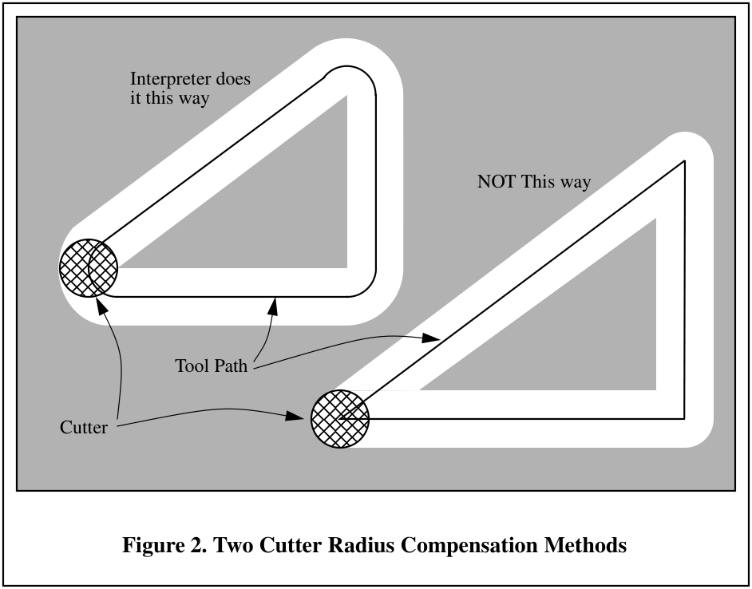

<a id="figure-2-two-cutter-radius-compensation-methods"></a>
**Figure 2. Two Cutter Radius Compensation Methods.**

Z-axis motion may take place while the contour is being followed in the XY-plane. Portions of the
contour may be skipped by retracting the Z-axis above the part, following the contour to the next
point at which machining should be done, and re-extending the Z-axis. These skip motions may
be performed at feed rate (G1) or at traverse rate (G0). The Z motion will not interfere with the
XY path following. The sample NC code in this appendix does not include moving the Z-axis. In
actual programs, include Z-axis motion wherever you want it.

Rotational axis motions (A, B, and C axes) are allowed with cutter radius compensation, but using
them would be very unusual.

Inverse time feed rate (G93) or units per minute feed rate (G94) may be used with cutter radius
compensation. Under G94, the feed rate will apply to the actual path of the cutter tip, not to the
programmed contour.

<a id="b-1-1-data-for-cutter-radius-compensation"></a>
#### B.1.1 Data for Cutter Radius Compensation
The Interpreter world model keeps three data items for cutter radius compensation: the setting
itself (right, left, or off), program_x, and program_y. The last two represent the X and Y positions
which are given in the NC code while compensation is on. When compensation is off, these both
are set to a very small number ($10^{-20}$) whose symbolic value is “unknown”. The Interpreter world
model uses the data items current_x and current_y to represent the position of the center of the
tool tip (in the currently active coordinate system) at all times.

<a id="b-2-programming-instructions"></a>
### B.2 Programming Instructions

<a id="b-2-1-turning-cutter-radius-compensation-on"></a>
#### B.2.1 Turning Cutter Radius Compensation On
To start cutter radius compensation keeping the tool to the left of the contour, program G41 D… .
The D word is optional (see “Use of D Number”, just below).

To start cutter radius compensation keeping the tool to the right of the contour, program G42 D…
In Figure 2, for example, if G41 were programmed, the tool would move clockwise around the
triangle, so that the tool is always to the left of the triangle when facing in the direction of travel.
If G42 were programmed, the tool would stay right of the triangle and move counterclockwise
around the triangle.

<a id="b-2-2-turning-cutter-radius-compensation-off"></a>
#### B.2.2 Turning Cutter Radius Compensation Off
To stop cutter radius compensation, program G40. It is OK to turn compensation off when it is
already off.

<a id="b-2-3-sequencing"></a>
#### B.2.3 Sequencing
If G40, G41, or G42 is programmed on the same line as tool motion, cutter compensation will be
turned on or off before the motion is made. To make the motion come first, the motion must be
programmed on a separate, previous line of code.

<a id="b-2-4-use-of-d-number"></a>
#### B.2.4 Use of D Number
Programming a D word with G41 or G42, is optional.

If a D number is programmed, it must be a non-negative integer. It represents the slot number of
the tool whose radius (half the diameter given in the tool table) will be used, or it may be zero
(which is not a slot number). If it is zero, the value of the radius will also be zero. Any slot in the
tool table may be selected. The D number does not have to be the same as the slot number of the
tool in the spindle, although it is rarely useful for it not to be.

If a D number is not programmed, the slot number of the tool in the spindle will be used as the D
number.

<a id="b-3-material-edge-contour"></a>
### B.3 Material Edge Contour
When the contour is the edge of the material, the outline of the edge is described in the NC
program.

For a material edge contour, the value for the diameter in the tool table is the actual value of the
diameter of the tool. The value in the table must be positive. The NC code for a material edge
contour is the same regardless of the (actual or intended) diameter of the tool.

<a id="b-3-1-programming-entry-moves"></a>
#### B.3.1 Programming Entry Moves
In general, two pre-entry moves and one entry move are needed to begin compensation correctly.
However, if there is a convex corner on the contour, a simpler method is available using zero or
one pre-entry move and one entry move. The general method, which will work in all situations, is
described first. We assume here that the programmer knows what the contour is already and has
the job of adding entry moves.

<a id="b-3-1-1-general-method"></a>
##### B.3.1.1 General Method
The general method includes programming two pre-entry moves and one entry move. See Figure
3. The shaded area is the remaining material. It has no corners, so the simple method cannot be
used. The dotted line is the programmed path. The solid line is the actual path of the tool tip. Both
paths go clockwise around the remaining material. A cutter one unit in diameter is shown part
way around the path. The black dots mark points at the beginning or end of programmed or actual
moves. The figure shows the second pre-entry move but not the first, since the beginning point of
the first pre-entry move could be anywhere.

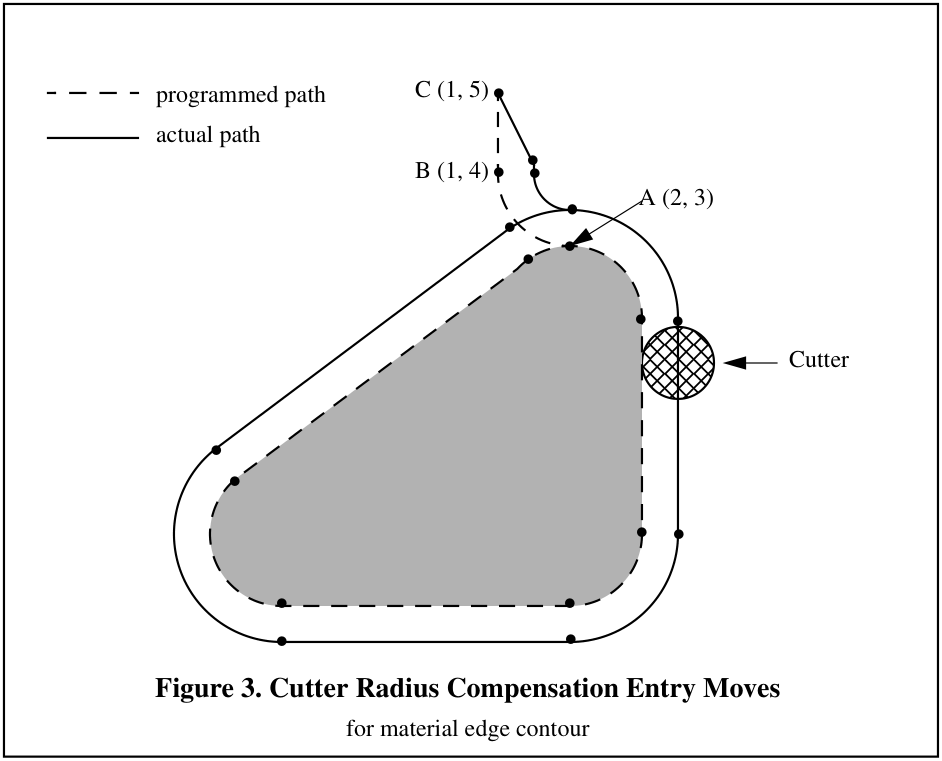

<a id="figure-3-cutter-radius-compensation-entry-moves"></a>
**Figure 3. Cutter Radius Compensation Entry Moves.** For material edge contour.


First, pick a point A on the contour where it is convenient to attach an entry arc. Specify an arc
outside the contour which begins at a point B and ends at A tangent to the contour (and going in
the same direction as it is planned to go around the contour). The radius of the arc should be larger
than half the diameter given in the tool table. Then extend a line tangent to the arc from B to some
point C, located so that the line BC is more than one tool radius long. After the construction is
finished, the code is written in the reverse order from the construction. The NC code is shown in
Table 12; the first three lines are the entry moves just described.

<a id="table-12-nc-program-for-figure-3"></a>
**Table 12. NC Program for Figure 3**

```text
N0010 G1 X1 Y5 (make first pre-entry move to C)
N0020 G41 G1 Y4 (turn compensation on and make second pre-entry move to point B)
N0030 G3 X2 Y3 I1 (make entry move to point A)
N0040 G2 X3 Y2 J-1 (cut along arc at top)
N0050 G1 Y-1 (cut along right side)
N0060 G2 X2 Y-2 I-1 (cut along arc at bottom right)
N0070 G1 X-2 (cut along bottom side)
N0080 G2 X-2.6 Y-0.2 J1 (cut along arc at bottom left)
N0090 G1 X1.4 Y2.8 (cut along third side)
N0100 G2 X2 Y3 I0.6 J-0.8 (cut along arc at top of tool path)
N0110 G40 (turn compensation off)
```

Cutter radius compensation is turned on after the first pre-entry move and before the second pre-
entry move (including G41 on the same line as the second pre-entry move turns compensation on
before the move is made). In the code above, line N0010 is the first pre-entry move, line N0020
turns compensation on and makes the second pre-entry move, and line N0030 makes the entry
move.

<a id="b-3-1-2-simple-method"></a>
##### B.3.1.2 Simple Method
If there is a convex (sticking out, not in) corner somewhere on the contour, a simpler method of
making an entry is available. See Figure 4.

First, pick a convex corner. There is only one corner in Figure 4. It is at A, and it is convex. Decide
which way you want to go along the contour from A. In our example we are keeping the tool to
the left of the remaining material and going clockwise. Extend the side to be cut (DA in the figure)
to divide the area outside the material near A into two regions; DA extended is the dotted line AC
on the figure. Make a pre-entry move to anywhere in the region on the same side of DC as the
remaining material (point B on the figure) and not so close to the remaining material that the tool
is cutting into it. Anywhere in the diagonally shaded area of the figure (or above or to the left of
that area) is OK. If the tool is already in region, no pre-entry move is needed. Write a line of NC
code to move to B, if necessary. Then write a line of NC code for a straight entry move that turns
compensation on and goes to point A. If B is at (1.5, 4), the two lines of code for the pre-entry and
entry moves would be:

N0010 G1 X1.5 Y4 (move to B)

N0020 G41 G1 X3 Y3 (turn compensation on and make entry move to A)

These two lines would be followed by four lines identical to lines N0050 to N0080 from Table 12,
but the end of the program would be different since the shape of remaining material is different.

It would be OK for B to be on line AC. In fact, B could be placed on the extension outside the part
of any straight side of the part. B could be placed on EF extended to the right (but not to the left,
for going clockwise), for example.

If DA were an arc, not a straight line, the two lines of code above would still be suitable. In this
case, the dotted line extending DA should be tangent to DA at A.

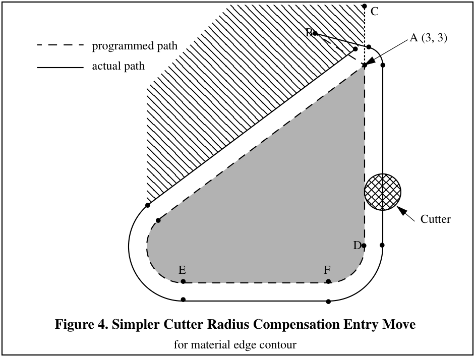

<a id="figure-4-simpler-cutter-radius-compensation-entry-move"></a>
**Figure 4. Simpler Cutter Radius Compensation Entry Move.** For material edge contour.


<a id="b-4-nominal-path-contour"></a>
### B.4 Nominal Path Contour
When the contour is a nominal path contour (the path a tool with exactly the intended diameter
would take), the tool path is described in the NC program. It is expected that (except for during
the entry moves) the path is intended to create some part geometry. The path may be generated
manually or by a post-processor, considering the part geometry which is intended to be made. For
the Interpreter to work, the tool path must be such that the tool stays in contact with the edge of
the part geometry, as shown on the left side of Figure 2. If a path of the sort shown on the right of
Interpreter will not be able to compensate properly when undersized tools are used. A nominal
path contour has no corners, so the simple method just described will not work.

For a nominal path contour, the value for the cutter diameter in the tool table will be a small
positive number if the selected tool is slightly oversized and will be a small negative number if the
tool is slightly undersized. If a cutter diameter value is negative, the Interpreter compensates on
the other side of the contour from the one programmed and uses the absolute value of the given
diameter. If the actual tool is the correct size, the value in the table should be zero. Suppose, for
example, the diameter of the cutter currently in the spindle is 0.97, and the diameter assumed in
generating the tool path was 1.0. Then the value in the tool table for the diameter for this tool
should be -0.03.

The nominal tool path needs to be programmed so that it will work with the largest and smallest
tools expected to be actually used. We will call the difference between the radius of the largest
expected tool and the intended radius of the tool the “maximum radius difference.” This is usually a small number.

The method includes programming two pre-entry moves and one entry moves. See Figure 5. The
shaded area is the remaining material. The dashed line is the programmed tool path. The solid line
is the actual path of the tool tip. Both paths go clockwise around the remaining material. The
actual path is to the right of the programmed path even though G41 was programmed, because the
diameter value is negative. On the figure, the distance between the two paths is larger than would
normally be expected. The 1-inch diameter tool is shown part way around the path. The black dots
mark points at the beginning or end of programmed moves. The corresponding points on the
actual path have not been marked. The actual path will have a very small additional arc near point
B unless the tool diameter is exactly the size intended. The figure shows the second pre-entry
move but not the first, since the beginning point of the first pre-entry move could be anywhere.

First, pick a point A on the contour where it is convenient to attach an entry arc. Specify an arc
outside the contour which begins at a point B and ends at A tangent to the contour (and going in
the same direction as it is planned to go around the contour). The radius of the arc should be larger
than the maximum radius difference. Then extend a line tangent to the arc from B to some point
C, located so that the length of line BC is more than the maximum radius difference. After the
construction is finished, the code is written in the reverse order from the construction. The NC
code is shown in Table 13; the first three lines are the entry moves just described.

<a id="table-13-nc-program-for-figure-5"></a>
**Table 13. NC Program for Figure 5**

```text
N0010 G1 X1.5 Y5 (make first pre-entry move to C)
N0020 G41 G1 Y4 (turn compensation on and make second pre-entry move to point B)
N0030 G3 X2 Y3.5 I0.5 (make entry move to point A)
N0040 G2 X3.5 Y2 J-1.5 (cut along arc at top)
N0050 G1 Y-1 (cut along right side)
N0060 G2 X2 Y-2.5 I-1.5 (cut along arc at bottom right)
N0070 G1 X-2 (cut along bottom side)
N0080 G2 X-2.9 Y0.2 J1.5 (cut along arc at bottom left)
N0090 G1 X1.1 Y3.2 (cut along third side)
N0100 G2 X2 Y3.5 I0.9 J-1.2 (cut along arc at top of tool path)
N0110 G40 (turn compensation off)
```

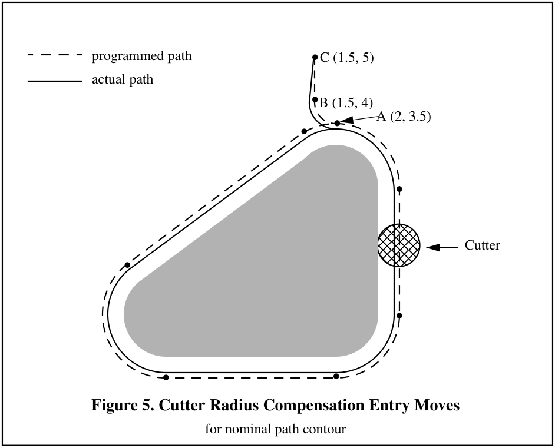

<a id="figure-5-cutter-radius-compensation-entry-moves"></a>
**Figure 5. Cutter Radius Compensation Entry Moves.** For nominal path contour.


Cutter radius compensation is turned on after the first pre-entry move and before the second pre-
entry move (including G41 on the same line as the second pre-entry move turns compensation on
before the move is made). In the code above, line N0010 is the first pre-entry move, line N0020
turns compensation on and makes the second pre-entry move, and line N0030 makes the entry
move.

<a id="b-5-programming-errors-and-limitations"></a>
### B.5 Programming Errors and Limitations
The Interpreter will issue the following error messages involving cutter radius compensation. In
addition to these, there are several bug messages related to cutter compensation, but they should
never occur.

1. Cannot change axis offsets with cutter radius comp
2. Cannot change units with cutter radius comp
3. Cannot probe with cutter radius comp on
4. Cannot turn cutter radius comp on out of xy-plane
5. Cannot turn cutter radius comp on when on
6. Cannot use g28 or g30 with cutter radius comp
7. Cannot use g53 with cutter radius comp

8. Cannot use xz-plane with cutter radius comp
9. Cannot use yz-plane with cutter radius comp
10. Concave corner with cutter radius comp
11. Cutter gouging with cutter radius comp
12. D word with no g41 or g42
13. Multiple d words on one line
14. Negative d word tool radius index used
15. Tool radius index too big
16. Tool radius not less than arc radius with comp
17. Two g codes used from same modal group.
Most of these are self-explanatory.

For those that require explanation, an explanation is given
below.

Changing a tool while cutter radius compensation is on is not treated as an error, although it is
unlikely this would be done intentionally. The radius used when cutter radius compensation was
first turned on will continue to be used until compensation is turned off, even though a new tool is
actually being used.

<a id="b-5-1-concave-corner-and-tool-radius-too-big-10-and-16"></a>
#### B.5.1 Concave Corner and Tool Radius Too Big (10 and 16)

When cutter radius compensation is on, it must be physically possible for a circle whose radius is
the half the diameter given in the tool table to be tangent to the contour at all points of the contour.
In particular, the Interpreter treats concave corners and concave arcs into which the circle will not
fit as errors, since the circle cannot be kept tangent to the contour in these situations. See Figure 6.
This error detection does not limit the shapes which can be cut, but it does require that the
programmer specify the actual shape to be cut (or path to be followed), not an approximation. In
this respect, the NIST RS274/NGC Interpreter differs from interpreters used with many other
controllers, which often allow these errors silently and either gouge the part or round the corner.

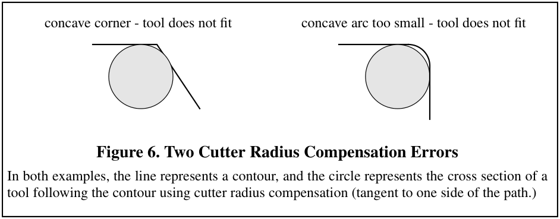

<a id="figure-6-two-cutter-radius-compensation-errors"></a>
**Figure 6. Two Cutter Radius Compensation Errors.**


<a id="b-5-2-cannot-turn-cutter-radius-comp-on-when-on-5"></a>
#### B.5.2 Cannot Turn Cutter Radius Comp on When On (5)

If cutter radius compensation has already been turned on, it cannot be turned on again. It must be
turned off first; then it can be turned on again. It is not necessary to move the cutter between
turning compensation off and back on, but the move after turning it back on will be treated as a
first move, as described below.

It is not possible to change from one cutter radius index to another while compensation is on
because of the combined effect of rules 5 and 12. It is also not possible to switch compensation
from one side to another while compensation is on.

<a id="b-5-3-cutter-gouging-11"></a>
#### B.5.3 Cutter Gouging (11)

If the tool is already covering up the next XY destination point when cutter radius compensation
is turned on, the gouging message is given when the line of NC code which gives the point is
reached. In this situation, the tool is already cutting into material it should not cut. More details
are given in Section B.6.

<a id="b-5-4-tool-radius-index-too-big-15"></a>
#### B.5.4 Tool Radius Index Too Big (15)

If a D word is programmed that is larger than the number of tool carousel slots, this error message
is given. In the SAI, the number of slots is 68.

<a id="b-5-5-two-g-codes-used-from-same-modal-group-17"></a>
#### B.5.5 Two G Codes Used from Same Modal Group (17)

This is a generic message used for many sets of G codes. As applied to cutter radius
compensation, it means that more than one of G40, G41, and G42 appears on a line of NC code.
This is not allowed.

<a id="b-6-first-move-into-cutter-compensation"></a>
### B.6 First Move into Cutter Compensation
The algorithm used for the first move after cutter radius compensation is turned on, when the first
move is a straight line, is to draw a straight line from the programmed destination point which is
tangent to a circle whose center is at the current point and whose radius is the radius of the tool.
The destination point of the tool tip is then found as the center of a circle of the same radius
tangent to the tangent line at the destination point. If the programmed point is inside the initial
cross section of the tool (the circle on the left), an error is signalled as described in Section B.5.3.
The concept of the algorithm is shown in Figure 7.

The function that locates the destination point actually takes a computational shortcut based on
the fact that the line (not drawn on the figure) from the current point to the programmed point is
the hypotenuse of a right triangle having the destination point at the corner with the right angle.

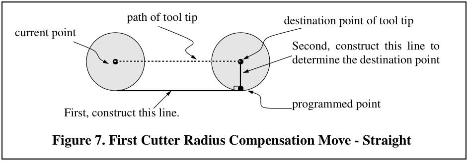

<a id="figure-7-first-cutter-radius-compensation-move-straight"></a>
**Figure 7. First Cutter Radius Compensation Move - Straight.**


If the first move after cutter radius compensation has been turned on is an arc, the arc which is
generated is derived from an auxiliary arc which has its center at the programmed center point,
passes through the programmed end point, and is tangent to the cutter at its current location. If the
auxiliary arc cannot be constructed, an error is signalled. The generated arc moves the tool so that
it stays tangent to the auxiliary arc throughout the move. This is shown in Figure 8.

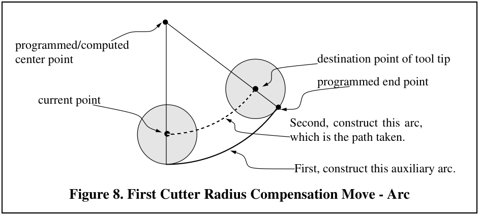

<a id="figure-8-first-cutter-radius-compensation-move-arc"></a>
**Figure 8. First Cutter Radius Compensation Move - Arc.**


Figure 8 shows the conceptual approach for finding the arc. The actual computations differ between the center format arc and the radius format arc (see Section 3.5.3).

After the entry moves of cutter radius compensation, the Interpreter keeps the tool tangent to the
programmed path on the appropriate side. If a convex corner is on the path, an arc is inserted to go
around the corner. The radius of the arc is half the diameter given in the tool table.

When cutter radius compensation is turned off, no special exit move takes place. The next move is
what it would have been if cutter radius compensation had never been turned on and the previous
move had placed the tool at its current position.

The Interpreter signals when cutter radius compensation is turned on or off by calling the
COMMENT canonical function with a message to that effect.

<a id="appendix-c-sample-programs"></a>
## Appendix C. Sample Programs
This appendix includes three sample programs. This section is intended to be useful to NC
programmers and machine operators. Others will probably not find it useful. Additional sample
programs are given in Table 6 (hole probing), Table 12 and Table 13 (cutter radius compensation).
A transcript of a session using the SAI with keyboard input is shown in Table 10. Table 12 and
Table 13 are only sections of programs and need a line at the beginning (to select tool, change
tool, start spindle, and set feed and speed rates) and a line at the end (an M2 to end the program).

<a id="c-1-sample-simple-program"></a>
### C.1 Sample Simple Program
The classical simple computer program prints “Hello world”. Here it is in RS274/NGC. The
program may be safely run on a machining center.

```text
(this program mills “Hello world” between X=0 and X=81 millimeters)
n0010 g21 g0 x0 y0 z50 (top of part should be on XY plane)
n0020 t1 m6 m3 f20 s4000 (use an engraver or small ball-nose endmill)
n0030 g0 x0 y0 z2
n0040 g1 z-0.5 (start H)
n0050 y10
n0060 g0 z2
n0070 y5
n0080 g1 z-0.5
n0090 x 7
n0100 g0 z2
n0110 y0
n0120 g1 z-0.5
n0130 y10
n0140 g0 z2
n0150 x11 y2.5
n0160 g1 z-0.5 (start e)
n0170 x16
n0190 g3 x13.5 y0 i-2.5
n0200 g1 x16
n0210 g0 z2
n0220 x20 y0
n0230 g1 z-0.5 (start l)
n0240 y9
n0250 g0 z2
n0260 x26
n0270 g1 z-0.5 (start l)
n0280 y0
n0290 g0 z2
n0300 x32.5
n0310 g1 z-0.5 (start o)
n0320 g2 x32.5 j2.5
n0330 g0 z2
n0340 x45 y5
n0350 g1 z-0.5 (start w)
n0360 x47 y0
n0370 x48.5 y3
n0380 x50 y0
n0390 x52 y5
n0400 g0 z2
n0410 x57.5 y0
n0420 g1 z-0.5 (start o)
n0430 g2 x57.5 j2.5
n0440 g0 z2
n0450 x64
n0460 g1 z-0.5 (start r)
n0470 y5
n0480 y4
n0490 g2 x69 r4
n0500 g0 z2
n0510 x73 y0
n0520 g1 z-0.5 (start l)
n0530 y9
n0540 g0 z2
n0550 x81
n0560 g1 z-0.5 (start d)
n0570 y0
n0580 x79.5
n0590 g2 j2.5 y5
n0600 g1 x81
n0610 g0 z50
n0620 m2
```

<a id="c-2-sample-program-to-test-expressions"></a>
### C.2 Sample Program to Test Expressions
This file is to test the interpretation of expressions. It tests all unary and binary functions
implemented. It also tests parameter setting and referencing. The last few lines test more
complicated expressions. This program is not intended to be run on a machining center. The tool
path is just random back and forth on the X-axis.

```text
n0010 g21 g1 x3 f20 (expression test)
n0020 x [1 + 2] (x should be 3)
n0030 x [1 - 2] (x should be -1)
n0040 x [1 --3] (x should be 4)
n0050 x [2/5] (x should be 0.40)
n0060 x [3.0 * 5] (x should be 15)
n0070 x [0 OR 0] (x should be 0)
n0080 x [0 OR 1] (x should be 1)
n0090 x [2 or 2] (x should be 1)
n0100 x [0 AND 0] (x should be 0)
n0110 x [0 AND 1] (x should be 0)
n0120 x [2 and 2] (x should be 1)
n0130 x [0 XOR 0] (x should be 0)
n0140 x [0 XOR 1] (x should be 1)
n0150 x [2 xor 2] (x should be 0)
n0160 x [15 MOD 4.0] (x should be 3)
n0170 x [1 + 2 * 3 - 4 / 5] (x should be 6.2)
n0180 x sin[30] (x should be 0.5)
n0190 x cos[0.0] (x should be 1.0)
n0200 x tan[60.0] (x should be 1.7321)
n0210 x sqrt[3] (x should be 1.7321)
n0220 x atan[1.7321]/[1.0] (x should be 60.0)
n0230 x asin[1.0] (x should be 90.0)
n0240 x acos[0.707107] (x should be 45.0000)
n0250 x abs[20.0] (x should be 20)
n0260 x abs[-1.23] (x should be 1.23)
n0270 x round[-0.499] (x should be 0)
n0280 x round[-0.5001] (x should be -1.0)
n0290 x round[2.444] (x should be 2)
n0300 x round[9.975] (x should be 10)
n0310 x fix[-0.499] (x should be -1.0)
n0320 x fix[-0.5001] (x should be -1.0)
n0330 x fix[2.444] (x should be 2)
n0340 x fix[9.975] (x should be 9)
n0350 x fup[-0.499] (x should be 0.0)
n0360 x fup[-0.5001] (x should be 0.0)
n0370 x fup[2.444] (x should be 3)
n0380 x fup[9.975] (x should be 10)
n0390 x exp[2.3026] (x should be 10)
n0400 x ln[10.0] (x should be 2.3026)
n0410 x [2 ** 3.0] #1=2.0 (x should be 8.0)
n0420 ##1 = 0.375 (#1 is 2, so parameter 2 is set to 0.375)
n0430 x #2 (x should be 0.375) #3=7.0
n0440 #3=5.0 x #3 (parameters set in parallel, so x should be 7, not 5)
n0450 x #3 #3=1.1 (parameters set in parallel, so x should be 5, not 1.1)
n0460 x [2 + asin[1/2.1+-0.345] / [atan[fix[4.4] * 2.1 * sqrt[16.8]] /[-18]]**2]
n0470 x sqrt[3**2 + 4**2] (x should be 5.0)
n0480 m2
```

<a id="c-3-sample-program-to-test-canned-cycles"></a>
### C.3 Sample Program to Test Canned Cycles
This file tests canned cycles. It is not intended to be run on a machining center.

```text
n0010 g20 (cycle test)
n0020 g17 g43 h1 m3 s1234 f16 (start in XY-plane)
n0030 g81 x3 y4 r0.2 z-1.1
n0040 x1 y0 r0 g91 l3 (three more g81’s an inch apart)
n0050 y-2 r0.1 (one more g81)
n0060 g82 g90 x4 y5 r0.2 z-1.1 p0.6
n0070 x2 z-3.0 (one more G82)
n0080 g91 x-2 y2 r0 l4 (four more g82’s)
n0090 g83 g90 x5 y6 r0.2 z-1.1 q0.21
n0100 g84 x6 y7 r0.2 z-1.1
n0110 g85 x7 y8 r0.2 z-1.1
n0120 g86 x8 y9 r0.2 z-1.1 p902.61
n0130 g87 x9 y10 r0.2 z-1.1 i0.231 j-0 k-3
n0135 g91 x1 r0.2 z-1.1 i0.231 j-0 k-3
n0140 g88 x10 y11 r0.2 z-1.1 p0.3333
n0150 g89 x11 y12 r0.2 z-1.1 p1.272
n0160 m4 (run spindle counterclockwise)
n0170 g86 x8 y9 r0.2 z-1.1 p902.61
n0180 g87 x9 y10 r0.2 z-1.1 i0.231 j-0 k-3
n0190 g88 x10 y11 r0.2 z-1.1 p0.3333

n0220 g18 m3 (now run all cycles in the XZ-plane)
n0230 g81 z3 x4 r0.2 y-1.1
n0240 g91 z1 x0 r0 l3
n0260 g82 g90 z4 x5 r0.2 y-1.1 p0.6
n0280 g91 z-2 x2 r0 l4
n0290 g83 g90 z5 x6 r0.2 y-1.1 q0.21
n0300 g84 z6 x7 r0.2 y-1.1
n0310 g85 z7 x8 r0.2 y-1.1
n0320 g86 z8 x9 r0.2 y-1.1 p902.61
n0330 g87 z9 x10 r0.2 y-1.1 k0.231 i-0 j-3
n0335 g91 z1 r0.2 y-1.1 k0.231 i-0 j-3
n0340 g88 z10 x11 r0.2 y-1.1 p0.3333
n0350 g89 z11 x12 r0.2 y-1.1 p1.272

n0420 g19 (now run all cycles in the YZ-plane)
n0430 g81 y3 z4 r0.2 x-1.1
n0440 g91 y1 z0 r0 l3
n0460 g82 g90 y4 z5 r0.2 x-1.1 p0.6
n0480 g91 y-2 z2 r0 l4
n0490 g83 g90 y5 z6 r0.2 x-1.1 q0.21
n0500 g84 y6 z7 r0.2 x-1.1
n0510 g85 y7 z8 r0.2 x-1.1
n0520 g86 y8 z9 r0.2 x-1.1 p902.61
n0530 g87 y9 z10 r0.2 x-1.1 j0.231 k-0 i-3
n0535 g91 y1 r0.2 x-1.1 j0.231 k-0 i-3
n0540 g88 y10 z11 r0.2 x-1.1 p0.3333
n0550 g89 y11 z12 r0.2 x-1.1 p1.272

n1000 m2 (the end)
```

<a id="appendix-d-interpreter-software"></a>
## Appendix D. Interpreter Software
This section describes the Interpreter software. NC programmers and machine operators should
never need to use this section. SAI installers should not need it but may find it helpful. Developers
and researchers should find the section useful.

<a id="d-1-interpreter-interfaces"></a>
### D.1 Interpreter Interfaces
The Interpreter has four interfaces, as shown in Figure 9. These are all function call interfaces.
The direction of function calling is indicated by arrows. The flow of information in the reverse
direction from the arrows differs in the different interfaces.

The Interpreter-do-it functions tell the Interpreter to do something, such as read a line of NC code
or execute the line last read. These functions all return an integer status code as described in
Appendix A.1. The functions themselves are described in Appendix D.4. They are declared in
rs274ngc.hh and defined in rs274ngc_pre.cc. The names of these functions all begin with
“rs274ngc_”.

The Interpreter-give-information functions ask the Interpreter to give information. Some of these
functions pass from the driver a pointer to a place to put information. The Interpreter provides the
information either as a returned value, or by putting it into the place pointed at by the pointer. The
functions are described in Appendix D.5. They are declared in rs274ngc.hh and defined in
rs274ngc_pre.cc. The names of these functions all begin with “rs274ngc_”.

The canonical machining functions tell the rest of the system to do something. These functions do
not return anything. They are described in Section 4. They are declared in canon.hh and defined in
canon.cc. The names of these functions do not all have the same prefix.

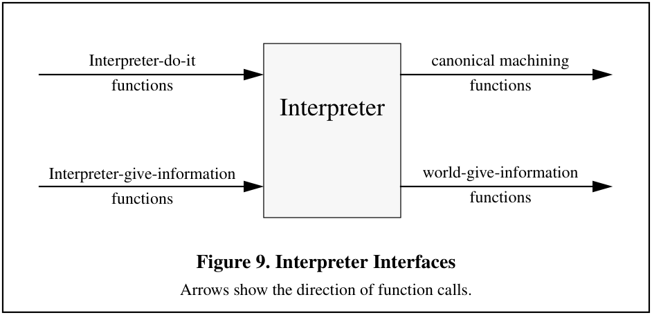

<a id="figure-9-interpreter-interfaces"></a>
**Figure 9. Interpreter Interfaces.** Arrows show the direction of function calls.


The world-give-information functions ask the world outside the Interpreter to give the Interpreter
information. Some of these functions pass from the Interpreter a pointer to a place to put
information. The world provides the information either as a returned value, or by putting it into
the place pointed at by the pointer. The functions are described in Appendix D.6. They are
declared in canon.hh and defined in canon.cc. The names of these functions all begin with
“GET_EXTERNAL_”.

<a id="d-2-software-files-and-organization"></a>
### D.2 Software Files and Organization
The Interpreter software is written in C++.
The files for the Interpreter and the rest of the SAI are:
Interpreter

1. rs274ngc_errors.cc
2. rs274ngc_return.hh
3. rs274ngc_pre.cc
4. rs274ngc.hh
5. canon.hh

Rest of SAI
1. driver.cc
2. canon_pre.cc

The rs274ngc_pre.cc file is a bit over 12,000 lines. The other files are all in the range of 100 to
1100 lines.

The organization of the software by file is shown in Figure 10. The SAI uses the files shown in the
left and middle columns. The EMC Controller uses the files shown in the right and middle
columns. In the figure, arrows show the direction of function calls.

The rs274ngc_pre.cc file includes interface functions (the Interpreter-do-it and Interpreter-give-
information functions) and other functions. In the file itself, the interface functions are given after
the other functions. As shown in Figure 10, other functions are called only by interface functions,
while interface functions are called by driver functions (in the SAI or EMC Controller). Both
interface functions and other functions call canonical machining functions and world-give-
information functions.

Different versions of the canonical machining functions are used in the SAI and the EMC
Controller. The canonical machining functions used with the SAI print themselves and manipulate
an emulated environment, while those used in the EMC controller send messages which
ultimately lead to controlling the machine. The same header file, canon.hh, is used with both
versions of the functions.

As described in Appendix A.4, the rs274ngc_errors.cc and the rs274ngc_return.hh files are
prepared automatically.

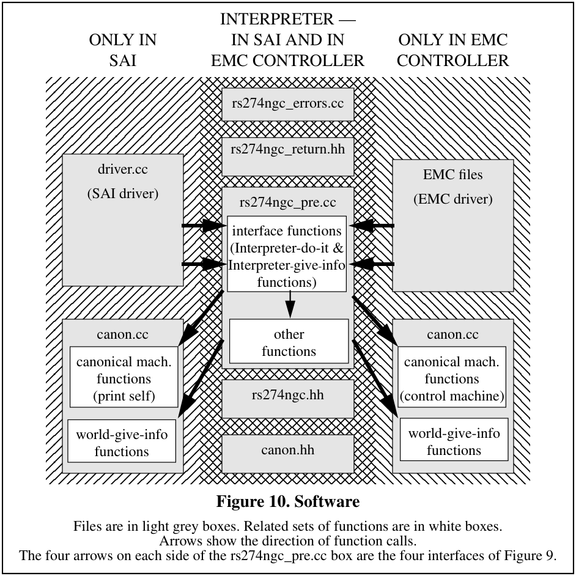

<a id="figure-10-software"></a>
**Figure 10. Software.** Files are in light grey boxes. Related sets of functions are in white boxes. Arrows show the direction of function calls.

The four arrows on each side of the rs274ngc_pre.cc box are the four interfaces of Figure 9.

The source code is heavily documented. In general, for each function, four fields are given:

1. Returned Value - a description of possible returned values and the circumstances in which
particular values may be returned.
2. Side Effects - a description of the important side effects (things other than the returned value) of
executing a function. Since the returned value of most functions is used to indicate error status,
the side effects of most functions are important.
3. Called By - a list of functions which call the function being documented.
4. Arguments - a one-line description of the meaning of each argument to a function, placed
immediately after the declaration of the argument. This field is omitted if there are no arguments.

In addition to these four fields, most functions have a paragraph or two (up to several pages) of
discussion. These discussions include many references to the RS274 manuals [NCMS], [EIA],
[Monarch], and [Fanuc]. Where a function implements an algorithm for geometric or numerical
calculation (as do many of the functions having to do with cutter radius compensation, for
example), the algorithm is described.

<a id="d-3-cyclic-operation"></a>
### D.3 Cyclic Operation
In the EMC Controller, Interpreter input may be taken from a file or via manual data input (MDI)
from the controller console. In the SAI, input may be taken from a file or from the keyboard of the
computer running the Interpreter. Two major phases of interpretation take place. In the first phase,
a call to rs274ngc_read causes the Interpreter to read a line of code, to check it somewhat, and to
store the information from the line in a structure called a “block”. In the second phase, a call to
rs274ngc_execute causes the Interpreter to examine the block, to check it further, and (usually) to
make calls to canonical machining functions.

<a id="d-3-1-read-store-and-check"></a>
#### D.3.1 Read, Store, and Check
The Interpreter reads lines of RS274/NGC code one at a time. First the line is read into a buffer.
Next, any spaces not in comments are removed, and any upper case letters not in comments are
changed to lower case letters.

Then the buffer and a counter holding the index of the next character to be read are handed around
among a lot of functions named read_XXXX. All such functions read characters from the buffer
using the counter. They all reset the counter to point at the character in the buffer following the
last one used by the function. The first character read by most of these functions is expected to be
a member of some set of characters (often a specific single character), and each function checks
the first character.

Each line of code is stored until it has been executed in a reusable “block” structure, which has a
slot for every potential piece of information on the line. Each time a useful piece of information
has been extracted from the line, the information is put into the block.

The read_XXXX functions do a lot of error detection, but they only look for errors which would
cause reading or storing to fail. After reading and storing is complete, more checking functions
(check_g_codes, check_m_codes, and check_other_codes) are run. These functions look for
logical errors, such as all axis words missing with a G code for motion in effect.

<a id="d-3-2-execute"></a>
#### D.3.2 Execute
Once a block is built and checked, the block is executed by the execute_block function, which
calls one or more functions named convert_XXXX. In RS274/NGC, as in all dialects of RS274, a
line of code may specify several different things to do, such as moving from one place to another
along a straight line or arc, changing the feed rate, starting the spindle turning, etc. The order of
execution is shown in Table 8.

<a id="d-4-interpreter-do-it-functions"></a>
### D.4 Interpreter-do-it Functions
This section describes the Interpreter-do-it functions. They are arranged alphabetically. All
function names start with “rs274ngc_”.

`int rs274ngc_close();`
Close the currently open NC code file.

`int rs274ngc_execute();`
Execute the block representing the last line of NC code that was read.

`int rs274ngc_exit();`
Stop running.

`int rs274ngc_init();`
Get ready to run.

`int rs274ngc_load_tool_table();`
Load a tool table.

`int rs274ngc_open(const char * filename);`
Open the NC code file whose name is filename.

`int rs274ngc_read(const char * mdi = 0);`
If mdi is not null, read the string mdi points to. If mdi is null, read the next line of the
currently open NC code file.

`int rs274ngc_reset();`
Reset yourself.

`int rs274ngc_restore_parameters(const char * filename);`
Restore parameters from the file named filename.

`int rs274ngc_save_parameters(const char * filename, const double
parameters[]);`
Save the parameters in the file named filename.

`int rs274ngc_synch();`
synchronize your internal world model with the external world.

<a id="d-5-interpreter-give-information-functions"></a>
### D.5 Interpreter-give-information Functions
These are interface functions to call to get information from the Interpreter. If a function has a
return value, the return value contains the information. If a function returns nothing, information
is copied into one of the arguments to the function. These functions do not change the state of the
Interpreter.

`void rs274ngc_active_g_codes(int * codes);`
Copy active G codes into the codes array [0]..[11].

`void rs274ngc_active_m_codes(int * codes);`
Copy active M codes into the codes array [0]..[6].

`void rs274ngc_active_settings(double * settings);`
Copy active F, S settings into the settings array [0]..[2].

`void rs274ngc_error_text(int error_code, char * error_text, int
max_size);`
Copy the text of the error message whose number is error_code into the error_text
array, but stop at max_size if the text is longer.

`void rs274ngc_file_name(char * file_name, int max_size);`
Copy the name of the currently open file into the file_name array, but stop at max_size
if the name is longer.

`int rs274ngc_line_length();`
Return the length of the most recently read line.

`void rs274ngc_line_text(char * line_text, int max_size);`
Copy the text of the most recently read line into the line_text array, but stop at
max_size if the text is longer.

`int rs274ngc_sequence_number();`
Return the current sequence number (how many lines read).

`void rs274ngc_stack_name(int stack_index, char * function_name,
int max_size);`
Copy the function name from the stack_index’th position of the function call stack at the
time of the most recent error into the function_name string, but stop at max_size if the
name is longer.

<a id="d-6-world-give-information-functions"></a>
### D.6 World-give-information Functions
This section describes the world-give-information functions. These functions get information for
the Interpreter. They are arranged alphabetically. All function names start with
“GET_EXTERNAL_”.
`double GET_EXTERNAL_ANGLE_UNIT_FACTOR();`
Return the system angular unit factor, in units / degree. The Interpreter is not currently using
this function.

`double GET_EXTERNAL_FEED_RATE();`
Return the system feed rate.

`int GET_EXTERNAL_FLOOD();`
Return the system value for flood coolant, zero = off, non-zero = on.

`double GET_EXTERNAL_LENGTH_UNIT_FACTOR();`
Return the system length unit factor, in units / mm. The Interpreter is not currently using this
function.

`CANON_UNITS GET_EXTERNAL_LENGTH_UNIT_TYPE();`
Return the system length unit type.

`int GET_EXTERNAL_MIST();`
Return the system value for mist coolant, zero = off, non-zero = on.

`CANON_MOTION_MODE GET_EXTERNAL_MOTION_CONTROL_MODE();`
Return the current path control mode.

```
double GET_EXTERNAL_ORIGIN_A();
double GET_EXTERNAL_ORIGIN_B();
double GET_EXTERNAL_ORIGIN_C();
double GET_EXTERNAL_ORIGIN_X();
double GET_EXTERNAL_ORIGIN_Y();
double GET_EXTERNAL_ORIGIN_Z();
```
The Interpreter is not using these six GET_EXTERNAL_ORIGIN functions, each of which
returns the current value of the origin offset for the axis it names.

`void GET_EXTERNAL_PARAMETER_FILE_NAME(char * filename, int max_size);`
Return nothing but copy the name of the parameter file into the filename array, stopping at
max_size if the name is longer. An empty string may be placed in filename.

`CANON_PLANE GET_EXTERNAL_PLANE();`
Return the currently active plane.

```
double GET_EXTERNAL_POSITION_A();
double GET_EXTERNAL_POSITION_B();
double GET_EXTERNAL_POSITION_C();
double GET_EXTERNAL_POSITION_X();
double GET_EXTERNAL_POSITION_Y();
double GET_EXTERNAL_POSITION_Z();
```
Each of the six functions above returns the current position for the axis it names.

```
double GET_EXTERNAL_PROBE_POSITION_A();
double GET_EXTERNAL_PROBE_POSITION_B();
double GET_EXTERNAL_PROBE_POSITION_C();
double GET_EXTERNAL_PROBE_POSITION_X();
double GET_EXTERNAL_PROBE_POSITION_Y();
double GET_EXTERNAL_PROBE_POSITION_Z();
```
Each of the six functions above returns the position at the last probe trip for the axis it names.

`double GET_EXTERNAL_PROBE_VALUE();`
Return the value for any analog non-contact probing.

`int GET_EXTERNAL_QUEUE_EMPTY();`
Return zero if queue is not empty, non-zero if the queue is empty.

`double GET_EXTERNAL_SPEED();`
Return the system value for the spindle speed setting in revolutions per minute (rpm). The
actual spindle speed may differ from this.

`CANON_DIRECTION GET_EXTERNAL_SPINDLE();`
Return the system value for direction of spindle turning.

`double GET_EXTERNAL_TOOL_LENGTH_OFFSET();`
Return the current tool length offset.

`int GET_EXTERNAL_TOOL_MAX();`
returns number of slots in carousel.

`int GET_EXTERNAL_TOOL_SLOT();`
Returns the system value for the carousel slot in which the tool currently in the spindle
belongs. Return value zero means there is no tool in the spindle.

`CANON_TOOL_TABLE GET_EXTERNAL_TOOL_TABLE(int pocket);`
Returns the CANON_TOOL_TABLE structure associated with the tool in the given pocket. A
CANON_TOOL_TABLE structure has three data elements: id (an int), length (a double), and
diameter (a double).

`double GET_EXTERNAL_TRAVERSE_RATE();`
Returns the system traverse rate.

<a id="d-7-interpreter-function-call-hierarchies"></a>
### D.7 Interpreter Function Call Hierarchies
Function call hierarchies are shown in the following six figures. Except in Figure 13, which is highly recursive, if a function is called by more than one other function, its name may appear more than once in a figure. The functions called by a function are those listed underneath the calling function, one level further indented than the calling function. In Figure 13, function calls are shown with arrows from the caller to the called.

Figure 11 shows the hierarchies of all Interpreter-do-it functions other than rs274ngc_read and rs274ngc_execute.

Figure 12 and Figure 12 show the hierarchy starting with the Interpreter-do-it function rs274ngc_read. Figure 12 stops at read_real_value and Figure 13 begins there.

Figure 14 and Figure 15 show the hierarchy starting with the Interpreter-do-it function rs274ngc_execute. Figure 14 stops at convert_motion and Figure 15 begins there.

Figure 16 shows the hierarchy of function calls from the driver.

Calls to canonical machining functions are not included in the figures.

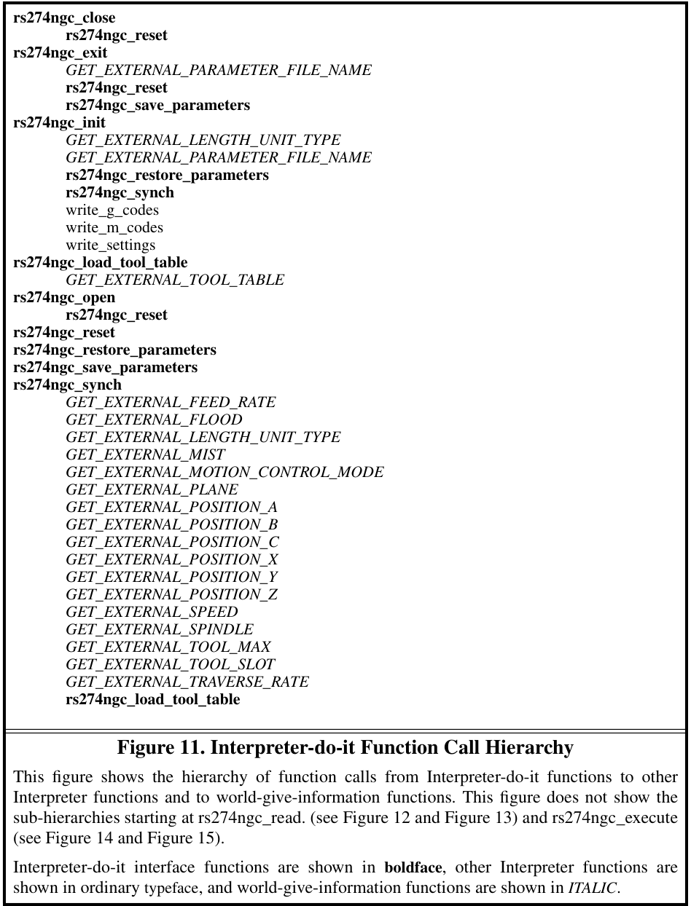

<a id="figure-11-interpreter-do-it-function-call-hierarchy"></a>
**Figure 11. Interpreter-do-it Function Call Hierarchy.**


This figure shows the hierarchy of function calls from Interpreter-do-it functions to other
Interpreter functions and to world-give-information functions. This figure does not show the
sub-hierarchies starting at rs274ngc_read. (see Figure 12 and Figure 13) and rs274ngc_execute
(see Figure 14 and Figure 15).

Interpreter-do-it interface functions are shown in boldface, other Interpreter functions are
shown in ordinary typeface, and world-give-information functions are shown in ITALIC.

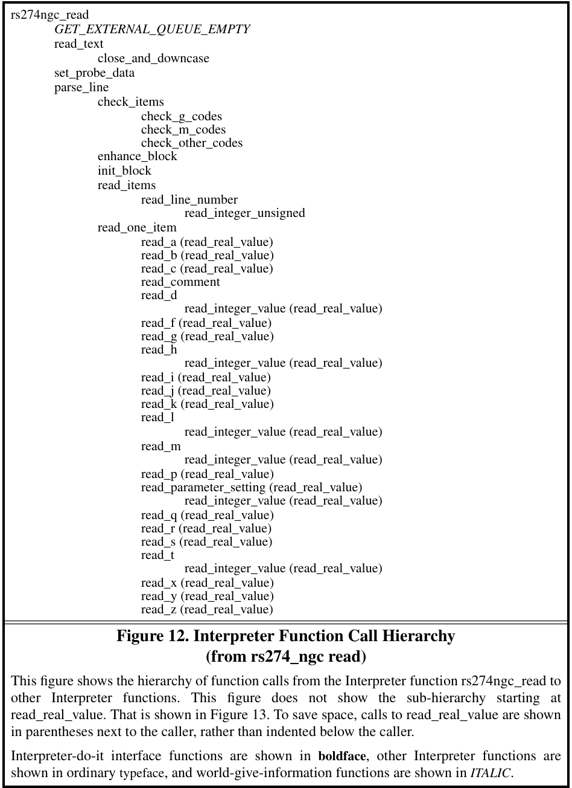

<a id="figure-12-interpreter-function-call-hierarchy"></a>
**Figure 12. Interpreter Function Call Hierarchy.** From `rs274ngc_read`.

This figure shows the hierarchy of function calls from the Interpreter function rs274ngc_read to
other Interpreter functions. This figure does not show the sub-hierarchy starting at
read_real_value. That is shown in Figure 13. To save space, calls to read_real_value are shown
in parentheses next to the caller, rather than indented below the caller.

Interpreter-do-it interface functions are shown in boldface, other Interpreter functions are
shown in ordinary typeface, and world-give-information functions are shown in ITALIC.

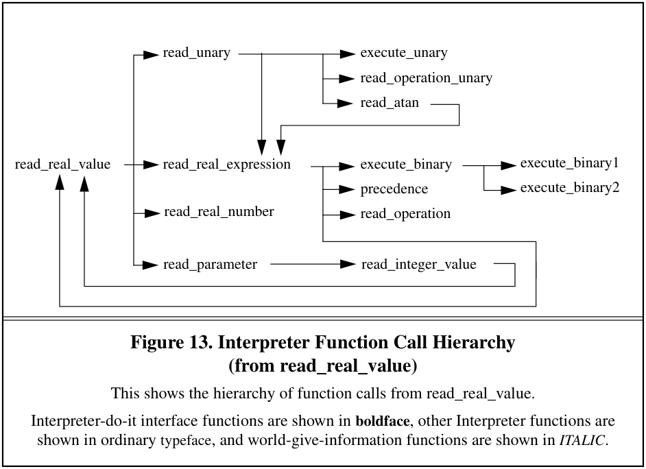

<a id="figure-13-interpreter-function-call-hierarchy"></a>
**Figure 13. Interpreter Function Call Hierarchy.** From `read_real_value`.

This shows the hierarchy of function calls from read_real_value.

Interpreter-do-it interface functions are shown in boldface, other Interpreter functions are
shown in ordinary typeface, and world-give-information functions are shown in ITALIC.

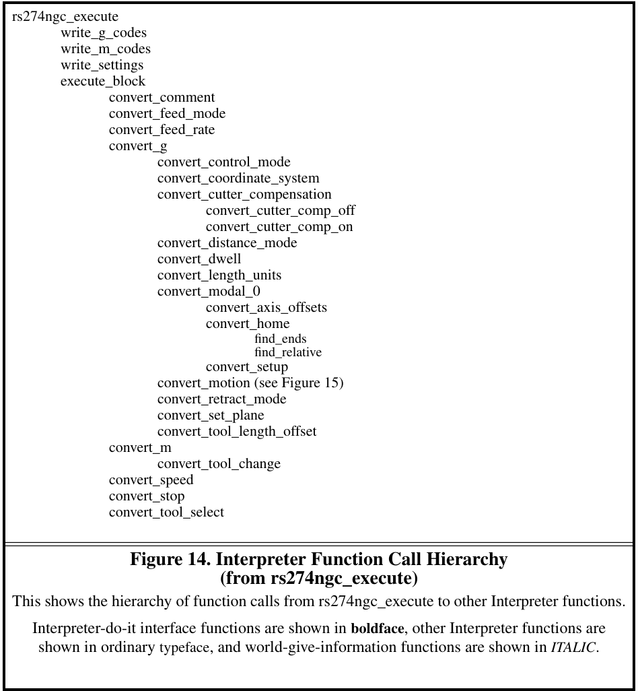

<a id="figure-14-interpreter-function-call-hierarchy"></a>
**Figure 14. Interpreter Function Call Hierarchy.** From `rs274ngc_execute`.

This shows the hierarchy of function calls from rs274ngc_execute to other Interpreter functions.
Interpreter-do-it interface functions are shown in boldface, other Interpreter functions are
shown in ordinary typeface, and world-give-information functions are shown in ITALIC.

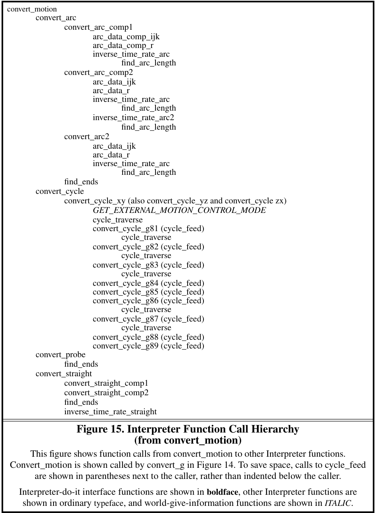

<a id="figure-15-interpreter-function-call-hierarchy"></a>
**Figure 15. Interpreter Function Call Hierarchy.** From `convert_motion`.

This figure shows function calls from convert_motion to other Interpreter functions.
Convert_motion is shown called by convert_g in Figure 14. To save space, calls to cycle_feed
are shown in parentheses next to the caller, rather than indented below the caller.
Interpreter-do-it interface functions are shown in boldface, other Interpreter functions are
shown in ordinary typeface, and world-give-information functions are shown in ITALIC.

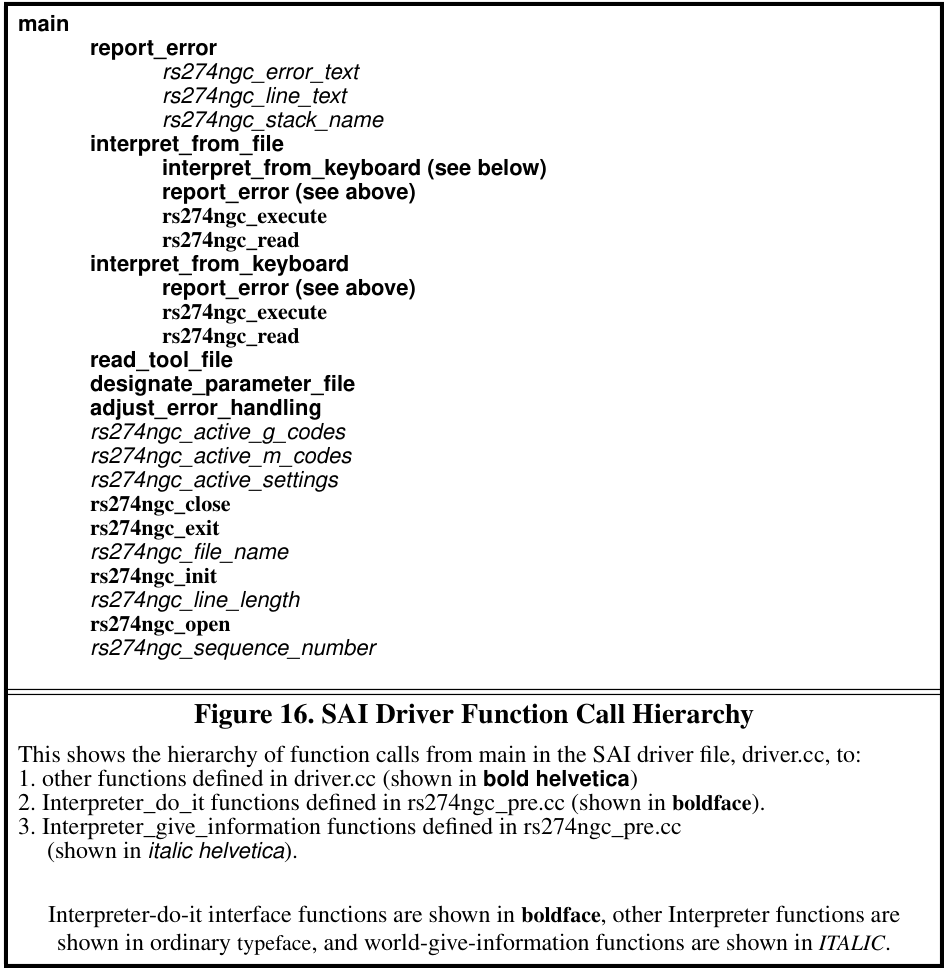

<a id="figure-16-sai-driver-function-call-hierarchy"></a>
**Figure 16. SAI Driver Function Call Hierarchy.**

This shows the hierarchy of function calls from main in the SAI driver file, driver.cc, to:

1. other functions defined in driver.cc (shown in bold helvetica)
2. Interpreter_do_it functions defined in rs274ngc_pre.cc (shown in boldface).
3. Interpreter_give_information functions defined in rs274ngc_pre.cc
(shown in italic helvetica).

Interpreter-do-it interface functions are shown in boldface, other Interpreter functions are
shown in ordinary typeface, and world-give-information functions are shown in ITALIC.

<a id="d-8-special-topics"></a>
### D.8 Special Topics
This section focuses on parts of the software that may be of particular interest to developers.

<a id="d-8-1-interpreter-world-model"></a>
#### D.8.1 Interpreter World Model
The Interpreter maintains a model of its world when it runs. The data type of the model is a struct
named “setup_struct” defined in rs274ngc.hh The working model, a global variable declared in
rs274ngc.cc, is named _setup and is the only instance of a setup_struct. The model includes
around 100 attributes. Most of these are doubles or ints for things like “traverse_rate”, but one,
“parameters” is an array of 5600 doubles, another is the entire tool table, a third is a block (see
Appendix D.8.2), and a few others are substantial arrays.

The model is initialized when rs274ngc_init is called. Some of the initial values are hard-coded,
while others are obtained by calls (in rs274ngc_synch) to various world-give-information
functions.

While the Interpreter runs, the model is updated constantly. Most of the updating is done
assuming that canonical machining function calls have had their intended effects. Updating after
probing is done by calls to world-give-information functions.

<a id="d-8-2-block-model"></a>
#### D.8.2 Block Model
One item in the _setup model is a block struct. The block struct is defined in rs274ngc.hh and has
the attributes listed in Table 14. The rotary axis attributes are conditional; for example, b_number
and b_flag are not part of the struct unless the -DBB flag is used in compiling. Some letters (the
ones for which negative values are OK) have two attributes: a flag and a number. Other letters (the
ones for which negative values are not OK) have only a number.

Information from a line of code is put into the block when the line is read. When an
rs274ngc_execute function call is made, it is the block that is executed. The block is re-initialized
each time a line of code is read. The letters that have flags are initialized by setting the flag to
OFF. The letters that do not have flags are initialized by setting the number to -1.

The g_modes array in the block keeps track of which G modal groups are used on a line of code.
The values in the g_modes array are initialized to -1 before each line of NC code is read. When a
G-code is first read, the G number is multiplied by ten (to make an integer). That number is used
as an index into the _gees array (defined in rs274ngc.cc). The value at that index is the modal
group number for the G code (call it n). The G number is then inserted as the value at the nth
index of the g_modes array. When reading a line is complete, the g_modes array contains a record
of which G codes are to be executed.

The g_modes array also makes it easy to check that at most one member of each G modal group is
used on a line of code; when a G code is read, just check that the g_modes value for the modal
group of the G code is -1; if not, another G code from the same group was previously read from
the same line of NC code.

The m_modes array in the block is handled similarly, the main difference being that M codes are
all integers, so they do not need to be multiplied by ten to get an integer. Thus, the _ems array,
which serves the same function with respect to M codes that _gees serves for G codes, is a tenth
the size of the _gees array.

<a id="table-14-block-attributes"></a>
**Table 14. Block Attributes**

| Attribute Name | Data Type | Attribute Name | Data Type |
| --- | --- | --- | --- |
| a_flag | ON_OFF | l_number | int |
| a_number | double | line_number | int |
| b_flag | ON_OFF | motion_to_be | int |
| b_number | double | m_count | int |
| c_flag | ON_OFF | m_modes | array of 10 ints |
| c_number | double | p_number | double |
| comment | array of 256 chars | q_number | double |
| d_number | int | r_flag | ON_OFF |
| f_number | double | r_number | double |
| g_modes | array of 14 ints | s_number | double |
| h_number | int | t_number | int |
| i_flag | ON_OFF | x_flag | ON_OFF |
| i_number | double | x_number | double |
| j_flag | ON_OFF | y_flag | ON_OFF |
| j_number | double | y_number | double |
| k_flag | ON_OFF | z_flag | ON_OFF |
| k_number | double | z_number | double |

<a id="d-8-3-expression-evaluation"></a>
#### D.8.3 Expression Evaluation
The expression evaluation software is a recursive descent parser that evaluates as it parses. The
function call hierarchy is shown in Figure 13. This software is a coherent package that could be
copied out of the rs274ngc.cc file and used for other purposes. The read_real_expression function
can handle any number of levels of precedence.

<a id="d-8-4-parameter-buffering"></a>
#### D.8.4 Parameter Buffering
As discussed in Section 3.3.3, parameter values on a line of RS274/NGC code are all evaluated
before any parameters are reset. This is often called “parallel” setting. It is implemented by having
a parameter buffer (in the _setup model). When a line of code is read, any parameter values on the
line are taken from the parameters array, and any parameter settings are recorded in the parameter
buffer, not by changing the parameters array. If the line is executed, the parameters in the
parameters array are reset according to the settings in the parameter buffer. This has no other
effect on execution because parameters are not used during execution.

A side effect of having the parameter buffer is that it ensures that the parameters in the _setup
model will not change while a line of code is being read. Nothing else in the model changes
during reading, so with the buffer, if there is an error during reading, nothing needs to be done to
recover state and continue interpretation. In previous interpreter versions, there was no parameter
buffer, parameters changed during reading, and it was not safe to continue interpretation after an
error during reading.

<a id="appendix-e-production-rules-for-the-rs274-ngc-language"></a>
## Appendix E. Production Rules for the RS274/NGC Language
The following is a production rule definition of what combinations of symbols form a valid line of
RS274/NGC code. Developers, researchers, and NC programmers and machine operators with
computer science backgrounds may find this section useful. NC programmers and machine
operators without computer science backgrounds and SAI installers will probably not find it
useful.

The term “line” is at the top of the production hierarchy. The productions are arranged
alphabetically to make connections easy to trace.

The productions are intended to be unambiguous. That is, no permissible line of code can be
interpreted more than one way. To make the productions below entirely unambiguous, it is
implicit that if a string of characters that can meet the requirements of an ordinary comment also
can be interpreted as a message, that string is a message and not an ordinary comment.

The term comment_character is used in the productions but not defined there. A comment
character is any printable character plus space and tab, except for a left parenthesis or right
parenthesis. This implies comments cannot be nested.

It is implicit in the production rules that, except inside parentheses, space and tab characters may
be ignored, or have been removed by pre-processing.

These production rules do not include constraints implied by the semantics of the Interpreter.
Most of the constraints are in terms of combinations of words (as defined below). Many lines of
code that are readable under these production rules will not be executable because they violate
constraints. Any constraint violation will be detected by the Interpreter and will result in an error
message. The error messages are included in Appendix A.

In the productions, a parameter_index is defined as a synonym for real_value. The constraint on a
parameter_index is that it must be an integer between 1 and 5399 (inclusive).

<a id="e-1-production-language"></a>
### E.1 Production Language
The symbols in the productions are mostly standard syntax notation. Meanings of the symbols
follow.
```text
= The symbol on the left of the equal sign is equivalent to the expression on the right
+ followed by
| or
. end of production (a production may have several lines)
[ ] zero or one of the expression inside square brackets may occur
{ } zero to many of the expression inside curly braces may occur
( ) exactly one of the expression inside parentheses must occur
```


<a id="e-2-productions"></a>
### E.2 Productions
Any term in this subsection that is used on the right of an equal sign but is not defined in this
subsection (i.e., does not appear on the left in any definition) is defined in the next subsection in
terms of characters.

```text
arc_tangent_combo = arc_tangent + expression + divided_by + expression .
binary_operation = binary_operation1 | binary_operation2 | binary_operation3 .
binary_operation1 = power .
binary_operation2 = divided_by | modulo | times .
binary_operation3 = and | exclusive_or | minus | non_exclusive_or | plus .
comment = message | ordinary_comment .
comment_character = see explanation above .
digit = zero | one | two | three | four | five | six | seven | eight | nine .
expression = left_bracket + real_value + { binary_operation + real_value } + right_bracket .
letter_a = big_a | little_a .
letter_b = big_b | little_b .
letter_c = big_c | little_c .
letter_d = big_d | little_d .
letter_f = big_f | little_f .
letter_g = big_g | little_g .
letter_h = big_h | little_h .
letter_i = big_i | little_i .
letter_j = big_j | little_j .
letter_k = big_k | little_k .
letter_l = big_l | little_l .
letter_m = big_m | little_m .
letter_n = big_n | little_n .
letter_p = big_p | little_p .
letter_q = big_q | little_q .
letter_r = big_r | little_r .
letter_s = big_s | little_s .
letter_t = big_t | little_t .
letter_x = big_x | little_x .
letter_y = big_y | little_y .
letter_z = big_z | little_z .
line = [block_delete] + [line_number] + {segment} + end_of_line .
line_number = letter_n + digit + [digit] + [digit] + [digit] + [digit] .
message = left_parenthesis + {white_space} + letter_m + {white_space} + letter_s +
{white_space} + letter_g + {white_space} + comma + {comment_character} +
right_parenthesis .
mid_line_letter = letter_a | letter_b | letter_c| letter_d | letter_f | letter_g | letter_h | letter_i
| letter_j | letter_k | letter_l | letter_m | letter_p | letter_q | letter_r | letter_s | letter_t
| letter_x | letter_y | letter_z .
mid_line_word = mid_line_letter + real_value .
ordinary_comment = left_parenthesis + {comment_character} + right_parenthesis .
ordinary_unary_combo = ordinary_unary_operation + expression .
ordinary_unary_operation =
absolute_value | arc_cosine | arc_sine | cosine | e_raised_to |
fix_down | fix_up | natural_log_of | round | sine | square_root | tangent .
parameter_index = real_value .
parameter_setting = parameter_sign + parameter_index + equal_sign + real_value .
parameter_value = parameter_sign + parameter_index .

real_number =
[ plus | minus ] +
(( digit + { digit } + [decimal_point] + {digit}) | ( decimal_point + digit + {digit})) .
real_value = real_number | expression | parameter_value | unary_combo .
segment = mid_line_word | comment | parameter_setting .
unary_combo = ordinary_unary_combo | arc_tangent_combo .
white_space = space | tab .
```


<a id="e-3-production-tokens-in-terms-of-characters"></a>
### E.3 Production Tokens in Terms of Characters
We have omitted the letters and digits in the list below, since they are all the obvious single
characters. For example, one is ‘1’, big_a is ‘A’, and little_a is ‘a’. The list should be used as if
these obvious items were included. Note that not every letter of the alphabet is included (E, O, U,
V, and W are omitted).

```text
absolute_value = ‘abs’
and = ‘and’
arc_cosine = ‘acos’
arc_sine = ‘asin’
arc_tangent = ‘atan’
block_delete = ‘/’
cosine = ‘cos’
decimal_point = ‘.’
divided_by = ‘/’
equal_sign = ‘=’
exclusive_or = ‘xor’
e_raised_to = ‘exp’
end_of_line = ‘ ‘ (non-printable newline character)
fix_down = ‘fix’
fix_up = ‘fup’
left_bracket = ‘[‘
left_parenthesis = ‘(‘
minus = ‘-’
modulo = ‘mod’
natural_log_of = ‘ln’
non_exclusive_or = ‘or’
parameter_sign = ‘#’
plus = ‘+’
power = ‘**’
right_bracket = ‘]’
right_parenthesis = ‘)’
round = ‘round’
sine = ‘sin’
space = ‘ ‘ (non-printable space character)
square_root = ‘sqrt’
tab = ‘ ‘ (non-printable tab character)
tangent = ‘tan’
times = ‘*’
```


## Index

```text
Symbols                               bugs 72
- 18
# 17, 18                              C
% 12                                  C word 16
* 18                                  canned cycle 30, 86
** 18                                 canon.hh 66, 89
+ 18                                  CANON_AXIS 58
/ 18                                  CANON_COMP_SIDE 61
_ems array 102                        CANON_DIRECTION 55
_gees array 102                       CANON_FEED_REFERENCE 49
_setup 101                            CANON_MOTION_MODE 50
CANON_PLANE 47
A                                     canon_pre.cc 66, 89
A word 16                             CANON_SPEED_FEED_MODE 51
ABS 18                                CANON_UNITS 48
absolute value 18                     canonical machining functions 42, 88
ACOS 18                               case 15
addition 18                           centimeters 46
AND 18                                CHANGE_TOOL 57
arc 23                                CLAMP_AXIS 58
center format 24                  COMMENT 59
circular 7                        comment 18
elliptical 52                     compiling 65
helical 7                         continuous mode 8, 30, 50
radius format 23                  controlled point 6
arc cosine 18                         coolant
arc sine 18                               flood 5, 39, 45, 59
arc tangent 18                            mist 5, 39, 45, 60
ARC_FEED 51                               off 38
ASIN 18                                   through-tool 45
ATAN 18                               coordinate system 14, 25, 46
axis clamp 45                             offsets 36
axis offsets 37                       coordinated linear motion 6
COS 18
B                                     cosine 18
B word 16                             current position 8
back boring 34                        cutter radius compensation 61, 73–74
binary operation 17                       algorithm for first move 82
blank line 15                             code 77, 79
block delete 14                           errors 80
block delete switch 5, 9, 63              first move 76, 82
block of code 12                          material edge contour 75
block structure 91, 102, 103              nominal path contour 78
boring 34, 35, 36                         programming instructions 75

Z-axis motion 74                                               inverse time 37
cycle start button 12, 38                                         units per minute 37
feed reference 45
D                                                            file
D word 16                                                         input 12, 62, 65, 91
DAA 66                                                            output 43, 62, 65
DALL_AXES 66                                                      parameter 12, 62
DAXIS_ERROR 66                                                    source code 66, 71, 89
DBB 66                                                            tool 9, 62
DCC 66                                                       FIX 18
degrees 6, 8, 18                                             flood coolant 7, 59
DISABLE_FEED_OVERRIDE 59                                     FLOOD_OFF 59
DISABLE_SPEED_OVERRIDE 59                                    FLOOD_ON 59
distance mode                                                FUP 18
absolute 36
incremental 36                                           G
division 18                                                  G code 16, 21
documentation                                                g_modes 102
source code 90                                           G0 23
drilling 32, 33                                              G1 23, 38
driver.cc 66, 89                                             G2 23
DWELL 52                                                     G3 23
dwell 7, 16, 25, 52                                          G4 25
G10 14, 25
E                                                            G17 25, 38
ELLIPSE_FEED 52                                              G18 25
elliptical arc 45                                            G19 25
EMC 1                                                        G20 26
ENABLE_FEED_OVERRIDE 59                                      G21 26
ENABLE_SPEED_OVERRIDE 59                                     G28 26
END_CANON 47                                                 G30 26
error condition 46                                           G38.2 26
error handling 70                                            G40 28, 38, 75
automatic generation of software 71                      G41 29, 75
macros 71                                                G42 29, 75
exact path mode 8, 30, 50                                    G43 29
exact stop mode 8, 30, 50                                    G49 29
EXP 18                                                       G53 14, 29
expression 17, 85                                            G54 14, 29, 38
evaluation 103                                           G55 14, 29
G56 14, 29
F                                                            G57 14, 29
F word 16, 37, 40                                            G58 14, 29
feed override switch 5, 8, 9, 33, 39, 40, 46, 49, 59         G59 14, 30
feed rate 7, 8, 40, 48                                       G59.1 14, 30
feed rate mode                                               G59.2 14, 30

G59.3 14, 30                           gouging 82
G61 30
G61.1 30                               H
G64 30                                 H word 16
G80 30                                 home position 26
G81 32
G82 33                                 I
G83 33                                 I word 16
G84 33                                 inches 7, 26, 46
G85 34                                 INIT_CANON 47
G86 34                                 Interpreter
G87 34                                     execute 91
G88 35                                     interfaces 88
G89 36                                     read 91
G90 36, 38                                 software 88
G91 36                                     speed 68
G92 14, 36                             Interpreter-do-it functions 88, 91
G92.1 14, 36                           Interpreter-give-information functions 88, 92
G92.2 14, 36, 38                       inverse time 37
G92.3 14, 36
G93 37                                 J
G94 37, 38                             J word 16
G98 37                                 jog 4
G99 37
K
GET_EXTERNAL_ functions
K word 16
ANGLE_UNIT_FACTOR 93
keyboard input 63
FEED_RATE 93
FLOOD 93                            L
LENGTH_UNIT_FACTOR 93               L word 16
LENGTH_UNIT_TYPE 93                 length units 26
MIST 93                             line number 14, 15, 16
MOTION_CONTROL_MODE 94              line of code 12, 14, 105
ORIGIN functions 94                 linear axes 4, 6
PARAMETER_FILE_NAME 94              LN 18
PLANE 94
POSITION functions 94
PROBE_POSITION functions 94
PROBE_VALUE 94
QUEUE_EMPTY 94
SPEED 94
SPINDLE 94
TOOL_LENGTH_OFFSET 95
TOOL_MAX 95
TOOL_SLOT 95
TOOL_TABLE 95
TRAVERSE_RATE 95

M                                              optional program stop switch 5, 9, 38, 61
M code 16, 38                                  OPTIONAL_PROGRAM_STOP 9, 61
m_modes 102                                    OR 18
M0 38                                          order 19
M1 38                                          order of execution 41
M2 12, 38, 71                                  ORIENT_SPINDLE 55
M3 38, 39
M4 39                                          P
M5 38, 39                                      P word 16
M6 39                                          pallet shuttle 5, 8, 38
M7 39                                          PALLET_SHUTTLE 60
M8 39                                          parameter 12
M9 38, 39                                      parameter buffer 103
M30 12, 38, 71                                 parameter file 12, 13, 62
M48 38, 39                                     parameter setting 18
M49 39                                         parameter value 17
M60 38                                         peck drilling 33
material edge contour 75                       power 18
MDI 3, 62, 63, 65                              probe 54, 60
mechanical component 4, 12, 45                 production rule 105
MESSAGE 60                                     program 12
message 19                                         end 12
message display 5, 19, 60                          sample 84
millimeters 7, 26, 46                              start 12
mist coolant 7, 60                             PROGRAM_END 61
MIST_OFF 60                                    PROGRAM_STOP 61
MIST_ON 60
MOD 18                                         Q
modal command 19                               Q word 16
modal group 20                                 quit 63
mode 20
distance 30, 36                            R
feed rate 7, 37                            R word 16
feed reference 49, 52, 53, 54              real value 17
input 3, 62                                reaming 34
path control 20, 30, 50, 94                repeat
retract 31, 37                                 word 19
modulus 18                                     rotational axes 5, 6
multiplication 18                              ROUND 18
round down 18
N                                              round up 18
nominal path contour 78                        RS274/NGC language 2, 12, 105
number 17                                      RS274-D 1
rs274ngc.hh 66, 89
O                                              rs274ngc_active_g_codes 92
optional program stop command M1 9, 38         rs274ngc_active_m_codes 92

rs274ngc_active_settings 92               SET_ORIGIN_OFFSETS 48
rs274ngc_close 92                         SET_SPINDLE_SPEED 55
RS274NGC_ENDFILE 71                       SET_TRAVERSE_RATE 48
rs274ngc_error_text 93                    SIN 18
rs274ngc_errors.cc 66, 89                 sine 18
rs274ngc_execute 92                       source code 66, 89
RS274NGC_EXECUTE_FINISH 70                space 15
RS274NGC_EXIT 71                          speed override switch 5, 8, 9, 33, 39, 40, 46, 59
rs274ngc_exit 92                          spindle 5
rs274ngc_file_name 93                         force 56, 57
rs274ngc_init 92                              speed 40
rs274ngc_line_length 93                       torque 56, 57
rs274ngc_line_text 93                     spindle speed 8
rs274ngc_load_tool_table 92               SPINDLE_RETRACT 56
RS274NGC_OK 70                            SPINDLE_RETRACT_TRAVERSE 56
rs274ngc_open 92                          SQRT 18
rs274ngc_pre.cc 66, 89                    square root 18
rs274ngc_read 92                          Stand-Alone Interpreter 62
rs274ngc_reset 92                         start
rs274ngc_restore_parameters 92                spindle 39
rs274ngc_return.hh 66, 89                 START_CUTTER_RADIUS_COMP. 61
rs274ngc_save_parameters 92               START_SPEED_FEED_SYNCH 50
rs274ngc_sequence_number 93               START_SPINDLE_CLOCKWISE 56
rs274ngc_stack_name 93                    START_SPINDLE_COUNTERCLOCKWISE 56
rs274ngc_synch 92                         STOP 54
stop
S                                             program 38
S word 16, 40                                 spindle 38, 39
SAI 1, 62                                 STOP_CUTTER_RADIUS_COMP. 61
block delete switch 63                STOP_SPEED_FEED_SYNCH 51
error handling options 63, 65         STOP_SPINDLE_TURNING 56
file input 65                         straight probe 26
file output 65                        STRAIGHT_FEED 54
installing 65                         STRAIGHT_PROBE 54
keyboard input 63                     STRAIGHT_TRAVERSE 48
Makefile 67                           subtraction 18
parameter file 63                     switch
tool file 63                              block delete 5, 9, 63
select tool 40                                feed override 5, 8, 9, 33, 39, 40, 46, 49, 59
SELECT_PLANE 47                               optional program stop 5, 9, 38, 61
SELECT_TOOL 58                                speed override 5, 8, 9, 33, 39, 40, 46, 59
selected plane 8, 25
SET_CUTTER_RADIUS_COMPENSATION 61
SET_FEED_RATE 48
SET_FEED_REFERENCE 49
SET_MOTION_CONTROL_MODE 50

T
T word 16, 40
tab 15
TAN 18
tangent 18
tapping 33
THROUGH_TOOL_OFF 60
THROUGH_TOOL_ON 60
tool carousel 5, 8
tool change 5, 8, 57
tool file 9, 62
tool length offset 58
tool select 58
traverse 23
TURN_PROBE_OFF 60
TURN_PROBE_ON 60

U
unary operation 18
UNCLAMP_AXIS 61
Units 46
USE_LENGTH_UNITS 48
USE_NO_SPINDLE_FORCE 56
USE_NO_SPINDLE_TORQUE 56
USE_SPINDLE_FORCE 57
USE_SPINDLE_TORQUE 57
USE_TOOL_LENGTH_OFFSET 58

W
word 15
world model 3, 74, 75, 92, 101
world-give-information functions 88, 93

X
X word 16
XOR 18

Y
Y word 16

Z
Z word 16
```
