# IGES 5.3 Specification (3D CAD Subset)

*Verbatim transcription of the Initial Graphics Exchange Specification 5.3 (formerly ANS US PRO/IPO-100-1996), focused on the content required to implement a conforming 3D CAD file reader and writer. Drafting-only, electrical/LEP, finite-element, and plant-design entities are explicitly marked as omitted where applicable.*

---

## Table of Contents

- [1. General](#1-general)
- [2. Data Form](#2-data-form)
- [3. Classes of Entities](#3-classes-of-entities)
- [4. Entity Types](#4-entity-types)

---
# 1. General

**Contents:**

- [1.1 Purpose](#11-purpose)
- [1.2 Field of Application](#12-field-of-application)
- [1.3 Concepts of Product Definition](#13-concepts-of-product-definition)
- [1.4 Conformance to the Specification](#14-conformance-to-the-specification)
- [1.5 Concepts of the File Structure](#15-concepts-of-the-file-structure)
- [1.6 Concepts of Information Structures for Product Models](#16-concepts-of-information-structures-for-product-models)
- [1.7 Appendices](#17-appendices)
- [1.8 Illustrations](#18-illustrations)
- [1.9 Untested Entities](#19-untested-entities)


_ECO630_

## 1.1 Purpose

This Specification establishes information structures for the digital representation and exchange of product definition data. It supports exchanging this data among Computer- Aided Design and Computer Aided Manufacturing (CAD/CAM) Systems.

## 1.2 Field of Application

This Specification defines file structure and language formats to represent geometric, topological, and non-geometric product definition data. These formats are independent of the modeling method used, and they support data exchange using physical media or electronic communication protocols (defined in other standards).

Chapter 1 defines the overall purpose and objectives of this Specification. Chapter 2 defines each section of the exchange file's structure. Chapter 3 classifies the entities that contain the product definition data. Chapter 4 defines each entity and how it is used to represent the geometry, annotation, definition, and organization components of a complete product definition.

## 1.3 Concepts of Product Definition

This Specification provides the framework for communicating the essential engineering characteristics of physical objects called products. Because these characteristics describe a product in terms of its shape, dimensions, and features, they can be used to design, manufacture, market, and maintain products.

Traditionally, engineering drawings and related information have defined products, but in today's CAD/CAM environments, most drawings exist in computerized form. Because contemporary computer technology ranges from two-dimensional drafting systems to sophisticated solid modelers, data exists in a variety of incompatible formats. A common data communication format facilitates concurrent product and process development among users of different systems, as well as the eventual communication to computerized machines that manufacture and inspect the product.

Figure 1 categorizes product definition data by its principal roles in describing a product. This Specification provides for communicating a portion of this data consistent with the capabilities of basic and advanced CAD/CAM systems.

**Figure 1:** Categories of Product Definition

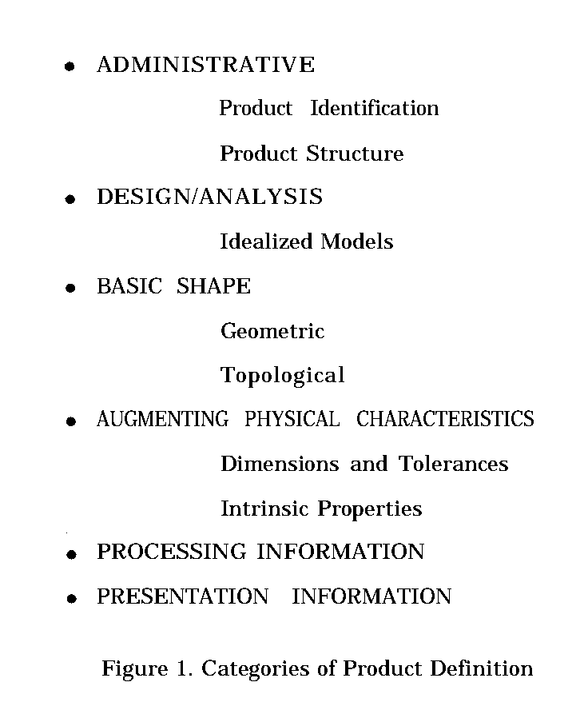

## 1.4 Conformance to the Specification

_ECO658_

### 1.4.1 Background

This Specification's diverse functionality complicates assessing implementation conformance because it can be used in so many ways. Applications having basically different functionality (e.g., mechanical CAD and electrical design) are likely to use different combinations of the entities defined in this Specification. Furthermore, even applications having basically similar functionality (e.g., two CAD products) may use different combinations of entities either because the systems have dissimilar approaches to the same task, or because the designers simply decided to use different entities to represent similar native information. Application protocols have been created to help resolve the diversity issue by specifyng exactly how entities should be used for particular purposes. Application protocols include their own conformance requirements which supplement the conformance requirements in this section.

When conformance evaluations are based on solely objective criteria, they can determine only whether files contain the documented combinations of entities, and whether these entities are both syntactically and structurally correct. An implementation conforming to all of the objective criteria is not necessarily interoperable with other implementations. Thus, conformance is a prerequisite for successful interoperability, but it does not guarantee it. Although interoperability is not a conformance criterion, it is clear that effective interoperability is a primary goal of exchanging files as defined by this Specification.

The availability of good documentation improves testing effectiveness and can assist in assessment of interoperability between potential exchange partners. Refer to "Interoperability Acceptance Testing Methodology Guidelines [IPO93]" for more information.

### 1.4.2 Documentation requirements

All implementations claiming conformance to this version of the Specification shall adhere to all of the requirements in this section and to all of the specific rules for all individual entities they claim to support.

All implementations claiming conformance to this Specification shall have user documentation which accurately indicates the implementation's support of entities defined in this Specification. Preprocessors and postprocessors shall also document entity mapping. Without such documentation, assessing conformance is costly, difficult, and totally subjective.

The documentation shall specify expected processing results for all entities defined in the version of this Specification to which the implementation claims conformance (i.e., the mapping information shall be comprehensive). This does not imply that an implementation must support all possible entity data to conform, since support is claimed and evaluated for individual entities, or for related entity combinations, rather than for the implementation as a whole. Furthermore, since few implementations are comprehensive enough to support everything defined in this Specification or in their native system, the documentation shall identify the category of support (full, partial, or none) by entity type, form number, or element (e.g., many implementations would state "partial support" for the General Note Entity (Type 212) since they don't support the entity element specifying KANJI text). Exhaustive documentation of mathematical limitations is not required; however, failures due to such limitations are non-conforming.

### 1.4.3 Conformance rules

It is intended that conforming implementations shall be capable of processing input files according to their documentation, without halting or aborting, regardless of bad data. Any other behavior is a bug. Developers are responsible for bug repair, and users are responsible for determining if bugs are unacceptable. When a specific validation test suite is used to evaluate claimed conformance, any failure is non-conforming.

Conformance rules are based on these principles:

1. Conformance is defined in terms of a complying exchange file and the implementation's mapping table documentation.

2. Conformance is defined for a single processor in isolation (i.e., not in terms of interoperability).

3. Conformance is defined separately for these implementation categories: preprocessors, postprocessors (including format converters), and tools (including editors, analyzers, browsers, and viewers).

4. Conformance is based on factual information, not a value judgment; it is categorized as "conforming," or "non-conforming."

5. An implementation is considered "conforming" if all of its documented support claims for individual entities are met.

### 1.4.4 Conformance rules for exchange files

All sections of a complying exchange file shall be syntactically and structurally correct as defined by the version of the Specification specified in the file's Global Section.

#### 1.4.4.1 Unprocessible entities

For the purpose of evaluating conformance, unprocessible entities are defined as 1) obsolete entities listed in Appendix F.2) entity types or forms defined in a newer version of the Specification than the implementation supports according to the user documentation, or 3) entities specified as "not supported" in the user documentation. If a file contains an unprocessible entity within a multi-entity structure (e.g., a composite curve), an implementation can ignore the entity or can ignore the entire structure; either behavior is considered conforming providing it is specified in the user documentation.

For information concerning entities having UNTESTED status in this Specification, see section 1.9.

### 1.4.5 Conformance rules for preprocessors

A preprocessor is an implementation designed to translate native CAD system data, other graphics system data, or data in another standard exchange format, into the exchange file format defined by this Specification.

A conforming preprocessor shall create complying exchange files. File content shall represent the native entities according to the user documentation. The preprocessor shall translate all supported native entities, shall report all unsupported native entities, and shall report all processing errors. It is sufficient to report the first occurrence of each kind of error condition and to summarize errors.

Preprocessor conformance is claimed for native entities and their mapping to the exchange file format (i.e., a preprocessor does not claim conformance for the Arc Entity (Type 100); it claims conformance for its native entity named "circle" and maps it to the Arc Entity.). If conformance testing substantiates the mapping, the preprocessor is conforming. Users need to review both the mapping and the conformance test results to determine if the implementation meets their requirements.

Conforming example:
The native database contains an entity called "line" defined by its start and end points. The documentation states that the native entity is mapped as two instances of the Point Entity (Type 116). Evaluation of the exchange file indicates the implementation meets its conformance claim for "line" because the output file contains two instances of the Point Entity with the same coordinates as the "line" start and end points.

Non-conforming example:
The native database contains an entity called "line" defined by its start and end points. The documentation states that the "line" is mapped to the Line Entity (Type 110). Evaluation of the output file indicates the implementation fails to meet its conformance claim for "line" because the output file contains two instances of the Point Entity (Type 116).

### 1.4.6 Conformance rules for postprocessors

A postprocessor is an implementation designed to translate data from the exchange file format defined by this Specification into native CAD system data, other graphics system data, or into another standard exchange format.

A conforming postprocessor shall be capable of reading any complying exchange file without halting or aborting, including exchange files containing unprocessible entities. All unprocessible entities shall not be translated. Incorrect translation of any entity defined in this Specification due to insufficient entity type or form validation is non-conforming. The postprocessor shall translate all supported entities, shall report all unprocessible entities, and shall report all processing errors. It is sufficient to report the first occurrence of each kind of error condition and to summarize errors. Postprocessors which include viewing capability shall comply with the conformance rules for viewers (see Section 1.4.7).

Postprocessor conformance is claimed for exchange file entities and how they are mapped to native format. All translated entities shall be mapped into native entities which preserve the functionality and match the attributes and relationships of the entities in the exchange file according to the user documentation. Any entity that is processed differently than documented is non-conforming. If conformance testing substantiates the mapping, the postprocessor is conforming. Users need to review both the mapping and the conformance test results to determine if the implementation meets their requirements.

### 1.4.7 Conformance rules for editor, analyzer or viewer tools

For this purpose, editor, analyzer, or viewer tool refers to a special-purpose implementation for intelligent editing, checking or viewing of exchange files in the format defined by this Specification. General-purpose text editors are excluded.

A conforming tool shall be capable of reading and processing any complying exchange file without halting or aborting, including files that contain unprocessible entities.

A conforming tool shall issue an error message and exit if an exchange file cannot be processed because it has incorrect record structure or does not contain data as defined in this Specification (e.g., native format files). Tools shall report all file processing errors. It is sufficient to report the first occurrence of each kind of error and to summarize errors.

Any tool with viewing capability shall also conform to the functional requirements for viewers; see section 1.4.7.3.

#### 1.4.7.1 Functional requirements for editors and analyzers

Since file analysis and repair are primary uses for these tools, a conforming tool with edit or analysis capability shall also correctly read and process non-complying exchange files having incorrect data within correctly structured records without halting or aborting.

Following any user-initiated editing (assuming no user errors), a conforming editor shall correctly update any automatically maintained values ( e.g., the Parameter Data Line Count in the DE section) prior to producing a complying exchange file.

A conforming editor shall not affect entities that the user did not edit (except for pointers, line numbers, and other "housekeeping" values such as entity counts); defaulted values shall remain defaulted ( i.e., it is not conforming to export the field's defined default value). This requirement is intended to prevent introducing problems because the editor assigns an incorrect default value. A conforming editor may export numeric fields with different appearance if the values evaluate identically according to this Specification (e.g., replacing leading spaces with leading zeros in an integer field is conforming).

#### 1.4.7.2 Functional requirements for browsers

A conforming browser shall display field values for each entity in the file, including unprocessible or user-defined entities, because doing so does not require knowledge of a field's functional purpose. Field description labeling is an optional feature; its presence or absence is conforming according to the implementation's documentation.

#### 1.4.7.3 Functional requirements for viewers

For each displayable entity claimed as "supported" in its documentation, a viewer shall create a visual appearance equivalent to the examples appearing in this Specification that depict the entity's functional intent. Error reporting by `view only' implementations is an optional feature; its presence or absence is conforming according to the implementation's documentation.

## 1.5 Concepts of the File Structure

This Specification treats product definition data as an organized collection of entities in a format that is independent of the application. The entities include forms common to current and emerging technologies; therefore, mapping to each system's native representations is simplified.

A file consists of five or six sequentially numbered sections in the following order:

- **Flag** — Optional section used only when remainder of file is in compressed ASCII or binary form. The binary form is deprecated (see Appendix H).
- **Start** — Sender comments
- **Global** — General file characteristics
- **Directory Entry** — Entity index and common attributes
- **Parameter Data** — Entity data
- **Terminate** — Control totals

The Flag, Directory Entry, and Terminate Sections contain data in fixed-length fields. The Global and Parameter Data Sections contain delimited, variable-length fields. The Start Section is free-form.

Within the file, the fundamental unit of data is the entity. Entities are categorized as geometry and non-geometry and may be used in any quantity as required to represent the product definition data.

- Geometry entities define the physical shape of a product and include points, curves, surfaces, solids, and relations that are collections of similarly structured entities.
- Non-geometry entities specify annotation, definition, and structure. They provide a viewing mechanism for composing a planar drawing. They also specify attributes of entities such as color and status, associations among entities, and a flexible grouping structure that allows instancing of entity groups contained either within the file or in an external definition file.

Each entity format includes an entity type and form numbers. Although all are not presently assigned, type numbers 0000-0599 and 0700–5000 are allocated for Specification- defined entities and type numbers 0600-0699 and 10000-99999 are reserved for implementor-defined (i.e., macro) entities. (See Section 1.6.6.)

Within each type, the default form number is zero; some entities have form numbers greater than zero to classify additional functionality. Each entity format also includes a structure for an arbitrary number of pointers to associativity and property entities that also support Specification-defined and implementor-defined types and forms.

## 1.6 Concepts of Information Structures for Product Models

The geometric model of a product is created using the entity set defined in Chapter 4. Since geometry entities generally are defined independently of one another, property and associativity entities are used to augment and define their relationships.

### 1.6.1 Property Entity

The Property Entity (Type 406) allows non-geometric numeric or text information to be related to

- one or more entities that reference it, or
- when the Property Entity is un-referencd, all entities sharing the Property Entity's level number. (This capability allows assigning an application's function to a level. )

Because the Directory Entry Level Number may point to a Definition Levels Property Entity (Type 406, Form 1), a property may be applied to multiple levels. Property values also may be displayed as text if an additional pointer of the property points to a Text Display Template Entity (Type 312). (See Section 2.2.4.5.2.)

### 1.6.2 Associativity Entity

The Associativity Entities (Types 302 and 402) allow several entities to be related to one another. The Specification includes predefine associativities that may be instanced as required. (See Section 4.80.1.) Implementor-defined associativities may be instanced after the Associativity Definition Entity (Type 302) has been used to define the structure of the Associativity Instance Entity (Type 402).

### 1.6.3 View Entity

A view depicts a geometric model of a product. It is a two-dimensional projection of a selected subset of the model, and may include non-geometric information such as text.

The View Entity (Type 410) and Views Visible Associativity Entities (Type 402, Forms 3,4, and 19 ) control the orientation, scaling, clipping, hidden line removal, and other characteristics associated with individual views. It is essential to understand that a view defines only the rules and parameters for depicting a geometric model. Product definition data is not duplicated in various views, eliminating the risk of conflicting or ambiguous information.

### 1.6.4 Drawing Entity

The Drawing Entity (Type 404) views and annotation for human presentation. Each file may contain one or more drawings.

### 1.6.5 Transformation Matrix Entity

The Transformation Matrix Entity (Type 124) applies translation and rotation as needed to any entity in the geometric model. It aids construction of the model itself and supports the development of views and drawings.

### 1.6.6 Implementor-defined Entities

This Specification allows the implementor to define entities to support archiving of data forms unique to a particular system.

## 1.7 Appendices

As an aid to the implementor or user, a series of appendices is included with this Specification. (See the Table of Contents.)

## 1.8 Illustrations

The technical illustrations in this Specification were created on a variety of CAD/CAM systems before conversion to data files in the format defined by this Specification. Because of limitations in the software used to publish this Specification, some of the data files were edited by various tools to create flat, two-dimensional representations. Finally, the files were processed through filtering software to remove identification of the creating system.

As an aid to testing postprocessor implementations, some of the data files contain the actual entities they illustrate; in this case, the data file name is embedded in the figure caption. For example, Figure 105 shows the twenty fill-pattern codes defined for the Sectioned Area Entity (Type 230), and the data file F230.IGS actually contains 20 instances of this entity.

All of these data files are available from the IGES/PDES Organization's administrative office.

## 1.9 Untested Entities

The IGES/PDES Organization recommends that special consideration be given when implementing certain untested entities or entity forms labeled "‡." (For a list of entities in this category, see Section 4.) The organization policy is to note those entities or entity forms which are not known to have been implemented. Implementors are cautioned that the entities may not work and may be significantly changed based on implementation experience. The IGES/PDES Organization will remove the untested status when these extensions are known to be useful, complete, and correct. Procedures to accomplish this are documented in [IGES95]. Please communicate any implementation results to the IGES/PDES Organization administrative office.

---

# 2. Data Form

**Contents:**

- [2.1 General](#21-general)
- [2.2 ASCII File Formats](#22-ascii-file-formats)
- [2.3 Compressed Format](#23-compressed-format)


_ECO630_

## 2.1 General

This Specification supports data exchange via an ASCII [ANSI68, ANSI77] file either in Fixed or in Compressed Format. (A Binary Format (which shall not be used to create new files) is described in Appendix H.)

## 2.2 ASCII File Formats

**Fixed Format** — Beginning with its first character, the file consists of 80-column lines. Lines are grouped into sections Each line contains section-specific data field(s) in columns 1-72, an identifying letter code in column 73, and an ascending sequence number in columns 74-80. Within each section, the sequence number begins at 1 and is incremented by 1 for each line. Sequence numbers are right-justified in their field with leading space or leading zero fill.

Sections in the Fixed Format shall appear in the following order:

| Section name | Col. 73 Letter Code |
|---|---|
| Start | S |
| Global | G |
| Directory Entry | D |
| Parameter Data | P |
| Terminate | T |

See Section 2.2.4 for more details concerning purpose and data content of file sections.

Within a section, each entity's set of data fields (appearing on one or more lines) is called a record. _ECO653_

Unsequenced lines ( i.e., completely blank lines) shall not appear prior to the Terminate Section, nor shall any sequenced lines appear after it. Unsequenced lines may appear after the Terminate Section when the sending system's file structure has blocks larger than 80 bytes and the quantity of records in the file is not a multiple of the block size. Postprocessors shall ignore all lines appearing after the Terminate Section.

**Compressed Format** — Compressed Format files shall begin with a Flag Section consisting of one line having spaces in columns 1-72, the section identifier letter code "C" in column 73, and the sequence number 1 right-justified in columns 74-80. The Start, Global, and Terminate Sections are the same as in the Fixed Format. The Directory Entry and Parameter Data sections are combined into a variable-line-length Data Section which saves space by omitting fields having the same value as the previous entity.

Sections in the Compressed Format shall appear in the following order:

| Section name | Col. 73 Letter Code |
|---|---|
| Flag | C |
| Start | S |
| Global | G |
| Data | none |
| Terminate | T |

See Section 2.2.4 for more details concerning purpose and data content of file sections.

The Compressed Format has not been widely implemented. Commercial file compression software can reduce the size of Fixed Format files. For details, see Section 2.3.

_ECO653_

### 2.2.1 Field Categories and Defaulting

All data fields in files conforming to this Specification fit into one of the following categories. When a field's description does not specify its category, the correct category is determined by using the identification criteria and examples. Most fields are designated "required" because their presence (even when defaulted) is mandatory to enable correct parsing of the remainder of the record.

**Required, fixed value**

- the field shall appear, and it shall contain the fixed value defined in this Specification.
- postprocessors shall use the value defined in this Specification.

Identification: the field allows one, explicitly defined value.

Examples: Entity use flag for the Drawing Entity (Type 404), count of parameter fields for the Name Property (Type 406, Form 15).

**Required, default**

- the field shall appear, and a value may be supplied; supplying of a value does not imply the native system user entered it, and no additional information is implied when a field value equals its default value.
- postprocessors shall use the supplied value or shall assign the default value if the field is empty; additional information shall not be inferred from the presence of any value, whether or not it is the same as the field's default value.

Identification: the field has an explicitly defined default value, or has an implicit default value because it is not identifiable as another category.

Examples: the field delimiter character in field 1 of the Global Section, the entity form number in the Directory Entry section, or the count of associated entity pointers appearing after every entity's defined Parameter Data fields.

**Required, no default**

- the field shall appear, and a value shall be supplied.
- postprocessors shall use the supplied value.

Identification: the field inexplicitly defined "may not be defaulted", the field can contain a pointer and no meaning is specified for a zero value, or a preceding integer field specifies a non-zero count of required fields.

Examples: Directory Entry Section pointer to Parameter Data record, Terminate Section counts, pointers to the constituent entities of a Composite Curve Entity (Type 102).

**Optional, no default** _ECO653_

- the field may appear; if it does, its value may be supplied or it may be empty.
- postprocessors shall use the supplied value, but may assign a system-dependent value if the field is empty.

Identification: the field is explicitly defined as "optional" in the Directory Entry Section. Optional fields do not occur in free-formatted sections to avoid parsing problems; although trailing fields may function as if they were optional, they are categorized as "required, default," and the implicit default value is interpreted as meaning "unspecified."

Examples: the entity label and subscript in the Directory Entry Section.

**Ignored**

- the field may appear, and if it does, its value may be supplied; any value shall be represented using the defined data type for the field (e. g., even though the field's value is ignored, a preprocessor shall not put a string data value into an integer field).
- processors shall ignore any supplied value.

Identification: the field is explicitly defined as "ignored" or "not applicable (n.a.)."

Examples: color of an Associativity Entity (Type 402), all data other than entity type number of the Null Entity (Type 0).

**Reserved**

- an empty field shall appear; using reserved fields for any exchange purpose prior to their definition by this Specification is prohibited because it will cause compatibility problems.
- postprocessors shall ignore any supplied value.

Identification: field is explicitly defined as "reserved."

Examples: fields 16 and 17 of the Directory Entry Section.

In fixed-length-field sections, a default (i.e., empty) value shall be specified by filling the field with space characters. In delimited, variable-length-field sections, a default value shall be specified by the occurrence of two consecutive field delimiters, or by a field delimiter followed by a record delimiter.

Field values shall not be defaulted when there is no implicit or explicit default value defined in this Specification.

NOTE: Neither a numeric field containing zero (i.e., a "zero" field), nor a space-filled Hollerith string (i.e., a "blank" string such as "4H    ") is a "defaulted' field.

### 2.2.2 Data types

This Specification defines six data types for field values:

1. integer (fixed point)
2. real (floating point)
3. string
4. pointer
5. language statement
6. logical

Regardless of whether data fields are fixed or variable length, the following rules apply to data types:

- Blanks are values only within string fields and in language statements. For all other data types, an entirely blank (i.e., empty) field indicates a "defaulted" field.
- Postprocessors shall ignore leading blanks in numeric fields. Numeric fields shall not contain either embedded or trailing blanks.
- A numeric data type may be either signed or unsigned. If signed, the leading plus or minus determines the sense of the number; if unsigned, the sense is non-negative.
- Numeric data types shall not contain embedded commas even if Global Section field 1 changes the field delimiter to another character. This rule also applies when files originate in countries where "comma" is used instead of "period" as the decimal point in real numbers.
- A string field or language statement may cross line boundaries; this is allowed because their length can exceed the number of usable columns available in one line. When a string field crosses a line boundary, its character count and Hollerith delimiter ("H") shall appear consecutively on the first line. The string or language statement value continues to the last usable column on the current line (i.e., to column 64 in the Parameter Data Section, and to column 72 in all other sections). The field continues with column 1 on following line(s), until the total quantity of characters is processed.

#### 2.2.2.1 Integer data type

An integer (i.e., a fixed point value) always represents an integer value exactly. It may have a positive, negative, or zero value. The absolute magnitude of an integer data type shall not exceed the value 2^(N-1)^ -1, where N is the number of bits used to represent integer values (Global Parameter 7).

The implicit default for an integer field is zero.

An integer has an optional sign followed by a non-empty string of digits representing a decimal number.

The following are examples of valid integers (assuming the value of Global Parameter 7 is 32):

```
1 150 2147483647 +3451
0 - l 0 -2147483647
```

#### 2.2.2.2 Real data type

A real data type ( i.e., a floating point value) is a system-dependent approximation of the value of a real number. It may have a positive, negative, or zero value. The absolute magnitude and precision of a real data type shall not exceed that indicated by Global Parameters 8–9 (for single precision) and 10-11 (for double precision).

The implicit default for a real field is zero.

The following rules and examples apply to real data types, either as parameter data or as processed for text display:

- A basic real value contains (in this order) an optional sign, an integer part, a decimal point, a fractional part and an exponent. Both the integer part and the fractional part are sequences of the digits 0-9; either may be omitted, but not both. Either the decimal point or the exponent may be omitted, but not both. A basic real value is interpreted as a decimal number.
- Neither leading zeros in the integer part nor trailing zeros in the fractional part shall be interpreted as altering accuracy or implying tolerances of real values. _ECO653_
- An exponent is either of the letters "E" or "D" followed by an optionally signed integer representing the power of ten by which the preceding basic real value is multiplied. An "E" specifies single-precision (corresponding to Global Section parameter 9) and "D" specifies double-precision (corresponding to Global Section parameter 10). If unsigned, the sense of an exponent is non-negative.

The following are examples of valid real values:

```
256.091      0.               -0.58               +4.21
1.36E1       -1.3E-02         0.lE-3              1.E+4
145.98763D4  -2145.980001D-5  0.123456789D+09     -.43E2
```

#### 2.2.2.3 String data type

Strings are represented in the Hollerith form as specified in Appendix C of the FORTRAN Standard [ANSI78]. A string is an unlimited-length sequence of ASCII characters. Blanks, parameter delimiters, and record delimiters are treated as ordinary characters within strings.

The string data type consists of a nonzero, unsigned integer value (character count), followed by the Hollerith delimiter ("H"), followed by the quantity of contiguous characters specified by the character count. A string shall not contain any ASCII control characters (i e., hexadecimal 00 through 1F and hexadecimal 7F).

The implicit default for a string field is NULL (see NULL STRING in Appendix K).

The following are examples of valid strings:

```
3H123  10HABC ., ; ABCD

8H0.457E03 12H HELLO THERE
```

#### 2.2.2.4 Pointer data type

A pointer data type is represented by an integer value in the range -9999999 through 9999999; either leading-zero or leading-space fill may be used in fixed-length fields.

The implicit default for a pointer field is zero; a pointer having a zero value (explicitly or due to default assignment) also may be called a null pointer. Default assignment rules for pointers differ from the rules for other data types; for a pointer field, defaulting shall occur only when the meaning is defined in this Specification. A typical field description permitting pointer defaulting is "Pointer to the DE of the <referenced item> or zero (default)."

The absolute value of a pointer represents either the Directory Entry or Parameter Data sequence number. This Specification uses the term reference to mean "points to.".

Negated pointer values occur in fields which define a different meaning for a zero or positive value. For example, in the color field of the Directory Entry section, a negated pointer references a Color Definition Entity (Type 314), and non-negative values specifiy entity colors.

A negated or zero pointer value is valid only where it is explicitly defined in this Specification.

#### 2.2.2.5 Language Statement data type

_ECO653_

The Language Statement data type is an arbitrary character string containing alphanumeric, punctuation, and space characters from the ASCII character set. A language statement shall not contain any ASCII control characters (i.e., hexadecimal 00 through 1F and hexadecimal 7F).

Language statement syntax prohibits implicit default values in the language statement itself; however, normal implicit defaults apply to other data types which can be referenced by language statements.

Unlike the string data type, the language statement shall not contain a character count and Hollerith delimiter ("H") before its text. Section 4.71.3 defines the syntax of the language statement as used for the Macro Entity. The length of the language statement is determined by means of the Parameter Data line count in the Directory Entry record for the entity (see Directory Entry Parameter 14).

#### 2.2.2.6 Logical data type

A logical data type has only two values: "TRUE" and "FALSE"; The unsigned integer 0 denotes FALSE and the unsigned integer 1 denotes TRUE.

The implicit default for a logical field is FALSE.

### 2.2.3 Rules for Forming and Interpreting Free Formatted Data

The data in several file sections appears in "free format" within specified ranges of columns. When free format is used, the following rules apply (in addition to those in Section 2.2.2):

- The parameter delimiter (Global Parameter 1) separates parameters.
- The record delimiter (Global Parameter 2) ends the record (i.e., it terminates a list of parameters).
- If two parameter delimiters, or a parameter delimiter followed by a record delimiter, appear consecutively or are separated only by blanks, the field they delimit is "empty" (i.e., "defaulted" ). Postprocessors shall assign the explicit or implicit default values according to data type.
- When a record delimiter appears before the end of the parameter list, all remaining "required, fixed value" fields shall be assigned their defined values, and all remaining "required, default" fields shall be assigned their explicit or implicit default values according to the data type. _ECO653_
- Parameter Data Section records may be terminated with the record delimiter character prior to the two groups of additional parameters (see Section 2.2.4.5.2). This is valid because the pointer counts in the two "required, default" numeric fields preceding the unused "required, no default" pointer fields have been defaulted. The postprocessor shall assign the implicit default of zero, so it does not expect the unused pointer fields. _ECO653_
- The last data column on a free-formatted line (i.e., Column 72 in the Global Section, and Column 64 in the Parameter Data Section) does not substitute for either a parameter delimiter or a record delimiter.
- A numeric field shall end at least one column prior to the last data column so its end-of-field delimiter character is on the same line.
- The parameter delimiter and record delimiter characters are treated as text (not as delimiters) when they appear within a string field.

#### 2.2.3.1 Parameter and Record Delimiter Combinations

The following ASCII characters are prohibited from being used as either Global Parameter 1 (Parameter Delimiter) or Global Parameter 2 (Record Delimiter) because they will cause parsing difficulties for postprocessors.

| Name | Hexadecimal Range |
|---|---|
| The Control Symbols | 0-1F, 7F |
| The Space Character | 20 |
| The Digits 0 through 9 | 30-39 |
| The Characters + - . | 2B, 2D, 2E |
| The Letters D E H | 44, 45, 48 |

Only four combinations are allowed for the Parameter Delimiter and Record Delimiter in the Global section. They are (where α and β represent ASCII characters):

| Form | Interpretation | |
|---|---|---|
| | Parameter Delimiter Character | Record Delimiter Character |
| 1.  „  | , | ; |
| 2. 1Hαα1Hβα | α | α |
| 3. 1Hααα | α | ; |
| 4. ,1Hβ, | , | β |

### 2.2.4 File Structure

The file contains six subsections which shall appear contiguously in the file, with no intervening blank lines, in the following order:

- a. Flag Section (Binary or Compressed Format files only)
- b. Start Section
- c. Global Section
- d. Directory Entry Section
- e. Parameter Data Section
- f. Terminate Section

Directory Entry and Parameter Data Section information is combined in the Data Section of Compressed Format files (see Section 2.3).

Figure 2 illustrates the Fixed Format, which does not include the Flag Section.

**Figure 2:** General file structure of the Fixed Format

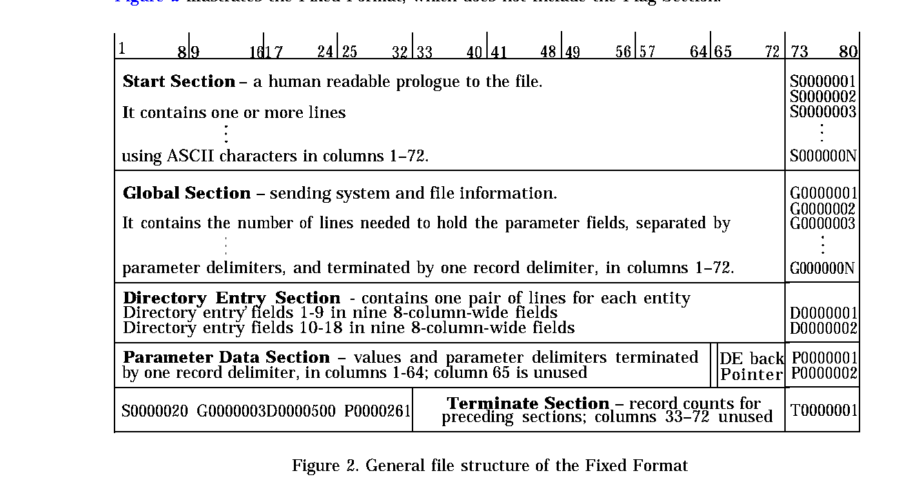

#### 2.2.4.1 Flag Section

The optional Flag Section indicates the file is in the Binary Format (see Appendix H) or in the Compressed Format (see Section 2.3).

#### 2.2.4.2 Start Section

The required Start Section provides a human-readable prologue to the file.

- Start Section lines are identified with the letter code "S" in column 73 and are sequenced in columns 74–80.
- Start Section lines have one data field in columns 1–72. The field may have any content desired by the sender, except that it shall not contain any ASCII control characters (i.e., hexadecimal 00 through 1F and hexadecimal 7F). _ECO653_
- At least one Start Section line shall appear in the file, even if it is blank except for the sequence field.

An example of a Start Section is shown in Figure 3.

**Figure 3:** Format of the Start section in the Fixed Format

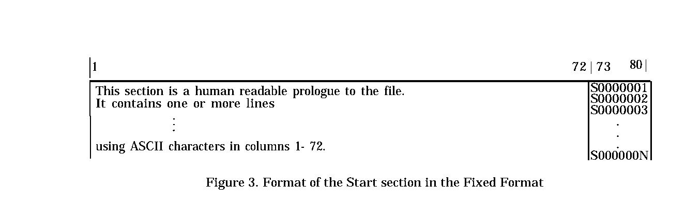

#### 2.2.4.3 Global Section

The required Global Section contains information describing the preprocessor and information needed by postprocessors to handle the file.

- Global Section records are identified with the letter code "G" in column 73 and are sequenced in columns 74-80 (see Section 2.2.1)

The first two global parameters define the parameter delimiter and record delimiter characters if the default values ("comma" and "semicolon," respectively) are not used.

The parameters for the Global Section are written as delimited, variable-length field values described in Section 2.2.3. As stated in Section 2.2.3, Global Section parameter values end at the record delimiter. If the Global Section specifies new delimiter characters, they take effect immediately and are used in the remainder of the Global Section as well as in the rest of the file. The parameters in the Global Section are defined in Table 1 and in the following paragraphs.

**Table 1. Parameters in the Global Section**

| Index | Type | Description |
|---:|---|---|
| 1 | String | Parameter delimiter character. |
| 2 | String | Record delimiter character. |
| 3 | String | Product identification from sending system |
| 4 | String | File name |
| 5 | String | Native System ID |
| 6 | String | Preprocessor version |
| 7 | Integer | Number of binary bits for integer representation |
| 8 | Integer | Maximum power often representable in a single-precision floating point number on the sending system |
| 9 | Integer | Number of significant digits in a single-precision floating point number on the sending system |
| 10 | Integer | Maximum power of ten representable in a double-precision floating point number on the sending system |
| 11 | Integer | Number of significant digits in a double-precision floating point number on the sending system |
| 12 | String | Product identification for the receiving system |
| 13 | Real | Model space scale |
| 14 | Integer | Units flag |
| 15 | String | Units Name |
| 16 | Integer | Maximum number of line weight gradations. Refer to the Directory Entry Parameter 12. |
| 17 | Real | Width of maximum line weight in units. Refer to the Directory Entry Parameter 12 (see Section 2.2.4.4.12) for use of this parameter. |
| 18 | String | Date and time of exchange file generation `15HYYYYMMDD.HHNNSS` or `13HYYMMDD.HHNNSS` where: YYYY or YY is 4 or 2 digit year; MM is month (01-12); DD is day (01-31); HH is hour (00-23); NN is minute (00-59); SS is second (00-59) _ECO638_ _ECO643_ |
| 19 | Real | Minimum user-intended resolution or granularity of the model in units specified by Parameter 14. |
| 20 | Real | Approximate maximum coordinate value occurring in the model in units specified by Parameter 14. |
| 21 | String | Name of author |
| 22 | String | Author's organization |
| 23 | Integer | Flag value corresponding to the version of the Specification to which this file complies. |
| 24 | Integer | Flag value corresponding to the drafting standard to which this file complies, if any. |
| 25 | String | Date and time the model was created or last modified, in same format as field 18. |
| 26 | String | Descriptor indicating application protocol, application subset, Mil-specification, or user-defined protocol or subset, if any. |

##### 2.2.4.3.1 Parameter Delimiter Character

This "required, default" field indicates which character is used to separate parameter values in the Global and Parameter Data sections. The default value is "comma." Each occurrence of this character denotes the end of the current parameter and the start of the next parameter, except: (1) strings in which the delimiter character may be part of the string, and (2) language statements in which the delimiter character may be a part of the language syntax. See Section 2.2.3.

##### 2.2.4.3.2 Record Delimiter

This "required, default" field indicates which character denotes the end of parameters in the Global Section and in each Parameter Data Section entry. The default value is "semicolon." Each occurrence of this character denotes the end of the current parameter as well as the end of the parameter list. Two exceptions exist: (1) strings in which the delimiter character may be part of the string; (2) language statements in which the delimiter character may be a part of the language syntax. See Section 2.2.3.

##### 2.2.4.3.3 Product Identification From Sender

This "required, no default" field contains the name or identifier which is used by the sender reference this product.

##### 2.2.4.3.4 File Name

This "required, no default" field contains the name of the exchange file.

##### 2.2.4.3.5 Native System ID

This "required, no default" field uniquely identifies the native system software which created the native format file used to generate this exchange file (i.e., it does not refer to the preprocessor version, which is specified in the next parameter). It shall include the complete vendor's name, the name by which the system is marketed, and the product ID, version number, or release date of the native system software.

##### 2.2.4.3.6 Preprocessor Version

This "required, no default" field uniquely identifies the version or release date of the preprocessor which created this file (i.e., it does not refer to the version of the Specification supported by the preprocessor, which is specified by parameter 23.). If the native system software contains the preprocessor (i.e.,they are a single executable), this value may be the same as the Native System ID field, or it may be different depending on the release naming convention used by the vendor.

##### 2.2.4.3.7 Number of Binary Bits for Integer Representation

This "required, no default" field indicates how many bits are present in the integer representation of the sending system, thereby limiting the range of valid values for integer parameters in the file.

##### 2.2.4.3.8 Single-Precision Magnitude

This "required, no default" field indicates the maximum power of ten which can be represented as a single-precision floating-point number on the sending system.

##### 2.2.4.3.9 Single-Precision Significance

This "required, no default" field indicates the number of decimal digits of significance which can be represented accurately in the single-precision floating point representation on the sending system.

##### 2.2.4.3.10 Double-Precision Magnitude

This "required, no default" field indicates the maximum power of ten which can be represented as a double-precision floating-point number on the sending system.

##### 2.2.4.3.11 Double-Precision Significance

This "required, no default" field indicates the number of decimal digits of significance which can be represented accurately in the double-precision floating-point representation on the sending system.

Example: For an IEEE floating point representation (see [IEEE85]) with 32 bits, the magnitude and significance parameters have the values 38 and 6, respectively; for a representation with 64 bits, the values are 308 and 15, respectively.

##### 2.2.4.3.12 Product Identification for the Receiver

This "required, default" field contains the name or identifier which shall be used by the receiving system's software to reference this product. _ECO653_ The default value is the value specified in parameter 3.

##### 2.2.4.3.13 Model Space Scale

_ECO653_

This "required, default" field contains the ratio of model space to real-world space (e.g., 0.125 indicates that 1 model space unit equals 8 real-world units). The default value is 1.0.

##### 2.2.4.3.14 Units Flag

_ECO653_

This "required, default" field contains an integer value denoting the model units used in the file according to the following table. Postprocessors shall use this field's value to control the units unless the value is 3. (Field 15 is redundant when the value is not 3, but is convenient for human readability.). The default value is 1.

| Value | Model Units |
|---:|---|
| 1 | Inches (default) |
| 2 | Millimeters |
| 3 | (See Parameter 15 for name of units) |
| 4 | Feet |
| 5 | Miles |
| 6 | Meters |
| 7 | Kilometers |
| 8 | Mils (i.e., 0.001 inch) |
| 9 | Microns |
| 10 | Centimeters |
| 11 | Microinches |

##### 2.2.4.3.15 Units Name

_ECO653_

This "required, default" field contains a string naming the model units in the system; the value shall specify the same units as field 14 unless field 14 is 3. The default value is 1. Postprocessors shall ignore this field if it is inconsistent with field 14.

| Value | Model Units |
|---|---|
| 2HIN or 4HINCH | Inches (default) |
| 2HMM | Millimeters |
| 2HFT | Feet |
| 2HMI | Miles |
| 1HM | Meters |
| 2HKM | Kilometers |
| 3HMIL | Mils |
| 2HUM | Microns |
| 2HCM | Centimeters |
| 3HUIN | Microinches |

When field 14 is 3, the string naming the desired unit shall conform to [MIL12] or [IEEE260].

##### 2.2.4.3.16 Maximum Number of Line Weight Gradations

This "required, default" field is the number of equal subdivisions of line thickness. The value shall be greater than zero. The default value is 1. _ECO653_

##### 2.2.4.3.17 Width of Maximum Line Weight in Units

This "required, no default" field contains the actual width in model units of the thickest line possible in the file. _ECO653_

##### 2.2.4.3.18 Date and Time of Exchange File Generation

This "required, no default" field is a time stamp indicating when this exchange file was created. Its format is either

```
15HYYYYMMDD.HHNNSS
```

or _ECO638_

```
13HYYMMDD.HHNNSS.
```

If the two-digit year format is used, YY is assumed to be prefixed by "19". The four-digit year format is necessary for years occuring beyond 1999 (or before 1900).

This date format applies to all date fields in both Global and Parameter Data Sections in this Specification.

##### 2.2.4.3.19 Minimum User-Intended Resolution

This "required, no default" field specifies the smallest distance between coordinates, in model-space units, that the receiving system shall consider as discernible (e.g., if the value is .0001, postprocessors shall consider as "coincident" any coordinate locations in the file which are less than .0001 model-space units apart.).

##### 2.2.4.3.20 Approximate Maximum Coordinate Value

This "required, default" field contains the upper bound on the absolute values of all coordinate data actually occurring in this model after transformation (e.g., 1000.0 means for all coordinates, |X|, |Y|, |Z|<= 1000.0). It specifies a cubic volume, centered on the origin, which can enclose the entire model. The enclosed volume may be larger than the model's actual volume depending upon its shape and its distance from the origin (e.g., a model whose coordinates range from (999,999,0) to (1000,1000,0) has a volume of 1 cubic unit for the model, but in this case, the field's value is 1000, which specifies a volume of 1,000,000,000 cubic units. _ECO653_

This field shall be defaulted or shall contain 0.0 if its value cannot be determined accurately (i.e., large values having no relationship to actual entity values in the file shall not be specified.). The default value is 0.0, which is interpreted as "the maximum coordinate value is unspecified."

##### 2.2.4.3.21 Name of Author

This "required, default" field contains the name of the person who created this exchange file. The default value is NULL, which is interpreted as "unspecified." _ECO653_

##### 2.2.4.3.22 Author's Organization

This "required, default" field contains the name of the organization or group with whom the author is associated. The default value is NULL, which is interpreted as "unspecified." _ECO653_

##### 2.2.4.3.23 Version Flag

This "required, default" field contains an integer value corresponding to the version of the Specification to which the data in this file complies. The default value is 3. Postprocessors finding an unrecognized value less than 1 shall assign 3; postprocessors finding an unrecognized value greater than 11 shall assign 11.

The values in the table below are valid for this Specification version, and will be incremented for each successive version or ANSI Specification. Appendix J includes a full citation for each version.

| Value | Version | Reference |
|---:|---|---|
| 1 | 1.0 | [NBS80] |
| 2 | ANSI Y14.26M -1981 | [ANSI81] |
| 3 | 2.0 | [NBS83] |
| 4 | 3.0 (default) | [NBS86] |
| 5 | ASME/ANSI Y14.26M -1987 | [ASME87] |
| 6 | 4.0 | [NBS88] |
| 7 | ASME Y14.26M -1989 | [ASME89] |
| 8 | 5.0 | [NIST90] |
| 9 | USPRO/IPO100 IGES5.2 | [USPRO91] |
| 10 | 5.1 | [USPRO93] |
| 11 | 5.3 | This document |

##### 2.2.4.3.24 Drafting Standard Flag

This "required, default" field contains an integer value corresponding to the drafting standard to which this file complies, if any. The default value is 0.

| Code | Drafting Standard |
|---:|---|
| 0 | No standard specified (default) |
| 1 | ISO — International organization for Standardization |
| 2 | AFNOR — French Association for Standardization |
| 3 | ANSI — American National Standards Institute |
| 4 | BSI — British Standards Institute |
| 5 | CSA — Canadian Standards Association |
| 6 | DIN — German Institute for Standardization |
| 7 | JIS — Japanese Institute for Standardization |

##### 2.2.4.3.25 Date and Time Model was Created or Modified

This "required, default" field is a time stamp indicating when the native system model was created or last modified. The field shall be defaulted if its value is unavailable; i.e., neither the value of field 18 nor an arbitrary value shall be specified in lieu of defaulting the field. The default value is NULL, which is interpreted as "unspecified."

##### 2.2.4.3.26 Application Protocol/Subset Identifier

This "required, default" field specifies that the file content conforms to an application protocol, subset, or user-defined protocol. The default value is NULL, which is interpreted as "unspecified." _ECO643_ Protocols define rules for using this Specification in a uniform way to improve information exchange for a particular purpose. When not defaulted, this field's value is defined in the application protocol or subset to which the file content conforms.

#### 2.2.4.4 Directory Entry Section

The Directory Entry Section has one Directory Entry record for each entity in the file. The Directory Entry record for each entity is fixed in size and contains 20 fields of eight characters each, in two consecutive 80-character lines. Values are right-justified in each field. With the exception of the fields numbered 10, 16, 17, 18, and 20, all fields in this section shall be either integer or pointer data types. In this section, the word "number" is sometimes used in place of the word "integer."

The purposes of the Directory Entry Section are to provide an index for the file and to contain attribute information for each entity. The order of the Directory Entry records within the Directory Entry Section is arbitrary. _ECO653_

Within the Directory Entry Section, an entirely blank (i.e., empty) field is defaulted; postprocessors shall assign the default values defined in this Specification (values vary by entity type). Fields 1, 2, 10, 11, 14, and 20 shall not be defaulted except in Compressed Format files.

Some of the fields in the Directory Entry may contain either an attribute value or a pointer to an entity containing one or more such values. In these fields, a positive value corresponds to an attribute; a negated value indicates that its absolute value is a pointer to the Directory Entry of an entity containing one or more attribute values.

Since valid files have sequence numbers increasing from one, zero is a valid pointer value only when a specific interpretation for a zero value has been defined for that field in this Specification. In such cases, an empty field or a blank field is equivalent to the zero field. See Section 2.2.4.4.7 for one such instance (i.e.,the defaulted field is used instead of a pointer to a Transformation Matrix entity (Type 124) which contains an identity matrix.). Figure 4 shows the format of the fields making up the Directory Entry for each entity. Table 2 and the following paragraphs describe each Directory Entry field.

Elsewhere in this Specification, figures similar to Figure 4 are used with individual entity definitions. The same nomenclature is used, with the following additions and exceptions:

- If the field is blank, it is defaulted, and the postprocessor shall assign 0. (Exception: fields 16 and 17, which are undefined, and field 18, which is treated as an empty text string. )
- Explicit values in fields are the only allowed values, e.g., the Entity Type Number and the Form Number.
- The symbol `<n.a.>` indicates that the field has no meaning for this entity. The field shall be empty or shall contain zero. Postprocessors shall ignore the value.
- In the Status Number Field, the following symbols are used:
    - The symbol (\*\*) has the same meaning as `<n.a.>` as defined in Section 2.2.1. Preprocessors shall supply 00 in the field and postprocessors shall ignore the value. Note: when the field is identified as \*\*, the table may contain 00 for clarity. Since \*\* means the field is ignored by postprocessors, 00 is functionally equivalent to \*\* (i.e., \*\*??01\*\* and 00??0100 are functionally equivalent.).
    - The symbol (??) means that an appropriate value from the defined range for this field shall appear.
    - An explicit numeric value (e.g., 00 or 02) is the only value that shall be supplied in the field.
- Footnotes are used to indicate that the values of some fields shall be ignored under certain conditions.

Nomenclature:

- (n) — Field number n
- \# — Integer
- ⇒ — Pointer
- \#, ⇒ — Integer or pointer (pointer is negated)
- 0, ⇒ — Zero or pointer

**Figure 4:** Format of the Directory Entry (DE) Section in the Fixed Format

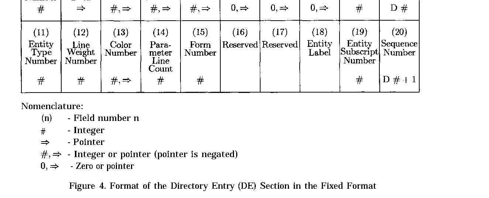

**Table 2. Directory Entry (DE) Section**

| No. | Field Name | Meaning and Notes |
|---:|---|---|
| 1 | Entity Type Number | Identifies the entity type. |
| 2 | Parameter Data | Pointer to the first line of the parameter data record for the entity. The letter P is not included. |
| 3 | Structure | Negated pointer to the directory entry of the definition entity that specifies this entity's meaning, or zero (default). |
| 4 | Line font pattern | Line font pattern number, or negated pointer to the Directory Entry of a Line Font Definition Entity (Type 304), or zero (default). The letter D is not included. |
| 5 | Level | Number of the level upon which the entity resides, or a negated pointer to the Directory Entry of a Definition Levels Property Entity (Type 406, Form 1), or zero (default). |
| 6 | View | Pointer to the Directory Entry of a View Entity (Type 410), pointer to a Views Visible Associativity Instance (Type 402, Form 3,4, or 19 ), or zero (default). |
| 7 | Transformation Matrix | Pointer to the Directory Entry of a Transformation Matrix Entity (Type 124) used in defining this entity or zero (default). |
| 8 | Label Display Associativity | Pointer to the Directory Entry of a label Display Associativity (Type 402, Form 5), or zero (default). |
| 9 | Status Number | Comprises four two-digit values which are concatenated in the order listed into a single 8-digit number which fills the field; no space characters are allowed. **1-2 Blank Status:** 00 Visible; 01 Blanked. **3-4 Subordinate Entity Switch:** 00 Independent; 01 Physically Dependent; 02 Logically Dependent; 03 Both (01) and (02). **5-6 Entity Use Flag:** 00 Geometry; 01 Annotation; 02 Definition; 03 Other; 04 Logical/Positional; 05 2D Parametric; 06 Construction geometry. **7-8 Hierarchy:** 00 Global top down; 01 Global defer; 02 Use hierarchy property. |
| 10 | Section Code and Sequence Number | Physical count of this line from the beginning of the Directory Entry Section, preceded by the letter D (odd number). |
| 11 | Entity Type Number | (Same value as Field 1) |
| 12 | Line Weight Number | System display thickness; given as a gradation value in the range of 0 to the maximum (Parameter 16 of the Global Section). |
| 13 | Color Number | Color number or negated pointer to the Directory Entry of a Color Definition Entity (Type 314), or zero (default). |
| 14 | Parameter Line Count Number | Quantity of lines in the parameter data record for this entity. |
| 15 | Form Number | Form number for entities having more than one interpretation of their parameter values, or zero (default). Entity form numbers are included within each entity's description. |
| 16 | Reserved for future use | |
| 17 | Reserved for future use | |
| 18 | Entity Label | Up to eight alphanumeric characters (right justified), or NULL (default). |
| 19 | Entity Subscript Number | 1 to 8 digit unsigned number associated with the entity label. |
| 20 | Section Code and Sequence Number | Same meaning as Field 10 (even number). |

##### 2.2.4.4.1 Entity Type Number

Integer number specifying entity type. This number shall be the same as the entity type number in the Parameter Data for this Directory Entry record.

##### 2.2.4.4.2 Parameter Data Pointer

Sequence number of the first parameter data record for this entity. The letter P is not included. The number shall be greater than zero and less than or equal to the value of Field 4 in the Terminate Section (see Section 2.2.4.6).

##### 2.2.4.4.3 Structure

For a negated value, the absolute value of this field references the structure definition entity which specifies the schema for this entity type number. This field has meaning only for the Macro Instance Entity (UNTESTED), the Implementor-Defined Associativity Instance Entity (Type 402, Forms 5001-9999) and the Attribute Table Instance Entity (Type 422, Forms 0 and 1). Non-negative integer values are permitted in this field, but postprocessors shall ignore them. (In versions prior to Version 3.0, non-negative integers were used in this field to designate version numbers.)

##### 2.2.4.4.4 Line Font Pattern

Integer number corresponding to the line font (i.e., display pattern) used to display an entity. A positive value indicates that the receiving system's corresponding version of the indicated font shall be used. A negated value indicates that its absolute value references a Line Font Definition Entity (Type 304) which specifies the display pattern.

| Value | Pattern |
|---:|---|
| 0 | No pattern specified (default) |
| 1 | Solid |
| 2 | Dashed |
| 3 | Phantom |
| 4 | Centerline |
| 5 | Dotted |

Additional line font patterns maybe assigned by using the Line Font Property Entity (Type 406, Form 19) (see Section 4.115).

##### 2.2.4.4.5 Level

This value specifies one or more levels to be associated with this entity. A positive value specifies the single level number which is associated with this entity. A negated value indicates its absolute value references a Definition Levels Property Entity (Type 406, Form 1) containing a list of levels to be associated with this entity, thereby allowing the entity to appear on more than one level.

##### 2.2.4.4.6 View

Three options exist:

- When the entity is visible in all views, and its display characteristics are the same in all views, the value shall be zero (default).
- When the entity is visible in only one view, the value shall reference a View Entity (Type 410).
- Otherwise, the value shall reference a Views Visible Associativity Entity (Type 402, Form 3, 4, or 19). Type 402, Forms 4 or 19 shall be used when the display characteristics of the entity are not the same in all views.

##### 2.2.4.4.7 Transformation Matrix

This value references a Transformation Matrix Entity (Type 124) or is zero (default). Zero implies the identity rotation matrix and a zero translation vector. Transformation Matrix Entity form numbers specify transformation matrix characteristics. See Section 4.21.

##### 2.2.4.4.8 Label Display Associativity

This value references a Label Display Associativity Entity (Type 402, Form 5) which defines how the entity's label and subscript are to be displayed in different views, or is zero (default).

##### 2.2.4.4.9 Status Number

_ECO653_

This value contains four pieces of information which are concatenated into a single integer number that is right-justified in the field; no space characters are allowed. The four two-digit values are concatenated from left to right in the order of the following subsections.

###### 2.2.4.4.9.1 Blank Status

This value specifies entity visibility on the receiving system display. A value of 00 specifies the entity is displayed and a value of 01 specifies the entity is not displayed.

###### 2.2.4.4.9.2 Subordinate Entity Switch

This value indicates whether or not the entity is referenced by other entities in the file; and if so, what type of relationship exists. An entity can be independent, physically dependent, logically dependent, or both physically and logically dependent. The values are defined as follows:

**00: Independent.** The entity is not referenced (i.e., pointed to) by any other entities in the file. It can exist alone in the native database.

**01: Physically Dependent.** This entity (the child) is referenced by another entity (the parent) in the file. The child cannot exist unless the parent exists. The matrix referenced by the entity (as a child) shall be applied to the entity's definition in order to determine its location in the parent's definition space (see Section 3.2.3).

Entity A is subordinate to Entity B if, and only if, the parameter data entry of Entity B references Entity A. The additional pointers as defined in Section 2.2.4.5.2 are ignored for the purposes of this definition. This means that entities are NOT subordinate to the View (or Views Visible Associativity) Entity defining the view within which the entity is displayed.

The structure formed by a parent entity and its physically subordinate components is indivisible and may therefore be considered as a single entity. The following are examples of physically subordinate entities:

- A Leader Line Entity referenced by a Linear Dimension Entity.
- A Circular Arc Entity referenced by a Plane Entity.
- A Circular Arc Entity referenced by a Composite Curve Entity.
- A Composite Curve Entity referenced by a Subfigure Definition Entity (note that the Subfigure Definition does NOT reference the constituent entities of the composite curve).

Multiple entity example:

- Entity A is physically subordinate to Entity
- Entity A references a Transformation Matrix Ml.
- Transformation Matrix Ml references a Transformation Matrix M2.
- Entity B is subordinate to a Subfigure Definition Entity C.
- Entity B references a Transformation Matrix M3.
- Entity C is instanced in a Subfigure Instance D.
- The parameter data of entity D specifies its scale factor as Sd and position as (Xd,Yd,Zd).
- Entity D references a Transformation Matrix M4.
- Entity D references a View Entity E.
- The view scale factor defined in the parameter data of entity E is Se.
- Entity E occurs within a drawing F at drawing coordinates (Fx,Fy).
- Entity E references a Transformation Matrix M5.

In order to obtain the drawing space coordinates of entity A, the following operations are performed:

1. The coordinates of entity A are transformed by Ml.
2. The coordinates resulting from the preceding step are transformed by M2.
3. The coordinates resulting from the preceding step are transformed by M3.
4. The coordinates resulting from the preceding step are scaled by Sd.
5. The coordinates resulting from the preceding step are transformed by M4.
6. The coordinates resulting from the preceding step are translated by the vector (Xd,Yd,Zd). The coordinates resulting from this step are the model space coordinates of entity A.
7. The coordinates resulting from the preceding step are transformed by M5.
8. The coordinates resulting from the preceding step are scaled by the scale factor Se.
9. The coordinates resulting from the preceding step are translated by the vector (Fx,Fy).

**02: Logically Dependent.** This entity (the child) can exist alone in the native database, but is referenced by one or more grouping entities (the parent(s)) such as the Group Associativity Entity (Type 402, Form 1, 7, 14, or 15). The matrix referenced by any parent entity has no effect on the location of the child.

An example of a logically subordinate entity is a Line Entity (Type 110) referenced by a Group Associativity Entity.

**03: Both Physically and Logically Dependent.** This entity (the child) is physically dependent upon one entity (the physical parent) which references it and is subject to the physical dependency rules. This entity also is referenced by one or more logical grouping entities (the logical parent(s)) and also is subject to the logical dependency rules described. Additionally, an entity shall not be physically and logically dependent upon the same parent entity. When positioning the child, the matrix referenced by the physical parent shall be used.

An example of a logically and physically subordinate entity is a line which is part of a group of lines in a subfigure. The Line Entity is referenced by the Subfigure Definition Entity and also is referenced by a Group Associativity Entity.

###### 2.2.4.4.9.3 Entity Use Flag

This value indicates the entity's classification as follows:

**00: Geometry.** The entity is used to define the geometry of the structure of the product.

**01: Annotation.** The entity is used to add annotation or description to the file. This includes geometric entities used to form annotation or description.

**02: Definition.** The entity is used in definition structures of the file. It is not intended to be valid outside of the other entities which reference the definition structure. An example is the entities in a Subfigure Definition which are intended to be valid in the Subfigure Instances that reference the Subfigure Definition. This class includes all entities in the 300 entity type number range.

**03: Other.** The entity is being used for other purposes such as defining structural features in the file. This category corresponds roughly to the 400 range, but there are exceptions. For example, a Subfigure Instance (Type 408) could define geometry, thus having Entity Use Flag 00, or it could define a drawing format, thus having an Entity Use Flag 01. An Associativity Instance ordinarily would have the Entity Use Flag 03. Exceptions include Associativities concerned with display where they would have the Entity Use Flag 01. The View and Drawing Entities have Entity Use Flag 01 (annotation). Transformation Matrix Entities (Type 124) are classified according to their use: If used only for annotation (e.g., defining a view), assign Entity Use Flag 01; if used for defining geometry or for defining geometry and annotation, assign Entity Use Flag 00.

**04: Logical/Positional.** The entity is used as a logical or positional reference by other entities. _ECO642_ This usage does not prevent the entity from referencing other entities or having its own attributes. Some entities which may be instanced in this way are Node, Connect Point, and Point when their primary use is as a reference.

Composite curves consisting of only two connect points used as logical connectors shall have their entity use flag set to 04.

**05: 2-D Parametric.** This entity is positioned in two-dimensional XY parameter space, considered as a subset of three-dimensional XYZ space, by ignoring the Z coordinate. The transformation matrix from definition space to parameter space shall be two-dimensional (i.e., in Entity 124, Section 4.21, T3 = R13 = R31 = R32 = R23 = 0.0 and R33 = 1.0). In addition, the coordinates do not have units of length (i.e., the model space scale and units conversion do not apply). This is intended for use in defining curves on surfaces.

**06: Construction Geometry.** The entity is used only for convenience in preparing the model or drawing, NOT for defining the geometry of the structure of the product. An example is the two lines intersected to find the center of a rectangle.

When an entity having Entity Use Flag 06 is a PARENT entity, then all CHILD entities also shall have Entity Use Flag 06 unless the CHILD has Entity Use Flag 02 (Definition). Entity Use Flag 06 entities may be grouped with Entity Use Flag 00 (Geometry) entities.

###### 2.2.4.4.9.4 Hierarchy

This value indicates the relationship between entities in a hierarchical structure and determines which entity's Director y Entry attributes shall control line font, view, entity level, blank status, line weight, and color number. Three values are provided:

**00:** All of the above Directory Entry attributes shall apply to entities physically subordinate to this entity.

**01:** None of the above Directory Entry attributes of this entity shall apply to physically subordinate entities. Any physically subordinate entities shall use their own Directory Entry attributes.

**02:** Individual setting of each of the above directory entry attributes is allowed. A Hierarchy Property Entity (Type 406, Form 10) (see Section 4.106) shall specify whether 00 or 01 is applied for each Directory Entry attribute to physically subordinate entities.

Example: If an entity A has 00 in its DE status digits 7 and 8, entities immediately subordinate to A shall use A's attributes; their own attributes are not used. Conversely, if an entity A has 01 in its DE status digits 7 and 8, entities immediately subordinate to A shall use their own attributes; A's attributes are not used.

##### 2.2.4.4.10 Sequence Number

A number which specifies the sequence number of the DE line in the Directory Entry Section. The sequence number of the first DE line for any entity is always odd and the sequence number of the second line is always even.

##### 2.2.4.4.11 Entity Type Number

This is the same as Field 1.

##### 2.2.4.4.12 Line Weight Number

This value specifies the thickness (or width) to use for displaying an entity. Global Parameters 16 and 17 specify a uniform series of possible thicknesses. The largest thickness possible is that specified in Global Parameter 17 and is denoted by setting the Line Weight Number equal to the value in Global Parameter 16. The smallest thickness possible is equal to the result of dividing Global Parameter 17 by Global Parameter 16 and is denoted by setting the Line Weight Number equal to 1. Thicknesses between the smallest and largest thickness are increments of the smallest possible thickness and are denoted by setting the Line Weight Number equal to the integer number of (adjacent) increments required.

Thus, display thickness is:

```
Line Weight Number * (Global Parameter 17/Global Parameter 16).
```

A value of 0 indicates that the default line weight display thickness of the receiving system is to be used.

Thickness is a display attribute which is the same for all occurrences of an entity, regardless of scale factors applied to the entity when it is seen in multiple views or in multiple subfigure instances.

##### 2.2.4.4.13 Color Number

Field 13 specifies entity display color. A non-negative color number represents "standard" colors and shall be specified when the precise shade is unimportant; a negated value shall be specified when the precise shade is important; its absolute value references a Color Definition Entity (Type 314).

Postprocessors shall use the receiving system's display color which best corresponds to the following descriptive names:

| Color No. | Color |
|---:|---|
| 0 | No color assigned (default) |
| 1 | Black |
| 2 | Red |
| 3 | Green |
| 4 | Blue |
| 5 | Yellow |
| 6 | Magenta |
| 7 | Cyan |
| 8 | White |

Note: Since this Specification includes no mechanism for specifying background color, exchange partners need to realize that it is possible for entities to have the same color as the display background; this makes them appear "invisible" even though they are present. _ECO653_

##### 2.2.4.4.14 Parameter Line Count Number

This is the quantity of lines in the Parameter Data Section which contain the parameter data record for this entity, including any comment lines which follow the line containing the record delimiter character. This value shall be greater than zero, except for the Null Entity (Type 0), which may specify zero parameter data records.

##### 2.2.4.4.15 Form Number

This value indicates an individual interpretation of the entity to be used when processing the parameter data for this entity for those entity types having multiple interpretations of their parameter data, or zero (default). The form number and entity type number uniquely specify parameter data interpretation.

##### 2.2.4.4.16 Reserved Field

This field is reserved for future use and shall be empty.

##### 2.2.4.4.17 Reserved Field

This field is reserved for future use and shall be empty.

##### 2.2.4.4.18 Entity Label

This is the application-specified alphanumeric identifier or name for this entity. It is used in conjunction with the entity subscript number (Field 19) to provide the application-specified alphanumeric identifier for the entity. The entity label is right-justified within the field with leading space fill.

##### 2.2.4.4.19 Entity Subscript Number

This is a numeric qualifier for the entity label (Field 18).

##### 2.2.4.4.20 Sequence Number

See Section 2.2.4.4.10.

#### 2.2.4.5 Parameter Data Section

This file section contains the parameter data associated with each entity. The following information is true for all parameter data.

_ECO653_

##### 2.2.4.5.1

Parameter data is free-formatted (see Section 2.2.3) with the first field always containing the entity type number. Therefore, even though the Parameter Data Section tables do not show it, the entity type number and a parameter delimiter precede Index 1 of each entity in the exchange file. The free-formatted part of a parameter line ends in Column 64. Column 65 shall contain a space character. Columns 66 through 72 on all parameter lines shall contain the sequence number of the first line in the Directory Entry of this entity. Column 73 of all lines in the Parameter Data Section shall contain the letter P and Columns 74 through 80 shall contain the sequence number. See Section 2.2.1.

##### 2.2.4.5.2

Two groups of parameters are defined at the end of the specified parameters for each entity.

The first group of parameters may contain pointers to any combination of one or more of the following entities: Associativity Instance Entity (Type 402), General Note Entity (Type 212), Text Template Entity (Type 312).

- Pointers to associativity instances are called "back pointers" because they point back to the Associativity Instance Entity (Type 402) which references them; back pointers are used only when they are required by the associativity's definition.
- If an entity references associated text, a pointer to a General Note Entity (Type 212) may be included in the first group of pointers. The referenced note specifies the string and its display parameters.
- If an entity itself contains a string to be displayed, a pointer to a Text Template Entity (Type 312) may be included in the first group of pointers. In this way, Text Template Entities provide display parameters for the first information item in the entity referencing them (see Section 4.75).

The second group of parameters may contain pointers to one or more properties or attribute tables. Either group of parameters, or both, may be defaulted (i.e., empty).

When present, the pointers comprising these parameters are added after all the other specified (or defaulted) parameters, but ahead of the record delimiter as follows:

| Index | Name | Type | Description |
|---|---|---|---|
| ... | ... | ... | ... |
| Let NV = last parameter number | | | |
| NV+1 | NA | Integer | Number of pointers to the DEs of Associativity Instances/Text Entities |
| NV+2 | DE(1) | Pointer | Pointer to the DE of the first Associativity Instance/Text Entity |
| ... | ... | ... | ... |
| NV+NA+1 | DE(NA) | Pointer | Pointer to the DE of the last Associativity Instance/Text Entity |
| NV+NA+2 | NP | Integer | Number of pointers to the DEs of Property or Attribute Table Entities |
| NV+NA+3 | DE(1) | Pointer | Pointer to the DE of the the first Property or Attribute Table Entity |
| ... | ... | | |
| NV+NA+NP+2 | DE(NP) | Pointer | Pointer to the DE of the the last Property or Attribute Table Entity |

##### 2.2.4.5.3

Any desired comment may be added after the record delimiter. Additional comment lines may be used by keeping the same Directory Entry pointer in Columns 65-72 and including the comment lines in the entity's parameter line count (DE Field 14).

Figure 5 shows the format of the Parameter Data Section.

**Figure 5:** Format of the Parameter Data (PD) Section in the Fixed Format

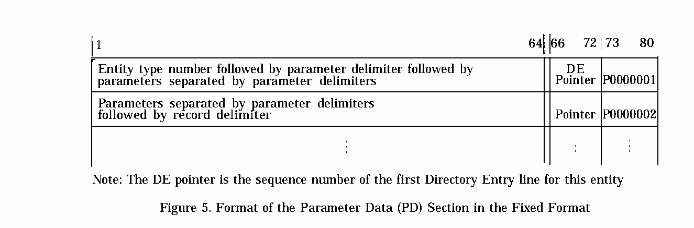

#### 2.2.4.6 Terminate Section

There is only one line in the Terminate Section of the file. It is divided into ten fields of eight columns each. The Terminate Section shall be the last sequenced line of the file.

Unsequenced lines (i.e., completely blank lines) shall not appear prior to the Terminate Section, nor shall any sequenced lines appear after it. Unsequenced lines may appear after the Terminate Section when the sending system's file structure has blocks larger than 80 bytes and the quantity of records in the file is not a multiple of the block size. Postprocessors shall ignore all lines appearing after the Terminate Section.

The Terminate Section has a "T" in Column 73 and Columns 74 through 80 contain the sequence number with a value of one (1).

Each field in the Terminate Section record contains a section identifier, left-justified in the field, and the last sequence number used in that section, right-justified in the field. Each field is defined in the table below and is shown in Figure 6. Leading zeroes are not required in sequence numbers.

| Field | Columns | Section |
|---:|---|---|
| 1 | 1-8 | Start |
| 2 | 9-16 | Global |
| 3 | 17-24 | Directory Entry |
| 4 | 25-32 | Parameter Data |
| 5-9 | 33-72 | (not used) |
| 10 | 73-80 | Terminate |

**Figure 6:** Format of the Terminate section in the Fixed Format

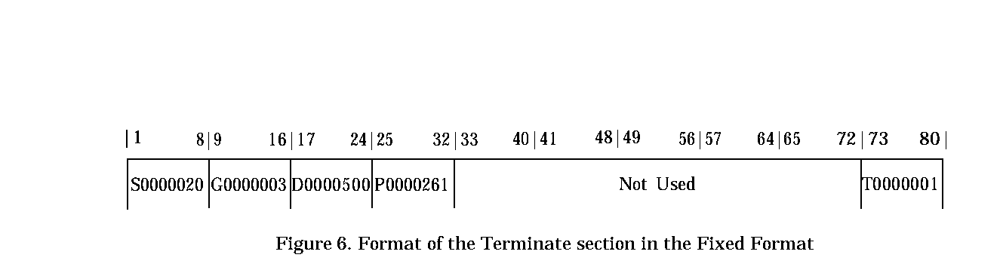

## 2.3 Compressed Format

The format described here is an alternative to using the Fixed Format for large files. The Compressed Format can be converted to the Fixed Format and vice-versa. An example of conversion software is shown Appendix E.

### 2.3.1 File Structure

A single Flag Section record shall precede the Start Section and shall contain the character "C" in character position 73 to identify the file as being in the compressed Format. The Start, Global and Terminate Sections are the same as those for the Fixed Format, while the Directory Entry Section and the Parameter Data Section are combined into a single Data Section.

A record in the Data Section contains the data from the entity's Directory Entry record followed immediately by the data from its Parameter Data record. The first line of the Data record begins with the letter "D" followed without intervening blanks by an unsigned integer whose value is that of the sequence number of the corresponding Directory Entry record (see Figure 7).

The "D<sequence number>" group of characters is followed by zero or more Directory Entry field specifiers. The field specifier consists of the symbol "@" (commercial at) followed by an unsigned integer identifying the field being specified. The "@<field number>" group is followed by the character "-" (underscore) which is in turn followed by the value of the field ("@<field number>-<value>"). No delimiter is used between the Directory Entry field specifiers, but the collection of field specifications is terminated by a record delimiter character (default: ";").

The Directory Entry field numbers are the same as those used to identify the Directory Entry fields in the Fixed Format. Fields 2, 10, 11, and 20 are not specified because they are either redundant or meaningless in the Compressed Format. When several Directory Entry fields are being specified, additional lines may be used. The sequence of field specifiers may be broken only between complete specifications, thus assuring that new lines will begin with the character "@".

The Directory Entry field values need be specified only when they change. Thus, a field retains its value from entity to entity unless a new value is explicitly stated. Only the first entity in a file is assured of containing a complete set of field specifications.

The Directory Entry portion of the Data Section record is followed immediately by the Parameter Data portion. The data from the Parameter Data record begins on a new line and is the same in the Compressed Format as it is in the Fixed Format. Each line is of variable length, and terminates before character position 65, thus assuring that character position 65, if it existed (i.e., if the line were read into a fixed-length, 80-character buffer), would always contain a blank character.

**Figure 7:** General file structure in the Compressed Format

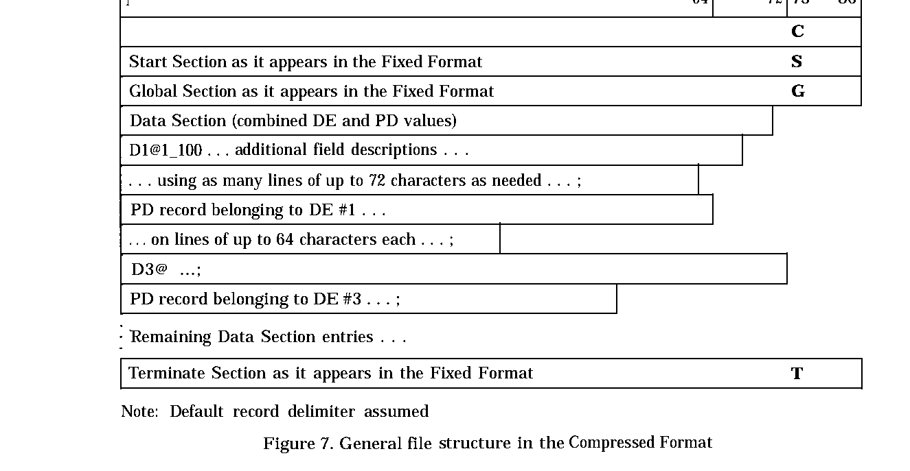

---

# 3. Classes of Entities

**Contents:**

- [3.1 General](#31-general)
- [3.2 Curve and Surface Geometry Entities](#32-curve-and-surface-geometry-entities)
- [3.3 Constructive Solid Geometry Entities](#33-constructive-solid-geometry-entities)
- [3.4 Boundary Representation Solid Entities](#34-boundary-representation-solid-entities)
- [3.5 Annotation Entities](#35-annotation-entities)
- [3.6 Structure Entities](#36-structure-entities)


## 3.1 General

_ECO630_

This Chapter contains information about the classes of entities and their structures in the product data exchange file. The five classes of entities defined in this Specification are curve and surface geometry entities, constructive solid geometry entities, boundary representation solid entities, annotation entities, and structure entities. Entity type numbers from 100 through 199 are generally reserved for geometry entities.

## 3.2 Curve and Surface Geometry Entities

### 3.2.1 Entity Types

Table 3 shows curve and surface geometry entities defined in this Specification.

**Table 3. Curve and Surface Entities**

| Entity Type Number | Entity Type |
|---|---|
| 100 | Circular Arc |
| 102 | Composite Curve |
| 104 | Conic Arc |
| 106 | Copious Data |
| 106/11 | 2D Linear Path |
| 106/12 | 3D Linear Path |
| 106/63 | Simple Closed Planar Curve |
| 108 | Plane |
| 110 | Line |
| 112 | Parametric Spline Curve |
| 114 | Parametric Spline Surface |
| 116 | Point |
| 118 | Ruled Surface |
| 120 | Surface of Revolution |
| 122 | Tabulated Cylinder |
| 124 | Transformation Matrix |
| 125 | Flash |
| 126 | Rational B-Spline Curve |
| 128 | Rational B-Spline Surface |
| 130 | Offset Curve |
| 140 | Offset Surface |
| 141 | Boundary |
| 142 | Curve on a Parametric Surface |
| 143 | Bounded Surface |
| 144 | Trimmed Parametric Surface |
| 190 | Plane Surface |
| 192 | Right circular cylindrical Surface |
| 194 | Right Circular Conical Surface |
| 196 | Spherical Surface |
| 198 | Toroidal Surface |

### 3.2.2 Coordinate Systems

This section introduces a model space concept and a definition space concept. Model space is three-dimensional Euclidean space, the space in which the "model" (or product) being represented resides. The model space X, Y, Z coordinate system is a right-handed Cartesian coordinate system. It is fixed relative to the model.

Definition space is also three-dimensional Euclidean space, but has its own right-handed Cartesian XT, YT, ZT coordinate system. In contrast to model space where a single fixed coordinate system exists, the definition space coordinate system may vary from entity to entity. The origin of a definition space coordinate system may be any point in model space, and the orientation may be arbitrary with respect to model space. It is assumed that the unit of length is always the same in both the model space and the definition space coordinate systems.

The definition space concept allows the use of a temporary coordinate system in positioning certain geometric entities into model space. _ECO630_ This concept plays a simplifying role that is most apparent in connection with those entities which can be contained within a single plane. Use of definition space entails initially describing an entity in definition space and then converting this to a model space description. Thus, an orthogonal matrix and a translation vector are used to generate model space coordinates from definition space coordinates. The orthogonal matrix used for this purpose is called the defining matrix; both it and the translation vector are treated in the description of the Transformation Matrix Entity (see Section 4.21).

The value of the determinant of an orthogonal matrix is always plus or minus one. In the case that the determinant is one, there are two equivalent points of view that can be taken concerning how the geometric entity is related to model space from its definition space description. In order to simplify the discussion that follows, the translation vector is assumed to be the zero vector. This implies that the origin of the definition space coordinate system coincides with the origin in the model space coordinate system.

The first point of view imagines that the two coordinate systems are initially coincident (i.e., _ECO630_ X axis to XT axis, etc.), but that the XT, YT, ZT coordinate frame is free to rotate relative to the X, Y, Z frame. The geometry entity is considered to be defined relative to the XT, YT, ZT frame, and the defining matrix then rotates this frame, geometry included, so that the geometry entity is positioned as desired relative to the X, Y, Z frame.

The second point of view imagines that the XT, YT, ZT frame is initially situated so that the _ECO630_ geometry entity within definition space is positioned in the desired manner relative to model space. The defining matrix then leaves the geometry entity fixed, but rotates the XT, YT, ZT frame. At the completion of the rotation, the XT, YT, ZT frame becomes the X, Y, Z frame. The result is that the geometry entity is positioned as desired relative to the X, Y, Z frame.

It is to be emphasized that the discussion here pertains to a single defining matrix whose action in transforming coordinates can be viewed intuitively in two ways. Each point of view stresses the temporary nature of the XT, YT, ZT system, insofar as what is ultimately of interest is the relationship of the geometry entity to the X, Y, Z frame.

In a case when the geometry entity to be located within model space can be contained within a single plane, it can be seen that the definition space concept can be used in such a way that the geometry entity as initially described in definition space can be considered to lie in the XT, YT-plane (i.e., the plane ZT=0). From this, it is then convenient to also allow entities to be situated in definition space in any plane parallel to the XT, YT plane (i.e., ZT=arbitrary constant).

Each entity is acted upon by a transformation matrix. This implies that each entity makes use _ECO630_ of the definition space concept, i.e., is defined initially in definition space, and then transformed into model space. Thus, the complete definition of a geometry entity, with respect to model space, involves the Transformation Matrix Entity. However, in some instances, it may very well be that the transformation matrix will leave all coordinates unchanged. This will be the case exactly when the defining matrix is the identity rotation matrix and the translation vector is the zero vector. (In this situation, a convention is provided to prevent unnecessary processing. See the explanation given in Section 2.2.4.4.7 for Field 7 of the directory entry.)

### 3.2.3 Multiple Transformation Entities

There are only two cases in which entities can be operated on by multiple transformation entities. The first is the explicit case in which an entity points to a transformation entity through its Directory Entry Field 7, and that transformation entity, in turn, points to an additional transformation entity through its Directory Entry Field 7. This structure is illustrated in Figure 8(a).

In the case illustrated by Figure 8(a), the points represented by entity XXX are first operated on by matrix 1. The transformed points resulting from application of matrix 1 are then operated on by matrix 2.

The other case is an implicit one in which two entities are in a parent/child relationship, and each _ECO630_ points to a transformation entity through its respective Directory Entry Field 7. A parent/child relationship occurs when one entity (the parent) is pointing to another entity (the child). This structure is illustrated in Figure 8(b). In the case illustrated by Figure 8(b) the points represented by entity XXX are operated upon by matrix 2 and from that point on are transformed like the points in entity YYY, using matrix 1.

**Figure 8:** Multiple Transformation Cases

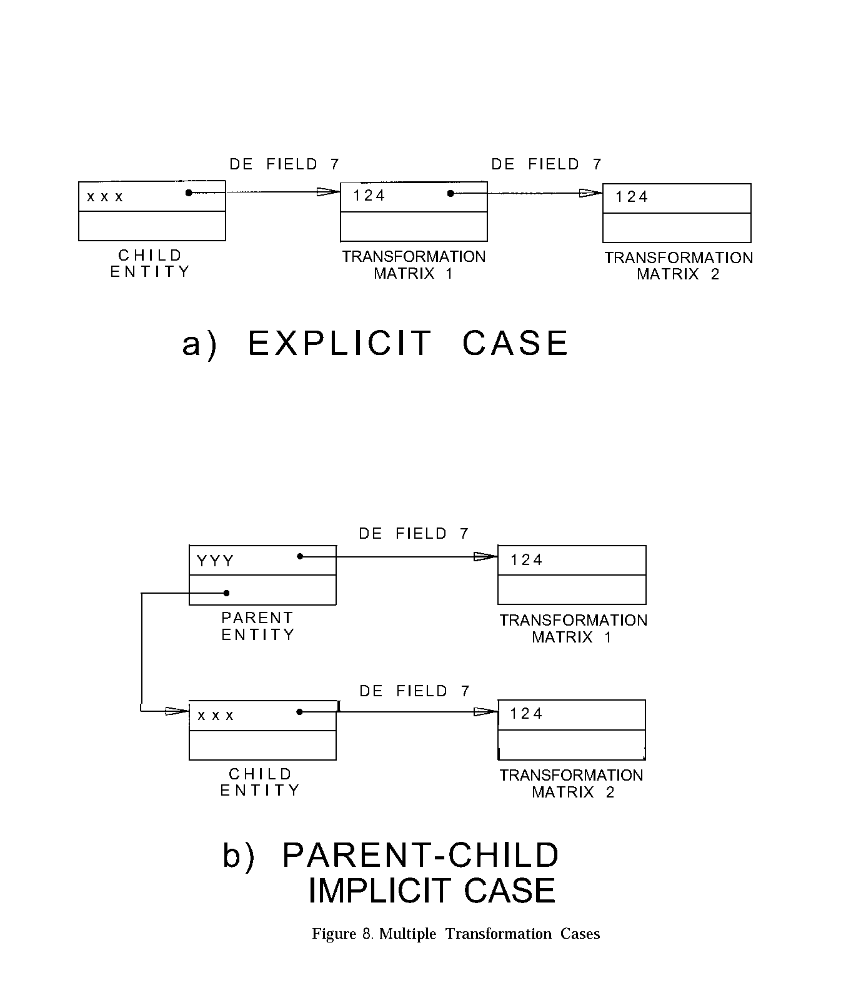

When the specific parent/child relationships shown in Table 4 occur, the implicit relation rule shall apply. Each of the relationships in Table 4 ordinarily results in the subordinate entity switch of the child entity being set to 01 (physically dependent). The exception is the case in which a preprocessor wishes to actually instance the child entity. In this case the child's subordinate entity switch is set to 02 (logically dependent), and the matrix pointed to by the parent has no effect on the location of the child (see Section 2.2.4.4.9.2).

**Table 4. Examples of Physical Parent-Child Relationships**

| Parent | Child |
|---|---|
| Composite Curve | all constituents |
| Plane | bounding curve |
| Point | display symbol |
| Ruled Surface | rail curves |
| Flash | defining entity |
| Surface of Revolution | axis, generatrix |
| Tabulated Cylinder | directrix |
| Offset Curve | base curve |
| Offset Surface | surface |
| Trimmed Surface | surface |
| Angular Dimension | all subordinate entities |
| Diameter Dimension | all subordinate entities |
| Flag Note | all subordinate entities |
| General Label | all subordinate entities |
| Linear Dimension | all subordinate entities |
| Ordinate Dimension | all subordinate entities |
| Point Dimension | all subordinate entities |
| Radius Dimension | all subordinate entities |
| General Symbol | all subordinate entities |
| Sectioned Area | all boundary curves |
| Entity Label Display | all leaders |
| Connect Point | display symbol, Text Display Templates |
| Drawing | all annotation entities |
| Subfigure Definition | all associated entities |
| Network Subfigure Definition | all associated entities, Text Display Templates and Connect Points |
| Nodal Display and Rotation | all General Notes and Nodes |
| Any entity with Entity Use Flag = 00 or 01 | all General Notes in text pointer field |

### 3.2.4 Directionality

_ECO630_

Within model space, all curves are directed. Such curves have associated end points; i.e., start point and terminate point. The manner of assigning direction is discussed within the description of each individual entity.

Within the entity descriptions that follow, some refer to a "counterclockwise direction" with respect _ECO630_ to a sense of rotation in the XT, YT plane. Since the XT, YT plane is located within three-dimensional XT, YT, ZT space, this phrase is ambiguous unless a viewing direction is specified from which to view the rotation within the plane. The viewing direction is taken to be from the positive ZT axis looking "down" upon the XT, YT plane. Then, if a clock were imagined to be lying "face up" in the XT, YT plane, i.e., so as to be readable from the chosen viewing direction along the ZT axis, the phrase "counterclockwise direction" refers to the sense of rotation which is opposite the sense of rotation of the hands of the clock. This same notion of the meaning of counterclockwise carries over to any plane that is parallel to the XT, YT plane.

### 3.2.5 Continuity and Non-degeneracy

_ECO630_

- All model space curves and surfaces shall be at least C^0 (positionally) continuous.
- All curves shall have non-zero arc length.
- All surfaces shall have non-zero area.
- All solids shall have non-zero volume.

## 3.3 Constructive Solid Geometry Entities

### 3.3.1 Entity Types

The Constructive Solid Geometry (CSG) primitive entities are a defined _ECO630_ set of solid modeling primitive constructs to be used in all solid modelers--either directly in CSG modelers or in other types of modelers after conversion.

CSG primitive entities include the following:

| Entity Type Number | Entity Type |
|---|---|
| 150 | Block |
| 152 | Right Angular Wedge |
| 154 | Right Circular Cylinder |
| 156 | Right Circular Cone Frustum |
| 158 | Sphere |
| 160 | Torus |
| 162 | Solid of Revolution |
| 164 | Solid of Linear Extrusion |
| 168 | Ellipsoid |

These primitive entities and manifold solid B-Rep object entities can be combined into more complex _ECO644_ CSG solids using the following entities:

| Entity Type Number | Entity Type |
|---|---|
| 180 | Boolean Tree |
| 182 | Selected Component |
| 184 | Solid Assembly |
| 430 | Solid Instance |

### 3.3.2 Constructive Solid Geometry Models

The Constructive Solid Geometry (CSG) entities support a standard format for one of the two mostly widely used solid model representations--CSG.

The CSG entities in this section can be thought of as being one of two types--geometric or structural. _ECO630_ The geometry entities are volumetric primitives. The model information for a primitive contains dimensions that define the shape of the primitive, point and vector coordinates that define the local coordinate system of the primitive, and an optional directory entry pointer to a transformation matrix which may be used to further position the primitive. If the point and vector coordinates defining the local coordinate system are not given values, the local coordinate system defaults to the global coordinate system. For the Solid of Revolution and Solid of Linear Extrusion Entities, the shape is partly defined indirectly, via a pointer to a planar boundary curve.

The structural entities are the Boolean Tree, Solid Instance, and Solid Assembly Entities. The _ECO630_ _ECO644_ Boolean Tree Entity contains pointers to the elements of the tree and operations such as union, difference, and intersection to be performed on these elements. Elements may be primitives, other boolean trees, solid instances, or manifold solid B-Rep object entities. There may also be a directory entry pointer to a transformation matrix to relocate the entire boolean resultant.

The Solid Instance Entity contains a pointer to an entity representing a solid and a directory entry _ECO630_ _ECO644_ pointer to a transformation matrix by which the entity is to be transformed. It is a copy of the solid entity relocated in global space. The solid entity may be a primitive, boolean tree, another solid instance, or an assembly, or a manifold solid B-Rep object entity.

A solid assembly is a collection of items that share a fixed geometric relationship. The relationship _ECO644_ is a logical one and is not to be confused with a boolean union. If the faces of different items in an assembly touch, they are not removed, as they would be in a boolean union. The items of an assembly may include primitives, boolean trees, other assemblies, solid instances, and manifold solid B-Rep object entities. Corresponding to each item pointed to by the assembly is an optional pointer to a transformation matrix to be applied to that item. Thus, each item of the assembly can be moved independently. There is also an optional directory entry pointer to a global transformation matrix to be applied to the entire assembly of items. This global transformation matrix is applied after each of the individual transformation matrices are applied.

The description of a solid model is an acyclic directed graph. The nodes in the graph are the various geometric and structural entities. This type of graph is like a tree structure, except that the branches of this graph may reconvene as a move is made down the graph, where down is the general direction from root to terminal node. There may be any number of root nodes, which represent the actual solid models. A root may even be within the branches of another root's graph.

The terminal nodes are the primitives and manifold solid B-Rep object entities-the geometric _ECO644_ entities. All the other nodes are structural entities. The structural entities are all able to point to each of the other structural entities as well as to primitives or manifold solid B-Rep object entities, with one exception. The boolean tree cannot point to an assembly.

A CSG solid model is represented by appropriately combining geometric entities with structural entities to create a graph structure.

## 3.4 Boundary Representation Solid Entities

### 3.4.1 Entity Types

The boundary representation (B-Rep) solid model entities consist of a set _ECO630_ of topological entities, a set of surface entities, and a set of curve entities.

The following topological entities for B-Rep solid models are defined in this Specification:

| Entity Type Number | Entity Type |
|---|---|
| 186 | Manifold Solid B-Rep Object |
| 502 | Vertex |
| 504 | Edge |
| 508 | Loop |
| 510 | Face |
| 514 | Shell |

Only the following surface entities may be used in the construction of B-Rep solid models:

| Entity Type Number | Entity Type |
|---|---|
| 114 | Parametric Spline Surface |
| 118/1 | Ruled Surface |
| 120 | Surface of Revolution |
| 122 | Tabulated Cylinder |
| 128 | Rational B-Spline Surface |
| 140 | Offset Surface |
| 190 | Plane Surface |
| 192 | Right Circular Cylindrical Surface |
| 194 | Right Circular Conical Surface |
| 196 | Spherical Surface |
| 198 | Toroidal Surface |

Only the following curve entities may be used in the construction of B-Rep solid models:

| Entity Type Number | Entity Type |
|---|---|
| 100 | Circular Arc |
| 102 | Composite Curve |
| 104 | Conic Arc |
| 106/11 | 2D Path |
| 106/12 | 3D Path |
| 106/63 | Simple Closed Planar Curve |
| 110 | Line |
| 112 | Parametric Spline Curve |
| 126 | Rational B-Spline Curve |
| 130 | Offset Curve |

### 3.4.2 Topology for B-Rep Solid Models

In mechanical CAD systems the role of topology _ECO630_ has been traditionally limited to its use in defining B-Rep solid models.

Constraints have been placed on each topological entity with the intention that they be used in the _ECO630_ specific application domain of B-Rep solid models. Should another application domain (e.g., AEC or FEM) require different constraints, new form numbers of these entities should be created that limit the context or the utility of the entities.

Each entity has its own set of constraints. A higher-level entity (e.g., a loop) may impose constraints _ECO630_ on a lower-level entity (e. g., an edge). At the higher level, the constraints on the lower-level entity are the sum of the constraints imposed by each entity in the chain between the higher- and lower-level entities.

Several topological entities use an Orientation Flag (OF) to indicate whether the direction of a _ECO630_ referenced entity agrees with, or is opposed to, the direction of the referencing entity. If the OF is .TRUE., the direction of the referenced entity is correct; if the OF is .FALSE., the direction of the referenced entity should be (conceptually) reversed. It can happen that there are several Orientation Flags in the chain of entities from the high-level referencing entity to the low-level referenced entity.

### 3.4.3 Analytical Surfaces for B-Rep Solid Models

_ECO630_

The entities defined in this set encompass those commonly used for describing the surface geometry of B-Rep solid models. The surfaces specified here are defined in terms of point, vector, and scalar quantities. In general, a point is used to provide positional information and a vector to provide directional information. One or more scalars provide dimensional data.

The symbol convention used in the definition of these entities is shown in the following table:

| Symbol | Definition |
|---|---|
| a | Scalar quantity |
| A | Vector quantity |
| < > | Vector normalization |
| | Normalized vector (e.g., a = \<A\> = A/\|A\|) |
| × | Vector (cross) product |
| · | Scalar (dot) product |
| S | Analytic surface |
| S(u, v) | Parametric surface |
| sx | Partial derivative of S with respect to x |

#### 3.4.3.1 Entity Types

The following analytical surface entities for B-Rep Solid models are defined in this Specification:

| Entity Type Number | Entity Type |
|---|---|
| 123 | Direction |
| 190 | Plane Surface |
| 192 | Right Circular Cylindrical Surface |
| 194 | Right Circular Conical Surface |
| 196 | Spherical Surface |
| 198 | Toroidal Surface |

Note that the Plane Surface Entity (Type 190) shall not be used as a clipping plane for a view, and _ECO630_ several of these surfaces (plane, cylinder, and cone) are unbounded; i.e., they are infinite surfaces. With the exception of the Plane Surface Entity, these surfaces shall only be used in conjunction with B-Rep solid models.

#### 3.4.3.2 Parameterization of Analytical Surfaces

_ECO630_

For those systems that use parameterized surfaces, a parameterization is defined for each surface. All the surfaces defined here include a point that forms the origin of a Local Coordinate System (LCS). Two direction vectors are used to complete the definition of the LCS. One is the local Z axis direction, and the other is an approximation to the local X axis direction. Let **z** be the local Z axis direction and **a** be the approximate local X axis direction. The method for calculating the local X and Y axis directions is to project the vector **a** onto the plane defined by the origin point **P** and the vector **z**. The local axes are given by:

$$\mathbf{x} = \langle \mathbf{a} - (\mathbf{a} \cdot \mathbf{z})\mathbf{z} \rangle$$

and

$$\mathbf{y} = \langle \mathbf{z} \times \mathbf{x} \rangle.$$

## 3.5 Annotation Entities

### 3.5.1 Entity Types

The following annotation entities are defined in this Specification:

| Entity Type Number | Entity Type |
|---|---|
| 106 | Copious Data |
| | Centerline |
| | Section |
| | Witness Line |
| 202 | Angular Dimension |
| 204 | Curve Dimension |
| 206 | Diameter Dimension |
| 208 | Flag Note |
| 210 | General Label |
| 212 | General Note |
| 213 | New General Note |
| 214 | Leader (Arrow) |
| 216 | Linear Dimension |
| 218 | Ordinate Dimension |
| 220 | Point Dimension |
| 222 | Radius Dimension |
| 228 | General Symbol |
| 230 | Sectioned Area |

### 3.5.2 Construction

Many annotation entities are constructed by using other entities. For example, the dimension entities may have 0, 1, or 2 pointers to Witness Line Entities (a form of Copious Data), 0, 1, or 2 pointers to Leader (Arrow) Entities and a pointer to a General Note Entity.

For some annotation entities, a witness line or leader, although allowed, may not exist. For these cases the Parameter Data field pointer value can be set zero. If any constructive entity exists, but its display is suppressed, it can be set to blank status or, if allowed, the pointer value can be set to zero.

### 3.5.3 Definition Space

An annotation entity may be defined in XT, YT, ZT definition space (see the discussion in Section 3.2.2) or in a two-dimensional space associated with a Drawing Entity (Type 404). In the case of XT, YT, ZT definition space, a transformation matrix is applied to locate the annotation entity within model space.

Within the XT, YT, ZT definition space, subordinate entities to an annotation entity may have different ZT displacements. For example, within the Linear Dimension, a different ZT value may be found in each of General Note, Leader, and Witness Lines (which are pointed to in the Linear Dimension Parameter Data). An example showing the use of ZT displacement (DEPTH) is shown in Figure 9.

**Figure 9:** Interpretation of ZT Displacement (Depth) for Annotation Entities

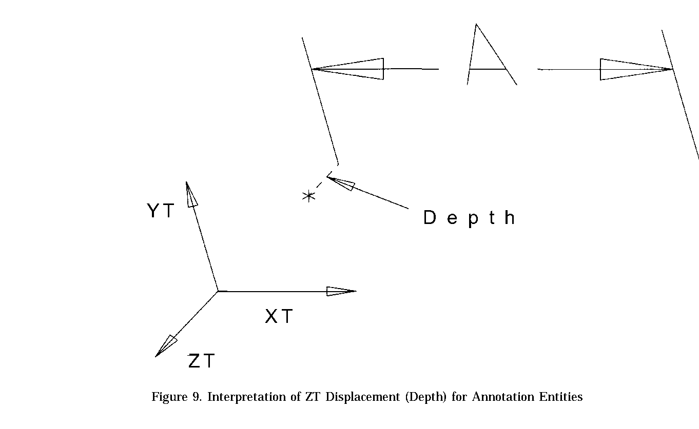

While the option of having dimensions occupy different planes exists, it is expected that only a single _ECO630_ plane will be used. The reason for its existence is due to the structure of annotation entities. As each dimension may comprise several subordinate entities, each subordinate entity, by its definition, has the ability to stand alone and may require its own ZT displacement. It is likely, though not necessary, that each ZT displacement is identical.

In the case where a dimension entity, excluding the curve dimension, has subordinate entities, the _ECO635_ entities subordinate to the dimension entity must be either coplanar or in parallel planes. All of the _ECO630_ children of a particular dimension entity must have the same value in directory entry field 7 (Matrix Pointer). Either the children's or the parent's Matrix Pointer may be non-null, but not both.

### 3.5.4 Dimension Attributes

#### 3.5.4.1 General

Most of the dimension entities defined by this specification provide only enough data for the receiving system to restore a visually equivalent representation of the original; additional information (e.g., the geometry being dimensioned) is lost. Dimension attributes enable exchanging this added data to maximize the potential of functionally equivalent entity transfer between systems which support them. Receiving systems lacking CAD entities to contain all attribute data may find some portions useful, or they may ignore the attributes without losing the visual data.

CAD system dimensioning capabilities can be grouped into one of three categories: _ECO630_

**MANUAL:** Dimensions are constructed using lines, arcs, and text.

**GENERATIVE:** Dimensions are generated automatically from selected geometry, but the association with the geometry is not maintained after creation.

**ASSOCIATIVE:** Dimensions are generated automatically from selected geometry, and the association is maintained so that a subsequent change to the geometry will cause a corresponding _ECO630_ change in the dimension value. Some associative systems with parametric design capabilities also can alter geometry if the dimension value is changed.

Usage of dimension attribute entities will directly correspond to the CAD system's category. Cat- _ECO630_ egory 1 systems will be unable to send any attributes, and will probably ignore them in received files. Category 2 systems will be able to send and receive the dimension properties: Dimension Units Property Entity (Type 406, Form 28), Dimension Tolerance Property Entity (Type 406, Form 29), Dimension Display Data Property Entity (Type 406, Form 30), and Basic Dimension Property Entity (Type 406, Form 31). Category 3 systems will be able to send and receive the Dimensioned Geometry Associativity Entity (Type 402, Form 21); this entity groups the dimensioned geometry with the necessary dimension properties. Figure 10 illustrates category usage for a diameter dimension.

**Figure 10:** Entity Usage According to System Category

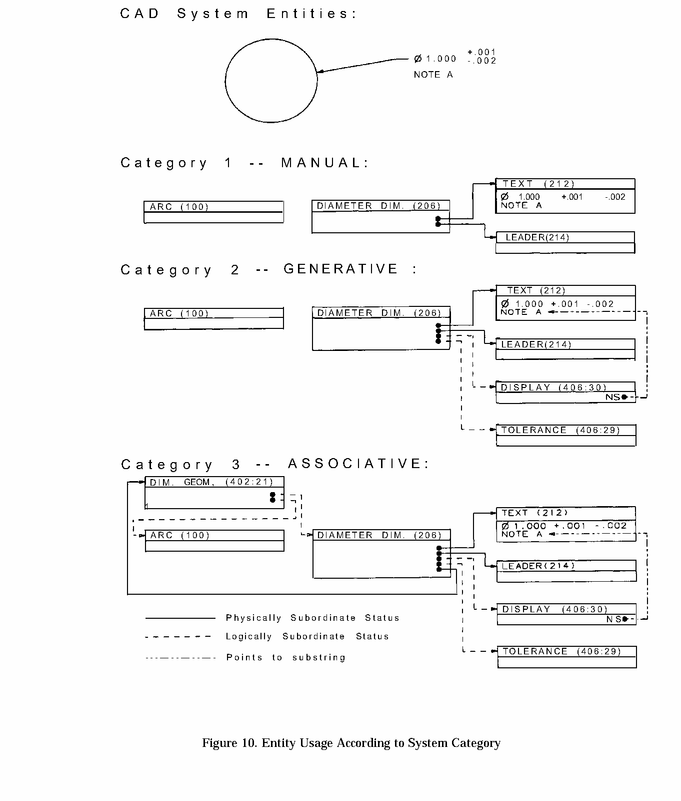

#### 3.5.4.2 Usage Rules

Dimension properties may not be independent; they shall be logically-subordinate to at least one dimension entity. _ECO630_ In some cases (e. g., the Dimension Units Property Entity), more than one dimension can reference one property instance. Properties may be used in any combination which is consistent with dimension entity data; thus, the same dimension will never point to both the Dimension Tolerance and Basic Dimension Property Entities because basic dimensions are not tolerance. Property data shall correspond to the data stored in the dimension(s) which reference the property.

If the Dimensional Geometry Associativity Entity is used, the dimension entity and geometry will be _ECO630_ logically subordinate to it, and any dimension properties will have logically subordinate status. The Dimensioned Geometry Associativity Entity will always have only physically subordinate status; it will always be referenced only by one dimension entity's back pointer. Refer to Figure 10, Category 3.

Some systems maintain additional information about dimensions that is of a global nature and _ECO630_ some that is specific to a particular instance of a dimension. Some systems are able to associate a dimension with geometry in such a way that if the geometry is changed, the dimension value is automatically updated to reflect the new values. To support the variety of functionality available for dimensions, several Form Numbers of the Property Entity (Type 406) and a Dimensioned Geometry Associativity Entity (Type 402, Form 21) are provided.

All of these properties are optional, but none may exist independently in a file; each instance must _ECO630_ be referenced by at least one dimension entity as described in Section 2.2.4.5.2. For example, in the case of the Dimension Units Property Entity (Type 406, Form 28), it is possible that one instance of the property is sufficient for all of the dimensions in the drawing, or all Angular Dimension Entities (Type 202) may reference one instance while all Linear Dimension Entities (Type 216) reference another instance. A similar situation exists for the Dimension Tolerance Property Entity (Type 406, Form 29).

Some of the properties shall be referenced by only one entity. For example, the Basic Dimension _ECO630_ Property Entity (Type 406, Form 31) contains the coordinates of the corners of a box to be drawn around the dimension text, so an instance of this property can be referenced by only one dimension.

There is no restriction on the order in which these properties are referenced; any or all of them may be present in any combination. If present, some contain numeric values that are intended to replace the text string(s) in the General Note Entity (Types 212 and 213) that is referenced by the dimension in its PD section, or they may provide information for the interpretation of the text string(s).

Several Form Numbers of the General Note Entity (Type 212) have been provided to indicate dimension types. Specifically, Form Numbers 1, 2, 3, 4, and 5 communicate information about text placement for dual and tolerance dimensions. The dimension attribute properties and the Form Numbers of the General Note should be used in a logically consistent, non-conflicting manner.

## 3.6 Structure Entities

### 3.6.1 Entity Types

The following structure entities are defined in this Specification:

| Entity Type Number | Entity Type |
|---|---|
| 0 | Null |
| 132 | Connect Point |
| 134 | Node |
| 136 | Finite Element |
| 138 | Nodal Displacement and Rotation |
| 146 | Nodal Results |
| 148 | Element Results |
| 302 | Associativity Definition |
| 304 | Line Font Definition |
| 306 | MACRO Definition |
| 308 | Subfigure Definition |
| 310 | Text Font Definition |
| 312 | Text Display Template |
| 314 | Color Definition |
| 316 | Units Data |
| 320 | Network Subfigure Definition |
| 322 | Attribute Table Definition |
| 402 | Associativity Instance |
| 404 | Drawing |
| 406 | Property |
| 408 | Singular Subfigure Instance |
| 410 | View |
| 412 | Rectangular Array Subfigure Instance |
| 414 | Circular Array Subfigure Instance |
| 416 | External Reference |
| 418 | Nodal Load/Constraint |
| 420 | Network Subfigure Instance |
| 422 | Attribute Table Instance |
| 600-699 | Implementor specified MACRO Instance |
| 10000-99999 | Implementor specified MACRO Instance |

The following sections describe some of the uses of the structure entities.

### 3.6.2 Subfigures

Subfigures have been provided to enable the use of a collection of entities many times within the model at various locations, orientations, and Scales. In some cases, the collection itself is specified by a Subfigure Definition Entity (Type 308), and each placement of the collection is specified by a Singular Subfigure Instance Entity (Type 408). The Network Subfigure Definition (Type 320) and Instance (Type 420) Entity pair is similar in concept but has some special features to accommodate the notion of connect points in a network. (Section 3.6.3 provides additional information about network subfigure.) In other cases, a Rectangular Array (Type 412) or a Circular Array (Type 414) Subfigure Instance Entity specifies a base entity to be copied according to one of these two overall patterns.

Subfigure may be nested. For example, a Subfigure Definition Entity may include a Singular _ECO630_ Subfigure Instance Entity as one entity in its collection. Figure 11 illustrates subfigure nesting. A similar interpretation of Depth applies also to the Network Subfigure Definition and Instance Entity pair. In these cases, the X,Y,Z location and the scale factor(s) in the Subfigure Instance Entity help locate the Subfigure Definition Entity in the definition space of the referring Subfigure Definition Entity instead of in model space.

**Figure 11:** Subfigure Structures

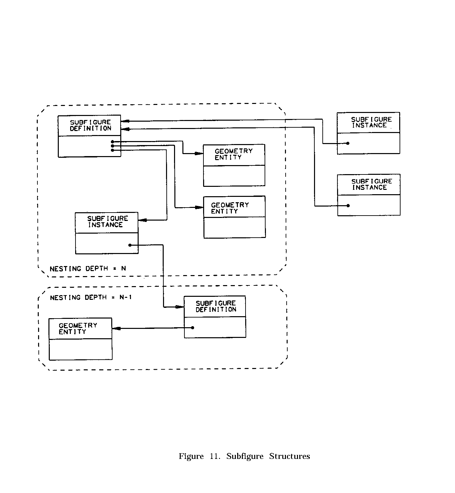

Thus, the processing sequence in these cases is as follows: Each entity in the subfigure definition is _ECO630_ operated upon by its defining matrix and translation vector. Each entity is now located within the definition space of the Subfigure Definition Entity. Then, the defining matrix and translation vector of the Subfigure Definition Entity are applied. The entity collection of the Subfigure Definition Entity is now located in the definition space of the Subfigure Instance Entity. Next, the scale factor(s) located in the parameter data of the Subfigure Instance Entity is (are) applied. This results in a scaling about the origin of the definition space of the Subfigure Instance Entity. Next, the defining matrix and translation vector of the Subfigure Instance Entity are applied. This locates the scaled entities either in model space or in the definition space of another Subfigure Definition Entity. Finally, the X,Y,Z translation data located in the parameter data of the Subfigure Instance Entity is applied. Note that this translation data can be relative either to model space or to the definition space of a Subfigure Definition Entity. The latter case occurs when the Subfigure Instance Entity is referenced by another entity.

The above processing sequence requires that the Transformation Matrix Entity (Type 124) referenced _ECO637_ by the instancing entity shall not be applied to:

- the X, Y, Z translation data for the Singular Subfigure Instance Entity (Type 408),
- the X, Y, Z translation data for the Network Subfigure Instance Entity (Type 420),
- the X, Y, Z coordinate data for the Rectangular Array Subfigure Instance Entity (Type 412)
- the X, Y, Z coordinate data for the Circular Array Subfigure Instance Entity (Type 414).

### 3.6.3 Connectivity

The following file structure shall be used to define logical (and the location _ECO630_ for physical) connections between objects.

A formed connection between two or more objects requires the data to represent the following:

1. the exact location of each connection point;

2. the flow path formed and its identification (if any);

3. the physical connection between the objects (if any).

These objects may include electrical or mechanical components such as transistors, pipes and valves, _ECO630_ or air conditioning ductwork. Each connection formed defines a flow path between the objects, allowing a fluid (electricity, water, or air) to flow from one object to another. The Network Subfigure Definition and Instance Entities are used to represent the objects to be connected. The Connect Point Entity (Type 132) is used to represent the exact location of connection. The term "link" will refer to the logical representation of the flow path (signal) formed, and "flow-name" will refer to the flow path identifier. The term "join" will refer to the file entity or entities which represent the physical connection (geometries between the items).

#### 3.6.3.1 Connectivity Entities

The entities used to implement connectivity include the Network Subfigure Definition (Type 320) and Network Subfigure Instance (Type 420) Entities, the Flow _ECO630_ Associativity Entity (Type 402, Form 18), the Piping Flow Associativity Entity (Type 402, Form 20), the Connect Point Entity (Type 132), and the Text Display Template Entity (Type 312, Form 0, Form 1).

#### 3.6.3.2 Entity Relationships

A flow path (signal) may be formed between items by a link _ECO630_ which references the items' connect points (entities) to be related. This creates an Associativity among the connect points and thus the entities connected. The flow name may be used to uniquely identify the particular signal formed. The join may be used to provide a graphical representation of the flow path. In electrical applications, the join will be represented by geometry entities such as lines, arcs, subfigures, copious data, etc. In a piping application, an example of a join represented might be the section of pipe between a valve and a tank. The logical constructs (link and flow name) shall be implemented by the Flow Associativity Entity or by the Piping Flow Associativity Entity which in turn identifies (by pointer) the entities which form the join.

In electrical applications, for example, the items to be connected are components (i.e., resistor, _ECO630_ 16-pin dual in-line package, etc.), or integrated circuit cells, represented and instanced by network subfigures. Each pin (or signal port) is a potential connection point in a flow path, thus each network subfigure has a connect point for each pin (or port). When such a subfigure is instanced, its connect points must also be instanced. An instanced connect point, when added to a flow path, is different from its definition which shall not be a member of any flow path. See Figure 12 for the basic entity relationships.

**Figure 12:** General Connectivity Pointer Diagram

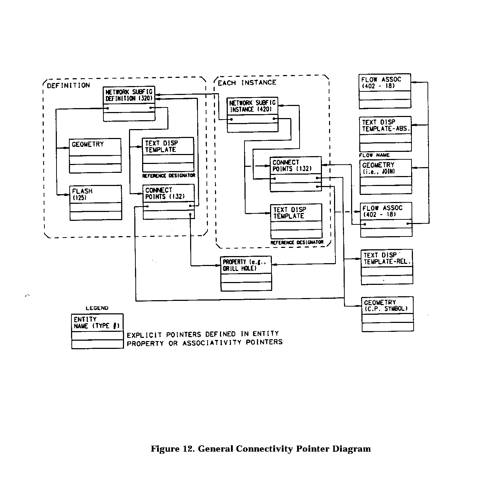

#### 3.6.3.3 Information Display

The network subfigures, representing electrical components, for _ECO630_ example, often contain text describing the component and its pins. The Text Display Template Entity (Type 312) allows text embedded in another entity to be displayed without redundant specification of the text string. The Text Display Template Entity may be used to display reference designators and pin numbers. The absolute form, within a network subfigure, is recommended for the reference designator text. Each instance of the subfigure need only supply the text string. The pin number can be represented in the incremental form. All the pin numbers on a given side of a package outline having the same X, Y, and Z offsets relative to the pin whose number is to be displayed may use the same text display template definition.

#### 3.6.3.4 Additional Considerations

The situation is exactly the same for both logical and _ECO630_ physical product representations. The only differences arise in the subfigure and join entities used. One file may contain both schematic and physical representations of a product. The Flow Associativity Entity (Type 402, Form 18) contains a Type flag to indicate the connection type (logical or physical). In this case, one Flow Associativity Entity would represent the logical connection and a second the physical connection. The two associativities would be related by the pointers provided in the Flow Associativity Entity.

### 3.6.4 External Reference Linkage

Linkages between entities can occur not only within a file, _ECO630_ but also between entities in different files. Two entities are used in a referencing file to establish this linkage: the External Reference Entity (Type 416) which provides the actual linkage to the referenced file, and the External Reference File List Property Entity (Type 406, Form 12) which provides a list of the names of all the files referenced. Further, only directly referenced files shall be in this property's parameter list. Each file name listed in the parameter data of this property shall match the name in the fourth global parameter of a referenced file.

An External Reference File Index Associativity Entity (Type 402, Form 12) is required in the _ECO630_ referenced file when the Type 416, Form 0 or 2 is used (i.e., more than one referenced entity in the referenced file). This Associativity provides a directory to the referenced entities within its file, and both relate a symbolic name to the directory entry of an entity within the file (see Figure 13). All symbolic names used within a set of files linked by references shall be unique. Definitions may be nested, and a symbolic name used need be unique only on the nesting level on which it is used.

Because of the intricacy of the linkages, an example follows (refer to Figure 13). Consider a file _ECO630_ containing a Subfigure Instance Entity (Type 408). The first item in its parameter data record is a pointer to the subfigure definition entry in the Directory Entry Section of the file. In the case that the Subfigure Definition Entity (Type 308) is to be contained in a library file, this first parameter is a pointer to an External Reference Entity (Type 416). That External Reference Entity will have in its parameter data record the name of the file which is to contain the definition and the symbolic name of the definition itself. The file name is the fourth global parameter in the referenced file. The symbolic name is a string which identifies the appropriate referenced definition.

**Figure 13:** External Linkages

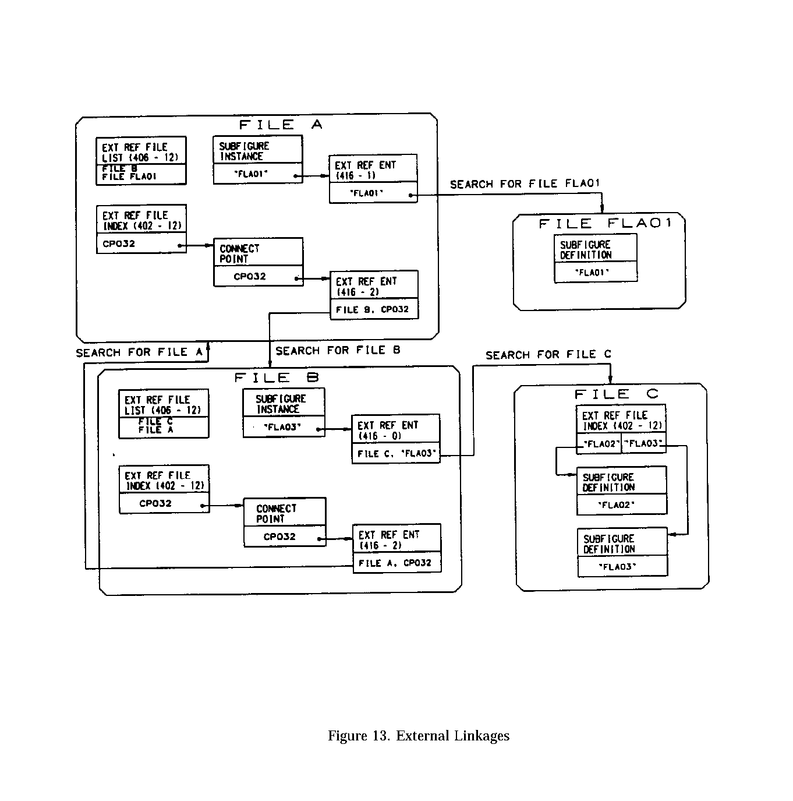

In the case of a library file which contains several definitions, each of which are expected to be _ECO630_ referenced by other files, the External Reference File Index Associativity Entity (Type 402, Form 12) provides a "table of contents" of the available definitions in the file. The parameter data record of this Associativity contains pairs of data: the symbolic name associated with the definition (the same one used in the Type 416 entity's parameter data record), and a pointer to the directory entry record which contains the desired definition.

In the case that the entire external file is to be included (i.e., a super-subfigure), Form 1 of the _ECO630_ Type 416 entity is used which does not contain a symbolic name in the parameter data record. In a similar manner, the referenced file does not contain an associativity Type 402, Form 12 entity; it is unneeded, since the entire file is to be used.

In either case, the External Reference File List Property Entity (Type 406, Form 12) will be found _ECO630_ in the referencing file. The parameter data record contains a simple list of the file names of the various external files referenced by this file. Once again, the file name used is that in the fourth global parameter of the referenced file. Note that this list contains only those file names that are directly referenced; it gives no information about files which may be referenced in turn by those files used by this file.

A limitation of external referencing is that the back pointers (in the "back pointers to associativities" _ECO630_ addition to an entity's parameters) cannot be used. If a pointer is required in each direction, separate external reference mechanisms must exist in each file (e.g., the double linkage between files A and B in Figure 13).

A preprocessor implementor should use the external reference mechanism with care because of the burden placed on the postprocessor.

### 3.6.5 Drawings and Views

This Specification provides a mechanism for associating models and drawings so that there is consistency between them. The mechanism is based on the existing practices of some CAD/CAM graphic systems to define the views of a part on a drawing in terms of a single three-dimensional (3-D) model.

The Drawing Entity (Type 404) specifies a drawing of a given size within a special drawing space _ECO630_ coordinate system. This entity can refer to one or more View Entities (Type 410) which will specify the projection from 3-D model space to the two-dimensional drawing space. Annotation entities such as dimensioning can be defined directly in the drawing coordinate system or can be defined in the 3-D model space and then be included in individual views. More than one drawing entity may be included in a file.

In addition to being used in conjunction with the Drawing Entity, the view-specific display of parts of the model can be used to communicate hidden lines, phantom lines, etc.

Graphic systems which do not have the ability to define drawings and views of models in this manner _ECO630_ are not required to preprocess this construct into a file, but all systems with postprocessors must be able to process the Drawing and View Entities in received files.

To represent that a defined view is not displayed, the preprocessor shall set the Blank Status Flag for the view to 01 (blanked).

### 3.6.6 Finite-Element Modeling

_ECO630_

This section defines the entities and their relationships (i.e., pointers) required to support the finite-element modeling (FEM) application and to display results of analysis on those systems which support finite element analysis postprocessing.

The entities available for exchanging FEM data are illustrated in Figures 14 and 15. The left side of Figure 14 illustrates the relationships between the entities that define the model's parametric attributes. The right side illustrates the addition of the analysis results. Figure 15 illustrates the FEM entities used to define an example beam structure with accompanying material properties, a load, and a constraint. The entities defined in support of such analysis are the Element Entity (Type 136), Node Entity (Type 134), Nodal Load/Constraint Entity (Type 418), Tabular Data Property Entity (Type 406, Form 11), Nodal Results Entity (Type 146) and Element Results Entity (Type 148).

**Figure 14:** Finite Element Modeling File Structure

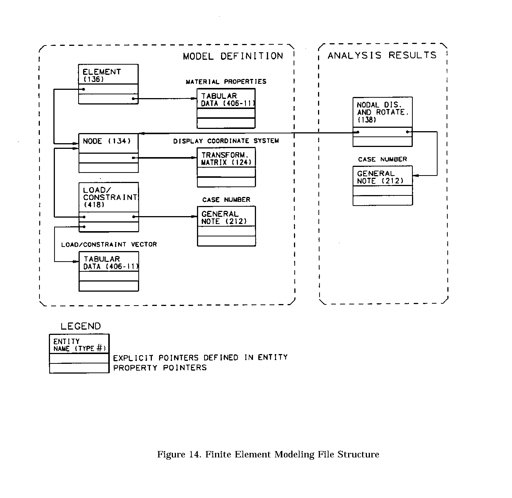

The Element Entity (Type 136) defines a finite element to be used in the finite-element model. _ECO630_ Several finite elements are defined in this Specification. Examples of an element are: BEAM, CTRIA, and DAMP. Specifically, the Element Entity specifies the topology type, number of nodes, and the element-type name. Pointers locate the defining nodes and the material properties of the element. The connectivity of the nodes is implied in the order of the contained pointers and topology type.

The Node Entity (Type 134) defines the grid points or nodes of the element. It contains the spatial _ECO630_ values that define the node and a pointer to the coordinate system upon which it is defined.

The Nodal Load/Constraint Entity (Type 418) is an entity that points to a node. It defines either _ECO630_ a load or a constraint as applied to that node. It also contains a pointer to General Note Entities (Type 212) that define the load case. Property pointers reference the Tabular Data Property Entity (Type 406, Form 11) that contains the values of the load or constraint vector.

The Tabular Data Property Entity (Type 406, Form 11) contains the material property data of the _ECO630_ elements and the load and constraint data as required.

The Nodal Results Entity (Type 146) is used to communicate nodal finite-element analysis results _ECO630_ data. It contains analysis results at FEM nodes that are independent of the FEM elements that are attached to them. (The Element Results Entity (Type 148) should be used if the analysis results data are dependent on FEM elements.) The Nodal Results Entity is intended to supercede the old Nodal Displacement and Rotation Entity (Type 138), as it permits far greater flexibility in the transfer of nodal results.

The Element Results Entity (Type 148) is used to communicate FEM element results that vary _ECO630_ within a FEM element. The data communicated may be results at various layers within the FEM element: at the FEM elements and nodes, at the FEM centroid, at the FEM element Gauss points, or at any combination of these locations.

For example, consider the extrapolated stress values at the nodes of several quadratic, plane-stress FEM elements. There is no guarantee that the nodal values of stress will be identical for adjacent FEM elements at common nodes. There are at least as many possible FEM element result values as there are finite elements that contain common nodes in their topologies. These data are different from the results data expressed at the same node in the Nodal Results Entity.

**Figure 15:** Finite Element Modeling Logical Structure

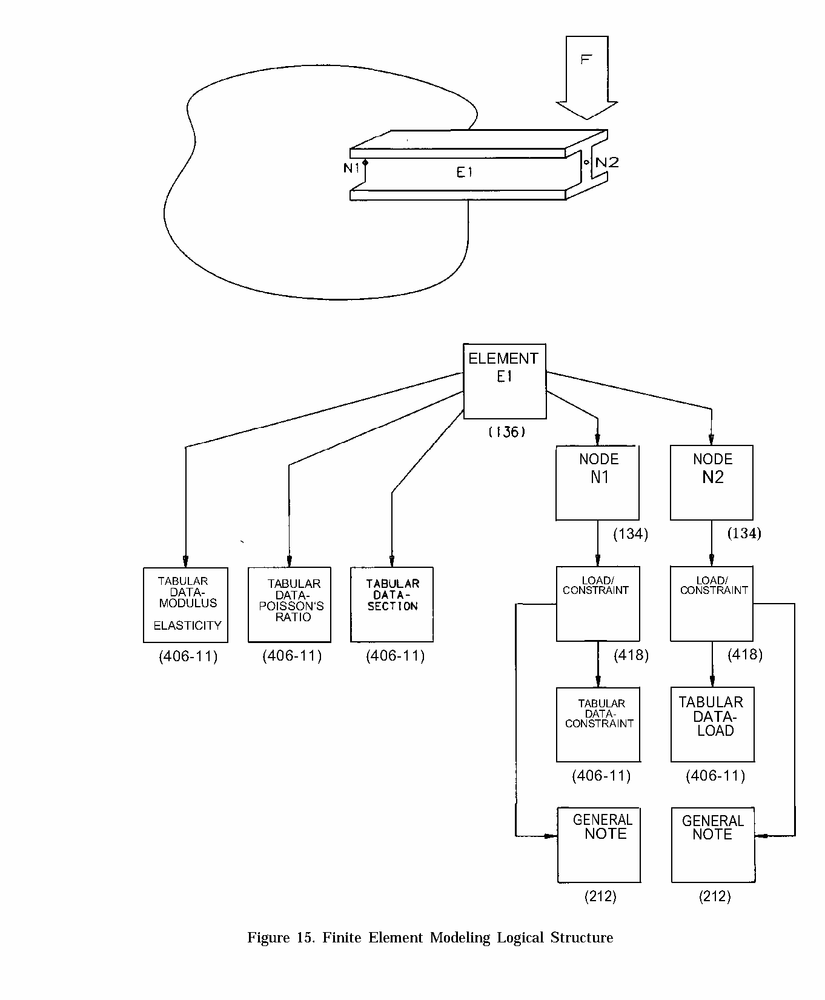

### 3.6.7 Attribute Tables

An attribute table (see Sections 4.79 and 4.141) is a collection of attribute definitions and values in the form of a single row or table. The structure consists of an Attribute Table Definition Entity (Type 322), where each attribute is defined by a name, a data-type, and a count. The attribute values are either supplied as part of the attribute definition, or instanced using the Attribute Table Instance Entity (Type 422). One or more Attribute Table Instance Entities may point to the Attribute Table Definition Entity using the third field of their Directory Entry.

Three types of Attribute Table Definition Entities and two types of Attribute Table Instance Entities _ECO630_ are defined. The Attribute Table Definition Entity can have: (1) attribute definitions only, (2) attribute definitions followed immediately by the attribute values, or (3) attribute definitions followed by attribute values with each value followed by a pointer to a Text Display Template Entity (Type 312). The Attribute Table Instance Entity can store: (1) a single row of attribute values, or (2) a table of rows of attribute values, stored in row-major order.

---

# 4. Entity Types

**Contents:**

- [4.1 General](#41-general)
- [4.2 Null Entity (Type 0)](#42-null-entity-type-0)
- [4.3 Circular Arc Entity (Type 100)](#43-circular-arc-entity-type-100)
- [4.4 Composite Curve Entity (Type 102)](#44-composite-curve-entity-type-102)
- [4.5 Conic Arc Entity (Type 104)](#45-conic-arc-entity-type-104)
- [4.6 Copious Data Entity (Type 106, Forms 1-3)](#46-copious-data-entity-type-106-forms-1-3)
- [4.7 Linear Path Entity (Type 106, Forms 11-13)](#47-linear-path-entity-type-106-forms-11-13)
- [4.8 Centerline Entity (Type 106, Forms 20-21)](#48-centerline-entity-type-106-forms-20-21)
- [4.9 Section Entity (Type 106, Forms 31–38)](#49-section-entity-type-106-forms-3138)
- [4.10 Witness Line Entity (Type 106, Form 40)](#410-witness-line-entity-type-106-form-40)
- [4.11 Simple Closed Planar Curve Entity (Type 106, Form 63)](#411-simple-closed-planar-curve-entity-type-106-form-63)
- [4.12 Plane Entity (Type 108)](#412-plane-entity-type-108)
- [4.13 Line Entity (Type 110, Form 0)](#413-line-entity-type-110-form-0)
- [4.14 Parametric Spline Curve Entity (Type 112)](#414-parametric-spline-curve-entity-type-112)
- [4.15 Parametric Spline Surface Entity (Type 114)](#415-parametric-spline-surface-entity-type-114)
- [4.16 Point Entity (Type 116)](#416-point-entity-type-116)
- [4.17 Ruled Surface Entity (Type 118)](#417-ruled-surface-entity-type-118)
- [4.18 Surface of Revolution Entity (Type 120)](#418-surface-of-revolution-entity-type-120)
- [4.19 Tabulated Cylinder Entity (Type 122)](#419-tabulated-cylinder-entity-type-122)
- [4.20 Direction Entity (Type 123)‡](#420-direction-entity-type-123)
- [4.21 Transformation Matrix Entity (Type 124)](#421-transformation-matrix-entity-type-124)
- [4.22 Flash Entity (Type 125)](#422-flash-entity-type-125)
- [4.23 Rational B-Spline Curve Entity (Type 126)](#423-rational-b-spline-curve-entity-type-126)
- [4.24 Rational B-Spline Surface Entity (Type 128)](#424-rational-b-spline-surface-entity-type-128)
- [4.25 Offset Curve Entity (Type 130)](#425-offset-curve-entity-type-130)
- [4.26 Connect Point Entity (Type 132)](#426-connect-point-entity-type-132)
- [4.27 Node Entity (Type 134)](#427-node-entity-type-134)
- [4.28 Finite Element Entity (Type 136)](#428-finite-element-entity-type-136)
- [4.29 Nodal Displacement and Rotation Entity (Type 138)](#429-nodal-displacement-and-rotation-entity-type-138)
- [4.30 Offset Surface Entity (Type 140)](#430-offset-surface-entity-type-140)
- [4.31 Boundary Entity (Type 141)](#431-boundary-entity-type-141)
- [4.32 Curve on a Parametric Surface Entity (Type 142)](#432-curve-on-a-parametric-surface-entity-type-142)
- [4.33 Bounded Surface Entity (Type 143)](#433-bounded-surface-entity-type-143)
- [4.34 Trimmed (Parametric) Surface Entity (Type 144)](#434-trimmed-parametric-surface-entity-type-144)
- [4.35 Nodal Results Entity (Type 146)‡](#435-nodal-results-entity-type-146)
- [4.36 Element Results Entity (Type 148)‡](#436-element-results-entity-type-148)
- [4.37 Block Entity (Type 150)](#437-block-entity-type-150)
- [4.38 Right Angular Wedge Entity (Type 152)](#438-right-angular-wedge-entity-type-152)
- [4.39 Right Circular Cylinder Entity (Type 154)](#439-right-circular-cylinder-entity-type-154)
- [4.40 Right Circular Cone Frustum Entity (Type 156)](#440-right-circular-cone-frustum-entity-type-156)
- [4.41 Sphere Entity (Type 158)](#441-sphere-entity-type-158)
- [4.42 Torus Entity (Type 160)](#442-torus-entity-type-160)
- [4.43 Solid of Revolution Entity (Type 162)](#443-solid-of-revolution-entity-type-162)
- [4.44 Solid of Linear Extrusion Entity (Type 164)](#444-solid-of-linear-extrusion-entity-type-164)
- [4.45 Ellipsoid Entity (Type 168)](#445-ellipsoid-entity-type-168)
- [4.46 Boolean Tree Entity (Type 180)](#446-boolean-tree-entity-type-180)
- [4.47 Selected Component Entity (Type 182)‡](#447-selected-component-entity-type-182)
- [4.48 Solid Assembly Entity (Type 184)](#448-solid-assembly-entity-type-184)
- [4.49 Manifold Solid B-Rep Object Entity (Type 186)‡](#449-manifold-solid-b-rep-object-entity-type-186)
- [4.50 Plane Surface Entity (Type 190)‡](#450-plane-surface-entity-type-190)
- [4.51 Right Circular Cylindrical Surface Entity (Type 192)‡](#451-right-circular-cylindrical-surface-entity-type-192)
- [4.52 Right Circular Conical Surface Entity (Type 194)‡](#452-right-circular-conical-surface-entity-type-194)
- [4.53 Spherical Surface Entity (Type 196)‡](#453-spherical-surface-entity-type-196)
- [4.54 Toroidal Surface Entity (Type 198)‡](#454-toroidal-surface-entity-type-198)
- [4.55 Angular Dimension Entity (Type 202)](#455-angular-dimension-entity-type-202)
- [4.56 Curve Dimension Entity (Type 204)‡](#456-curve-dimension-entity-type-204)
- [4.57 Diameter Dimension Entity (Type 206)](#457-diameter-dimension-entity-type-206)
- [4.58 Flag Note Entity (Type 208)](#458-flag-note-entity-type-208)
- [4.59 General Label Entity (Type 210)](#459-general-label-entity-type-210)
- [4.60 General Note Entity (Type 212)](#460-general-note-entity-type-212)
- [Scope Note: §4.61 onward (3D CAD Reader/Writer Focus)](#scope-note-461-onward-3d-cad-readerwriter-focus)
- [4.69 Associativity Definition Entity (Type 302)](#469-associativity-definition-entity-type-302)
- [4.70 Line Font Definition Entity (Type 304)](#470-line-font-definition-entity-type-304)
- [4.73 Subfigure Definition Entity (Type 308)](#473-subfigure-definition-entity-type-308)
- [4.76 Color Definition Entity (Type 314)](#476-color-definition-entity-type-314)
- [4.77 Units Data Entity (Type 316)‡](#477-units-data-entity-type-316)
- [4.80 Associativity Instance Entity (Type 402)](#480-associativity-instance-entity-type-402)
- [4.81 Group Associativity (Type 402, Form 1)](#481-group-associativity-type-402-form-1)
- [4.82 Views Visible Associativity (Type 402, Form 3)](#482-views-visible-associativity-type-402-form-3)
- [4.83 Views Visible, Color, Line Weight Associativity (Form 4)](#483-views-visible-color-line-weight-associativity-form-4)
- [4.84 Entity Label Display Associativity (Type 402, Form 5)](#484-entity-label-display-associativity-type-402-form-5)
- [4.85 Group Without Back Pointers Associativity (Form 7)](#485-group-without-back-pointers-associativity-form-7)
- [4.86 Single Parent Associativity (Type 402, Form 9)](#486-single-parent-associativity-type-402-form-9)
- [4.87 External Reference File Index Associativity (Form 12)](#487-external-reference-file-index-associativity-form-12)
- [4.89 Ordered Group with Back Pointers Associativity (Form 14)](#489-ordered-group-with-back-pointers-associativity-form-14)
- [4.90 Ordered Group, no Back Pointers Associativity (Form 15)](#490-ordered-group-no-back-pointers-associativity-form-15)
- [4.91 Planar Associativity (Type 402, Form 16)](#491-planar-associativity-type-402-form-16)
- [4.96 Drawing Entity (Type 404)](#496-drawing-entity-type-404)
- [4.97 Property Entity (Type 406)](#497-property-entity-type-406)
- [4.98 Definition Levels Property (Form 1)](#498-definition-levels-property-form-1)
- [4.99 Region Restriction Property (Form 2)](#499-region-restriction-property-form-2)
- [4.100 Level Function Property (Form 3)](#4100-level-function-property-form-3)
- [4.101 Line Widening Property (Form 5)](#4101-line-widening-property-form-5)
- [4.102 Drilled Hole Property (Form 6)](#4102-drilled-hole-property-form-6)
- [4.103 Reference Designator Property (Form 7)](#4103-reference-designator-property-form-7)
- [4.104 Pin Number Property (Form 8)](#4104-pin-number-property-form-8)
- [4.105 Part Number Property (Form 9)](#4105-part-number-property-form-9)
- [4.106 Hierarchy Property (Form 10)](#4106-hierarchy-property-form-10)
- [4.107 Tabular Data Property (Form 11)](#4107-tabular-data-property-form-11)
- [4.108 External Reference File List Property (Form 12)](#4108-external-reference-file-list-property-form-12)
- [4.109 Nominal Size Property (Form 13)](#4109-nominal-size-property-form-13)
- [4.110 Flow Line Specification Property (Form 14)](#4110-flow-line-specification-property-form-14)
- [4.111 Name Property (Form 15)](#4111-name-property-form-15)
- [4.112 Drawing Size Property (Form 16)](#4112-drawing-size-property-form-16)
- [4.113 Drawing Units Property (Form 17)](#4113-drawing-units-property-form-17)
- [4.114 Intercharacter Spacing Property (Form 18)‡](#4114-intercharacter-spacing-property-form-18)
- [4.115 Line Font Property (Form 19)‡](#4115-line-font-property-form-19)
- [4.116 Highlight Property (Form 20)‡](#4116-highlight-property-form-20)
- [4.117 Pick Property (Form 21)‡](#4117-pick-property-form-21)
- [4.118 Uniform Rectangular Grid Property (Form 22)‡](#4118-uniform-rectangular-grid-property-form-22)
- [4.119 Associativity Group Type Property (Form 23)‡](#4119-associativity-group-type-property-form-23)
- [4.120 Level to LEP Layer Map Property (Form 24)‡](#4120-level-to-lep-layer-map-property-form-24)
- [4.121 LEP Artwork Stackup Property (Form 25)‡](#4121-lep-artwork-stackup-property-form-25)
- [4.122 LEP Drilled Hole Property (Form 26)‡](#4122-lep-drilled-hole-property-form-26)
- [4.123 Generic Data Property (Form 27)‡](#4123-generic-data-property-form-27)
- [4.124 Dimension Units Property (Form 28)‡](#4124-dimension-units-property-form-28)
- [4.125 Dimension Tolerance Property (Form 29)‡](#4125-dimension-tolerance-property-form-29)
- [4.126 Dimension Display Data Property (Form 30)‡](#4126-dimension-display-data-property-form-30)
- [4.127 Basic Dimension Property (Form 31)‡](#4127-basic-dimension-property-form-31)
- [4.128 Drawing Sheet Approval Property (Type 406, Form 32)‡](#4128-drawing-sheet-approval-property-type-406-form-32)
- [4.129 Drawing Sheet ID Property (Type 406, Form 33)‡](#4129-drawing-sheet-id-property-type-406-form-33)
- [4.130 Underscore Property (Type 406, Form 34)‡](#4130-underscore-property-type-406-form-34)
- [4.131 Overscore Property (Type 406, Form 35)‡](#4131-overscore-property-type-406-form-35)
- [4.132 Closure Property (Type 406, Form 36)‡](#4132-closure-property-type-406-form-36)
- [4.133 Singular Subfigure Instance Entity (Type 408)](#4133-singular-subfigure-instance-entity-type-408)
- [4.134 View Entity (Type 410)](#4134-view-entity-type-410)
- [4.135 Perspective View Entity (Type 410, Form 1)‡](#4135-perspective-view-entity-type-410-form-1)
- [4.136 Rectangular Array Subfigure Instance Entity (Type 412)](#4136-rectangular-array-subfigure-instance-entity-type-412)
- [4.137 Circular Array Subfigure Instance Entity (Type 414)](#4137-circular-array-subfigure-instance-entity-type-414)
- [4.138 External Reference Entity (Type 416)](#4138-external-reference-entity-type-416)
- [4.142 Solid Instance Entity (Type 430)](#4142-solid-instance-entity-type-430)
- [4.143 Vertex Entity (Type 502)‡](#4143-vertex-entity-type-502)
- [4.144 Edge Entity (Type 504)‡](#4144-edge-entity-type-504)
- [4.145 Loop Entity (Type 508)‡](#4145-loop-entity-type-508)
- [4.146 Face Entity (Type 510)‡](#4146-face-entity-type-510)
- [4.147 Shell Entity (Type 514)‡](#4147-shell-entity-type-514)


## 4.1 General

_ECO630_

This Chapter defines the entity types available to be used in the entity-based product definition file. Descriptions of the various directory entry fields were given in Section 2.2.4.4. The meanings of these fields remain the same across all entities. In this Chapter, those entities making extended use of Field 15 in the directory entry (Form Number) are indicated, and the various options are listed. The parameter data record for each entity is also described in this Chapter. The fields for this record vary from entity to entity.

Beginning with Version 5.3 of this Specification, those entities whose testing is not yet complete are marked with the label "‡" and a reference to Section 1.9. Table 5 lists the untested entities.

**Table 5:** Untested Entities

| Entity Type Number | Form | Entity Type |
|---|---|---|
| 123 |  | Direction |
| 136 |  | Finite Element (additional topologies) |
| 141 |  | Boundary |
| 143 |  | Bounded Surface |
| 146 | 0–34 | Nodal Results |
| 148 | 0–34 | Element Results |
| 182 |  | Selected Component |
| 186 |  | Manifold Solid B-Rep Object |
| 190 |  | Plane Surface |
| 192 |  | Right Circular Cylindrical Surface |
| 194 |  | Right Circular Conical Surface |
| 196 |  | Spherical Surface |
| 198 |  | Toroidal Surface |
| 204 |  | Curve Dimension |
| 212 | All | Additional General Note Fonts: OCR-B Text Font; Kanji Text Font |
| 213 |  | New General Note |
| 216 | 0–2 | Linear Dimension (Form Numbers) |
| 218 | 1 | Ordinate Dimension (Form Number) |
| 222 | 1 | Radius Dimension (Multiple Leader) |
| 228 | 1–3 | General Symbol (Form Numbers) |
| 230 | 0 | Sectioned Area (Pattern Hatches) |
| 230 | 1 | Sectioned Area (Form Number) |
| 306 |  | MACRO |
| 316 |  | Units Data |
| 402 | 19 | Segmented Views Visible Associativity |
| 402 | 20 | Piping Flow Associativity |
| 402 | 21 | Dimensioned Geometry Associativity |
| 404 | 1 | Drawing with Rotated Views |
| 406 | 18 | Intercharacter Spacing Property |
| 406 | 19 | Line Font Property |
| 406 | 20 | Highlight Property |
| 406 | 21 | Pick Property |
| 406 | 22 | Uniform Rectangular Grid Property |
| 406 | 23 | Associativity Group Type Property |
| 406 | 24 | Level to PWB Layer Map Property |
| 406 | 25 | PWB Artwork Stackup Property |
| 406 | 26 | PWB Drilled Hole Property |
| 406 | 27 | Generic Data Property |
| 406 | 28 | Dimensioned Units Property |
| 406 | 29 | Dimension Tolerance Property |
| 406 | 30 | Dimension Display Data Property |
| 406 | 31 | Basic Dimension Property |
| 406 | 32 | Drawing Sheet Approval Property |
| 406 | 33 | Drawing Sheet ID Property |
| 406 | 34 | Underscore Property |
| 406 | 35 | Overscore Property |
| 406 | 36 | Closure Property |
| 410 | 1 | View (Perspective) |
| 416 | 3 | External Reference (Form Number) |
| 416 | 4 | External Reference (Form Number) |
| 502 |  | Vertex |
| 504 |  | Edge |
| 508 |  | Loop |
| 510 |  | Face |
| 514 |  | Shell |

Potential implementors are warned that significant changes may occur to UNTESTED entities as they are tested and validated. Please communicate any test results or problems to the IGES/PDES Organization's Administrative Office.

## 4.2 Null Entity (Type 0)

The Null Entity (Type 0) is intended to be ignored by a processor. It may contain an arbitrary amount of data in its PD data. When encountered by a processor, this entity shall be skipped over and not processed. Any value is permitted in a DE field labeled `<n.a.>` and may be ignored by a postprocessor.

This entity is useful when editing a file. By changing the entity type number of an entity in a file to 0, one ensures that the entity will not be processed. Thus, the replacement of an entity in a file can easily be done by adding the replacement entity to the end of the DE and PD Sections and changing the replaced entity type number to 0.

When editing a file to create a Null Entity, care should be taken to change both Entity Type Number Fields in the DE Section, as well as the first field of the first PD line.

**Directory Entry**

| (1) Entity Type Number | (2) Parameter Data | (3) Structure | (4) Line Font Pattern | (5) Level | (6) View | (7) Xformation Matrix | (8) Label Display | (9) Status Number | (10) Sequence Number |
|---|---|---|---|---|---|---|---|---|---|
| 0 |  | `<n.a.>` | `<n.a.>` | `<n.a.>` | `<n.a.>` | `<n.a.>` | `<n.a.>` | ******** | D# |

| (11) Entity Type Number | (12) Line Weight | (13) Color Number | (14) Parameter Line Count | (15) Form Number | (16) Reserved | (17) Reserved | (18) Entity Label | (19) Entity Subscript | (20) Sequence Number |
|---|---|---|---|---|---|---|---|---|---|
| 0 | `<n.a.>` | `<n.a.>` |  | `<n.a.>` |  |  |  |  | D#+1 |

## 4.3 Circular Arc Entity (Type 100)

_ECO630_

A circular arc is a connected portion of a circle which has distinct start and terminate points. The definition space coordinate system is always chosen so that the circular arc lies in a plane either coincident with, or parallel to, the XT, YT plane.

A circular arc determines unique arc endpoints and an arc center point (the center of the parent circle). By considering the arc end points to be enumerated and listed in an ordered manner, start point first, followed by terminate point, a direction with respect to definition space can be associated with the arc. The ordering of the end points corresponds to the ordering necessary for the arc to be traced out in a counterclockwise direction. (See Section 3.2.4.) This convention serves to distinguish the desired circular arc from its complementary arc (complementary with respect to the parent circle).

The direction of the arc with respect to model space is determined by the original counterclockwise direction of the arc within definition space, in conjunction with the action of the transformation matrix on the arc.

If required, the default parameterization is:

$$C(t_i) = (X_1 + R \cos t_i,\ Y_1 + R \sin t_i,\ ZT),\quad t_2 \le t \le t_3,$$

where $ZT$ is the coordinate of a point along the $ZT$ axis, for $i = 2$ and $3$,

$$R = \sqrt{(X_i - X_1)^2 + (Y_i - Y_1)^2},$$

$t_i$ is such that

$$(R \cos t_i,\ R \sin t_i) = (X_i - X_1,\ Y_i - Y_1),$$

and

$$0 \le t_2 < 2\pi,\quad 0 \le t_3 - t_2 \le 2\pi.$$

Examples of the Circular Arc Entity are shown in Figure 16. In Example 1 of Figure 16 the solid arc is a full circle, and the start and terminate points are coincident. In Example 2 of Figure 16, the solid arc is defined using point A as the start point and point B as the terminate point. If the complementary dashed arc were desired, the start point listed in the parameter data entry would be B, and the terminate point would be A.

**Figure 16:** F100X.IGS Examples Defined Using the Circular Arc Entity

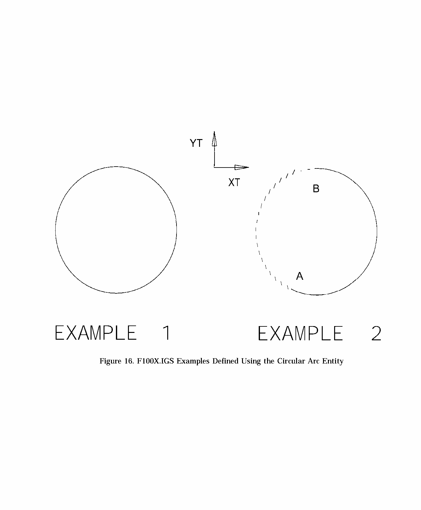

**Directory Entry**

| (1) Entity Type Number | (2) Parameter Data | (3) Structure | (4) Line Font Pattern | (5) Level | (6) View | (7) Xformation Matrix | (8) Label Display | (9) Status Number | (10) Sequence Number |
|---|---|---|---|---|---|---|---|---|---|
| 100 | → | `<n.a.>` | #,→ | #,→ | 0,→ | 0,→ | 0,→ | . . . . | D# |

| (11) Entity Type Number | (12) Line Weight | (13) Color Number | (14) Parameter Line Count | (15) Form Number | (16) Reserved | (17) Reserved | (18) Entity Label | (19) Entity Subscript | (20) Sequence Number |
|---|---|---|---|---|---|---|---|---|---|
| 100 | # | #,→ | # | 0 |  |  |  | # | D#+1 |

**Parameter Data**

_ECO630_

| Index | Name | Type | Description |
|---|---|---|---|
| 1 | ZT | Real | Parallel ZT displacement of arc from XT, YT plane |
| 2 | X1 | Real | Arc center abscissa |
| 3 | Y1 | Real | Arc center ordinate |
| 4 | X2 | Real | Start point abscissa |
| 5 | Y2 | Real | Start point ordinate |
| 6 | X3 | Real | Terminate point abscissa |
| 7 | Y3 | Real | Terminate point ordinate |

Additional pointers as required (see Section 2.2.4.5.2).

## 4.4 Composite Curve Entity (Type 102)

A composite curve is a continuous curve that results from the grouping of certain individual constituent entities into a logical unit.

A composite curve is defined as an ordered list of entities consisting of point, connect point, and parameterized curve entities (excluding the Composite Curve Entity). The list of entities appears in the parameter data entry. There, each entity to appear in the defining list is indicated by means of a pointer to the directory entry of that entity. The order within the defining list is the same as the order of the listing of these pointers.

Each constituent entity has its own transformation matrix and display attributes. Each constituent entity may have text or properties associated with it. Because the constituent entities are subordinate to the composite entity, the Subordinate Entity Switch (digits 3–4 in Directory Entry Field 9) of each constituent entity shall indicate a physical dependency.

A composite curve is a directed curve, having a start point and a terminate point. The direction of _ECO630_ the composite curve is determined by the direction of the constituent curve entities (i.e., those constituent entities other than the point entity) in the following way: The start point for the composite curve is the start point of the first curve entity appearing in the defining list. The terminate point for the composite curve is the terminate point of the last curve entity appearing in the defining list. Within the defining list itself, the terminate point of each constituent curve entity has the same coordinates as the start point of the succeeding curve entity.

The Point and Connect Point Entities are included as allowable entity types so that properties or general notes can be attached to either the start point or the terminate point of any constituent curve entities in the defining list.

A logical connection relationship can be indicated by having two composite curves or a composite curve and a network subfigure reference the Connect Point Entity. For the special case of the logical connection of a connect point on one subfigure instance to a connect point on another subfigure instance, a composite curve is allowed whose list contains only two Connect Point Entities with no intervening curve entity. In this case, the instance of the Composite Curve Entity is not a curve in the normal sense; it is not continuous and has no arc length. This usage is permitted in certain applications (e.g., FEM and AEC). There are certain restrictions regarding the use of the point entity in a composite entity. They are:

1. Two Point or Connect Point Entities cannot appear consecutively in the defining list unless they are the only entities in the composite curve. Such composite curves used as logical connectors shall have an Entity Use Flag value = 04 (logical/positional). _[ECO642]_

2. If a Point or Connect Point Entity and a curve entity are adjacent in the defining list, then the coordinates of the Point or Connect Point Entity must agree with the coordinates of the terminate point of the curve entity whenever the curve entity precedes the Point or Connect Point Entity, and must agree with the coordinates of the start point of the curve entity whenever the curve entity follows the Point or Connect Point Entity.

3. A composite curve cannot consist of a single Point Entity or a single Connect Point Entity. _[ECO630]_

If required, the default parameterization of the composite curve is obtained from the paramterization of the constituent curves as defined below. As point and connect point entities do not contribute to the parameterization of a composite curve, they are not considered in this definition.

Let

- $C$ be the composite curve;
- $N$ be the number of constituent curves $(N \ge 1)$;
- $CC(i)$ be the $i$-th constituent curve, for each $i$ such that $1 \le i \le N$;
- $PS(i)$ be the parametric value of the start of $CC(i)$;
- $PE(i)$ be the parametric value of the end of $CC(i)$;
- $T(0)$ be 0.0;
- $T(i) = T(i-1) + (PE(i) - PS(i))$ for each $i$ such that $1 \le i \le N$;

then

1. The parametric values of $C$ range from $T(0)$ to $T(N)$; and

2. $C(u) = CC(i)(u - T(i-1) + PS(i))$, where $u$ is a parametric value such that $T(i-1) \le u \le T(i)$.

A composite curve consisting solely of Point and/or Connect Point Entities is not given a parameterization.

As an example of a parameterization of a Composite Curve Entity, let $N = 3$, and for each $i$ such that $1 \le i \le 3$, let $CC(i)$ be the $i$-th constituent curve of the composite curve $C$. Assume the parametric values of the start and end points of each $CC(i)$ are given by the table:

| $i$ | $PS(i)$ | $PE(i)$ |
|---|---|---|
| 1 | 0.0 | 0.4 |
| 2 | 3.3 | 3.5 |
| 3 | 0.0 | 0.3 |

Then $T(0) = 0.0$, $T(1) = 0.4$, $T(2) = 0.6$, $T(3) = 0.9$, and the composite curve $C$ is defined from 0.0 to 0.9. This situation is illustrated in Figure 17.

The curve combining $CC(1)$, $CC(2)$, and $CC(3)$ represents the composite curve $C$.

An example of a composite curve and its parameterization is shown in Figure 18.

**Figure 17:** Parameterization of the Composite Curve

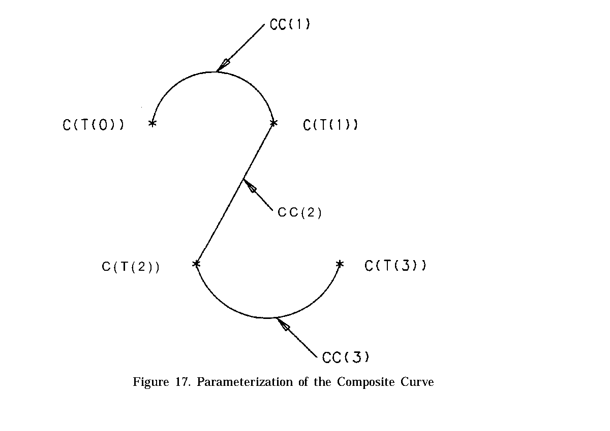

**Figure 18:** Example Defined Using the Composite Curve Entity

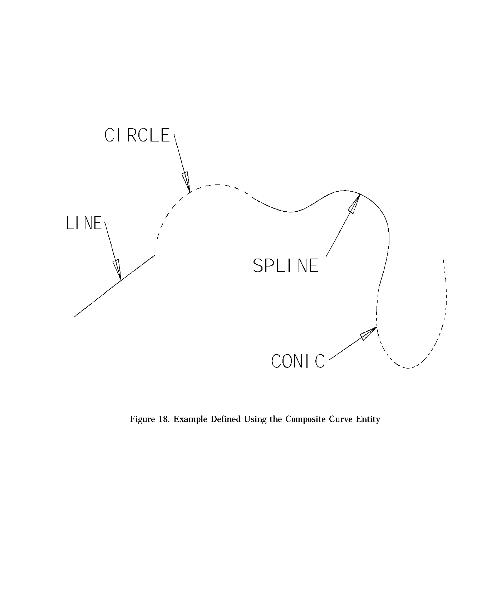

**Directory Entry**

| (1) Entity Type Number | (2) Parameter Data | (3) Structure | (4) Line Font Pattern | (5) Level | (6) View | (7) Xformation Matrix | (8) Label Display | (9) Status Number | (10) Sequence Number |
|---|---|---|---|---|---|---|---|---|---|
| 102 | → | `<n.a.>` | #,→ | #,→ | 0,→ | 0,→ | 0,→ | . . . . | D# |

| (11) Entity Type Number | (12) Line Weight | (13) Color Number | (14) Parameter Line Count | (15) Form Number | (16) Reserved | (17) Reserved | (18) Entity Label | (19) Entity Subscript | (20) Sequence Number |
|---|---|---|---|---|---|---|---|---|---|
| 102 | # | #,→ | # | 0 |  |  |  | # | D#+1 |

Note: When the Hierarchy is set to Global Defer (01), all of the following are ignored and may be defaulted: Line Font Pattern, Line Weight, Color Number, Level, View, and Blank Status.

**Parameter Data**

_ECO650_

| Index | Name | Type | Description |
|---|---|---|---|
| 1 | N | Integer | Number of entities |
| 2 | DE(1) | Pointer | Pointer to the DE of the first constituent entity |
| ... | ... | ... | ... |
| 1+N | DE(N) | Pointer | Pointer to the DE of the last constituent entity |

Additional pointers as required (see Section 2.2.4.5.2).

## 4.5 Conic Arc Entity (Type 104)

_ECO630_

A conic arc is a bounded connected portion of a conic curve which has distinct start and terminate points. The parent conic curve is either an ellipse, a parabola, or a hyperbola. The definition space coordinate system is always chosen so that the conic arc lies in a plane either coincident with or parallel to the XT, YT plane. Within such a plane, a conic is defined by the six coefficients in the following equation, where $X_T, Y_T$ are the coordinates of a point in the XT, YT plane:

$$A X_T^2 + B X_T Y_T + C Y_T^2 + D X_T + E Y_T + F = 0$$

Each coefficient is a real number. The definitions of ellipse, parabola, and hyperbola in terms of these six coefficients are given below.

A conic arc determines unique arc endpoints. A conic arc is defined within definition space by the six coefficients above and the two endpoints. By considering the conic arc endpoints to be enumerated and listed in an ordered manner, start point followed by terminate point, a direction with respect to definition space can be associated with the arc. In order for the desired elliptical arc to be distinguished from its complementary elliptical arc, the direction of the desired elliptical arc shall be counterclockwise. (See Section 3.2.4) In the case of a parabola or hyperbola, the parameters given in the parameter data section uniquely define a portion of the parabola or a portion of a branch of the hyperbola; therefore, the concept of a counterclockwise direction is not applied.

The direction of the conic arc with respect to model space is determined by the original direction of the arc within definition space, in conjunction with the action of the transformation matrix on the arc.

The definitions of the terms ellipse, parabola, and hyperbola are given in terms of the quantities $Q_1$, $Q_2$, and $Q_3$. These quantities are:

$$Q_1 = \begin{vmatrix} A & B/2 & D/2 \\ B/2 & C & E/2 \\ D/2 & E/2 & F \end{vmatrix}$$

$$Q_2 = \begin{vmatrix} A & B/2 \\ B/2 & C \end{vmatrix}$$

$$Q_3 = A + C$$

A parent conic curve is:

- An ellipse if $Q_2 > 0$ and $Q_2 Q_3 < 0$.
- A hyperbola if $Q_2 < 0$ and $Q_2 \ne 0$.
- A parabola if $Q_2 = 0$ and $Q_1 \ne 0$.

An example of each type of conic arc is shown in Figure 19.

Those entities which can be represented as various degenerate forms of a conic equation (e.g., point and line) shall not be put into the Entity Type 104; more appropriate entity types exist for these forms.

Because of the numerical sensitivity of the implicit form of the conic description, conies shall be put into a standard position in definition space. A Conic Arc Entity is said to be in a standard position in definition space provided each of its axes is parallel to either the XT axis or YT axis and provided it is centered about the ZT axis. For a parabola, the origin is the vertex. The conic is moved from this position in definition space to the desired position in space with a Transformation Matrix Entity (Type 124).

The form number shall be regarded as purely informational by a postprocessor. Further details may be found in Appendix C.

If required, the default parameterization is: ($Z_T$ is the coordinate of a point along the ZT axis.)

**Parabola**

If $A$ and $E \ne 0.0$ and $X_1 < X_2$,

$$C(t) = (t,\ -(A/E)t^2,\ Z_T),\quad t_1 \le t \le t_2,$$

where, for $i = 1$ and $2$, $t_i = X_i$. If $X_2 < X_1$,

$$C(t) = (-t,\ -(A/E)t^2,\ Z_T),\quad t_1 \le t \le t_2,$$

where, for $i = 1$ and $2$, $t_i = -X_i$.

If $C$ and $D \ne 0.0$ and $Y_1 < Y_2$,

$$C(t) = (-(C/D)t^2,\ t,\ Z_T),\quad t_1 \le t \le t_2,$$

for $i = 1$ and $2$, $t_i = Y_i$. If $Y_2 < Y_1$ then

$$C(t) = (-(C/D)t^2,\ -t,\ Z_T),\quad t_1 \le t \le t_2,$$

where, for $i = 1$ and $2$, $t_i = -Y_i$.

**Ellipse**

For the ellipse,

$$C(t) = (a \cos t,\ b \sin t,\ Z_T),\quad t_1 \le t \le t_2,$$

where $a = \sqrt{-F/A}$, $b = \sqrt{-F/C}$, and, for $i = 1$ and $2$, $t_i$ is such that

$$(a \cos t_i,\ b \sin t_i,\ Z_T) = (X_i,\ Y_i,\ Z_T)$$

$$0 \le t_1 \le 2\pi$$

$$0 \le t_2 - t_1 \le 2\pi.$$

**Hyperbola**

If $F \cdot A < 0.0$ and $F \cdot C > 0.0$, let $a = \sqrt{-F/A}$ and $b = \sqrt{F/C}$. For $i = 1$ and $2$, $t_i$ is such that

$$(a \sec t_i,\ b \tan t_i,\ Z_T) = (X_i,\ Y_i,\ Z_T)$$

$$-\pi/2 < t_1, t_2 < \pi/2.$$

If $t_1 < t_2$,

$$C(t) = (a \sec t,\ b \tan t,\ Z_T),\quad t_1 \le t \le t_2;$$

if $t_2 < t_1$,

$$C(t) = (a \sec(-t),\ b \tan(-t),\ Z_T),\quad -t_1 \le t \le -t_2.$$

If $F \cdot A > 0.0$ and $F \cdot C < 0.0$, let $a = \sqrt{F/A}$ and $b = \sqrt{-F/C}$. For $I = 1$ and $2$, $t_i$ is such that

$$(a \tan t_i,\ b \sec t_i,\ Z_T) = (X_i,\ Y_i,\ Z_T);$$

$$-\pi/2 < t_1, t_2 < \pi/2.$$

If $t_1 < t_2$,

$$C(t) = (a \tan t,\ b \sec t,\ Z_T),\quad t_1 \le t \le t_2;$$

if $t_2 < t_1$,

$$C(t) = (a \tan(-t),\ b \sec(-t),\ Z_T),\quad -t_1 \le t \le -t_2.$$

For the Conic Arc Entity, the form numbers are:

| Form | Meaning |
|---|---|
| 1 | Parent conic curve is an ellipse (See Figure 19) |
| 2 | Parent conic curve is a hyperbola (See Figure 19) |
| 3 | Parent conic curve is a parabola (See Figure 19) |

Note: Previous versions of this Specification permitted a form number of 0. This is now deprecated.

**Figure 19:** F104X.IGS Examples Defined Using the Conic Arc Entity

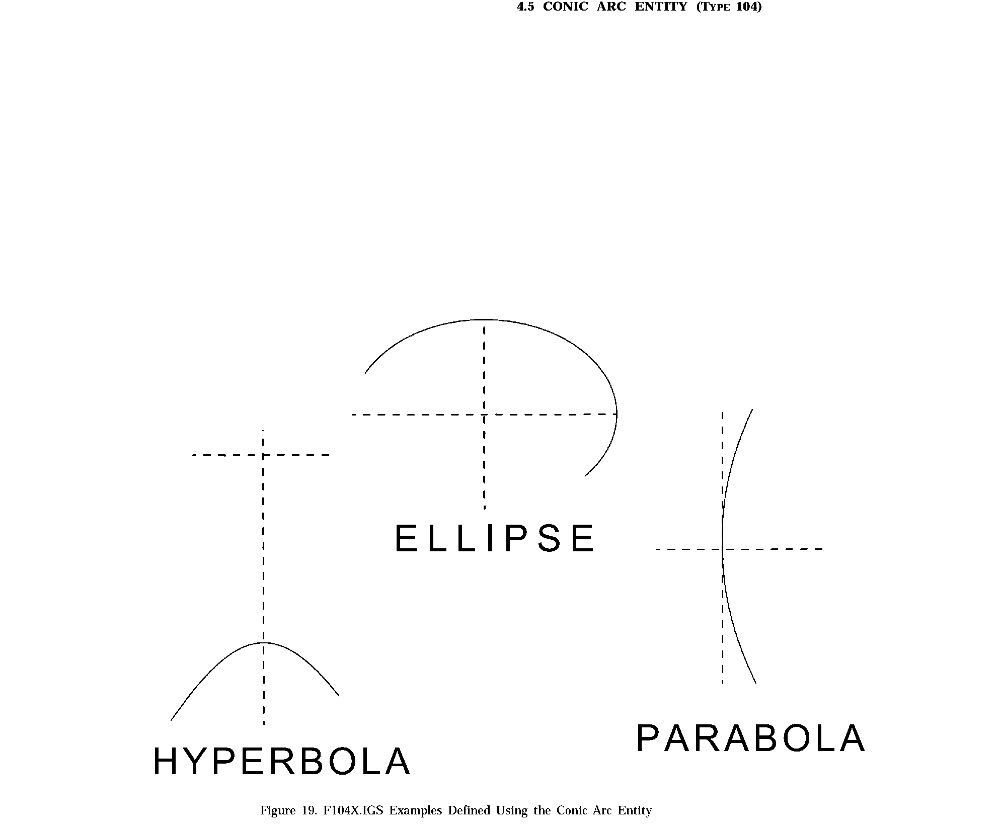

**Directory Entry**

| (1) Entity Type Number | (2) Parameter Data | (3) Structure | (4) Line Font Pattern | (5) Level | (6) View | (7) Xformation Matrix | (8) Label Display | (9) Status Number | (10) Sequence Number |
|---|---|---|---|---|---|---|---|---|---|
| 104 | → | `<n.a.>` | #,→ | #,→ | 0,→ | 0,→ | 0,→ | ??????** | D# |

| (11) Entity Type Number | (12) Line Weight | (13) Color Number | (14) Parameter Line Count | (15) Form Number | (16) Reserved | (17) Reserved | (18) Entity Label | (19) Entity Subscript | (20) Sequence Number |
|---|---|---|---|---|---|---|---|---|---|
| 104 | # | #,→ | # | 1–3 |  |  |  | # | D#+1 |

Note: Valid values of the Form Number are 1–3.

**Parameter Data**

| Index | Name | Type | Description |
|---|---|---|---|
| 1 | A | Real | Conic Coefficient |
| 2 | B | Real | Conic Coefficient |
| 3 | C | Real | Conic Coefficient |
| 4 | D | Real | Conic Coefficient |
| 5 | E | Real | Conic Coefficient |
| 6 | F | Real | Conic Coefficient |
| 7 | ZT | Real | ZT Coordinate of plane of definition |
| 8 | X1 | Real | Start Point Abscissa |
| 9 | Y1 | Real | Start Point Ordinate |
| 10 | X2 | Real | Terminate Point Abscissa |
| 11 | Y2 | Real | Terminate Point Ordinate |

Additional pointers as required (see Section 2.2.4.5.2).

## 4.6 Copious Data Entity (Type 106, Forms 1-3)

_ECO630_

This entity stores data points in the form of pairs, triples, or sextuples. An interpretation flag value signifies which of these forms is being used. This value is the first parameter data entry. The interpretation flag is abbreviated below by the letters IP.

Data points within definition space which lie within a single plane are specified in the form of XT, YT coordinate pairs. In this case, the common ZT value is also needed. Data points arbitrarily located within definition space are specified in the form of XT, YT, ZT coordinate triples. Data points within definition space which have an associated vector are specified in the form of sextuples; the XT, YT, ZT coordinates are specified first, followed by the i, j, k coordinates of the vector associated with the point. (Note that, for an associated vector, no special meaning is implicit.)

The Form numbers of a Copious Data Entity are as follows:

| Form | Meaning |
|---|---|
| 1 | Data points in the form of coordinate pairs. All data points lie in a plane ZT=constant. (IP=l) |
| 2 | Data points in the form of coordinate triples (IP=2) |
| 3 | Data points in the form of sextuples (IP=3) |
| 11 | Data points in the form of coordinate pairs which represent the vertices of a planar, piecewise linear curve (piecewise linear string is sometimes used). All data points lie in a plane ZT=constant. (IP=1) |
| 12 | Data points in the form of coordinate triples which represent the vertices of a piecewise linear curve (piecewise linear string is sometimes used) (IP=2) |
| 13 | Data points in the form of sextuples. The first triple of each sextuple represents the vertices of a piecewise linear curve (piecewise linear string is sometimes used). The second triple is an associated vector. (IP=3) |
| 20 | centerline Entity through points (IP=l) |
| 21 | Centerline Entity through circle centers (IP=l) |
| 31 | Section Entity Form 31 (IP=l) |
| 32 | Section Entity Form 32 (IP=l) |
| 33 | Section Entity Form 33 (IP=l) |
| 34 | Section Entity Form 34 (lP=l) |
| 35 | Section Entity Form 35 (IP=l) |
| 36 | Section Entity Form 36 (IP=l) |
| 37 | Section Entity Form 37 (IP=l) |
| 38 | Section Entity Form 38 (lP=l) |
| 40 | Witness Line Entity (IP=l) |
| 63 | Simple Closed Planar Curve Entity (IP=l) |

Refer to the appropriate entity descriptions for descriptions of Forms other than 1, 2, or 3.

**Directory Entry**

| (1) Entity Type Number | (2) Parameter Data | (3) Structure | (4) Line Font Pattern | (5) Level | (6) View | (7) Xformation Matrix | (8) Label Display | (9) Status Number | (10) Sequence Number |
|---|---|---|---|---|---|---|---|---|---|
| 106 | → | `<n.a.>` | `<n.a.>` | #,→ | 0,→ | 0,→ | 0,→ | ??????** | D# |

| (11) Entity Type Number | (12) Line Weight | (13) Color Number | (14) Parameter Line Count | (15) Form Number | (16) Reserved | (17) Reserved | (18) Entity Label | (19) Entity Subscript | (20) Sequence Number |
|---|---|---|---|---|---|---|---|---|---|
| 106 | `<n.a.>` | #,→ | # | 1–3 |  |  |  | # | D#+1 |

**Parameter Data**

_ECO650_

| Index | Name | Type | Description |
|---|---|---|---|
| 1 | IP | Integer | Interpretation Flag: 1 = x,y pairs, common z; 2 = x,y,z coordinates; 3 = x,y,z coordinates and i,j,k vectors |
| 2 | N | Integer | Number of n-tuples |

For IP=1 (x,y pairs, common z), i.e., for Form 1:

| Index | Name | Type | Description |
|---|---|---|---|
| 3 | ZT | Real | Common z displacement |
| 4 | X(1) | Real | First data point abscissa |
| 5 | Y(1) | Real | First data point ordinate |
| ... | ... | ... | ... |
| 3+2*N | Y(N) | Real | Last data point ordinate |

For IP=2 (x,y,z triples), i.e., for Form 2:

| Index | Name | Type | Description |
|---|---|---|---|
| 3 | X(1) | Real | First data point x value |
| 4 | Y(1) | Real | First data point y value |
| 5 | Z(1) | Real | First data point z value |
| ... | ... | ... | ... |
| 2+3*N | Z(N) | Real | Last data point z value |

For IP=3 (x,y,z,i,j,k sextuples), i.e., for Form 3:

| Index | Name | Type | Description |
|---|---|---|---|
| 3 | X(1) | Real | First data point x value |
| 4 | Y(1) | Real | First data point y value |
| 5 | Z(1) | Real | First data point z value |
| 6 | I(1) | Real | First data point i value |
| 7 | J(1) | Real | First data point j value |
| 8 | K(1) | Real | First data point k value |
| ... | ... | ... | ... |
| 2+6*N | K(N) | Real | Last data point k value |

Additional pointers as required (see Section 2.2.4.5.2).

## 4.7 Linear Path Entity (Type 106, Forms 11-13)

_ECO630_

The linear path is an ordered set of points in either 2- or 3-dimensional space. These points define a series of linear segments along the consecutive points of the path. The segments may cross, or be coincident with, each other. Paths may close; i.e., the first path point may be coincident with the last.

The linear path is implemented as three forms of the Copious Data Entity (Type 106). Form 11 is for 2-dimensional paths, Form 12 is for 3-dimensional paths, and Form 63 is for 2-dimensional closed paths. This entity is closely associated with properties indicating functionality and fabrication parameters, such as Line Widening.

If required, the default parameterization is as defined below. It is consistent with the 0–1 parameterization of the Line Entity (Type 110) in that it results in local 0–1 parameterizations for each of the line segments of the path.

Let

- $C$ be the composite curve;
- $P(i)$ be the $i$-th point in the definition of the path;
- $N$ be the number of points in the definition of the path.

Then

1. The parametric values, $u$, of $C$ range from 0 to $N-1$; and

2. $C(u) = P(i+1) + s(P(i+2) - P(i+1))$

   where
   - $i \le u \le i+1$
   - $0 \le i \le N-1$
   - $s = u - i$.

**Directory Entry**

| (1) Entity Type Number | (2) Parameter Data | (3) Structure | (4) Line Font Pattern | (5) Level | (6) View | (7) Xformation Matrix | (8) Label Display | (9) Status Number | (10) Sequence Number |
|---|---|---|---|---|---|---|---|---|---|
| 106 | → | `<n.a.>` | #,→ | #,→ | 0,→ | 0,→ | 0,→ | ??????** | D# |

| (11) Entity Type Number | (12) Line Weight | (13) Color Number | (14) Parameter Line Count | (15) Form Number | (16) Reserved | (17) Reserved | (18) Entity Label | (19) Entity Subscript | (20) Sequence Number |
|---|---|---|---|---|---|---|---|---|---|
| 106 | # | #,→ | # | 11–13 |  |  |  | # | D#+1 |

**Parameter Data**

_ECO650_

| Index | Name | Type | Description |
|---|---|---|---|
| 1 | IP | Integer | Interpretation Flag: 1 = x,y pairs, common z; 2 = x,y,z coordinates; 3 = x,y,z coordinates and i,j,k vectors |
| 2 | N | Integer | Number of n-tuples; N >= 2 |

For IP=1 (x,y pairs, common z), i.e., for Forms 11:

| Index | Name | Type | Description |
|---|---|---|---|
| 3 | ZT | Real | Common z displacement |
| 4 | X(1) | Real | First data point abscissa |
| 5 | Y(1) | Real | First data point ordinate |
| ... | ... | ... | ... |
| 3+2*N | Y(N) | Real | Last data point ordinate |

For IP=2 (x,y,z triples), i.e., for Form 12:

| Index | Name | Type | Description |
|---|---|---|---|
| 3 | X(1) | Real | First data point x value |
| 4 | Y(1) | Real | First data point y value |
| 5 | Z(1) | Real | First data point z value |
| ... | ... | ... | ... |
| 2+3*N | Z(N) | Real | Last data point z value |

For IP=3 (x,y,z,i,j,k sextuples), i.e., for Form 13:

| Index | Name | Type | Description |
|---|---|---|---|
| 3 | X(1) | Real | First data point x value |
| 4 | Y(1) | Real | First data point y value |
| 5 | Z(1) | Real | First data point z value |
| 6 | I(1) | Real | First data point i value |
| 7 | J(1) | Real | First data point j value |
| 8 | K(1) | Real | First data point k value |
| ... | ... | ... | ... |
| 2+6*N | K(N) | Real | Last data point k value |

Additional pointers as required (see Section 2.2.4.5.2).

## 4.8 Centerline Entity (Type 106, Forms 20-21)

The Centerline Entity takes one of two forms. The first, as illustrated in Example 1 of Figure 20 appears as crosshairs and is normally used in conjunction with circles. The second type (Example 2) is a construction between 2 positions.

The Centerline entities are defined as Form 20 or 21 of the Copious Data Entity. The associated matrix transforms the XT-YT plane of the centerline into model space. The coordinates of the centerline points describe the centerline display symbol. The display symbol is described by line segments where each line is from

$$(X_n, Y_n, Z_n)\ \text{to}\ (X_{n+1}, Y_{n+1}, Z_{n+1})\ \text{where}\ n = 1, 3, 5, \ldots, N-1.$$

See Section 4.6 for more information about the Copious Data Entity (Type 106).

**Directory Entry**

| (1) Entity Type Number | (2) Parameter Data | (3) Structure | (4) Line Font Pattern | (5) Level | (6) View | (7) Xformation Matrix | (8) Label Display | (9) Status Number | (10) Sequence Number |
|---|---|---|---|---|---|---|---|---|---|
| 106 | → | `<n.a.>` | 1 | #,→ | 0,→ | 0,→ | 0,→ | ????01** | D# |

| (11) Entity Type Number | (12) Line Weight | (13) Color Number | (14) Parameter Line Count | (15) Form Number | (16) Reserved | (17) Reserved | (18) Entity Label | (19) Entity Subscript | (20) Sequence Number |
|---|---|---|---|---|---|---|---|---|---|
| 106 | # | #,→ | # | 20–21 |  |  |  | # | D#+1 |

**Parameter Data**

_ECO650_

| Index | Name | Type | Description |
|---|---|---|---|
| 1 | IP | Integer | Interpretation Flag: IP = 1 |
| 2 | N | Integer | Number of data points: N is even |
| 3 | ZT | Real | Common z displacement |
| 4 | X(1) | Real | First data point abscissa |
| 5 | Y(1) | Real | First data point ordinate |
| ... | ... | ... | ... |
| 3+2*N | Y(N) | Real | Last data point ordinate |

Additional pointers as required (see Section 2.2.4.5.2).

**Figure 20:** F10620X.IGS Examples Defined Using the Centerline Entity


## 4.9 Section Entity (Type 106, Forms 31–38)

A Section Entity is defined as a Copious Data Entity (Type 106, Forms 31 to 38). The form number describes how the data are to be interpreted. These descriptions are included for compatibility with previous versions of the Specification. The Sectioned Area Entity (Type 230) provides a more compact method for transferring this information.

The point data contains a list of points $(X_n, Y_n)$, $n = 1, 2, \ldots, N$, (The Z value is constant and N is an even integer.)

The display of the lines consists of solid line segments between the points $(X_n, Y_n, Z)$ and $(X_{n+1}, Y_{n+1}, Z)$ where $n = 1, 3, 5, \ldots, N-1$.

A portion of collinear line segments which appear to be a dashed line shall consist of point pairs for each dash.

The defined line patterns are described below and illustrated in Figure 21.

| Form | Description (see [ANSI79]) |
|---|---|
| 31 | Parallel line segments from section edge to edge (Cast or malleable iron and general use for all materials) |
| 32 | Parallel line segments in pairs with a gap between pairs (Steel) |
| 33 | Alternating pattern of a solid line and a set of collinear dash segments (Bronze, brass, copper, and compositions) |
| 34 | Parallel lines in quadruples with a gap between groups (Rubber, plastic, and electrical insulation) |
| 35 | Triples of parallel lines consisting of two solid lines and a set of collinear dash segments between them with a gap between triples (Titanium and refractory material) |
| 36 | Parallel sets of collinear dash segments (Marble, slate, glass, porcelain) |
| 37 | Two perpendicular sets of parallel lines (White metal, zinc, lead, babbitt, and alloys) |
| 38 | Two perpendicular sets of lines with the principal set solid from edge to edge and the second set consisting of collinear dash segments alternating on the solid lines (Magnesium, aluminum, and aluminum alloys) |

See Section 4.6 for more information about the Copious Data Entity.

**Directory Entry**

| (1) Entity Type Number | (2) Parameter Data | (3) Structure | (4) Line Font Pattern | (5) Level | (6) View | (7) Xformation Matrix | (8) Label Display | (9) Status Number | (10) Sequence Number |
|---|---|---|---|---|---|---|---|---|---|
| 106 | → | `<n.a.>` | 1 | #,→ | 0,→ | 0,→ | 0,→ | ????01** | D# |

| (11) Entity Type Number | (12) Line Weight | (13) Color Number | (14) Parameter Line Count | (15) Form Number | (16) Reserved | (17) Reserved | (18) Entity Label | (19) Entity Subscript | (20) Sequence Number |
|---|---|---|---|---|---|---|---|---|---|
| 106 | # | #,→ | # | 31–38 |  |  |  | # | D#+1 |

**Parameter Data**

_ECO650_

| Index | Name | Type | Description |
|---|---|---|---|
| 1 | IP | Integer | Interpretation Flag: IP = 1 |
| 2 | N | Integer | Number of data points: N is even |
| 3 | ZT | Real | Common z displacement |
| 4 | X(1) | Real | First data point abscissa |
| 5 | Y(1) | Real | First data point ordinate |
| ... | ... | ... | ... |
| 3+2*N | Y(N) | Real | Last data point ordinate |

Additional pointers as required (see Section 2.2.4.5.2).

**Figure 21:** Definition of Patterns for the Section Entity

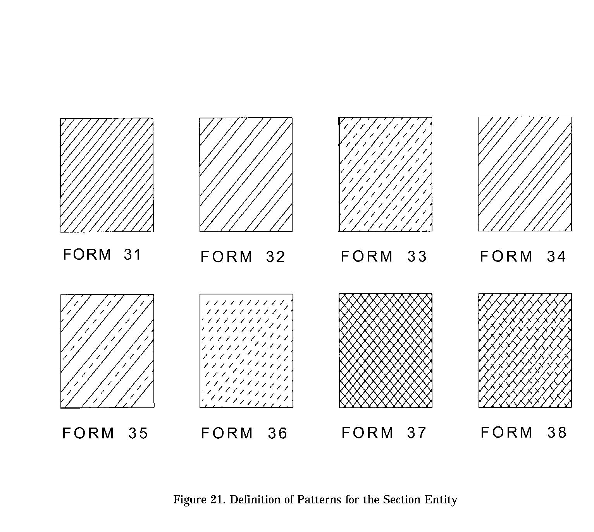

## 4.10 Witness Line Entity (Type 106, Form 40)

A Witness Line Entity is a Form Number 40 of a Copious Data Entity that contains one or more straight line segments associated with drafting entities of various types. Each line segment may be visible or invisible. Refer to Figure 22 for examples.

Within the copious data, there will be the location from which the witness line gap must be maintained. This point is indicated in the figure as PI. The location will be the first point in the copious data. P 1 will be coincident with the geometry being dimensioned or equal to P2 when the location of the geometry is unknown.

(Note: For those annotation methods that do not allow drafting entities to be displaced from the plane of annotation, "coincident with the geometry" indicates that a line normal to the plane of annotation connects P 1 and the point on the geometry being dimensioned. Note that all points must be collinear, and that the number of points will be odd and at least 3 (i.e., 3, 5, 7, . . . ), with alternating blank and displayed segments. The examples in Figure 22 show the blanking of segments and the order of points stored in the copious data.)

See Section 4.6 for more information about the Copious Data Entity (Type 106).

**Directory Entry**

| (1) Entity Type Number | (2) Parameter Data | (3) Structure | (4) Line Font Pattern | (5) Level | (6) View | (7) Xformation Matrix | (8) Label Display | (9) Status Number | (10) Sequence Number |
|---|---|---|---|---|---|---|---|---|---|
| 106 | → | `<n.a.>` | #,→ | #,→ | 0,→ | 0,→ | 0,→ | ????01** | D# |

| (11) Entity Type Number | (12) Line Weight | (13) Color Number | (14) Parameter Line Count | (15) Form Number | (16) Reserved | (17) Reserved | (18) Entity Label | (19) Entity Subscript | (20) Sequence Number |
|---|---|---|---|---|---|---|---|---|---|
| 106 | # | #,→ | # | 40 |  |  |  | # | D#+1 |

**Parameter Data**

_ECO650_

| Index | Name | Type | Description |
|---|---|---|---|
| 1 | IP | Integer | Interpretation Flag: IP = 1 |
| 2 | N | Integer | Number of data points: N >= 3 and odd |
| 3 | ZT | Real | Common z displacement |
| 4 | X(1) | Real | First data point abscissa |
| 5 | Y(1) | Real | First data point ordinate |
| ... | ... | ... | ... |
| 3+2*N | Y(N) | Real | Last data point ordinate |

Additional pointers as required (see Section 2.2.4.5.2).

**Figure 22:** F10640X.IGS Examples Defined Using the Witness Line entity


## 4.11 Simple Closed Planar Curve Entity (Type 106, Form 63)

_ECO630_

A simple closed planar curve (Form 63) defines the boundary of a region in XY coordinate space. This entity must meet the constraints of a simple closed curve (see Appendix K) that lies in a plane ZT = constant. The default parameterization is the same as defined for the planar linear path (Form 11). The Simple Closed Planar Curve is closely related to entities that require the functionality of a closed region.

**Directory Entry**

| (1) Entity Type Number | (2) Parameter Data | (3) Structure | (4) Line Font Pattern | (5) Level | (6) View | (7) Xformation Matrix | (8) Label Display | (9) Status Number | (10) Sequence Number |
|---|---|---|---|---|---|---|---|---|---|
| 106 | → | `<n.a.>` | #,→ | #,→ | 0,→ | 0,→ | 0,→ | ??????** | D# |

| (11) Entity Type Number | (12) Line Weight | (13) Color Number | (14) Parameter Line Count | (15) Form Number | (16) Reserved | (17) Reserved | (18) Entity Label | (19) Entity Subscript | (20) Sequence Number |
|---|---|---|---|---|---|---|---|---|---|
| 106 | # | #,→ | # | 63 |  |  |  | # | D#+1 |

**Parameter Data**

_ECO650_

| Index | Name | Type | Description |
|---|---|---|---|
| 1 | IP | Integer | Interpretation Flag: 1 = x,y pairs, common z; 2 = x,y,z coordinates; 3 = x,y,z coordinates and i,j,k vectors |
| 2 | N | Integer | Number of n-tuples; N >= 2 |
| 3 | ZT | Real | Common z displacement |
| 4 | X(1) | Real | First data point abscissa |
| 5 | Y(1) | Real | First data point ordinate |
| ... | ... | ... | ... |
| 3+2*N | Y(N) | Real | Last data point ordinate |

Additional pointers as required (see Section 2.2.4.5.2).

## 4.12 Plane Entity (Type 108)

_ECO630_

The plane entity can be used to represent an unbounded plane, as well as a bounded portion of a plane. In either of the above cases, the plane is defined within definition space by means of the coefficients A, B, C, D, where at least one of A, B, and C is nonzero and

$$A \cdot X_T + B \cdot Y_T + C \cdot Z_T = D$$

for each point lying in the plane, and having definition space coordinates $(X_T, Y_T, Z_T)$.

The definition space coordinates of a point, as well as a size parameter, can be specified in order to assist in defining a system-dependent display symbol. These values are parameter data entries six through nine, respectively. This information, together with the four coefficients defining the plane, provides sufficient information relative to definition space in order to be able to position the display symbol. (In the unbounded plane example of Figure 23, the curves and the crosshair together constitute the display symbol.) Defaulting, or setting the size parameter to zero, indicates that a display symbol is not intended.

The case of a bounded portion of a fixed plane requires the existence of a pointer to a simple closed curve lying in the plane. This is parameter five. The only allowed coincident points for this curve are the start point and the terminate point. The case of an unbounded plane requires this pointer to be zero.

Versions of the Specification prior to 5.0 used the obsolete Single Parent Associativity (Type 402, Form 9) to represent a bounded plane surface with holes (see Appendix F). This functionality shall now be implemented using the Bounded Surface Entity (Type 143) or the Trimmed (Parametric) Surface Entity (Type 144).

For the Plane Entity, the Form Numbers are as follows:

| Form | Meaning |
|---|---|
| 1 | Bounded planar portion is considered positive. PTR shall not be zero. |
| 0 | Plane is unbounded. PTR shall be zero. |
| −1 | Bounded planar portion is considered negative (hole). PTR shall not be zero. |

**Directory Entry**

| (1) Entity Type Number | (2) Parameter Data | (3) Structure | (4) Line Font Pattern | (5) Level | (6) View | (7) Xformation Matrix | (8) Label Display | (9) Status Number | (10) Sequence Number |
|---|---|---|---|---|---|---|---|---|---|
| 108 | → | `<n.a.>` | #,→ | #,→ | 0,→ | 0,→ | 0,→ | ??????** | D# |

| (11) Entity Type Number | (12) Line Weight | (13) Color Number | (14) Parameter Line Count | (15) Form Number | (16) Reserved | (17) Reserved | (18) Entity Label | (19) Entity Subscript | (20) Sequence Number |
|---|---|---|---|---|---|---|---|---|---|
| 108 | `<n.a.>` | #,→ | # | −1, 0, 1 |  |  |  | # | D#+1 |

Note: When used as a view clipping plane, Entity Use Flag shall be Annotation (01). _[ECO630]_

**Unbounded Plane Entity (Type 108, Form 0)**

_ECO630_

**Parameter Data**

| Index | Name | Type | Description |
|---|---|---|---|
| 1 | A | Real | Coefficients of Plane |
| 2 | B | Real | Coefficients of Plane |
| 3 | C | Real | Coefficients of Plane |
| 4 | D | Real | Coefficients of Plane |
| 5 | PTR | Pointer | Zero |
| 6 | X | Real | XT coordinate of location point for display symbol |
| 7 | Y | Real | YT coordinate of location point for display symbol |
| 8 | Z | Real | ZT coordinate of location point for display symbol |
| 9 | SIZE | Real | Size parameter for display symbol |

Additional pointers as required (see Section 2.2.4.5.2).

**Bounded Plane Entity (Type 108, Forms 1 and −1)**

**Parameter Data**

| Index | Name | Type | Description |
|---|---|---|---|
| 1 | A | Real | Coefficients of Plane |
| 2 | B | Real | Coefficients of Plane |
| 3 | C | Real | Coefficients of Plane |
| 4 | D | Real | Coefficients of Plane |
| 5 | PTR | Pointer | Pointer to the DE of the closed curve entity |
| 6 | X | Real | XT coordinate of location point for display symbol |
| 7 | Y | Real | YT coordinate of location point for display symbol |
| 8 | Z | Real | ZT coordinate of location point for display symbol |
| 9 | SIZE | Real | Size parameter for display symbol |

Additional pointers as required (see Section 2.2.4.5.2).

**Figure 23:** Examples Defined Using the Plane Entity

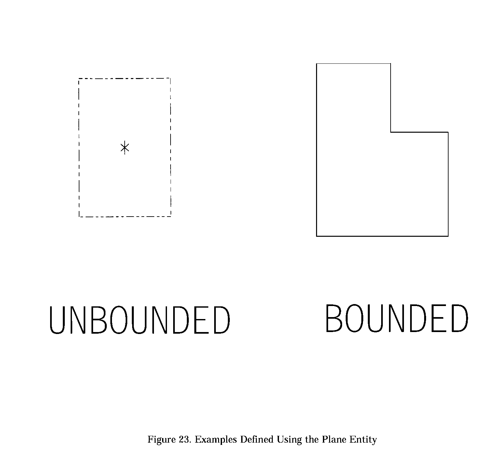

## 4.13 Line Entity (Type 110, Form 0)

_ECO646_

A line is a bounded, connected portion of a straight line which has distinct start and terminate points. _[ECO630]_

A line is defined by its end points. Each end point is specified relative to definition space by triple coordinates. With respect to definition space, a direction is associated with the line by considering the start point to be listed first and the terminate point second.

The direction of the line with respect to model space is determined by the original direction of the line within definition space, in conjunction with the action of the transformation matrix on the line. Examples of the line entity are shown in Figure 24.

If required, the default parameterization is: _[ECO630]_

$$C(t) = P_1 + t(P_2 - P_1)\quad \text{for}\ 0 \le t \le 1$$

**Directory Entry**

| (1) Entity Type Number | (2) Parameter Data | (3) Structure | (4) Line Font Pattern | (5) Level | (6) View | (7) Xformation Matrix | (8) Label Display | (9) Status Number | (10) Sequence Number |
|---|---|---|---|---|---|---|---|---|---|
| 110 | → | `<n.a.>` | #,→ | #,→ | 0,→ | 0,→ | 0,→ | ??????** | D# |

| (11) Entity Type Number | (12) Line Weight | (13) Color Number | (14) Parameter Line Count | (15) Form Number | (16) Reserved | (17) Reserved | (18) Entity Label | (19) Entity Subscript | (20) Sequence Number |
|---|---|---|---|---|---|---|---|---|---|
| 110 | # | #,→ | # | 0 |  |  |  | # | D#+1 |

**Parameter Data**

| Index | Name | Type | Description |
|---|---|---|---|
| 1 | X1 | Real | Start Point P1X |
| 2 | Y1 | Real | Start Point P1Y |
| 3 | Z1 | Real | Start Point P1Z |
| 4 | X2 | Real | Terminate Point P2X |
| 5 | Y2 | Real | Terminate Point P2Y |
| 6 | Z2 | Real | Terminate Point P2Z |

Additional pointers as required (see Section 2.2.4.5.2).

**Figure 24:** F110X.IGS Examples Defined Using the Line Entity

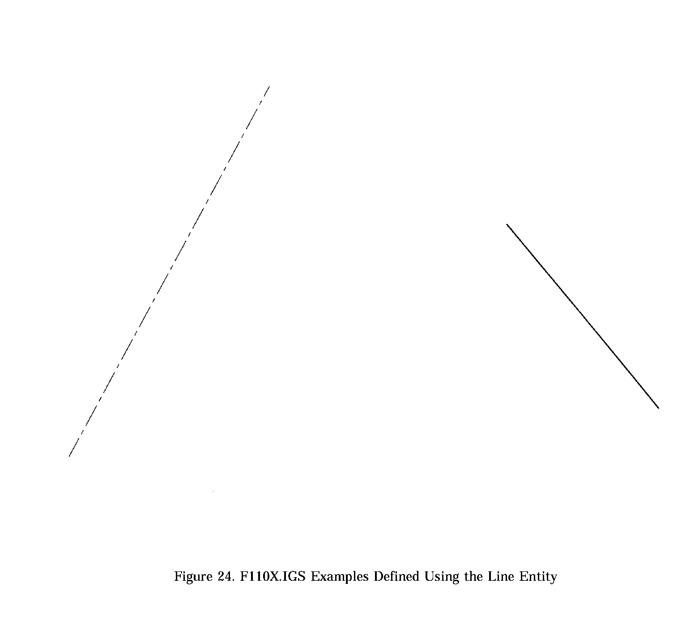

### Line Entity (Type 110, Forms 1-2)‡

‡These forms of the Line Entity have not been tested. See Section 1.9.

**Form 1:** A semi-bounded line is a line bounded on one end and unbounded on the other end. It is defined by a start point (P1) and an arbitrary point (P2) through which the line passes and continues without bound.

**Form 2:** An unbounded line is an infinite line. It is defined by two points (P1 and P2) through which the line passes and continues without bound in both directions.

The arbitrary points shall be chosen to be within the extent of their definition space (i.e., drawing or model space). Points P1 and P2 shall be used (i.e., not infinity) when determining Approximate Maximum Coordinate Value (Global field 20).

| Form | Description | Default parameterization |
|---|---|---|
| 1 | Semi-Bounded Line | $C(t) = P_1 + t(P_2 - P_1)$ for $0 \le t < \infty$ |
| 2 | Unbounded Line | $C(t) = P_1 + t(P_2 - P_1)$ for $-\infty < t < \infty$ |

**Requirements:** Forms 1 and 2 shall specify 06 for the Entity Use Flag since semi-bounded and unbounded lines are construction geometry. Line font patterns start at P1 and continue toward P2.

For form 2, the line font pattern shall repeat in the opposite direction from P1 by placing the end of the pattern at P1, with no perceptible break.

**Directory Entry**

| (1) Entity Type Number | (2) Parameter Data | (3) Structure | (4) Line Font Pattern | (5) Level | (6) View | (7) Xformation Matrix | (8) Label Display | (9) Status Number | (10) Sequence Number |
|---|---|---|---|---|---|---|---|---|---|
| 110 | → | `<n.a.>` | #,→ | #,→ | 0,→ | 0,→ | 0,→ | ??????** | D# |

| (11) Entity Type Number | (12) Line Weight | (13) Color Number | (14) Parameter Line Count | (15) Form Number | (16) Reserved | (17) Reserved | (18) Entity Label | (19) Entity Subscript | (20) Sequence Number |
|---|---|---|---|---|---|---|---|---|---|
| 110 | # | #,→ | # | 1–2 |  |  |  | # | D#+1 |

**Semi-bounded Line Entity (Type 110, Form 1)**

**Parameter Data**

| Index | Name | Type | Description |
|---|---|---|---|
| 1 | X1 | Real | Start point P1X |
| 2 | Y1 | Real | Start point P1Y |
| 3 | Z1 | Real | Start point P1Z |
| 4 | X2 | Real | Arbitrary point P2X |
| 5 | Y2 | Real | Arbitrary point P2Y |
| 6 | Z2 | Real | Arbitrary point P2Z |

Additional pointers as required (see Section 2.2.4.5.2).

**Unbounded Line Entity (Type 110, Form 2)**

**Parameter Data**

| Index | Name | Type | Description |
|---|---|---|---|
| 1 | X1 | Real | Arbitrary point P1X |
| 2 | Y1 | Real | Arbitrary point P1Y |
| 3 | Z1 | Real | Arbitrary point P1Z |
| 4 | X2 | Real | Arbitrary point P2X |
| 5 | Y2 | Real | Arbitrary point P2Y |
| 6 | Z2 | Real | Arbitrary point P2Z |

Additional pointers as required (see Section 2.2.4.5.2).

## 4.14 Parametric Spline Curve Entity (Type 112)

The parametric spline curve is a sequence of parametric polynomial segments. The CTYPE value in Parameter 1 indicates the type of curve as it was represented in the sending (preprocessing) system before conversion to this entity.

The N polynomial segments are delimited by the breakpoints $T(1), T(2), \ldots, T(N+1)$. The coor- _ECO630_ dinates of the points in the i-th segment of the curve are given by the following cubic polynomials:

$$X(u) = AX(i) + BX(i) \cdot s + CX(i) \cdot s^2 + DX(i) \cdot s^3$$
$$Y(u) = AY(i) + BY(i) \cdot s + CY(i) \cdot s^2 + DY(i) \cdot s^3$$
$$Z(u) = AZ(i) + BZ(i) \cdot s + CZ(i) \cdot s^2 + DZ(i) \cdot s^3$$

where $T(i) \le u \le T(i+1)$, $i = 1, \ldots, N$, $s = u - T(i)$.

(If the degree of a polynomial is 2 or 1, the coefficients D, or C and D shall be zero, respectively.)

In order to avoid degeneracy, for each i at least one of the following nine real coefficients shall be nonzero: BX(i), CX(i), DX(i), BY(i), CY(i), DY(i), BZ(i), CZ(i), and Dz(i).

If the spline is planar, it shall be parameterized in terms of the X and Y polynomials only. The _ECO630_ coefficients of the Z polynomial shall be zero except, for each i, the AZ(i) term which indicates the Z-depth in definition space.

The parameter H is used as an indicator of the smoothness of the curve. If H=0, the curve is continuous at all breakpoints. If H=1, the curve is continuous and has slope continuity (see Section 6.3 of [FAUX79]) at all breakpoints. If H=2, the curve is continuous and has both slope and curvature continuity at all breakpoints (see Section 6.3 of [FAUX79]).

To enable determination of the terminate point and derivatives without computing the polynomials, _ECO630_ the N-th polynomials and their derivatives are evaluated at u = T(N+1). These data are divided by appropriate factorials and stored following the polynomial coefficients. For example, the Parameter Data name TPY3 is used to designate 1/3! times the third derivative of the Y polynomial for the Nth segment evaluated at u = T(N+1), the parameter value corresponding to the terminate point. Note that these data are redundant as they are derived from the data defining the Nth polynomial segment.

Examples of a parametric spline are shown in Figure 25 and Figure 26; see Appendix B for additional mathematical details.

**Directory Entry**

| (1) Entity Type Number | (2) Parameter Data | (3) Structure | (4) Line Font Pattern | (5) Level | (6) View | (7) Xformation Matrix | (8) Label Display | (9) Status Number | (10) Sequence Number |
|---|---|---|---|---|---|---|---|---|---|
| 112 | → | `<n.a.>` | #,→ | #,→ | 0,→ | 0,→ | 0,→ | ??????** | D# |

| (11) Entity Type Number | (12) Line Weight | (13) Color Number | (14) Parameter Line Count | (15) Form Number | (16) Reserved | (17) Reserved | (18) Entity Label | (19) Entity Subscript | (20) Sequence Number |
|---|---|---|---|---|---|---|---|---|---|
| 112 | # | #,→ | # |  |  |  |  | # | D#+1 |

**Parameter Data**

| Index | Name | Type | Description |
|---|---|---|---|
| 1 | CTYPE | Integer | Spline Type:<br>1 = Linear<br>2 = Quadratic<br>3 = Cubic<br>4 = Wilson-Fowler<br>5 = Modified Wilson-Fowler<br>6 = B-spline |
| 2 | H | Integer | Degree of continuity with respect to arc length |
| 3 | NDIM | Integer | Number of dimensions:<br>2 = planar<br>3 = nonplanar |
| 4 | N | Integer | Number of segments |
| 5 | T(1) | Real | First break point of piecewise polynomial |
| ... | ... | . |  |
| 5+N | T(N+1) | . | Last break point of piecewise polynomial |
| 6+N | AX(1) | Real | X coordinate polynomial |
| 7+N | BX(1) | Real |  |
| 8+N | CX(1) | Real |  |
| 9+N | DX(1) | Real |  |
| 10+N | AY(1) | Real | Y coordinate polynomial |
| 11+N | BY(1) | Real |  |
| 12+N | CY(1) | Real |  |
| 13+N | DY(1) | Real |  |
| 14+N | AZ(1) | Real | Z coordinate polynomial |
| 15+N | BZ(1) | Real |  |
| 16+N | CZ(1) | Real |  |
| 17+N | DZ(1) | Real |  |
| ... | ... | Real | Subsequent X, Y, Z polynomials concluding with the twelve coefficients of the Nth polynomial segment. |

The parameters that follow comprise the evaluations of the polynomials of the N-th segment and their derivatives at the parameter value u = T(N+1) corresponding to the terminate point. Subsequently, these evaluations are divided by appropriate factorials.

| Index | Name | Type | Description |
|---|---|---|---|
| 6+13*N | TPX0 | Real | X value |
| 7+13*N | TPX1 | Real | X first derivative |
| 8+13*N | TPX2 | Real | X second derivative/2! |
| 9+13*N | TPX3 | Real | X third derivative/3! |
| 10+13*N | TPY0 | Real | Y value |
| 11+13*N | TPY1 | Real | Y first derivative |
| 12+13*N | TPY2 | Real | Y second derivative/2! |
| 13+13*N | TPY3 | Real | Y third derivative/3! |
| 14+13*N | TPZ0 | Real | Z value |
| 15+13*N | TPZ1 | Real | Z first derivative |
| 16+13*N | TPZ2 | Real | Z second derivative/2! |
| 17+13*N | TPZ3 | Real | Z third derivative/3! |

Additional pointers as required (see Section 2.2.4.5.2).

**Figure 25:** F112PX.IGS Parameters of the Parametric Spline Curve Entity

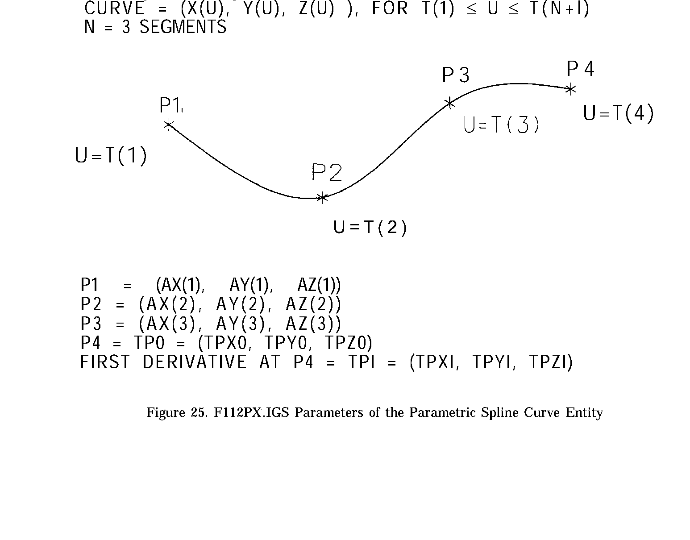

> CURVE = (X(U), Y(U), Z(U)), FOR T(1) ≤ U ≤ T(N+1)
> N = 3 SEGMENTS
>
> P1 = (AX(1), AY(1), AZ(1))
> P2 = (AX(2), AY(2), AZ(2))
> P3 = (AX(3), AY(3), AZ(3))
> P4 = TP0 = (TPX0, TPY0, TPZ0)
> FIRST DERIVATIVE AT P4 = TPI = (TPXI, TPYI, TPZI)

**Figure 26:** F112X.IGS Examples Defined Using the Parametric Spline Curve Entity

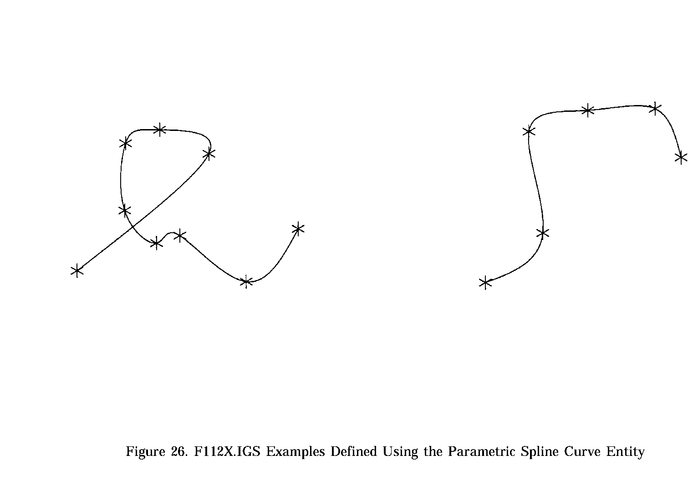

## 4.15 Parametric Spline Surface Entity (Type 114)

The parametric spline surface is a grid of parametric polynomial patches. PTYPE in the Parameter Data Section indicates the type of patch under consideration.

The M × N grid of patches is defined by the u breakpoints $Tu(1), \ldots, Tu(M+1)$ and the v _ECO630_ breakpoints $Tv(1), \ldots, Tv(N+1)$. The coordinates of the points in each of the patches are given by the general bicubic polynomials (given here for the (i, j) patch):

$$\begin{aligned}
X(u, v) &= AX(i,j) + BX(i,j) \cdot s + CX(i,j) \cdot s^2 + DX(i,j) \cdot s^3 \\
&+ EX(i,j) \cdot t + FX(i,j) \cdot s t + GX(i,j) \cdot s^2 t + HX(i,j) \cdot s^3 t \\
&+ KX(i,j) \cdot t^2 + LX(i,j) \cdot s t^2 + MX(i,j) \cdot s^2 t^2 + NX(i,j) \cdot s^3 t^2 \\
&+ PX(i,j) \cdot t^3 + QX(i,j) \cdot s t^3 + RX(i,j) \cdot s^2 t^3 + SX(i,j) \cdot s^3 t^3
\end{aligned}$$

$$\begin{aligned}
Y(u, v) &= AY(i,j) + BY(i,j) \cdot s + CY(i,j) \cdot s^2 + DY(i,j) \cdot s^3 \\
&+ EY(i,j) \cdot t + FY(i,j) \cdot s t + GY(i,j) \cdot s^2 t + HY(i,j) \cdot s^3 t \\
&+ KY(i,j) \cdot t^2 + LY(i,j) \cdot s t^2 + MY(i,j) \cdot s^2 t^2 + NY(i,j) \cdot s^3 t^2 \\
&+ PY(i,j) \cdot t^3 + QY(i,j) \cdot s t^3 + RY(i,j) \cdot s^2 t^3 + SY(i,j) \cdot s^3 t^3
\end{aligned}$$

$$\begin{aligned}
Z(u, v) &= AZ(i,j) + BZ(i,j) \cdot s + CZ(i,j) \cdot s^2 + DZ(i,j) \cdot s^3 \\
&+ EZ(i,j) \cdot t + FZ(i,j) \cdot s t + GZ(i,j) \cdot s^2 t + HZ(i,j) \cdot s^3 t \\
&+ KZ(i,j) \cdot t^2 + LZ(i,j) \cdot s t^2 + MZ(i,j) \cdot s^2 t^2 + NZ(i,j) \cdot s^3 t^2 \\
&+ PZ(i,j) \cdot t^3 + QZ(i,j) \cdot s t^3 + RZ(i,j) \cdot s^2 t^3 + SZ(i,j) \cdot s^3 t^3
\end{aligned}$$

where $Tu(i) \le u \le Tu(i+1)$, $i = 1, \ldots, M$, $s = u - Tu(i)$,

and $Tv(j) \le v \le Tv(j+1)$, $j = 1, \ldots, N$, $t = v - Tv(j)$.

Postprocessors shall ignore parameters with the indices

$$7 + M + N + 48 \cdot (k \cdot N + (k-1))$$

through

$$6 + M + N + 48 \cdot (k \cdot (N+1))$$

where

$$k = 1, 2, 3, \ldots, M$$

(i.e., the (N+1)-th row of patches) as well as

$$7 + M + N + 48 \cdot (M \cdot (N+1))$$

through

$$6 + M + N + 48 \cdot (M+1) \cdot (N+1)$$

(i.e., the (M+1)-th column of patches).

To maintain upward compatibility with previous versions of this Specification, the preprocessors _ECO630_ shall either enter a real number for each of these parameters or a series of parameter delimiters (see Section 2.2.3). These values act as placeholders in the parameter list. These parameters were intended to handle first, second, and third partial derivatives of the N-th row and M-th column of patches along the outer edge or boundary. However, these parameters can be computed by the receiving system, as needed, from the other parameter values contained in this entity, and therefore are not needed.

An example of the bicubic surface is shown in Figure 27; consult Appendix B for additional details.

**Directory Entry**

| (1) Entity Type Number | (2) Parameter Data | (3) Structure | (4) Line Font Pattern | (5) Level | (6) View | (7) Xformation Matrix | (8) Label Display | (9) Status Number | (10) Sequence Number |
|---|---|---|---|---|---|---|---|---|---|
| 114 | → | `<n.a.>` | #,→ | #,→ | 0,→ | 0,→ | 0,→ | ??????** | D# |

| (11) Entity Type Number | (12) Line Weight | (13) Color Number | (14) Parameter Line Count | (15) Form Number | (16) Reserved | (17) Reserved | (18) Entity Label | (19) Entity Subscript | (20) Sequence Number |
|---|---|---|---|---|---|---|---|---|---|
| 114 | # | #,→ | # |  |  |  |  | # | D#+1 |

**Parameter Data**

| Index | Name | Type | Description |
|---|---|---|---|
| 1 | CTYPE | Integer | Spline Boundary Type:<br>1 = Linear<br>2 = Quadratic<br>3 = Cubic<br>4 = Wilson-Fowler<br>5 = Modified Wilson-Fowler<br>6 = B-spline |
| 2 | PTYPE | Integer | Patch Type:<br>1 = Cartesian Product<br>0 = Unspecified |
| 3 | M | Integer | Number of u segments |
| 4 | N | Integer | Number of v segments |
| 5 | TU(1) | Real | First breakpoint in u (u values of grid lines) |
| ... | ... | ... |  |
| 5+M | TU(M+1) | Real | Last breakpoint in u |
| 6+M | TV(1) | Real | First breakpoint in v (v values of grid lines) |
| ... | ... | ... |  |
| 6+M+N | TV(N+1) | Real | Last breakpoint in v |
| 7+M+N | AX(1,1) | Real | First X coefficient of (1,1) Patch |
| ... | ... | Real |  |
| 22+M+N | SX(1,1) | Real | Last X Coefficient of (1,1) Patch |
| 23+M+N | AY(1,1) | Real | First Y coefficient of (1,1) Patch |
| ... | ... | Real |  |
| 38+M+N | SY(1,1) | Real | Last Y Coefficient of (1,1) Patch |
| 39+M+N | AZ(1,1) | Real | First Z coefficient of (1,1) Patch |
| ... | ... | Real |  |
| 54+M+N | SZ(1,1) | Real | Last Z Coefficient of (1,1) Patch |
| 55+M+N | AX(1,2) | Real | First X Coefficient of (1,2) Patch |
| ... | ... | Real |  |
| 102+M+N | SZ(1,2) | Real | Last Z Coefficient of (1,2) Patch |
| ... | ... | Real |  |
| 7+M+N+48*(N-1) | AX(1,N) | Real | First X Coefficient of (1,N) Patch |
| ... | ... | Real |  |
| 6+M+N+48*N | SZ(1,N) | Real | Last Z Coefficient of (1,N) Patch |
| 7+M+N+48*N | `<n.a.>` | Real | Beginning of Arbitrary Values |
| ... | ... | Real |  |
| 6+M+N+48*(N+1) | `<n.a.>` | Real | End of Arbitrary Values |
| 7+M+N+48*(N+1) | AX(2,1) | Real | First X Coefficient of (2,1) Patch |
| ... | ... | Real |  |
| 6+M+N+48*(N+2) | SZ(2,1) | Real | Last Z Coefficient of (2,1) Patch |
| ... | ... | Real |  |
| 7+M+N+48*(2*N) | AX(2,N) | Real | First X Coefficient of (2,N) Patch |
| ... | ... | Real |  |
| 6+M+N+48*(2*N+1) | SZ(2,N) | Real | Last Z Coefficient of (2,N) Patch |
| 7+M+N+48*(2*N+1) | `<n.a.>` | Real | Beginning of Arbitrary Values |
| ... | ... | Real |  |
| 6+M+N+48*(2*N+2) | `<n.a.>` | Real | Arbitrary Value |
| ... | ... | Real |  |
| 7+M+N+48*[(J-1)*(N+1)+K-1] | AX(J,K) | Real | First X Coefficient of (J,K) Patch |
| ... | ... | Real |  |
| 6+M+N+48*[(J-1)*(N+1)+K] | SZ(J,K) | Real | Last Z Coefficient of (J,K) Patch |
| ... | ... | Real |  |
| 7+M+N+48*[(M-1)*(N+1)+N-1] | AX(M,N) | Real | First X Coefficient of (M,N) Patch |
| ... | ... | Real |  |
| 6+M+N+48*[(M-1)*(N+1)+N] | SZ(M,N) | Real | Last Z Coefficient of (M,N) Patch |
| 7+M+N+48*[(M-1)*(N+1)+N] | `<n.a.>` | Real | Beginning of Arbitrary Values |
| ... | ... | Real |  |
| 6+M+N+48*[(M-1)*(N+1)+(N+1)] | `<n.a.>` | Real | Arbitrary Value _ECO630_ |
| 7+M+N+48*[M*(N+1)] | `<n.a.>` | Real | Arbitrary Value |
| ... | ... | Real |  |
| 6+M+N+48*[M*(N+1)+(N+1)] | `<n.a.>` | Real | End of Arbitrary Values |

Additional pointers as required (see Section 2.2.4.5.2).

**Figure 27:** Parameters of the Parametric Spline Surface Entity

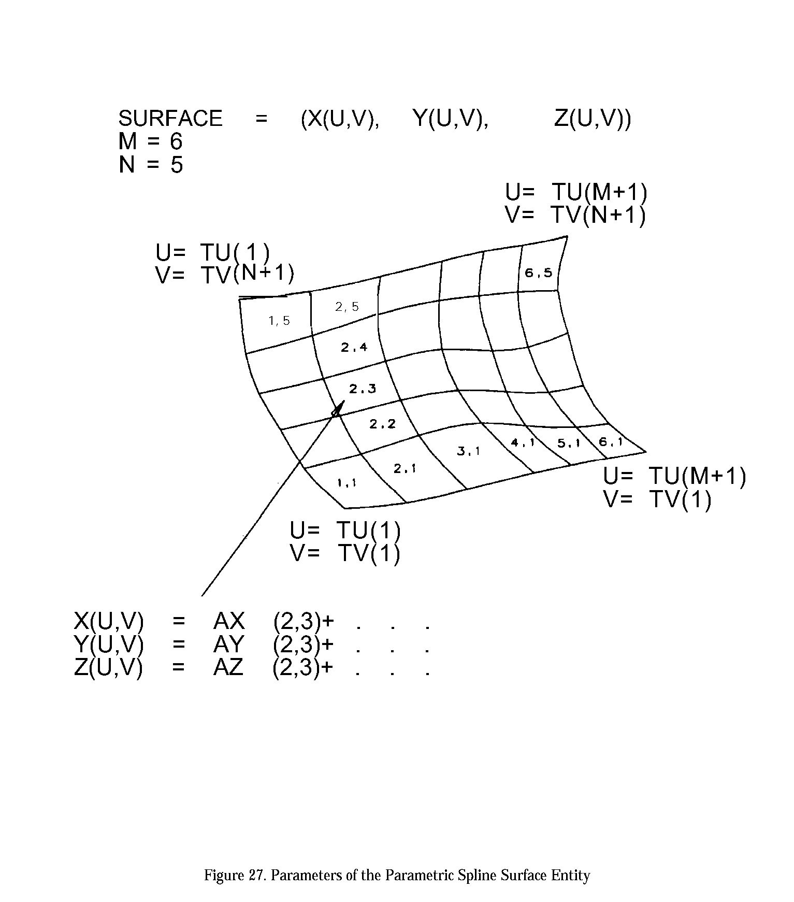

> SURFACE = (X(U,V), Y(U,V), Z(U,V))
> M = 6
> N = 5
>
> X(U,V) = AX(2,3) + . . .
> Y(U,V) = AY(2,3) + . . .
> Z(U,V) = AZ(2,3) + . . .

## 4.16 Point Entity (Type 116)

A point is defined by its coordinates in definition space. An optional pointer to a Subfigure Definition _ECO630_ Entity (Type 308) references a display symbol. Examples of the Point Entity are shown in Figure 28.

**Directory Entry**

| (1) Entity Type Number | (2) Parameter Data | (3) Structure | (4) Line Font Pattern | (5) Level | (6) View | (7) Xformation Matrix | (8) Label Display | (9) Status Number | (10) Sequence Number |
|---|---|---|---|---|---|---|---|---|---|
| 116 | → | `<n.a.>` | #,→ | #,→ | 0,→ | 0,→ | 0,→ | ???????? | D# |

| (11) Entity Type Number | (12) Line Weight | (13) Color Number | (14) Parameter Line Count | (15) Form Number | (16) Reserved | (17) Reserved | (18) Entity Label | (19) Entity Subscript | (20) Sequence Number |
|---|---|---|---|---|---|---|---|---|---|
| 116 | # | #,→ | # |  |  |  |  | # | D#+1 |

Note: If PD Index 4 (Pointer to Display Geometry) is 0 or defaulted, Line Font Pattern, Line Weight, and Hierarchy are ignored.

**Parameter Data**

| Index | Name | Type | Description |
|---|---|---|---|
| 1 | X | Real | X-coordinate of point |
| 2 | Y | Real | Y-coordinate of point |
| 3 | Z | Real | Z-coordinate of point |
| 4 | PTR | Pointer | Pointer to the DE of the Subfigure Definition Entity specifying the display symbol or zero. If zero, no display symbol is specified. |

Additional pointers as required (see Section 2.2.4.5.2).

**Figure 28:** Examples Defined Using the Point Entity

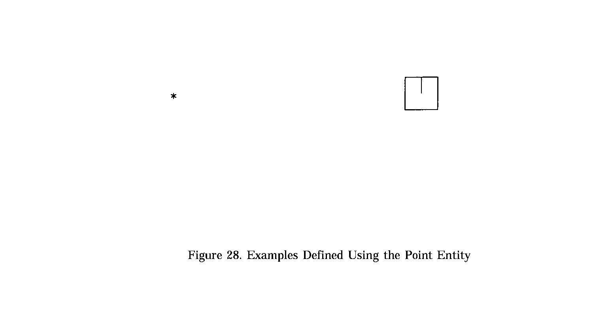

## 4.17 Ruled Surface Entity (Type 118)

A ruled surface is formed by moving a line connecting points of equal relative arc length (Form 0 or _ECO630_ equal relative parametric value (Form 1) on two parametric curves from a start point to a terminate point on the curves. The parametric curves may be points, lines, circles, conies, parametric splines, rational B-splines, composite curves, or any parametric curves defined in this Specification (both planar and non-planar). Examples of the Ruled Surface Entity are shown in Figures 29 and 30.

If required, the default parameterization is: _ECO639_

$$
\begin{aligned}
X(u,v) &= (1-v) \cdot C1_x(t) + v \cdot C2_x(s) \\
Y(u,v) &= (1-v) \cdot C1_y(t) + v \cdot C2_y(s) \\
Z(u,v) &= (1-v) \cdot C1_z(t) + v \cdot C2_z(s),
\end{aligned}
$$

where the two curves are expressed parametrically by the functions $(C1_x(t), C1_y(t), C1_z(t))$ and $(C2_x(s), C2_y(s), C2_z(s))$,

$$
a \le t \le b, \quad c \le s \le d, \quad 0 \le u \le 1, \quad 0 \le v \le 1,
$$

$$
t = a + u \cdot (b - a),
$$

$$
s = c + u \cdot (d - c), \quad \text{DIRFLG} = 0
$$

$$
s = d + u \cdot (c - d), \quad \text{DIRFLG} = 1.
$$

C1(t) and C2(s) are said to be of equal relative parametric value if _t_ and _s_ are evaluated at the same _u_ value.

If DIRFLG=0, the first point of curve 1 is joined to the first point of curve 2, and the last point of _ECO630_ curve 1 to last point of curve 2. If DIRFLG= 1, the first point of curve 1 is joined to the last point of curve 2, and the last point of curve 1 to the first point of curve 2.

If DEVFLG=1, the surface is a developable surface (See [DOCA76] .); if DEVFLG=0, the surface may or may not be a developable surface.

For the Ruled Surface Entity, the Form Numbers are as follows: _ECO630_

| Form | Meaning |
|---|---|
| 0 | Equal relative arc length |
| 1 | Equal relative parametric values |

**Form 0:** DE1 and DE2 specify the defining rail curves, but their given parameterizations are not the ones used to generate the ruled surface. Instead, their arc length reparameterizations, C1 and C2 (respectively), are used.

**Form 1:** DE1 and DE2 specify the defining rail curves, C1 and C2 (respectively). Moreover, their given parameterizations are the ones used to generate the ruled surface.

**Directory Entry**

| (1) Entity Type Number | (2) Parameter Data | (3) Structure | (4) Line Font Pattern | (5) Level | (6) View | (7) Xformation Matrix | (8) Label Display | (9) Status Number | (10) Sequence Number |
|---|---|---|---|---|---|---|---|---|---|
| 118 | → | `<n.a.>` | #,→ | #,→ | 0,→ | 0,→ | 0,→ | ??????** | D# |

| (11) Entity Type Number | (12) Line Weight | (13) Color Number | (14) Parameter Line Count | (15) Form Number | (16) Reserved | (17) Reserved | (18) Entity Label | (19) Entity Subscript | (20) Sequence Number |
|---|---|---|---|---|---|---|---|---|---|
| 118 | # | #,→ | # | 0-1 |  |  |  | # | D#+1 |

**Parameter Data**

| Index | Name | Type | Description |
|---|---|---|---|
| 1 | DE1 | Pointer | Pointer to the DE of the first curve entity |
| 2 | DE2 | Pointer | Pointer to the DE of the second curve entity |
| 3 | DIRFLG | Integer | Direction flag:<br>0 = Join first to first, last to last<br>1 = Join first to last, last to first |
| 4 | DEVFLG | Integer | Developable surface flag:<br>1 = Developable<br>0 = Possibly not |

Additional pointers as required (see Section 2.2.4.5.2).

**Figure 29:** Examples Defined Using the Ruled Surface Entity

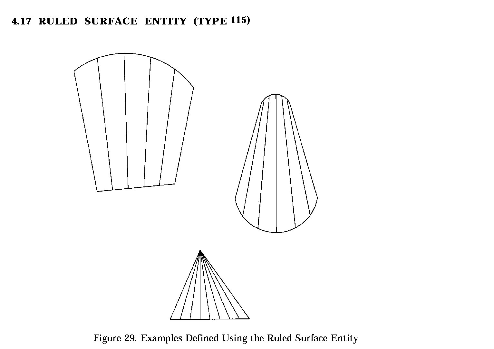

**Figure 30:** Parameters of the Ruled Surface Entity

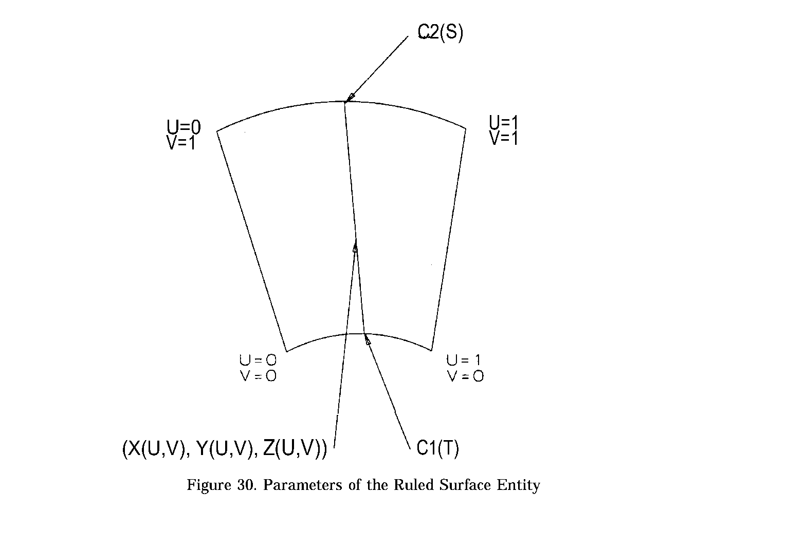

## 4.18 Surface of Revolution Entity (Type 120)

A surface of revolution is defined by an axis of rotation (which shall be a Line Entity), a generatrix, _ECO630_ and start and terminate rotation angles. The surface is created by rotating the generatrix about the axis of rotation through the start and terminating angles. Since the axis of rotation is a Line Entity (Type 110), it contains in its parameter data section the coordinates of its start point first, followed by the coordinates of its terminate point. The angles of rotation are measured counterclockwise from the terminate point of the Line Entity defining the axis of revolution while looking in the direction of the start point of this line. The generatrix curve may be any curve entity to which a parameterization has been assigned. Examples of surfaces of revolution are given in Figure 31.

The various parameters defining the Surface of Revolution Entity are illustrated in Figure 32. The _ECO630_ Line Entity L defines a unique straight line. This straight line defines the axis of revolution. The axis is given the same direction as the direction assigned to the Line Entity L. Let $R_\theta$ be the unique rigid motion leaving each point of the axis of revolution fixed and rotating each point in three-dimensional Euclidean space $\theta$ radians counterclockwise about the axis of revolution. $R_\theta$ assigns to each element of three-dimensional Euclidean space another element of three-dimensional Euclidean space.

The curve C is the generatrix of the surface of revolution. For each real number in the parametric _ECO630_ interval [a,b] that defines its domain, C assigns an element of three-dimensional Euclidean space.

SA and TA denote the start angle and terminate angle, measured in radians, of the surface of revolution to be defined. SA and TA are constrained so that $0 < TA - SA \le 2\pi$.

The surface of revolution S defined by this entity is the surface that is swept by rotating the generatrix curve C from the angle SA to the angle TA, counterclockwise about the directed axis of revolution.

If required, the default parameterization for the surface of revolution S is given by

$$
S(x, \theta) = R_\theta (C(x))
$$

for each pair of real numbers $(x, \theta)$ such that $a \le x \le b$ and $SA \le \theta \le TA$.

**Directory Entry**

| (1) Entity Type Number | (2) Parameter Data | (3) Structure | (4) Line Font Pattern | (5) Level | (6) View | (7) Xformation Matrix | (8) Label Display | (9) Status Number | (10) Sequence Number |
|---|---|---|---|---|---|---|---|---|---|
| 120 | → | `<n.a.>` | #,→ | #,→ | 0,→ | 0,→ | 0,→ | ??????** | D# |

| (11) Entity Type Number | (12) Line Weight | (13) Color Number | (14) Parameter Line Count | (15) Form Number | (16) Reserved | (17) Reserved | (18) Entity Label | (19) Entity Subscript | (20) Sequence Number |
|---|---|---|---|---|---|---|---|---|---|
| 120 | # | #,→ | # | 0 |  |  |  | # | D#+1 |

**Parameter Data**

| Index | Name | Type | Description |
|---|---|---|---|
| 1 | L  | Pointer | Pointer to the DE of the Line Entity (axis of revolution) |
| 2 | C  | Pointer | Pointer to the DE of the generatrix entity |
| 3 | SA | Real    | Start angle in radians |
| 4 | TA | Real    | Terminate angle in radians |

Additional pointers as required (see Section 2.2.4.5.2).

**Figure 31:** Examples Defined Using the Surface of Revolution Entity

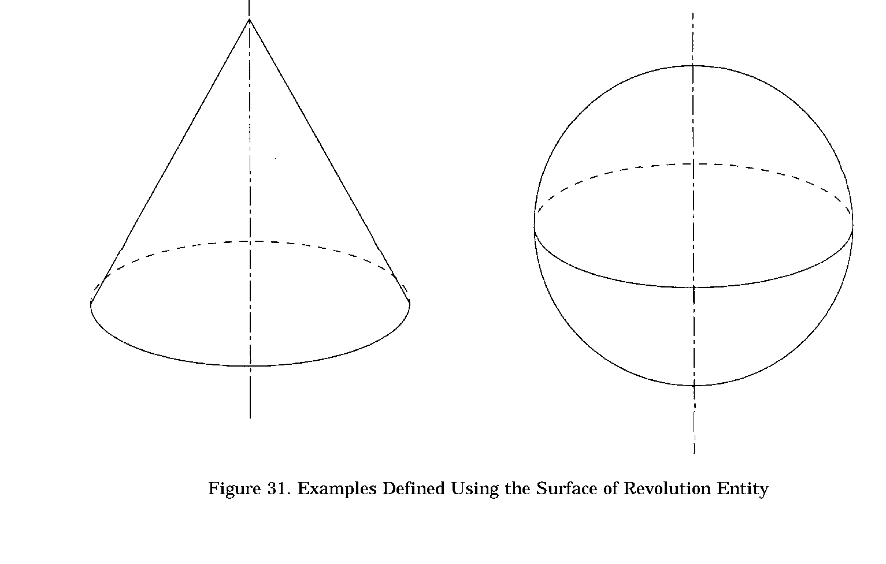

**Figure 32:** Parameters of the Surface of Revolution Entity

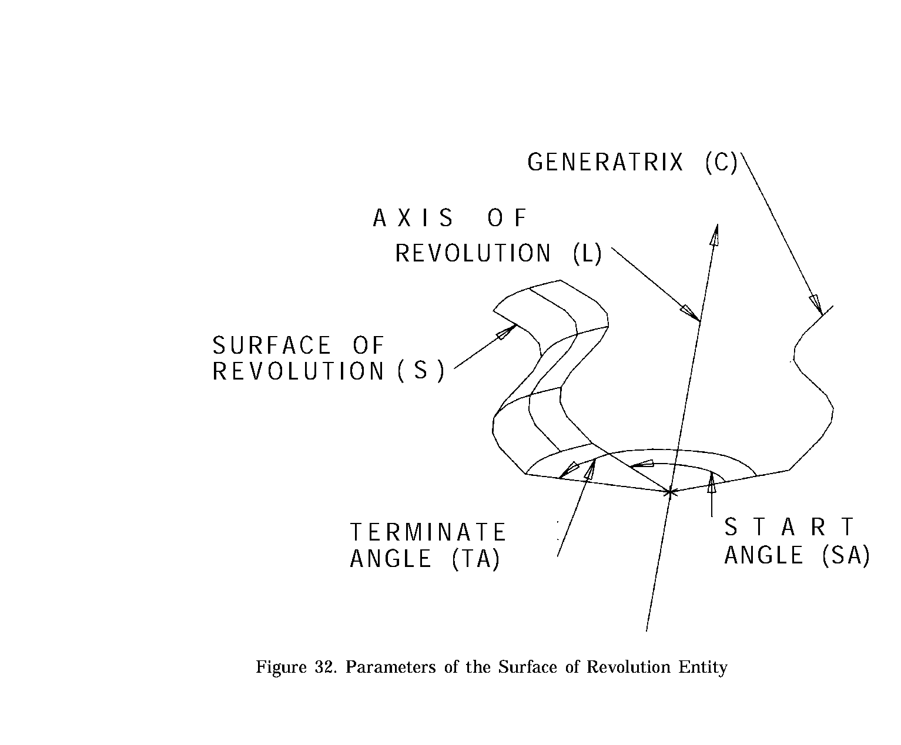

## 4.19 Tabulated Cylinder Entity (Type 122)

A tabulated cylinder is a surface formed by moving a line segment called the generatrix parallel to _ECO630_ itself along a curve called the directrix. This curve may be a line, circular arc, conic arc, parametric spline curve, rational B-spline curve, composite curve, or any parametric curve defined in this Specification (both planar and non-planar). The start point of the generatrix is identical with the start _ECO640_ point of the directrix. An example of the tabulated cylinder is shown in Figure 33.

Caution: different parameterizations of the generating curves will produce different parameterized _ECO630_ surfaces, but the underlying point-set surface will still be the same.

If required, the default parameterization is: _ECO640_ _ECO630_

$$
\begin{aligned}
X(u,v) &= CX(u) + v \cdot (LX - CX(0)) \\
Y(u,v) &= CY(u) + v \cdot (LY - CY(0)) \\
Z(u,v) &= CZ(u) + v \cdot (LZ - CZ(0))
\end{aligned}
$$

where the curve is parameterized by $(CX(t), CY(t), CZ(t))$,

$$
a \le t \le b, \quad 0 \le u \le 1, \quad 0 \le v \le 1,
$$

$$
t = a + u \cdot (b - a),
$$

and CX, CY, CZ represent the X, Y, Z components, respectively, along the directrix curve. $(CX(0), CY(0), CZ(0))$ and $(LX, LY, LZ)$ represent the coordinates of the start and terminate points, respectively, of the generatrix line segment.

**Directory Entry**

| (1) Entity Type Number | (2) Parameter Data | (3) Structure | (4) Line Font Pattern | (5) Level | (6) View | (7) Xformation Matrix | (8) Label Display | (9) Status Number | (10) Sequence Number |
|---|---|---|---|---|---|---|---|---|---|
| 122 | → | `<n.a.>` | #,→ | #,→ | 0,→ | 0,→ | 0,→ | ??????** | D# |

| (11) Entity Type Number | (12) Line Weight | (13) Color Number | (14) Parameter Line Count | (15) Form Number | (16) Reserved | (17) Reserved | (18) Entity Label | (19) Entity Subscript | (20) Sequence Number |
|---|---|---|---|---|---|---|---|---|---|
| 122 | # | #,→ | # |  |  |  |  | # | D#+1 |

**Parameter Data**

| Index | Name | Type | Description |
|---|---|---|---|
| 1 | DE | Pointer | Pointer to the DE of the directrix curve entity |
| 2 | LX | Real | X-coordinate of the terminate point of the generatrix |
| 3 | LY | Real | Y-coordinate of the terminate point of the generatrix |
| 4 | LZ | Real | Z-coordinate of the terminate point of the generatrix |

Additional pointers as required (see Section 2.2.4.5.2).

**Figure 33:** Parameters of the Tabulated Cylinder Entity

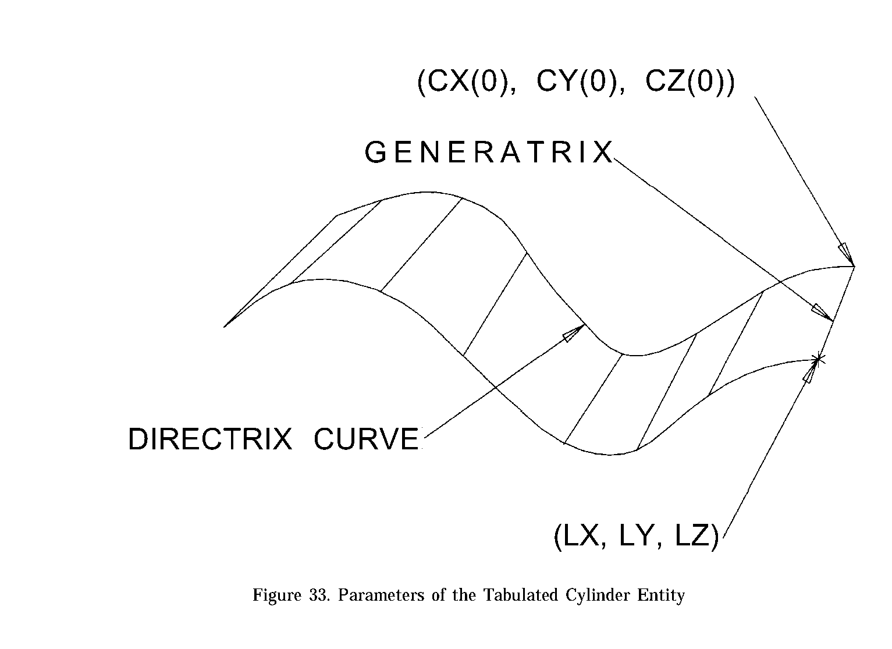

## 4.20 Direction Entity (Type 123)‡

‡The Direction Entity has not been tested. See Section 1.9.

A direction entity is a non-zero vector in Euclidean 3-space that is defined by its three components _ECO630_ (direction ratios) with respect to the coordinate axes. If _x, y, z_ are the direction ratios,

$$
x^2 + y^2 + z^2 > 0.
$$

The Subordinate Entity Switch shall always be set to Physically Dependent. The Transformation Matrix Entity (Type 124) shall not be referenced by this entity.

**Directory Entry** _ECO630_

| (1) Entity Type Number | (2) Parameter Data | (3) Structure | (4) Line Font Pattern | (5) Level | (6) View | (7) Xformation Matrix | (8) Label Display | (9) Status Number | (10) Sequence Number |
|---|---|---|---|---|---|---|---|---|---|
| 123 | → | `<n.a.>` | `<n.a.>` | `<n.a.>` | `<n.a.>` | `<n.a.>` | `<n.a.>` |  | D# |

| (11) Entity Type Number | (12) Line Weight | (13) Color Number | (14) Parameter Line Count | (15) Form Number | (16) Reserved | (17) Reserved | (18) Entity Label | (19) Entity Subscript | (20) Sequence Number |
|---|---|---|---|---|---|---|---|---|---|
| 123 | `<n.a.>` | `<n.a.>` | # |  |  |  |  | # | D#+1 |

**Parameter Data**

| Index | Name | Type | Description |
|---|---|---|---|
| 1 | X | Real | Direction ratio with respect to X axis |
| 2 | Y | Real | Direction ratio with respect to Y axis |
| 3 | Z | Real | Direction ratio with respect to Z axis |

Additional pointers as required (see Section 2.2.4.5.2).

## 4.21 Transformation Matrix Entity (Type 124)

The Transformation Matrix Entity transforms three-row column vectors by means of a matrix multiplication and then a vector addition. The notation for this transformation is:

$$
\begin{bmatrix} R_{11} & R_{12} & R_{13} \\ R_{21} & R_{22} & R_{23} \\ R_{31} & R_{32} & R_{33} \end{bmatrix} \begin{bmatrix} \text{XINPUT} \\ \text{YINPUT} \\ \text{ZINPUT} \end{bmatrix} + \begin{bmatrix} T_1 \\ T_2 \\ T_3 \end{bmatrix} = \begin{bmatrix} \text{XOUTPUT} \\ \text{YOUTPUT} \\ \text{ZOUTPUT} \end{bmatrix}
$$

Here, column [XINPUT, YINPUT, ZINPUT] (i.e., the column vector) is the vector being transformed, and column [XOUTPUT, YOUTPUT, ZOUTPUT] is the column vector resulting from this transformation. $R = [R_{ij}]$ is a 3 row by 3 column matrix of real numbers, and T = column [T1, T2, T3] is a three-row column vector of real numbers. Thus, 12 real numbers are required for a Transformation Matrix Entity. This entity can be considered to be an "operator" entity in that it starts with the input vector, operates on it as described above, and produces the output vector.

Frequently, the input vector lists the coordinate of some point in one coordinate system, and the output vector lists the coordinates of that same point in a second coordinate system. The matrix R and the translation vector T then express a general relationship between the two coordinate systems. By considering special input vectors such as column [1,0,0], column [0,1,0] and column [0, 0 1] and computing the corresponding output results, a geometric appreciation of the spatial relationship between the two coordinate systems can be gained.

For example, for

$$
R = \begin{bmatrix} 0 & 0 & 1 \\ 0 & 1 & 0 \\ -1 & 0 & 0 \end{bmatrix}, \quad T = \begin{bmatrix} 0 \\ 0 \\ 0 \end{bmatrix}
$$

the spatial relationship of the input and output coordinate systems is given in Figure 34.

All coordinate systems are assumed to be orthogonal, Cartesian, and right-handed unless specifically noted otherwise.

Following are three specific areas where the Transformation Matrix Entity is used to transform coordinates between coordinate systems. Each example area illustrates a specific choice of input and output coordinate systems. Other choices of coordinate systems may be appropriate in other application areas.

The usual situation for this type of use of the Transformation Matrix Entity is when the input vector refers to the definition space coordinate system for a certain entity, and the output vector refers to the model space coordinate system (See Section 3.2.2). In this case, the matrix R is referred to as the defining matrix, and the Transformation Matrix Entity defining R and T is pointed to in field seven (transformation matrix field) of the directory entry of the entity (See Section 2.2.4.4.7). In this use of the Transformation Matrix Entity, the matrix R is subject to the restrictions given in Form 0 and Form 1 below.

A second situation is the case when the input vector refers to the model space coordinate system _ECO630_ and the output vector refers to a viewing coordinate system. In this case, the matrix R is referred to as a view matrix, and is subject to the restrictions given in Form 0 below. Note that when a planar entity is viewed at true length (i.e., The viewing plane is parallel to the plane containing the entity.), the rotation matrix pointed to by DE Field 7 of the Planar Entity will be the inverse (is equal to the matrix transpose) of the matrix pointed to by DE Field 7 of the View Entity (See Section 4.134).

A third situation involves finite element modeling applications. Here, it may be the case that an input coordinate system is related to an output coordinate system by a particular R and T, and, in turn, the output coordinate system is then taken as an input coordinate system for a second R and T combination, and so on. These coordinate systems are frequently called local coordinate systems. Model space is frequently called the reference system. For example, the location of a finite element node may be given in one local coordinate system, which may serve as the input coordinate system for a second local coordinate system, which in turn serves as the input coordinate system for the model space coordinate system which is the reference system. Allowable forms of the matrix R for these applications are detailed in Forms 10, 11, and 12 below.

Whenever coordinate systems are related successively to each other as described above, a basic result _ECO630_ is that the combined effect of the individual coordinate system changes can be expressed in terms of a single matrix R and a single translation vector T. For example, if the coordinate system change involving the matrix R2 and the translation vector T2 is to be applied following the coordinate system change involving the matrix R1 and the translation vector T1, then the matrix R and the translation vector T expressing the combined changes are $R = R_2 \times R_1$ and $T = R_2 \times T_1 + T_2$.

Here, $R_2 \times R_1$ denotes matrix multiplication of 3x3 matrices, where multiplication order is important. _ECO630_ The matrix R and the translation vector T are computed similarly whenever more than two coordinate system changes are to be applied successively.

Successive coordinate system changes are specified by allowing a Transformation Matrix Entity to _ECO630_ reference another Transformation Matrix Entity through Field 7 of the directory entry. In the example above, the Transformation Matrix Entity containing R1 and T1 would contain in its directory entry field 7 a pointer to the Transformation Matrix Entity containing R2 and T2. The general rule is that Transformation Matrix Entities applied earlier in a succession will reference Transformation Matrix Entities applied later. Note that the matrix product $R_2 \times R_1$ in the example above does not appear explicitly in the data, but, if needed, can be computed according to the usual rules of matrix multiplication.

A second example of coordinate systems being related successively (concatenated or stacked), in _ECO630_ addition to the finite element example mentioned above, involves one manner of locating into model space a conic arc that is in standard position in definition space. In this case, R1 and T1 move the conic arc from its standard position to an arbitrary location in any plane in definition space satisfying ZT=constant. (Therefore, R133 = 1.0, R131 = R132 = R113 = R123 = 0.0. T1 can be an arbitrary translation vector.) R2 and T2 then position the relocated conic arc into model space. (R2 can be an arbitrary defining matrix and T2 can bean arbitrary translation vector.) Note that for R1 and T1, both the input vector and the output vector refer to the same coordinate system, namely, the definition space for the conic arc.

A 3x3 matrix R is called orthonormal provided its transpose, $R^t$, yields a matrix inverse for R and _ECO630_ its columns, considered as vectors, form an orthonormal collection of unit vectors. As $(R^t)^t = R$, the transpose of an orthonormal matrix is again an orthonormal matrix. The determinant of an orthonormal matrix is equal to either plus one or minus one. In the event R is an orthonormal matrix with determinant equal to positive one, R can be expressed as a rotation about an axis passing through the origin. In this event, R is referred to as a rotation matrix. In the event R is an orthonormal matrix with determinant equal to negative one, R can be expressed as a rotation about an axis passing through the origin followed by a reflection about a plane passing through the origin perpendicular to the axis of rotation.

For the Transformation Matrix Entity, the Form Numbers are: _ECO630_

| Form | Use |
|---|---|
| 0 or 1 | Defining matrix of an entity |
| 10, 11, or 12 | Special matrices representing Node Entity (Type 134) |

**Form 0:** (default) R is an orthonormal matrix with determinant equal to positive one. T is arbitrary. The columns of R, taken in order, form a right-handed triple in the output coordinate system.

**Form 1:** R is an orthonormal matrix with determinant equal to negative one. T is arbitrary. The columns of R, taken in order, form a left-handed triple in the output coordinate system. A defining matrix associated with a View Entity (Type 410) shall not use Form 1.

**Form 10:** This form number conveys special information when used in conjunction with the Node Entity (Type 134) in Finite Element Applications.

Refer to Figure 35(a) for notation. The matrix R and the vector T are used to transform coordinate data from the $(u_1, u_2, u_3)$ coordinate system to the $(x, y, z)$ local system.

The $(u_1, u_2, u_3)$ coordinate system has its origin at an arbitrary fixed point

$$
\begin{bmatrix} \text{XOFFSET} \\ \text{YOFFSET} \\ \text{ZOFFSET} \end{bmatrix}
$$

in the $(x, y, z)$ coordinate system and is assumed to be displaced parallel to that reference coordinate system. Thus,

$$
R = \begin{bmatrix} 1 & 0 & 0 \\ 0 & 1 & 0 \\ 0 & 0 & 1 \end{bmatrix}, \quad T = \begin{bmatrix} \text{XOFFSET} \\ \text{YOFFSET} \\ \text{ZOFFSET} \end{bmatrix}
$$

so that

$$
\begin{bmatrix} 1 & 0 & 0 \\ 0 & 1 & 0 \\ 0 & 0 & 1 \end{bmatrix} \begin{bmatrix} u_1 \\ u_2 \\ u_3 \end{bmatrix} + \begin{bmatrix} \text{XOFFSET} \\ \text{YOFFSET} \\ \text{ZOFFSET} \end{bmatrix} = \begin{bmatrix} \text{XLOCAL} \\ \text{YLOCAL} \\ \text{ZLOCAL} \end{bmatrix}
$$

Note that the orientation of the two coordinate systems can be described by saying that the $(u_1, u_2, u_3)$ coordinate system is the system obtained by imposing orthonormal curvilinear coordinates onto the $(x, y, z)$ space and then constructing unit tangent vectors to the three curvilinear coordinate curves at the given fixed point to serve as basis vectors. In this special case of parallel displacement, the curvilinear coordinates imposed are identical to the existing $(x, y, z)$ coordinates.

**Form 11:** This form number conveys special information when used in conjunction with the Node Entity (Type 134) in Finite Element applications.

Refer to Figure 35(b) for notation. The matrix R and the vector T are used to transform coordinate data from the $(u_1, u_2, u_3)$ (node point) coordinate system to the $(x, y, z)$ (local system) coordinate system.

The $(u_1, u_2, u_3)$ coordinate system has its origin at an arbitrary fixed point

$$
\begin{aligned}
\text{XOFFSET} &= r_0 \cos \theta_0, \quad r_0 \ge 0 \\
\text{YOFFSET} &= r_0 \sin \theta_0, \quad 0 \le \theta_0 \le 360° \\
\text{ZOFFSET} &= z_0
\end{aligned}
$$

in the $(x, y, z)$ coordinate system. (For $r_0 = 0$, take $\theta_0 = 0°$.) The $(u_1, u_2, u_3)$ system is the system obtained by imposing orthonormal curvilinear coordinates onto the $(x, y, z)$ space which are the cylindrical coordinates $(r, \theta, z)$ with

$$
x = r \cos \theta, \quad y = r \sin \theta, \quad z = z,
$$

and then constructing unit tangent vectors to the three curvilinear coordinate curves at the given fixed point to serve as basis vectors.

Thus, the relationship between the $(u_1, u_2, u_3)$ and the $(x, y, z)$ local coordinate system is given by:

$$
\begin{bmatrix} \cos \theta_0 & -\sin \theta_0 & 0 \\ \sin \theta_0 & \cos \theta_0 & 0 \\ 0 & 0 & 1 \end{bmatrix} \begin{bmatrix} u_1 \\ u_2 \\ u_3 \end{bmatrix} + \begin{bmatrix} \text{XOFFSET} \\ \text{YOFFSET} \\ \text{ZOFFSET} \end{bmatrix} = \begin{bmatrix} \text{XLOCAL} \\ \text{YLOCAL} \\ \text{ZLOCAL} \end{bmatrix}
$$

**Form 12:** This form number conveys special information when used in conjunction with the Node Entity (Type 134) in Finite Element applications.

Refer to Figure 35(c) for notation. The matrix R and the vector T are used to transform coordinate data from the $(u_1, u_2, u_3)$ coordinate system to the $(x, y, z)$ local system.

The $(u_1, u_2, u_3)$ coordinate system has its origin at an arbitrary fixed point

$$
\begin{aligned}
\text{XOFFSET} &= r_0 \sin \theta_0 \sin \phi_0, \quad r_0 \ge 0 \\
\text{YOFFSET} &= r_0 \sin \theta_0 \cos \phi_0, \quad 0 \le \theta_0 \le 180° \\
\text{ZOFFSET} &= r_0 \cos \theta_0, \quad 0 \le \phi_0 \le 360°
\end{aligned}
$$

in the $(x, y, z)$ coordinate system. (For $r_0 = 0$ take $\theta_0 = \phi_0 = 0°$; for $\theta_0 = 0°$ or $180°$, take $\phi_0 = 0°$.) The $(u_1, u_2, u_3)$ system is the system obtained by imposing orthonormal curvilinear coordinates onto the $(x, y, z)$ space which are the spherical coordinates $(r, \theta, \phi)$ with

$$
x = r \sin \theta \cos \phi, \quad y = r \sin \theta \sin \phi, \quad z = r \cos \theta,
$$

and then constructing unit tangent vectors to the three curvilinear coordinate curves at the given fixed point to serve as basis vectors.

Thus, the relationship between the $(u_1, u_2, u_3)$ and the $(x, y, z)$ local coordinate systems is given by:

$$
\begin{bmatrix} \sin \theta_0 \cos \phi_0 & \cos \theta_0 \cos \phi_0 & -\sin \phi_0 \\ \sin \theta_0 \sin \phi_0 & \cos \theta_0 \sin \phi_0 & \cos \phi_0 \\ \cos \theta_0 & -\sin \theta_0 & 0 \end{bmatrix} \begin{bmatrix} u_1 \\ u_2 \\ u_3 \end{bmatrix} + \begin{bmatrix} \text{XOFFSET} \\ \text{YOFFSET} \\ \text{ZOFFSET} \end{bmatrix} = \begin{bmatrix} \text{XLOCAL} \\ \text{YLOCAL} \\ \text{ZLOCAL} \end{bmatrix}
$$

See Kaplan [KAPL52] or Hildebrand [HILD76] for a discussion of orthonormal curvilinear coordinate _ECO630_ systems.

**Directory Entry**

| (1) Entity Type Number | (2) Parameter Data | (3) Structure | (4) Line Font Pattern | (5) Level | (6) View | (7) Xformation Matrix | (8) Label Display | (9) Status Number | (10) Sequence Number |
|---|---|---|---|---|---|---|---|---|---|
| 124 | → | `<n.a.>` | `<n.a.>` | `<n.a.>` | `<n.a.>` | → | `<n.a.>` | ****??** | D# |

| (11) Entity Type Number | (12) Line Weight | (13) Color Number | (14) Parameter Line Count | (15) Form Number | (16) Reserved | (17) Reserved | (18) Entity Label | (19) Entity Subscript | (20) Sequence Number |
|---|---|---|---|---|---|---|---|---|---|
| 124 | `<n.a.>` | `<n.a.>` | # | 0, 1, 10, 11, 12 |  |  |  | # | D#+1 |

**Parameter Data** _ECO630_

| Index | Name | Type | Description |
|---|---|---|---|
| 1  | R11 | Real | Top Row |
| 2  | R12 | Real |  |
| 3  | R13 | Real |  |
| 4  | T1  | Real |  |
| 5  | R21 | Real | Second Row |
| 6  | R22 | Real |  |
| 7  | R23 | Real |  |
| 8  | T2  | Real |  |
| 9  | R31 | Real | Third Row |
| 10 | R32 | Real |  |
| 11 | R33 | Real |  |
| 12 | T3  | Real |  |

Additional pointers as required (see Section 2.2.4.5.2).

**Figure 34:** Example of the Transformation Matrix Coordinate Systems

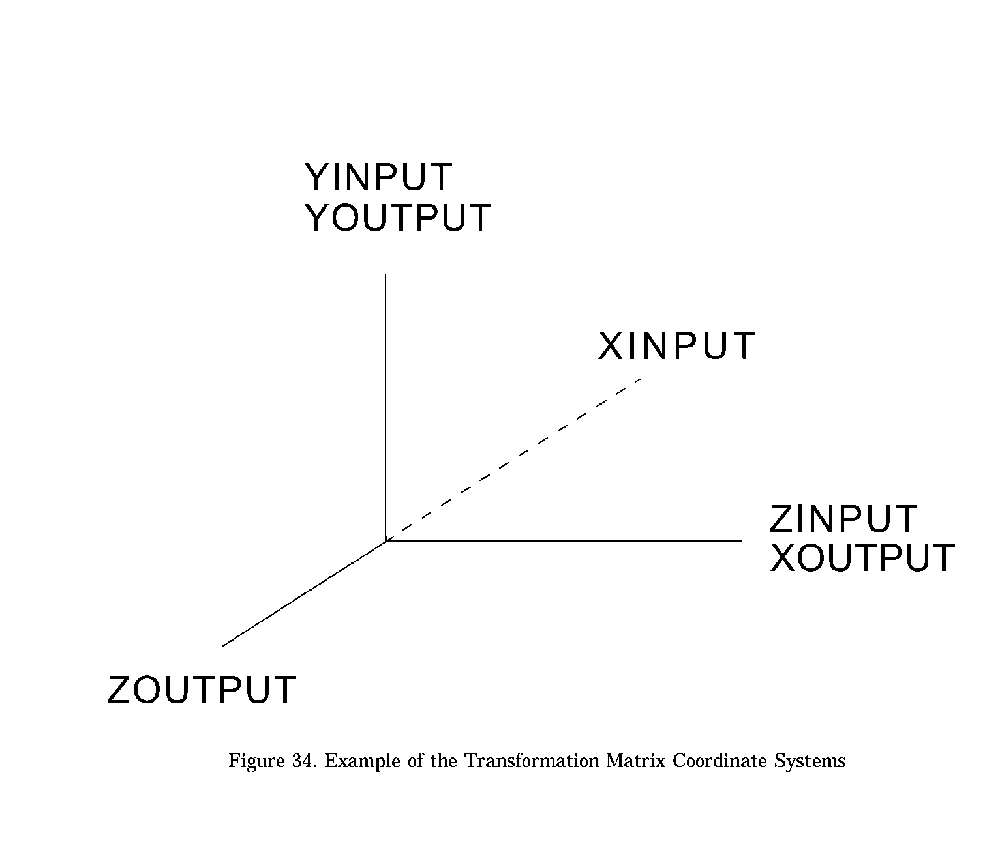

**Figure 35:** Notation for FEM-specific Forms of the Transformation Matrix Entity

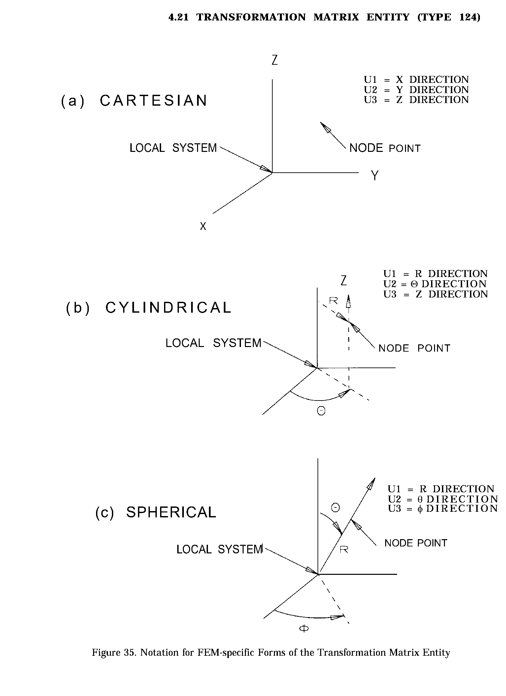

## 4.22 Flash Entity (Type 125)

A Flash Entity is a point in the ZT=0 plane that defines the location of a specific instance of a _ECO630_ particular closed area. That closed area can be defined in one of two ways. In the case of Form zero, it can be an arbitrary closed area defined by any entity capable of defining a closed area. The points of this entity must all lie in the ZT=0 plane. For Forms one through four, the closed area can be a member of a pre-defined set of flash shapes. Refer to Figure 36 for the definition of these shapes.

In the case of Forms one through four, Parameters 3 through 5 of the Flash Entity control the final _ECO630_ size of the flash. Figure 36 indicates the definition and usage of those parameters for the specific flash forms. Parameters 3 through 5 are ignored for Form 0.

For the Flash Entity, the Form Numbers are as follows: _ECO630_

| Form | Meaning |
|---|---|
| 0 | Defined by referenced entity |
| 1 | Circular |
| 2 | Rectangle |
| 3 | Donut |
| 4 | Canoe |

**Directory Entry**

| (1) Entity Type Number | (2) Parameter Data | (3) Structure | (4) Line Font Pattern | (5) Level | (6) View | (7) Xformation Matrix | (8) Label Display | (9) Status Number | (10) Sequence Number |
|---|---|---|---|---|---|---|---|---|---|
| 125 | → | `<n.a.>` | 1 | #,→ | 0,→ | 0,→ | 0,→ | ??????00 | D# |

| (11) Entity Type Number | (12) Line Weight | (13) Color Number | (14) Parameter Line Count | (15) Form Number | (16) Reserved | (17) Reserved | (18) Entity Label | (19) Entity Subscript | (20) Sequence Number |
|---|---|---|---|---|---|---|---|---|---|
| 125 | # | #,→ | # | 0-4 |  |  |  | # | D#+1 |

**Parameter Data** _ECO630_

| Index | Name | Type | Description |
|---|---|---|---|
| 1 | X | Real | X reference of flash |
| 2 | Y | Real | Y reference of flash |
| 3 | DIM1 | Real | First flash sizing parameter |
| 4 | DIM2 | Real | Second flash sizing parameter |
| 5 | ROT | Real | Rotation of flash about reference point in radians |
| 6 | DE | Pointer | Pointer to the DE of the referenced entity or zero |

Additional pointers as required (see Section 2.2.4.5.2).

**Figure 36:** Definition of Shapes for the Flash Entity (continues on next page)

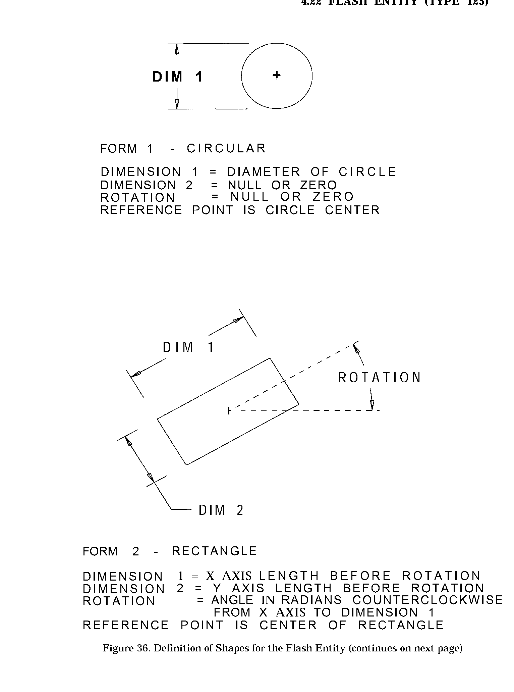

**Figure 36:** Definition of Shapes for the Flash Entity (continued)

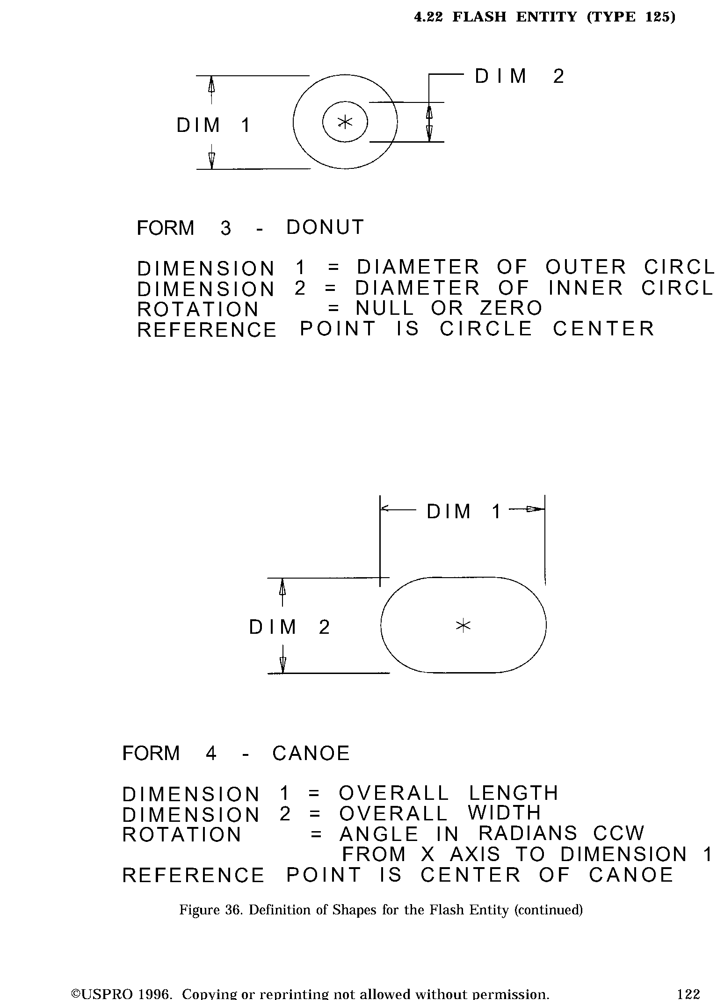

## 4.23 Rational B-Spline Curve Entity (Type 126)

The rational B-spline curve may represent analytic curves of general interest. This information is _ECO630_ important to both the sending and receiving systems. The Directory Entry Form Number Parameter is provided to communicate this information. For a brief description and a precise definition of rational B-spline curves, see Appendix B. An example of the Rational B-spline Curve Entity is shown in Figure 37.

If the rational B-spline curve represents a preferred curve type, the form number corresponds to the _ECO630_ most preferred type. The preference order is from 1 through 5, followed by 0 For example, if the curve is a circle or circular arc, the form number shall be set to 2. If the curve is an ellipse with unequal major and minor axis lengths, the form number shall be set to 3. If the curve is not one of the preferred types, the form number shall be set to 0.

If the curve lies entirely within a unique plane, the planar flag (PROP1) shall be set to 1; otherwise it shall be set to 0 If it is set to 1, the plane normal (Parameters 14+A+4*K through 16+A+4*K) shall contain a unit vector normal to the plane containing the curve. These fields shall exist but are ignored if the curve is non-planar.

If the beginning and ending points on the curve, as defined by evaluating the curve at the starting _ECO630_ and ending parameter values (i.e., V(0) and V(l)), are coincident, the curve is closed and PROP2 shall be set to 1. If they are not coincident, PROP2 shall be set to 0

If the curve is rational (does not have all weights equal), PROP3 shall be set to 0 If all weights are _ECO630_ equal to each other, the curve is polynomial and PROP3 shall be set to 1. The curve is polynomial since in this case all weights cancel and the denominator reduces to one. (See Appendix B.) The weights shall be positive real numbers.

If the curve is periodic with respect to its parametric variable, PROP4 shall be set to 1; otherwise, _ECO630_ PROP4 shall be set to 0 The periodic flag is to be interpreted as purely informational; the curves which are flagged to be periodic are to be evaluated exactly the same as in the non-periodic case.

Note that the control points are in the definition space of the curve.

For the Rational B-Spline Curve Entity, the Form Numbers are as follows: _ECO630_

| Form | Meaning |
|---|---|
| 0 | Form of curve is determined from the rational B-spline parameters |
| 1 | Line |
| 2 | Circular arc |
| 3 | Elliptical arc |
| 4 | Parabolic arc |
| 5 | Hyperbolic arc |

**Directory Entry**

| (1) Entity Type Number | (2) Parameter Data | (3) Structure | (4) Line Font Pattern | (5) Level | (6) View | (7) Xformation Matrix | (8) Label Display | (9) Status Number | (10) Sequence Number |
|---|---|---|---|---|---|---|---|---|---|
| 126 | → | `<n.a.>` | #,→ | #,→ | 0,→ | 0,→ | 0,→ | ??????** | D# |

| (11) Entity Type Number | (12) Line Weight | (13) Color Number | (14) Parameter Line Count | (15) Form Number | (16) Reserved | (17) Reserved | (18) Entity Label | (19) Entity Subscript | (20) Sequence Number |
|---|---|---|---|---|---|---|---|---|---|
| 126 | # | #,→ | # | 0-5 |  |  |  | # | D#+1 |

**Parameter Data** _ECO630 ECO650_

Let $N = 1 + K - M$ and $A = N + 2 \cdot M$.

| Index | Name | Type | Description |
|---|---|---|---|
| 1 | K | Integer | Upper index of sum. See Appendix B |
| 2 | M | Integer | Degree of basis functions |
| 3 | PROP1 | Integer | 0 = nonplanar, 1 = planar |
| 4 | PROP2 | Integer | 0 = open curve, 1 = closed curve |
| 5 | PROP3 | Integer | 0 = rational, 1 = polynomial |
| 6 | PROP4 | Integer | 0 = nonperiodic, 1 = periodic |
| 7 | T(-M) | Real | First value of knot sequence |
| ... | ... | ... | ... |
| 7+A | T(N+M) | Real | Last value of knot sequence |
| 8+A | W(0) | Real | First weight |
| ... | ... | ... | ... |
| 8+A+K | W(K) | Real | Last weight |
| 9+A+K | X(0) | Real | First control point |
| 10+A+K | Y(0) | Real |  |
| 11+A+K | Z(0) | Real |  |
| ... | ... | ... | ... |
| 9+A+4*K | X(K) | Real | Last control point |
| 10+A+4*K | Y(K) | Real |  |
| 11+A+4*K | Z(K) | Real |  |
| 12+A+4*K | V(0) | Real | Starting parameter value |
| 13+A+4*K | V(1) | Real | Ending parameter value |
| 14+A+4*K | XNORM | Real | Unit normal (if curve is planar) |
| 15+A+4*K | YNORM | Real |  |
| 16+A+4*K | ZNORM | Real |  |

Additional pointers as required (see Section 2.2.4.5.2).

**Figure 37:** F126X.IGS Sample of Rational B-Spline Curve Entity

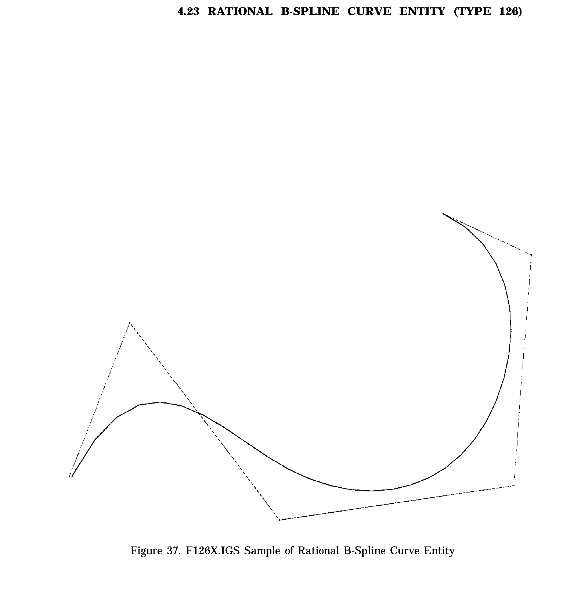

## 4.24 Rational B-Spline Surface Entity (Type 128)

The rational B-spline surface represents various analytical surfaces of general interest. This in- _ECO630_ formation is important to both the generating and receiving systems. The Directory Entry Form Number Parameter is provided to communicate such information. For a brief description and a precise definition of rational B-spline surfaces, see Appendix B.

If the rational B-spline surface represents a preferred surface type, the form number corresponds to _ECO630_ the most preferred type. The preference order is from 1 through 9 followed by 0. For example, if the surface is a right circular cylinder, the form number shall be set to 2. If the surface is a surface of revolution and also a torus, the form number shall be set to 5. If the surface is not one of the preferred types, the form number shall be set to 0.

If, for each fixed value of the second parametric variable the resulting curves which are functions of _ECO630_ the first parametric variable are closed, PROP1 shall be set to 1; otherwise, PROP 1 shall be set to 0. Similarly, if for each fixed value of the first parametric variable the resulting curves which are functions of the second parametric variable are closed, PROP2 shall be set to 1; otherwise, PROP2 shall be set to 0. Mathematically, this is described as follows:

PROP1 shall be set to 1 if, and only if, for each value of $V(0) \leq V \leq V(1)$, the surface at $(U(0), V)$ _ECO630_ evaluates to the same point as it does for $(U(1), V)$. Correspondingly, PROP2 shall be set to 1 if, and only if, for each value of $U(0) \leq U \leq U(1)$, the surface at $(U, V(0))$ evaluates to the same point as it does for $(U, V(1))$.

If the surface is rational (does not have all weights equal), PROP3 shall be set to 0. If all weights are _ECO630_ equal to each other, the surface is polynomial and PROP3 shall be set to 1. The surface is polynomial since in this case all weights cancel and the denominator reduces to one (see Appendix B). The weights shall be positive real numbers.

If the surface is periodic with respect to the first parametric variable, PROP4 shall be set to 1; _ECO630_ otherwise, PROP4 shall be set to 0. If the surface is periodic with respect to the second parametric variable, PROP5 shall be set to 1; otherwise, PROP5 shall be set to 0 The periodic flags are to be interpreted as purely informational. The surfaces which are flagged to be periodic are to be evaluated exactly the same as in the non-periodic case.

Note that the control points are in the definition space of the surface.

For the Rational B-Spline Surface Entity, the Form Numbers are as follows: _ECO630_

| Form | Meaning |
|---|---|
| 0 | Form of surface is determined from the rational B-spline parameters |
| 1 | Plane |
| 2 | Right circular cylinder |
| 3 | Cone |
| 4 | Sphere |
| 5 | Torus |
| 6 | Surface of revolution |
| 7 | Tabulated cylinder |
| 8 | Ruled surface |
| 9 | General quadric surface |

**Directory Entry**

| (1) Entity Type Number | (2) Parameter Data | (3) Structure | (4) Line Font Pattern | (5) Level | (6) View | (7) Xformation Matrix | (8) Label Display | (9) Status Number | (10) Sequence Number |
|---|---|---|---|---|---|---|---|---|---|
| 128 | → | `<n.a.>` | #,→ | #,→ | 0,→ | 0,→ | 0,→ | ??????** | D# |

| (11) Entity Type Number | (12) Line Weight | (13) Color Number | (14) Parameter Line Count | (15) Form Number | (16) Reserved | (17) Reserved | (18) Entity Label | (19) Entity Subscript | (20) Sequence Number |
|---|---|---|---|---|---|---|---|---|---|
| 128 | # | #,→ | # | 0-9 |  |  |  | # | D#+1 |

**Parameter Data** _ECO630_

Let $N1 = 1 + K1 - M1$, $N2 = 1 + K2 - M2$, $A = N1 + 2 \cdot M1$, $B = N2 + 2 \cdot M2$, and $C = (1 + K1) \cdot (1 + K2)$.

| Index | Name | Type | Description |
|---|---|---|---|
| 1 | K1 | Integer | Upper index of first sum. See Appendix B |
| 2 | K2 | Integer | Upper index of second sum. See Appendix B |
| 3 | M1 | Integer | Degree of first set of basis functions |
| 4 | M2 | Integer | Degree of second set of basis functions |
| 5 | PROP1 | Integer | 1 = Closed in first parametric variable direction; 0 = Not closed |
| 6 | PROP2 | Integer | 1 = Closed in second parametric variable direction; 0 = Not closed |
| 7 | PROP3 | Integer | 0 = Rational; 1 = Polynomial |
| 8 | PROP4 | Integer | 0 = Non-periodic in first parametric variable direction; 1 = Periodic in first parametric variable direction |
| 9 | PROP5 | Integer | 0 = Non-periodic in second parametric variable direction; 1 = Periodic in second parametric variable direction |
| 10 | S(-M1) | Real | First value of first knot sequence |
| ... | ... | Real |  |
| 10+A | S(N1+M1) | Real | Last value of first knot sequence |
| 11+A | T(-M2) | Real | First value of second knot sequence |
| ... | ... | Real |  |
| 11+A+B | T(N2+M2) | Real | Last value of second knot sequence |
| 12+A+B | W(0,0) | Real | First weight |
| 13+A+B | W(1,0) | Real |  |
| ... | ... | Real |  |
| 11+A+B+C | W(K1,K2) | Real | Last weight |
| 12+A+B+C | X(0,0) | Real | First control point |
| 13+A+B+C | Y(0,0) | Real |  |
| 14+A+B+C | Z(0,0) | Real |  |
| 15+A+B+C | X(1,0) | Real |  |
| 16+A+B+C | Y(1,0) | Real |  |
| 17+A+B+C | Z(1,0) | Real |  |
| ... | ... | Real |  |
| 9+A+B+4*C | X(K1,K2) | Real | Last control point |
| 10+A+B+4*C | Y(K1,K2) | Real |  |
| 11+A+B+4*C | Z(K1,K2) | Real |  |
| 12+A+B+4*C | U(0) | Real | Starting value for first parametric direction |
| 13+A+B+4*C | U(1) | Real | Ending value for first parametric direction |
| 14+A+B+4*C | V(0) | Real | Starting value for second parametric direction |
| 15+A+B+4*C | V(1) | Real | Ending value for second parametric direction |

Additional pointers as required (see Section 2.2.4.5.2).

## 4.25 Offset Curve Entity (Type 130)

The Offset Curve Entity defines the data necessary to determine the curve offset from a given base _ECO630_ curve $C$. This entity points to the base curve to be offset and contains the offset distance and additional pertinent information. Except as stated in the following paragraph, no restriction is placed on the entity types of curves; any parametric curve may be offset.

It is the intent of this Specification to limit the applicability of offsets to curves which are planar _ECO630_ and are slope-continuous. Let $C$ denote a curve in definition space which is defined parametrically by $r = r(t)$, let $T(t)$ denote the unit tangent at $r(t)$ (See [FAUX79]), and let $V$ be a unit vector normal to the plane which contains $C$. The offset curve lies in the plane which contains the base curve and is defined as follows:

$$O(t) = r(t) + f(s) \cdot (V \times T(t)); \quad TT1 \leq t \leq TT2$$

**FLAG = 1:** The offset distance is uniform; $f(s) = D1$.

**FLAG = 2:** The offset distance varies linearly;

$$f(s) = D1 + (D2 - D1) \cdot (s - TD1)/(TD2 - TD1)$$

with

**PTYPE = 1**

$s$ = arc length along $r$ from $r(TT1)$ to $r(t)$,

$D1$ = the offset at arc length value $TD1$;

$D2$ = the offset at arc length value $TD2$.

**PTYPE = 2**

$s = t$,

$D1$ = the offset at parametric value $TD1$;

$D2$ = the offset at parametric value $TD2$.

**FLAG = 3:** The offset distance is defined by a function; $f(s)$ is the NDIM-th coordinate function of the curve referenced by DE2, with

**PTYPE = 1:** $s$ = arc length along $r$ from $r(TT1)$ to $r(t)$;

**PTYPE = 2:** $s = t$

Note that $TT1$ and $TT2$ shall be chosen to be in the domain of the base curve $r(t)$. _ECO630_

**Directory Entry**

| (1) Entity Type Number | (2) Parameter Data | (3) Structure | (4) Line Font Pattern | (5) Level | (6) View | (7) Xformation Matrix | (8) Label Display | (9) Status Number | (10) Sequence Number |
|---|---|---|---|---|---|---|---|---|---|
| 130 | → | `<n.a.>` | #,→ | #,→ | 0,→ | 0,→ | 0,→ | ??????** | D# |

| (11) Entity Type Number | (12) Line Weight | (13) Color Number | (14) Parameter Line Count | (15) Form Number | (16) Reserved | (17) Reserved | (18) Entity Label | (19) Entity Subscript | (20) Sequence Number |
|---|---|---|---|---|---|---|---|---|---|
| 130 | # | #,→ | # | 0 |  |  |  | # | D#+1 |

**Parameter Data**

| Index | Name | Type | Description |
|---|---|---|---|
| 1 | DE1 | Pointer | Pointer to the DE of the curve entity to be offset. |
| 2 | FLAG | Integer | Offset distance flag:<br>1 = Single value offset, uniform distance<br>2 = Offset distance varying linearly<br>3 = Offset distance as a specified function. |
| 3 | DE2 | Pointer or 0 | Pointer to the DE of the curve entity, one coordinate of which describes the offset as a function of its parameter. 0 unless FLAG = 3 |
| 4 | NDIM | Integer | Pointer of particular coordinate of DE2 which describes offset as a function of its parameter. (only used if FLAG = 3) |
| 5 | PTYPE | Integer | Tapered offset type flag:<br>1 = Function of arc length<br>2 = Function of parameter<br>(only used if FLAG=2 or 3) |
| 6 | D1 | Real | First offset distance. (only used if FLAG=1 or 2) |
| 7 | TD1 | Real | Arc length or parameter value, depending on PTYPE, of first offset distance. (only used if FLAG=2) |
| 8 | D2 | Real | Second offset distance. |
| 9 | TD2 | Real | Arc length or parameter value, depending on PTYPE, of second offset distance. (only used if FLAG=2) |
| 10 | VX | Real | X-component of unit vector normal to plane containing curve to be offset. |
| 11 | VY | Real | Y-component of unit vector normal to plane containing curve to be offset. |
| 12 | VZ | Real | Z-component of unit vector normal to plane containing curve to be offset. |
| 13 | TT1 | Real | Offset curve starting parameter value. |
| 14 | TT2 | Real | Offset curve ending parameter value. |

Additional pointers as required (see Section 2.2.4.5.2). _ECO630_

Parameter data not required for a particular case shall be given zero values. For example, if the value of Parameter 2 is not 3, Parameters 3 and 4 shall be given zero values.

## 4.26 Connect Point Entity (Type 132)

A Connect Point Entity defines a point of connection for zero, one, or more entities. These entities _ECO630_ include those required in piping diagrams, electrical and electronic schematics, and physical designs (e.g., printed wiring boards). The Connect Point Entity is referenced from either the Composite Curve (Type 102), Network Subfigure Definition (Type 320), Network Subfigure Instance (Type 420), or the Flow Associativity Instance (Type 402, Form 18). It may also appear in a file without being referenced by other entities. The connect point may be displayed by the receiving system using default display parameters or by symbols. See Section 3.6.3.

**TF.** The Type Flag (TF) is an enumerated list that specifies a particular type of connection:

| TF Value | Meaning |
|---|---|
| 0 | Not Specified (default) |
| 1 | Nonspecific logical point of connection |
| 2 | Nonspecific physical point of connection |
| 101 | Logical component pin |
| 102 | Logical port connector |
| 103 | Logical offpage connector |
| 104 | Logical global signal connector |
| 201 | Physical PWA surface mount pin |
| 202 | Physical PWA blind pin |
| 203 | Physical PWA thru-pin |
| 5001-9999 | Implementor defined |

**FC.** The Function Code (FC) is an enumerated list that specifies a particular function for the connection:

| FC Value | Meaning | FC Value | Meaning |
|---|---|---|---|
| 0 | Unspecified (default) | 30 | Reset |
| 1 | Input | 31 | Blanking |
| 2 | Output | 32 | Test |
| 3 | Input and Output | 33 | Address |
| 4 | Power (VCC) | 34 | Control |
| 5 | Ground | 35 | Carry |
| 6 | Anode | 36 | Sum |
| 7 | Cathode | 37 | Write |
| 8 | Emitter | 38 | Sense |
| 9 | Base | 39 | V+ |
| 10 | Collector | 40 | Read |
| 11 | Source | 41 | Load |
| 12 | Gate | 42 | SYNC |
| 13 | Drain | 43 | Tri-State Output |
| 14 | Case | 44 | VDD |
| 15 | Shield | 45 | V- |
| 16 | Inverting Input | 46 | VEE |
| 17 | Regulated Input | 47 | Reference |
| 18 | Booster Input | 48 | Reference Bypass |
| 19 | Unregulated Input | 49 | Reference Supply |
| 20 | Inverting Output | 98 | Deferral |
| 21 | Regulated Output | 99 | No Connection |
| 22 | Booster Output | 5001-9999 | Implementor defined |
| 23 | Unregulated Output |  |  |
| 24 | Sink |  |  |
| 25 | Strobe |  |  |
| 26 | Enable |  |  |
| 27 | Data |  |  |
| 28 | Clock |  |  |
| 29 | Set |  |  |

**Directory Entry**

| (1) Entity Type Number | (2) Parameter Data | (3) Structure | (4) Line Font Pattern | (5) Level | (6) View | (7) Xformation Matrix | (8) Label Display | (9) Status Number | (10) Sequence Number |
|---|---|---|---|---|---|---|---|---|---|
| 132 | → | `<n.a.>` | #,→ | #,→ | 0,→ | 0,→ | 0,→ | ????04?? | D# |

| (11) Entity Type Number | (12) Line Weight | (13) Color Number | (14) Parameter Line Count | (15) Form Number | (16) Reserved | (17) Reserved | (18) Entity Label | (19) Entity Subscript | (20) Sequence Number |
|---|---|---|---|---|---|---|---|---|---|
| 132 | # | #,→ | # | 0 |  |  |  | # | D#+1 |

**Note:** If PD Index 4 (Pointer to Display Geometry) is 0 or defaulted, Line Font Pattern, Line Weight, and Hierarchy are ignored.

**Parameter Data** _ECO630_

| Index | Name | Type | Description |
|---|---|---|---|
| 1 | X | Real | X coordinate of the connection point |
| 2 | Y | Real | Y coordinate of the connection point |
| 3 | Z | Real | Z coordinate of the connection point |
| 4 | PTR | Pointer | Pointer to the DE of the display symbol geometry entity, or null. If null, no display symbol is specified. |
| 5 | TF | Integer | Type flag |
| 6 | FF | Integer | Function Flag:<br>0 = not specified<br>1 = electrical signal<br>2 = fluid flow path |
| 7 | CID | String | Connect Point Function Identifier (e.g., Pin Number or Nozzle Label) |
| 8 | PTTCID | Pointer | Pointer to the DE of the Text Display Template Entity for CID, or null. If null, no Text Display Template is specified. |
| 9 | CFN | String | Connection Point Function Name |
| 10 | PTTCFN | Pointer | Pointer to the DE of the Text Display Template Entity for CFN, or null. If null, no Text Display Template is specified. |
| 11 | CPID | Integer | Unique Connect Point Identifier |
| 12 | FC | Integer | Connect Point Function Code |
| 13 | SF | Integer | Swap Flag:<br>0 = Connect point may be swapped (default)<br>1 = Connect point may not be swapped |
| 14 | PSFI | Pointer | Pointer to the DE of the "owner" Network Subfigure Instance Entity, Network Subfigure Definition Entity, or zero. |

Additional pointers as required (see Section 2.2.4.5.2).

## 4.27 Node Entity (Type 134)

The Node Entity is a geometric point used in the definition of a finite element. Directory Entry field 7 points to a labeled definition coordinate system Transformation Matrix. The form number of the Transformation Matrix indicates the definition coordinate system type. Coordinate angles for the cylindrical and spherical coordinate systems are specified in degrees.

Every node has an associated nodal displacement coordinate system. This is Form 10, 11, or 12 _ECO630_ of the Transformation Matrix Entity, which locates translational and rotational directions for load, restraint, and displacement results. Again, the form number of the Transformation Matrix indicates the coordinate system type.

The origin of the nodal displacement coordinate system is always the location of the node. However, the orientation of the nodal displacement axes depends on the location of the node and the type of displacement coordinate system being referenced. Cartesian (rectangular), cylindrical, and spherical are the three possible types. Figure 38 illustrates the definition of a node in the three coordinate systems.

**Figure 38:** Nodal Displacement Coordinate Systems

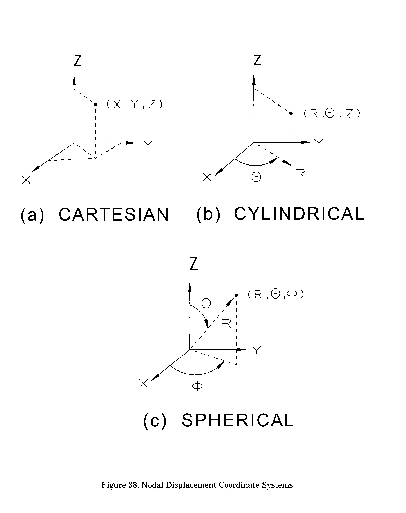

If the displacement coordinate system is Cartesian, then the nodal displacement axes are parallel to the respective referenced coordinate system. This is illustrated in Figure 38(a) Cartesian.

For the cylindrical type displacement coordinate system, the orientation of the nodal displacement _ECO630_ axes depends on the coordinate value of the node as defined in the referenced displacement coordinate system. The nodal displacement axes are respectively in the radial, tangential, and axial directions as illustrated in Figure 38(b) Cylindrical.

Finally, for spherical, the orientation of the nodal displacement axes depend on both the θ and φ coordinates of the node as defined in the referenced displacement coordinate system. The nodal displacement axes are respectively in the radial, meridional, and azimuthal directions as indicated in Figure 38(c) Spherical.

If a node lies on the polar axis of either the cylindrical or spherical coordinate system, the nodal _ECO630_ displacement axes are defined parallel to the referenced displacement coordinate system axes. For a cylindrical system, the first axis is the θ = 0 axis and the third axis is the $z$ axis. For a spherical system, the first axis is the φ = 0 axis while the third axis is the θ = 0 axis. The remaining axis of both systems is defined by the appropriate cross product of the previously defined axes.

**Directory Entry**

| (1) Entity Type Number | (2) Parameter Data | (3) Structure | (4) Line Font Pattern | (5) Level | (6) View | (7) Xformation Matrix | (8) Label Display | (9) Status Number | (10) Sequence Number |
|---|---|---|---|---|---|---|---|---|---|
| 134 | → | `<n.a.>` | `<n.a.>` | `<n.a.>` | `<n.a.>` | → | `<n.a.>` | ????04** | D# |

| (11) Entity Type Number | (12) Line Weight | (13) Color Number | (14) Parameter Line Count | (15) Form Number | (16) Reserved | (17) Reserved | (18) Entity Label | (19) Entity Subscript | (20) Sequence Number |
|---|---|---|---|---|---|---|---|---|---|
| 134 | `<n.a.>` | #,→ | # |  |  |  |  | # | D#+1 |

**Note:** The Entity Subscript shall contain the Node Number. The Entity Label optionally may contain the Node Label.

**Parameter Data**

| Index | Name | Type | Description |
|---|---|---|---|
| 1 | X/R/R | Real | First nodal coordinate |
| 2 | Y/θ/θ | Real | Second nodal coordinate |
| 3 | Z/Z/φ | Real | Third nodal coordinate |
| 4 | NDCSP | Pointer | Pointer to the DE of the Transformation Matrix Entity Form 10, 11, or 12 which defines the Nodal Displacement Coordinate System Entity. Default (zero) is Global Cartesian Coordinate System. |

Additional pointers as required (see Section 2.2.4.5.2).

## 4.28 Finite Element Entity (Type 136)

_ECO630_

A finite element is defined by an element topology (i. e., node connectivity), along with physical and material properties. Table 6 summarizes the available elements. Table 7 and Figure 39 through 45 illustrate the node connectivity for each element

In Table 6 the element name (ETYP) is an English abbreviation or acronym describing the element. The element topology type (ITOP) is an integer number which shall appear as the first parameter of the parameter data. ITOP values greater than or equal 5001 are considered to be implementor-defined. The order is an integer identifying the order of an edge as follows:

| Value | Order of Edge |
|---|---|
| 0 | Not applicable |
| 1 | Linear |
| 2 | Parabolic |
| 3 | Cubic |

The number of nodes (N) from Table 6 shall appear as the second parameter of the finite element parameter data. A missing node in the connectivity sequence shall have its corresponding pointer value set equal to zero.

**Directory Entry**

| (1) Entity Type Number | (2) Parameter Data | (3) Structure | (4) Line Font Pattern | (5) Level | (6) View | (7) Xformation Matrix | (8) Label Display | (9) Status Number | (10) Sequence Number |
|---|---|---|---|---|---|---|---|---|---|
| 136 | → | `<n.a.>` | #,→ | `<n.a.>` | `<n.a.>` | `<n.a.>` | 0,→ | ******** | D# |

| (11) Entity Type Number | (12) Line Weight | (13) Color Number | (14) Parameter Line Count | (15) Form Number | (16) Reserved | (17) Reserved | (18) Entity Label | (19) Entity Subscript | (20) Sequence Number |
|---|---|---|---|---|---|---|---|---|---|
| 136 | `<n.a.>` | #,→ | # | 0 |  |  |  | # | D#+1 |

**Note:** The Entity Subscript shall contain the Element Number. The Entity Label optionally may contain the Element Label.

**Parameter Data** _ECO650_

| Index | Name | Type | Description |
|---|---|---|---|
| 1 | ITOP | Integer | Topology type |
| 2 | N | Integer | Number of nodes defining element (See Section 4.27). |
| 3 | DE(1) | Pointer | Pointer to the DE of the first node defining element entity (See Section 4.27). |
| ... | ... | ... |  |
| 2+N | DE(N) | Pointer | Pointer to the DE of the last node defining element entity |
| 3+N | ETYP | String | Element type name |

Additional pointers as required (see Section 2.2.4.5.2).

**Table 6.** Finite Element Topology Set

| Element Name (ETYP) | Element Topology Type (ITOP) | Order | Number of Nodes (N) | Number of Edges | Number of Faces |
|---|---|---|---|---|---|
| BEAM | 1 | 1 | 2 | 1 | 0 |
| LTRIA | 2 | 1 | 3 | 3 | 1 |
| PTRIA | 3 | 2 | 6 | 3 | 1 |
| CTRIA | 4 | 3 | 9 | 3 | 1 |
| LQUAD | 5 | 1 | 4 | 4 | 1 |
| PQUAD | 6 | 2 | 8 | 4 | 1 |
| CQUAD | 7 | 3 | 12 | 4 | 1 |
| PTSW | 8 | 2 | 12 | 9 | 5 |
| CTSW | 9 | 3 | 18 | 9 | 5 |
| PTS | 10 | 2 | 16 | 12 | 6 |
| CTS | 11 | 3 | 24 | 12 | 6 |
| LSOT | 12 | 1 | 4 | 6 | 4 |
| PSOT | 13 | 2 | 10 | 6 | 4 |
| LSOW | 14 | 1 | 6 | 9 | 5 |
| PSOW | 15 | 2 | 15 | 9 | 5 |
| CSOW | 16 | 3 | 24 | 9 | 5 |
| LSO | 17 | 1 | 8 | 12 | 6 |
| PSO | 18 | 2 | 20 | 12 | 6 |
| CSO | 19 | 3 | 32 | 12 | 6 |
| ALLIN | 20 | 1 | 2 | 1 | 0 |
| APLIN | 21 | 2 | 3 | 1 | 0 |
| ACLIN | 22 | 3 | 4 | 1 | 0 |
| ALTRIA | 23 | 1 | 3 | 3 | 0 |
| APTRIA | 24 | 2 | 6 | 3 | 0 |
| ALQUAD | 25 | 1 | 4 | 4 | 0 |
| APQUAD | 26 | 2 | 8 | 4 | 0 |
| SPR | 27 | 0 | 2 | 0 | 0 |
| GSPR | 28 | 0 | 1 | 0 | 0 |
| DAMP | 29 | 0 | 2 | 0 | 0 |
| GDAMP | 30 | 0 | 1 | 0 | 0 |
| MASS | 31 | 0 | 1 | 0 | 0 |
| RBDY | 32 | 0 | 2 | 0 | 0 |
| TBEAM | 33 | 1 | 3 | 1 | 0 |
| OMASS‡ | 34 | 0 | 2 | 0 | 0 |
| OFBEAM‡ | 35 | 1 | 4 | 1 | 0 |
| PBEAM‡ | 36 | 2 | 3 | 1 | 0 |
| CBEAM‡ | 37 | 2 | 3 | 1 | 0 |
| CPSOW‡ | 38 | 3 | 21 | 9 | 5 |

Note: Elements 34-38 are untested.

**Table 7.** Finite Element Topology

| Element Type | Element Name | Edges | Faces |
|---|---|---|---|
| 1. | BEAM | E1=1,2 |  |
| 2. | LTRIA<br>Linear Triangle | E1=1,2<br>E2=2,3<br>E3=3,1 | F1=1,2,3 |
| 3. | PTRIA<br>Parabolic Triangle | E1=1,2,3<br>E2=3,4,5<br>E3=5,6,1 | F1=1,2,3,4,5,6 |
| 4. | CTRIA<br>Cubic Triangle | E1=1,2,3,4<br>E2=4,5,6,7<br>E3=7,8,9,1 | F1=1,2,3,4,5,6,7,8,9 |
| 5. | LQUAD<br>Linear Quadrilateral | E1=1,2<br>E2=2,3<br>E3=3,4<br>E4=4,1 | F1=1,2,3,4 |
| 6. | PQUAD<br>Parabolic Quadrilateral | E1=1,2,3<br>E2=3,4,5<br>E3=5,6,7<br>E4=7,8,1 | F1=1,2,3,4,5,6,7,8 |

Refer to Figure 39.

**Figure 39:** Finite Element Topology Set

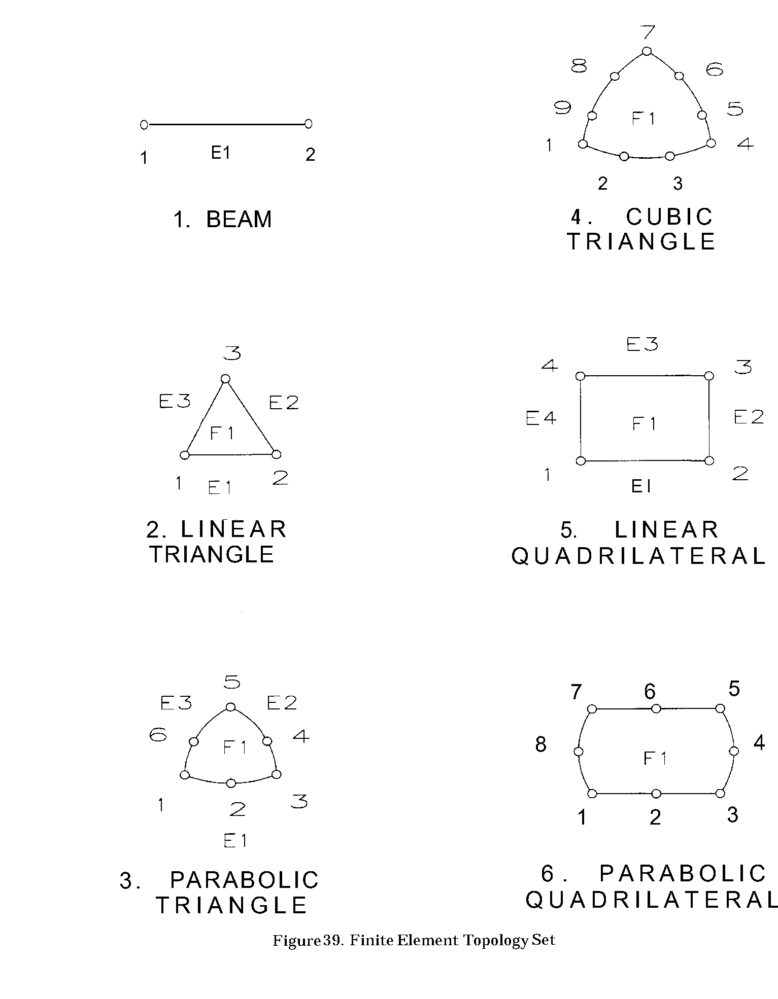

**Table 7.** Finite Element Topology (Continued)

| Element Type | Element Name | Edges | Faces |
|---|---|---|---|
| 7. | CQUAD<br>Cubic Quadrilateral | E1=1,2,3,4<br>E2=4,5,6,7<br>E3=7,8,9,10<br>E4=10,11,12,1 | F1=1,2,3,4,5,6,7,8,9,10,11,12 |
| 8. | PTSW<br>Parabolic Thick Shell Wedge | E1=1,2,3<br>E2=3,4,5<br>E3=5,6,1<br>E4=7,8,9<br>E5=9,10,11<br>E6=11,12,7<br>E7=1,7<br>E8=3,9<br>E9=5,11 | F1=1,2,3,4,5,6<br>F2=7,8,9,10,11,12<br>F3=1,2,3,9,8,7<br>F4=3,4,5,11,10,9<br>F5=5,6,1,7,12,11 |
| 9. | CTSW<br>Cubic Thick Shell Wedge | E1=1,2,3,4<br>E2=4,5,6,7<br>E3=7,8,9,1<br>E4=10,11,12,13<br>E5=13,14,15,16<br>E6=16,17,18,10<br>E7=1,10<br>E8=4,13<br>E9=7,16 | F1=1,2,3,4,5,6,7,8,9<br>F2=10,11,12,13,14,15,16,17,18<br>F3=1,2,3,4,13,12,11,10<br>F4=4,5,6,7,16,15,14,13<br>F5=7,8,9,1,10,18,17,16 |
| 10. | PTS<br>Parabolic Thick Shell | E1=1,2,3<br>E2=3,4,5<br>E3=5,6,7<br>E4=7,8,1<br>E5=9,10,11<br>E6=11,12,13<br>E7=13,14,15<br>E8=15,16,9<br>E9=1,9<br>E10=3,11<br>E11=5,13<br>E12=7,15 | F1=1,2,3,4,5,6,7,8<br>F2=9,10,11,12,13,14,15,16<br>F3=1,2,3,11,10,9<br>F4=3,4,5,13,12,11<br>F5=5,6,7,15,14,13<br>F6=7,8,1,9,16,15 |
| 11. | CTS<br>Cubic Thick Shell | E1=1,2,3,4<br>E2=4,5,6,7<br>E3=7,8,9,10<br>E4=10,11,12,1<br>E5=13,14,15,16<br>E6=16,17,18,19<br>E7=19,20,21,22<br>E8=22,23,24,13<br>E9=1,13<br>E10=4,16<br>E11=7,19<br>E12=10,22 | F1=1,2,3,4,5,6,7,8,9,10,11,12<br>F2=13,14,15,16,17,18,19,20,21,22,23,24<br>F3=1,2,3,4,16,15,14,13<br>F4=4,5,6,7,19,18,17,16<br>F5=7,8,9,10,22,21,20,19<br>F6=10,11,12,1,13,24,23,22 |

Refer to Figure 40.

**Figure 40:** Finite Element Topology Set (continued)

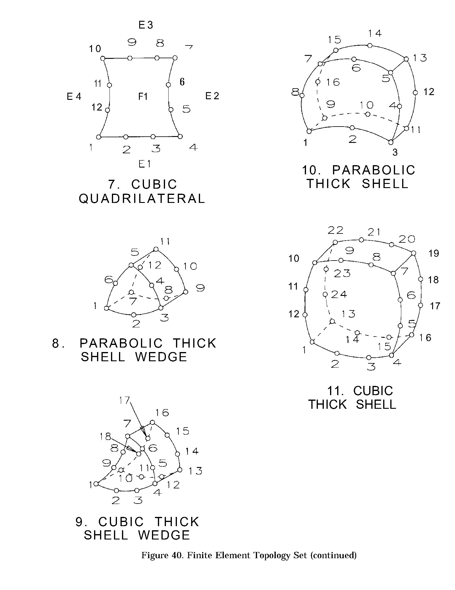

**Table 7.** Finite Element Topology (Continued)

| Element Type | Element Name | Edges | Faces |
|---|---|---|---|
| 12. | LSOT<br>Linear Solid Tetrahedron | E1=1,2<br>E2=2,3<br>E3=3,1<br>E4=1,4<br>E5=2,4<br>E6=3,4 | F1=1,2,3<br>F2=1,2,4<br>F3=2,3,4<br>F4=3,1,4 |
| 13. | PSOT<br>Parabolic Solid Tetrahedron | E1=1,2,3<br>E2=3,4,5<br>E3=5,6,1<br>E4=1,7,10<br>E5=3,8,10<br>E6=5,9,10 | F1=1,2,3,4,5,6<br>F2=1,2,3,8,10,7<br>F3=3,4,5,9,10,8<br>F4=5,6,1,7,10,9 |
| 14. | LSOW<br>Linear Solid Wedge | E1=1,2<br>E2=2,3<br>E3=3,1<br>E4=4,5<br>E5=5,6<br>E6=6,4<br>E7=1,4<br>E8=2,5<br>E9=3,6 | F1=1,2,3<br>F2=4,5,6<br>F3=1,2,5,4<br>F4=2,3,6,5<br>F5=3,1,4,6 |
| 15. | PSOW<br>Parabolic Solid Wedge | E1=1,2,3<br>E2=3,4,5<br>E3=5,6,1<br>E4=10,11,12<br>E5=12,13,14<br>E6=14,15,10<br>E7=1,7,10<br>E8=3,8,12<br>E9=5,9,14 | F1=1,2,3,4,5,6<br>F2=10,11,12,13,14,15<br>F3=1,2,3,8,12,11,10,7<br>F4=3,4,5,9,14,13,12,8<br>F5=5,6,1,7,10,15,14,9 |
| 16. | CSOW<br>Cubic Solid Wedge | E1=1,2,3,4<br>E2=4,5,6,7<br>E3=7,8,9,1<br>E4=16,17,18,19<br>E5=19,20,21,22<br>E6=22,23,24,16<br>E7=1,10,13,16<br>E8=4,11,14,19<br>E9=7,12,15,22 | F1=1,2,3,4,5,6,7,8,9<br>F2=16,17,18,19,20,21,22,23,24<br>F3=1,2,3,4,11,14,19,18,17,16,13,10<br>F4=4,5,6,7,12,15,22,21,20,19,14,11<br>F5=7,8,9,1,10,13,16,24,23,22,15,12 |

Refer to Figure 41.

**Figure 41:** Finite Element Topology Set (continued)

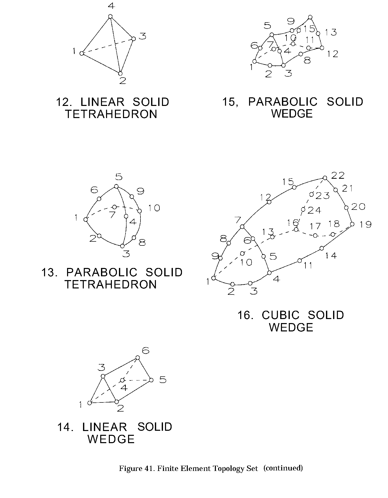

**Table 7.** Finite Element Topology (continued)

| Element Type | Element Name | Edges | Faces |
|---|---|---|---|
| 17. | LSO<br>Linear Solid | E1=1,2<br>E2=2,3<br>E3=3,4<br>E4=4,1<br>E5=5,6<br>E6=6,7<br>E7=7,8<br>E8=8,5<br>E9=1,5<br>E10=2,6<br>E11=3,7<br>E12=4,8 | F1=1,2,3,4<br>F2=5,6,7,8<br>F3=1,2,6,5<br>F4=2,3,7,6<br>F5=3,4,8,7<br>F6=4,1,5,8 |
| 18. | PSO<br>Parabolic Solid | E1=1,2,3<br>E2=3,4,5<br>E3=5,6,7<br>E4=7,8,1<br>E5=13,14,15<br>E6=15,16,17<br>E7=17,18,19<br>E8=19,20,13<br>E9=1,9,13<br>E10=3,10,15<br>E11=5,11,17<br>E12=7,12,19 | F1=1,2,3,4,5,6,7,8<br>F2=13,14,15,16,17,18,19,20<br>F3=1,2,3,10,15,14,13,9<br>F4=3,4,5,11,17,16,15,10<br>F5=5,6,7,12,19,18,17,11<br>F6=7,8,1,9,13,20,19,12 |
| 19. | CSO<br>Cubic Solid | E1=1,2,3,4<br>E2=4,5,6,7<br>E3=7,8,9,10<br>E4=10,11,12,1<br>E5=21,22,23,24<br>E6=24,25,26,27<br>E7=27,28,29,30<br>E8=30,31,32,21<br>E9=1,13,17,21<br>E10=4,14,18,24<br>E11=7,15,19,27<br>E12=10,16,20,30 | F1=1,2,3,4,5,6,7,8,9,10,11,12<br>F2=21,22,23,24,25,26,27,28,29,30,31,32<br>F3=1,2,3,4,14,18,24,23,22,21,17,13<br>F4=4,5,6,7,15,19,27,26,25,24,18,14<br>F5=7,8,9,10,16,20,30,29,28,27,19,15<br>F6=10,11,12,1,13,17,21,32,31,30,20,16 |

Refer to Figure 42.

**Figure 42:** Finite Element Topology Set (continued)

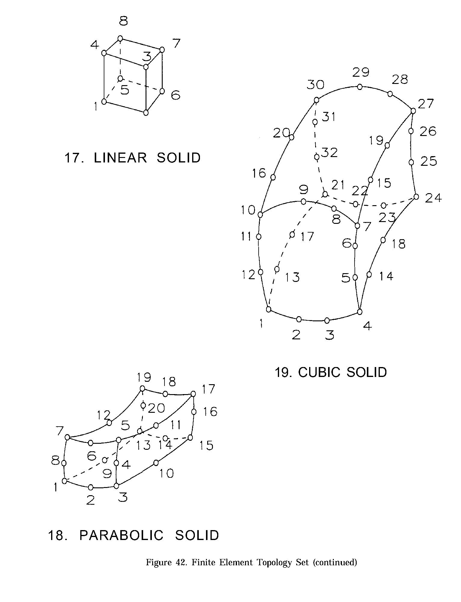

**Table 7.** Finite Element Topology (continued)

| Element Type | Element Name | Edges | Faces |
|---|---|---|---|
| 20. | ALLIN<br>Axisymmetric Linear Line | E1=1,2 | No Faces |
| 21. | APLIN<br>Axisymmetric Parabolic Line | E1=1,2,3 | No Faces |
| 22. | ACLIN<br>Axisymmetric Cubic Line | E1=1,2,3,4 | No Faces |
| 23. | ALTRIA<br>Axisymmetric Linear Triangle | E1=1,2<br>E2=2,3<br>E3=3,1 | No Faces |
| 24. | APTRIA<br>Axisymmetric Parabolic Triangle | E1=1,2,3<br>E2=3,4,5<br>E3=5,6,1 | No Faces |
| 25. | ALQUAD<br>Axisymmetric Linear Quadrilateral | E1=1,2<br>E2=2,3<br>E3=3,4<br>E4=4,1 | No Faces |
| 26. | APQUAD<br>Axisymmetric Parabolic Quadrilateral | E1=1,2,3<br>E2=3,4,5<br>E3=5,6,7<br>E4=7,8,1 | No Faces |

Refer to Figure 43.

**Figure 43:** Finite Element Topology Set (continued)

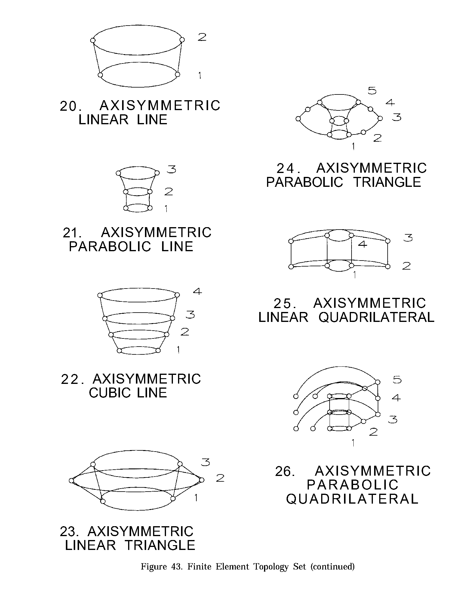

**Table 7.** Finite Element Topology (continued)

| Element Type | Element Name | Edges | Faces |
|---|---|---|---|
| 27. | SPR<br>Spring | No edges | No faces |
| 28. | GSPR<br>Grounded Spring |  |  |
| 29. | DAMP<br>Damper |  |  |
| 30. | GDAMP<br>Grounded damper |  |  |
| 31. | MASS<br>Mass |  |  |
| 32. | RBDY<br>Rigid Body |  |  |
| 33. | TBEAM<br>Three-Noded Beam | E1 = 1,2 | No faces |

Refer to Figure 44.

**Figure 44:** Finite Element Topology Set (continued)

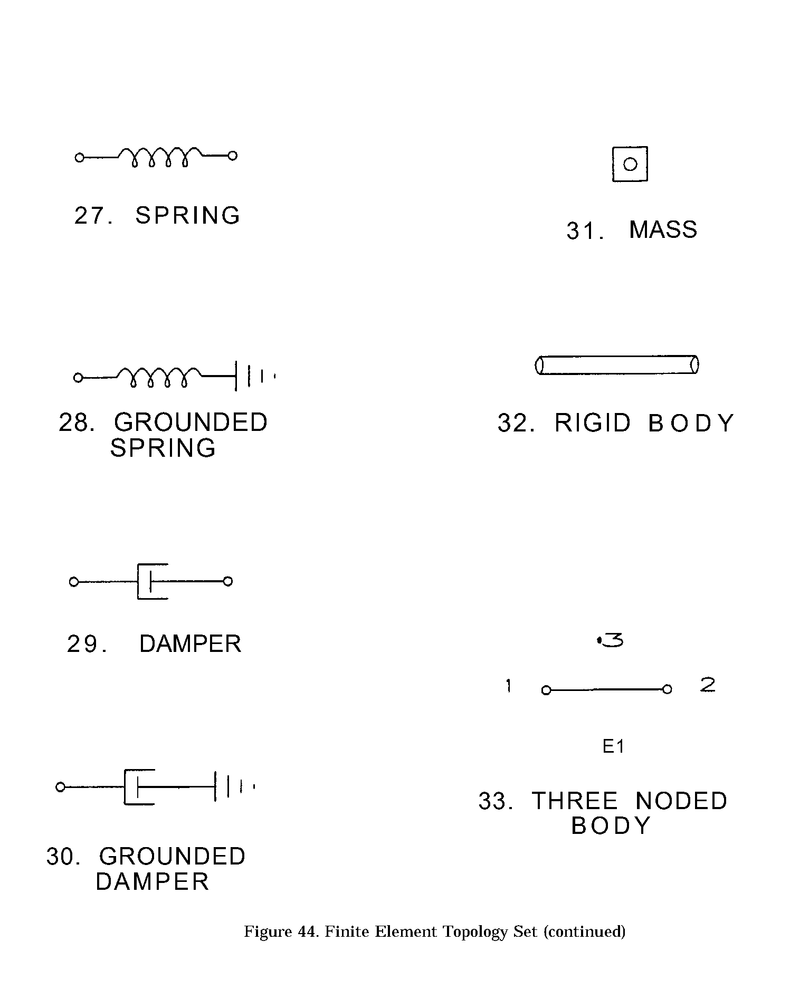

**Table 7.** Finite Element Topology (continued)

| Element Type | Element Name | Edges | Faces |
|---|---|---|---|
| 34. | OFMASS<br>Offset Mass |  | Node 2 specifies the center of mass. |
| 35. | OFBEAM<br>Offset Beam | E1 = 3,4 |  |
| 36. | PBEAM<br>Three Node Beam | E1 = 1,2,3 |  |
| 37. | CBEAM<br>Curved Beam | E1 = 1,2 | (Part of a circle)<br>A <45 degrees |
| 38. | CPSOW<br>Cubic/Parabolic Solid Wedge | E1 = 1,2,3,4<br>E2 = 4,5,6,7<br>E3 = 7,8,9,1<br>E4 = 13,14,15,16<br>E5 = 16,17,18,19<br>E6 = 19,20,21,13<br>E7 = 1,10,13<br>E8 = 4,11,16<br>E9 = 7,12,19 | F1 = 1,2,3,4,5,6,7,8,9<br>F2 = 1,2,3,4,11,16,15,14,13,10<br>F3 = 4,5,6,7,12,19,18,17,16,11<br>F4 = 7,8,9,1,10,13,21,20,19,12<br>F5 = 13,14,15,16,17,18,19,20,21 |
| 5001. | Implementor-Defined |  |  |

Refer to Figure 45.

Note: Elements 34-38 and 5001 are untested

**Figure 45:** Finite Element Topology Set (continued)

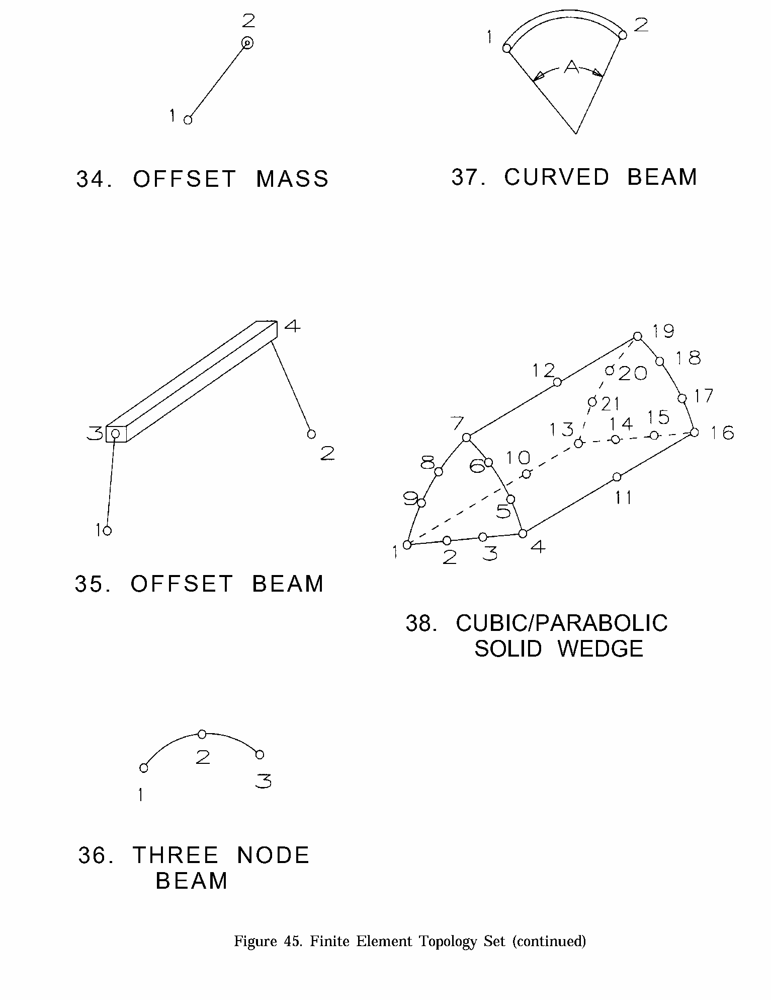

## 4.29 Nodal Displacement and Rotation Entity (Type 138)

The Nodal Displacement and Rotation Entity is used to communicate finite element postprocessing data. It contains the incremental displacements and rotations (expressed in radians) for each load case and each node in the model. It also contains a pointer to a General Note Entity (Type 212) for a description of the load cases. For each node it contains the node number identifier and the node DE pointer. The node number identifier is equivalent to the node number in the Directory Entry subscript field of the Node Entity (Type 134).

**Directory Entry** _ECO630_

| (1) Entity Type Number | (2) Parameter Data | (3) Structure | (4) Line Font Pattern | (5) Level | (6) View | (7) Xformation Matrix | (8) Label Display | (9) Status Number | (10) Sequence Number |
|---|---|---|---|---|---|---|---|---|---|
| 138 | → | `<n.a.>` | `<n.a.>` | `<n.a.>` | `<n.a.>` | `<n.a.>` | 0,→ | ??????** | D# |

| (11) Entity Type Number | (12) Line Weight | (13) Color Number | (14) Parameter Line Count | (15) Form Number | (16) Reserved | (17) Reserved | (18) Entity Label | (19) Entity Subscript | (20) Sequence Number |
|---|---|---|---|---|---|---|---|---|---|
| 138 | `<n.a.>` | `<n.a.>` | # |  |  |  |  | # | D#+1 |

**Parameter Data** _ECO650_

| Index | Name | Type | Description |
|---|---|---|---|
| 1 | NC | Integer | Number of analysis cases |
| 2 | GP(1) | Pointer | Pointer to the DE of the general note that describes the first analysis case |
| ... | ... | Pointer |  |
| 1+NC | GP(NC) | Pointer | Pointer to the DE of the general note that describes the last analysis case |
| 2+NC | NN | Integer | Number of nodes |
| 3+NC | NO(1) | Integer | Node number identifier for first node |
| 4+NC | NP(1) | Pointer | Pointer to the DE of the Node Directory Entry |
| 5+NC | X(1,1) | Real | X-Incr. translation, first analysis case |
| 6+NC | Y(1,1) | Real | Y-Incr. translation |
| 7+NC | Z(1,1) | Real | Z-Incr. translation |
| 8+NC | RX(1,1) | Real | RX-Incr. rotation |
| 9+NC | RY(1,1) | Real | RY-Incr. rotation |
| 10+NC | RZ(1,1) | Real | RZ-Incr. rotation |
| ... | ... | ... |  |
| -1+7*NC | X(1,NC) | Real | X-Incr. translation, last analysis case |
| 7*NC | Y(1,NC) | Real | Y-Incr. translation |
| 1+7*NC | Z(1,NC) | Real | Z-Incr. translation |
| 2+7*NC | RX(1,NC) | Real | RX-Incr. rotation |
| ... | ... | ... |  |
| 3+NC+(-1+NN)*(2+6*NC) | NO(NN) | Integer | Node number identifier for NNth node |
| 4+NC+(-1+NN)*(2+6*NC) | NP(NN) | Pointer | Pointer to the DE of the Node Directory Entry |
| 5+NC+(-1+NN)*(2+6*NC) | X(NN,1) | Real | X-Incr. translation, first analysis case |
| 6+NC+(-1+NN)*(2+6*NC) | Y(NN,1) | Real |  |
| 7+NC+(-1+NN)*(2+6*NC) | Z(NN,1) | Real |  |
| 8+NC+(-1+NN)*(2+6*NC) | RX(NN,1) | Real | RX-Incr. rotation, first analysis case |
| 9+NC+(-1+NN)*(2+6*NC) | RY(NN,1) | Real |  |
| 10+NC+(-1+NN)*(2+6*NC) | RZ(NN,1) | Real |  |
| ... | ... | ... |  |
| -3+NC+NN*(2+6*NC) | X(NN,NC) | Real | X-Incr. translation, last analysis case |
| -2+NC+NN*(2+6*NC) | Y(NN,NC) | Real |  |
| -1+NC+NN*(2+6*NC) | Z(NN,NC) | Real |  |
| NC+NN*(2+6*NC) | RX(NN,NC) | Real | RX-Incr. rotation, last analysis case |
| 1+NC+NN*(2+6*NC) | RY(NN,NC) | Real |  |
| 2+NC+NN*(2+6*NC) | RZ(NN,NC) | Real |  |

Additional pointers as required (see Section 2.2.4.5.2).

## 4.30 Offset Surface Entity (Type 140)

The offset surface is a surface defined in terms of an existing surface. _ECO630_

Let $S = S(u,v)$ be a surface defined by this Specification, parameterized and oriented by $N(u,v)$, a _ECO630_ differentiable field of unit normal vectors defined on the whole surface, and $d$, a fixed, nonzero real number. An offset surface to $S$ is a parameterized surface $O(u, v)$ given by:

$$O(u,v) = S(u,v) + d \cdot N(u,v); \quad u_1 \leq u \leq u_2, \quad v_1 \leq v \leq v_2.$$

The base surface $S(u,v)$ is referenced by a pointer in the parameter data section, while $N(u,v)$ is found from $S(u,v)$ as defined below. The value of $d$ is provided as a parameter value in the parameter data section.

To determine which one of the two orientations of the orientable regular surface $S(u,v)$ the offset _ECO630_ surface will be used to define $O$, define

$$N(u,v) = \frac{\partial S/\partial u \times \partial S/\partial v}{\|\partial S/\partial u \times \partial S/\partial v\|}.$$

In order to avoid confusion with respect to the orientation of the base surface $S(u,v)$, an additional _ECO630_ offset indicator is included. That indicator, shown in Figure 46, consists of the vector $(Nx, Ny, Nz)$ defined by the unit normal vector at the parameter values $(Um, Vm).)$:

$$(Nz, Ny, Nz) = \frac{N(Um, Vm)}{\|N(Um, Vm)\|},$$

where, if the surface is bounded,

$$Um = (u_1 + u_2)/2 \text{ and } Vm = (v_1 + v_2)/2,$$

or, if the surface is unbounded,

$$Um = 0.0 \text{ and } Vm = 0.0.$$

This indicates the direction in which the offset distance, $d$, is measured positive at $(Um, Vm)$.

CAUTION: The vector $(Nx, Ny, Nz)$ is simply an indicator of the direction with respect to the base _ECO630_ surface $S(u,v)$ where the offset distance, $d$, is measured positively. This vector does not participate in the evaluation of the offset surface as is evident from the formula for $O$ that defines the offset surface.

**Directory Entry**

| (1) Entity Type Number | (2) Parameter Data | (3) Structure | (4) Line Font Pattern | (5) Level | (6) View | (7) Xformation Matrix | (8) Label Display | (9) Status Number | (10) Sequence Number |
|---|---|---|---|---|---|---|---|---|---|
| 140 | → | `<n.a.>` | #,→ | #,→ | 0,→ | 0,→ | 0,→ | ??????** | D# |

| (11) Entity Type Number | (12) Line Weight | (13) Color Number | (14) Parameter Line Count | (15) Form Number | (16) Reserved | (17) Reserved | (18) Entity Label | (19) Entity Subscript | (20) Sequence Number |
|---|---|---|---|---|---|---|---|---|---|
| 140 | # | #,→ | # |  |  |  |  | # | D#+1 |

**Parameter Data** _ECO630_

| Index | Name | Type | Description |
|---|---|---|---|
| 1 | NX | Real | The X-coordinate of the end of the offset indicator $N(Um, Vm)$ |
| 2 | NY | Real | The Y-coordinate of the end of the offset indicator $N(Um, Vm)$ |
| 3 | NZ | Real | The Z-coordinate of the end of the offset indicator $N(Um, Vm)$ |
| 4 | D | Real | The distance by which the surface is normally offset on the side of the offset indicator if $d$ > 0 and on the opposite side if $d$ < 0 |
| 5 | DE | Pointer | Pointer to the DE of the surface entity to be offset |

Additional pointers as required (see Section 2.2.4.5.2).

**Figure 46:** Offset Surface in 3-D Euclidean Space

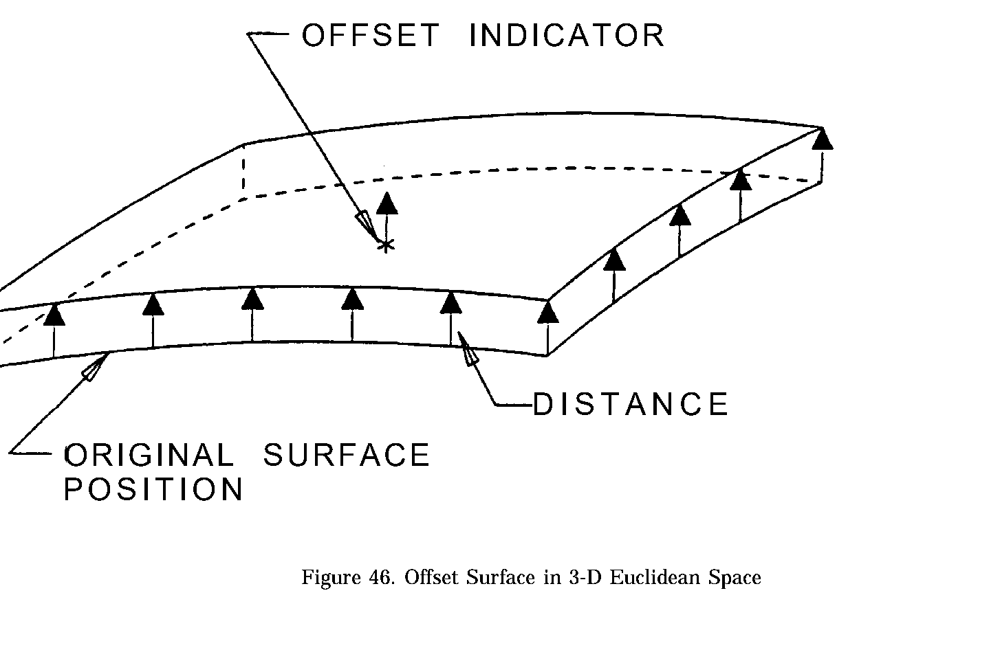

## 4.31 Boundary Entity (Type 141)

_ECO652_

Each Boundary Entity (Type 141) identifies a surface boundary consisting of a set of curves lying on the surface. The properties of the surface, the boundary, and the curves comprising the boundary are defined below:

**D1.** $S(u, v)$ may be used as a parameterized surface representation with the Boundary Entity (Type 141) if it meets the following criteria:

(a) The untrimmed domain of $S(u, v)$ is a rectangle, $D$, consisting of those points $(u, v)$ such that $a \leq u \leq b$ and $c \leq v \leq d$ for given constants $a, b, c,$ and $d$ with $a < b$ and $c < d$.

(b) The mapping $S = S(u, v) = (x(u, v), y(u, v), Z(u, v))$ is defined for each ordered pair $(u, v)$ in $D$.

(c) It is one-to-one in the interior (but not necessarily on the boundary) of $D$.

(d) It has continuous normal vectors at every point of $D$ except those which map to poles (see definition D3).

**D2.** The isoparametric curves $u = a, u = b, v = c,$ and $v = d$ will be referred to as boundary curves of the parameter space or simply boundary curves.

**D3.** Let $P$ be a 3-D Euclidean (model space) point. Then $P$ is a pole of the surface defined by the mapping $S(u, v)$ if any of the following are true:

(a) $P = S(a, v)$ for all $v$ such that $a \leq v \leq d$
(b) $P = S(b, v)$ for all $v$ such that $a \leq v \leq d$
(c) $P = S(u, c)$ for all $u$ such that $a \leq u \leq b$
(d) $P = S(u, d)$ for all $u$ such that $a \leq u \leq b$

**D4.** Let $C$ be a 3-D Euclidean (model space) curve. Then $C$ is a seam of the surface defined by the mapping $S(u, v)$ if it is the image in model space of

(a) $C(v) = S(a, v)$ for all $v$ such that $c \leq v \leq d$ and $C(v) = S(b, v)$ for all $v$ such that $c \leq v \leq d$

or

(b) $C(u) = S(u, c)$ for all $u$ such that $a \leq u \leq b$ and $C(u) = S(u, d)$ for all $u$ such that $a \leq u \leq b$

**D5.** A model space curve is represented parametrically, lies on the surface, and does not intersect itself except possibly at its endpoints.

**D6.** A boundary is an ordered list of model space curves $(C_i, i = 1, n)$ which has the following properties:

(a) It is closed. This implies that the endpoint of $C_n$ is the startpoint of $C_1$.
(b) Each curve in the list is oriented such that the endpoint of the curve $C_{i-1}$ is the startpoint of the curve $C_i, i = 2, n$.
(c) It is not self-intersecting except at its endpoints. The endpoints of the boundary are the startpoint of $C_1$ and the endpoint of $C_n$. It does not intersect other boundaries except at isolated points (refer to D10(b) for related requirements).

**D7.** The usage of a model-space trimming curve is oriented. It is part of an ordered list forming a boundary.

**D8.** The positive surface normal is given by the cross product (in the order specified) of the partial derivative of $S(u, v)$ with respect to $u$ and the partial derivative of $S(u, v)$ with respect to $v$.

**D9.** The terminology "left of a model space trimming curve at a point $p$" means "the direction of the vector formed as the cross product (in the order specified) of the surface normal and the tangent vector to the model space trimming curve at $p$."

**D10.** The region of the surface being communicated is called the active region; it shall satisfy the following:

(a) The active region has finite area.
(b) Any two points on the interior of the active region shall be path-connected.
(c) The interior of the active region lies on the left of all of its boundaries.
(d) The active region consists of all of its boundaries and its interior.
(e) The closure of the interior of the active region (in the relative topology of the surface reduced by $R^3$) is the active region.

**D11.** $C^*_a$ is an associated parameter space curve of an arc, $C_a$, of a model space trimming curve, $C$, on the surface, $S$, with domain $D$, if $C^*_a$ is contained in $D$ and the composition $S \circ C^*_a = C_a$. An associated parameter space curve is assumed to be represented parametrically, and it shall not intersect itself except possibly at its endpoints.

**D12.** An associated parameter space curve collection (or simply "collection") is defined to be the associated parameter space curves $(C^*_i, i = 1, p)$ such that the $C_i$ given by the composition $(S \circ C^*_i, i = 1, p)$ form a composite curve. The $C_i$ of the composite curve are ordered and oriented such that as the parameter goes from its initial to final value the complete model space trimming curve is produced in the direction indicated by the model space curve's orientation flag SENSE. _ECO652_

Figure 47 shows valid and invalid examples of a boundary.

The $C^*_i$ forming the associated parameter space collections of a boundary are not required to satisfy the "closed" property for a boundary (see definition D6). The $C^*_i$ can be formed into a boundary by adding the appropriate sections of the boundary curves of the parameter space (see definition D2).

**Figure 47:** Examples of the Boundary Entity

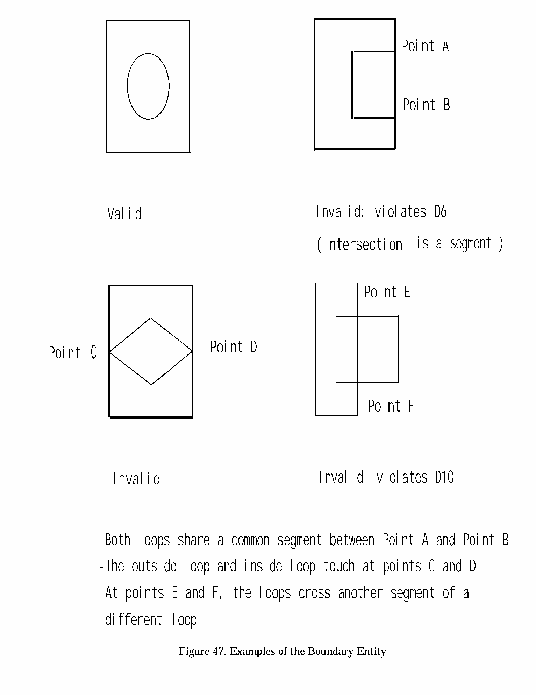

**Directory Entry**

| (1) Entity Type Number | (2) Parameter Data | (3) Structure | (4) Line Font Pattern | (5) Level | (6) View | (7) Xformation Matrix | (8) Label Display | (9) Status Number | (10) Sequence Number |
|---|---|---|---|---|---|---|---|---|---|
| 141 |  | `<n.a.>` |  |  |  |  |  | ??????** | D# |

| (11) Entity Type Number | (12) Line Weight | (13) Color Number | (14) Parameter Line Count | (15) Form Number | (16) Reserved | (17) Reserved | (18) Entity Label | (19) Entity Subscript | (20) Sequence Number |
|---|---|---|---|---|---|---|---|---|---|
| 141 |  |  |  |  |  |  |  |  | D#+1 |

**Parameter Data** _ECO650_

| Index | Name | Type | Description |
|---|---|---|---|
| 1 | TYPE | Integer | The type of bounded surface representation:<br>0 = The boundary entities shall reference only model space trimming curves. The associated surface representation (located by SPTR) may be parametric.<br>1 = The boundary entities shall reference model space curves and associated parameter space curve collections. The associated surface (located by SPTR) shall be a parametric representation. |
| 2 | PREF | Integer | Indicates the preferred representation of the trimming curves in the sending system:<br>0 = Unspecified<br>1 = Model space<br>2 = Parameter space<br>3 = Representations are of equal preference |
| 3 | SPTR | Pointer | Pointer to the DE of the untrimmed surface entity to be bounded. If associated parameter space curves are being transferred (TYPE = 1) the surface representations shall be parametric. |
| 4 | N | Integer | Number of curves included in this boundary entity ($N > 0$) |
| 5 | CRVPT(1) | Pointer | Pointer to the DE of the first model space curve entity of this Boundary Entity |
| 6 | SENSE(1) | Integer | An orientation flag indicating whether the direction of the first model space curve should be reversed before use in the boundary. The possible values for the sense flag are: _ECO652_<br>1 = The direction of the model space curve does not require reversal; PSCPT and CRVPT orientations agree.<br>2 = The direction of the model space curve needs to be reversed; PSCPT and CRVPT orientations disagree. |
| 7 | K(1) | Integer | Number of associated parameter space curves in the collection for the first model space trimming curve. In the case of a TYPE = 0 transfer, this count shall be zero. |
| 8 | PSCPT(1,1) | Pointer | Pointer to the DE of the first associated parameter space curve entity of the collection for the first model space trimming curve |
| ... | ... | . | . |
| 7+K(1) | PSCPT(1,K(1)) | Pointer | Pointer to the DE of the last associated parameter space curve entity of the collection for the first model space trimming curve |
| ... | ... | ... |  |

Let $M = 12 + 3 \cdot (N-1) + (K(1) + K(2) + \ldots + K(N-1))$.

| Index | Name | Type | Description |
|---|---|---|---|
| M | CRVPT(N) | Pointer | Pointer to the DE of the last model space curve entity in this Boundary Entity |
| 1+M | SENSE(N) | Integer | An orientation flag indicating whether the direction of the last model space curve should be reversed before use in the boundary. The possible values for the sense flag are: _ECO652_<br>1 = The direction of the model space curve does not require reversal; PSCPT and CRVPT orientations agree.<br>2 = The direction of the model space curve needs to be reversed; PSCPT and CRVPT orientations disagree. |
| 2+M | K(N) | Integer | Number of associated parameter space curves in the collection for the last model space trimming curve. In the case of a TYPE = 0 transfer, this count shall be zero. |
| 3+M | PSCPT(N,1) | Pointer | Pointer to the DE of the first associated parameter space curve entity of the collection for the last model space trimming curve |
| ... | ... | ... |  |
| 2+K(N)+M | PSCPT(N,K(N)) | Pointer | Pointer to the DE of the last associated parameter space curve entity of the collection for the last model space trimming curve |

Additional pointers as required (see Section 2.2.4.5.2).

## 4.32 Curve on a Parametric Surface Entity (Type 142)

The Curve on a Parametric Surface Entity associates a given curve with a surface and identifies the curve as lying on the surface. Let

$$S = S(u, v) = (x(u, v), y(u, v), z(u, v))$$

be a regular parameterized surface whose domain is a rectangle defined by

$$D = \{(u, v) \mid u_1 \leq u \leq u_2 \text{ and } v_1 \leq v \leq v_2\}.$$

Let $B = B(t)$ be a curve defined by

$$B(t) = (u(t), v(t)) \text{ for } a \leq t \leq b,$$

taking its values in $D$.

A curve $C_c(t)$ on the surface $S(u, v)$ is the composition of two mappings, $S$ and $B$, defined as follows: _ECO630_ ($C_c(t)$ stands for "composition curve.")

The curve $B$ lies in the two dimensional space which is the domain of the surface $S$. Therefore, the representation used for $B$ which has been derived from a curve defined in this Specification must be two dimensional: the $X$ and $Y$ coordinates of this curve pointed to by BPTR are used.

The Entity Use Flag (DE Field 9) of the entity $B$ is set to 05, indicating that $B$ is in the parameter space of the surface. Consequently, $B$ cannot be scaled, and, if a transformation matrix is to be applied on $B$, it has to map it within the parameter space $D$ in which it resides.

A curve on a parametric surface is given by:

1. the mapping $C_c$ and an indication that the curve lies on the surface $S(u, v)$
2. the mappings $B$ and $S$ whose composition gives the curve $C_c$.

A curve on a surface may have been created in one of a number of various ways:

1. as the projection on the surface of a given curve in model space in a prescribed way, for example, parallel to a given fixed vector

2. as the intersection of two given surfaces

3. by a prescribed functional relation between the surface parameters $u$ and $v$ _ECO630_

4. by a special curve, such as a geodesic, emanating from a given point in a certain direction, _ECO630_ a principal curve (line of curvature) emanating from a certain point, an asymptotic curve emanating from a certain point, an isoparametric curve for a given value, or any other kind of special curve.

The Parameter Data section contains three pointers:

1. a pointer to the curve from which $B(t)$ is derived
2. a pointer to the surface $S(u, v)$
3. a pointer to a mapping $C(r)$, such that:

   $C(r)$ and $C_c(t)$ share the same image in model space.

   $C(r)$ and $C_c(t)$ have the same start and end points.

   An implicit mathematical relationship exists between the parameters $t$ and $r$.

   $C(r)$ and $C_c(t)$ must be such that $t$ is related to $r$ in a monotonically increasing fashion. This ensures that the orientations of $C(r)$ and $C_c(t)$ coincide, and no accidental multiple tracing of either curve occurs.

It also contains:

1. a flag to indicate how the curve was created
2. a flag to indicate which of the two alternate representations was preferred by the sending system.

**Directory Entry**

| (1) Entity Type Number | (2) Parameter Data | (3) Structure | (4) Line Font Pattern | (5) Level | (6) View | (7) Xformation Matrix | (8) Label Display | (9) Status Number | (10) Sequence Number |
|---|---|---|---|---|---|---|---|---|---|
| 142 |  | `<n.a.>` |  |  |  |  |  | ????00** _ECO630_ | D# |

| (11) Entity Type Number | (12) Line Weight | (13) Color Number | (14) Parameter Line Count | (15) Form Number | (16) Reserved | (17) Reserved | (18) Entity Label | (19) Entity Subscript | (20) Sequence Number |
|---|---|---|---|---|---|---|---|---|---|
| 142 |  |  |  |  |  |  |  |  | D#+1 |

**Parameter Data**

| Index | Name | Type | Description |
|---|---|---|---|
| 1 | CRTN | Integer | Indicates the way the curve on the surface has been created:<br>0 = Unspecified<br>1 = Projection of a given curve on the surface<br>2 = Intersection of two surfaces<br>3 = Isoparametric curve, _i.e._, either a $u$-parametric or a $v$-parametric curve |
| 2 | SPTR | Pointer | Pointer to the DE of the surface on which the curve lies |
| 3 | BPTR | Pointer | Pointer to the DE of the entity that contains the definition of the curve $B$ in the parametric space $(u, v)$ of the surface $S$ |
| 4 | CPTR | Pointer | Pointer to the DE of the curve $C$ |
| 5 | PREF | Integer | Indicates preferred representation in the sending system:<br>0 = Unspecified<br>1 = $S \circ B$ is preferred<br>2 = $C$ is preferred<br>3 = $C$ and $S \circ B$ are equally preferred |

Additional pointers as required (see Section 2.2.4.5.2).

## 4.33 Bounded Surface Entity (Type 143)

The Bounded Surface Entity (Type 143) is used to represent trimmed surfaces. The surface and _ECO652_ trimming curves are assumed to be represented parametrically and to comply with the definitions _ECO630_ D1 through D12 listed in Section 4.31.

Two types of transfer are supported by the bounded surface. A TYPE = 0 transfer represents a _ECO630_ surface and its model space boundaries. A TYPE = 1 transfer represents a surface, its model space boundaries, and the associated parameter space curve collection for each model space trimming curve of each boundary. Because of seams and poles, the associated parameter space curve collections of a boundary do not necessarily enclose a region in parameter space.

The bounded surface information is represented using several entities. These are the Bounded Surface _ECO630_ Entity (Type 143), the Boundary Entity (Type 141), the parametrically represented untrimmed surface entities, and the parametrically represented curve entities.

**Directory Entry**

| (1) Entity Type Number | (2) Parameter Data | (3) Structure | (4) Line Font Pattern | (5) Level | (6) View | (7) Xformation Matrix | (8) Label Display | (9) Status Number | (10) Sequence Number |
|---|---|---|---|---|---|---|---|---|---|
| 143 |  | `<n.a.>` |  |  |  |  |  | ????00** | D# |

| (11) Entity Type Number | (12) Line Weight | (13) Color Number | (14) Parameter Line Count | (15) Form Number | (16) Reserved | (17) Reserved | (18) Entity Label | (19) Entity Subscript | (20) Sequence Number |
|---|---|---|---|---|---|---|---|---|---|
| 143 |  |  |  |  |  |  |  |  | D#+1 |

**Parameter Data** _ECO650_

| Index | Name | Type | Description |
|---|---|---|---|
| 1 | TYPE | Integer | The type of bounded surface representation:<br>0 = The boundary entities shall reference only model space curves. The associated surface representation (located by SPTR) may be parametric.<br>1 = The boundary entities shall reference both model space curves and the associated parameter space curve collections. The associated surface (located by SPTR) shall be a parametric representation. |
| 2 | SPTR | Pointer | Pointer to the DE of the untrimmed surface entity to be bounded. If parameter space trimming curves are being transferred (TYPE = 1) the surface representations shall be parametric. |
| 3 | N | Integer | The number of boundary entities |
| 4 | BDPT(1) | Pointer | Pointer to the DE of the first Boundary Entity (Type 141) |
| ... | ... | ... | ... |
| 3+N | BDPT(N) | Pointer | Pointer to the DE of the last Boundary Entity (Type 141) |

Additional pointers as required (see Section 2.2.4.5.2).

## 4.34 Trimmed (Parametric) Surface Entity (Type 144)

A simple closed curve in the Euclidean plane divides the plane into two disjoint open connected _ECO630_ components, one bounded and one unbounded. The bounded component is called the interior region to the curve (herein called "interior" and the unbounded component is called the exterior region to the curve (herein called "exterior").

The domain of the trimmed surface is defined as the common region of the interior of the outer _ECO630_ boundary and the exterior of each of the inner boundaries and includes the boundary curves. Note that the trimmed surface has the same mapping $S(u, v)$ as the original (untrimmed surface) but a different domain. The curves that delineate either the outer or the inner boundary of the trimmed surface are curves on the surface $S$, and are to be exchanged by means of the Curve on a Parametric Surface Entity (Type 142).

Let $S(u, v)$ be a regular parameterized surface, whose untrimmed domain is a rectangle $D$ consisting _ECO630_ of those points $(u, v)$ such that $a \leq u \leq b$ and $c \leq v \leq d$ for given constants $a, b, c,$ and $d$ with $a < b$ and $c < d$. Assume that $S$ takes its values in three-dimensional Euclidean space so that it can be expressed as:

$$S = S(u, v) = \begin{pmatrix} x(u, v) \\ y(u, v) \\ z(u, v) \end{pmatrix}$$

for each ordered pair $(u, v)$ in $D$.

Also let the mapping $S$ be subject to the following regularity conditions:

- It has a continuous normal vector in the interior of $D$. _ECO630_
- It is one-to-one in $D$.
- There are no singular points in $D$, _i.e._, the vectors of the first partial derivatives of $S$ at any point in $D$ are linearly independent.

Two types of simple closed curves are utilized to define the domain of the trimmed (parametric) _ECO630_ surface.

**Outer boundary** There is exactly one. It lies in $D$, and in particular, it can be the boundary curve of $D$.

**Inner boundary** There can be any number of them, including zero. The set of inner boundaries _ECO630_ satisfies two criteria:

1. The curves, as well as their interiors, are mutually disjoint. _ECO630_
2. Each curve lies in the interior of the outer boundary.

If the outer boundary of the surface being defined is the boundary of $D$ and there are no inner boundaries, the trimmed surface being defined is untrimmed.

**Directory Entry**

| (1) Entity Type Number | (2) Parameter Data | (3) Structure | (4) Line Font Pattern | (5) Level | (6) View | (7) Xformation Matrix | (8) Label Display | (9) Status Number | (10) Sequence Number |
|---|---|---|---|---|---|---|---|---|---|
| 144 |  | `<n.a.>` |  |  |  |  |  | ????00** | D# |

| (11) Entity Type Number | (12) Line Weight | (13) Color Number | (14) Parameter Line Count | (15) Form Number | (16) Reserved | (17) Reserved | (18) Entity Label | (19) Entity Subscript | (20) Sequence Number |
|---|---|---|---|---|---|---|---|---|---|
| 144 |  |  |  |  |  |  |  |  | D#+1 |

**Parameter Data** _ECO650_

| Index | Name | Type | Description |
|---|---|---|---|
| 1 | PTS | Pointer | Pointer to the DE of the surface entity that is to be trimmed |
| 2 | N1 | Integer | 0 = the outer boundary is the boundary of $D$<br>1 = otherwise |
| 3 | N2 | Integer | This number indicates the number of simple closed curves which constitute the inner boundary of the trimmed surface. In case no inner boundary is introduced, this is set equal to zero. |
| 4 | PTO | Pointer | Pointer to the DE of the Curve on a Parametric Surface Entity _ECO630_ that constitutes the outer boundary of the trimmed surface or zero |
| 5 | PTI(1) | Pointer | Pointer to the DE of the first simple closed inner boundary curve entity (Curve on a Parametric Surface Entity) according to some arbitrary ordering of these entities |
| ... | ... | ... | ... |
| 4+N2 | PTI(N2) | Pointer | Pointer to the DE of the last simple closed inner boundary curve entity (Curve on a Parametric Surface Entity) |

Additional pointers as required (see Section 2.2.4.5.2).

## 4.35 Nodal Results Entity (Type 146)‡

The Nodal Results Entity has not been tested. See Section 1.9.

The number of analysis results data values per FEM node and their physical interpretation depends _ECO630_ upon specified values of the form number (TYPE) and NV (see Table 8). Also, the node number identifier shall be equal to the node number in the directory entry subscript field of the node entity.

**Directory Entry**

| (1) Entity Type Number | (2) Parameter Data | (3) Structure | (4) Line Font Pattern | (5) Level | (6) View | (7) Xformation Matrix | (8) Label Display | (9) Status Number | (10) Sequence Number |
|---|---|---|---|---|---|---|---|---|---|
| 146 |  | `<n.a.>` | `<n.a.>` | `<n.a.>` | `<n.a.>` | `<n.a.>` |  | **??03** | D# |

| (11) Entity Type Number | (12) Line Weight | (13) Color Number | (14) Parameter Line Count | (15) Form Number | (16) Reserved | (17) Reserved | (18) Entity Label | (19) Entity Subscript | (20) Sequence Number |
|---|---|---|---|---|---|---|---|---|---|
| 146 | `<n.a.>` |  |  | TYPE |  |  |  |  | D#+1 |

Note: The Entity Subscript field shall contain the Analysis Case Number. The Entity Label field optionally may contain the Analysis Label.

The value of TYPE (see Table 8) indicates the physical interpretation of the finite element analysis _ECO630_ results data. For a specific TYPE of data, multiple values are positioned within the Parameter Data record in the order in which they appear in the parenthetical expression in the description column of the table.

**Parameter Data**

| Index | Name | Type | Description |
|---|---|---|---|
| 1 | GNOTE | Pointer | Pointer to the DE of the General Note Entity that describes the analysis case. |
| 2 | SCN | Integer | Analysis Subcase number. If there is no subcase, the value of this parameter shall be zero. |
| 3 | TIME | Real | Analysis time value used for this subcase. (This time value is not the time that the analysis was executed, nor does it have anything to do with the amount of time that a computer took to execute the job. It is the time at which transient analysis results occur in the mathematical FEM model.) |
| 4 | NV | Integer | Number of real values in array V for a FEM node. (The value of NV shall agree with the form number specified in the Directory Data, see Table 8.) |
| 5 | NN | Integer | Number of FEM nodes for which data is to be read. |
| 6 | NODE(1) | Integer | FEM node number identifier for first node. |
| 7 | NP(1) | Pointer | Pointer to the DE of the first FEM Node Entity |
| 8 | V(i) | Real | Values of the finite element analysis results data array for the first FEM node. There are NV data values in array V. |
| ... | ... | ... | (loop over number of nodes, NN) |

In subsequent index equations, let $NNV = (NV+2) \cdot (NN-1)$

| Index | Name | Type | Description |
|---|---|---|---|
| 6+NNV | NODE(NN) | Integer | FEM node number identifier for last node. |
| 7+NNV | NP(NN) | Pointer | Pointer to the DE of the last FEM Node Entity |
| 8+NNV | V(i) | Real | Values of the finite element analysis results data array for the last FEM node. There are NV data values in array V. |

Additional pointers as required (see Section 2.2.4.5.2).

**Table 8.** Description of TYPE Numbers for the Nodal and Element Results Entities

| Type | NV | Description |
|---|---|---|
| 0 | nv | Unknown/Miscellaneous (The number of values, nv, is not predefined for form type 0. The value of nv shall always be positive.) |
| 1 | 1 | Temperature |
| 2 | 1 | Pressure |
| 3 | 3 | Total Displacement (xx, yy, zz — consistent with the Nodal Displacement Coordinate System) |
| 4 | 6 | Total Displacement and Rotation (Dxx, Dyy, Dzz, Rxx, Ryy, Rzz — consistent with the Nodal Displacement Coordinate System) |
| 5 | 3 | Velocity |
| 6 | 3 | Velocity Gradient |
| 7 | 3 | Acceleration |
| 8 | 3 | Flux |
| 9 | 3 | Elemental Force |
| 10 | 1 | Strain Energy |
| 11 | 1 | Strain Energy Density |
| 12 | 3 | Reaction Force |
| 13 | 1 | Kinetic Energy |
| 14 | 1 | Kinetic Energy Density |
| 15 | 3 | Hydrostatic Pressure |
| 16 | 1 | Coefficient of Pressure |
| 17 | 3 | Symmetric 2-Dimensional Elastic Stress Tensor (xx, yy, xy) |
| 18 | 3 | Symmetric 2-Dimensional Total Stress Tensor (xx, yy, xy) |
| 19 | 3 | Symmetric 2-Dimensional Elastic Strain Tensor (xx, yy, xy) |
| 20 | 3 | Symmetric 2-Dimensional Plastic Strain Tensor (xx, yy, xy) |
| 21 | 3 | Symmetric 2-Dimensional Total Strain Tensor (xx, yy, xy) |
| 22 | 3 | Symmetric 2-Dimensional Thermal Strain (xx, yy, xy) |
| 23 | 6 | Symmetric 3-Dimensional Elastic Stress Tensor (xx, yy, zz, xy, yz, zx) |
| 24 | 6 | Symmetric 3-Dimensional Total Stress Tensor (xx, yy, zz, xy, yz, zx) |
| 25 | 6 | Symmetric 3-Dimensional Elastic Strain Tensor (xx, yy, zz, xy, yz, zx) |
| 26 | 6 | Symmetric 3-Dimensional Plastic Strain Tensor (xx, yy, zz, xy, yz, zx) |
| 27 | 6 | Symmetric 3-Dimensional Total Strain Tensor (xx, yy, zz, xy, yz, zx) |
| 28 | 6 | Symmetric 3-Dimensional Thermal Strain (xx, yy, zz, xy, yz, zx) |
| 29 | 9 | General Elastic Stress Tensor (xx, yx, zx, xy, yy, zy, xz, yz, zz) |
| 30 | 9 | General Total Stress Tensor (xx, yx, zx, xy, yy, zy, xz, yz, zz) |
| 31 | 9 | General Elastic Strain Tensor (xx, yx, zx, xy, yy, zy, xz, yz, zz) |
| 32 | 9 | General Plastic Strain Tensor (xx, yx, zx, xy, yy, zy, xz, yz, zz) |
| 33 | 9 | General Total Strain Tensor (xx, yx, zx, xy, yy, zy, xz, yz, zz) |
| 34 | 9 | General Thermal Strain (xx, yx, zx, xy, yy, zy, xz, yz, zz) |

## 4.36 Element Results Entity (Type 148)‡

The Element Results Entity has not been tested. See Section 1.9.

The number of results data values depends upon: (1) NV, the number of results data values per _ECO630_ reporting location; (2) NRL, the number of results data reporting locations in a FEM element per layer; and (3) NL, the number of layers in the FEM element. The physical interpretation and location of the results data depends upon: (1) TYPE, the type of results data which is specified by using the form number in the Directory Data section (see Table 8); (2) RRF, the results reporting flag which associates results data with FEM element location; and (3) DLF, the data layer flag which specifies the FEM element layer location of the results data.

**Directory Entry**

| (1) Entity Type Number | (2) Parameter Data | (3) Structure | (4) Line Font Pattern | (5) Level | (6) View | (7) Xformation Matrix | (8) Label Display | (9) Status Number | (10) Sequence Number |
|---|---|---|---|---|---|---|---|---|---|
| 148 |  | `<n.a.>` | `<n.a.>` | `<n.a.>` | `<n.a.>` | `<n.a.>` |  | **??03** | D# |

| (11) Entity Type Number | (12) Line Weight | (13) Color Number | (14) Parameter Line Count | (15) Form Number | (16) Reserved | (17) Reserved | (18) Entity Label | (19) Entity Subscript | (20) Sequence Number |
|---|---|---|---|---|---|---|---|---|---|
| 148 | `<n.a.>` |  |  | TYPE |  |  |  |  | D#+1 |

Note: The Entity Subscript field shall contain the Analysis Case Number. The Entity Label field optionally may contain the Analysis Label.

The value of TYPE (see Table 8) indicates the physical interpretation of the finite element analysis _ECO630_ results data. For a specific TYPE of data, multiple values are positioned within the Parameter Data record in the order in which they appear in the parenthetical expression in the description column of the table.

**Parameter Data** _ECO630_

| Index | Name | Type | Description |
|---|---|---|---|
| 1 | GNOTE | Pointer | Pointer to the DE of the General Note Entity that describes the analysis case. |
| 2 | SCN | Integer | Analysis Subcase number. If there is no subcase, then the value of this parameter shall be zero. |
| 3 | TIME | Real | Analysis time value used for this subcase. (This time value is not the time that the analysis was executed, nor does it have anything to do with the amount of time that a computer took to execute the job. It is the time at which transient analysis results occur in the mathematical model.) |
| 4 | NV | Integer | Number of results values per FEM element reporting location. (The value of NV shall agree with the form number specified in the Directory Data; see Table 8.) |
| 5 | RRF | Integer | Results Reporting Flag. This flag is used to associate the data with a FEM location. The following values are possible:<br>0 — Indicates that the results data pertain to the FEM element's nodes.<br>1 — Indicates that the results data pertain to the FEM element's centroid.<br>2 — Indicates that the results data are constant on all faces and throughout the entire volume of the FEM element.<br>3 — Indicates that the results data pertain to the FEM element's Gauss points (reserved for future definition). |
| 6 | NE | Integer | Number of FEM elements defined in this entity. |
| 7 | EN(1) | Integer | FEM element number identifier for first element. |
| 8 | EP(1) | Pointer | Pointer to the DE of the first FEM Element Entity. |
| 9 | ITOP(1) | Integer | Element Topology type of first FEM element. |
| 10 | NL(1) | Integer | Number of layers per results data report location. This parameter, along with the form number, indicates the total number of results values to be read for a particular FEM element. |
| 11 | DLF(1) | Integer | Data Layer Flag. This flag indicates other information necessary to interpret the actual layer position of the data. Five values are possible. They are:<br>0 — Indicates that a layer is not special. (NL shall be 1 for this case.)<br>1 — Indicates the layer is the top surface of a FEM plate element. (NL shall be 1 for this case.)<br>2 — Indicates the layer is the middle surface of a FEM plate element. (NL shall be 1 for this case.)<br>3 — Indicates the layer is the bottom surface of a FEM plate element. (NL shall be 1 for this case.)<br>4 — Indicates the layers are an ordered set of values from the top to the bottom surface of a FEM element. There are NL individual layers. |
| 12 | NRL(1) | Integer | Number of results data report locations for first FEM element. |
| 13 | RDRL(I) | Integer | The results data report locations for the FEM element. The values of RDRL depends on the results reporting flag, RRF. If RRF is:<br>0 — These are the node numbers for this FEM element at which results values are reported. There are NRL of them.<br>1 — This is FEM element centroidal results data. NRL shall be 1 and this value shall be zero.<br>2 — This is FEM element constant results data. NRL shall be 1 and this value shall be zero.<br>3 — These are a topologically ordered list of Gauss points (reserved for future definition).<br>There are NRL values for RDRL. |
| ... | ... | ... | ... |
| 13+NRL | NUMV(1) | Integer | This value represents the total number of results contained in the following V array. It is the product of NV, NL, and NRL for this FEM element; e.g., for FEM element number one, NUMV(1) = NV\*NL(1)\*NRL(1). |
| 14+NRL | V(J,K,L) | Real | The results data values of the FEM analysis for the first FEM element. The results data values are arranged in column major order; i.e., the leftmost subscript changes most rapidly. The subscripts are: (1) J is the value number that is incremented from 1 to NV (see Table 8); (2) K is the layer number that is incremented from 1 to NL(I); and (3) L is the results data report location index that is incremented from 1 to NRL(I). (The subscript I indicates that these values are dependent upon a particular FEM element.) |

The loop through the V array is done by using the following FORTRAN code fragment:

```
DO 10 L = 1, NRL(I)
   DO 20 K = 1, NL(I)
      DO 30 J = 1, NV
         READ(unit,*) V(J,K,L)
30    CONTINUE
20 CONTINUE
10 CONTINUE
```

There are NUMV values for array V.

(loop over number of elements)

In subsequent index equations, let $NLS = (7 + (NL \cdot NV + 1) \cdot NRL(I))$; where $I = 1$ to $NE-1$ and NE represents the number of elements. Also, let $NLSE = NLS + NRL(NE)$.

| Index | Name | Type | Description |
|---|---|---|---|
| 7+NLS | EN(NE) | Integer | FEM element number identifier for last element. |
| 8+NLS | EP(NE) | Pointer | Pointer to the DE of the last FEM Element Entity. |
| 9+NLS | ITOP(NE) | Integer | Element Topology type of last FEM element. |
| 10+NLS | NL(NE) | Integer | Number of layers per results data report location for last FEM element. |
| 11+NLS | DLF(NE) | Integer | Data Layer Flag of last FEM element. |
| 12+NLS | NRL(NE) | Integer | Number of results data report locations for the last FEM element. |
| 13+NLS | RDRL(I) | Integer | The results data location list for the last FEM element. |
| 13+NLSE | NUMV(NE) | Integer | This value represents the total number of results contained in the V array for the last FEM element. |
| 14+NLSE | V(J,K,L) | Real | The results data values of the FEM element analysis for the last FEM element. |

Additional pointers as required (see Section 2.2.4.5.2).

## 4.37 Block Entity (Type 150)

The block is a rectangular parallelepipeds, defined with one vertex at (X1,Y1,Z1) and three edges lying along the local +X, +Y, and +Z axes. Figure 48 shows an example. The local X-axis is defined by the unit vector (I1,J1,K1) and the local Z-axis by (I2,J2,K2). The local Y-axis is derived by taking the cross product of Z into X. The resulting local system shall be orthogonal, with (I1,J1,K1) values having the highest accuracy precedence. The block is specified by the positive lengths (LX, LY, LZ) along these axes as shown in Figure 48. *(ECO630)*

**Figure 48:** Parameters of the CSG Block Entity

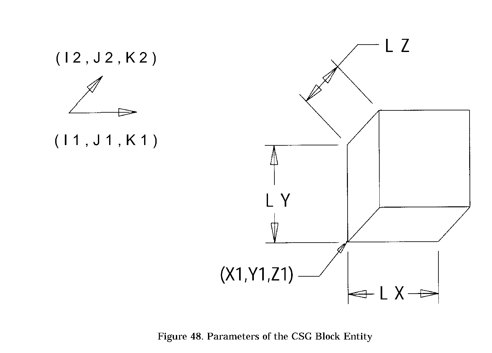

**Directory Entry**

| (1) Entity Type Number | (2) Parameter Data | (3) Structure | (4) Line Font Pattern | (5) Level | (6) View | (7) Xformation Matrix | (8) Label Display | (9) Status Number | (10) Sequence Number |
|---|---|---|---|---|---|---|---|---|---|
| 150 |  | < n.a. > |  |  |  |  |  | ????00** | D# |

| (11) Entity Type Number | (12) Line Weight | (13) Color Number | (14) Parameter Line Count | (15) Form Number | (16) Reserved | (17) Reserved | (18) Entity Label | (19) Entity Subscript | (20) Sequence Number |
|---|---|---|---|---|---|---|---|---|---|
| 150 |  |  |  |  |  |  |  |  | D#+1 |

**Parameter Data** *(ECO630)*

| Index | Name | Type | Description |
|---|---|---|---|
| 1 | LX | Real | Length in the local X-direction |
| 2 | LY | Real | Length in the local Y-direction |
| 3 | LZ | Real | Length in the local Z-direction |
| 4 | X1 | Real | Corner point coordinates (default (0.0,0.0,0.0)) |
| 5 | Y1 | Real |  |
| 6 | Z1 | Real |  |
| 7 | I1 | Real | Unit vector defining local X-axis (default (1.0,0.0,0.0)) |
| 8 | J1 | Real |  |
| 9 | K1 | Real |  |
| 10 | I2 | Real | Unit vector defining local Z-axis (default (0.0,0.0,1.0)) |
| 11 | J2 | Real |  |
| 12 | K2 | Real |  |

Additional pointers as required (see Section 2.2.4.5.2).

## 4.38 Right Angular Wedge Entity (Type 152)

The right angular wedge is defined with one vertex at (X1,Y1,Z1) and three orthogonal edges lying along the local +X, +Y, and +Z axes. Figure 49 shows an example. A triangular/trapezoidal face lies in the local XY-plane. The local X-axis is defined by the unit vector (I1,J1,K1) and the local Z-axis by (I2,J2,K2). The local Y-axis is derived by taking the cross product of Z into X. The resulting local system shall be orthogonal, with (I1,J1,K1) values having the highest accuracy precedence. The wedge is specified by the positive lengths LX, LY, LZ along these axes and the length LTX (where LTX<LX) in the local positive X-direction at a distance LY (in the local Y-direction) from the local X-axis. If LTX=0, the wedge has five faces, two of which are triangular; otherwise, it has six faces. *(ECO630)*

**Figure 49:** Parameters of the CSG Right Angular Wedge Entity

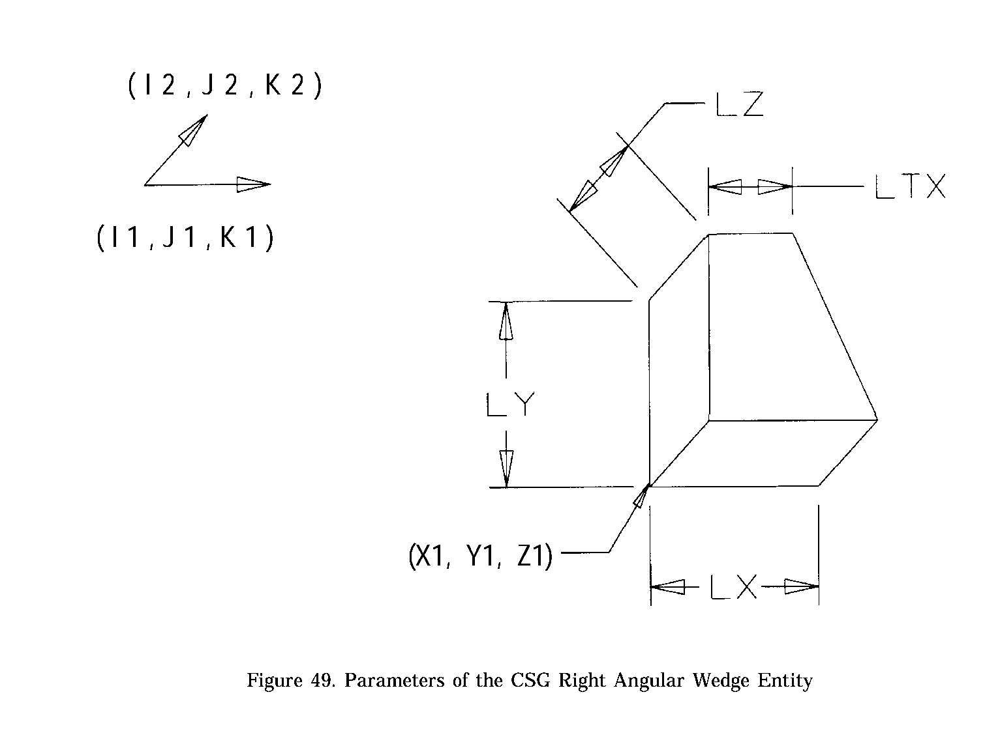

**Directory Entry**

| (1) Entity Type Number | (2) Parameter Data | (3) Structure | (4) Line Font Pattern | (5) Level | (6) View | (7) Xformation Matrix | (8) Label Display | (9) Status Number | (10) Sequence Number |
|---|---|---|---|---|---|---|---|---|---|
| 152 |  | < n.a. > |  |  |  |  |  | ????00** | D# |

| (11) Entity Type Number | (12) Line Weight | (13) Color Number | (14) Parameter Line Count | (15) Form Number | (16) Reserved | (17) Reserved | (18) Entity Label | (19) Entity Subscript | (20) Sequence Number |
|---|---|---|---|---|---|---|---|---|---|
| 152 |  |  |  |  |  |  |  |  | D#+1 |

**Parameter Data** *(ECO630)*

| Index | Name | Type | Description |
|---|---|---|---|
| 1 | LX | Real | Length in the local X-direction at Y=0.0 |
| 2 | LY | Real | Length in the local Y-direction |
| 3 | LZ | Real | Length in the local Z-direction |
| 4 | LTX | Real | Length in the local X-direction at distance LY from local X-axis |
| 5 | X1 | Real | Corner point coordinates (default (0.0,0.0,0.0)) |
| 6 | Y1 | Real |  |
| 7 | Z1 | Real |  |
| 8 | I1 | Real | Unit vector defining local X-axis (default (1.0,0.0,0.0)) |
| 9 | J1 | Real |  |
| 10 | K1 | Real |  |
| 11 | I2 | Real | Unit vector defining local Z-axis (default (0.0,0.0,1.0)) |
| 12 | J2 | Real |  |
| 13 | K2 | Real |  |

Additional pointers as required (see Section 2.2.4.5.2).

## 4.39 Right Circular Cylinder Entity (Type 154)

The right circular cylinder is defined by the center of one circular cylinder face, a unit vector, a height, and a radius as shown in Figure 50. The faces are perpendicular to the unit vector in the axis direction (I1,J1,K1) and are circular discs with the specified radius R (where R > 0.0). The height H (where H > 0.0) is the distance from the first circular face center in the positive direction of the unit vector to the second circular face center. *(ECO630)*

**Figure 50:** Parameters of the CSG Right Circular Cylinder Entity

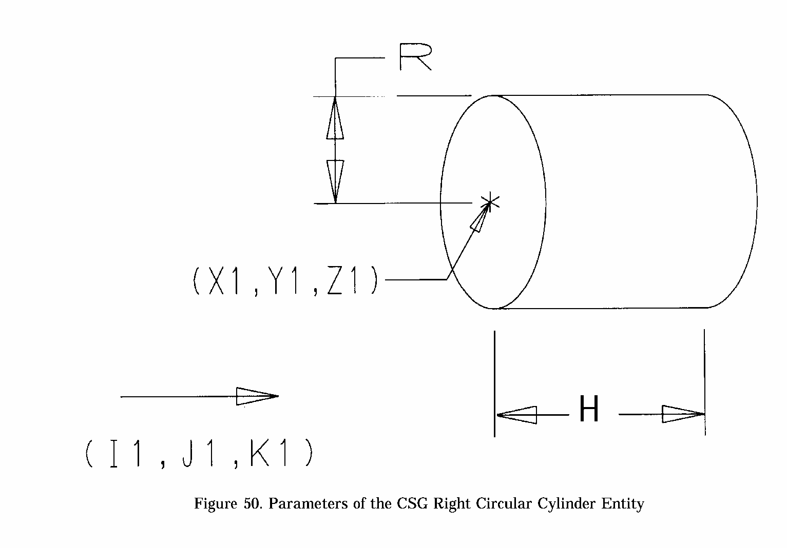

**Directory Entry**

| (1) Entity Type Number | (2) Parameter Data | (3) Structure | (4) Line Font Pattern | (5) Level | (6) View | (7) Xformation Matrix | (8) Label Display | (9) Status Number | (10) Sequence Number |
|---|---|---|---|---|---|---|---|---|---|
| 154 |  | < n.a. > |  |  |  |  |  | ????00** | D# |

| (11) Entity Type Number | (12) Line Weight | (13) Color Number | (14) Parameter Line Count | (15) Form Number | (16) Reserved | (17) Reserved | (18) Entity Label | (19) Entity Subscript | (20) Sequence Number |
|---|---|---|---|---|---|---|---|---|---|
| 154 |  |  |  |  |  |  |  |  | D#+1 |

**Parameter Data** *(ECO630)*

| Index | Name | Type | Description |
|---|---|---|---|
| 1 | H | Real | Cylinder height |
| 2 | R | Real | Cylinder radius |
| 3 | X1 | Real | First face center coordinates (default (0.0,0.0,0.0)) |
| 4 | Y1 | Real |  |
| 5 | Z1 | Real |  |
| 6 | I1 | Real | Unit vector in axis direction (default (0.0,0.0,1.0)) |
| 7 | J1 | Real |  |
| 8 | K1 | Real |  |

Additional pointers as required (see Section 2.2.4.5.2).

## 4.40 Right Circular Cone Frustum Entity (Type 156)

The right circular cone frustum is defined by the center of the larger circular face of the frustum (X1,Y1,Z1), its radius R1, a unit vector in the axis direction (I1,J1,K1), a height H in this direction, and a second circular face with radius R2, where R1 > R2 $\geq$ 0.0 and H > 0.0. As shown by Figure 51, the circular faces are perpendicular to the unit vector (I1,J1,K1). *(ECO630)*

**Figure 51:** Parameters of the CSG Right Circular Cone Frustum Entity

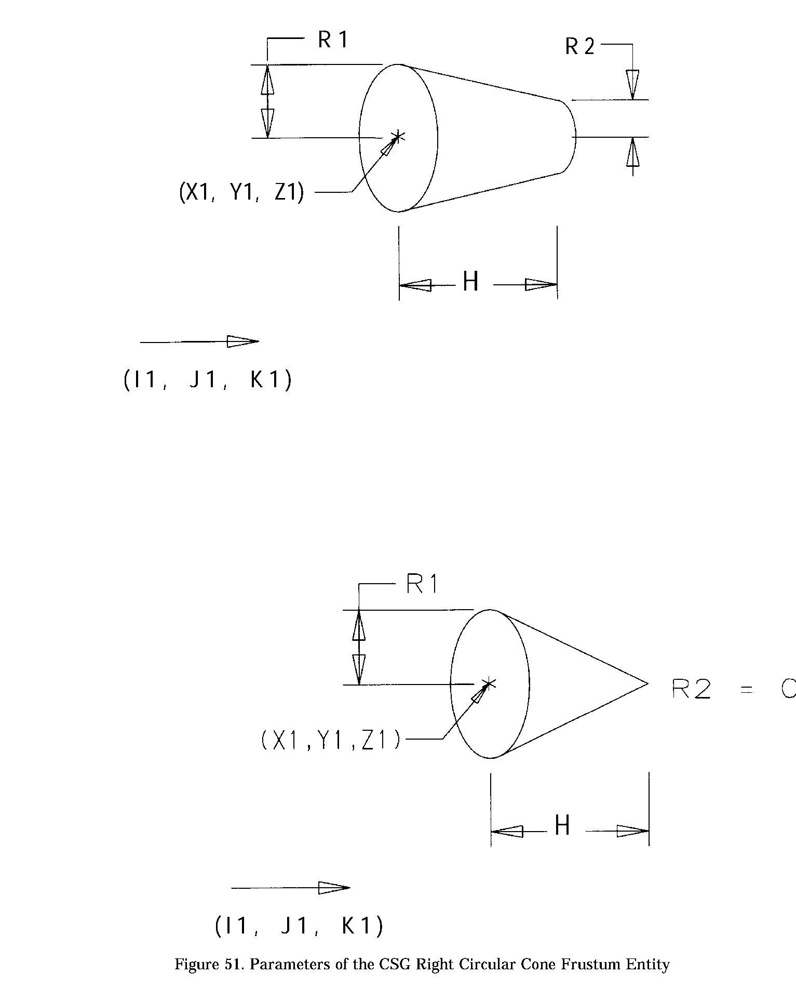

**Directory Entry**

| (1) Entity Type Number | (2) Parameter Data | (3) Structure | (4) Line Font Pattern | (5) Level | (6) View | (7) Xformation Matrix | (8) Label Display | (9) Status Number | (10) Sequence Number |
|---|---|---|---|---|---|---|---|---|---|
| 156 |  | < n.a. > |  |  |  |  |  | ????00** | D# |

| (11) Entity Type Number | (12) Line Weight | (13) Color Number | (14) Parameter Line Count | (15) Form Number | (16) Reserved | (17) Reserved | (18) Entity Label | (19) Entity Subscript | (20) Sequence Number |
|---|---|---|---|---|---|---|---|---|---|
| 156 |  |  |  |  |  |  |  |  | D#+1 |

**Parameter Data** *(ECO630)*

| Index | Name | Type | Description |
|---|---|---|---|
| 1 | H | Real | Height |
| 2 | R1 | Real | Larger face radius |
| 3 | R2 | Real | Smaller face radius (zero for cone apex — default) |
| 4 | X1 | Real | Larger face center coordinates (default (0.0,0.0,0.0)) |
| 5 | Y1 | Real |  |
| 6 | Z1 | Real |  |
| 7 | I1 | Real | Unit vector in axis direction (default (0.0,0.0,1.0)) |
| 8 | J1 | Real |  |
| 9 | K1 | Real |  |

Additional pointers as required (see Section 2.2.4.5.2).

## 4.41 Sphere Entity (Type 158)

The sphere is defined with its center coordinates at (X1,Y1,Z1) and a radius R, where R > 0.0. Figure 52 shows an example. *(ECO630)*

**Figure 52:** Parameters of the CSG Sphere Entity

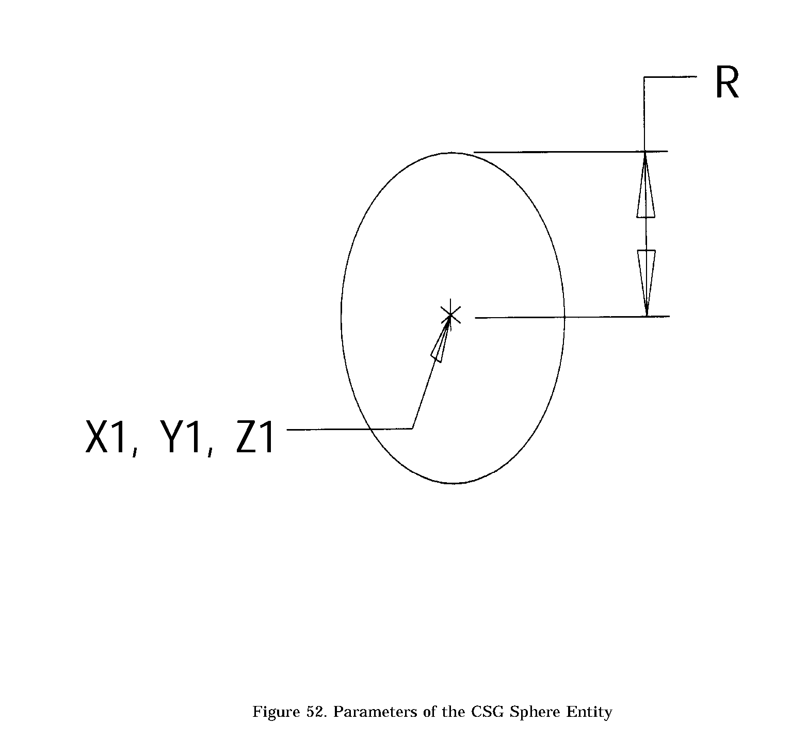

**Directory Entry**

| (1) Entity Type Number | (2) Parameter Data | (3) Structure | (4) Line Font Pattern | (5) Level | (6) View | (7) Xformation Matrix | (8) Label Display | (9) Status Number | (10) Sequence Number |
|---|---|---|---|---|---|---|---|---|---|
| 158 |  | < n.a. > |  |  |  |  |  | ????00** | D# |

| (11) Entity Type Number | (12) Line Weight | (13) Color Number | (14) Parameter Line Count | (15) Form Number | (16) Reserved | (17) Reserved | (18) Entity Label | (19) Entity Subscript | (20) Sequence Number |
|---|---|---|---|---|---|---|---|---|---|
| 158 |  |  |  |  |  |  |  |  | D#+1 |

**Parameter Data** *(ECO630)*

| Index | Name | Type | Description |
|---|---|---|---|
| 1 | R | Real | Radius |
| 2 | X1 | Real | Center coordinates (default (0.0,0.0,0.0)) |
| 3 | Y1 | Real |  |
| 4 | Z1 | Real |  |

Additional pointers as required (see Section 2.2.4.5.2).

## 4.42 Torus Entity (Type 160)

The torus is the solid formed by revolving a circular disc about a specified coplanar axis. R1 is the distance from the axis to the center of the defining disc, and R2 is the radius of the defining disc, where R1 > R2 > 0.0. The torus is located with its center at (X1,Y1,Z1), and its axis is oriented in the (I1,J1,K1) direction, as shown in Figure 53. *(ECO630)*

**Figure 53:** Parameters of the CSG Torus Entity

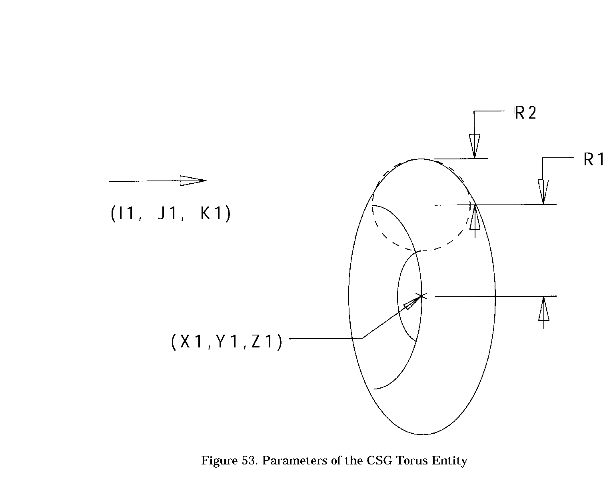

**Directory Entry**

| (1) Entity Type Number | (2) Parameter Data | (3) Structure | (4) Line Font Pattern | (5) Level | (6) View | (7) Xformation Matrix | (8) Label Display | (9) Status Number | (10) Sequence Number |
|---|---|---|---|---|---|---|---|---|---|
| 160 |  | < n.a. > |  |  |  |  |  | 00000000 | D# |

| (11) Entity Type Number | (12) Line Weight | (13) Color Number | (14) Parameter Line Count | (15) Form Number | (16) Reserved | (17) Reserved | (18) Entity Label | (19) Entity Subscript | (20) Sequence Number |
|---|---|---|---|---|---|---|---|---|---|
| 160 |  |  |  |  |  |  |  |  | D#+1 |

**Parameter Data** *(ECO630)*

| Index | Name | Type | Description |
|---|---|---|---|
| 1 | R1 | Real | Distance from center of torus to center of circular disc to be revolved (perpendicular to axis) |
| 2 | R2 | Real | Radius of circular disc |
| 3 | X1 | Real | Torus center coordinates (default (0.0,0.0,0.0)) |
| 4 | Y1 | Real |  |
| 5 | Z1 | Real |  |
| 6 | I1 | Real | Unit vector in axis direction (default (0.0,0.0,1.0)) |
| 7 | J1 | Real |  |
| 8 | K1 | Real |  |

Additional pointers as required (see Section 2.2.4.5.2).

## 4.43 Solid of Revolution Entity (Type 162)

The Solid of Revolution Entity defines the solid created by revolving the area determined by a planar curve about a specified co-planar axis. The revolution is a given fraction of a full rotation F (0.0 < F $\leq$ 1.0), using the right-hand rule (counterclockwise when viewed from the positive direction). The curve shall not intersect itself. It shall not cross the axis but may touch it. Figure 54 shows an example. *(ECO630)*

Two form numbers are used to indicate how the area is determined from the curve. If the curve is closed, the form number shall be set to 1, and the area enclosed by the curve is used. If the curve is not closed and the form number is 0 projections are made from the ends of the curve to the rotation axis; the area enclosed by the curve, the projections, and the axis is used. In this case, the curve shall be such that it does not intersect the projections, except at the end points. If the curve is not closed and the form number is 1, the curve is closed by adding a line connecting its end points, and the area enclosed by the curve and the added line is used. In this case, the curve shall not intersect the added line, except at the end points. *(ECO630)*

For the Solid of Revolution Entity, the Form Numbers are as follows: *(ECO630)*

| Form | Meaning |
|---|---|
| 0 | Curve is not closed; the area is bounded by the curve, projections from its ends to the axis, and a portion of the axis |
| 1 | Curve is closed; the enclosed area is used |

**Figure 54:** Parameters of the CSG Solid of Revolution Entity

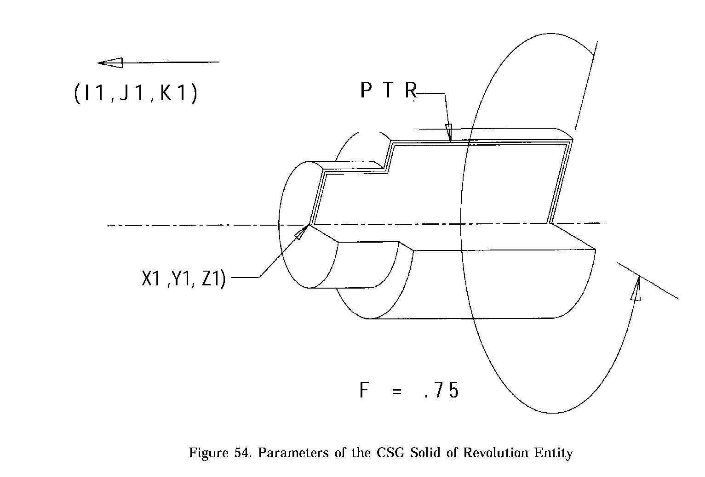

**Directory Entry**

| (1) Entity Type Number | (2) Parameter Data | (3) Structure | (4) Line Font Pattern | (5) Level | (6) View | (7) Xformation Matrix | (8) Label Display | (9) Status Number | (10) Sequence Number |
|---|---|---|---|---|---|---|---|---|---|
| 162 |  | < n.a. > |  |  |  |  |  | ????00** | D# |

| (11) Entity Type Number | (12) Line Weight | (13) Color Number | (14) Parameter Line Count | (15) Form Number | (16) Reserved | (17) Reserved | (18) Entity Label | (19) Entity Subscript | (20) Sequence Number |
|---|---|---|---|---|---|---|---|---|---|
| 162 |  |  |  | 0-1 |  |  |  |  | D#+1 |

**Parameter Data** *(ECO630)*

| Index | Name | Type | Description |
|---|---|---|---|
| 1 | PTR | Pointer | Pointer to the DE of the curve entity to be revolved. The curve must be coplanar with rotation axis. |
| 2 | F | Real | Fraction of full rotation through which the curve entity will be revolved; default 1 |
| 3 | X1 | Real | Coordinates of point on axis (default (0.0,0.0,0.0)) |
| 4 | Y1 | Real |  |
| 5 | Z1 | Real |  |
| 6 | I1 | Real | Unit vector in axis direction (default (0.0,0.0,1.0)) |
| 7 | J1 | Real |  |
| 8 | K1 | Real |  |

Additional pointers as required (see Section 2.2.4.5.2).

## 4.44 Solid of Linear Extrusion Entity (Type 164)

The solid of linear extrusion is defined by translating an area determined by a planar curve. The curve as indicated by PTR in Figure 55 must be closed and nonintersecting. The direction of the translation is defined by a unit vector (I1,J1,K1) and the length of the translation is defined by L, where L > 0.0. The vector (I1,J1,K1) must not be coplanar with the closed curve. *(ECO630)*

**Figure 55:** Parameters of the CSG Solid of Linear Extrusion Entity

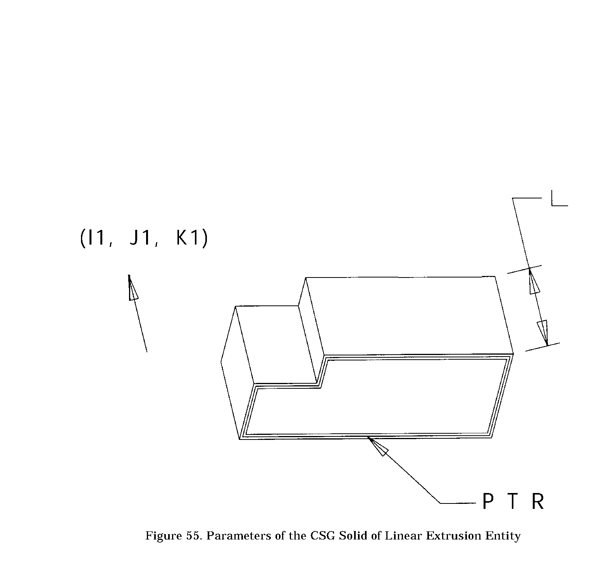

**Directory Entry**

| (1) Entity Type Number | (2) Parameter Data | (3) Structure | (4) Line Font Pattern | (5) Level | (6) View | (7) Xformation Matrix | (8) Label Display | (9) Status Number | (10) Sequence Number |
|---|---|---|---|---|---|---|---|---|---|
| 164 |  | < n.a. > |  |  |  |  |  | ????00** | D# |

| (11) Entity Type Number | (12) Line Weight | (13) Color Number | (14) Parameter Line Count | (15) Form Number | (16) Reserved | (17) Reserved | (18) Entity Label | (19) Entity Subscript | (20) Sequence Number |
|---|---|---|---|---|---|---|---|---|---|
| 164 |  |  |  |  |  |  |  |  | D#+1 |

**Parameter Data** *(ECO630)*

| Index | Name | Type | Description |
|---|---|---|---|
| 1 | PTR | Pointer | Pointer to the DE of the closed curve entity |
| 2 | L | Real | Length of extrusion along the vector positive direction |
| 3 | I1 | Real | Unit vector specifying direction of extrusion (default (0.0,0.0,1.0)) |
| 4 | J1 | Real |  |
| 5 | K1 | Real |  |

Additional pointers as required (see Section 2.2.4.5.2).

## 4.45 Ellipsoid Entity (Type 168)

The ellipsoid is a solid bounded by the surface defined by:

$$\frac{X^2}{LX^2} + \frac{Y^2}{LY^2} + \frac{Z^2}{LZ^2} = 1$$

when centered at the origin and aligned with its major axis (LX) in the X direction and with the minor axis (LZ) in the Z direction. A major axis of an ellipsoid can be found by choosing a point on the surface farthest from the center and constructing the line from that point through the center. The plane through the center perpendicular to this major axis intersects the surface of the ellipsoid in an ellipse. The other two axes of the ellipsoid are the axes of this ellipse.

The ellipsoid is defined with its center at (X1,Y1,Z1) and its three axes coincident with the local X, Y, Z axes, as shown in Figure 56. The local X-axis is defined by the unit vector (I1,J1,K1) and the local Z-axis by (I2,J2,K2). The local Y-axis is derived by taking the cross product of Z into X. The resulting local system shall be orthogonal, with (I1,J1,K1) values having the highest accuracy precedence. The ellipsoid is specified by positive lengths (LX, LY, and LZ respectively, where LX $\geq$ LY $\geq$ LZ > 0.0) from the local origin to the surface along the local +X, +Y, +Z axes. *(ECO630)*

**Figure 56:** Parameters of the CSG Ellipsoid Entity

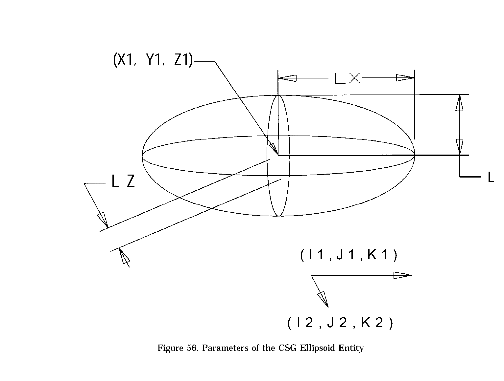

**Directory Entry**

| (1) Entity Type Number | (2) Parameter Data | (3) Structure | (4) Line Font Pattern | (5) Level | (6) View | (7) Xformation Matrix | (8) Label Display | (9) Status Number | (10) Sequence Number |
|---|---|---|---|---|---|---|---|---|---|
| 168 |  | < n.a. > |  |  |  |  |  | ????00** | D# |

| (11) Entity Type Number | (12) Line Weight | (13) Color Number | (14) Parameter Line Count | (15) Form Number | (16) Reserved | (17) Reserved | (18) Entity Label | (19) Entity Subscript | (20) Sequence Number |
|---|---|---|---|---|---|---|---|---|---|
| 168 |  |  |  |  |  |  |  |  | D#+1 |

**Parameter Data** *(ECO630)*

| Index | Name | Type | Description |
|---|---|---|---|
| 1 | LX | Real | Length in the local X-direction |
| 2 | LY | Real | Length in the local Y-direction |
| 3 | LZ | Real | Length in the local Z-direction |
| 4 | X1 | Real | Coordinates of point in center of ellipsoid (default (0.0,0.0,0.0)) |
| 5 | Y1 | Real |  |
| 6 | Z1 | Real |  |
| 7 | I1 | Real | Unit vector defining local X-axis (Ellipsoid major axis) (default (1.0,0.0,0.0)) |
| 8 | J1 | Real |  |
| 9 | K1 | Real |  |
| 10 | I2 | Real | Unit vector defining local Z-axis (Ellipsoid minor axis) (default (0.0,0.0,1.0)) |
| 11 | J2 | Real |  |
| 12 | K2 | Real |  |

Additional pointers as required (see Section 2.2.4.5.2).

## 4.46 Boolean Tree Entity (Type 180)

The Boolean tree describes a binary tree structure composed of regularized Boolean operations and operands, in postorder notation. A regularized Boolean operation is defined as the closure of the interior of the result of a Boolean set operation. Specifically, denote the interior of a set X by $X_o$, the closure of X by $\overline{X}$ and use $\cup^*$, $\cap^*$, and $-^*$ to denote the regularized Boolean operations intersection, and difference, respectively. Then:

$$\begin{aligned}
X \cup^* Y &= \overline{(X \cup Y)_o} \\
X \cap^* Y &= \overline{(X \cap Y)_o} \\
X -^* Y &= \overline{(X - Y)_o}
\end{aligned}$$

Since the topological space under consideration is a 3-dimensional space, all lower dimensional entities resulting from these operations will disappear. A discussion of regularized Boolean operations can be found in [TIL080].

All operations are assigned integers as follows:

| Integer | Operation |
|---|---|
| 1 | Union |
| 2 | Intersection |
| 3 | Difference |

Allowable operands are:

- Primitive entities
- Boolean Tree Entities
- Solid Instance Entities
- Manifold Solid B-Rep Object Entities *(ECO644)*

The parameter data entries for the Boolean Tree Entity can be operation codes (integers) or pointers to operands. A positive (or unsigned) value in a parameter data entry implies an operation code; a negative value implies the absolute value is to be taken as a pointer to an operand.

A transformation matrix may be pointed to by Field 7 of the DE to position the resulting solid in any desired manner.

For the Boolean Tree Entity, the Form Numbers are as follows: *(ECO630)*

| Form | Meaning |
|---|---|
| 0 | All operands are primitives, solid instances, or other Boolean trees |
| 1 | At least one operand is a manifold solid B-Rep object entity |

Figure 57 shows an example of a Boolean tree composed of five operands and four operations with values as follows:

| Parameter | Value |
|---|---|
| 1 | 9 |
| 2 | PTRA (negative) |
| 3 | PTRB (negative) |
| 4 | PTRC (negative) |
| 5 | 1 |
| 6 | 3 |
| 7 | PTRD (negative) |
| 8 | PTRE (negative) |
| 9 | 2 |
| 10 | 1 |

**Figure 57:** Example of a Boolean Tree

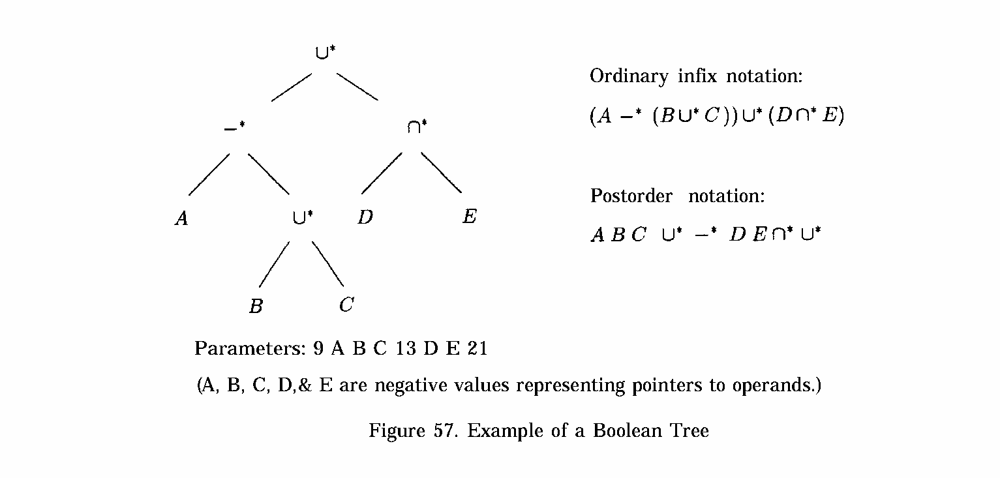

**Directory Entry**

| (1) Entity Type Number | (2) Parameter Data | (3) Structure | (4) Line Font Pattern | (5) Level | (6) View | (7) Xformation Matrix | (8) Label Display | (9) Status Number | (10) Sequence Number |
|---|---|---|---|---|---|---|---|---|---|
| 180 |  | < n.a. > |  |  |  |  |  | ????00?? | D# |

| (11) Entity Type Number | (12) Line Weight | (13) Color Number | (14) Parameter Line Count | (15) Form Number | (16) Reserved | (17) Reserved | (18) Entity Label | (19) Entity Subscript | (20) Sequence Number |
|---|---|---|---|---|---|---|---|---|---|
| 180 |  |  |  |  |  |  |  |  | D#+1 |

Note: When the Hierarchy is set to Global Defer (01), all of the following are ignored and may be defaulted: Line Font Pattern, Line Weight, Color Number, Level, View, and Blank Status. *(ECO630)*

**Parameter Data**

| Index | Name | Type | Description |
|---|---|---|---|
| 1 | N | Integer | Length of post-order notation, including operations and operands (N > 2) |
| 2 | PTR(1) | Pointer | Negated pointer to the DE of the first operand |
| 3 | PTR(2) | Pointer | Negated pointer to the DE of the second operand |
| 4 | PTR(3) or IOP(1) | Pointer or Integer | Negated pointer to the DE of the third operand, or Integer for the first operation |
| ... | ... | ... | ... |
| N | PTR(M) or IOP(L−1) | Pointer or Integer | Negated pointer to the DE of the last operand, or Integer for next-to-last operation |
| N+1 | IOP(L) | Integer | Integer for last operation |

Additional pointers as required (see Section 2.2.4.5.2).

Notes: Parameters 2 and 3 will always be operands and thus will be negative numbers.
As L is the number of operations, and M is the number of operands, N = L+M.

## 4.47 Selected Component Entity (Type 182)‡

*The Selected Component Entity has not been tested. See Section 1.9.* *(ECO630)*

The Selected Component Entity provides a means of selecting one component of a disjoint CSG solid.

**Directory Entry**

| (1) Entity Type Number | (2) Parameter Data | (3) Structure | (4) Line Font Pattern | (5) Level | (6) View | (7) Xformation Matrix | (8) Label Display | (9) Status Number | (10) Sequence Number |
|---|---|---|---|---|---|---|---|---|---|
| 182 |  | < n.a. > | < n.a. > |  |  |  |  | **??03** | D# |

| (11) Entity Type Number | (12) Line Weight | (13) Color Number | (14) Parameter Line Count | (15) Form Number | (16) Reserved | (17) Reserved | (18) Entity Label | (19) Entity Subscript | (20) Sequence Number |
|---|---|---|---|---|---|---|---|---|---|
| 182 | < n.a. > |  |  |  |  |  |  |  | D#+1 |

**Parameter Data**

| Index | Name | Type | Description |
|---|---|---|---|
| 1 | BTREE | Pointer | Pointer to the DE of the Boolean Tree Entity |
| 2 | SELX | Real | X component of a point in or on the desired component |
| 3 | SELY | Real | Y component of a point in or on the desired component |
| 4 | SELZ | Real | Z component of a point in or on the desired component |

Additional pointers as required (see Section 2.2.4.5.2).

## 4.48 Solid Assembly Entity (Type 184)

A solid assembly is a collection of items which possess a shared fixed geometric relationship. It differs from a union of the items in that each item retains its own structure, even if the items touch.

The transformation matrices are applied to the items individually before a matrix referenced by Field 7 of the DE is applied to the collection. A value of zero in the pointer field indicates the identity matrix. *(ECO630)*

For the Solid Assembly Entity, the Form Numbers are as follows: *(ECO644)*

| Form | Meaning |
|---|---|
| 0 | All items are primitives, solid instances, Boolean trees, or other assemblies |
| 1 | At least one item is a manifold solid B-Rep object entity |

**Directory Entry**

| (1) Entity Type Number | (2) Parameter Data | (3) Structure | (4) Line Font Pattern | (5) Level | (6) View | (7) Xformation Matrix | (8) Label Display | (9) Status Number | (10) Sequence Number |
|---|---|---|---|---|---|---|---|---|---|
| 184 |  | < n.a. > |  |  |  |  |  | ????02?? | D# |

| (11) Entity Type Number | (12) Line Weight | (13) Color Number | (14) Parameter Line Count | (15) Form Number | (16) Reserved | (17) Reserved | (18) Entity Label | (19) Entity Subscript | (20) Sequence Number |
|---|---|---|---|---|---|---|---|---|---|
| 184 |  |  |  |  |  |  |  |  | D#+1 |

Note: When the Hierarchy is set to Global Defer (01), all of the following are ignored and may be defaulted: Line Font Pattern, Line Weight, Color Number, Level, View, and Blank Status. *(ECO630)*

**Parameter Data** *(ECO650)*

| Index | Name | Type | Description |
|---|---|---|---|
| 1 | N | Integer | Number of items |
| 2 | PTR(1) | Pointer | Pointer to the DE of the first item |
| ... | ... | ... | ... |
| 1+N | PTR(N) | Pointer | Pointer to the DE of the last item |
| 2+N | PTRM(1) | Pointer | Pointer to the DE of the Transformation Matrix Entity for the first item |
| ... | ... | ... | ... |
| 1+2*N | PTRM(N) | Pointer | Pointer to the DE of the Transformation Matrix Entity for the last item |

Additional pointers as required (see Section 2.2.4.5.2).

## 4.49 Manifold Solid B-Rep Object Entity (Type 186)‡

*The Manifold Solid B-Rep Object Entity has not been tested. See Section 1.9.* *(ECO630)*

A manifold solid is a bounded, closed, and finite volume V in three dimensional Euclidean space, $\mathbb{R}^3$. V is restricted to be the closure of the interior of V which shall be arcwise connected. There is no restriction on the number of voids within V or on the genus of the boundary surfaces. Discussion of the manifold solid from a graph theoretic view is contained in Appendix I.

The Manifold Solid B-Rep Object (MSBO) defines a manifold solid by enumerating its boundary. This boundary may be decomposed into its maximal connected components called closed shells. Each shell is composed of faces which have underlying surface geometry. The faces are bounded by loops of edges having underlying curve geometry. The edges are bounded by vertices whose underlying geometry is the point. Implicit in the representation is a concept of oriented uses of topological entities by containing entities. This allows the referencing entity to reverse the natural orientation of the referenced entity. The natural orientation is derived from the underlying geometry. Figure 58 illustrates the hierarchical nature of this representation. *(ECO627)*

The vertex represents a location. The geometry underlying a vertex is a point in $\mathbb{R}^3$.

An edge connects two vertices. It is bounded by two vertices ($V_1$ and $V_2$). It does not contain its bounds. The start and terminate vertices do not have to be distinct. Edges do not intersect except at their boundaries (i.e., vertices). The geometry underlying an edge is some portion of a curve in $\mathbb{R}^3$. The edge has a natural orientation in the same direction as its underlying curve in $\mathbb{R}^3$. Thus the edge is traced from start vertex to terminate vertex as the underlying curve is traced in the direction of increasing parameter value. Each edge is used once in each orientation and therefore shall be referenced exactly twice in an MSBO.

The loop is a path of oriented edges and vertices having the same start and terminate vertex. Typically, a loop represents a connected collection of face boundaries, seams, and poles of a single face (refer to Figures in Appendix I). Its underlying geometry is a connected curve or a single point in $\mathbb{R}^3$. The loop is represented as an ordered list of oriented edges, edge-uses ($EU_i$, $i = 1, n$), which has the following properties:

- The terminal vertex of $EU_i$ is the initial vertex of $EU_{i+1}$, $i = 1, n-1$.
- The loop is closed. This implies that the terminal vertex of $EU_n$ is the same as the initial vertex of $EU_1$.

The orientation of the loop is defined to be the same as its constituent edge-uses which reference edges. Therefore the direction of the loop at an edge-use which references a vertex, A, can be taken from any edge-use having an underlying edge which has A as either its start or terminate vertex.

The edge-use is an instancing of an edge or vertex into a loop. It consists of either an edge, an orientation, and optional parameter space curves (see the definitions of associated parameter space and collections in the Boundary Entity (Type 141)), or (in the case of a pole) a vertex and an optional parameter space curve.

If the edge-use references an edge, then the orientation describes whether the direction of this use of the edge is in agreement with the natural orientation of the edge. If the orientation of the edge-use is in agreement with the edge, then the use is directed from the start vertex to the terminate vertex of the edge. If the orientation is not in agreement, then the use of the edge is directed from the terminate vertex to the start vertex. At any point the direction of an edge-use is called its topological tangent vector, T. See the face discussion to determine how to set the orientation. If the edge-use references a vertex, then no orientation is defined.

The face is a bound (partial) of an arcwise connected open subset of $\mathbb{R}^3$ and has finite area. It has an underlying surface, S, and is bounded by at least one loop. If more than one loop bounds a face, then the loops shall be disjoint. The cross product, $N \times T$, where $N$ is in the same direction as the normal to S and $T$ is the topological tangent vector of an edge-use in a loop bounding the face, points toward the material of the face. Note that this determines the edge-use orientation.

The MSBO shall point to one or more closed shells. The closed shell is represented as a set of edge connected oriented uses of faces (face-uses). The closed shell divides $\mathbb{R}^3$ into two arcwise-connected open subsets (parts). The normal of the shell is in the same direction as the normal of its face-uses. The normal of each face-use of the closed shell points toward the same part of $\mathbb{R}^3$. The normal of the face-use is assumed to be in the direction of the normal of the underlying surface of the face unless the face-use orientation indicates it needs to be reversed. The faces used by the shell are connected to each other only via edges. Each edge shall be used exactly twice, once in each orientation, in the closed shell. *(ECO627)*

The MSBO describes the boundaries of the solid via oriented uses of shells (shell-use). It is the orientation of the use of the shells which define the volume of $\mathbb{R}^3$ the MSBO is describing. The orientation of the shell-use is determined by the shell-use normal which is either in the same or opposite direction as the shell normal. By convention, the direction of the shell-use normal points away from the part of $\mathbb{R}^3$ being described. One shell, the outer, shall completely enclose all the other shells and only the outer shell shall enclose a shell.

The geometric entities that may be used in an MSBO consist of the point, curve, and surface. The point data is embedded in the Vertex Entity for reasons of data compaction. The entities that may be used for a curve are restricted to the subset identified for Form 1 of the Edge Entity. The subset of surface entities that may be used is identified in Form 1 of the Face Entity. To avoid processing difficulties, the use of nested constructs is discouraged. For example, allowing the Edge to point at a Composite Curve which uses an Offset Curve as one of its components is not recommended.

The geometric surface definition used to specify the geometry of a face shall be a 2-manifold which is arcwise connected, oriented, bounded, non-self-intersecting, and has no handles within the region underlying the face. The surfaces can be represented implicitly, $F(x, y, z) = 0$ or parametrically, $S(u, v)$. In the implicit representation the direction of the surface normal (orientation) is defined by the gradient of $F(x, y, z)$. If the surface is represented parametrically, the surface normal (orientation) is given by the cross product of the partial derivatives (in the order stated) with respect to $u$ and $v$.

The model space ($\mathbb{R}^3$) curves underlying the edges are assumed to be parametrically represented, have a unique non-zero tangent vector at each point, lie on the two (2) intersecting surfaces, and be non-self intersecting on the open segment underlying the edge.

Note that, due to seams and poles, the representation of the pre-image of the curve, C, in the parameter space of the surfaces, $S_1$ and $S_2$, can consist of ordered lists of curves, $C_{1i}^*$, $i = 1, n$ for surface $S_1$ and $C_{2j}^*$, $j = 1, m$ for surface $S_2$. The $C_{1i}$ given by the composition $(S_1 \circ C_{1i}^*, i = 1, n)$ and the $C_{2j}$ given by the composition $(S_2 \circ C_{2j}^*, j = 1, n)$ form composite curves in $\mathbb{R}^3$ which are coincident with the curve C.

The optional parameter space curves, $C_i^*$, $i = 1, n$, referenced by an edge-use are in the parameter space defined by the surface underlying the face bounded by the loop containing the referencing edge-use. These curves are assumed to be ordered in the list and oriented such that as the parameter goes from its initial to its final value for each parameter space curve the composition $(S \circ C_i^*, i = 1, n)$ produces a composite curve, $C_i$, $i = 1, n$, which is coincident with the curve underlying the edge. The orientation of $C_i$, $i = 1, n$ is in agreement with the orientation of the edge-use.

See Appendix I for examples that illustrate the general model for any entity modeling of a Cylinder, Sphere, and Torus.

The following is a summary of the major constraints on the topological and geometrical entities that may be used in representing the MSBO:

- The MSBO shall contain exactly one outer shell
- The volume described by the MSBO shall be arcwise connected. This implies that voids inside the outer shell shall not be contained in another void.
- The shells of an object shall be disjoint.
- The direction of the normals of the face-uses of a shell, reversed if the shell orientation flag is false, shall point away from the portion of $\mathbb{R}^3$ that is in the volume being communicated by the MSBO.
- The shells of an object shall be closed shells. *(ECO627)*
- The face interiors, edge interiors, and vertices shall not intersect.
- Only the MSBO and the $\mathbb{R}^3$ curve and surface entities shall have a transform.

The following topological entities may be used in representing the MSBO:

- **Manifold Solid B-Rep Object (MSBO) Entity (Type 186, Form 0)** Identifies the shell-uses (shell + orientation) which make up the MSBO.
- **Closed Shell Entity (Type 514, Form 1)** defines a boundary for a region of $\mathbb{R}^3$ by identifying and orienting the use of faces. *(ECO627)*
- **Face Entity (Type 510, Form 1)** implements the topological concept of a portion of a boundary of $\mathbb{R}^3$. The underlying surface is required.
- **Loop Entity (Type 508, Form 1)** identifies and orients the use of edges as bounds (partial) of faces. It also establishes the optional association of parameter space geometry.
- **Edge List Entity (Type 504, Form 1)** models an edge or a list of edges. Each edge referenced in an MSBO shall be modeled in only one Edge List Entity. Thus all references to a specific edge shall use the same Edge List Entity and list index. The underlying curve geometry in $\mathbb{R}^3$ is required.
- **Vertex List Entity (Type 502, Form 1)** models a vertex or a list of vertices. Each vertex referenced in an MSBO shall be modeled in only one Vertex List Entity. Thus all references to a specific vertex shall use the same Vertex List Entity and list index.

Figure 58 illustrates the hierarchical nature of a MSBO. Figure 59 illustrates the construction of a MSBO.

**Figure 58:** Hierarchical nature of the MSBO

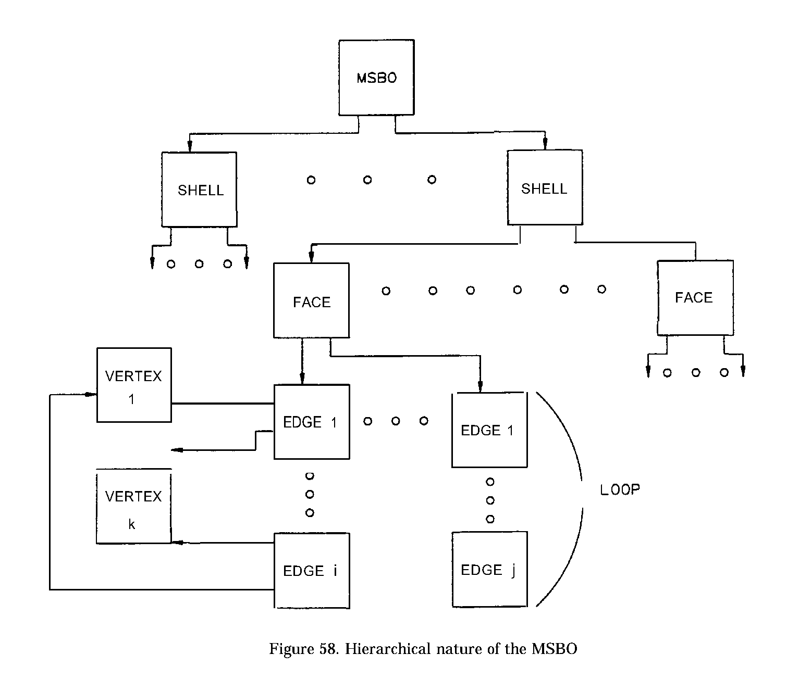

**Figure 59:** Construction of the MSBO

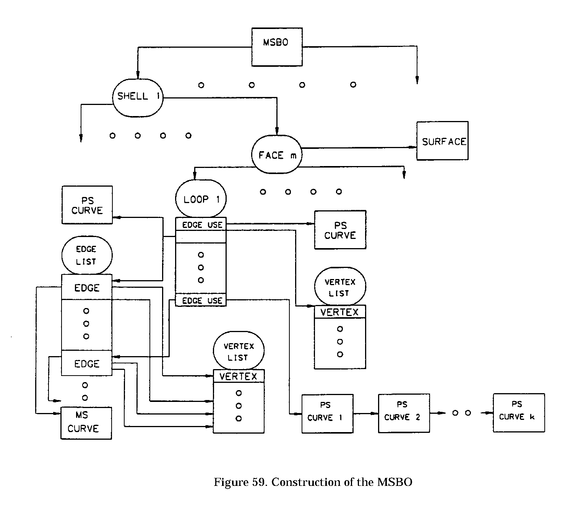

**Directory Entry**

| (1) Entity Type Number | (2) Parameter Data | (3) Structure | (4) Line Font Pattern | (5) Level | (6) View | (7) Xformation Matrix | (8) Label Display | (9) Status Number | (10) Sequence Number |
|---|---|---|---|---|---|---|---|---|---|
| 186 |  | < n.a. > | < n.a. > |  | < n.a. > |  |  | ???????? | D# |

| (11) Entity Type Number | (12) Line Weight | (13) Color Number | (14) Parameter Line Count | (15) Form Number | (16) Reserved | (17) Reserved | (18) Entity Label | (19) Entity Subscript | (20) Sequence Number |
|---|---|---|---|---|---|---|---|---|---|
| 186 | < n.a. > | < n.a. > |  |  |  |  |  |  | D#+1 |

**Parameter Data** *(ECO650, ECO627)*

| Index | Name | Type | Description |
|---|---|---|---|
| 1 | SHELL | Pointer | Pointer to the DE of the shell |
| 2 | SOF | Logical | Orientation flag of shell with respect to its underlying faces (True = agrees) |
| 3 | N | Integer | Number of void shells, or zero |
| 4 | VOID(1) | Pointer | Pointer to the DE of the first void shell |
| 5 | VOF(1) | Logical | Orientation flag of first void shell |
| ... | ... | ... | ... |
| 2+2*N | VOID(N) | Pointer | Pointer to the DE of the last void shell |
| 3+2*N | VOF(N) | Logical | Orientation flag of last void shell |

Additional pointers as required (see Section 2.2.4.5.2).

## 4.50 Plane Surface Entity (Type 190)‡

*The Plane Surface Entity has not been tested. See Section 1.9.* *(ECO630)*

The plane surface is defined by a point on the plane and the normal direction to the surface. (See Figure 60.)

If $C$ is the point and $z$ is the unitized normal direction, the plane surface is defined as the collection of all points $r$ in Euclidean 3-space satisfying the equation

$$r \cdot z - C \cdot z = 0$$

The data (Figure 61) for the parameterized surface form is to be interpreted as follows: *(ECO630)*

$$\begin{aligned}
C &= \text{LOCATION} \\
z &= \langle \text{NORMAL} \rangle \\
d &= \langle \text{REFDIR} \rangle \\
x &= \langle d - (d \cdot z)z \rangle \\
y &= \langle z \times x \rangle
\end{aligned}$$

and the surface is parameterized as

$$\sigma(u, v) = C + u\,x + v\,y,$$

where the parameterization range is $-\infty < u, v < \infty$.

Note that $d$ shall be distinct from $z$ and shall be approximately perpendicular to $z$.

For the Plane Surface Entity, the Form Numbers are as follows:

| Form | Meaning |
|---|---|
| 0 | Unparameterized surface |
| 1 | Parameterized surface |

The plane surface type is unbounded unless it is subordinate to another entity, such as the Bounded Surface Entity (Type 143) or the Trimmed Parametric Surface Entity (Type 144), that references its bounding geometry. If the Subordinate Entity Switch for this entity is set to Independent, the plane is infinite in extent.

This entity shall not be used as a clipping plane for a View Entity (Type 410). *(ECO630)*

**Figure 60:** Defining data for un-parameterized plane surface (Form Number = 0)

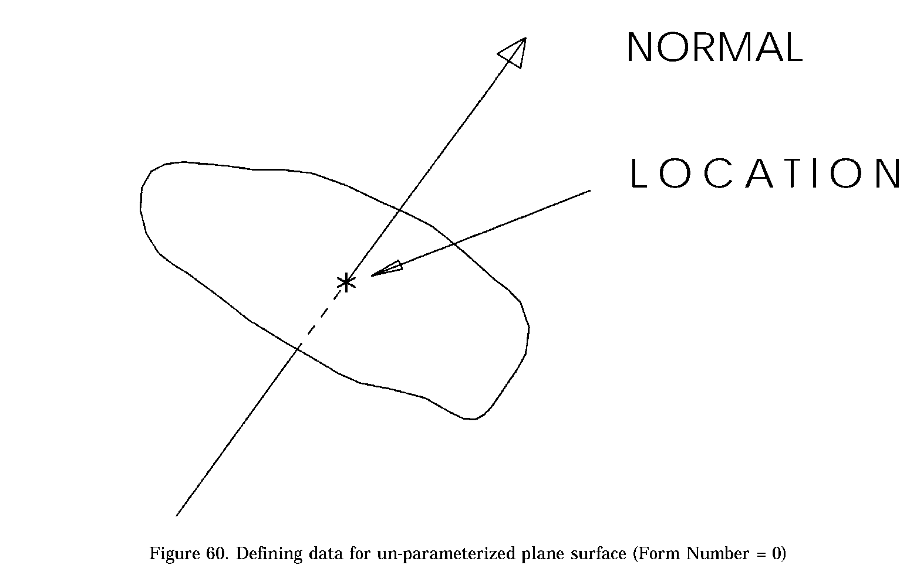

**Figure 61:** Defining data for parameterized plane surface (Form Number = 1)

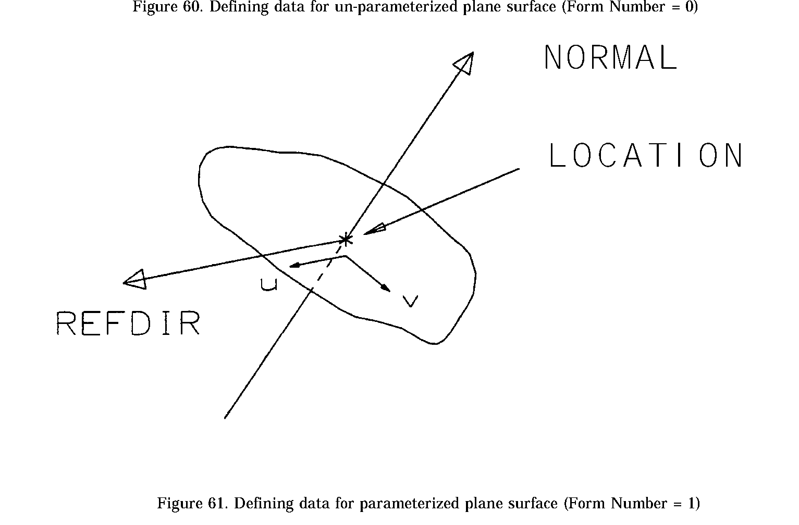

**Directory Entry**

| (1) Entity Type Number | (2) Parameter Data | (3) Structure | (4) Line Font Pattern | (5) Level | (6) View | (7) Xformation Matrix | (8) Label Display | (9) Status Number | (10) Sequence Number |
|---|---|---|---|---|---|---|---|---|---|
| 190 |  | < n.a. > |  |  |  |  |  | **????** | D# |

| (11) Entity Type Number | (12) Line Weight | (13) Color Number | (14) Parameter Line Count | (15) Form Number | (16) Reserved | (17) Reserved | (18) Entity Label | (19) Entity Subscript | (20) Sequence Number |
|---|---|---|---|---|---|---|---|---|---|
| 190 |  |  |  |  |  |  |  |  | D#+1 |

**Un-parameterized Plane Surface Entity (Type 190, Form 0)** *(ECO630)*

**Parameter Data**

| Index | Name | Type | Description |
|---|---|---|---|
| 1 | DELOC | Pointer | Pointer to the DE of the point on the surface (LOCATION) |
| 2 | DENRML | Pointer | Pointer to the DE of the surface normal direction (NORMAL) |

Additional pointers as required (see Section 2.2.4.5.2).

**Parameterized Plane Surface Entity (Type 190, Form 1)**

**Parameter Data**

| Index | Name | Type | Description |
|---|---|---|---|
| 1 | DELOC | Pointer | Pointer to the DE of the point on the surface (LOCATION) |
| 2 | DENRML | Pointer | Pointer to the DE of the surface normal direction (NORMAL) |
| 3 | DEREFD | Pointer | Pointer to the DE of the reference direction (REFDIR) |

Additional pointers as required (see Section 2.2.4.5.2).

## 4.51 Right Circular Cylindrical Surface Entity (Type 192)‡

*The Right Circular Cylindrical Surface Entity has not been tested. See Section 1.9.* *(ECO630)*

The right circular cylindrical surface is defined by a point on the axis of the cylinder, the direction of the axis of the cylinder and a radius. (See Figure 62.) The positive direction of the surface normal is outwards from the axis.

If a local coordinate system is defined with the origin at the axis point and the Z axis in the axis direction, then the equation of the surface in this system is $S = 0$ where

$$S(x, y, z) = x^2 + y^2 - r^2$$

and the positive direction of the surface normal is in the direction of increasing $S$. That is, the normal, $N$, to the surface at any point on the surface is given by

$$N = (S_x, S_y, S_z)$$

The data for the parameterized form of the surface (Figure 63) is to be interpreted as follows:

$$\begin{aligned}
C &= \text{LOCATION} \\
z &= \langle \text{AXIS} \rangle \\
d &= \langle \text{REFDIR} \rangle \\
x &= \langle d - (d \cdot z)z \rangle \\
y &= \langle z \times x \rangle \\
r &= \text{RADIUS}
\end{aligned}$$

and the surface is parameterized as

$$\sigma(u, v) = C + r(\cos(u)\,x + \sin(u)\,y) + v\,z$$

where the parameterization range is $0 \leq u \leq 360$ degrees and $-\infty < v < \infty$.

Note that $d$ shall be distinct from $z$ and shall be approximately perpendicular to $z$.

For the Right Circular Cylindrical Surface Entity, the Form Numbers are as follows:

| Form | Meaning |
|---|---|
| 0 | Unparameterized Surface |
| 1 | Parameterized Surface |

This surface type is intended to represent the geometry underlying topology, and shall only be referenced by a Face Entity (Type 510, Form 1). The Subordinate Entity Switch shall always be set to Physically Dependent; i.e., independent instances of this entity are not permitted.

**Figure 62:** Defining data for un-parameterized right circular cylindrical surface (Form Number = 0)

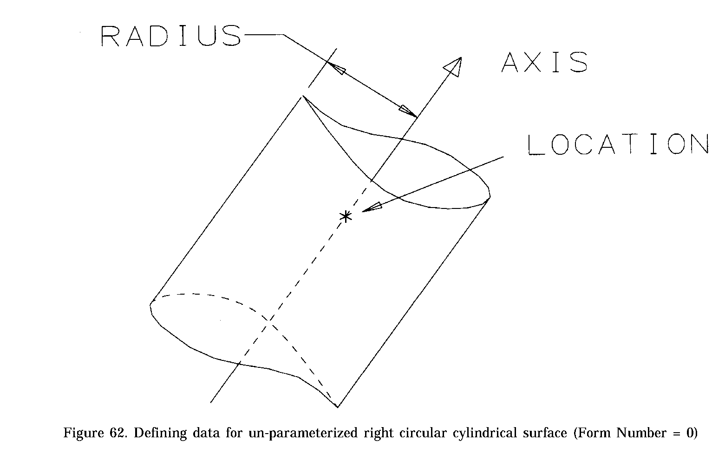

**Figure 63:** Defining data for parameterized right circular cylindrical surface (Form Number = 1)

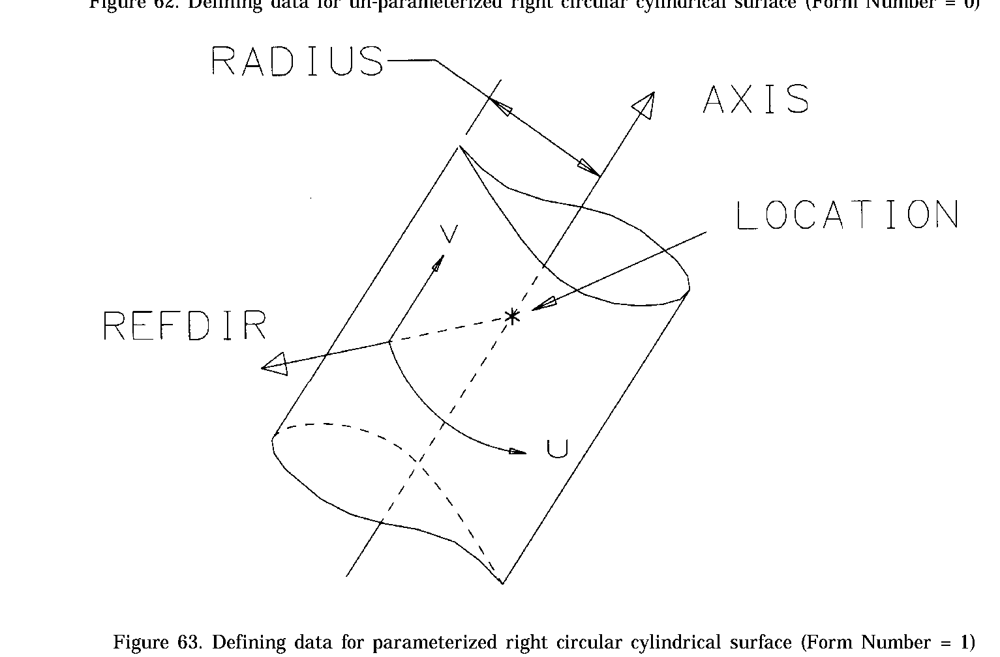

**Directory Entry**

| (1) Entity Type Number | (2) Parameter Data | (3) Structure | (4) Line Font Pattern | (5) Level | (6) View | (7) Xformation Matrix | (8) Label Display | (9) Status Number | (10) Sequence Number |
|---|---|---|---|---|---|---|---|---|---|
| 192 |  | < n.a. > |  |  |  |  |  | **01??** | D# |

| (11) Entity Type Number | (12) Line Weight | (13) Color Number | (14) Parameter Line Count | (15) Form Number | (16) Reserved | (17) Reserved | (18) Entity Label | (19) Entity Subscript | (20) Sequence Number |
|---|---|---|---|---|---|---|---|---|---|
| 192 |  |  |  |  |  |  |  |  | D#+1 |

**Un-parameterized Right Circular Cylindrical Surface Entity (Type 192, Form 0)** *(ECO630)*

**Parameter Data**

| Index | Name | Type | Description |
|---|---|---|---|
| 1 | DELOC | Pointer | Pointer to the DE of the point on axis (LOCATION) |
| 2 | DEAXIS | Pointer | Pointer to the DE of the axis direction (AXIS) |
| 3 | RADIUS | Real | Value of radius (> 0.0) |

Additional pointers as required (see Section 2.2.4.5.2).

**Parameterized Right Circular Cylindrical Surface Entity (Type 192, Form 1)**

**Parameter Data**

| Index | Name | Type | Description |
|---|---|---|---|
| 1 | DELOC | Pointer | Pointer to the DE of the point on axis (LOCATION) |
| 2 | DEAXIS | Pointer | Pointer to the DE of the axis direction (AXIS) |
| 3 | RADIUS | Real | Value of radius (> 0.0) |
| 4 | DEREFD | Pointer | Pointer to the DE of the reference direction (REFDIR) |

Additional pointers as required (see Section 2.2.4.5.2).

## 4.52 Right Circular Conical Surface Entity (Type 194)‡

*The Right Circular Conical Surface Entity has not been tested. See Section 1.9.* *(ECO630)*

The right circular conical surface is defined by a point on the axis of the cone, the direction of the axis of the cone, the radius of the cone at the axis point and the cone semi-angle. Figures 64 and 65 show examples. The positive direction of the surface normal is outwards from the axis.

If a local coordinate system is defined with the origin at the axis point and the Z axis in the axis direction, the equation of the surface in this system is $S = 0$ where

$$S(x, y, z) = x^2 + y^2 - (r + z \tan s)^2$$

where $s$ is the cone semi-angle and $r$ is the given cone radius. The positive direction of the surface normal is in the direction of increasing $S$. At any point on the surface the surface normal $N$ is

$$N = (S_x, S_y, S_z)$$

The data for the parameterized form of the surface (Figure 65) is to be interpreted as follows:

$$\begin{aligned}
C &= \text{LOCATION} \\
z &= \langle \text{AXIS} \rangle \\
d &= \langle \text{REFDIR} \rangle \\
x &= \langle d - (d \cdot z)z \rangle \\
y &= \langle z \times x \rangle \\
r &= \text{RADIUS} \\
s &= \text{ANGLE}
\end{aligned}$$

and the surface is parameterized as

$$\sigma(u, v) = C + (r + v \tan(s))(\cos(u)\,x + \sin(u)\,y) + v\,z$$

where the parameterization range is $0 \leq u \leq 360$ degrees and $-\infty < v < \infty$.

Note that $d$ shall be distinct from $z$ and shall be approximately perpendicular to $z$.

For the Right Circular Conical Surface Entity, the Form Numbers are as follows:

| Form | Meaning |
|---|---|
| 0 | Unparameterized Surface |
| 1 | Parameterized Surface |

This surface type is intended to represent the geometry underlying topology, and shall only be referenced by a Face Entity (Type 510, Form 1). The Subordinate Entity Switch shall always be set to Physically Dependent; i.e., independent instances of this entity are not permitted.

**Figure 64:** Defining data for un-parameterized right circular conical surface (Form Number = 0)

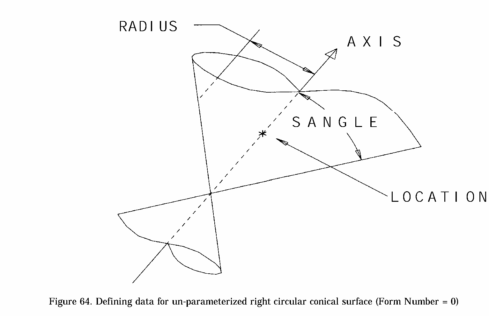

**Figure 65:** Defining data for parameterized right circular conical surface (Form Number = 1)

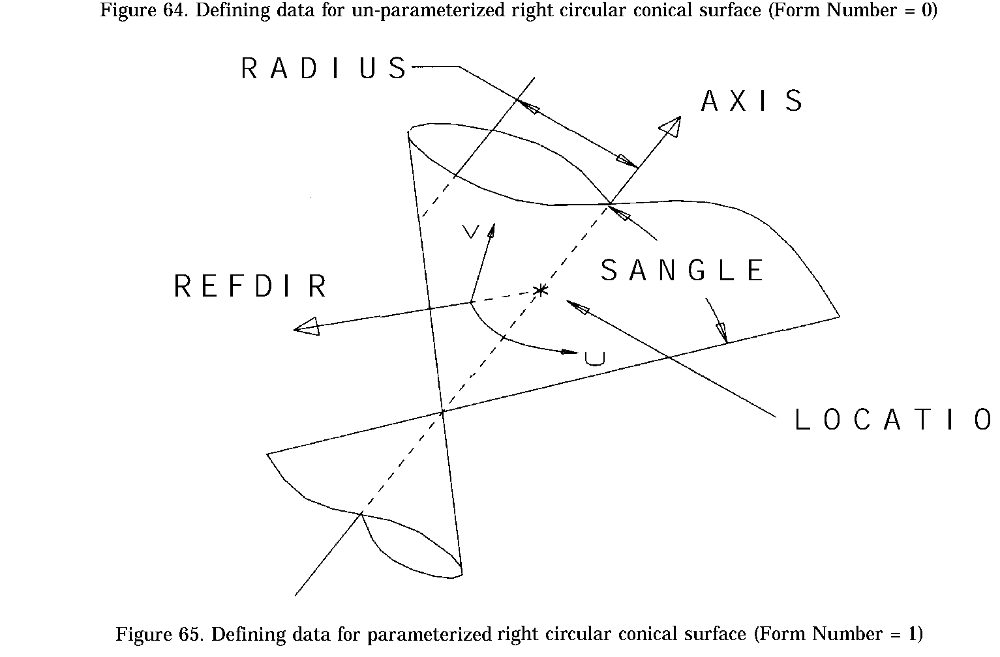

**Directory Entry**

| (1) Entity Type Number | (2) Parameter Data | (3) Structure | (4) Line Font Pattern | (5) Level | (6) View | (7) Xformation Matrix | (8) Label Display | (9) Status Number | (10) Sequence Number |
|---|---|---|---|---|---|---|---|---|---|
| 194 |  | < n.a. > |  |  |  |  |  | **01??** | D# |

| (11) Entity Type Number | (12) Line Weight | (13) Color Number | (14) Parameter Line Count | (15) Form Number | (16) Reserved | (17) Reserved | (18) Entity Label | (19) Entity Subscript | (20) Sequence Number |
|---|---|---|---|---|---|---|---|---|---|
| 194 |  |  |  |  |  |  |  |  | D#+1 |

**Un-parameterized Right Circular Conical Surface Entity (Type 194, Form 0)** *(ECO630)*

**Parameter Data**

| Index | Name | Type | Description |
|---|---|---|---|
| 1 | DELOC | Pointer | Pointer to the DE of the point on axis (LOCATION) |
| 2 | DEAXIS | Pointer | Pointer to the DE of the axis direction (AXIS) |
| 3 | RADIUS | Real | Value of radius at axis point ($\geq$ 0.0) |
| 4 | SANGLE | Real | Value of semi-angle in degrees (> 0.0 and < 90.0) |

Additional pointers as required (see Section 2.2.4.5.2).

**Parameterized Right Circular Conical Surface Entity (Type 194, Form 1)**

**Parameter Data**

| Index | Name | Type | Description |
|---|---|---|---|
| 1 | DELOC | Pointer | Pointer to the DE of the point on axis (LOCATION) |
| 2 | DEAXIS | Pointer | Pointer to the DE of the axis direction (AXIS) |
| 3 | RADIUS | Real | Value of radius at axis point ($\geq$ 0.0) |
| 4 | SANGLE | Real | Value of semi-angle in degrees (> 0.0 and < 90.0) |
| 5 | DEREFD | Pointer | Pointer to the DE of the reference direction (REFDIR) |

Additional pointers as required (see Section 2.2.4.5.2).

## 4.53 Spherical Surface Entity (Type 196)‡

*The Spherical Surface Entity has not been tested. See Section 1.9.* *(ECO630)*

The spherical surface is defined by the center point and the radius. Figures 66 and 67 show examples. The positive direction of the surface normal is outwards from the center.

If a local coordinate system is defined with the origin at the center point then the equation of the surface in this system is $S = 0$ where

$$S(x, y, z) = x^2 + y^2 + z^2 - r^2$$

and the positive direction of the surface normal is in the direction of increasing $S$. The normal, $N$, to the surface at any point on the surface is given by

$$N = (S_x, S_y, S_z)$$

The data for the parameterized form of the surface are to be interpreted as follows:

$$\begin{aligned}
C &= \text{LOCATION} \\
z &= \langle \text{AXIS} \rangle \\
d &= \langle \text{REFDIR} \rangle \\
x &= (d - (d \cdot z)z) \\
y &= (z \times x) \\
r &= \text{RADIUS}
\end{aligned}$$

and the surface is parameterized as

$$\sigma(u, v) = C + r(\cos(v)(\cos(u)\,x + \sin(u)\,y)) + r\sin(v)\,z$$

where the parameterization range is $0 \leq u \leq 360$ degrees and $-90 \leq v \leq 90$ degrees.

Note that $d$ shall be distinct from $z$ and shall be approximately perpendicular to $z$.

For the Spherical Surface Entity, the Form Numbers are as follows:

| Form | Meaning |
|---|---|
| 0 | Unparameterized surface |
| 1 | Parameterized surface |

This surface type is intended to represent the geometry underlying topology, and shall only be referenced by a Face Entity (Type 510, Form 1). The Subordinate Entity Switch shall always be set to Physically Dependent; i.e., independent instances of this entity are not permitted.

**Figure 66:** Defining data for un-parameterized spherical surface (Form Number = 0)

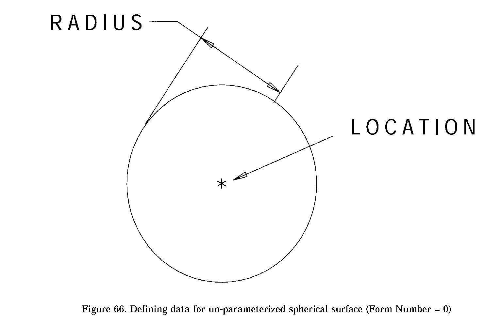

**Figure 67:** Defining data for parameterized spherical surface (Form Number = 1)

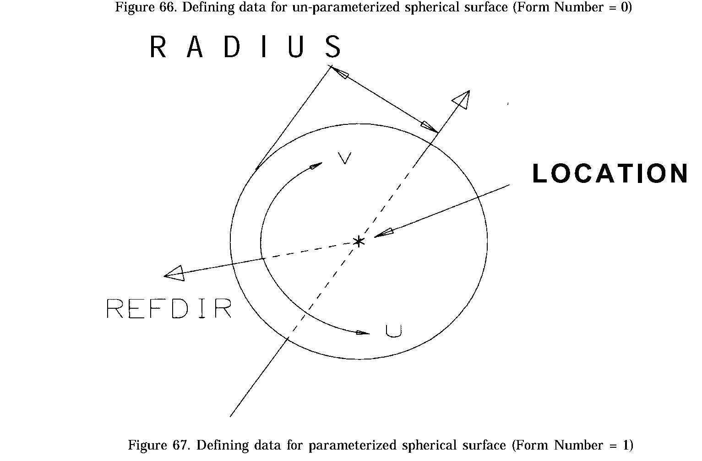

**Directory Entry**

| (1) Entity Type Number | (2) Parameter Data | (3) Structure | (4) Line Font Pattern | (5) Level | (6) View | (7) Xformation Matrix | (8) Label Display | (9) Status Number | (10) Sequence Number |
|---|---|---|---|---|---|---|---|---|---|
| 196 |  | < n.a. > |  |  |  |  |  | **01??** | D# |

| (11) Entity Type Number | (12) Line Weight | (13) Color Number | (14) Parameter Line Count | (15) Form Number | (16) Reserved | (17) Reserved | (18) Entity Label | (19) Entity Subscript | (20) Sequence Number |
|---|---|---|---|---|---|---|---|---|---|
| 196 |  |  |  |  |  |  |  |  | D#+1 |

**Un-parameterized Spherical Surface Entity (Type 196, Form 0)**

**Parameter Data**

| Index | Name | Type | Description |
|---|---|---|---|
| 1 | DELOC | Pointer | Pointer to the DE of the center point (LOCATION) |
| 2 | RADIUS | Real | Value of radius (> 0.0) |

Additional pointers as required (see Section 2.2.4.5.2).

**Parameterized Spherical Surface Entity (Type 196, Form 1)**

**Parameter Data**

| Index | Name | Type | Description |
|---|---|---|---|
| 1 | DELOC | Pointer | Pointer to the DE of the center point (LOCATION) |
| 2 | RADIUS | Real | Value of radius (> 0.0) |
| 3 | DEAXIS | Pointer | Pointer to the DE of the axis direction (AXIS) |
| 4 | DEREFD | Pointer | Pointer to the DE of the reference direction (REFDIR) |

Additional pointers as required (see Section 2.2.4.5.2).

## 4.54 Toroidal Surface Entity (Type 198)‡

*The Toroidal Surface Entity has not been tested. See Section 1.9.* *(ECO630)*

The toroidal surface is defined by the center point, the axis direction and the major and minor radii. Figures 68 and 69 show examples. The positive direction of the surface normal is outwards from the center of the generating circle.

If a local coordinate system is defined with the origin at the axis point and the Z axis in the axis direction, then the equation of the surface in this system is $S = 0$ where

$$S(x, y, z) = x^2 + y^2 + z^2 - 2R\sqrt{x^2 + y^2} - r^2 + R^2$$

and the positive direction of the surface normal is in the direction of increasing $S$. The surface normal, $N$, at any point on the surface is given by

$$N = (S_x, S_y, S_z)$$

The data for the parameterized form of the surface are to be interpreted as follows:

$$\begin{aligned}
C &= \text{LOCATION} \\
z &= \langle \text{AXIS} \rangle \\
d &= \langle \text{REFDIR} \rangle \\
x &= (d - (d \cdot z)z) \\
y &= (z \times x) \\
R &= \text{MAJRAD} \\
r &= \text{MINRAD}
\end{aligned}$$

and the surface is parameterized as

$$\sigma(u, v) = C + (R + r\cos(u))(\cos(v)\,x - \sin(v)\,y) + r\sin(u)\,z$$

where the parameterization range is $0 \leq u, v \leq 360$ degrees.

Note that $d$ shall be distinct from $z$ and shall be approximately perpendicular to $z$.

For the Toroidal Surface Entity, the Form Numbers are as follows:

| Form | Meaning |
|---|---|
| 0 | Unparameterized surface |
| 1 | Parameterized surface |

This surface type is intended to represent the geometry underlying topology, and shall only be referenced by a Face Entity (Type 510, Form 1). The Subordinate Entity Switch shall always be set to Physically Dependent; i.e., independent instances of this entity are not permitted.

**Figure 68:** Defining data for un-parameterized toroidal surface (Form Number = 0)

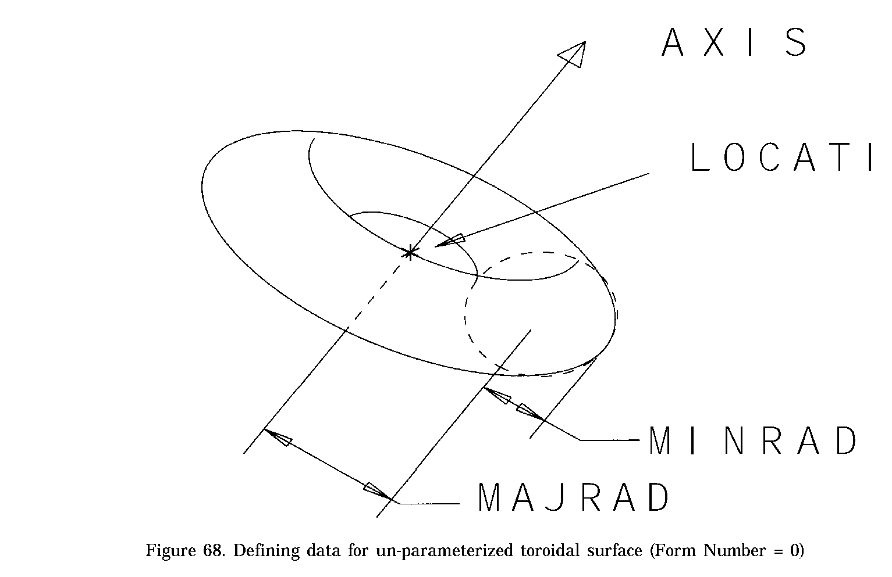

**Figure 69:** Defining data for parameterized toroidal surface (Form Number = 1)

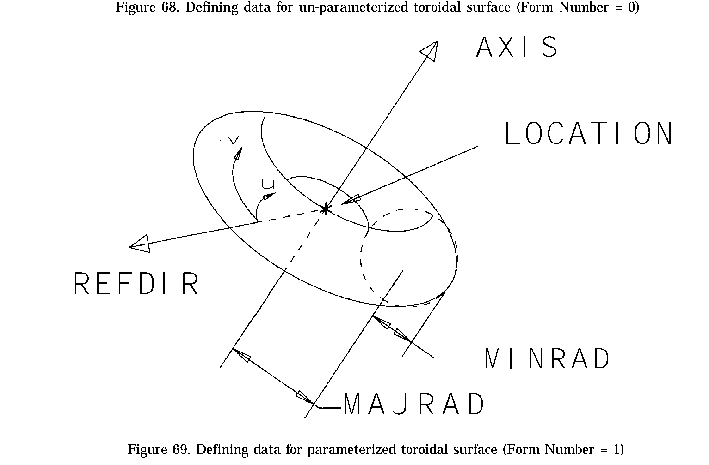

**Directory Entry**

| (1) Entity Type Number | (2) Parameter Data | (3) Structure | (4) Line Font Pattern | (5) Level | (6) View | (7) Xformation Matrix | (8) Label Display | (9) Status Number | (10) Sequence Number |
|---|---|---|---|---|---|---|---|---|---|
| 198 |  | < n.a. > |  |  |  |  |  | **01??** | D# |

| (11) Entity Type Number | (12) Line Weight | (13) Color Number | (14) Parameter Line Count | (15) Form Number | (16) Reserved | (17) Reserved | (18) Entity Label | (19) Entity Subscript | (20) Sequence Number |
|---|---|---|---|---|---|---|---|---|---|
| 198 |  |  |  |  |  |  |  |  | D#+1 |

**Un-parametrized Toroidal Surface Entity (Type 198, Form 0)** *(ECO630)*

**Parameter Data**

| Index | Name | Type | Description |
|---|---|---|---|
| 1 | DELOC | Pointer | Pointer to the DE of the center point (LOCATION) |
| 2 | DEAXIS | Pointer | Pointer to the DE of the axis direction (AXIS) |
| 3 | MAJRAD | Real | Value of major radius (> 0.0) |
| 4 | MINRAD | Real | Value of minor radius (> 0.0 and < MAJRAD) |

Additional pointers as required (see Section 2.2.4.5.2).

**Parametrized Toroidal Surface Entity (Type 198, Form 1)**

**Parameter Data**

| Index | Name | Type | Description |
|---|---|---|---|
| 1 | DELOC | Pointer | Pointer to the DE of the center point (LOCATION) |
| 2 | DEAXIS | Pointer | Pointer to the DE of the axis direction (AXIS) |
| 3 | MAJRAD | Real | Value of major radius (> 0.0) |
| 4 | MINRAD | Real | Value of minor radius (> 0.0 and < MAJRAD) |
| 5 | DEREFD | Pointer | Pointer to the DE of the reference direction (REFDIR) |

Additional pointers as required (see Section 2.2.4.5.2).

## 4.55 Angular Dimension Entity (Type 202)

An Angular Dimension Entity consists of a general note; zero, one, or two witness lines; two leaders; and an angle vertex point. Figure 70 indicates the construction used. Figure 71 shows examples of angular dimensions. If two witness lines are used, each is contained in its own Copious Data Entity (Type 106, Form 40). *(ECO630)*

Each leader consists of at least one circular arc segment with an arrowhead at one end. The leader pointers are ordered such that the first circular arc segment of the first leader is defined in a counterclockwise manner from arrowhead to terminate point, and the first circular arc segment of the second leader is defined in a clockwise manner. The radius of the arc segments in the leader shall be calculated between the vertex point and the start point of the leader. (Refer to Section 3.2.4 for information relating to the use of the term counterclockwise). *(ECO630)*

Section 4.62 contains a discussion of multi-segment leaders. For those leaders in Angular Dimension Entities consisting of more than one segment, the first two segments are circular arcs with a center at the vertex point. The second circular arc segment is defined in the opposite direction from the first circular arc segment. Remaining segments, if any, are straight lines. Any leader segment in which the start point is the same as the terminate point shall be ignored. This convention arises to facilitate the definition of the second circular arc segment such as in the bottom leader in Figure 70. The first example in Figure 71 illustrates a leader with three segments. *(ECO630)*

See Section 3.5.3 for coplanarity requirements for dimension entities. *(ECO635)*

**Figure 70:** Construction of Leaders for the Angular Dimension Entity

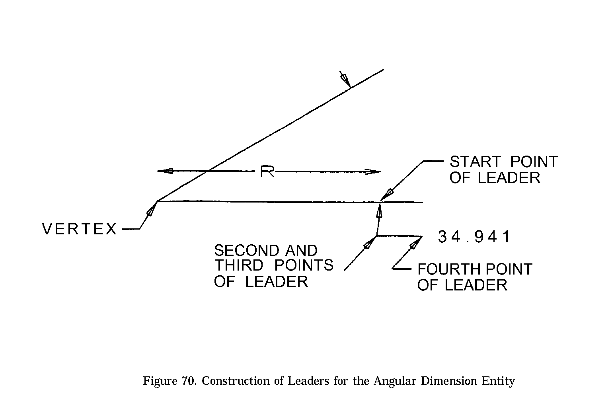

**Figure 71:** F202X.IGS Examples Defined Using the Angular Dimension Entity

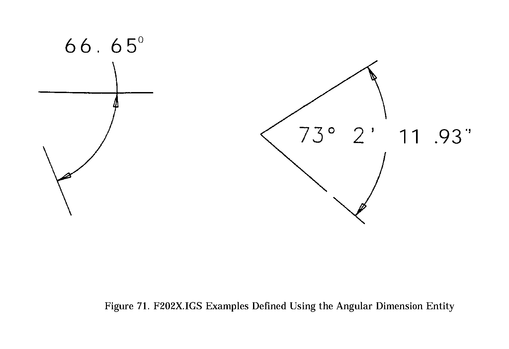

**Directory Entry**

| (1) Entity Type Number | (2) Parameter Data | (3) Structure | (4) Line Font Pattern | (5) Level | (6) View | (7) Xformation Matrix | (8) Label Display | (9) Status Number | (10) Sequence Number |
|---|---|---|---|---|---|---|---|---|---|
| 202 |  | < n.a. > |  |  |  |  |  | **????01??** | D# |

| (11) Entity Type Number | (12) Line Weight | (13) Color Number | (14) Parameter Line Count | (15) Form Number | (16) Reserved | (17) Reserved | (18) Entity Label | (19) Entity Subscript | (20) Sequence Number |
|---|---|---|---|---|---|---|---|---|---|
| 202 |  |  |  |  |  |  |  |  | D#+1 |

**Parameter Data**

| Index | Name | Type | Description |
|---|---|---|---|
| 1 | DENOTE | Pointer | Pointer to the DE of the General Note Entity |
| 2 | DEWIT1 | Pointer | Pointer to the DE of the first Witness Line Entity or zero |
| 3 | DEWIT2 | Pointer | Pointer to the DE of the second Witness Line Entity or zero |
| 4 | XT | Real | Coordinates of vertex point |
| 5 | YT | Real |  |
| 6 | R | Real | Radius of Leader arcs |
| 7 | DEARRW1 | Pointer | Pointer to the DE of the first Leader Entity |
| 8 | DEARRW2 | Pointer | Pointer to the DE of the second Leader Entity |

Additional pointers as required (see Section 2.2.4.5.2).

## 4.56 Curve Dimension Entity (Type 204)‡

*(ECO630)*

The Curve Dimension Entity has not been tested. See Section 1.9.

A Curve Dimension Entity consists of a general note; one or two curves (which can be any of the parameterized curves); two leaders; and zero, one, or two witness lines. Refer to Figure 72 for examples. Both parameterized curves shall not be Line Entities (Type 110); in this case a Linear Dimension (Type 216) is appropriate.

Each leader entity consists of one tail segment of non-zero length which begins with an arrowhead, and which serves only to define the orientation of the arrowhead.

The start and terminate point of a curve are determined by its parameterization. The start point of the curve has the lowest parameterization value; the terminate point of the curve has the highest parameterization value.

In the case where one curve is defined, the coordinates of the curve start point coincide with the coordinates of the arrowhead of the first leader. The coordinates of the curve terminate point coincide with the coordinates of the arrowhead of the second leader.

In the case where two curves are defined, the coordinates of the start point of the first curve coincide with the coordinates of the arrowhead of the first leader. The coordinates of the terminate point of the second curve coincide with the coordinates of arrowhead of the second leader.

**Figure 72:** Examples Defined Using the Curve Dimension Entity

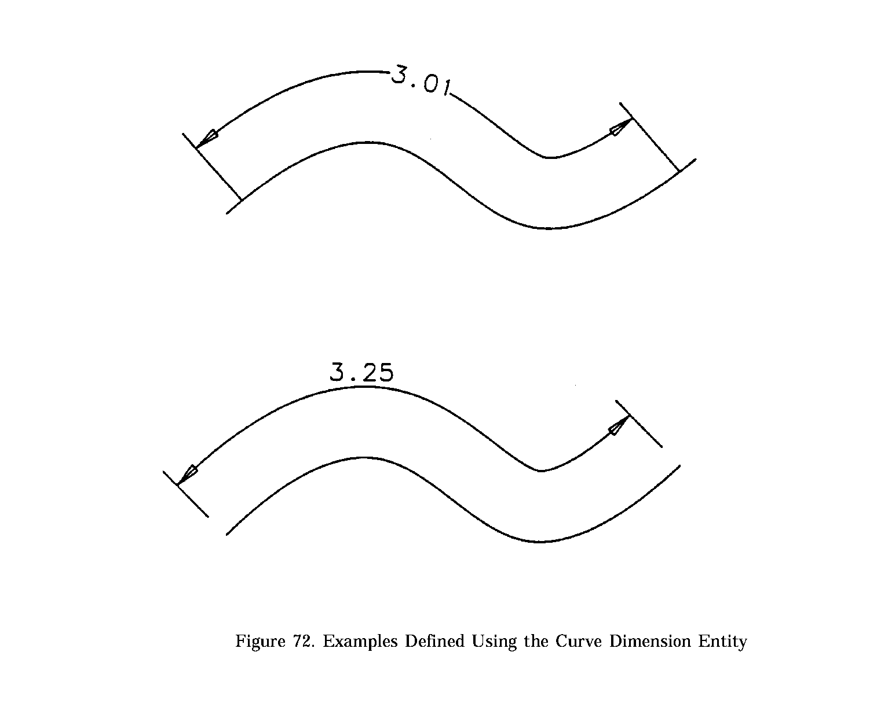

**Directory Entry**

| (1) Entity Type Number | (2) Parameter Data | (3) Structure | (4) Line Font Pattern | (5) Level | (6) View | (7) Xformation Matrix | (8) Label Display | (9) Status Number | (10) Sequence Number |
|---|---|---|---|---|---|---|---|---|---|
| 204 |  | < n.a. > |  |  |  |  |  | **????01??** | D# |

| (11) Entity Type Number | (12) Line Weight | (13) Color Number | (14) Parameter Line Count | (15) Form Number | (16) Reserved | (17) Reserved | (18) Entity Label | (19) Entity Subscript | (20) Sequence Number |
|---|---|---|---|---|---|---|---|---|---|
| 204 |  |  |  |  |  |  |  |  | D#+1 |

**Parameter Data**

| Index | Name | Type | Description |
|---|---|---|---|
| 1 | DENOTE | Pointer | Pointer to the DE of the General Note Entity |
| 2 | DECURV1 | Pointer | Pointer to the DE of the first curve entity |
| 3 | DECURV2 | Pointer | Pointer to the DE of the second curve entity, or zero |
| 4 | DEARR1 | Pointer | Pointer to the DE of the first Leader Entity |
| 5 | DEARR2 | Pointer | Pointer to the DE of the second Leader Entity |
| 6 | DEWIT1 | Pointer | Pointer to the DE of the first Witness Line Entity, or zero |
| 7 | DEWIT2 | Pointer | Pointer to the DE of the second Witness Line Entity, or zero |

Additional pointers as required (see Section 2.2.4.5.2).

## 4.57 Diameter Dimension Entity (Type 206)

A Diameter Dimension Entity consists of a general note, one or two leaders, and an arc center point. Refer to Figure 73 for examples of the Diameter Dimension Entity.

The arc center is used as a reference in constructing the diameter dimension but has no effect on the dimension components. *(ECO630)*

See Section 3.5.3 for coplanarity requirements for dimension entities. *(ECO635)*

**Figure 73:** F206X.IGS Examples Defined Using the Diameter Dimension Entity

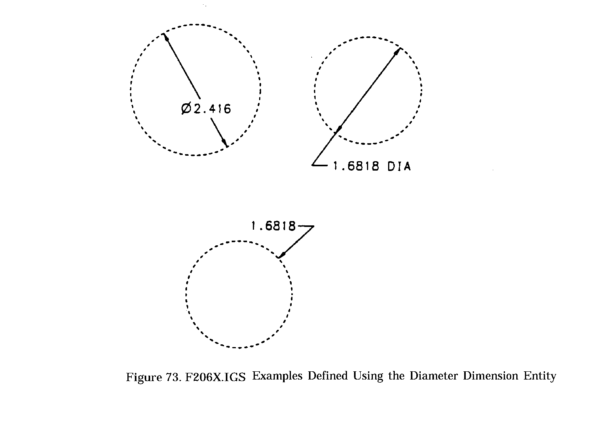

**Directory Entry**

| (1) Entity Type Number | (2) Parameter Data | (3) Structure | (4) Line Font Pattern | (5) Level | (6) View | (7) Xformation Matrix | (8) Label Display | (9) Status Number | (10) Sequence Number |
|---|---|---|---|---|---|---|---|---|---|
| 206 |  | < n.a. > |  |  |  |  |  | **????01??** | D# |

| (11) Entity Type Number | (12) Line Weight | (13) Color Number | (14) Parameter Line Count | (15) Form Number | (16) Reserved | (17) Reserved | (18) Entity Label | (19) Entity Subscript | (20) Sequence Number |
|---|---|---|---|---|---|---|---|---|---|
| 206 |  |  |  |  |  |  |  |  | D#+1 |

**Parameter Data**

| Index | Name | Type | Description |
|---|---|---|---|
| 1 | DENOTE | Pointer | Pointer to the DE of the General Note Entity |
| 2 | DEARRW1 | Pointer | Pointer to the DE of the first Leader Entity |
| 3 | DEARRW2 | Pointer | Pointer to the DE of the second Leader Entity or zero |
| 4 | XT | Real | Arc center coordinates |
| 5 | YT | Real |  |

Additional pointers as required (see Section 2.2.4.5.2).

## 4.58 Flag Note Entity (Type 208)

A Flag Note Entity defines label information which is formatted as shown in Figure 74. The geometric parameters of the Flag Note Entity are defined using information from the General Note Entity as follows: *(ECO630)*

$$\begin{aligned}
H &= 2HC \\
L &= W + 0.4HC \\
T &= 0.5H/\tan(35^\circ),
\end{aligned}$$

where

$$\begin{aligned}
H &= \text{Height} \\
HC &= \text{Character Height (from General Note)} \\
L &= \text{Length} \\
W &= \text{Text Width (from General Note)} \\
T &= \text{Tip Length} \\
A &= \text{Rotation Angle (in radians)}.
\end{aligned}$$

H shall never be less than 0.3 in., and L shall never be less than 0.6 in. The box containing the text (as defined in the General Note Entity) shall be centered in the flag note box of size (H x L). The rotation angle and location of the lower left corner coordinate in the Flag Note Entity override the General Note Entity (Type 212) rotation angle and placement.

The Flag Note Entity may be defined with or without leaders.

The general note may consist of multiple text strings; however, they shall share a common baseline. The number of characters shall not be greater than 10.

Examples defined using the Flag Note Entity are shown in Figure 75.

See Section 3.5.3 for coplanarity requirements for dimension entities. *(ECO635)*

**Figure 74:** Parameters of the Flag Note Entity. Note that the box outlined within the flag illustrates the bounds of the text and is not a sub-symbol.

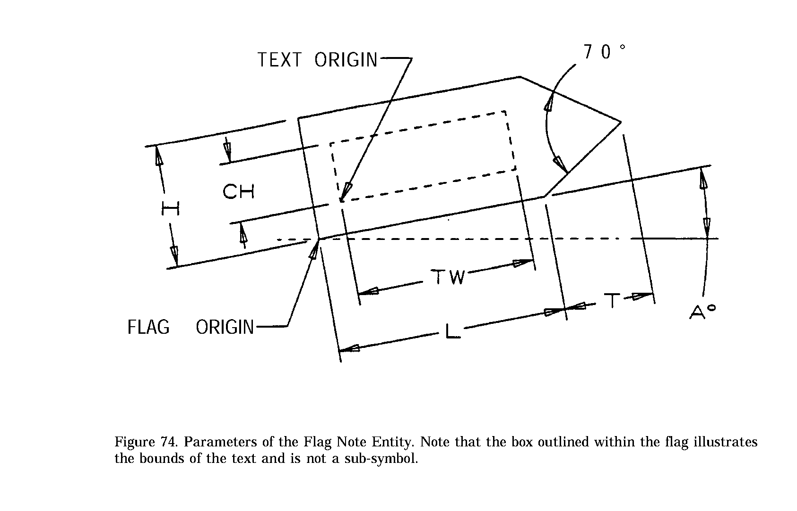

**Figure 75:** Examples Defined Using the Flag Note Entity

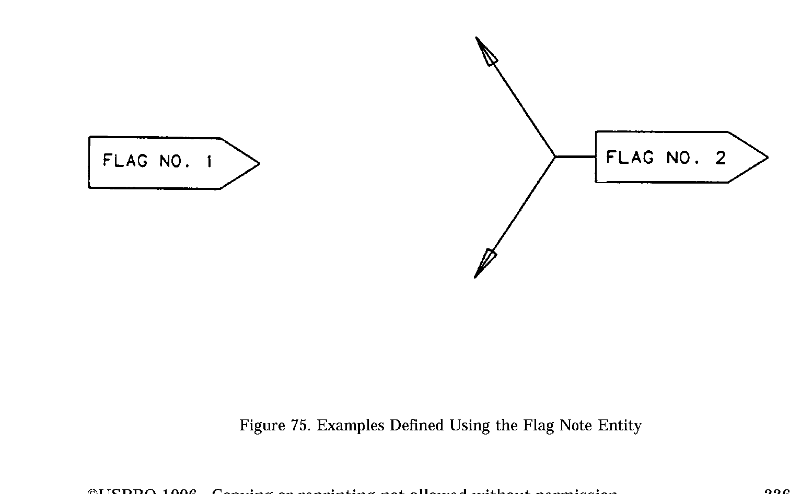

**Directory Entry**

| (1) Entity Type Number | (2) Parameter Data | (3) Structure | (4) Line Font Pattern | (5) Level | (6) View | (7) Xformation Matrix | (8) Label Display | (9) Status Number | (10) Sequence Number |
|---|---|---|---|---|---|---|---|---|---|
| 208 |  | < n.a. > |  |  |  |  |  | **????01??** | D# |

| (11) Entity Type Number | (12) Line Weight | (13) Color Number | (14) Parameter Line Count | (15) Form Number | (16) Reserved | (17) Reserved | (18) Entity Label | (19) Entity Subscript | (20) Sequence Number |
|---|---|---|---|---|---|---|---|---|---|
| 208 |  |  |  |  |  |  |  |  | D#+1 |

**Parameter Data** *(ECO650)*

| Index | Name | Type | Description |
|---|---|---|---|
| 1 | XT | Real | Lower left corner coordinate of the Flag |
| 2 | YT | Real |  |
| 3 | ZT | Real |  |
| 4 | A | Real | Rotation angle in radians |
| 5 | DENOTE | Pointer | Pointer to the DE of the General Note Entity |
| 6 | N | Integer | Number of Arrows (Leaders) or zero |
| 7 | DEARRW(1) | Pointer | Pointer to the DE of the first associated Leader Entity |
| ... | ... | ... |  |
| 6+N | DEARRW(N) | Pointer | Pointer to the DE of the last associated Leader Entity |

Additional pointers as required (see Section 2.2.4.5.2).

## 4.59 General Label Entity (Type 210)

A General Label Entity consists of a general note with one or more associated leaders. Examples of general labels are shown in Figure 76.

See Section 3.5.3 for coplanarity requirements for dimension entities. *(ECO635)*

**Figure 76:** F210X.IGS Examples Defined Using the General Label Entity

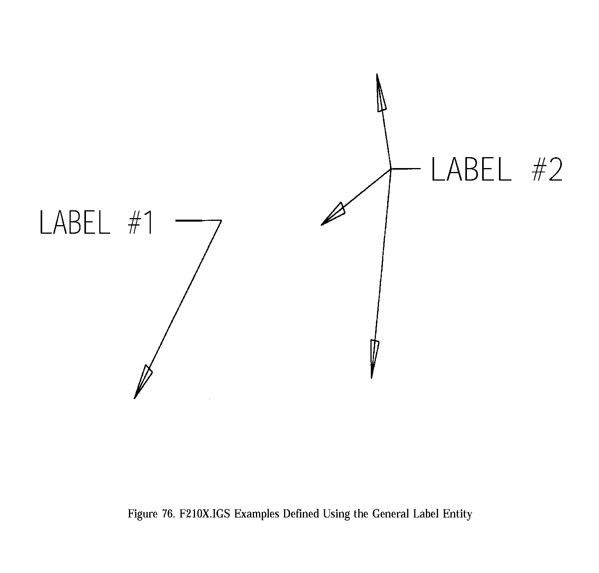

**Directory Entry**

| (1) Entity Type Number | (2) Parameter Data | (3) Structure | (4) Line Font Pattern | (5) Level | (6) View | (7) Xformation Matrix | (8) Label Display | (9) Status Number | (10) Sequence Number |
|---|---|---|---|---|---|---|---|---|---|
| 210 |  | < n.a. > |  |  |  |  |  | **????01??** | D# |

| (11) Entity Type Number | (12) Line Weight | (13) Color Number | (14) Parameter Line Count | (15) Form Number | (16) Reserved | (17) Reserved | (18) Entity Label | (19) Entity Subscript | (20) Sequence Number |
|---|---|---|---|---|---|---|---|---|---|
| 210 |  |  |  |  |  |  |  |  | D#+1 |

**Parameter Data** *(ECO650)*

| Index | Name | Type | Description |
|---|---|---|---|
| 1 | DENOTE | Pointer | Pointer to the DE of the associated General Note Entity |
| 2 | N | Integer | Number of Leaders |
| 3 | DEARRW(1) | Pointer | Pointer to the DE of the first associated Leader Entity |
| ... | ... | ... |  |
| 2+N | DEARRW(N) | Pointer | Pointer to the DE of the last associated Leader Entity |

Additional pointers as required (see Section 2.2.4.5.2).

## 4.60 General Note Entity (Type 212)

A General Note Entity consists of one or more text strings. Each text string contains text, a starting point, a text size, and an angle of rotation of the text. Examples of general notes are shown in Figure 77. The font code (FC) is an integer specifying the desired character set and its associated display characteristics. Positive values are pre-defined fonts. Negative values point to implementor-defined fonts or modifications to a pre-defined font, through the use of the Text Font Definition Entity (Type 310).

The following font codes are defined:

| FC | Description |
|---|---|
| 0 | Symbol Font (no longer recommended) |
| 1 | Default Style for ASCII Character Set |
| 2 | LeRoy |
| 3 | Futura |
| 6 | Comp 80 |
| 12 | News Gothic |
| 13 | Lightline Gothic |
| 14 | Simplex Roman |
| 17 | Century Schoolbook |
| 18 | Helvetica |
| 19 | OCR-B [ISO1073] |
| 1001 | Symbol Font 1 |
| 1002 | Symbol Font 2 |
| 1003 | Drafting Font |
| 2001 | Kanji [JIS6226] |
| 3001 | Latin-1 Alphabet |

Font codes 19 and 3001 of the General Note Entity have not been tested. See Section 1.9.

FC 0 specifies an old symbol font and should no longer be used. Figure F1 in Appendix F is a mapping symbol definition for FC 0

FC 1 does not specify a defined display. Use of Font 1 implies that the receiving system may use any font which displays the appropriate ASCII format characters. The intent of this font is for usage when the actual display of the characters is not critical for the application.

FC 19 specifies the OCR-B font [ISO01073] and is defined in Figure 81. Display symbols shall be represented using 7-bit ASCII codes with FC values in the 1000 series as shown in Figures 82, 83 and 84. The 7-bit ASCII control characters, i.e., hexadecimal 00 through 1F and hexadecimal 7F, shall not be used to represent display symbols. They do not specify a character display font. *(ECO630)*

FC 2001 specifies Japanese characters defined by the JIS Kanji (Kuten) Code Table [JIS6226]. Values in that table are implemented here as a two hexadecimal digit row number followed by a two hexadecimal digit column number. (Leading or embedded zeroes, or both, shall be used to avoid confusion.) The fact that four consecutive ASCII characters are being used to represent one character in the alphabet is implicit in the FC, and a postprocessor which supports this FC shall behave accordingly. *(ECO622)*

The hexadecimal row/column codes are biased by 20 (decimal 32). As an example, the characters represented by the decimal Kuten codes 20, 33 ( "KAN" ) and 27, 90 ( "JI" ) is coded as "8H34413B7A" (20+ 32 = 52₁₀ = 34₁₆ etc.). *(ECO630)*

The same value shall appear in the NC field of the PD record as appears in the Hollerith constant, e.g., even though 2 Kanji characters are represented as 8 Hollerith characters, NC shall have a value of 8 rather than 2.

Preprocessors shall define the text box height and box width so as to accurately reflect the display box size for the text string. Postprocessors which cannot display Japanese characters shall process this FC as if it were FC 1 (default style for ASCII character set).

The Rotate Internal Text Flag (VH) field in the PD record shall be used to convey vertical text orientation.

The Embedded Font Change form (Form 2) shall be used when the text note combines mixed English and Japanese fonts.

Embedded "escape" characters or metacharacters shall not be used; all of the characters are assumed to be for display.

FC 3001 specifies European characters defined by the ISO 8859-1 standard [ISO8859], also known as the Latin-1 Alphabet. FC3001 is shown in Figure 85. Values in ISO 8859-1 are implemented here as two ASCII characters, the leading character being either a space, or a period. The use of two consecutive ASCII characters to represent one character in the alphabet is implicit in the FC. A postprocessor which supports this FC shall behave accordingly. *(ECO630)*

Standard ASCII characters are preceded by a space. Non-ASCII characters from the Latin-1 are preceded by a period. *(ECO630)*

The same value shall appear in the NC field of the PD record as appears in the Hollerith constant, e.g.,when 7 French characters are represented as 14 Hollerith characters, NC shall have a value of 14 rather than 7.

Preprocessors shall define the text box-height and box-width so as to accurately reflect the display box size for the text string. Postprocessors which cannot display ISO 8859-1 characters shall process this FC as if it were FC 1 (default style for ASCII character set). *(ECO630)*

Embedded "escape" characters or metacharacters shall not be used; all of the characters are assumed to be for display. *(ECO630)*

Table 9 provides names for the graphical characters defined in the symbol and drafting fonts (FC 1, FC 1001, FC 1002, and FC 1003).

If the pre-defined font codes are not sufficient to describe a desired character set or display characteristics, a Text Font Definition Entity (Type 310) may be used to define the font. If a text font definition is being used, the negative of the pointer value for the directory entry of the Text Font Definition Entity is placed in the font code (FC) parameter. The use of the values WT, HT, SL, A, and text start point are shown in Figure 78.

Within definition space, the parameters for the text block are applied in the following order (see Figure 79):

1. Define the box height (HT) and box width (WT).

   The rotate internal text flag indicates whether the text box is filled with horizontal text or vertical text. If the rotate internal text flag is set to 1 (vertical text) then characters are placed one below another instead of one beside another. The rotate internal flag has no effect on the orientation of individual characters; it only affects their positioning. *(ECO629)*

   Regardless of the setting of the rotate internal text flag, the box width is measured as the sum of the widths of the N individual characters or symbols in the string, plus the width of N-1 inter-character spaces. For horizontal text, this may be interpreted as the width measured from the start of the left-most (first) text character or symbol in the positive XT direction along the text base line, and extending to the end of the right-most (last) character or symbol, extending N characters or symbols and N-1 inter-character spaces. *(ECO630)*

   Regardless of the setting of the rotate internal text flag, the box height is measured in the positive YT direction and is the height of a single capital letter. It is equivalent to the symbol "h" used in Appendix C of [ANS182]. Special symbols, such as those appearing in Appendix C of [ANS182], which exceed "h" in height are centered vertically. Descenders and portions of symbols exceeding "h" extend outside the lower and upper borders of the box (see Figure 80). *(ECO630)*

   The box height and width are measured before the rotation angle (A) is applied. The text start point is defined as the lower left corner of the first character or symbol box. *(ECO630)*

   If the rotate internal flag is set to vertical text, then the vertical spacing between the baselines of consecutive characters is 1.5 times the box height. The inter-character spacing shall be assumed to be 0.1 times the width of a single character, unless this is overridden by the use of an Inter-character Spacing Property (Type 406 Form 18). *(ECO629, ECO630)*

2. The slant angle is then applied to each individual character. For horizontal text, it is measured from the XT axis in a counterclockwise direction. For vertical text, the slant angle is measured from the YT axis.

3. The rotation angle is then applied to the text block. This rotation is applied in a counterclockwise direction about the text start point. The plane of rotation is the XT, YT plane at the depth Z S(n) (where Z S(n) is the value given for the text start point). *(ECO630)*

4. The mirror operation is performed next. The value 1 indicates the mirror axis is the (rotated) line perpendicular to the text base line and through the text start point. The value 2 indicates the mirror axis is the (rotated) text base line.

Finally, the Transformation Matrix Entity is used to specify the relative position of definition space within model space.

The number of characters (NC(n)) shall be equal to the character count in its corresponding text string (TEXT(n)). *(ECO630)*

The graphical representation and recreation of notes with a special structure are handled by the use of the Form Number in Field 15 of the Directory Entry for this entity. A system to accommodate these notes is outlined below. Any strings after those specified by the form number are considered additional, appended strings that are not related in any particular manner to the previously referenced strings.

In the event that a string necessary for the defined structure is not present in the sending system's note, a null string (see NULL STRING in Appendix K) shall be inserted in the General Note Entity to take the place of the nonexistent string to maintain the structure of the data. *(ECO630)*

Notes that contain fractional notation shall be represented as mixed numerals. This is done through the use of four consecutive strings representing the whole number, the numerator, the denominator, and the divisor bar. These are examples of the divisor bar string *(ECO630)*

`1H/` `1H-` `2H--` `1H_`

The following form numbers for the general note are used to maintain the graphical representation of the originating system's note:

**Form 0: Simple Note (default)** — A general note of one or more strings such that a text string is not related in any manner to another string in the same General Note Entity.

**Form 1: Dual Stack** — A general note of two or more strings where the first two are related in a manner such that they are both left justified and the second string is displayed "below" the first.

**Form 2: Imbedded Font Change** — A general note of two or more strings that is intended as a single string but was divided to accommodate a font change in the string.

**Form 3: Superscript** — A general note of two or more strings where the second string is a superscript of the first string.

**Form 4: Subscript** — A general note of two or more strings where the second string is a subscript of the first string.

**Form 5: Superscript, Subscript** — A general note of three or more strings where the second string is a superscript of the first string and the third string is a subscript of the first string. *(ECO630)*

**Form 6: Multiple Stack, Left Justified** — A general note where all strings are left justified to a common margin. These strings originated as a "paragraphed" note. *(ECO630)*

**Form 7: Multiple Stack, Center Justified** — A general note where all strings are center justified to a common axis. *(ECO630)*

**Form 8: Multiple Stack, Right Justified** — A general note where all strings are right justified to a common margin. *(ECO630)*

**Form 100: Simple Fraction** — A general note of four or more strings where the first four strings define a mixed numeral as defined previously.

**Form 101: Dual Stack Fraction** — A general note of eight or more strings which represent two mixed numerals as defined previously. These mixed numerals are related such that the fifth through the eighth strings are displayed below the first through the fourth strings respectively.

**Form 102: Imbedded Font Change, Double Fraction** — This general note originated as a single string but was split to accommodate a font change for a special character in the fifth string. This is a general note of nine or more strings where the first and sixth strings represent the whole number string of a mixed numeral as defined previously. The fifth string is a character (or characters) that was set apart to accommodate the font change. *(ECO630)*

**Form 105: Superscript, Subscript Fraction** — A general note of twelve or more strings where the first, fifth, and ninth strings represent the whole number string of a mixed numeral as defined previously. The second and third mixed numerals are the superscript and subscript respectively of the first mixed numeral. *(ECO630)*

Note: The large parentheses are added to help convey the intent of Form 105. They are not part of the General Note.

**Figure 77:** F212X.IGS Examples Defined Using the General Note Entity

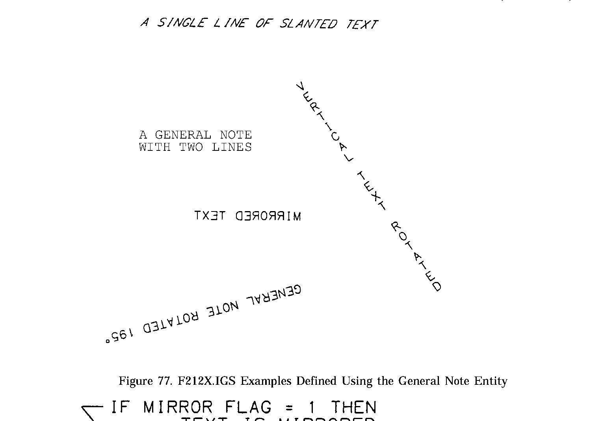

**Figure 78:** General Note Text Construction

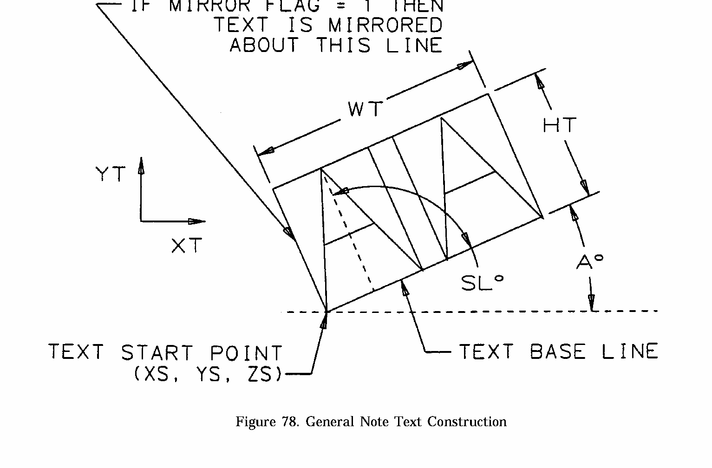

**Figure 79:** F212BX.IGS General Note Example of Text Operations

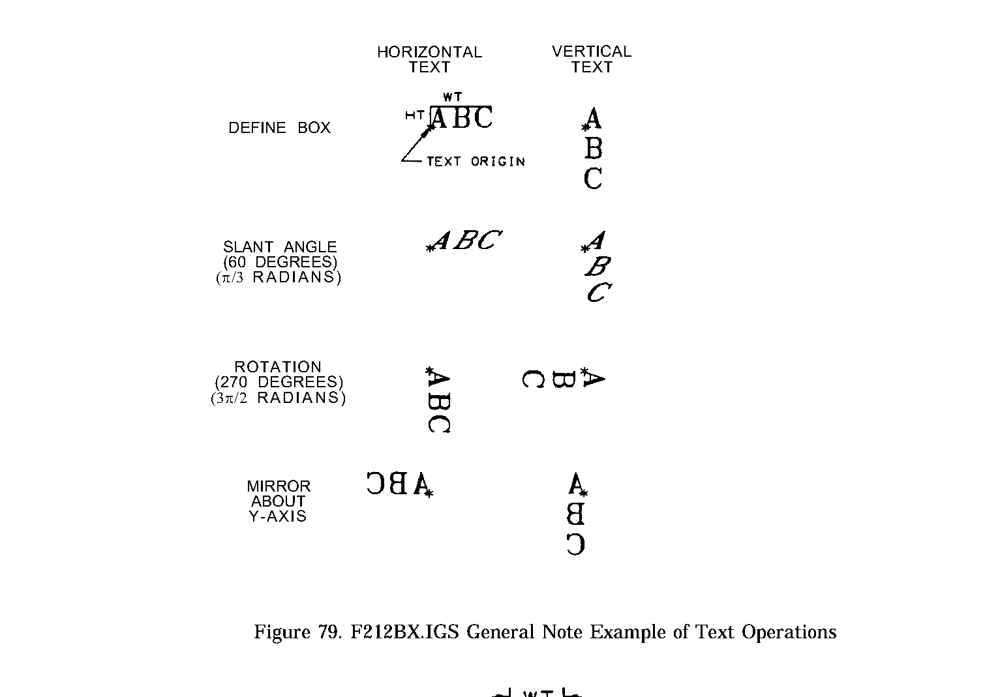

**Figure 80:** Examples of Drafting Symbols That Exceed Text Box Height

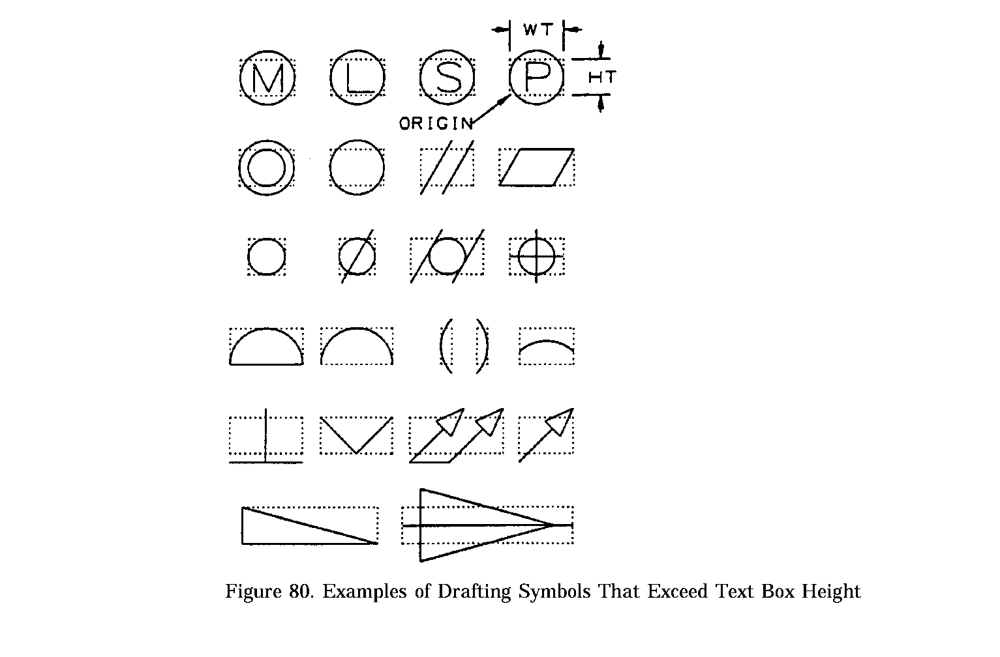

**Figure 81:** General Note Font (OCR-B) Specified by FC 19

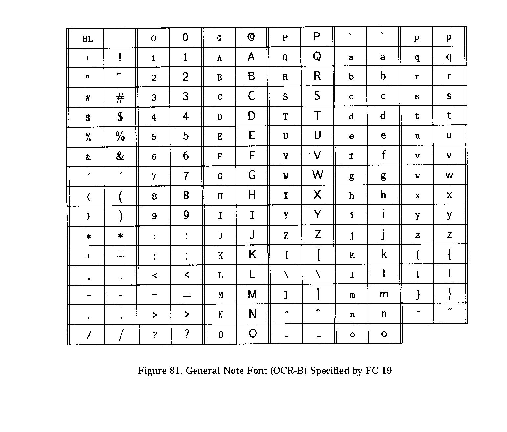

**Figure 82:** General Note Font Specified by FC 1001

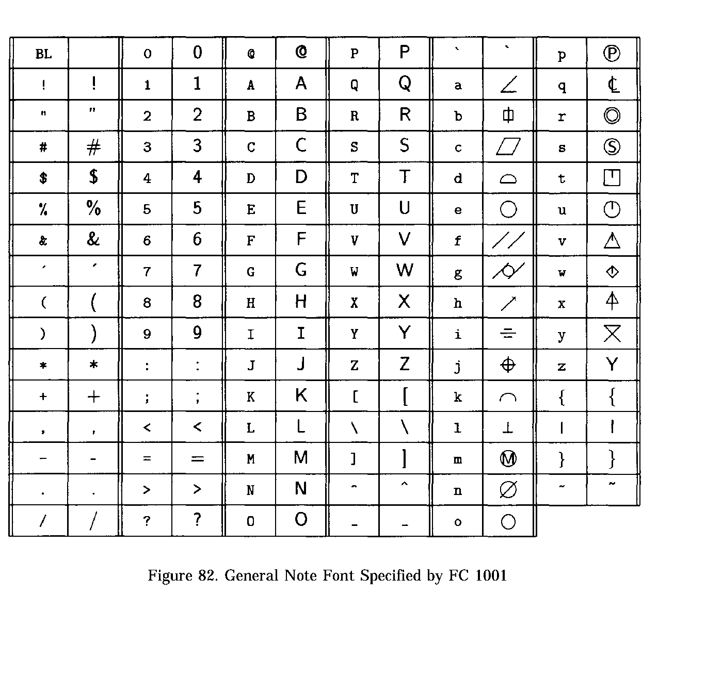

**Figure 83:** General Note Font Specified by FC 1002

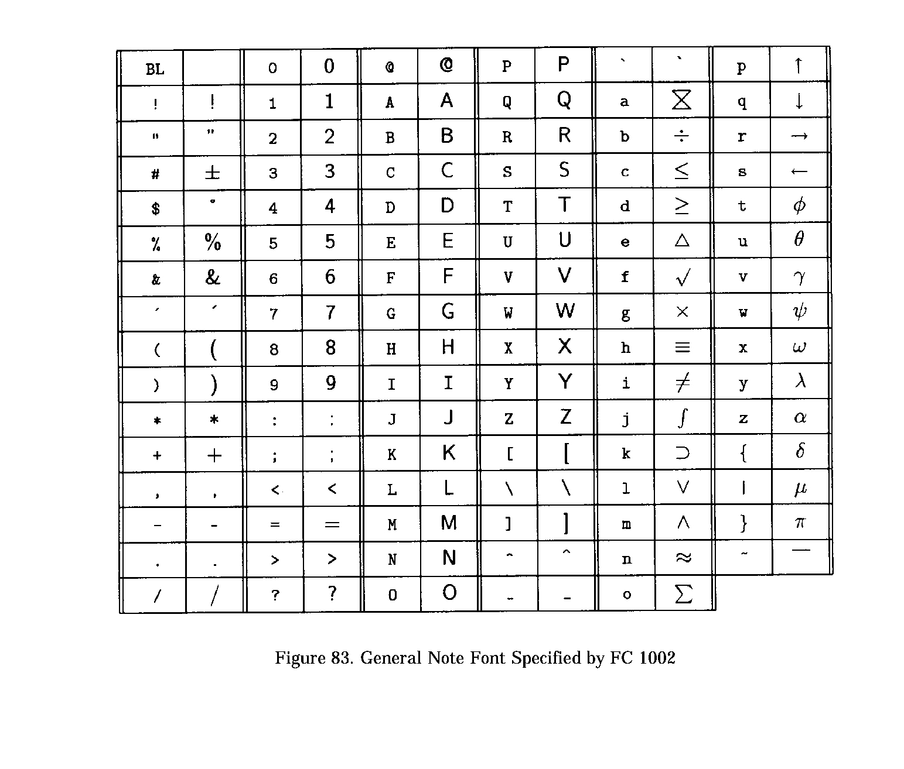

**Figure 84:** General Note Font Specified by FC 1003

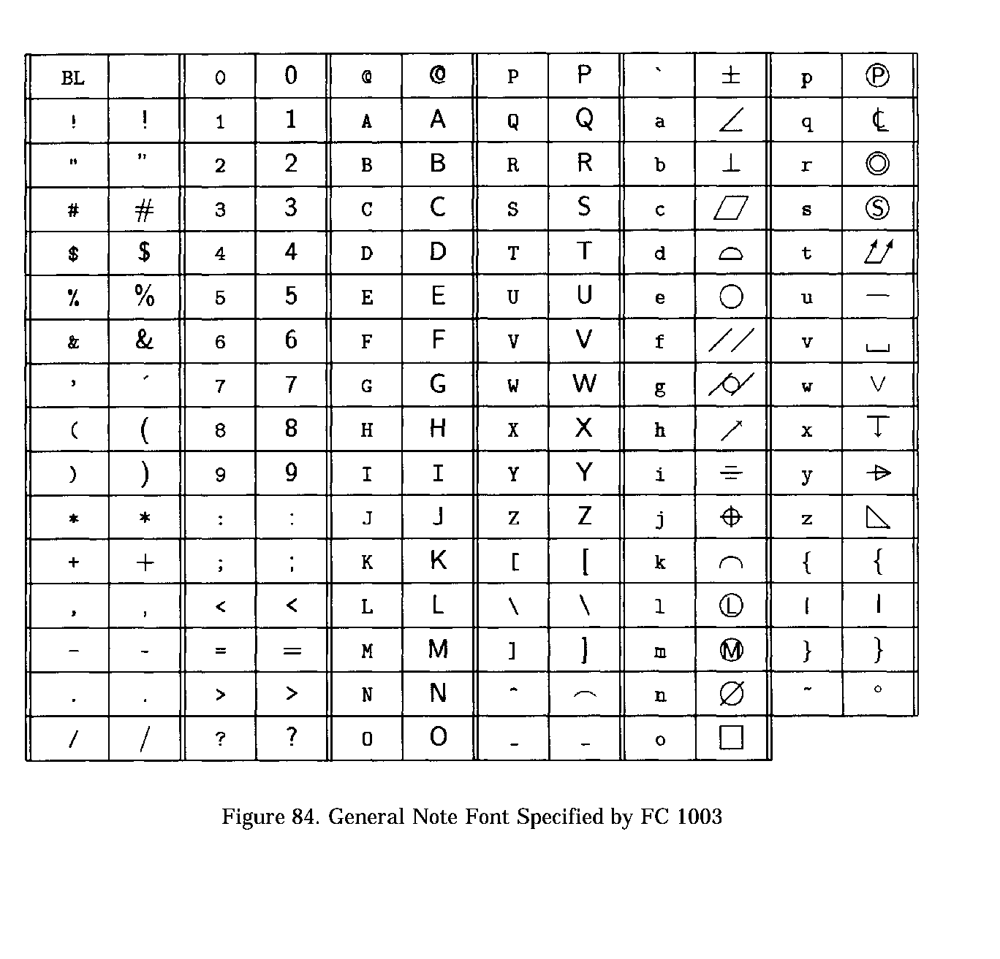

**Figure 85:** UNTESTED General Note Font Specified by FC 3001

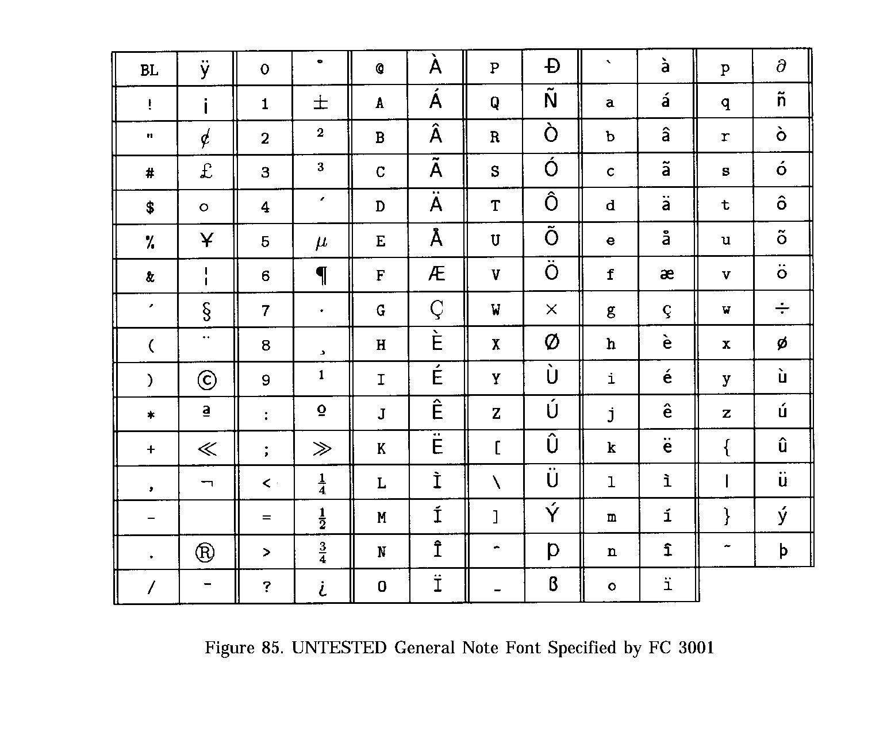

**Directory Entry**

| (1) Entity Type Number | (2) Parameter Data | (3) Structure | (4) Line Font Pattern | (5) Level | (6) View | (7) Xformation Matrix | (8) Label Display | (9) Status Number | (10) Sequence Number |
|---|---|---|---|---|---|---|---|---|---|
| 212 |  | < n.a. > |  |  |  |  |  | **????01\*\*** | D# |

| (11) Entity Type Number | (12) Line Weight | (13) Color Number | (14) Parameter Line Count | (15) Form Number | (16) Reserved | (17) Reserved | (18) Entity Label | (19) Entity Subscript | (20) Sequence Number |
|---|---|---|---|---|---|---|---|---|---|
| 212 |  |  |  |  |  |  |  |  | D#+1 |

Note: Valid values of the Form Number are 0-8, 100-102, 105. *(ECO650)*

**Parameter Data** *(ECO630)*

| Index | Name | Type | Description |
|---|---|---|---|
| 1 | NS | Integer | Number of text strings in General Note |
| 2 | NC(1) | Integer | Number of characters in first string (TEXT(1)) or zero. The number of characters (NC(n)) shall always be equal to the character count of its corresponding text string (TEXT(n)) |
| 3 | WT(1) | Real | Box width |
| 4 | HT(1) | Real | Box height |
| 5 | FC(1) | Integer or Pointer | Font code (default = 1). Pointer to the DE of the Text Font Definition Entity if negative |
| 6 | SL(1) | Real | Slant angle of TEXT1 in radians (π/2 is the value for no slant angle and is the default value) |
| 7 | A(1) | Real | Rotation angle in radians for TEXT1 *(ECO626)* |
| 8 | M(1) | Integer | Mirror flag: 0 = no mirroring; 1 = mirror axis is perpendicular to text base line; 2 = mirror axis is text base line |
| 9 | VH(1) | Integer | Rotate internal text flag: 0 = text horizontal; 1 = text vertical |
| 10 | XS(1) | Real | First text start point |
| 11 | YS(1) | Real |  |
| 12 | ZS(1) | Real | Z depth from XT, YT plane |
| 13 | TEXT(1) | String | First text string |
| 14 | NC(2) | Integer | Number of characters in second text string |
| ... | ... | ... | ... |
| -10+12\*NS | NC(NS) | Integer | Number of characters in last text string |
| ... | ... | ... | ... |
| 1+12\*NS | TEXT(NS) | String | Last text string |

Additional pointers as required (see Section 2.2.4.5.2).

**Table 9:** Character Names for the Symbol and Drafting Fonts

Entries for each FC are hexadecimal ASCII equivalent.

| Name | Symbol | FC 1 | FC 1001 | FC 1002 | FC 1003 |
|---|---|---|---|---|---|
| Space |  | 20 | 20 | 20 | 20 |
| Exclamation mark | ! | 21 | 21 | 21 | 21 |
| Quotation marks | " | 22 | 22 | 22 | 22 |
| Pound sign | # | 23 | 23 |  | 23 |
| Plus/minus |  |  |  | 23 | 60 |
| Dollar sign | $ | 24 | 24 |  | 24 |
| Degree symbol |  |  |  | 24 | 7E |
| Percent sign | % | 25 | 25 | 25 | 25 |
| Ampersand | & | 26 | 26 | 26 | 26 |
| Apostrophe |  | 27 | 27 | 27 | 27 |
| Left parenthesis | ( | 28 | 28 | 28 | 28 |
| Right parenthesis | ) | 29 | 29 | 29 | 29 |
| Asterisk | \* | 2A | 2A | 2A | 2A |
| Plus sign | + | 2B | 2B | 2B | 2B |
| Comma | , | 2C | 2C | 2C | 2C |
| Minus sign/hyphen |  | 2D | 2D | 2D | 2D |
| Period |  | 2E | 2E | 2E | 2E |
| Slash | / | 2F | 2F | 2F | 2F |
| Numeric 0 |  | 30 | 30 | 30 | 30 |
| Numeric 1 | 1 | 31 | 31 | 31 | 31 |
| Numeric 2 | 2 | 32 | 32 | 32 | 32 |
| Numeric 3 | 3 | 33 | 33 | 33 | 33 |
| Numeric 4 | 4 | 34 | 34 | 34 | 34 |
| Numeric 5 | 5 | 35 | 35 | 35 | 35 |
| Numeric 6 | 6 | 36 | 36 | 36 | 36 |
| Numeric 7 | 7 | 37 | 37 | 37 | 37 |
| Numeric 8 | 8 | 38 | 38 | 38 | 38 |
| Numeric 9 | 9 | 39 | 39 | 39 | 39 |
| Colon | : | 3A | 3A | 3A | 3A |
| Semi-colon | ; | 3B | 3B | 3B | 3B |
| Less than | < | 3C | 3C | 3C | 3C |
| Equal sign | = | 3D | 3D | 3D | 3D |
| Greater than | > | 3E | 3E | 3E | 3E |
| Question mark | ? | 3F | 3F | 3F | 3F |
| Commercial at | @ | 40 | 40 | 40 | 40 |
| Upper case letter A | A | 41 | 41 | 41 | 41 |
| Upper case letter B | B | 42 | 42 | 42 | 42 |
| Upper case letter C | C | 43 | 43 | 43 | 43 |
| Upper case letter D | D | 44 | 44 | 44 | 44 |
| Upper case letter E | E | 45 | 45 | 45 | 45 |
| Upper case letter F | F | 46 | 46 | 46 | 46 |
| Upper case letter G | G | 47 | 47 | 47 | 47 |
| Upper case letter H | H | 48 | 48 | 48 | 48 |
| Upper case letter I | I | 49 | 49 | 49 | 49 |
| Upper case letter J | J | 4A | 4A | 4A | 4A |
| Upper case letter K | K | 4B | 4B | 4B | 4B |
| Upper case letter L | L | 4C | 4C | 4C | 4C |
| Upper case letter M | M | 4D | 4D | 4D | 4D |
| Upper case letter N | N | 4E | 4E | 4E | 4E |
| Upper case letter O | O | 4F | 4F | 4F | 4F |
| Upper case letter P | P | 50 | 50 | 50 | 50 |
| Upper case letter Q | Q | 51 | 51 | 51 | 51 |
| Upper case letter R | R | 52 | 52 | 52 | 52 |
| Upper case letter S | S | 53 | 53 | 53 | 53 |
| Upper case letter T | T | 54 | 54 | 54 | 54 |
| Upper case letter U | U | 55 | 55 | 55 | 55 |
| Upper case letter V | V | 56 | 56 | 56 | 56 |
| Upper case letter W | W | 57 | 57 | 57 | 57 |
| Upper case letter X | X | 58 | 58 | 58 | 58 |
| Upper case letter Y | Y | 59 | 59 | 59 | 59 |
| Upper case letter Z | Z | 5A | 5A | 5A | 5A |
| Left bracket | [ | 5B | 5B | 5B | 5B |
| Backward slash | \\ | 5C | 5C | 5C | 5C |
| Right bracket | ] | 5D | 5D | 5D | 5D |
| Caret | ^ | 5E | 5E | 5E |  |
| Arc length |  |  |  |  | 5E |
| Underscore | _ | 5F | 5F | 5F | 5F |
| Reverse quote | \` | 60 | 60 | 60 |  |
| Lower case letter a | a | 61 |  |  |  |
| Angularity |  |  | 61 |  | 61 |
| Marker/symbol |  |  |  | 61 |  |
| Lower case letter b | b | 62 |  |  |  |
| Marker/symbol |  |  | 62 |  |  |
| Division symbol |  |  |  | 62 |  |
| Perpendicularity |  |  |  |  | 62 |
| Lower case letter c | c | 63 |  |  |  |
| Flatness |  |  | 63 |  | 63 |
| Less than or equal |  |  |  | 63 |  |
| Lower case letter d | d | 64 |  |  |  |
| Profile of a surface |  |  | 64 |  | 64 |
| Greater than or equal |  |  |  | 64 |  |
| Lower case letter e | e | 65 |  |  |  |
| Circularity |  |  | 65 |  | 65 |
| Marker/symbol |  |  |  | 65 |  |
| Lower case letter f | f | 66 |  |  |  |
| Parallelism | // |  | 66 |  | 66 |
| Radical |  |  |  | 66 |  |
| Lower case letter g | g | 67 |  |  |  |
| Cylindricity |  |  | 67 |  | 67 |
| Cross product | × |  |  | 67 |  |
| Lower case letter h | h | 68 |  |  |  |
| Circular Runout |  |  | 68 |  | 68 |
| Congruence |  |  |  | 68 |  |
| Lower case letter i | i | 69 |  |  |  |
| Symmetry |  |  | 69 |  | 69 |
| Not equal |  |  |  | 69 |  |
| Lower case letter j |  | 6A |  |  |  |
| Position |  |  | 6A |  | 6A |
| Integral |  |  |  | 6A |  |
| Lower case letter k | k | 6B |  |  |  |
| Profile of a line |  |  | 6B |  | 6B |
| Implication |  |  |  | 6B |  |
| Lower case letter l |  | 6C |  |  |  |
| Perpendicularity |  |  | 6C |  |  |
| Union |  |  |  | 6C |  |
| Least material condition |  |  |  |  | 6C |
| Lower case letter m | m | 6D |  |  |  |
| Maximum material condition |  |  | 6D |  | 6D |
| Intersection |  |  |  | 6D |  |
| Lower case letter n | n | 6E |  |  |  |
| Diameter |  |  | 6E |  | 6E |
| Approximately equal |  |  |  | 6E |  |
| Lower case letter o |  | 6F |  |  |  |
| All around applicability |  |  | 6F |  |  |
| Greek letter sigma (Sum) |  |  |  | 6F |  |
| Square (shape) |  |  |  |  | 6F |
| Lower case letter p |  | 70 |  |  |  |
| Projected tolerance zone |  |  | 70 |  | 70 |
| Up arrow |  |  |  | 70 |  |
| Lower case letter q |  | 71 |  |  |  |
| Centerline |  |  | 71 |  | 71 |
| Down arrow |  |  |  | 71 |  |
| Lower case letter r | r | 72 |  |  |  |
| Concentricity |  |  | 72 |  | 72 |
| Right arrow |  |  |  | 72 |  |
| Lower case letter s | s | 73 |  |  |  |
| Regardless of feature size |  |  | 73 |  | 73 |
| Left arrow |  |  |  | 73 |  |
| Lower case letter t | t | 74 |  |  |  |
| Marker/symbol |  |  | 74 |  |  |
| Greek letter phi |  |  |  | 74 |  |
| Total runout |  |  |  |  | 74 |
| Lower case letter u | u | 75 |  |  |  |
| Marker/symbol |  |  | 75 |  |  |
| Greek letter theta |  |  |  | 75 |  |
| Straightness |  |  |  |  | 75 |
| Lower case letter v | v | 76 |  |  |  |
| Marker/symbol |  |  | 76 |  |  |
| Greek letter gamma |  |  |  | 76 |  |
| Counterbore |  |  |  |  | 76 |
| Lower case letter w |  | 77 |  |  |  |
| Marker/symbol |  |  | 77 |  |  |
| Greek letter psi |  |  |  | 77 |  |
| Countersink |  |  |  |  | 77 |
| Lower case letter x | x | 78 |  |  |  |
| Marker/symbol |  |  | 78 |  |  |
| Greek letter omega |  |  |  | 78 |  |
| Depth |  |  |  |  | 78 |
| Lower case letter y | y | 79 |  |  |  |
| Marker/symbol |  |  | 79 |  |  |
| Greek letter lambda |  |  |  | 79 |  |
| Conical taper |  |  |  |  | 79 |
| Lower case letter z | z | 7A |  |  |  |
| Marker/symbol |  |  | 7A |  |  |
| Greek letter alpha |  |  |  | 7A |  |
| Slope |  |  |  |  | 7A |
| Left brace | { | 7B | 7B |  |  |
| Greek letter mu |  |  |  | 7B |  |
| Vertical bar | \| | 7C | 7C |  | 7C |
| Greek letter pi | π |  |  | 7C |  |
| Right brace | } | 7D | 7D |  | 7D |
| Tilde |  |  |  | 7D |  |
| Overscore | ~ | 7E | 7E |  |  |
| — |  |  |  | 7E |  |

---

## Scope Note: §4.61 onward (3D CAD Reader/Writer Focus)

The remaining §4 transcription is focused on entities required to read, write, and interpret 3D CAD IGES files (solid geometry, topology, assemblies, attributes, and file-structure scaffolding). The following sections of the IGES 5.3 Specification are **intentionally omitted** from this markdown because they are not required for 3D solid-model round-tripping. Each omitted section remains available verbatim in the source PDF (`IGES5-3.pdf`) and text extraction (`text/_section4.txt`):

- **§4.61 New General Note Entity (Type 213)** — drafting annotation detail; supplements §4.60.
- **§4.62 Leader (Arrow) Entity (Type 214)** — drafting annotation.
- **§4.63 Linear Dimension Entity (Type 216)** — drafting.
- **§4.64 Ordinate Dimension Entity (Type 218)** — drafting.
- **§4.65 Point Dimension Entity (Type 220)** — drafting.
- **§4.66 Radius Dimension Entity (Type 222)** — drafting.
- **§4.67 General Symbol Entity (Type 228)** — drafting.
- **§4.68 Sectioned Area Entity (Type 230)** — 2D cross-hatching (drafting).
- **§4.71 MACRO Definition Entity (Type 306)** — deprecated, untested; scripting/MACRO language.
- **§4.72 MACRO Instance Entity** — deprecated, untested.
- **§4.74 Text Font Definition Entity (Type 310)** — non-geometric font data.
- **§4.75 Text Display Template Entity (Type 312)** — text placement templates.
- **§4.78 Network Subfigure Definition Entity (Type 320)** — electrical/schematic specialty.
- **§4.79 Attribute Table Definition Entity (Type 322)** — attribute schema definitions (rarely used in 3D CAD).
- **§4.139 Nodal Load/Constraint Entity (Type 418)** — Finite Element Analysis.

The sections below (§4.69 Associativity Definition through §4.147 Shell Entity, skipping the omitted sections above) are transcribed verbatim from the IGES 5.3 Specification and contain all material required to parse and emit a compliant 3D CAD exchange file.

---

## 4.69 Associativity Definition Entity (Type 302)

The Associativity Definition Entity permits the preprocessor to define an Associativity schema. That is, by using the Associativity definition, the preprocessor defines the type of relationship. It is important to note that this mechanism specifies the syntax of such a relationship and not the semantics.

The definition schema allows the specification of multiple groups of data which are called classes. A class is considered to be a separate list, and the existence of several classes implies an association among the classes as well as among the contents of each class.

For each class, the schema has provision to speciy whether or not back pointers are required. A back pointer being required implies that an entity which is a member of this associativity (when it is instanced) has a pointer in its back pointer parameter section to the directory entry of the associativity instance. *(ECO630)*

The provision in the schema which specifies whether or not a class is ordered indicates if the order of appearance of entries in the class is significant.

In the schema, "ENTRIES" are the members of the class. However, each entry could be composed of several items. If multiple items are required, they will be ordered. For example, if the entries were locations, each entry might have three items to specify X, Y, and Z values.

The associativity definition fixes the number of classes for an Associativity and the number of items per entry in a particular class. Each associativity instance has a variable number of entries per class. In order to help decode instances of the definition, each item is specified as a pointer (to an entity directory entry) or a data value. *(ECO630)*

Two kinds of Associativity Instance Entity (Type 402) are permitted within the file. Pre-defined associativities have form numbers in the range of 1 to 5000 and are defined in Section 4.80.1. Definitions for pre-defined associativities do not appear in the file. The second kind of associativity is defined in the file by a preprocessor using the Associativity Definition Entity. Instances of these associativities have form numbers in the range of 5001–9999. These definitions appear once in the file for each form of Associativity defined. *(ECO630)*

The definition includes the associativity form, the number of class definitions, the number and type of items in each entry, and whether back pointers (from the entity to the Associativity) are required. Each set of values (BP, Order, N, and Item Type) is considered a class. See Figure 111 for a complete example of associativity.

**Directory Entry**

| (1) Entity Type Number | (2) Parameter Data | (3) Structure | (4) Line Font Pattern | (5) Level | (6) View | (7) Xformation Matrix | (8) Label Display | (9) Status Number | (10) Sequence Number |
|---|---|---|---|---|---|---|---|---|---|
| 302 |  | < n.a. > | < n.a. > | < n.a. > | < n.a. > | < n.a. > | < n.a. > | **0002** | D# |

| (11) Entity Type Number | (12) Line Weight | (13) Color Number | (14) Parameter Line Count | (15) Form Number | (16) Reserved | (17) Reserved | (18) Entity Label | (19) Entity Subscript | (20) Sequence Number |
|---|---|---|---|---|---|---|---|---|---|
| 302 | < n.a. > | < n.a. > |  | 5001–9999 |  |  |  |  | D#+1 |

**Parameter Data** *(ECO630, ECO650)*

| Index | Name | Type | Description |
|---|---|---|---|
| 1 | K | Integer | Number of class definitions |
| 2 | BP(1) | Integer | 1 = back pointers required; 2 = back pointers not required |
| 3 | OR(1) | Integer | 1 = ordered class; 2 = unordered class |
| 4 | N(1) | Integer | Number of items per entry |
| 5 | IT(1,1) | Integer | 1 = pointer to a directory entry; 2 = value; 3 = parameter is a value or a pointer (if parameter ≥ 0 it is a value; if parameter < 0, it is a pointer) |
| ... | ... | ... | ... |
| 4+N(1) | IT(1,N1) | Integer |  |

Additional pointers as required (see Section 2.2.4.5.2).

The items in parameters 2 through 4+N(1) are repeated for each of the K classes.

**Figure 111:** Relationships Between Entities in an Associativity


## 4.70 Line Font Definition Entity (Type 304)

Two types of line fonts may be defined. One type considers a line font as a repetition of a basic pattern of visible-blank (or, on-off) segments superimposed on a line or a curve. The line or curve is then displayed according to the basic pattern. The other type considers a line font as a repetition of a template figure that is displayed at regularly spaced locations along a planar anchoring curve. The anchoring curve itself has no visual purpose.

Any line or curve geometry entity type may reference a Line Font Definition Entity by inserting a pointer to that entity in its Directory Entry Field 4, the line font pattern field. The type of line font being specified is then indicated by a form number in the Line Font Definition Entity.

The preprocessor shall select one of the line font patterns (see Section 2.2.4.4.4) and place the value in Directory Entry Field 4 of the Line Font Definition Entity. This value shall be the closest functional equivalent or the most visually similar. The value will be used by postprocessors which cannot support the Line Font Definition Entity. Examples of the standard line font patterns are shown in Figure 114. *(ECO630)*

For the Line Font Definition Entity, the Form Numbers are as follows: *(ECO630)*

| Form | Meaning |
|---|---|
| 1 | Line font specified by a repeating template subfigure |
| 2 | Line font specified by a repeating visible-blank pattern |

**Form 1:** specifies that the line font type is to be a repetition of template figure displays along the referencing anchoring curve. The template figure is specified as a Subfigure Definition Entity (Type 308). In this case, four values specify the entity as follows:

- The first parameter specifies the orientation of the template displays. This may remain constant, or it may vary with the direction of the anchoring curve at the point of each template figure display location.
- The second parameter is a pointer to the Subfigure Definition Entity containing the template display.
- The third parameter specifies display locations on the anchoring curve by giving the common arc length distance between corresponding points on successive template figure displays.
- The fourth parameter gives a scale factor to be applied to the template subfigure at each display location.

Figure 112 illustrates two examples of a line font using Form Number 1. In each case, the anchoring curve is a straight line.

**Form 2:** specifies that the line font type is to be a repetition of a basic visible blank pattern superimposed on the referencing line or curve. An arbitrary number of segments (M) is used in the basic pattern. When the basic pattern is laid out horizontally, the first segment is the leftmost one; the M-th segment is the rightmost one. The length (in the units of the curve on which the pattern is being superimposed) of each segment of the pattern may be specified individually. This allows the visible blank sequence of the pattern to alternate between visible and blank regardless of the lengths of the segments but does not prohibit adjacent segments from being either both visible or both blanked when unequal lengths are employed. Another option for some patterns is to hold the length constant across segments, and achieve variation in the lengths of the visible and blanked segments by making the visible or blank segments be adjacent as required. *(ECO630)*

For example, a basic pattern whose left two-thirds is visible and whose right third is blanked, may be described either by the sequence visible-blank with the length of the first segment twice that of the second, or else by the sequence visible-visible-blank, with the lengths of all three segments equal. *(ECO630)*

The visible-blank sequence is specified by correlating it with the rightmost M bits in the binary representation of a string of hexadecimal digits, the M-th segment being associated with the units bit of the binary representation of the rightmost hexadecimal digit. A 0 represents a blank, or off segment; a 1 represents a visible, or on segment. *(ECO630)*

For this line font type, the first parameter is the positive integer M giving the number of segments in the basic pattern. Then, parameter values 2 through M+1 give the lengths of the M segments. Finally, parameter value M+2 is the minimal string of hexadecimal digits whose significance has been described above.

Figure 113 shows an example of the Form Number 2 with 5 segments of unequal length. Two repetitions of the basic font are illustrated. *(ECO630)*

**Directory Entry**

| (1) Entity Type Number | (2) Parameter Data | (3) Structure | (4) Line Font Pattern | (5) Level | (6) View | (7) Xformation Matrix | (8) Label Display | (9) Status Number | (10) Sequence Number |
|---|---|---|---|---|---|---|---|---|---|
| 304 |  | < n.a. > | 1–5 | < n.a. > | < n.a. > |  | < n.a. > | **0002** | D# |

| (11) Entity Type Number | (12) Line Weight | (13) Color Number | (14) Parameter Line Count | (15) Form Number | (16) Reserved | (17) Reserved | (18) Entity Label | (19) Entity Subscript | (20) Sequence Number |
|---|---|---|---|---|---|---|---|---|---|
| 304 | < n.a. > | < n.a. > |  | 1–2 |  |  |  |  | D#+1 |

**Line font specified by a repeating template subfigure (Form 1)** *(ECO630)*

**Parameter Data**

| Index | Name | Type | Description |
|---|---|---|---|
| 1 | M | Integer | Display flag. 0 = Each template display is oriented by aligning the axes of the subfigure definition coordinate system with the axes of the definition space of the anchoring curve. 1 = Each template display is oriented by aligning the X-axis of the subfigure definition coordinate system with the tangent vector of the anchoring curve at the point of incidence of the curve and the origin of the subfigure. The Z-axis of the subfigure definition coordinate system is aligned with the Z-axis of the definition space of the anchoring curve. |
| 2 | L1 | Pointer | Pointer to the DE of the Subfigure Definition Entity for the template displays |
| 3 | L2 | Real | Common arc length distance between corresponding points on successive template figure displays |
| 4 | L3 | Real | Scale factor to be applied to the subfigure |

Additional pointers as required (see Section 2.2.4.5.2).

**Line font specified by a repeating visible-blank pattern (Form 2)** *(ECO650)*

**Parameter Data**

| Index | Name | Type | Description |
|---|---|---|---|
| 1 | M | Integer | Number of segments in the basic pattern of visible-blank segments |
| 2 | L(1) | Real | Length of the first segment of the basic pattern |
| ... | ... | ... | ... |
| 1+M | L(M) | Real | Length of the last segment of the basic pattern |
| 2+M | B | String | (((M-1)/4) + 1) hexadecimal digits indicating which segments of the basic pattern are visible and which are blanked, where the expression represents the greatest integer result. (e.g., "5" indicates that segments 1 and 3 are visible.) Bits are right justified. |

Additional pointers as required (see Section 2.2.4.5.2).

**Figure 112:** Line Font Definition Using Form Number 1 (Template Subfigure)


**Figure 113:** Line Font Definition Using Form Number 2 (Visible-Blank Pattern)


**Figure 114:** F30402X.IGS — Examples of Standard Line Font Patterns


*(Sections §4.71 MACRO Definition Entity (Type 306) and §4.72 MACRO Instance Entity are omitted — see Scope Note above. These define a deprecated, untested MACRO language for implementor-defined entities; modern CAD interchange does not rely on them.)*

## 4.73 Subfigure Definition Entity (Type 308)

The Subfigure Definition Entity supports multiple instantiation of a defined collection of entities. This reduces file size and simplifies maintenance when an identical feature (e.g. a bolt) is used repeatedly in the file. Each Subfigure Definition Entity may reference any other entities, including other Subfigure Instance Entities (Type 408). When a Subfigure Definition references a Subfigure Instance, it is called *nesting*. DEPTH indicates the amount of nesting. If DEPTH=0, the subfigure has no references to any subfigure instances. A subfigure cannot reference a subfigure instance that has equal or greater depth. A DEPTH=N indicates there is a reference to an instance of a subfigure definition with DEPTH N-1. *(ECO630)*

**Directory Entry**

| (1) Entity Type Number | (2) Parameter Data | (3) Structure | (4) Line Font Pattern | (5) Level | (6) View | (7) Xformation Matrix | (8) Label Display | (9) Status Number | (10) Sequence Number |
|---|---|---|---|---|---|---|---|---|---|
| 308 | ⇒ | < n.a. > | #,⇒ | #,⇒ | < n.a. > | 0,⇒ | 0,⇒ | **??02??** | D# |

| (11) Entity Type Number | (12) Line Weight | (13) Color Number | (14) Parameter Line Count | (15) Form Number | (16) Reserved | (17) Reserved | (18) Entity Label | (19) Entity Subscript | (20) Sequence Number |
|---|---|---|---|---|---|---|---|---|---|
| 308 | # | #,⇒ | # | 0 |  |  |  | # | D#+1 |

Note: When the Hierarchy is set to Global Defer (01), all of the following are ignored and may be defaulted: Line Font Pattern, Line Weight, Color Number, Level, View, and Blank Status.

**Parameter Data** *(ECO650)*

| Index | Name | Type | Description |
|---|---|---|---|
| 1 | DEPTH | Integer | Depth of subfigure (indicating the amount of nesting) |
| 2 | NAME | String | Subfigure name |
| 3 | N | Integer | Number of entities in the subfigure |
| 4 | DE(1) | Pointer | Pointer to the DE of the first associated entity |
| ... | ... | ... | ... |
| 3+N | DE(N) | Pointer | Pointer to the DE of the last associated entity |

Additional pointers as required (see Section 2.2.4.5.2).

*(Sections §4.74 Text Font Definition Entity (Type 310) and §4.75 Text Display Template Entity (Type 312) are omitted — see Scope Note above. These entities define character-stroke fonts and text-display templates for drafting annotation; they are not used in 3D solid-model geometry interchange.)*

## 4.76 Color Definition Entity (Type 314)

The Color Definition Entity specifies the relationship of the primary (red, green, and blue) colors to the intensity level of the respective graphics devices as a percent of the full intensity range. *(ECO630)*

These red, green, blue coordinates (RGB) can be readily transformed to cyan, magenta, yellow (CMY) and to hue, lightness, saturation (HLS) using transformations that are given in Appendix D.

The preprocessor shall select one of the Color Numbers (see Section 2.2.4.4.13) and place the value in Directory Entry Field 13 of the Color Definition Entity. This value shall be the closest functional equivalent, or the most visually similar. The value shall be used by postprocessors which cannot support the Color Definition Entity. *(ECO630)*

**Directory Entry**

| (1) Entity Type Number | (2) Parameter Data | (3) Structure | (4) Line Font Pattern | (5) Level | (6) View | (7) Xformation Matrix | (8) Label Display | (9) Status Number | (10) Sequence Number |
|---|---|---|---|---|---|---|---|---|---|
| 314 | ⇒ | < n.a. > | < n.a. > | < n.a. > | < n.a. > | < n.a. > | < n.a. > | **0002** | D# |

| (11) Entity Type Number | (12) Line Weight | (13) Color Number | (14) Parameter Line Count | (15) Form Number | (16) Reserved | (17) Reserved | (18) Entity Label | (19) Entity Subscript | (20) Sequence Number |
|---|---|---|---|---|---|---|---|---|---|
| 314 | < n.a. > | 1–8 | # | 0 |  |  |  | # | D#+1 |

**Parameter Data** *(ECO630)*

| Index | Name | Type | Description |
|---|---|---|---|
| 1 | CC1 | Real | First color coordinate (red) as a percent of full intensity (range 0.0 to 100.0) |
| 2 | CC2 | Real | Second color coordinate (green) as a percent of full intensity (range 0.0 to 100.0) |
| 3 | CC3 | Real | Third color coordinate (blue) as a percent of full intensity (range 0.0 to 100.0) |
| 4 | CNAME | String | Color name; this is an optional character string which may contain some verbal description of the color. If the color name is not provided and additional pointers are required, the color name shall be defaulted. |

Additional pointers as required (see Section 2.2.4.5.2).

## 4.77 Units Data Entity (Type 316)‡

*The Units Data Entity has not been tested. See Section 1.9.* *(ECO630)*

This entity stores data about a model's fundamental units. The first entry (NP) is the number of data strings in the PD. The entity then contains records, each of which contains a pair of string variables and a real scale factor. The first variable contains the unit to be set, the second variable contains one of the valid entries, and the third variable contains a scale factor to be applied to the unit.

If the real data associated with any entity is not expressed in the units of length defined in the global section or the SI (MKSA) defaults for the Tabular Data Entity (Type 406, Form 11), a Units Data Entity (Type 316) shall be attached to the data entity via a property pointer. *(ECO630)*

There are seven base units and two supplementary units from which all other units can be derived. Therefore, the value of TYP in the above parameter data shall be chosen from the following list of valid TYP strings: *(ECO630)*

| TYP | Indicates unit of |
|---|---|
| LENGTH | Length |
| MASS | Mass |
| TIME | Time |
| CURRENT | Electric Current |
| TEMPERATURE | Thermodynamic Temperature |
| AMOUNT | Amount of Substance |
| INTENSITY | Luminous Intensity |
| PLANE | Plane Angle |
| SOLID | Solid Angle |

A given TYP determines which of the following lists shall be used to specify the particular units. *(ECO630)*

Valid VAL strings for TYP = LENGTH:

| VAL | Description |
|---|---|
| A | Angstrom |
| AU | Astronomical Unit |
| FT | Foot |
| IN | Inch |
| LY | Light Year |
| M | Meter |
| UM | Micron |
| MIL | Mil (.001 Inch) |
| MI | Mile |
| KN | Nautical Mile |
| Y | Yard |

Valid VAL strings for TYP = MASS:

| VAL | Description |
|---|---|
| C | Carat |
| DR | Dram |
| GA | Grain |
| KG | Kilogram |
| MT | Metric Tonne |
| OU | Ounce |
| LB | Pound |
| S | Slug |

Valid VAL strings for TYP = TIME:

| VAL | Description |
|---|---|
| D | Day |
| HR | Hour |
| M | Minute |
| S | Second |
| W | Week |
| Y | Year |

Valid VAL strings for TYP = CURRENT:

| VAL | Description |
|---|---|
| A | Ampere |

Valid VAL strings for TYP = TEMPERATURE:

| VAL | Description |
|---|---|
| C | Centigrade |
| F | Fahrenheit |
| K | Kelvin |
| R | Rankine |

Valid VAL strings for TYP = AMOUNT:

| VAL | Description |
|---|---|
| M | Mole |

Valid VAL strings for TYP = INTENSITY:

| VAL | Description |
|---|---|
| C | Candela |

Valid VAL strings for TYP = PLANE:

| VAL | Description |
|---|---|
| D | Degree |
| G | Grad |
| M | Minute |
| R | Radian |
| REV | Revolution |
| S | Second |

Valid VAL strings for TYP = SOLID:

| VAL | Description |
|---|---|
| C | Steradian |

**Directory Entry**

| (1) Entity Type Number | (2) Parameter Data | (3) Structure | (4) Line Font Pattern | (5) Level | (6) View | (7) Xformation Matrix | (8) Label Display | (9) Status Number | (10) Sequence Number |
|---|---|---|---|---|---|---|---|---|---|
| 316 | ⇒ | < n.a. > | < n.a. > | < n.a. > | < n.a. > | < n.a. > | < n.a. > | **0002** | D# |

| (11) Entity Type Number | (12) Line Weight | (13) Color Number | (14) Parameter Line Count | (15) Form Number | (16) Reserved | (17) Reserved | (18) Entity Label | (19) Entity Subscript | (20) Sequence Number |
|---|---|---|---|---|---|---|---|---|---|
| 316 | < n.a. > | < n.a. > | # | 0 |  |  |  |  | D#+1 |

**Parameter Data**

| Index | Name | Type | Description |
|---|---|---|---|
| 1 | NP | Integer | Number of units defined by this entity |
| 2 | TYP(1) | String | Type of first unit being defined |
| 3 | VAL(1) | String | Units of first unit being defined |
| 4 | SF(1) | Real | A multiplicative scale factor to be applied to the first unit |
| ... | ... | ... | ... |
| -1+3*NP | TYP(NP) | String | Type of last unit being defined |
| 3*NP | VAL(NP) | String | Units of last unit being defined |
| 1+3*NP | SF(NP) | Real | A multiplicative scale factor to be applied to the last unit |

Additional pointers as required (see Section 2.2.4.5.2).

*(Sections §4.78 Network Subfigure Definition Entity (Type 320) and §4.79 Attribute Table Definition Entity (Type 322) are omitted — see Scope Note above. §4.78 is a specialized variant of §4.73 for electrical/schematic network designs; §4.79 defines attribute-table schemas, rarely used in 3D CAD.)*

## 4.80 Associativity Instance Entity (Type 402)

Each time an associativity relation is needed, an Associativity Instance Entity shall be used. *(ECO630)*

The Form Number of the associativity instance identifies the meaning of the entity. If the Form Number is between 1 and 5000, the definition is specified as described in Section 4.80.1 and following sections. If the Form Number is between 5001 and 9999, an Associativity Definition Entity (Type 302) shall occur in the file, and the Structure Field of the instance (DE Field 3) shall reference the Directory Entry of this definition entity. *(ECO630)*

Each entity that is a member of an Associativity Instance may contain a back pointer to the Associativity Instance (see Section 2.2.4.5.2). *(ECO630)*

The parameters K and N(1), N(2), ..., N(K) are specified in the Associativity Definition (see Section 4.69). *(ECO630)*

### 4.80.1 Pre-defined Associativities

As defined in Section 4.69, the Associativity Definition Entity (Type 302) shall only occur in the file for Form Numbers 5001 through 9999. The following Sections contain the definitions of the pre-defined associativities as they would appear if they were defined by an implementor. Also included in these Sections are the descriptions of each associativity's parameters in a manner similar to other entities in this Specification. *(ECO630)*

The general format of the parameter data for an Associativity Instance Entity is:

**Parameter Data** *(ECO650)*

| Index | Name | Type | Description |
|---|---|---|---|
| 1 | NE(1) | Integer | Number of class one entries |
| 2 | NE(2) | Integer | Number of class two entries |
| ... | ... | ... | ... |
| K | NE(K) | Integer | Number of class K entries |

For K classes with (NE(1), ..., NE(K)) entries with (N(1), ..., N(K)) items per entry, the entries follow in order:

| Index | Name | Type | Description |
|---|---|---|---|
| ... | I(1,1,1) | Variable | Class 1, Entry 1, Item 1 |
| ... | ... | ... | ... |
| ... | I(1,NE(1),N(1)) | Variable | Class 1, Entry NE(1), Item N(1) |
| ... | I(2,1,1) | Variable | Class 2, Entry 1, Item 1 |
| ... | ... | ... | ... |
| ... | I(2,NE(2),N(2)) | Variable | Class 2, Entry NE(2), Item N(2) |
| ... | ... | ... | ... |
| ... | I(K,1,1) | Variable | Class K, Entry 1, Item 1 |
| ... | ... | ... | ... |
| ... | I(K,NE(K),N(K)) | Variable | Class K, Entry NE(K), Item N(K) |

Additional pointers as required (see Section 2.2.4.5.2).

## 4.81 Group Associativity (Type 402, Form 1)

The Group Associativity allows a collection of entities to be maintained as a single, logical entity. Figure 111 is an example. *(ECO630)*

There are four form numbers which specify group associativities:

| Form | Meaning |
|---|---|
| 1 | Unordered group with back pointers |
| 7 | Unordered group without back pointers |
| 14 | Ordered group with back pointers |
| 15 | Ordered group without back pointers |

The first (Form=1) is defined here; the others are defined in Sections 4.85 (Form=7), 4.89 (Form=14), and 4.90 (Form=15), respectively.

**DEFINITION**

| Index | Set Value | Meaning |
|---|---|---|
| 1 | 1 | One class |
| 2 | 1 | Back pointers required |
| 3 | 2 | Unordered |
| 4 | 1 | One item per entry |
| 5 | 1 | The item is a pointer |

**DESCRIPTION**

**Parameter Data** *(ECO650)*

| Index | Name | Type | Description |
|---|---|---|---|
| 1 | N | Integer | Number of entries |
| 2 | DE(1) | Pointer | Pointer to the DE of the first entity |
| ... | ... | ... | ... |
| 1+N | DE(N) | Pointer | Pointer to the DE of the last entity |

Additional pointers as required (see Section 2.2.4.5.2).

## 4.82 Views Visible Associativity (Type 402, Form 3)

When an entity is to be displayed in a single view, a pointer to that View Entity (Type 410) is entered in Field 6 of the entity's DE. *(ECO630)*

If one or more entities are to be displayed in more than one view, but not in all views, Field 6 of their Directory Entries shall reference an instance of this entity. This form of the associativity contains two classes of information. The first class contains the number of views in which an entity is visible, followed by references to those views. The optional second class contains the number of entities whose display is specified by this instance, followed by pointers to each of the entities. *(ECO630)*

**DESCRIPTION**

**Parameter Data** *(ECO650)*

| Index | Name | Type | Description |
|---|---|---|---|
| 1 | N1 | Integer | Number of views visible |
| 2 | N2 | Integer | Number of entities displayed in these views, or zero |
| 3 | DEV(1) | Pointer | Pointer to the DE of the first View Entity |
| ... | ... | ... | ... |
| 2+N1 | DEV(N1) | Pointer | Pointer to the DE of the last View Entity |
| 3+N1 | DE(1) | Pointer | Pointer to the DE of the first entity whose display is being specified by this associativity instance |
| ... | ... | ... | ... |
| 2+N2+N1 | DE(N2) | Pointer | Pointer to the DE of the last entity whose display is being specified by this associativity instance |

Additional pointers as required (see Section 2.2.4.5.2).

## 4.83 Views Visible, Color, Line Weight Associativity (Form 4)

This associativity is an extension of Form Number 3. Entities that are visible in multiple views, but have a different line font, color number, or line weight in each view, shall reference an instance of this entity from DE Field 6. *(ECO630)*

In the parameter data portion of the associativity instance, the Parameter N1 shall indicate the number of blocks containing the views visible, line font, color number, and line weight specifications. Each block shall contain a pointer to the View Entity (Type 410), a line font value or 0, a pointer to a Line Font Definition Entity (Type 304) if the line font value was 0, a color value or pointer to a Color Definition Entity (Type 314), and a line weight value. Parameter N2 shall contain the number of entities which are members of this associativity (i.e., entities which have this particular display characteristic) or zero. *(ECO630)*

If more than one entity appears in Class 2, the complete set of display characteristics in Class 1 applies to each entity in Class 2.

**DEFINITION**

| Index | Set Value | Meaning |
|---|---|---|
| 1 | 2 | Two classes |
|  |  | **Class 1 (View)** |
| 2 | 1 | Back pointers required |
| 3 | 2 | Unordered |
| 4 | 5 | Five items per entry |
|  |  | (Entry template) |
| 5 | 1 | Pointer to View Entity |
| 6 | 2 | Line Font value |
| 7 | 1 | Pointer to Line Font Definition Entity |
| 8 | 3 | Color Number (value) or pointer |
| 9 | 2 | Line Weight (value) |
|  |  | **Class 2 (Entity)** |
| 10 | 2 | Back pointers not required |
| 11 | 2 | Unordered |
| 12 | 1 | One item per entry |
| 13 | 1 | Item is a pointer (to entity) |

**DESCRIPTION**

**Parameter Data** *(ECO630, ECO650)*

| Index | Name | Type | Description |
|---|---|---|---|
| 1 | N1 | Integer | Number of blocks containing the view visible, line font, color number, and line weight information |
| 2 | N2 | Integer | Number of entities which have this particular set of display characteristics, or zero |
| 3 | DEV(1) | Pointer | Pointer to the DE of the first View Entity |
| 4 | LF(1) | Integer | Line font value or zero |
| 5 | DEF(1) | Pointer | Pointer to the DE of the Line Font Definition Entity or zero (only used if LF(1) = 0) |
| 6 | CN(1) | Integer or Pointer | Color number value, or Pointer to the DE of the Color Definition Entity |
| 7 | LW(1) | Integer | Line weight value |
| 8 | DEV(2) | Pointer | Pointer to the DE of the second View Entity |
| ... | ... | ... | ... |
| 2+5*N1 | LW(N1) | Integer | Last line weight value |
| 3+5*N1 | DE(1) | Pointer | Pointer to the DE of the first entity |
| ... | ... | ... | ... |
| 2+N2+5*N1 | DE(N2) | Pointer | Pointer to the DE of the last entity |

Additional pointers as required (see Section 2.2.4.5.2).

## 4.84 Entity Label Display Associativity (Type 402, Form 5)

Some entities may have one or more possible displays for their entity labels, depending on the view in which they are being displayed. For those entities, the Label Display Field (Field 8) of the DE contains a pointer to an instance of this associativity.

In the parameter data portion of the associativity instance, the parameter N shall indicate the number of blocks containing label placement information. Each block shall reference a View Entity (Type 410) which specifies the view of visibility. The remaining information (text location, leader, and level number) applies to the label for that view. *(ECO630)*

**DEFINITION**

| Index | Set Value | Meaning |
|---|---|---|
| 1 | 1 | One class |
| 2 | 2 | Back pointers not required |
| 3 | 1 | Ordered |
| 4 | 7 | Seven items per entry |
| 5 | 1 | Pointer to View Entity |
| 6 | 2 | XT of text location |
| 7 | 2 | YT of text location |
| 8 | 2 | ZT of text location |
| 9 | 1 | Pointer to Leader Entity |
| 10 | 2 | Entity label level number |
| 11 | 1 | Pointer to entity |

**DESCRIPTION**

**Parameter Data** *(ECO650)*

| Index | Name | Type | Description |
|---|---|---|---|
| 1 | N | Integer | Number of label placements |
| 2 | DEV(1) | Pointer | Pointer to the DE of the first View Entity |
| 3 | XT(1) | Real | XT coordinate of text location in first view |
| 4 | YT(1) | Real | YT coordinate of text location in first view |
| 5 | ZT(1) | Real | ZT coordinate of text location in first view |
| 6 | DEARRW(1) | Pointer | Pointer to the DE of the Leader Entity in first view |
| 7 | LLN(1) | Integer | Entity label level number in first view |
| 8 | DE(1) | Pointer | Pointer to the DE of the first entity being displayed |
| ... | ... | ... | ... |
| -5+7*N | DEV(N) | Pointer | Pointer to the DE of the last View Entity |
| -4+7*N | XT(N) | Real | XT coordinate of text location in last view |
| -3+7*N | YT(N) | Real | YT coordinate of text location in last view |
| -2+7*N | ZT(N) | Real | ZT coordinate of text location in last view |
| -1+7*N | DEARRW(N) | Pointer | Pointer to the DE of the Leader Entity in last view |
| 7*N | LLN(N) | Integer | Entity label level number in last view |
| 1+7*N | DE(N) | Pointer | Pointer to the DE of the last entity being displayed |

Additional pointers as required (see Section 2.2.4.5.2).

## 4.85 Group Without Back Pointers Associativity (Form 7)

See Section 4.80 for a discussion of Groups.

**DEFINITION**

| Index | Set Value | Meaning |
|---|---|---|
| 1 | 1 | One class |
| 2 | 2 | Back pointers not required |
| 3 | 2 | Unordered |
| 4 | 1 | One item per entry |
| 5 | 1 | The item is a pointer |

**DESCRIPTION**

**Parameter Data** *(ECO650)*

| Index | Name | Type | Description |
|---|---|---|---|
| 1 | N | Integer | Number of entries |
| 2 | DE(1) | Pointer | Pointer to the DE of the first entity |
| ... | ... | ... | ... |
| 1+N | DE(N) | Pointer | Pointer to the DE of the last entity |

Additional pointers as required (see Section 2.2.4.5.2).

## 4.86 Single Parent Associativity (Type 402, Form 9)

This associativity defines a logical structure of one independent (parent) entity and one or more subordinate (children) entities. *(ECO630)*

Both parent and child entities require back pointers to this instance. Any necessary display parameters are specified by the parent entity.

**DEFINITION**

| Index | Set Value | Meaning |
|---|---|---|
| 1 | 2 | Two classes |
|  |  | **Class 1 (parent)** |
| 2 | 1 | Back pointers required |
| 3 | 2 | Unordered |
| 4 | 1 | One item per entry |
| 5 | 1 | Item is pointer to parent entity |
|  |  | **Class 2 (children)** |
| 6 | 1 | Back pointers required |
| 7 | 1 | Ordered |
| 8 | 1 | One item per entry |
| 9 | 1 | Item is pointer to child entity |

**DESCRIPTION**

**Parameter Data** *(ECO630, ECO650)*

| Index | Name | Type | Description |
|---|---|---|---|
| 1 | NP | Integer | Number of parent entities (NP=1 is required) |
| 2 | NC | Integer | Number of children |
| 3 | DE | Pointer | Pointer to the DE of the parent entity |
| 4 | DE(1) | Pointer | Pointer to the DE of the first child entity |
| ... | ... | ... | ... |
| 2+NC | DE(NC) | Pointer | Pointer to the DE of the last child entity |

Additional pointers as required (see Section 2.2.4.5.2).

## 4.87 External Reference File Index Associativity (Form 12)

The External Reference File Index Entity appears in one file which contains definitions referenced by another file. It contains a list of the symbolic names used by the referencing files and the DE pointers to the corresponding definitions within the referenced file. See Section 3.6.4 and the External Reference Entity (Type 416) for more detail.

**DEFINITION**

| Index | Set Value | Meaning |
|---|---|---|
| 1 | 1 | One class (externally referenced entities) |
| 2 | 2 | Back pointers not required |
| 3 | 2 | Unordered list of entries in a class |
| 4 | 2 | Number of items in an entry |
| 5 | 2 | First item is a value (External Reference Entity symbolic name) |
| 6 | 1 | Second item is a pointer (internal entity DE pointer) |

**DESCRIPTION**

**Parameter Data** *(ECO650)*

| Index | Name | Type | Description |
|---|---|---|---|
| 1 | N | Integer | Number of index entries |
| 2 | NAME(1) | String | First External Reference Entity symbolic name |
| 3 | PTR(1) | Pointer | Pointer to the DE of the first internal entity |
| ... | ... | ... | ... |
| 2*N | NAME(N) | String | Last External Reference Entity symbolic name |
| 1+2*N | PTR(N) | Pointer | Pointer to the DE of the last internal entity |

Additional pointers as required (see Section 2.2.4.5.2).

*(Section §4.88 Dimensioned Geometry Associativity (Type 402, Form 13) is omitted — this form has been replaced by the new form §4.95 (Type 402, Form 21) and is slated to move to the Obsolete Entities Appendix. Preprocessors should no longer generate it.)*

## 4.89 Ordered Group with Back Pointers Associativity (Form 14)

See Section 4.80 for a discussion of Groups.

**DEFINITION**

| Index | Set Value | Meaning |
|---|---|---|
| 1 | 1 | One class |
| 2 | 1 | Back pointers required |
| 3 | 1 | Ordered |
| 4 | 1 | One item per entry |
| 5 | 1 | The item is a pointer |

**DESCRIPTION**

**Parameter Data** *(ECO650)*

| Index | Name | Type | Description |
|---|---|---|---|
| 1 | N | Integer | Number of entries |
| 2 | DE(1) | Pointer | Pointer to the DE of the first entity |
| ... | ... | ... | ... |
| 1+N | DE(N) | Pointer | Pointer to the DE of the last entity |

Additional pointers as required (see Section 2.2.4.5.2).

## 4.90 Ordered Group, no Back Pointers Associativity (Form 15)

See Section 4.80 for a discussion of Groups.

**DEFINITION**

| Index | Set Value | Meaning |
|---|---|---|
| 1 | 1 | One class |
| 2 | 2 | Back pointers not required |
| 3 | 1 | Ordered |
| 4 | 1 | One item per entry |
| 5 | 1 | The item is a pointer |

**DESCRIPTION**

**Parameter Data** *(ECO650)*

| Index | Name | Type | Description |
|---|---|---|---|
| 1 | N | Integer | Number of entries |
| 2 | DE(1) | Pointer | Pointer to the DE of the first entity |
| ... | ... | ... | ... |
| 1+N | DE(N) | Pointer | Pointer to the DE of the last entity |

Additional pointers as required (see Section 2.2.4.5.2).

## 4.91 Planar Associativity (Type 402, Form 16)

This associativity is used to indicate that a collection of entities is coplanar. The entities in the collection may be geometric, annotative, or structural. If an entity references subordinate entities, they shall also be coplanar. *(ECO630)*

The first class contains the pointer to the Transformation Matrix Entity (Type 124) indicating the plane to which the entities have been moved. The plane in question is the image, under this transformation, of the XY plane. As noted in the description for DE Field 7, the value 0 may be used to indicate the identity transformation matrix. This matrix is informational only for the associativity; the constituent entities shall be properly positioned in model space. *(ECO630)*

The second class contains the pointers to the coplanar entities.

**DEFINITION**

| Index | Set Value | Meaning |
|---|---|---|
| 1 | 2 | Two classes |
|  |  | **Class 1 (Transformation Matrix)** |
| 2 | 2 | Back pointers not required |
| 3 | 1 | Ordered class |
| 4 | 1 | Number of items per entry |
| 5 | 1 | Pointer |
|  |  | **Class 2 (Coplanar Entities)** |
| 6 | 2 | Back pointers not required |
| 7 | 2 | Unordered class |
| 8 | 1 | Number of items per entry |
| 9 | 1 | Pointer |

**DESCRIPTION**

**Parameter Data** *(ECO630, ECO650)*

| Index | Name | Type | Description |
|---|---|---|---|
| 1 | NTR | Integer | Number of Transformation Matrices (NTR=1 is required) |
| 2 | N | Integer | Number of entities in this plane pointed to by this associativity |
| 3 | DETR | Pointer | Pointer to the DE of the Transformation Matrix moving data from XY plane into plane of co-planarity, or zero |
| 4 | DE(1) | Pointer | Pointer to the DE of the first entity on plane specified |
| ... | ... | ... | ... |
| 3+N | DE(N) | Pointer | Pointer to the DE of the last entity on plane specified |

Additional pointers as required (see Section 2.2.4.5.2).

*(Sections §4.92 Flow Associativity (Form 18), §4.93 Segmented Views Visible Associativity (Type 402, Form 19), §4.94 Piping Flow Associativity (Type 402, Form 20), and §4.95 Dimensioned Geometry Associativity (Type 402, Form 21) are omitted — see Scope Note above. §4.92/§4.94 are plant-design/electrical network flow-path associativities; §4.93 handles per-segment curve display in views (drafting); §4.95 is the replacement for the obsolete §4.88 Dimensioned Geometry associativity. None are required for 3D solid-model interchange.)*

## 4.96 Drawing Entity (Type 404)

The Drawing Entity specifies a drawing as a collection of annotation entities (i.e., any entity with its Entity Use Flag set to 01) defined in drawing space, and views (i.e., projections of model space data in view space). The collection depicts a part in the same way that an engineering drawing depicts a part in standard drafting practice. Views are specified by referencing View Entities (Type 410). If desired, multiple drawings can be included in a single file, referring to the same model space. *(ECO630)*

Drawings are located in drawing space as illustrated in Figure 125, with sides coincident with the drawing coordinate system axes and with the lower left corner at the origin (0,0). The drawing space coordinate system $(X_D, Y_D)$ is a special 2-dimensional coordinate system used for view origin locations in the Drawing Entity and for annotation entities referenced by the Drawing Entity. Any Z coordinates are ignored in the referenced annotation entities, and any transformation matrix from definition space to drawing space must be 2-dimensional (i.e., in the Transformation Entity (Type 124), $T_3 = R_{13} = R_{31} = R_{32} = R_{23} = 0.0$ and $R_{33} = 1.0$).

Annotation entities can be defined in drawing space and be referenced by the Drawing Entity directly, or can be defined in model space and appear in individual views. When defined in drawing space, the annotation entities shall have physically dependent (01) status. A View Entity referenced by the Drawing Entity shall have logically dependent (02) status. *(ECO630)*

The transformation of a view from view space to drawing space is controlled by the view scale factor $S$, specified in the View Entity, and the view origin drawing locations, specified in the Drawing Entity. For orthographic parallel projection, the transformation is: *(ECO636)*

$$\begin{pmatrix} X_D \\ Y_D \end{pmatrix} = S \cdot \begin{pmatrix} X_V \\ Y_V \end{pmatrix} + \begin{pmatrix} \text{XORIGIN} \\ \text{YORIGIN} \end{pmatrix}$$

where $(X_V, Y_V)$ denotes the view space coordinates, and $(\text{XORIGIN}, \text{YORIGIN})$ denotes the drawing space coordinates of the origin of the transformed view (see Section 4.134).

The following formula defines view scale:

$$S = L_d / L_m$$

where
- $S$ = View scale
- $L_d$ = Length in drawing space units
- $L_m$ = Length in model space units

The following formula relates the view scale (parameter 2 of the View Entity (Type 410)), the length of an entity as measured in model space units, and the length of an entity as measured in drawing space units:

$$L_d = L_m \cdot S$$

The above formulas always apply, even when drawing units differ from model space units (see Drawing Units Property (Type 406, Form 17)).

**EXAMPLES:** In a file where the model space units are inches, and the drawing space units are centimeters, the following cases illustrate correct scale factor usage:

- A view scale of 2.54 means that a line which is 1 inch long in model space is to be presented on the drawing as 2.54 centimeters long.
- A view scale of 5.08 means that a line which is 1 inch long in model space is to be presented on the drawing as 5.08 centimeters long.

Some CAD systems maintain a rotation, in addition to a translation and scaling, between the view and drawing coordinate systems. It is not possible to correctly capture the relationships among all three coordinate systems — model, view and drawing — using Form 0 of the Drawing Entity. A rotation is needed in addition to the translation for transforming view to drawing coordinates provided by Form 0. A Form 1 is defined which shall be used in this case.

As with Form 0, the transformation for Form 1 is controlled by the view scale factor $S$ and the view origin drawing location. In addition, a rotation angle $\theta$ is applied as follows: *(ECO630)*

$$\begin{pmatrix} X_D \\ Y_D \end{pmatrix} = S \cdot \begin{pmatrix} \cos\theta & -\sin\theta \\ \sin\theta & \cos\theta \end{pmatrix} \begin{pmatrix} X_V \\ Y_V \end{pmatrix} + \begin{pmatrix} \text{XORIGIN} \\ \text{YORIGIN} \end{pmatrix}$$

Systems not having the ability to apply a rotation between their view and drawing coordinate systems will have to choose which of the two to keep correctly. It is recommended that drawing coordinates be maintained in preference to view coordinates in all cases where both coordinate systems cannot be maintained in the receiving system. To do this, the rotation must be incorporated into the transformation from Model to View coordinates.

If there is plane clipping, the situation is more complex, as clipping is done in View coordinates. In this case, conceptually (there are other ways of obtaining the same result), the following must be done:

- Transform from model to view space.
- Perform clipping.
- Perform projection onto the view plane.
- Transform from view space to drawing space.

The name of the drawing may be provided by using the Name Property (Type 406, Form 15). The size of the drawing may be specified by using the Drawing Size Property (Type 406, Form 16). The units for drawing space may be set differently from the model space units specified in the Global Section by use of the Drawing Units Property Entity (Type 406, Form 17). When this property is not referenced by a drawing, that drawing's units are the same as the model units. *(ECO630)*

The following values are given in drawing units:

- view origin drawing locations
- drawing size
- coordinates of annotation entities referenced directly

Refer to Figures 125 and 126 for examples of the use of the Drawing Entity.

**Directory Entry — Drawing Entity (Type 404)** *(ECO630)*

| Field | 1 | 2 | 3 | 4 | 5 | 6 | 7 | 8 | 9 | 10 |
|---|---|---|---|---|---|---|---|---|---|---|
| Value | 404 | => | 0 | n.a. | n.a. | 0 | n.a. | 0 | **00000001** | 404 |

| Field | 11 | 12 | 13 | 14 | 15 | 16 | 17 | 18 | 19 | 20 |
|---|---|---|---|---|---|---|---|---|---|---|
| Value | 0 or 1 | n.a. | n.a. | n.a. | 0 | 0 | DRAWING | # | 0 |  |

**Parameter Data — Drawing Entity, Form 0** *(ECO630, ECO650)*

| Index | Name | Type | Description |
|---|---|---|---|
| 1 | N | Integer | Number of View pointers or zero (default) |
| 2 | VPTR(1) | Pointer | Pointer to the DE of the first View Entity |
| 3 | XORIGIN(1) | Real | Drawing space coordinate of the origin of the first View Entity |
| 4 | YORIGIN(1) | Real | Drawing space coordinate of the origin of the first View Entity |
| ... | ... | ... | ... |
| -2+3*N | VPTR(N) | Pointer | Pointer to the DE of the last View Entity |
| -1+3*N | XORIGIN(N) | Real | Drawing space coordinate of the origin of the last View Entity |
| 3*N | YORIGIN(N) | Real | Drawing space coordinate of the origin of the last View Entity |
| 1+3*N | M | Integer | Number of Annotation Entities or zero (default) |
| 2+3*N | DPTR(1) | Pointer | Pointer to the DE of the first annotation entity in this Drawing |
| ... | ... | ... | ... |
| 1+M+3*N | DPTR(M) | Pointer | Pointer to the DE of the last annotation entity in this Drawing |

Additional pointers as required (see Section 2.2.4.5.2).

**Parameter Data — Drawing Entity, Form 1** *(ECO630, ECO650)*

| Index | Name | Type | Description |
|---|---|---|---|
| 1 | N | Integer | Number of View pointers or zero (default) |
| 2 | VPTR(1) | Pointer | Pointer to the DE of the first View Entity |
| 3 | XORIGIN(1) | Real | Drawing space x coordinate of the origin of the first View Entity |
| 4 | YORIGIN(1) | Real | Drawing space y coordinate of the origin of the first View Entity |
| 5 | ANGLE(1) | Real | Orientation angle in radians for first View Entity (default = 0.0) |
| ... | ... | ... | ... |
| -3+4*N | VPTR(N) | Pointer | Pointer to the DE of the last View Entity |
| -2+4*N | XORIGIN(N) | Real | Drawing space x coordinate of the origin of the last View Entity |
| -1+4*N | YORIGIN(N) | Real | Drawing space y coordinate of the origin of the last View Entity |
| 4*N | ANGLE(N) | Real | Orientation angle in radians for last View Entity (default = 0.0) |
| 1+4*N | M | Integer | Number of Annotation Entities or zero (default) |
| 2+4*N | DPTR(1) | Pointer | Pointer to the DE of the first annotation entity in this Drawing |
| ... | ... | ... | ... |
| 1+M+4*N | DPTR(M) | Pointer | Pointer to the DE of the last annotation entity in this Drawing |

Additional pointers as required (see Section 2.2.4.5.2).

*(Figure 125 "Using Clipping Planes with a View in a Drawing" and Figure 126 "Parameters of the Drawing Entity" are referenced in the source and illustrate drawing/view origin placement. They are schematic and not reproduced here.)*

## 4.97 Property Entity (Type 406)

The Property Entity contains numerical or textual data. Its Form Number specifies its meaning. Form Numbers in the range 5001–9999 are reserved for implementors. *(ECO630)*

Note that properties may also reference other properties, participate in associativities, reference related general notes, or display text by referencing a Text Display Template Entity (Type 312). *(ECO630)*

Properties usually are referenced by a pointer in the second group of additional pointers as described in Section 2.2.4.5.2; however, as stated in Section 1.6.1, when a property is independent, it applies to all entities on the same level as its Directory Entry Level attribute. *(ECO630)*

The parameter data values have the following common format for all Property Entities:

**Parameter Data** *(ECO650)*

| Index | Name | Type | Description |
|---|---|---|---|
| 1 | NP | Integer | Number of property values |
| 2 | V(1) | Variable | First property value |
| ... | ... | ... | ... |
| 1+NP | V(NP) | Variable | Last property value |

Additional pointers as required (see Section 2.2.4.5.2).

**Directory Entry — Property Entity (Type 406)** (common to all Forms)

| Field | 1 | 2 | 3 | 4 | 5 | 6 | 7 | 8 | 9 | 10 |
|---|---|---|---|---|---|---|---|---|---|---|
| Value | 406 | => | 0 | n.a. | # | 0 | n.a. | 0 | **00000200** | 406 |

| Field | 11 | 12 | 13 | 14 | 15 | 16 | 17 | 18 | 19 | 20 |
|---|---|---|---|---|---|---|---|---|---|---|
| Value | Form | n.a. | n.a. | n.a. | 0 | 0 | PROPERTY | # | 0 |  |

(Status digits 7–8 = **02** — Physically Independent, unless the property is subordinate to another entity. The Level field shall be ignored if this property is subordinate; see Sections 4.97 and 1.6.1.)

## 4.98 Definition Levels Property (Form 1)

For one or more entities in the file that are defined on a set of multiple levels, there shall be an occurrence of the Property Instance (Form 1). In the parameter data portion of the property instance, the first parameter, NP, shall contain the number of multiple levels followed by a list of those levels. Each entity that is defined on this set of levels shall contain a pointer (in the level field of the directory entry) to this property instance. A different set of multiple levels shall result in a different property instance. *(ECO630)*

**Parameter Data**

| Index | Name | Type | Description |
|---|---|---|---|
| 1 | NP | Integer | Number of property values |
| 2 | L(1) | Integer | First level number |
| ... | ... | ... | ... |
| 1+NP | L(NP) | Integer | Last level number |

Additional pointers as required (see Section 2.2.4.5.2).

## 4.99 Region Restriction Property (Form 2)

*(LEP — Layered Electrical Product. Included here for parser completeness; not directly used by 3D solid-model exchange.)*

This property allows entities that can define a region to set an application's restriction over that region. The restrictions will indicate whether a given application's item must lie completely within a region with this property or completely outside such a region. *(ECO630)*

Each of the property values in this property shall have one of three values indicating the region restriction relevant to the application's item:

| Property Value | Description |
|---|---|
| 0 | No Restriction |
| 1 | Item must be inside region |
| 2 | Item must be outside region |

**Parameter Data**

| Index | Name | Type | Description |
|---|---|---|---|
| 1 | NP | Integer | Number of property values (NP=3) |
| 2 | EVR | Integer | Electrical vias restriction (EVR=0, 1 or 2) |
| 3 | ECPR | Integer | Electrical components restriction (ECPR=0, 1 or 2) |
| 4 | ECRR | Integer | Electrical circuitry restriction (ECRR=0, 1 or 2) |

Additional pointers as required (see Section 2.2.4.5.2).

## 4.100 Level Function Property (Form 3)

This property specifies the meaning or intended use of a level in the sending system. An instance of this property shall apply to all entities in the same file with the same DE level value (Field 5), without the requirement of a pointer to it (see Section 1.6.1). Parameter 2 is used to record an integer code number when the sending system uses a level-use index or table. Parameter 3 is used to record the level-use text, whether such text is obtained from the index which provided Parameter 2, or exists independently. Either Parameter 2 or Parameter 3 may have a default value. This property may be readily added to a file (by edit or data merge) when level-use information is required by the receiving system or archive. The Parameter (2 and 3) values of an instance of this property shall apply to multiple levels if the instance's level value is a pointer to an instance of the Definition Levels Property Entity (Type 406, Form 1). *(ECO630)*

**Parameter Data**

| Index | Name | Type | Description |
|---|---|---|---|
| 1 | NP | Integer | Number of property values (NP=2) |
| 2 | FC | Integer | Function description code (Default = 0) |
| 3 | FD | String | Function description (Default = null string) |

Additional pointers as required (see Section 2.2.4.5.2).

## 4.101 Line Widening Property (Form 5)

*(LEP — characterizes line-located metalization strips. Included for parser completeness.)*

This property defines the characteristics of entities used to define the location of items such as strips of metalization on LEPs. *(ECO649)*

The justification flag terminology is interpreted as follows: Right justified means that a defining line segment forms the right edge of the widened line in the direction from first defining point to second. (The entire widened line appears to the left of the defining line. Side is determined from point 1 to point 2. See Figure 127.) Left justified is the opposite, while center justified indicates that the defining line segment splits the widening exactly in half. *(ECO630)*

**Parameter Data**

| Index | Name | Type | Description |
|---|---|---|---|
| 1 | NP | Integer | Number of property values (NP=5) |
| 2 | WM | Real | Width of metalization |
| 3 | EF | Integer | Cornering codes: 0 = rounded, 1 = squared |
| 4 | JF | Integer | Extension flag: 0 = No extension, 1 = One-half width extension, 2 = Extension set by Parameter 6 |
| 5 | E | Integer | Justification flag: 0 = center justified, 1 = left justified, 2 = right justified |
| 6 | — | Real | Extension length (used when EF = 2) |

Additional pointers as required (see Section 2.2.4.5.2).

## 4.102 Drilled Hole Property (Form 6)

*(LEP — Layered Electrical Product. Included for parser completeness.)*

The Drilled Hole Property identifies an entity representing a drilled hole through a LEP. The parameters of the property define the characteristics of the hole necessary for actual machining. The layer range indicated by Parameters 5 and 6 refers to physical layers of the assembled LEP. *(ECO649)*

**Parameter Data**

| Index | Name | Type | Description |
|---|---|---|---|
| 1 | NP | Integer | Number of property values (NP=5) |
| 2 | DDS | Real | Drill diameter size |
| 3 | FDS | Real | Finish diameter size |
| 4 | PF | Integer | Plating indication flag: 0 = no, 1 = yes |
| 5 | LNL | Integer | Lower numbered layer |
| 6 | HNL | Integer | Higher numbered layer |

Additional pointers as required (see Section 2.2.4.5.2).

## 4.103 Reference Designator Property (Form 7)

The Reference Designator Property attaches a text string containing the value of a component reference designator to an entity representing a component. This property shall not be used for the primary reference designator when a component is represented by a Network Subfigure Instance Entity (Type 420), as reference designator is included in the subfigure parameters. *(ECO630)*

**Parameter Data**

| Index | Name | Type | Description |
|---|---|---|---|
| 1 | NP | Integer | Number of property values (NP=1) |
| 2 | RD | String | Reference designator text |

Additional pointers as required (see Section 2.2.4.5.2).

## 4.104 Pin Number Property (Form 8)

The Pin Number Property attaches a text string representing a component pin number to an entity representing an electrical component's pin. This property shall not be used when a pin is represented by a Connect Point Entity (Type 132), as the pin number is included in the Connect Point parameters. *(ECO630)*

**Parameter Data**

| Index | Name | Type | Description |
|---|---|---|---|
| 1 | NP | Integer | Number of property values (NP=1) |
| 2 | PN | String | Pin Number Value |

Additional pointers as required (see Section 2.2.4.5.2).

## 4.105 Part Number Property (Form 9)

The Part Number Property attaches a set of text strings that define the common part numbers to an entity representing a physical component. Defaulted strings in any parameter imply that the defaulted value is not relevant to the data. *(ECO630)*

**Parameter Data**

| Index | Name | Type | Description |
|---|---|---|---|
| 1 | NP | Integer | Number of property values (NP=4) |
| 2 | GPN | String | Generic part number or name |
| 3 | MPN | String | Military Standard (MIL-STD) part number |
| 4 | VPN | String | Vendor part number or name |
| 5 | IPN | String | Internal part number |

Additional pointers as required (see Section 2.2.4.5.2).

## 4.106 Hierarchy Property (Form 10)

The Hierarchy Property specifies the hierarchy of each directory entry attribute. This property is referenced when the directory entry status digits 7 and 8 are 02. Acceptable values for Parameters 2 through 7 are 0 and 1. (See definition in Section 2.2.4.4.9.4). *(ECO630)*

**Parameter Data**

| Index | Name | Type | Description |
|---|---|---|---|
| 1 | NP | Integer | Number of property values (NP=6) |
| 2 | LF | Integer | Line font |
| 3 | VU | Integer | View |
| 4 | LAB | Integer | Entity level |
| 5 | BL | Integer | Blank status |
| 6 | LW | Integer | Line weight |
| 7 | CO | Integer | Color number |

Additional pointers as required (see Section 2.2.4.5.2).

## 4.107 Tabular Data Property (Form 11)

*(Finite-element material/load property definition — PTYPE 1–22 cover Young's Modulus, Poisson's Ratio, Shear Modulus, Material Matrix, Mass Density, Thermal Expansion Coefficient, composite laminate stiffness matrices, Material Coordinate System, Nodal Load/Constraint Data, Sectional Properties for Beam Elements, Beam End Releases, Offsets, Stress Recovery Information, Element Thickness, Non-Structural Mass, Thermal Conductivity, Heat Capacity, Convective Film Coefficient, and Electromagnetic Radiation Parameters. These are FEA-oriented; included here for parser completeness. PTYPEs 1–5000 are reserved for finite element material properties.)*

The Tabular Data Property provides a structure to accommodate point-form data. The basic structure is a two-dimensional array organized in column-row order. In a simplified form, this structure may contain a single list of values; the more complex forms contain multiple lists of independent and dependent variables. *(ECO630)*

The Property Type is the key used to define the dependent variable data values. Property Types 1 to 5000 are reserved for defining finite element material properties.

The type of the first independent variable is given in the following table:

| TYPI | Variable Type |
|---|---|
| 1 | Temperature |
| 2 | Pressure |
| 3 | Relative humidity |
| 4 | Rate of Strain |
| 5 | Velocity |
| 6 | Acceleration |
| 7 | Time |
| 8 | Strain |

The default units used for this property shall follow the International System of Units (SI) practice for base units and derived units (IEEE76). Typical SI base units: meter (m), kilogram (kg), second (s), ampere (A), kelvin (K), mole (mol), candela (cd), radian (rad), steradian (sr). Typical derived units: Newton (N) = $(kg \cdot m / s) / s$, Joule (J) = $N \cdot m$.

**Parameter Data** *(ECO650)*

| Index | Name | Type | Description |
|---|---|---|---|
| 1 | NP | Integer | Number of Property values |
| 2 | PTYPE | Integer | Property Type |
| 3 | ND | Integer | Number of dependent variables |
| 4 | NI | Integer | Number of independent variables |
| 5 | TYPI(1) | Integer | Type of first independent variable |
| ... | ... | ... | ... |
| 4+NI | TYPI(NI) | Integer | Type of the last independent variable |
| 5+NI | NVALI(1) | Integer | Number of different values of the first independent variable |
| ... | ... | ... | ... |
| 4+2*NI | NVALI(NI) | Integer | Number of different values of the last independent variable |
| 5+2*NI | VALI(1,1) | Real | First value of the first independent variable |
| ... | ... | ... | ... |
| | VALI(1, NVALI(1)) | Real | Last value of the first independent variable |
| ... | ... | ... | ... |
| | VALI(NI, NVALI(NI)) | Real | Last value of the last independent variable |
| | VALD(1,1) | Real | Value of the first dependent variable at the first data point |
| | ... | ... | ... |
| | VALD(J,K) | Real | Value of the j-th dependent variable at the k-th data point |
| | ... | ... | ... |
| | VALD(ND, NVALI(NI)) | Real | Value of the last dependent variable at the last data point |

Additional pointers as required (see Section 2.2.4.5.2).

*(Example: Representing mass density (PTYPE = 5) as a function of pressure with density known for two pressure values. The Parameter Data is: NP=9, PTYPE=5, ND=1, NI=1, TYPI=2, NVALI=2, VALI1=50, VALI2=25, VALD(1,1)=33, VALD(1,2)=46.)*

*(Example: Representing Young's modulus (PTYPE = 1) for a linear, static, independent case with no independent variables: NP=6, PTYPE=1, ND=3, NI=0, then three dependent values $E_{xx}, E_{yy}, E_{zz}$.)*

## 4.108 External Reference File List Property (Form 12)

The External Reference File List appears in a file which references definitions that reside in another file. It contains a list of the names of the files directly referenced by entities within this file. See Section 3.6.4 and the External Reference Entity (Type 416) for more detail.

**Parameter Data**

| Index | Name | Type | Description |
|---|---|---|---|
| 1 | NP | Integer | Number of List Entries |
| 2 | NAME(1) | String | First External Reference File Name |
| ... | ... | ... | ... |
| 1+NP | NAME(NP) | String | Last External Reference File Name |

Additional pointers as required (see Section 2.2.4.5.2).

## 4.109 Nominal Size Property (Form 13)

The Nominal Size Property attaches a value, a name, and, optionally, a reference to an engineering standard to entities which require special dimensioning. The nominal size value is a real value in the units appropriate for the specified name. The name is a string data type, but the following names have pre-defined meanings: *(ECO630)*

| Nominal Size Name | Pre-defined Meaning |
|---|---|
| 3HAWG | American Wire Gauge |
| 3HIPS | Iron Pipe Size |
| 2HOD | Outside Diameter schedule, i.e., tubing |

**Parameter Data**

| Index | Name | Type | Description |
|---|---|---|---|
| 1 | NP | Integer | Number of property values (NP=2 or 3) |
| 2 | SZ | Real | Nominal size value |
| 3 | NM | String | Nominal size name |
| 4 | SP | String | Name of relevant engineering standard (optional) |

Additional pointers as required (see Section 2.2.4.5.2).

## 4.110 Flow Line Specification Property (Form 14)

The Flow Line Specification Property attaches one or more text strings to entities being used to represent a flow line.

**Parameter Data**

| Index | Name | Type | Description |
|---|---|---|---|
| 1 | NP | Integer | Number of property values |
| 2 | L(1) | String | Primary flow line specification name |
| 3 | L(2) | String | Modifier (optional) |
| ... | ... | ... | ... |
| 1+NP | L(NP) | String | Modifier (optional) |

Additional pointers as required (see Section 2.2.4.5.2).

## 4.111 Name Property (Form 15)

This property attaches a string which specifies a user-defined name. It can be used for any entity that does not have a name explicitly specified in the parameter data for the entity. *(ECO630)*

**Parameter Data**

| Index | Name | Type | Description |
|---|---|---|---|
| 1 | NP | Integer | Number of property values (NP=1) |
| 2 | NAME | String | Entity Name |

Additional pointers as required (see Section 2.2.4.5.2).

## 4.112 Drawing Size Property (Form 16)

This property specifies the size of the drawing in drawing units. The origin of the drawing is defined to be (0,0) in drawing space.

**Parameter Data**

| Index | Name | Type | Description |
|---|---|---|---|
| 1 | NP | Integer | Number of property values (NP=2) |
| 2 | XS | Real | X Size (Extent of Drawing along positive $X_D$ axis) |
| 3 | YS | Real | Y Size (Extent of Drawing along positive $Y_D$ axis) |

Additional pointers as required (see Section 2.2.4.5.2).

## 4.113 Drawing Units Property (Form 17)

This property specifies the drawing space units as outlined in the Drawing Entity (Type 404). The drawing units are given in the same form as the model space units in the Global Section (see Section 2.2.4.3.15).

**Parameter Data**

| Index | Name | Type | Description |
|---|---|---|---|
| 1 | NP | Integer | Number of property values (NP=2) |
| 2 | FLAG | Integer | Units Flag |
| 3 | UNIT | String | Units Name |

Additional pointers as required (see Section 2.2.4.5.2).

## 4.114 Intercharacter Spacing Property (Form 18)‡

*The Intercharacter Spacing Property Entity has not been tested. See Section 1.9. (ECO630)*

The Intercharacter Spacing Property specifies the gap between letters when fixed-pitch spacing is used. It is applicable to text generated by the General Note and Text Template Entities. The gap shall be calculated as a percentage of the text height. *(ECO630)*

**Parameter Data**

| Index | Name | Type | Description |
|---|---|---|---|
| 1 | NP | Integer | Number of property values (NP=1) |
| 2 | ISPACE | Real | Intercharacter Space in percent of text height (Range 0. to 100.) |

Additional pointers as required (see Section 2.2.4.5.2).

## 4.115 Line Font Property (Form 19)‡

*The Line Font Property Entity has not been tested. See Section 1.9. (ECO630)*

This property specifies a line font pattern from a pre-defined list rather than from Directory Entry Field 4 (either the default line font patterns, or those available by defining a repeating pattern using the Line Font Definition Entity (Type 304)). The list is given in Table 15; illustrations of line font patterns are found in Figure 131. *(ECO630)*

It is not intended that exact visual equivalence be preserved. The receiving system is to use similar but not necessarily identical patterns based on the pattern codes; the intent is to preserve the functionality implicit in the code. If the receiving system does not have a similar pattern, the postprocessor shall use the pattern specified by DE Field 4 of the entity pointing to this property.

**Parameter Data**

| Index | Name | Type | Description |
|---|---|---|---|
| 1 | NP | Integer | Number of property values (NP=1) |
| 2 | LFPC | Integer | Line Font Pattern Code (see Figure 131) |

Additional pointers as required (see Section 2.2.4.5.2).

*(Table 15 enumerates Line Font Pattern Codes from ANSI72 and ANSI79a — categories include Compressed Air Line, Duct & Air, Mech. Pipe & Air, Gas Pipe Line, High/Medium/Low Pressure Steam, Feedwater Pump Discharge, Condensate/Vacuum Pump Discharge, Fence variants (Street/Railway/Rail/Woven Wire/Barbwire/Picket/Hedge/Stone/Snow/Worm), City/City Limit/Fire Limit/Coke Ovens, plumbing flows (Soil/Waste/Leader Below Grade, Vent, Cold/Hot Water, Hot Water Return, Makeup Water, Acid Waste, Acid Vent, Indirect Drain, Fire Line, Vacuum Cleaning, Pneumatic Tubes), HVAC flows (Boiler Blow Off, Air Relief Line, Fuel Oil Return, Fuel Oil Tank Vent, Hot Water Heating Supply/Return, Refrigerant Liquid/Discharge, Humidification Line, Drain, Brine Supply/Return), Branched Head Sprinkler, Fence Intertrack. These are drafting line patterns and are identified only by integer code — the receiving system chooses a pattern that preserves functional meaning.)*

## 4.116 Highlight Property (Form 20)‡

*The Highlight Property Entity has not been tested. See Section 1.9. (ECO630)*

The Highlight Property attaches information that an entity shall be displayed in some system-dependent manner, as it is in GKS (see [ANSI85, ISO7942]), to draw attention to the display of an entity. Blinking or increasing intensity are two possible methods of accomplishing this. *(ECO630)*

Hierarchical application of the Highlight Property shall be the same as is done for Blank Status. For application of hierarchy, see Section 2.2.4.4.9.4. *(ECO630)*

**Parameter Data**

| Index | Name | Type | Description |
|---|---|---|---|
| 1 | NP | Integer | Number of property values (NP=1) |
| 2 | HIGHLIGHT | Integer | Highlight Flag: 0 = entity is not highlighted (default), 1 = entity is highlighted |

Additional pointers as required (see Section 2.2.4.5.2).

## 4.117 Pick Property (Form 21)‡

*The Pick Property Entity has not been tested. See Section 1.9. (ECO630)*

The Pick Property attaches information that an entity may be picked by whatever pick device is used in the receiving system. See [ANSI85, ISO7942] for a discussion of picking in the context of the Graphical Kernel System (GKS). Hierarchical application of the Pick Property shall be the same as is done for Blank Status. *(ECO630)*

**Parameter Data**

| Index | Name | Type | Description |
|---|---|---|---|
| 1 | NP | Integer | Number of property values (NP=1) |
| 2 | PICK | Integer | Pick flag: 0 = entity is pickable (default), 1 = entity is not pickable |

Additional pointers as required (see Section 2.2.4.5.2).

## 4.118 Uniform Rectangular Grid Property (Form 22)‡

*The Uniform Rectangular Grid Property Entity has not been tested. See Section 1.9. (ECO630)*

This property specifies sufficient information for the creation of a uniform rectangular grid within a drawing. It shall be attached to the Drawing Entity (Type 404). *(ECO630)*

**Parameter Data**

| Index | Name | Type | Description |
|---|---|---|---|
| 1 | NP | Integer | Number of property values (NP = 9) |
| 2 | FFLAG | Integer | Finite/infinite grid flag: 0 = infinite, 1 = finite |
| 3 | LFLAG | Integer | Line/point grid flag: 0 = points, 1 = lines |
| 4 | WFLAG | Integer | Weighted/unweighted grid flag (Weighting means the nearest grid point will be selected by screen position indication by cursor, light pen or other such means): 0 = weighted, 1 = unweighted |
| 5 | PX | Real | X coordinate of a point on the grid in drawing coordinates. If the grid is finite, this point shall be the lower left corner of the grid. If the grid is infinite, this point is an arbitrary point on the grid. |
| 6 | PY | Real | Y coordinate of a point on the grid in drawing coordinates. If the grid is finite, this point shall be the lower left corner of the grid. If the grid is infinite, this point is an arbitrary point on the grid. |
| 7 | DX | Real | Grid spacing in X direction in drawing coordinates |
| 8 | DY | Real | Grid spacing in Y direction in drawing coordinates |
| 9 | NX | Integer | Number of points/lines in X direction (ignored if grid is infinite) |
| 10 | NY | Integer | Number of points/lines in Y direction (ignored if grid is infinite) |

Additional pointers as required (see Section 2.2.4.5.2).

## 4.119 Associativity Group Type Property (Form 23)‡

*The Associativity Group Type Property Entity has not been tested. See Section 1.9. (ECO630)*

The Associativity Group Type Property is used to assign an unambiguous identification to a Group Associativity. This allows for the automated processing of the Unordered Group with Back Pointers Associativity Entity (Type 402, Form 1), the Unordered Group without Back Pointers Associativity Entity (Type 402, Form 7), the Ordered Group with Back Pointers Associativity Entity (Type 402, Form 14), and the Ordered Group without Back Pointers Associativity Entity (Type 402, Form 15). This property shall be attached only to these four associativity types. It includes a TYPE and a NAME. *(ECO630)*

**TYPE.** The Type field is an enumerated list, specifying a particular associativity type.

| Value | Designated Type |
|---|---|
| 1 | Insertion Sequence |
| 2 | Functional Group |
| 3 | Work Cell |
| 4 | Fiducial |
| 5 | Drill Path |
| 6 | Profile Routing Sequence |
| 7 | Component Trimming Sequence |
| 8–5000 | other associativity types |
| 5001–9999 | implementor-defined types |

**NAME.** The Name field further identifies the associativity. The Name field is specified by native CAD/CAM system properties, by the user, or by other means.

**Parameter Data**

| Index | Name | Type | Description |
|---|---|---|---|
| 1 | NP | Integer | Specifies the number of parameter data fields (NP=2) |
| 2 | TYPE | Integer | Specifies the type of the attached associativity |
| 3 | NAME | String | Uniquely identifies a particular instance of an associativity of type TYPE |

Additional pointers as required (see Section 2.2.4.5.2).

## 4.120 Level to LEP Layer Map Property (Form 24)‡

*The Level to LEP Layer Map Property Entity has not been tested. See Section 1.9. (ECO630)*

*(LEP-specific — included for parser completeness.)*

The Level to LEP Layer Map property is used to correlate an exchange file level number with its corresponding native level identifier, physical LEP layer number, and predefined functional level identification. Therefore, the postprocessor of the exchange file can interpret the individual entity level number in terms of the physical LEP layer to which it maps. Furthermore, the postprocessor can determine what the functional use of the level was in the native system by analyzing the predefined functional level identification. This property shall be attached to the entity defining the LEP or, if no such entity exists, the property shall stand alone in the file. *(ECO630)*

In order to unambiguously represent what the intended functionality of the level was in the native system, the functional level identification shall be selected from a predefined list. If the level identification keyword is followed by the string `(T/#/B)`, it specifies that the actual level identification can be any of (`level`, `level_T`, `level_#` or `level_B`).

- **level** — Represents data on a generic level. (A generic level attribute specifies that the base entity is associated with one or more levels based on a set of corresponding specific levels.)
- **level_T** — Represents data on a specific level that maps into the top LEP layer.
- **level_#** — Represents data on a specific level that maps into an internal LEP layer (where # is equal to the internal physical layer number 2, 3, 4, 5, ..., etc.)
- **level_B** — Represents data on a specific level that maps into the bottom LEP layer.

The predefined list of functional level names (case insensitive) includes: Annotation, Bond_Pad (T/#/B), Breakout (T/#/B), Chip_Pad (T/#/B), Component_Outline (T/#/B), Component_Placement (T/#/B), Crossover (T/#/B), Deposition_Components (T/#/B), Dielectric (T/#/B), Drilled_Holes, Errors, Glue_Mask (T/#/B), Ground (T/#/B), Hole_Fill (T/#/B), Laser_Trim_Path (T/#/B), Pad (T/#/B), Panel_Outline, Pin_ID (T/#/B), Pin_Placement (T/#/B), Placement_Keepin, Placement_Keepout, Power (T/#/B), PRD_ID, Routing_Keepin, Routing_Keepout, Sheet_Dielectric (T/#/B), Signal (T/#/B), Signal_Guide, Signal_ID (T/#/B), Silkscreen (T/#/B), Solder_Mask (T/#/B), Solder_Paste_Mask (T/#/B), Substrate_Outline, Thermal_Outline (T/#/B), Trace_Keepin, Trace_Keepout, Undefined, Unplaced_Components, Via_Keepin, Via_Keepout, Via_Placement, Wire_Bond (T/#/B).

**Parameter Data** *(ECO630)*

| Index | Name | Type | Description |
|---|---|---|---|
| 1 | NP | Integer | Number of property values |
| 2 | NLD | Integer | Number of level to layer definitions |
| 3 | IL(1) | Integer | Exchange file level number for the first level definition |
| 4 | NLID(1) | String | Identification that the sending system used to identify the native level that was mapped to the first exchange file level number |
| 5 | PLN(1) | Integer | Physical layer number to which the first level number applies. If the level does not apply to data that maps to a physical layer of the LEP, this field shall be set to zero |
| 6 | FLN(1) | String | Functional level identification for the first level number |
| ... | ... | ... | ... |
| 2+4*NLD | FLN(NLD) | String | Functional level identification for the last level number |

Additional pointers as required (see Section 2.2.4.5.2).

## 4.121 LEP Artwork Stackup Property (Form 25)‡

*The LEP Artwork Stackup Property Entity has not been tested. See Section 1.9. (ECO630)*

The LEP Artwork Stackup Property is used to communicate which exchange file levels are to be combined in order to create the artwork for a printed wire board (or other LEP). This property shall be attached to the entity defining the LEP or, if no such entity exists, the property shall stand alone in the file. *(ECO630)*

**Parameter Data**

| Index | Name | Type | Description |
|---|---|---|---|
| 1 | NP | Integer | Number of property values |
| 2 | ID | String | Artwork stackup identification |
| 3 | NV | Integer | Number of level number values |
| 4 | L(1) | Integer | First level number |
| ... | ... | ... | ... |
| 3+NV | L(NV) | Integer | Last level number |

Additional pointers as required (see Section 2.2.4.5.2).

## 4.122 LEP Drilled Hole Property (Form 26)‡

*The LEP Drilled Hole Property Entity has not been tested. See Section 1.9. (ECO630)*

The LEP Drilled Hole Property is used to identify an entity that locates a drilled hole and to specify the characteristics of the drilled hole. The DE attribute Level Number is used to specify which physical LEP layers the drilled hole pierces. *(ECO630)*

**Parameter Data**

| Index | Name | Type | Description |
|---|---|---|---|
| 1 | NP | Integer | Number of property values (NP=3) |
| 2 | DDS | Real | Drill diameter size |
| 3 | FDS | Real | Finish diameter size |
| 4 | FC | Integer | Function code for the drilled hole: 1 = Nonplated hole for general assembly purposes, 2 = Plated hole for general assembly purposes, 3 = Nonplated tooling hole, 4 = Plated tooling hole, 5 = Plated hole for component pins and vias, 5001–9999 = Implementor-defined hole types |

Additional pointers as required (see Section 2.2.4.5.2).

## 4.123 Generic Data Property (Form 27)‡

*The Generic Data Property Entity has not been tested. See Section 1.9. (ECO630)*

The Generic Data Property is used to communicate information which is defined by the system operator while creating the model. The information is system-specific and does not map into one of the pre-defined properties or associativities. *(ECO630)*

Properties and property values can be defined by multiple instances of this property. An instance of this property shall have its Subordinate entity switch set to Physically Dependent; it is dependent upon either a single entity or a group of geometric entities. In cases where the system cannot process operator-defined properties, these entities may either be ignored or be inserted as text at some logical location. *(ECO630)*

**Definitions:**

- **Property Name (NAME).** The NAME field is used to identify the property. The Name field is specified by native CAD/CAM system properties, the user, or other means.
- **Property Type (TYP).** The TYP field is an enumerated list, specifying a particular property type. The list of Type field values may be extended by modification of the Specification.

| Value | Property Type |
|---|---|
| 0 | No value |
| 1 | Integer |
| 2 | Real |
| 3 | Character string |
| 4 | Pointer |
| 5 | Not used |
| 6 | Logical |

- **Property Value (VAL).** Each VAL field contains a property value whose type is specified by the associated Type field.

**Parameter Data** *(ECO650)*

| Index | Name | Type | Description |
|---|---|---|---|
| 1 | NP | Integer | Number of property values |
| 2 | NAME | String | Property name |
| 3 | NV | Integer | Number of TYPE/VALUE pairs |
| 4 | TYP(1) | Integer | First property value data type |
| 5 | VAL(1) | Variable | First property value |
| ... | ... | ... | ... |
| 2+2*NV | TYP(NV) | Integer | Last property value data type |
| 3+2*NV | VAL(NV) | Variable | Last property value |

Additional pointers as required (see Section 2.2.4.5.2).

## 4.124 Dimension Units Property (Form 28)‡

*The Dimension Units Property Entity has not been tested. See Section 1.9. (ECO630)*

The Dimension Units Property describes the units and formatting details of the nominal value of a dimension. One or two properties may be associated with the same dimension, depending on whether single or dual dimensioning is being used. *(ECO630)*

The Unit Indicator (UI) parameter defines the units to be used for calculating and displaying this dimension value. The following table defines the available units:

| Value | Meaning |
|---|---|
| 0 | Use units from Global Section |
| 1–11 | See section 2.2.4.3.14 for meaning |
| 100 | Degrees |
| 101 | Degrees/minutes |
| 102 | Degrees/minutes/seconds |
| 103 | Radians |
| 104 | Grads |
| 105 | Feet/inches |
| 106 | Key-in text |

The CHRSET font characteristic parameter is used in conjunction with USTRING to allow specification of font characteristic (FC) with special symbols (e.g., the degree symbol). (See General Note Entity (Type 212).)

The USTRING shall be appended to the numeric value of the dimension to form the value displayed. For dimensions in which multiple numeric values are generated (e.g., degrees/minutes/seconds), the USTRING consists of n subparts separated by the character `/` (slash). For example, USTRING could be `3H'/"` for distances in feet and inches.

A single instance of this property may be pointed to by several dimensions.

**Parameter Data**

| Index | Name | Type | Description |
|---|---|---|---|
| 1 | NP | Integer | Number of property values (NP=6) |
| 2 | SPOS | Integer | Position of secondary dimension with respect to primary dimension: 0 = This is main text, 1 = Secondary dimension before primary dimension, 2 = Secondary dimension after primary dimension, 3 = Secondary dimension above primary dimension, 4 = Secondary dimension below primary dimension |
| 3 | UI | Integer | Units indicator |
| 4 | CHRSET | Integer | Character Set Interpretation (default = 1): 1 = Standard ASCII, 1001 = Symbol Font 1, 1002 = Symbol Font 2, 1003 = Drafting Font |
| 5 | USTRING | String | String used in formatting value |
| 6 | FFLAG | Integer | Fraction Flag: 0 = Show value as decimal, 1 = Show value as fraction |
| 7 | PREC | Integer | Precision/Denominator: Number of decimal places when FFLAG=0, Denominator of fraction when FFLAG=1 |

Additional pointers as required (see Section 2.2.4.5.2).

## 4.125 Dimension Tolerance Property (Form 29)‡

*The Dimension Tolerance Property Entity has not been tested. See Section 1.9. (ECO630)*

The Dimension Tolerance Property provides tolerance information for a dimension. This information can be used by the receiving system to regenerate the dimension. A dimension may point to 0, 1, or 2 Dimension Tolerance Properties. SFLAG indicates whether the property applies to the primary or to the secondary dimension value.

TYP indicates which tolerance format should be displayed. UTOL and LTOL are the upper and lower tolerance values, in the units of the value being toleranced. For bilateral tolerances, UTOL is used as the tolerance value. When only one tolerance value is to be displayed, the other value is ignored. SSPFLG indicates whether the plus sign should be suppressed when the upper tolerance is displayed. TRUE implies suppress the display of the plus sign.

When FFLAG is 0, values are displayed as decimal numbers and PREC specifies the number of digits to be displayed to the right of the decimal point. When FFLAG is 1, values are displayed as mixed fractions and PREC specifies the value to be used as the denominator of the fraction. When FFLAG is 2, values are displayed as fractions. If PREC is 0, then values are displayed as whole numbers. A single instance of this property may be pointed to by several dimensions.

**Parameter Data**

| Index | Name | Type | Description |
|---|---|---|---|
| 1 | NP | Integer | Number of property values (NP=8) |
| 2 | SFLAG | Integer | Secondary tolerance flag: 0 = Tolerance applies to primary dimension, 1 = Tolerance applies to secondary dimension |
| 3 | TYP | Integer | Tolerance type (no default): 1 = Bilateral, 2 = Upper/Lower, 3 = Unilateral upper, 4 = Unilateral lower, 5 = Range - min before max, 6 = Range - min after max, 7 = Range - min above max, 8 = Range - min below max, 9 = Nominal + Range - min above max, 10 = Nominal + Range - min below max |
| 4 | TPFLAG | Integer | Tolerance placement (default = 2): 1 = Placement before nominal value, 2 = Placement after nominal value, 3 = Placement above nominal value, 4 = Placement below nominal value |
| 5 | UTOL | Real | Upper or bilateral tolerance value |
| 6 | LTOL | Real | Lower tolerance value |
| 7 | SSPFLG | Logical | Sign suppression flag (TRUE implies suppress the display of the plus sign.) |
| 8 | FFLAG | Integer | Fraction flag: 0 = Display values as decimal numbers, 1 = Display values as mixed fractions, 2 = Display values as fractions |
| 9 | PREC | Integer | Precision for value display |

Additional pointers as required (see Section 2.2.4.5.2).

## 4.126 Dimension Display Data Property (Form 30)‡

*The Dimension Display Data Property Entity has not been tested. See Section 1.9. (ECO630)*

The Dimension Display Data Property is optional but, when present, shall be referenced by a dimension entity. The information it contains could be extracted from the text, leader, and witness line data with difficulty. Display data is saved with dimensions by many systems.

DT=2 if, and only if, a Basic Dimension Property (Type 406, Form 31) is also associated with the same dimension. An example of a label in a dimension is "Radius" in "Radius 3 ft." In this example the preferred label position LP=1 (before) and the label string LS=6HRadius. Had the text instead been "3 Ft. Radius," LP=2. The word "preferred" is used because a system may have to place the label above instead of before if the space between the witness lines is too small to accommodate strung-out text.

CHRSET, the font characteristic for the label, is particularly important when the label is a special character like a diameter symbol that only exists in some fonts. The diameter symbol in font 1003 has the same ASCII code as lowercase "n" in conventional fonts. Thus, CHRSET=1003, LS=1Hn conveys that the label is a diameter symbol.

The witness line angle is the angle in dimension definition space (the plane of the dimension text) measured counterclockwise between the first witness line and the line between the arrowheads. TA=0 means that the text is to appear parallel to the $X_T$-axis in dimension definition space. TA=1 means that the text is to run parallel to the line between the two arrowheads. TP=0 means that, if the text can fit between the witness lines, it should be placed there. TP=1 means that the text ideally belongs outside the first-listed witness line.

Sometimes extra text, called a note, is affixed to the dimension. If one or more notes exist, the Supplemental Note Position (SNP) indicates where each block of text is to be placed relative to the rest of the dimension text. The Note Start (NS) and Note End (NE) fields specify which strings in the General Note, pointed to by the dimension, comprise each supplemental note. The note starts with the NSth string and ends with the NEth, inclusive.

An instance of this property shall be pointed to by more than one dimension if, and only if, there are no supplemental notes. A particular dimension entity shall reference at most one instance of this property.

**Parameter Data** *(ECO650)*

| Index | Name | Type | Description |
|---|---|---|---|
| 1 | NP | Integer | Number of property values (NP=14) |
| 2 | DT | Integer | Dimension Type: 0 = Ordinary, 1 = Reference (usually with parentheses), 2 = Basic (boxed) |
| 3 | LP | Integer | Preferred label position: 0 = Does not exist, 1 = Before measurement, 2 = After measurement, 3 = Above measurement, 4 = Below measurement |
| 4 | CHRSET | Integer | Character Set Interpretation (default=1). Meaningful only if LS is non-empty: 1 = Standard ASCII, 1001 = Symbol Font 1, 1002 = Symbol Font 2, 1003 = Drafting Font |
| 5 | LS | String | e.g., 8HDIAMETER |
| 6 | DS | Integer | Decimal symbol: 0 = "." (period), 1 = "," (comma) |
| 7 | WLA | Real | Witness line angle in radians. Default is $\pi/2$ |
| 8 | TA | Integer | Text alignment: 0 = Horizontal, 1 = Parallel |
| 9 | TL | Integer | Text level: 0 = Neither above nor below the leader(s) (default), 1 = Above, 2 = Below |
| 10 | TP | Integer | Preferred text placement: 0 = Between the witness lines (default), 1 = Outside, near the first witness line, 2 = Outside, near the second witness line |
| 11 | AH | Integer | Arrowhead orientation: 0 = In, pointing out, 1 = Out, pointing in |
| 12 | IV | Real | The primary dimension initial value |
| 13 | K | Integer | Number of supplemental notes, or zero |
| 14 | SNP(1) | Integer | First supplemental note: 1 = Before the rest of the dimension text, 2 = After, but starting at the same level, 3 = Above, 4 = Below |
| 15 | NS(1) | Integer | First note start index |
| 16 | NE(1) | Integer | First note end index |
| ... | ... | ... | ... |
| 11+3*K | SNP(K) | Integer | Last supplemental note |
| 12+3*K | NS(K) | Integer | Last note start index |
| 13+3*K | NE(K) | Integer | Last note end index |

Additional pointers as required (see Section 2.2.4.5.2).

## 4.127 Basic Dimension Property (Form 31)‡

*The Basic Dimension Property Entity has not been tested. See Section 1.9. (ECO630)*

The Basic Dimension Property indicates that the referencing dimension entity is to be displayed with a box around the text. Preprocessors are responsible for providing the coordinates of the box corners. The coordinates may be ignored by postprocessors for systems that support the functionality of a Basic dimension; systems without this intrinsic functionality shall draw a box by using the coordinates provided. *(ECO630)*

The coordinates represent an ordered list beginning in the lower left corner proceeding counterclockwise. A rectangular box is drawn connecting these points, starting and terminating at the first point.

This property inherits the Hierarchy attributes (line font, view, level, blank status, line weight, and color number) of the dimension that points to it, and it shall have the same transformation matrix processing applied to it. An instance of this property shall not be pointed to by more than one dimension. An instance of this property shall have its Subordinate Entity Switch set to Physically Dependent.

**Parameter Data**

| Index | Name | Type | Description |
|---|---|---|---|
| 1 | NP | Integer | Number of property values (NP=8) |
| 2 | LLX | Real | Coordinates of Lower Left corner (X) |
| 3 | LLY | Real | Coordinates of Lower Left corner (Y) |
| 4 | LRX | Real | Coordinates of Lower Right corner (X) |
| 5 | LRY | Real | Coordinates of Lower Right corner (Y) |
| 6 | URX | Real | Coordinates of Upper Right corner (X) |
| 7 | URY | Real | Coordinates of Upper Right corner (Y) |
| 8 | ULX | Real | Coordinates of Upper Left corner (X) |
| 9 | ULY | Real | Coordinates of Upper Left corner (Y) |

Additional pointers as required (see Section 2.2.4.5.2).

## 4.128 Drawing Sheet Approval Property (Type 406, Form 32)‡

*The Drawing Sheet Approval Property Entity has not been tested. See Section 1.9. (ECO630)*

The Drawing Sheet Approval Property specifies the authorizing notation that signifies a drawing has been reviewed and accepted. It contains fields for the individual's name (NAME), their department or organizational function (ORG), and a date and time stamp (DATE). *(ECO630)*

This property may be referenced only by a Drawing Entity (Type 404), and represents approval for one or more drawings or sheets within a drawing. Multiple instances of this property may be referenced by the same entity, indicating that different individuals have given their approval. A single instance of this property may be referenced by multiple entities, indicating that the same individual has approved multiple sheets at the same time.

**Parameter Data**

| Index | Name | Type | Description |
|---|---|---|---|
| 1 | NP | Integer | Number of property values (NP=3) |
| 2 | NAME | String | Individual's name |
| 3 | ORG | String | Individual's department or organization |
| 4 | DATE | String | Date & time of approval (same format as Global Section, i.e., `15HYYYYMMDD.HHNNSS` or `13HYYMMDD.HHNNSS`) |

Additional pointers as required (see Section 2.2.4.5.2).

## 4.129 Drawing Sheet ID Property (Type 406, Form 33)‡

*The Drawing Sheet ID Property Entity has not been tested. See Section 1.9. (ECO630)*

The Drawing Sheet ID Property is used to identify (a) the sequence of a particular sheet in relation to other sheets of the drawing, and (b) a specific version of the drawing sheet. The drawing sheet number (SNUM) is typically in a sequential series. The drawing sheet revision identifier (SID) is an alphanumeric string.

This property shall be referenced only from a Drawing Entity (Type 404), and only one instance shall be referenced per drawing sheet. Each instance within a file shall be unique and referenced only once; i.e., two drawing sheets within a file shall not have the same Sheet ID. *(ECO630)*

**Parameter Data**

| Index | Name | Type | Description |
|---|---|---|---|
| 1 | NP | Integer | Number of property values (NP=2) |
| 2 | SNUM | Integer | Drawing sheet number |
| 3 | SID | String | Drawing sheet revision identifier |

Additional pointers as required (see Section 2.2.4.5.2).

## 4.130 Underscore Property (Type 406, Form 34)‡

*The Underscore Property Entity has not been tested. See Section 1.9. (ECO630)*

The Underscore Property is used to communicate underscoring in text strings of a General Note Entity (Type 212). The underscoring for a text string is specified by the index number of the text string in the General Note and by the index numbers of the first and last characters in the text string to be underscored. Note: multiple underscore specifications can occur for each text string of a General Note. The exact positioning of the underscoring is system dependent.

**Requirements:** An instance of this property shall only be referenced by one General Note Entity (Type 212). The color of the underscoring shall be the same as the color of the General Note Entity.

**Parameter Data** *(ECO650)*

| Index | Name | Type | Description |
|---|---|---|---|
| 1 | NP | Integer | Number of property values (NP = 1+ND*3) |
| 2 | ND | Integer | Number of underscore specifications (ND ≥ 1) |
| 3 | T(1) | Integer | Index of first text string with underscoring |
| 4 | F(1) | Integer | Index of first character to be underscored in text string T(1) |
| 5 | L(1) | Integer | Index of last character to be underscored in text string T(1) |
| ... | ... | ... | ... |
| ND*3 | T(ND) | Integer | Index of last text string with underscoring |
| 1+ND*3 | F(ND) | Integer | Index of first character to be underscored in text string T(ND) |
| 2+ND*3 | L(ND) | Integer | Index of last character to be underscored in text string T(ND) |

Additional pointers as required (see Section 2.2.4.5.2).

## 4.131 Overscore Property (Type 406, Form 35)‡

*The Overscore Property Entity has not been tested. See Section 1.9. (ECO630)*

The Overscore Property is used to communicate overscoring in text strings of a General Note Entity (Type 212) or Text Display Template Entity (Type 312). The overscoring for a text string is specified by the index number of the text string in the General Note and by the index numbers of the first and last characters in the text string to be overscored. Note: multiple overscore specifications can occur for each text string of a General Note. The exact positioning of the overscoring is system dependent. *(ECO630)*

**Requirements:** An instance of this property shall only be referenced by one General Note Entity (Type 212). The color of the overscoring shall be the same as the color of the General Note Entity.

**Parameter Data**

| Index | Name | Type | Description |
|---|---|---|---|
| 1 | NP | Integer | Number of property values (NP = 1+ND*3) |
| 2 | ND | Integer | Number of overscore specifications (ND ≥ 1) |
| 3 | T(1) | Integer | Index of first text string with overscoring |
| 4 | F(1) | Integer | Index of first character to be overscored in text string T(1) |
| 5 | L(1) | Integer | Index of last character to be overscored in text string T(1) |
| ... | ... | ... | ... |
| ND*3 | T(ND) | Integer | Index of last text string with overscoring |
| 1+ND*3 | F(ND) | Integer | Index of first character to be overscored in text string T(ND) |
| 2+ND*3 | L(ND) | Integer | Index of last character to be overscored in text string T(ND) |

Additional pointers as required (see Section 2.2.4.5.2).

## 4.132 Closure Property (Type 406, Form 36)‡

*The Closure Property Entity has not been tested. See Section 1.9. (ECO630)*

The Closure Property (Type 406, Form 36) exchanges the concept of closure for curve or surface entities. The property distinguishes between closure and the more restrictive case of "simple" closure (e.g., both a circle and a figure 8 are "closed," but only the circle is a simple closed curve).

$U$ and $V$ are defined as follows: The untrimmed domain of $S(u, v)$ is a rectangle, $D$, consisting of those points $(u, v)$ such that $a \leq u \leq b$ and $c \leq v \leq d$ for given constants $a, b, c,$ and $d$ with $a < b$ and $c < d$. The mapping $S = S(u, v) = (x(u, v), y(u, v), z(u, v))$ is defined for each ordered pair $(u, v)$ in $D$.

A surface is closed in $u$ if the model-space images of the parameter-space curves $u = \text{minimum}$ and $u = \text{maximum}$ are the same, and similarly for $v$. A surface is "simple closed" if it is not self-intersecting except possibly along the parametric boundaries $u = \text{minimum}$, $u = \text{maximum}$, $v = \text{minimum}$, $v = \text{maximum}$.

Figure 136 illustrates use of this property:

- The cylinder is a simple closed surface in $U$ (values = 1, 2)
- The torus is a simple closed surface in $U$ and $V$ (values = 2, 2, 2)
- The trapezoid wrapped into a cylinder and the self-intersecting rectangle are partially closed and shall not reference this property.

**Requirements:** Multiple geometry entities may reference a single instance of this property if the entities have exactly the same closure situation. This property shall not be referenced by the Bounded Surface Entity (Type 143) nor by the Trimmed (Parametric) Surface Entity (Type 144) directly; however, the boundary curves referenced by these surface entities may reference this property. Partially closed surfaces shall not reference this property.

**Parameter Data**

| Index | Name | Type | Description |
|---|---|---|---|
| 1 | NP | Integer | Number of property values (1 or 2; may not be defaulted) |
| 2 | CLOSEDU | Integer | U flag for curves or surfaces: 0 = not specified (default), 1 = closed, 2 = simple closed |
| 3 | CLOSEDV | Integer | V flag for surfaces only: 0 = not specified (default), 1 = closed, 2 = simple closed |

Additional pointers as required (see Section 2.2.4.5.2).

## 4.133 Singular Subfigure Instance Entity (Type 408)

This entity defines the occurrence of a single instance of the defined subfigure (Type 308). See Figure 137 and Section 3.6.2. Figure 138 shows examples of subfigure instances:

| Label | Scale | Rotation |
|---|---|---|
| Normal | 1.0 | 0 |
| 45° | 1.0 | $\pi/4$ |
| Twice | 2.0 | $\pi$ |
| One-half | 0.5 | $\pi/2$ |

Note: The rotations are contained in the associated transformation matrices.

**Directory Entry — Singular Subfigure Instance (Type 408)**

Note: When the Hierarchy is set to Global Defer (01), all of the following are ignored and may be defaulted: Line Font Pattern, Line Weight, Color Number, Level, View, and Blank Status.

| Field | 1 | 2 | 3 | 4 | 5 | 6 | 7 | 8 | 9 | 10 |
|---|---|---|---|---|---|---|---|---|---|---|
| Value | 408 | => | # | # | # | # | => | 0 | **#########** | 408 |

| Field | 11 | 12 | 13 | 14 | 15 | 16 | 17 | 18 | 19 | 20 |
|---|---|---|---|---|---|---|---|---|---|---|
| Value | 0 | # | # | n.a. | 0 | 0 | SUBFIG | # | 0 |  |

**Parameter Data**

| Index | Name | Type | Description |
|---|---|---|---|
| 1 | DE | Pointer | Pointer to the DE of the Subfigure Definition Entity |
| 2 | X | Real | Translation data relative to either model space or to the definition space of a referring entity |
| 3 | Y | Real | |
| 4 | Z | Real | |
| 5 | S | Real | Scale factor (default = 1.0) |

Additional pointers as required (see Section 2.2.4.5.2).

## 4.134 View Entity (Type 410)

The View Entity defines a framework for specifying a viewing orientation of an object in three dimensional model space (X, Y, Z). The framework is also used to support the projection of all or part of model space onto a view plane. Two types of projection are specified, an orthographic parallel projection, described in this Section, and a perspective projection, described in Section 4.135. The perspective projection is untested. See Section 1.9. *(ECO630)*

**Orthographic Parallel Projection.** An orthographic parallel projection onto a view plane of an object in model space is formed by passing rays normal to the view plane through each point of the object and finding the intersection with the view plane as shown in Figure 139.

**View Coordinate System.** The view plane can be described by introducing a right-handed view coordinate system, $(X_V, Y_V, Z_V)$, into model space. The view plane is the $X_V, Y_V$ plane, i.e., the plane $Z_V = 0$. The view direction is along the positive $Z_V$ axis toward the view plane, i.e., in the direction of the vector $(0, 0, -1)$. The positive $Y_V$ axis points in the "up" direction in the resulting view. The point $(0, 0, 0)$ in the view coordinate system (see Figure 140) is called the view origin. Thus, a complete viewing orientation is specified by a view coordinate system.

**View Coordinates Obtained from Model Coordinates.** View coordinates are obtained from model coordinates through translation and rotation. There are several ways that systems specify the data required to transfer from model to view coordinates. However, in each case, the data can be recorded using Form 0 of the Transformation Matrix Entity such that the model coordinates are taken as input and the view coordinates are produced as output, as follows, where $R$ denotes the rotation matrix and $T$ the translation vector (see Section 4.21):

$$\begin{pmatrix} X_V \\ Y_V \\ Z_V \end{pmatrix} = R \begin{pmatrix} X \\ Y \\ Z \end{pmatrix} + T$$

In this situation, $R$ is called the view matrix. The View Entity specifies the view matrix and the translation vector by use of a pointer to a Transformation Matrix Entity in DE Field 7. In the special case when the view matrix is the identity matrix and there is zero translation, a zero value in DE Field 7 may be used.

*Example 1:* (View coordinates obtained from model coordinates by a translation and then a rotation.) The system defines a viewing orientation by specifying a view origin $(X_O, Y_O, Z_O)$ in model space and a rotation matrix so that the rotation matrix is the view matrix, and the translation vector in the Transformation Matrix Entity is $T = -R \cdot (X_O, Y_O, Z_O)^T$.

*Example 2:* (View coordinates obtained from model coordinates by a rotation and then a translation.) The system defines a viewing orientation by specifying a rotation matrix and a translate or pan vector $(X_L, Y_L, Z_L)$ expressed in the rotated coordinate system. Therefore, the rotation matrix is the view matrix, and $T = (X_L, Y_L, Z_L)^T$ in the Transformation Matrix Entity.

**Simple Form of the View Entity.** The View Entity provides a view number for the purpose of identifying differing view orientations. However, no standard indexing scheme is presumed to exist. In its simplest form, the View Entity consists of a pointer to the Transformation Matrix Entity (in DE Field 7), and a view number. The Transformation Matrix Entity specifies a view matrix $R$ and a translation vector $T$ as given in the preceding section.

**Projection of a View Volume.** In some cases, a view volume and a scale factor may be required to control the projection of the view into a two-dimensional drawing space specified by a Drawing Entity (see Section 4.96). The view volume bounds that portion of the data which will be projected after clipping is performed. The view volume is a rectangular parallelepiped with limits specified by Plane Entities (Type 108) defined in the model coordinate system. The absence of clipping in a particular direction may be indicated by setting the pointer for the appropriate Plane Entity equal to zero.

The Plane Entities used to define the view volume shall not be arbitrary planar definitions (see Figure 141). After the transformation from model coordinates to view coordinates, each plane shall be perpendicular to the appropriate view coordinate system axis (e.g., the left side of the view volume shall transform into a plane $X_V = \text{constant}$). Only the unbounded form of the Plane Entity (Type 108, Form 0) is required for use as a clipping plane; if another form is encountered, the bounding curve and display symbol shall be ignored. *(ECO630)*

**Projection Operations.** The order of operations for the View Entity is as follows:

1. Transform from model to view space.
2. Perform clipping (if included).
3. Perform projection onto the view plane.
4. Transform from view space to drawing space.

For Form 0 of the Drawing Entity (Type 404), the projection onto the view plane and the transform from view space to drawing space can be controlled by the following equation in the case of orthographic parallel projection, where $S$ is the scale factor and XORIGIN and YORIGIN are defined in the Drawing Entity (see Section 4.96):

$$\begin{pmatrix} X_D \\ Y_D \end{pmatrix} = S \cdot \begin{pmatrix} X_V \\ Y_V \end{pmatrix} + \begin{pmatrix} \text{XORIGIN} \\ \text{YORIGIN} \end{pmatrix}$$

As with Form 0, the transformation for Form 1 of the Drawing Entity (Type 404) is controlled by the view scale factor $S$ and the view origin drawing location. In addition, a rotation angle $\theta$ is applied.

**Entity Display.** The display of an entity in a particular view is controlled by the use of the view value in Field 6 of the Directory Entry for the entity. If this value is zero or undefined, the entity is displayed with its own characteristics in all views unless display is controlled by other parameters (e.g., pointed to by another entity such as Subfigure Definition or Drawing). If this value is a pointer to a View Entity, the entity is displayed with its own characteristics in only the one view.

The selection of multiple views, display characteristics, or both, for an entity may be made by using one of the Views Visible Associativity Entities (Type 402, Form 3, 4, or 19). The view value for the entity then is a pointer to this associativity instead of to a View Entity.

**Directory Entry — View Entity (Type 410)**

| Field | 1 | 2 | 3 | 4 | 5 | 6 | 7 | 8 | 9 | 10 |
|---|---|---|---|---|---|---|---|---|---|---|
| Value | 410 | => | 0 | n.a. | n.a. | 0 | => | 0 | **00000001** | 410 |

| Field | 11 | 12 | 13 | 14 | 15 | 16 | 17 | 18 | 19 | 20 |
|---|---|---|---|---|---|---|---|---|---|---|
| Value | 0 | n.a. | n.a. | n.a. | 0 | 0 | VIEW | # | 0 |  |

**Parameter Data**

| Index | Name | Type | Description |
|---|---|---|---|
| 1 | VNO | Integer | View number |
| 2 | SCALE | Real | Scale factor (Default = 1.0) |
| 3 | XVMINP | Pointer | Pointer to left side of view volume (XVMIN plane), or zero |
| 4 | YVMAXP | Pointer | Pointer to top of view volume (YVMAX plane), or zero |
| 5 | XVMAXP | Pointer | Pointer to right side of view volume (XVMAX plane), or zero |
| 6 | YVMINP | Pointer | Pointer to bottom of view volume (YVMIN plane), or zero |
| 7 | ZVMINP | Pointer | Pointer to back of view volume (ZVMIN plane), or zero |
| 8 | ZVMAXP | Pointer | Pointer to front of view volume (ZVMAX plane), or zero |

Additional pointers as required (see Section 2.2.4.5.2).

## 4.135 Perspective View Entity (Type 410, Form 1)‡

*The Perspective View Entity has not been tested. See Section 1.9.*

The second form of the View Entity (Type 410, Form 1) supports a perspective view (see Figure 142). To avoid confusion, DE field 7 (pointer to a Transformation Matrix Entity) shall contain the value zero. For systems that require an orthogonal Transformation Matrix Entity (Type 124), see Appendix G for information on how to construct one from the information provided in the Parameter Data record.

Any geometric projection is defined by a view plane and the projectors that pass through the view plane. It is instructive to think of projectors as rays of light that form an image by passing through the viewed object and striking the view plane.

The view plane is positioned perpendicular to the view plane normal vector, at a specified view plane distance from the view reference point. The projectors are defined via a point called the center of projection (also known as eye point). In perspective views, all projectors emanate from the center of projection and pass through the view plane, as shown in Figure 142. *(ECO630)*

The view coordinate system is defined to be right-handed, with its origin at the view reference point. The view coordinate system has $U$, $V$, and $W$ axes, where the $V$-axis is formed by orthographically projecting the VIEW UP vector onto the view plane. The $U$-axis is the cross-product of the $V$-axis crossed with the view plane normal. The $W$-axis corresponds to the view plane normal, offset to pass through the view reference point. *(ECO630)*

The view coordinate system is used in defining clipping windows and depth planes. The left and right sides of the clipping window are specified in view coordinates along the $U$-axis. The top and bottom sides of the clipping window are specified in view coordinates along the $V$-axis. The back and front clipping planes are specified in view coordinates along the $W$-axis. The use of view coordinates implies that the values for clipping windows and depth planes can be negative.

**Parameter Data**

| Index | Name | Type | Description |
|---|---|---|---|
| 1 | VNO | Integer | View number |
| 2 | SCALE | Real | Scale factor |
| 3 | VPNX | Real | View plane normal vector (model space) X |
| 4 | VPNY | Real | View plane normal vector Y |
| 5 | VPNZ | Real | View plane normal vector Z |
| 6 | VRPX | Real | View reference point (model space) X |
| 7 | VRPY | Real | View reference point Y |
| 8 | VRPZ | Real | View reference point Z |
| 9 | CPX | Real | Center of projection (model space) X |
| 10 | CPY | Real | Center of projection Y |
| 11 | CPZ | Real | Center of projection Z |
| 12 | VUPX | Real | View up vector (model space) X |
| 13 | VUPY | Real | View up vector Y |
| 14 | VUPZ | Real | View up vector Z |
| 15 | VPD | Real | View plane distance (model space) |
| 16 | UMIN | Real | View coordinate denoting left side of clipping window |
| 17 | UMAX | Real | View coordinate denoting right side of clipping window |
| 18 | VMIN | Real | View coordinate denoting bottom of clipping window |
| 19 | VMAX | Real | View coordinate denoting top of clipping window |
| 20 | DCI | Integer | Depth clipping indicator: 0 = No depth clipping, 1 = Back clipping plane ON, 2 = Front clipping plane ON, 3 = Back and front clipping planes ON |
| 21 | WMIN | Real | View coordinate denoting location of back clipping plane |
| 22 | WMAX | Real | View coordinate denoting location of front clipping plane |

Additional pointers as required (see Section 2.2.4.5.2).

## 4.136 Rectangular Array Subfigure Instance Entity (Type 412)

The Rectangular Array Subfigure Instance Entity produces copies of an object called the base entity, arranging them in equally spaced rows and columns. The following types of entities are valid for use as a base entity: Group Associativity Instance, Point, Line, Circular Arc, Conic Arc, Parametric Spline Curve, Rational B-Spline Curve, any annotation entity, Rectangular Array Subfigure Instance, Circular Array Subfigure Instance, or Subfigure Definition. The number of columns and rows of the rectangular array, together with their respective horizontal and vertical displacements, are given. Also, the coordinates of the lower left hand corner for the entire array are given. This is where the first entity in the reproduction process is placed and is called position number 1. The successive positions are counted vertically up the first column, then vertically up the second column to the right, and so on. *(ECO630)*

The array of instance locations for the base entity is rotated about the line through the point (X, Y), parallel to the $Z_T$-axis. The angle of rotation is specified in radians counterclockwise from the positive $X_T$-axis. The instances of the base entity are not rotated from their original orientation.

A DO-DON'T flag controls which portion of the array is displayed. If the DO value is chosen, half or fewer of the elements of the rectangular array are to be defined. If the DON'T value is chosen, half or more of the elements of the rectangular array are to be defined.

**Parameter Data**

| Index | Name | Type | Description |
|---|---|---|---|
| 1 | DE | Pointer | Pointer to the DE of the base entity |
| 2 | S | Real | Scale factor (default = 1.0) |
| 3 | X | Real | X coordinate of point to be used as lower left corner of array |
| 4 | Y | Real | Y coordinate |
| 5 | Z | Real | Z coordinate |
| 6 | NC | Integer | Number of columns |
| 7 | NR | Integer | Number of rows |
| 8 | DX | Real | Horizontal distance between columns |
| 9 | DY | Real | Vertical distance between rows |
| 10 | AX | Real | Rotation angle in radians |
| 11 | LC | Integer | DO-DON'T list count (LC=0 indicates all to be displayed) |
| 12 | DDF | Integer | DO-DON'T flag: 0 = DO, 1 = DON'T |
| 13 | N(1) | Integer | Number of first position to be processed (DO), or not to be processed (DON'T) |
| ... | ... | ... | ... |
| 12+LC | N(LC) | Integer | Number of last position |

Additional pointers as required (see Section 2.2.4.5.2).

## 4.137 Circular Array Subfigure Instance Entity (Type 414)

The Circular Array Subfigure Instance Entity produces copies of an object called the base entity, arranging them around the edge of an imaginary circle whose center and radius are specified. The following types of entities are valid for use as a base entity: Group Associativity Instance, Point, Line, Circular Arc, Conic Arc, Parametric Spline Curve, Rational B-spline Curve, any annotation entity, Rectangular Array Subfigure Instance, Circular Array Subfigure Instance, or Subfigure Definition. The number of possible instance locations for the base entity is specified, and the location of the first instance position is specified in terms of a radius and a start angle measured positive, counterclockwise in radians from the line through the point (X, Y), parallel to the $Z_T$-axis. The successive positions follow a counterclockwise direction around the imaginary circle and are distributed according to a given delta angle. *(ECO630)*

A DO-DON'T flag controls which portion of the array is displayed. If the DO value is chosen, half or fewer of the elements of the circular array are to be defined. If the DON'T value is chosen, half or more of the elements of the circular array are to be defined.

**Parameter Data** *(ECO650)*

| Index | Name | Type | Description |
|---|---|---|---|
| 1 | DE | Pointer | Pointer to the DE of the base entity |
| 2 | NE | Integer | Total number of possible instance locations |
| 3 | X | Real | X coordinate of center of imaginary circle |
| 4 | Y | Real | Y coordinate |
| 5 | Z | Real | Z coordinate |
| 6 | R | Real | Radius of imaginary circle |
| 7 | AS | Real | Start angle in radians |
| 8 | AD | Real | Delta angle in radians |
| 9 | LC | Integer | DO-DON'T list count (LC=0 indicates all replicated entities to be displayed) |
| 10 | DDF | Integer | DO-DON'T Flag: 0 = DO, 1 = DON'T |
| 11 | N(1) | Integer | Number of first position to be processed (DO), or to be not processed (DON'T) |
| ... | ... | ... | ... |
| 10+LC | N(LC) | Integer | Number of last position |

Additional pointers as required (see Section 2.2.4.5.2).

## 4.138 External Reference Entity (Type 416)

The External Reference Entity provides a link between an entity in a referencing file and the definition of a logically related entity in a referenced file. In keeping with the concept of treating this entity as the definition which it replaces, the subordinate entity switch should be set as it would be on the definition replaced. See Section 3.6.4 for the entities used in the linkage. *(ECO630)*

Five forms of the External Reference Entity are defined. Two of these forms are used to reference a definition and one form is a logical reference. *(ECO630)*

- **Form 0** is used when a single definition from the referenced file is desired. This would be the case where the referenced file contained a collection of definitions.
- **Form 1** is used when the entire file is to be instanced as a single definition. This would be the case where the referenced file contained a complete subassembly.
- **Form 2** is used for external logical references where an entity in one file relates to an entity in a separate file (e.g., when each sheet of a drawing is a separate file, and a flange on one sheet is also depicted on, or mates with, a flange on another sheet).
- **Form 3** is used when a copy of the subfigure exists in native form on the receiving system; this form shall only be used to replace the Subfigure Definition Entity (Type 308) and Network Subfigure Definition Entity (Type 320). ‡ *Forms 3 and 4 have not been tested. See Section 1.9.*
- **Form 4** is used when a copy of the subfigure exists in native form in a library on the receiving system; this form shall only be used to replace the Subfigure Definition Entity (Type 308) and Network Subfigure Definition Entity (Type 320). ‡

Forms 0, 2, 3, and 4 require an entity-unique symbolic name. The following entities and the parameter which supplies the symbolic name are identified for use:

| Entity Type Number | Entity Name | Parameter Supplying the Symbolic Name |
|---|---|---|
| 132 | Connect Point | CP Function Name (unique) |
| 302 | Associativity Definition | Implementor assigned |
| 304 | Line Font Definition | Font name |
| 306 | MACRO Definition | Implementor assigned |
| 308 | Subfigure Definition | Subfigure name (unique) |
| 310 | Text Font Definition | Implementor assigned |
| 312 | Text Display Template | Implementor assigned |
| 314 | Color Definition | Entity Type Identification |
| 320 | Network Subfigure Definition | Subfigure name (unique) |

Possible alternatives for the entity-unique symbolic name for those entities marked "Implementor assigned" could be: (1) the Reference Designator Property (Type 406, Form 7), or (2) the Entity Label, Entity Subscript (Directory Entry Fields 18 and 19).

**Parameter Data — Forms 0 and 2**

| Index | Name | Type | Description |
|---|---|---|---|
| 1 | EXTFID | String | External Reference File Identifier (contained as Global Parameter Number 4 in the referenced file) |
| 2 | EXTNAM | String | External Reference Entity Symbolic Name |

Additional pointers as required (see Section 2.2.4.5.2).

**Parameter Data — Form 1**

| Index | Name | Type | Description |
|---|---|---|---|
| 1 | EXTFID | String | External Reference File Identifier (contained as Global Parameter Number 4 in the referenced file) |

Additional pointers as required (see Section 2.2.4.5.2).

**Parameter Data — Form 3**

| Index | Name | Type | Description |
|---|---|---|---|
| 1 | EXTNAM | String | External Reference Entity Symbolic Name |

Additional pointers as required (see Section 2.2.4.5.2).

**Parameter Data — Form 4**

| Index | Name | Type | Description |
|---|---|---|---|
| 1 | LIBNAM | String | Name of library in which EXTNAM resides |
| 2 | EXTNAM | String | External Reference Entity Symbolic Name |

Additional pointers as required (see Section 2.2.4.5.2).

*(Section §4.139 Nodal Load/Constraint Entity (Type 418) is omitted — FEA-specific, relates Node Entities to Tabular Data Properties with PTYPE=12, not required for 3D solid-model interchange.)*

*(Section §4.140 Network Subfigure Instance Entity (Type 420) is omitted — electrical network/schematic-specific; used with Type 320 Network Subfigure Definition to instance schematic symbols with their Connect Points (Type 132), reference designator, and logical/physical type flag. Not required for 3D solid-model interchange.)*

*(Section §4.141 Attribute Table Instance Entity (Type 422) is omitted — used primarily to instance rows of Attribute Table Definitions (Type 322), typically for LEP/schematic attribute data. Not required for 3D solid-model interchange.)*

## 4.142 Solid Instance Entity (Type 430)

The Solid Instance Entity provides a mechanism for replicating a solid representation. The solid pointed to in this entity is allowed to be: *(ECO644)*

- Primitive Entity
- Boolean Tree Entity
- Solid Assembly Entity
- Solid Instance Entity
- Manifold Solid B-Rep Object Entity

Note that a transformation matrix may be pointed to by Field 7 of the DE to position this instance in any desired manner.

For the Solid Instance Entity, the Form numbers are: *(ECO644)*

| Form | Meaning |
|---|---|
| 0 | The solid pointed to is a primitive, solid instance, Boolean tree, or solid assembly |
| 1 | The solid pointed to is a manifold solid B-Rep object entity |

**Directory Entry — Solid Instance Entity (Type 430)**

Note: When the Hierarchy is set to Global Defer (01), all of the following are ignored and may be defaulted: Line Font Pattern, Line Weight, Color Number, Level, View, and Blank Status.

| Field | 1 | 2 | 3 | 4 | 5 | 6 | 7 | 8 | 9 | 10 |
|---|---|---|---|---|---|---|---|---|---|---|
| Value | 430 | => | # | # | # | # | => | 0 | **#########** | 430 |

| Field | 11 | 12 | 13 | 14 | 15 | 16 | 17 | 18 | 19 | 20 |
|---|---|---|---|---|---|---|---|---|---|---|
| Value | 0 or 1 | # | # | n.a. | 0 | 0 | SOLIDI | # | 0 |  |

**Parameter Data**

| Index | Name | Type | Description |
|---|---|---|---|
| 1 | PTR | Pointer | Pointer to the DE of the solid |

Additional pointers as required (see Section 2.2.4.5.2).

## 4.143 Vertex Entity (Type 502)‡

*The Vertex Entity has not been tested. See Section 1.9. (ECO630)*

The geometry underlying a vertex is a point in $\mathbb{R}^3$. A vertex is the bound of an edge and can participate in the bounds of a face. There are no default values for the vertex. Transformations cannot be applied to a vertex.

### 4.143.1 Vertex List Entity (Type 502, Form 1)

Form 1 of the Vertex Entity is the Vertex List Entity which contains one or more vertices. The Subordinate Entity Switch shall be set to Physically Dependent. (Independent Vertex Lists are not permitted.)

To avoid ambiguity, the Vertex List Entity shall not point to a Transformation Matrix Entity (Type 124). The vertex coordinates are defined in model space such that if they were post-processed as Point Entities (Type 116), they would be properly oriented in 3D space such that tests for verification of tolerance could be performed. *(ECO630)*

The Vertex List Entity requires a list of 3D coordinates. Any properties associated with this entity apply to all vertices in the list. The order of vertices in this list is not significant.

**Directory Entry — Vertex List (Type 502, Form 1)**

| Field | 1 | 2 | 3 | 4 | 5 | 6 | 7 | 8 | 9 | 10 |
|---|---|---|---|---|---|---|---|---|---|---|
| Value | 502 | => | 0 | n.a. | n.a. | n.a. | 0 | 0 | **00010001** | 502 |

| Field | 11 | 12 | 13 | 14 | 15 | 16 | 17 | 18 | 19 | 20 |
|---|---|---|---|---|---|---|---|---|---|---|
| Value | 1 | n.a. | n.a. | n.a. | 0 | 0 | VERTEX | # | 0 |  |

**Parameter Data** *(ECO650)*

| Index | Name | Type | Description |
|---|---|---|---|
| 1 | N | Integer | Number of vertex tuples in list (N > 0) |
| 2 | X(1) | Real | X coordinate of first vertex |
| 3 | Y(1) | Real | Y coordinate of first vertex |
| 4 | Z(1) | Real | Z coordinate of first vertex |
| ... | ... | ... | ... |
| -1+3*N | X(N) | Real | X coordinate of last vertex |
| 3*N | Y(N) | Real | Y coordinate of last vertex |
| 1+3*N | Z(N) | Real | Z coordinate of last vertex |

Additional pointers as required (see Section 2.2.4.5.2).

## 4.144 Edge Entity (Type 504)‡

*The Edge Entity has not been tested. See Section 1.9. (ECO630)*

The Edge Entity represents the topological construct corresponding to a line segment between two vertices. The edge is not closed since it does not contain the vertices (V1 and V2) which bound it. The start and terminate vertices do not have to be distinct.

Underlying curve geometry in $\mathbb{R}^3$ is required. These curves shall be represented parametrically and shall be continuous and non-self intersecting in the arc of the curve underlying the edge. *(ECO630)*

The natural orientation of the edge is in the same direction as its underlying curve in $\mathbb{R}^3$. Thus the edge is traced from start vertex to terminate vertex as the underlying curve is traced in the direction of increasing parameter value.

### 4.144.1 Edge List Entity (Type 504, Form 1)

Form 1 of the Edge Entity is the Edge List Entity. The list of curve entity types that may be used with the Edge List Entity is given below: *(ECO630)*

| Entity Type Number | Entity |
|---|---|
| 100 | Circular Arc |
| 102 | Composite Curve |
| 104 | Conic Arc |
| 106/11 | 2D Path |
| 106/12 | 3D Path |
| 106/63 | Simple Closed Planar Curve |
| 110 | Line |
| 112 | Parametric Spline Curve |
| 126 | Rational B-Spline Curve |
| 130 | Offset Curve |

The Edge List Entity shall have its Subordinate Entity Switch set to Physically Dependent. (Independent Edge Lists are not permitted.) Its Hierarchy Flag shall be set to 01.

The start and terminate vertices are represented by a pointer to the DE of a Vertex List Entity (Type 502, Form 1) and by a list index into the list. *(ECO630)*

The Edge List Entity requires underlying curve geometry in $\mathbb{R}^3$. Any properties associated with the entity are associated with all members of the list. The order of edges in this list is not significant.

**Directory Entry — Edge List (Type 504, Form 1)**

| Field | 1 | 2 | 3 | 4 | 5 | 6 | 7 | 8 | 9 | 10 |
|---|---|---|---|---|---|---|---|---|---|---|
| Value | 504 | => | 0 | n.a. | n.a. | n.a. | 0 | 0 | **00010001** | 504 |

| Field | 11 | 12 | 13 | 14 | 15 | 16 | 17 | 18 | 19 | 20 |
|---|---|---|---|---|---|---|---|---|---|---|
| Value | 1 | n.a. | n.a. | n.a. | 0 | 0 | EDGE | # | 0 |  |

**Parameter Data** *(ECO650)*

| Index | Name | Type | Description |
|---|---|---|---|
| 1 | N | Integer | Number of edge tuples in list (N > 0) |
| 2 | CURV(1) | Pointer | Pointer to the DE of the first model space curve |
| 3 | SVP(1) | Pointer | Pointer to the DE of the Vertex List Entity (Type 502, Form 1) for the first start vertex |
| 4 | SV(1) | Integer | List Index of the first start vertex in the Vertex List Entity |
| 5 | TVP(1) | Pointer | Pointer to the DE of the Vertex List Entity for the first terminate vertex |
| 6 | TV(1) | Integer | List Index of the first terminate vertex in the Vertex List Entity |
| ... | ... | ... | ... |
| -3+5*N | CURV(N) | Pointer | Pointer to the DE of the last model space curve |
| -2+5*N | SVP(N) | Pointer | Pointer to the DE of the Vertex List Entity for the last start vertex |
| -1+5*N | SV(N) | Integer | List Index of the last start vertex in the Vertex List Entity |
| 5*N | TVP(N) | Pointer | Pointer to the DE of the Vertex List Entity for the last terminate vertex |
| 1+5*N | TV(N) | Integer | List Index of the last terminate vertex in the Vertex List Entity |

Additional pointers as required (see Section 2.2.4.5.2).

## 4.145 Loop Entity (Type 508)‡

*The Loop Entity has not been tested. See Section 1.9. (ECO630)*

Form 1 of the Loop Entity specifies a bound of a face. Typically, a loop represents a connected collection of face boundaries, seams, and poles of a single face (refer to figures in Appendix I). Its underlying geometry is a connected curve or a single point in $\mathbb{R}^3$.

This form of the Loop Entity consists of a repeating construct, the edge use. This construct consists of either an edge, an orientation, and optional parameter space curves, or (in the case of a pole) a vertex and an optional parameter space curve. If the edge use references an edge, the orientation describes whether the direction of this use of the edge is in agreement with the natural orientation of the edge. An edge-use shall be used only once in the shell. *(ECO630)*

Let $P$ be a point on the arc of the $\mathbb{R}^3$ curve, $C$, underlying an edge, $E$. Both $P$ and $C$ lie on surface $S$. Let $N$ be the vector normal to $S$ at point $P$. $T$ is a vector at $P$ whose direction is that of $C$ at $P$. $RT$ is the vector derived by reversing the direction of $T$. If the edge orientation is TRUE, the cross product $N \times T$ points to the left of $E$. If the orientation is FALSE, the cross product $N \times RT$ points to the left of the edge. *(ECO630)*

By convention, loops are oriented so that the material of the face they bound lies on the left.

The loop is represented as an ordered list of edge-uses $(EU_i, i = 1, n)$ which has the following properties:

- The terminal vertex of $EU_i$ is the initial vertex of $EU_{i+1}$, $i = 1, n-1$.
- The loop is closed. This implies that the terminal vertex of $EU_n$ is the same as the initial vertex of $EU_1$.
- The orientation of the loop is defined to be the same as its constituent edge-uses which reference edges. Therefore the direction of the loop at an edge-use which references a vertex, $A$, can be taken from any edge-use having an underlying edge which has $A$ as either its start or terminate vertex.
- Material of the face lies on the left of the edge-uses which make up the loop.

This form of the Loop Entity is physically dependent on its parent entity, the Face Entity (Type 510, Form 1). (Independent Loops are not permitted.)

Each edge can be represented by either a list index into a Vertex List Entity (Type 502, Form 1), or a list index into an Edge List Entity (Type 504, Form 1).

**Directory Entry — Loop (Type 508, Form 1)**

| Field | 1 | 2 | 3 | 4 | 5 | 6 | 7 | 8 | 9 | 10 |
|---|---|---|---|---|---|---|---|---|---|---|
| Value | 508 | => | 0 | n.a. | n.a. | n.a. | 0 | 0 | **00010001** | 508 |

| Field | 11 | 12 | 13 | 14 | 15 | 16 | 17 | 18 | 19 | 20 |
|---|---|---|---|---|---|---|---|---|---|---|
| Value | 1 | n.a. | n.a. | n.a. | 0 | 0 | LOOP | # | 0 |  |

**Parameter Data** *(ECO630, ECO650)*

| Index | Name | Type | Description |
|---|---|---|---|
| 1 | N | Integer | Number of edge tuples |
| 2 | TYPE(1) | Integer | Type of first edge: 0 = Edge, 1 = Vertex |
| 3 | EDGE(1) | Pointer | Pointer to the DE of the first Vertex List or Edge List Entity |
| 4 | NDX(1) | Integer | List Index into Vertex List or Edge List Entity |
| 5 | OF(1) | Logical | Orientation flag of first edge with respect to direction of the model space curve(s) (True = agrees) |
| 6 | K(1) | Integer | Number of underlying parameter space curves, or zero |
| 7 | ISOP(1,1) | Logical | Isoparametric flag of first parameter space curve (True = curve is isoparametric on the surface underlying the face which this loop bounds) |
| 8 | CURV(1,1) | Pointer | Pointer to the DE of the first parameter space curve in first edge |
| ... | ... | ... | ... |
| 5+2*K(1) | ISOP(1,K(1)) | Logical | Isoparametric flag of last parameter space curve |
| 6+2*K(1) | CURV(1,K(1)) | Pointer | Pointer to the DE of the last parameter space curve in first edge |
| ... | ... | ... | ... |
| M | TYPE(N) | Integer | Type of last edge |
| 1+M | EDGE(N) | Pointer | Pointer to the DE of the last Vertex List or Edge List Entity |
| 2+M | NDX(N) | Integer | List Index into Vertex List or Edge List Entity |
| 3+M | OF(N) | Logical | Orientation flag of last edge with respect to direction of the model space curve(s) |
| 4+M | K(N) | Integer | Number of underlying parameter space curves, or zero |
| 5+M | ISOP(N,1) | Logical | Isoparametric flag of first parameter space curve |
| 6+M | CURV(N,1) | Pointer | Pointer to the DE of the first parameter space curve in last edge |
| ... | ... | ... | ... |
| 3+M+2*K(N) | ISOP(N,K(N)) | Logical | Isoparametric flag of last parameter space curve |
| 4+M+2*K(N) | CURV(N,K(N)) | Pointer | Pointer to the DE of the last parameter space curve in last edge |

Additional pointers as required (see Section 2.2.4.5.2).

## 4.146 Face Entity (Type 510)‡

*The Face Entity has not been tested. See Section 1.9. (ECO630)*

Form 1 of the Face Entity is a bound (partial) of $\mathbb{R}^3$ which has finite area. The face, $F$, has an underlying surface, $S$, and is bounded by one or more loops $(L_i, i = 1, m)$. If more than one loop bounds a face, the loops shall be disjoint. The material of the face lies on the left of all the loops bounding the face. See the Loop Entity (Type 508, Form 1) for a definition of *left*. *(ECO630)*

This form of the Face Entity is physically dependent on its parent entity, the Shell Entity (Type 514). This form of the Face Entity requires an underlying surface which shall be one of the following entity types: *(ECO630)*

| Entity Type Number | Entity |
|---|---|
| 114 | Parametric Spline Surface |
| 118/1 | Ruled Surface (Form 1) |
| 120 | Surface of Revolution |
| 122 | Tabulated Cylinder |
| 128 | Rational B-spline Surface |
| 140 | Offset Surface |
| 190 | Plane Surface |
| 192 | Right Circular Cylindrical Surface |
| 194 | Right Circular Conical Surface |
| 196 | Spherical Surface |
| 198 | Toroidal Surface |

The portion of the underlying surface of the face covered by the face interior (not including its bounding loops) shall be an oriented, connected, finite 2-manifold having no handles. The surface covered by the faces, together with its bounding loops, is not so restricted (see Figure 13 in Appendix I). *(ECO630)*

- The face does not contain its bounds.
- The bounds of a face are loops. The outer loop may be chosen arbitrarily by the sending system.
- The bounds of a face are disjoint.

**Directory Entry — Face (Type 510, Form 1)**

| Field | 1 | 2 | 3 | 4 | 5 | 6 | 7 | 8 | 9 | 10 |
|---|---|---|---|---|---|---|---|---|---|---|
| Value | 510 | => | 0 | n.a. | n.a. | n.a. | 0 | 0 | **00010001** | 510 |

| Field | 11 | 12 | 13 | 14 | 15 | 16 | 17 | 18 | 19 | 20 |
|---|---|---|---|---|---|---|---|---|---|---|
| Value | 1 | n.a. | n.a. | n.a. | 0 | 0 | FACE | # | 0 |  |

**Parameter Data** *(ECO650)*

| Index | Name | Type | Description |
|---|---|---|---|
| 1 | SURF | Pointer | Pointer to the DE of the underlying surface |
| 2 | N | Integer | Number of loops (N > 0) |
| 3 | OF | Logical | Outer loop flag (True implies that the loop identified by LOOP(1) is to be considered the outer loop. False implies that no outer loop is identified.) |
| 4 | LOOP(1) | Pointer | Pointer to the DE of the first loop of the face |
| ... | ... | ... | ... |
| 3+N | LOOP(N) | Pointer | Pointer to the DE of the last loop of the face |

Additional pointers as required (see Section 2.2.4.5.2).

## 4.147 Shell Entity (Type 514)‡

*The Shell Entity has not been tested. See Section 1.9. (ECO627)*

The shell is represented as a set of edge-connected, oriented uses of faces (face-uses). The normal of the shell is in the same direction as the normal of its face-uses. The normal of the face-use is assumed to be in the direction of the normal of the underlying surface of the face unless the face-use orientation indicates it needs to be reversed. The faces used by the shell are connected to each other only via edges. *(ECO630)*

For the Shell Entity, the Form Numbers are as follows: *(ECO630)*

| Form | Meaning |
|---|---|
| 1 | Closed Shell |
| 2 | Open Shell |

Each edge shall be referenced at least once, but not more than twice, by the loops of the faces of an Open Shell. Each edge shall be referenced exactly twice by the loops of the faces of a Closed Shell. Forms 1 and 2 of the Shell Entity may exist independently. All Face Entities (Type 510) referenced by these forms of the shell shall be Form 1 and have underlying surface geometry. *(ECO630)*

- The shell shall be an orientable surface with the same orientation maintained.
- The shell shall contain at least one use of a face.
- Faces used by the shell shall not intersect themselves or each other, except at their edges.
- Edges used by the shell shall not intersect except at their vertices.

For additional details on the structure of the Shell Entity, and its relations to other topological entities, see the discussion of the Manifold Solid B-Rep Object Entity (Type 186) (Section 4.49).

**Closed Shell Entity (Type 514, Form 1).** Form 1 of the Shell Entity is the Closed Shell Entity. A closed shell is a connected entity of dimensionality 2 which divides $\mathbb{R}^3$ into two arcwise-connected, open subsets (parts), one of which is finite. The inside of the shell is defined to be the finite region. If this form of the Shell Entity is referenced by a Manifold Solid B-Rep Object Entity (Type 186) (MSBO), it shall be physically dependent on its parent entity, the MSBO. *(ECO630)*

**Open Shell Entity (Type 514, Form 2).** Form 2 of the Shell Entity is the Open Shell Entity. The open shell is a set of faces which form a connected, orientable manifold with boundary which does not separate space. This form of the shell shall not be pointed to by an MSBO (Type 186).

**Directory Entry — Shell (Type 514)**

| Field | 1 | 2 | 3 | 4 | 5 | 6 | 7 | 8 | 9 | 10 |
|---|---|---|---|---|---|---|---|---|---|---|
| Value | 514 | => | 0 | n.a. | n.a. | n.a. | 0 | 0 | **#########** | 514 |

| Field | 11 | 12 | 13 | 14 | 15 | 16 | 17 | 18 | 19 | 20 |
|---|---|---|---|---|---|---|---|---|---|---|
| Value | 1 or 2 | n.a. | n.a. | n.a. | 0 | 0 | SHELL | # | 0 |  |

**Parameter Data** *(ECO650)*

| Index | Name | Type | Description |
|---|---|---|---|
| 1 | N | Integer | Number of faces (N > 0) |
| 2 | FACE(1) | Pointer | Pointer to the DE of the first face |
| 3 | OF(1) | Logical | Orientation flag of first face with respect to the direction of the underlying surface (True = agrees) |
| ... | ... | ... | ... |
| 2*N | FACE(N) | Pointer | Pointer to the DE of the last face |
| 1+2*N | OF(N) | Logical | Orientation flag of last face |

Additional pointers as required (see Section 2.2.4.5.2).

---

*End of Section 4 — Entity Types (3D CAD subset).*

This concludes the 3D CAD-focused transcription of IGES 5.3 §4. Sections explicitly omitted for scope (see Scope Note near §4.69) include: §4.61–§4.68 (Dimension entities, General Label, Sectioned Area), §4.71–§4.72 (MACRO Definition/Instance), §4.74–§4.75 (Text Font Definition, Text Display Template), §4.78–§4.79 (Units Data Form variants, Definition/Pre-definition of Drafting Symbols), §4.88 (obsolete Dimensioned Geometry), §4.92–§4.95 (Flow, Segmented Views Visible, Piping Flow, new Dimensioned Geometry Associativities), §4.139 (Nodal Load/Constraint), §4.140 (Network Subfigure Instance), and §4.141 (Attribute Table Instance). These cover drafting annotation, plant-design flow, electrical schematic networks, and finite-element constructs that are not required for 3D solid-model interchange. The §4.1–§4.60 entity transcriptions earlier in this document together with §4.69–§4.138 and §4.142–§4.147 above cover Global/DE/PD/Terminate section parsing (via §2), curve and surface geometry (including NURBS), transformation matrices, CSG primitives and Boolean trees (§4.47–§4.58), the Manifold Solid B-Rep Object (§4.49), and the full B-Rep topology chain MSBO → Shell → Face → Loop → Edge → Vertex — everything a conforming reader/writer requires to round-trip a 3D solid model.

---

*The index, foreword, copyright notices, committee/contributor lists, and appendices (A–L) from the original PDF have been omitted from this conversion. Page numbers referenced in the original do not apply to this markdown document. Source PDF: `IGES5-3.pdf`.*
