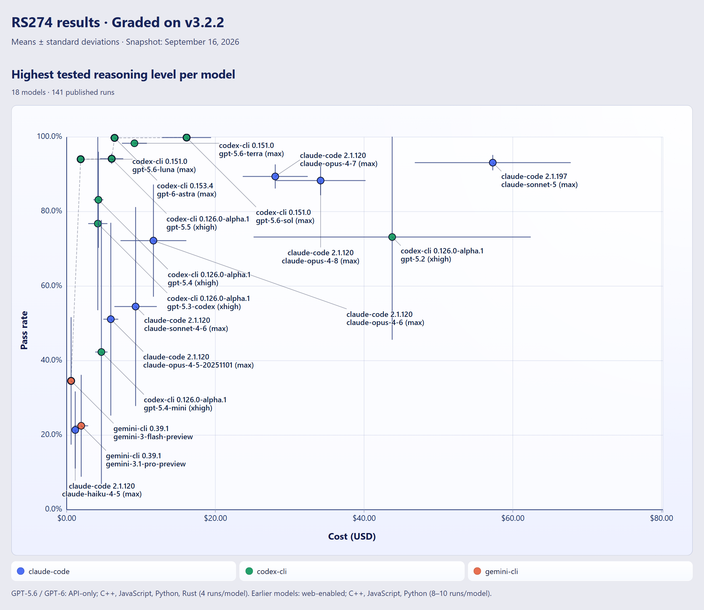
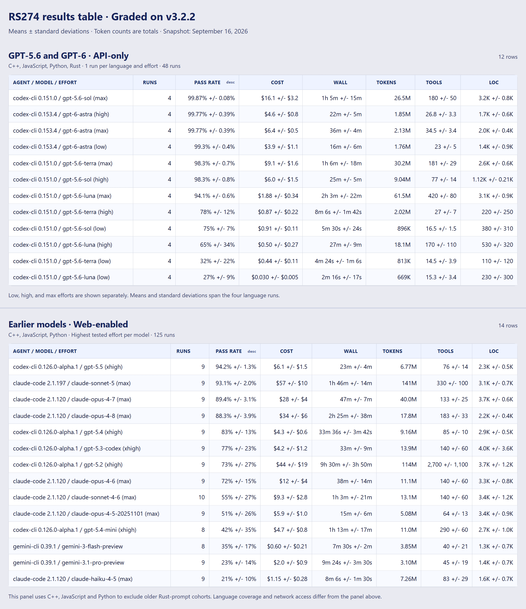

# CLISpecBench

[](https://github.com/mknutso-2/CLISpecBench/actions/workflows/ci.yml)
[](LICENSE)

A benchmark suite for evaluating AI coding agents on their ability to develop
CLI applications from large, well-defined specifications (130k to 2.8M tokens).

As AI agents become more capable, it becomes harder to write evals that are
simultaneously well specified, large, and difficult enough to produce useful
signal. CLISpecBench addresses that by turning existing high-quality specifications into
coding-agent tasks: ISO standards, protocol specifications, file-format
references, API contracts, and other documents that already define behavior in
detail. Eval authors can focus on the executable boundary: converting source
material into a machine-readable corpus when needed, defining a clean CLI
interface, and writing hidden tests that score the resulting implementation.

The CLI boundary gives every eval a consistent interface while still allowing
agents to write submissions in virtually any programming language. The harness
builds each submission in Docker and reports scores as the percentage of hidden
tests passed. The repo currently includes 8 evals across domains, a Docker-based
harness that runs evals against coding agents in a consistent environment, and a
browser-based results explorer.

What makes CLISpecBench unique:
- **40-160 Hour Tasks**: Each eval asks agents to complete implementation work that would take a typical developer significant time without AI assistance.
- **Multi-language Evaluation**: Asking the agent to produce a CLI application allows CLISpecBench to evaluate output written in virtually any language; the harness currently supports C++, Rust, Python, and JavaScript.
- **Repeated-Run Scoring**: Results are generated multiple times at each model's highest supported reasoning effort (3x per language across all 4 languages, for a total of 12 runs per agent-model/eval pair) to capture variability and consistency.

Below are CLISpecBench results for the flagship RS274 eval. Full results are available in the [interactive results dashboard](https://mknutso-2.github.io/CLISpecBench/web/results-dashboard.html), which lets you slice results by eval, language, agent/model pair, and more.




## Table of Contents

- [Core Concepts](#core-concepts)
- [Repository Layout](#repository-layout)
- [Eval List](#eval-list)
- [Getting Started](#getting-started)
  - [Requirements](#requirements)
  - [Linting and Formatting](#linting-and-formatting)
  - [Environment Setup](#environment-setup)
  - [Running Tests](#running-tests)
- [Running an Eval](#running-an-eval)
  - [How the Harness Runs an Eval](#how-the-harness-runs-an-eval)
  - [Quickstart](#quickstart)
  - [Publish Official Results](#publish-official-results)
  - [Viewing Published Results](#viewing-published-results)
- [Adding to the Benchmark](#adding-to-the-benchmark)
  - [Adding a Coding Agent](#adding-a-coding-agent)
  - [Adding a New Eval](#adding-a-new-eval)
  - [Adding a Reference Implementation to an Existing Eval](#adding-a-reference-implementation-to-an-existing-eval)
  - [Adding a New Shared Evaluation Language](#adding-a-new-shared-evaluation-language)
- [License](#license)

## Core Concepts

The repo is organized around a few core concepts:

| Concept | Meaning | Main locations |
|---|---|---|
| **Coding agent** | The external tool being benchmarked. Today this is usually one of `antigravity-cli`, `claude-code`, `codex-cli`, `copilot-cli`, `gemini-cli`, `opencode`, or `openhands`. | Wrapped by files under `src/clispecbench/agents/` and containerized from `docker/agents/` |
| **Eval** | A benchmark task: prompt materials, hidden tests, and reference implementations for one problem domain. | `Evals/<Task>/` |
| **Task** | An eval-language pair. Examples: `wordcount-cpp`, `wordcount-rs`, `rs274-js`. | Registered in `src/clispecbench/harness/task.py` |
| **Eval harness** | The repo code that prepares prompts, runs agents, builds submissions, runs hidden tests, scores results, and records metadata. | `src/clispecbench/harness/`, `src/clispecbench/build/`, `src/clispecbench/cli.py` |
| **Repo tests** | Tests for the harness, build backends, and agent adapters themselves. These are distinct from an eval's hidden tests. | `src/clispecbench/tests/` |

## Repository Layout

```
Evals/                   # Evaluation tasks (one directory per task)
  _shared/               #   Shared language-requirements prompts
  BibTeX/                #   BibTeX parser and formatter eval
  GEDCOM/                #   GEDCOM genealogy parser/writer eval
  ICal/                  #   iCalendar parser/writer eval
  IGES/                  #   IGES CAD interchange parser/writer eval
  LAS/                   #   ASPRS LAS point-cloud parser/writer eval
  MARC21/                #   MARC21 bibliographic record parser/writer eval
  RS274/                 #   CNC G-code interpreter eval
  WordCount/             #   Word frequency counter (toy eval for harness testing)
docs/                    # Design docs, operational notes, and exploratory notes
src/clispecbench/        # Python package
  agents/                #   One adapter module per coding agent
  build/                 #   Multi-language submission build backends
  harness/               #   Eval orchestration, Docker, scoring, results
  tests/                 #   Harness/adapter/build tests
docker/                  # Dockerfiles (base image + per-agent images)
  agents/                #   One Dockerfile per CLI coding agent
published_results/
  web/                   #   Local results dashboard and generated aggregates
scripts/                 # Setup and utility scripts
.codex/skills/           # Repo-specific Codex workflow skills
.claude/skills/          # Parallel Claude workflow skills
```

## Eval List

RS274 serves as the flagship eval of the benchmark. The documentation corpus and hidden test suite were curated by a domain expert
to create a comprehensive, challenging task for coding agents. The tests were written with the aid of coding agents but manually
reviewed.

The other evals were chosen, designed, implemented, and critiqued primarily by coding agents without domain-expert review. The
signal from these evals is likely weaker than RS274's and should be interpreted accordingly.

Token counts for each eval are presented below. Prompt and documentation token counts are local estimates, not provider-reported
billing telemetry. They were counted with `tiktoken`'s
`o200k_base` encoding over the raw UTF-8 prompt and `docs/` file text as
shipped in the repo, with no Markdown, HTML, TeX, or other markup stripping.
Actual provider tokenizers can vary.

Current shared language prompt sizes are: C++ 72 tokens, Python 72 tokens,
JavaScript 90 tokens, and Rust 155 tokens.

| Eval | Base prompt tokens | Technical prompt tokens | Language prompt range | `docs/` tokens |
|---|---:|---:|---:|---:|
| RS274 | 211 | 6,195 | 72-155 | 1,160,866 |
| BibTeX | 429 | 778 | 72-155 | 153,023 |
| GEDCOM | 179 | 1,119 | 72-155 | 138,470 |
| ICal | 488 | 4,302 | 72-155 | 226,246 |
| IGES | 142 | 18,817 | 72-155 | 1,253,040 |
| LAS | 325 | 2,756 | 72-155 | 362,021 |
| MARC21 | 271 | 1,103 | 72-155 | 2,838,927 |
| WordCount | 76 | 160 | 72-155 | 638 |

## Getting Started

### Requirements

Requirements depend on what you plan to do on the **host machine**:

- **Always needed on the host**
  - **Python 3.11+** with [uv](https://docs.astral.sh/uv/) (or pip) — needed to
    install dependencies, run `clispecbench`, and run the pure-Python test suite.
  - **Docker Engine** in WSL2 (Windows) or native Docker (Linux/macOS) — needed for
    normal `clispecbench run` usage, container smoke tests, auth smoke tests, and
    any workflow that uses the sandbox images.
- **Needed on the host only for local reference-implementation workflows**
  - **CMake + a C++ compiler** — needed if you run C++ reference implementations or
    point tests at a local C++ submission with `--implementation-root`.
    - **C++20** is the shared prompt/harness baseline and is sufficient for the current
      `RS274` and `WordCount` C++ reference implementations.
    - **C++23-capable compiler** is needed if you also want to build/run the current
      `IGES` C++ reference implementation.
  - **Node.js 22+** — needed only if you run JavaScript reference implementations on
    the host, such as `pytest Evals/WordCount/tests --language=js` or
    `pytest Evals/RS274/tests --language=js`.
  - **Rust stable** via [rustup](https://rustup.rs/) — needed only if you run Rust
    reference implementations on the host, such as
    `pytest Evals/WordCount/tests --language=rs` or `pytest Evals/RS274/tests --language=rs`.
    The repo's shared Rust prompt currently targets **Rust 2021 or later**.
- **Bundled in the Docker images, so not required on the host just to run evals**
  - **Node.js 22+** for the CLI-agent containers
  - **Rust stable** in `docker/base.Dockerfile` for sandbox/test-runner `--language=rs` workflows

### Linting and Formatting

This repository uses [Ruff](https://docs.astral.sh/ruff/) for linting and
formatting, and [Pyright](https://github.com/microsoft/pyright) for type
checking. Both are enforced in CI.

```bash
uv run ruff check          # lint
uv run ruff format         # format
uv run pyright             # type-check
```

For agent-assisted maintenance, use the parallel build/lint skills:
`.codex/skills/build-and-lint/SKILL.md` and
`.claude/skills/build-and-lint/SKILL.md`. Both capture the expected Ruff,
Pyright, pytest, and Docker validation workflow.

### Environment Setup

#### 1. Install Python dependencies

```bash
uv sync          # or: pip install -e ".[dev]"
```

#### 2. Install Docker (Windows, one-time)

Run the install script from a WSL terminal (requires sudo password).
This only needs to be done once per machine -- Docker persists across reboots.

```bash
wsl -d Ubuntu
bash /mnt/c/Git/CLISpecBench/scripts/install-docker-wsl.sh
```

After install, add your user to the docker group and restart WSL:

```bash
sudo usermod -aG docker $USER
exit
wsl --shutdown
```

#### 3. Build Docker images

Build the base image and per-agent images:

```bash
MSYS_NO_PATHCONV=1 bash scripts/build-docker-images.sh
```

This creates `clispecbench-base:latest` (Ubuntu 24.04, CMake, g++-14, pytest)
and CLI agent images (`clispecbench-claude-code`,
`clispecbench-codex-cli`, `clispecbench-copilot-cli`,
`clispecbench-gemini-cli`) that extend it. Additional Dockerfiles under
`docker/agents/`, such as `antigravity-cli`, are auto-discovered by the
build script.

#### 4. Authenticate CLI agents

Log in to each agent CLI **on the host that runs the Python harness** --
the harness mounts that host's home-directory credentials into the
container at runtime.

- **Windows + WSL2 Docker** (the typical Windows setup): run the CLIs on
  Windows so credentials land in `C:\Users\<you>\.claude\`, `\.codex\`,
  `\.gemini\`, and `C:\Users\<you>\AppData\Roaming\GitHub CLI\hosts.yml`.
  The harness translates these to `/mnt/c/Users/<you>/...` for the WSL2
  daemon. Authenticating inside WSL Ubuntu does **not** work for this setup
  -- the harness never reads the WSL home.
- **Native Linux / macOS**: run the CLIs on the same host where you'll
  invoke `clispecbench`. Credentials in `~/.claude/`, `~/.codex/`,
  `~/.gemini/`, and `~/.config/gh/hosts.yml` are mounted directly.

```bash
claude auth login     # Claude Code
codex login           # Codex CLI
gh auth login         # GitHub CLI token used by GitHub Copilot CLI
gemini                # Gemini CLI - Select "Sign in with Google"
```

GitHub Copilot CLI can also consume `COPILOT_GITHUB_TOKEN`, `GH_TOKEN`, or
`GITHUB_TOKEN`, but `gh auth login` is the default host-auth path used by the
harness and smoke tests.

Antigravity CLI support is experimental and should not be used for counted
CLISpecBench results yet. With a TTY and the credential workaround below, `agy`
1.0.2 can run CLISpecBench tasks end-to-end: it writes implementation files
under `/workspace/output`, the harness builds them, runs hidden tests, and writes
normal `result.json` correctness scores. The adapter records
`gemini-3.5-flash` as the fixed default model label, but 1.0.2 does not expose
model, effort/reasoning, prompt-file, JSON, or output-file flags. Post-run logs
can verify labels such as `Gemini 3.5 Flash (Medium)`, but the harness cannot
force a model or reasoning level per invocation.

Antigravity's stdout remains unreliable outside a TTY. Public reports and local
smoke tests show that `agy --print` can authenticate, complete the model call,
and exit 0 while emitting zero captured stdout in non-TTY/subprocess mode. The
harness therefore runs Antigravity with a TTY and grades the files written under
`/workspace/output`; `transcript.jsonl` is only the captured TTY/stdout text. A
richer Antigravity JSONL transcript is written under
`~/.gemini/antigravity-cli/brain/<conversation-id>/.system_generated/logs/`, but
the harness does not yet copy the matching conversation into the run directory
or scrub account/auth metadata from logs. Antigravity also does not currently
provide parseable token usage, so `token_usage` and estimated cost are `null`.

The CLI uses file-based token storage when it detects a container, and 1.0.2
appears to improve some WSL auth-persistence cases, but Windows Credential
Manager auth is not portable into Linux Docker automatically. A local workaround
is to seed `~/.gemini/antigravity-cli/antigravity-oauth-token` from the Windows
Credential Manager `gemini:antigravity` entry before mounting
`~/.gemini/antigravity-cli`; that file contains a plaintext OAuth refresh token
and must not be committed or logged. The Docker auth smoke test may fail with an
authentication timeout if that token file is absent, or with empty output until
upstream provides a reliable headless `--print` path such as stdout, JSON, or
`--output`.

To verify auth works end-to-end inside containers, see the **Auth smoke
tests** sub-section under [Running Tests](#running-tests).

### Running Tests

This project has four categories of tests. CI runs the first three on
every PR; the fourth is a hand-run diagnostic for new-machine setup.

| Category                                                  | Location                                       | Runner   | Cost                | Prereqs                              |
|-----------------------------------------------------------|------------------------------------------------|----------|---------------------|--------------------------------------|
| [**Eval reference tests**](#eval-reference-tests)         | `Evals/<task>/tests/`                          | `pytest` | No API cost         | C++ toolchain                        |
| [**Harness unit tests**](#harness-tests)                  | `src/clispecbench/tests/` (unmarked)         | `pytest` | No API cost         | `uv sync`                            |
| [**Container smoke tests**](#harness-tests)               | `src/clispecbench/tests/` (`docker` marker)  | `pytest` | No API cost         | Docker daemon + built images         |
| [**Auth smoke tests**](#auth-smoke-tests)                 | `scripts/smoke-test-*.sh`                      | bash     | ~pennies of tokens  | Docker + agent creds + built images  |

#### Eval reference tests

Each task's hidden test suite, run against its reference implementation:

```bash
pytest Evals/RS274/tests --language=cpp
pytest Evals/IGES/tests --language=cpp
pytest Evals/WordCount/tests --language=cpp
```

Select a target language explicitly (when multiple reference implementations exist):

```bash
pytest Evals/WordCount/tests --language=py
pytest Evals/WordCount/tests --language=js
pytest Evals/WordCount/tests --language=rs
pytest Evals/WordCount/tests --language=cpp
```

Point tests at a different implementation (e.g. an agent's output):

```bash
pytest Evals/WordCount/tests --language=cpp --implementation-root /path/to/agent-output
pytest Evals/WordCount/tests --language=py --implementation-root /path/to/py-output
```

#### Harness tests

The harness has its own pytest suite under `src/clispecbench/tests/`.
Tests are tagged with markers so you can pick a subset:

| Marker          | Meaning                                                      |
|-----------------|--------------------------------------------------------------|
| (unmarked)      | Pure-Python unit tests -- no Docker, no API calls            |
| `docker`        | Spins up real containers; needs Docker daemon + built images |
| `prompts_agent` | Sends a real prompt to an AI coding agent (consumes tokens)  |

Typical filters (mirror what CI runs):

```bash
# Fast unit tests only -- CI's `unit-tests` job
uv run pytest src/clispecbench/tests -m "not docker and not prompts_agent"

# Container smoke tests -- CI's `container-tests` job
# (requires built images -- see "Build Docker images" in Environment Setup)
uv run pytest src/clispecbench/tests -m "docker and not prompts_agent"

# Everything that doesn't cost API tokens
uv run pytest src/clispecbench/tests -m "not prompts_agent"
```

The container tests require the base image and all four CLI agent images to
be built first. From a clean checkout:

```bash
MSYS_NO_PATHCONV=1 bash scripts/build-docker-images.sh
```

(See [3. Build Docker images](#3-build-docker-images) for details.)

##### Windows: pointing pytest at the WSL2 Docker daemon

On Windows, the Python `docker` library's auto-detection doesn't always
find the WSL2 daemon. If a `docker`-marked test fails with
`Cannot connect to Docker daemon`, set `DOCKER_HOST` explicitly:

```bash
DOCKER_HOST=tcp://localhost:2375 uv run pytest src/clispecbench/tests -m "docker and not prompts_agent"
```

This points the harness at the TCP listener that
`scripts/install-docker-wsl.sh` configures on the WSL daemon.

#### Auth smoke tests

To verify each agent CLI authenticates correctly inside its container,
run the per-agent smoke-test scripts. These send a one-word prompt
(`"respond with just the word hello"`) to each agent via its real API,
so they consume a small amount of tokens per run.

These tests require the agent images to be built and the CLIs to be
authenticated on the host. From a clean checkout you'll need to run
both setup steps first if you haven't already:

```bash
# 1. Build base + agent images (see "3. Build Docker images" above)
MSYS_NO_PATHCONV=1 bash scripts/build-docker-images.sh

# 2. Log in to each CLI on the host (see "4. Authenticate CLI agents" above)
```

Then run the smoke tests:

```bash
# All registered auth-smoke agents in one go
MSYS_NO_PATHCONV=1 bash scripts/smoke-test-docker-auth.sh

# Or individually, for debugging
MSYS_NO_PATHCONV=1 bash scripts/smoke-test-claude.sh
MSYS_NO_PATHCONV=1 bash scripts/smoke-test-codex.sh
MSYS_NO_PATHCONV=1 bash scripts/smoke-test-copilot.sh
MSYS_NO_PATHCONV=1 bash scripts/smoke-test-gemini.sh
MSYS_NO_PATHCONV=1 bash scripts/smoke-test-antigravity.sh
OPENROUTER_API_KEY=... MSYS_NO_PATHCONV=1 bash scripts/smoke-test-opencode.sh
```

OpenCode uses OpenRouter by default in this harness. Set
`OPENROUTER_API_KEY` in the shell that launches the run or pass it through
with `--api-key-env OPENROUTER_API_KEY=...`; use full OpenCode model IDs such
as `openrouter/moonshotai/kimi-k2.6`.

These are standalone diagnostics -- not part of `pytest` and not run by
CI. They are the right place to look for the per-agent credential
mounting strategy that the harness uses.

## Running an Eval

For agent-assisted runs, use the `run-eval` skill (available for both Codex and Claude). It covers launching evals, detaching and
monitoring background runs, inspecting transcripts and result JSON, classifying anomalies, and publishing official results.

The rest of this section explains how to run an eval manually.

Official CLISpecBench results are currently generated at the highest reasoning
effort supported by each model when the agent or provider exposes that setting.
This keeps published headline results focused on best-effort capability rather
than reasoning-level sensitivity, though comparing reasoning levels directly may
be useful in a future study.

### How the Harness Runs an Eval

Each eval task follows a standard pipeline:

1. **Prompt assembly** -- The harness concatenates a base prompt (written in the voice of a domain expert with no coding knowledge)
   with the technical requirements prompt, implementation-language-specific instructions such as C++20, and any referenced `docs/` corpus that the agent may consult during implementation.

2. **Agent invocation** -- The agent runs inside a Docker container with the
   prompt, docs, and the host auth credentials for the coding agents mounted.
   Network access follows the study condition documented in
   `docs/operations/Agent-Run-Notes.md`. The original API-only intent was not enforced for
   already-published runs, so the current study preserves the same effective
   access level for comparability.

3. **Build** -- The agent output is prepared and run via a language-specific backend in the
   harness: C++ is built with CMake, Rust with Cargo, and Python/JavaScript submissions
   are run directly.

4. **Test** -- The eval's hidden pytest test suite runs against the built executable.
   Results are captured as structured JSON via pytest-json-report.

5. **Scoring** -- Per-test pass/fail, token usage, timing, and composite scores
   are written to a `RunResult` JSON file at
   `transient_results/<task>/<agent>/<model-effort>/eval<N>/run<M>/result.json`.
   The run folder also stores sibling artifacts (`transcript.jsonl`, `source/`,
   telemetry copies), and `eval<N>/progress.txt` is updated after each completed run.

6. **Publish (optional)** -- Promote a transient result to the official published tree
   by using the `clispecbench publish` command (shown in the next section).

### Quickstart

```bash
clispecbench run --task wordcount-cpp --agent claude-code
clispecbench run --task rs274-cpp --agent codex-cli
clispecbench run --task iges-cpp --agent copilot-cli
```

View results:

```bash
clispecbench results
```

### Publish Official Results

Use `clispecbench publish` to copy a transient result into the published results tree:

```bash
clispecbench publish transient_results/<task>/<agent>/<model-effort>/eval<eval>/run<run>/result.json \
  --status "Complete" \
  --last-message "..." \
  --published-dir published_results
```

The default official root is `published_results`; set `--published-dir` only when
publishing into a different root. Optionally add `--commentary <slug>` if you want
to attach a markdown commentary file.

After publishing, regenerate dashboard data with `clispecbench rebuild-dashboard`, or
pass `--rebuild-dashboard` for one-shot publishes. The run-level
`published_results/web/results-published.json` file is tracked. The per-test
`published_results/web/test-results-published.json` file is a generated local
aggregate for the per-test explorer; it is intentionally ignored because it can
grow past GitHub's file-size limits. Rebuild it locally when needed, but do not
stage it. Public static deployments intentionally omit this file, so the
run-level dashboard remains available remotely while the per-test explorer stays
local-only unless you generate the aggregate yourself.

### Viewing Published Results

Published results include a browser-based viewer under `published_results/web/`.
The run-level dashboard summarizes models, agents, tasks, languages, pass counts,
tokens, pricing, and links into per-run details. The per-test dashboard lets you
filter and compare individual pytest outcomes across published runs.

Coverage is not yet uniform across every agent/model and eval/language pair.
Runs are generated under time and budget constraints, with RS274 receiving the
most complete coverage as the benchmark's flagship eval.

Use the bundled launcher, which picks a free port, starts or reuses a local HTTP
server, and opens the run-level explorer in your browser:

```bash
python published_results/start-dashboard.py
```

VS Code users can run the **Serve: Published Results Dashboard** task
(`Ctrl+Shift+P` → *Tasks: Run Task*) instead of invoking the script manually.

The public viewer can be hosted as a static site from `published_results/`.
The included GitHub Pages workflow deploys the tracked run-level dashboard data
without generating or uploading the ignored local per-test aggregate.

## Adding to the Benchmark

### Adding a Coding Agent

Adding a new coding agent is currently spread across a few touchpoints.

**Required touchpoints**

1. **Add an adapter module** under `src/clispecbench/agents/` that subclasses
   `AgentAdapter`. This is where invocation, credential mounts, token parsing,
   telemetry paths, and allowed hosts live.
2. **Add a Dockerfile** under `docker/agents/<agent-name>.Dockerfile` for the
   container image that runs that agent.
3. **Add a registry entry** in `src/clispecbench/agents/registry.py`. The
   CLI's adapter resolution and `--agent` choices derive from that registry.
4. **Add adapter tests** in `src/clispecbench/tests/test_agents.py`.
5. **Add container smoke coverage** in `src/clispecbench/tests/test_container_smoke.py`.
6. **Add auth smoke coverage**:
   - create `scripts/smoke-test-<agent>.sh`
   - register that script in `src/clispecbench/agents/registry.py`
7. **Update docs** if the setup or workflow differs from existing agents.

**Helpful notes**

- `scripts/build-docker-images.sh` auto-discovers Dockerfiles under `docker/agents/`,
  so adding the Dockerfile is enough for that script to build the new image.
- For CLI agents, credentials should be exposed through the adapter via
  `credential_mounts()` and/or environment variables.
- If the agent needs special network access, update the adapter's
  `allowed_hosts` and verify the runner actually enforces the resulting
  network policy before starting a separately labeled restricted-access run
  series.

### Adding a New Eval

For agent-assisted eval work, use the `author-eval` skill (available for both Codex and Claude). It covers prompts, docs, tests,
reference implementations, task registration, `VERSION`, and `CHANGELOG.md` changes.

The rest of this section explains how to add a new eval manually.

1. **Create the eval directory** under `Evals/<Task>/`.
2. **Add the prompt/docs/tests/reference implementation** under that directory.
3. **If the eval should be invokable through the harness CLI**, register one or
   more task IDs in `src/clispecbench/harness/task.py`.
4. **Validate the reference implementation** by running the hidden test suite
   against it before committing.

Each eval lives in its own directory under `Evals/`. Required structure:

```
Evals/MyTask/
  VERSION                                  # Semver string (e.g. 1.0.1)
  CHANGELOG.md                             # Human-readable change history
  prompt/
    base-prompt.md                         # Non-technical domain expert persona
    technical-requirements-prompt.md       # Language-agnostic harness contract
                                           #   (flags, JSON schema, exit codes)
    docs/                                  # Domain documentation provided to the agent
  tests/
    conftest.py                            # Imports shared fixtures + defines EVAL_CONFIG
    test_build.py                          # Verifies the submission is buildable/runnable
    test_*.py                              # Hidden test suite (language-agnostic)
  reference-implementation-cpp/            # C++ reference (optional per-eval)
    CMakeLists.txt
    src/
  reference-implementation-py/             # Python reference (optional per-eval)
    main.py
  reference-implementation-js/             # JavaScript reference (optional per-eval)
    package.json
    src/
  reference-implementation-rs/             # Rust reference (optional per-eval)
    Cargo.toml
    src/main.rs
```

Language-specific boilerplate (target version, stdlib constraint, build
command, entry-point layout) lives in a shared prompt file outside the eval
directory:

```
Evals/_shared/
  language-requirements-cpp.md             # Shared across all C++ evals
  language-requirements-py.md              # Shared across all Python evals
  language-requirements-js.md              # Shared across all JavaScript evals
  language-requirements-rs.md              # Shared across all Rust evals
```

At prompt assembly time the harness concatenates
`base-prompt.md` + `language-requirements-<lang>.md` + `technical-requirements-prompt.md`,
so each eval only needs to write the eval-specific parts.

Each eval's `conftest.py` re-exports fixtures from
`clispecbench.pytest_plugin` and declares an `EVAL_CONFIG` object
naming the task and its reference-implementation layout. Tests request
the `submission_command` fixture (a command sequence ready to splat into
`subprocess.run`) rather than a concrete executable path, which keeps
them language-agnostic. See `Evals/WordCount/tests/conftest.py` for a
minimal example.

If the eval should be runnable through `clispecbench`, register the eval name
in `_KNOWN_EVALS` in `src/clispecbench/harness/task.py`. Harness-visible task
IDs use `<eval>-<language>` form and are generated from the cross product of
registered eval names and shared `language-requirements-<lang>.md` files.

```python
_KNOWN_EVALS: dict[str, str] = {
    "mytask": "Evals/MyTask",
}
```

The reference implementation should pass all tests before committing. Verify:

```bash
pytest Evals/MyTask/tests --language=cpp -v
pytest Evals/MyTask/tests --language=py -v       # if a Python reference exists
```

#### Versioning

Each eval has a `VERSION` file (semver) and a `CHANGELOG.md`. **Both must be
bumped on any change an agent or scoring run can observe.** That includes:

- Anything under `prompt/` — `base-prompt.md`, `technical-requirements-prompt.md`,
  or any file under `docs/`
- Anything under `tests/`
- The harness contract for this eval (CLI flags, exit codes, output schema)
- Reference implementations, when the change reflects a spec change rather
  than an internal refactor

Use semver:

- **Patch** (`1.0.0` → `1.0.1`) — clarifications, bug fixes, ambiguity
  resolutions that don't change what a correct submission looks like
- **Minor** (`1.0.1` → `1.1.0`) — new tests, expanded contract, additional
  requirements that previously passing submissions might still satisfy
- **Major** (`1.1.0` → `2.0.0`) — breaking changes; previously passing
  submissions may now fail

Pure refactors (renaming an internal helper, reformatting, restructuring a
reference impl without behavior change) do not need a bump. The harness
records `test_suite_version` from the git SHA on every run, but the per-eval
`VERSION` is what humans compare across results — keep them in sync, and
keep the changelog entry concrete enough that you could regenerate the diff
from the description.

#### Prompt authoring guidelines

- `base-prompt.md` should describe the task from a domain expert perspective
  without engineering guidance. The agent should figure out the implementation.
- `technical-requirements-prompt.md` defines only what the harness needs to
  build and test, and should be **language-agnostic**: CLI flags, exit codes,
  output JSON schema. Do not put domain behavior or language-specific
  instructions here.
- `Evals/_shared/language-requirements-<lang>.md` holds the language-specific
  bits (target version, stdlib constraint, build/invoke command, source layout
  and entry point). These files are shared across all evals — only edit them
  when adding a new supported language or changing the harness contract for
  an existing one.
- `docs/` contains reference material the agent can use (specs, standards, etc.).

### Adding a Reference Implementation to an Existing Eval

This is an **eval-local** change. You are adding a reference implementation for
an existing eval in a language the repo already knows how to build and run.

1. **Write the reference implementation** at
   `Evals/<Task>/reference-implementation-<lang>/`. It must satisfy the CLI
   contract defined in that eval's `technical-requirements-prompt.md`.
2. **Update the eval's `conftest.py`** if you want
   `pytest Evals/<Task>/tests --language=<lang>` to find that reference
   implementation automatically when no `--implementation-root` is provided.
   In `EVAL_CONFIG`, add that language to `reference_impl_subdirs`.
3. **Run the hidden test suite** against it until it passes cleanly:
   ```bash
   pytest Evals/<Task>/tests --language=<lang>
   ```
4. **Do not change prompts or tests just because the language changed.**
   The hidden test suite is language-agnostic by construction.

Important distinction:

- Adding a reference implementation does **not** by itself create a new harness
  task.
- Adding a reference implementation also does **not** require new shared
  language support if `<lang>` is already supported by the harness.

Also note that an eval can still be tested against a supported language even if
it has no configured reference implementation for that language. In that case,
provide an explicit target with `--implementation-root` (or the eval-specific
environment variable used by `EVAL_CONFIG`).

### Adding a New Shared Evaluation Language

This is a **repo-wide language-support** change. Do this only when the harness
does not yet know how to build/run a language at all.

Required touchpoints:

1. Add a shared prompt at `Evals/_shared/language-requirements-<lang>.md`.
2. Add build/runtime support in `src/clispecbench/build/backends.py`.
3. Teach the shared pytest plugin about the language in
   `src/clispecbench/pytest_plugin.py`:
   - add it to `SUPPORTED_LANGUAGES`
   - add configured-reference lookup support in `_reference_impl_subdir_for_language()`
   - add backend selection support in `_build_backend_for()`
4. Add any required toolchain/runtime support to the host/docs and, if needed,
   `docker/base.Dockerfile`.

After that repo-wide support exists, you can separately choose whether to:

- add reference implementations for specific evals in that language
- expose specific eval-language pairs as harness tasks in `task.py`

## License

Original CLISpecBench code, benchmark scaffolding, tests, prompts, and the
published results viewer are licensed under the Apache License 2.0. See
`LICENSE`.

The CLISpecBench logo and branding assets are reserved and are not licensed
under Apache-2.0. See `BRAND_ASSETS.md`.

Some evaluation reference materials under `Evals/*/prompt/docs/` mirror or
derive from third-party specifications and source documents. Those materials
remain subject to their original terms. See `THIRD_PARTY_NOTICES.md`.
